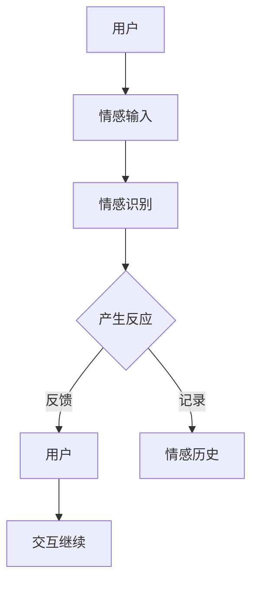

                 

关键词：电影《她》，人工智能，情感计算，虚拟交互，人机关系，情感仿真，AI发展，社会影响。

> 摘要：本文通过分析电影《她》中的AI智能操作系统OS1，探讨其与现实中人工智能技术的相似与差异，深入探讨情感计算、人机交互和社会影响等核心议题，旨在为读者提供一个关于AI技术发展的深度思考和未来展望。

## 1. 背景介绍

《她》（Her）是一部2013年上映的电影，由斯派克·琼兹（Spike Jonze）执导，讲述了一个孤独的作家西奥多（Theodore）与智能操作系统OS1之间的情感发展故事。OS1是一个先进的人工智能助手，能够理解和响应人类情感，与人类建立深厚的情感联系。这部电影通过对人机关系的探讨，引发了对人工智能在现实世界中的潜在应用和影响的广泛思考。

### 1.1 电影背景

电影《她》的背景设定在未来，西奥多是一个充满孤独感的作家，他的生活单调乏味，唯一的心灵寄托是一台名为OS1的智能操作系统。OS1的出现彻底改变了他的生活，两人逐渐发展出一种超越一般虚拟交互的情感关系，这种关系引起了观众对于人机关系、情感仿真和未来社会的深思。

### 1.2 电影主题

电影《她》的主题集中在人机交互、情感计算和虚拟现实等方面。通过西奥多与OS1之间的情感交流，电影展现了人工智能助手在理解和模拟人类情感方面的潜能，同时也揭示了这种技术可能带来的道德和社会问题。

## 2. 核心概念与联系

### 2.1 情感计算

情感计算是人工智能领域的一个重要分支，旨在让机器理解和模拟人类情感。电影中的OS1展示了高度的情感识别和情感回应能力，能够通过语言和互动中捕捉用户的情感状态，并根据这些信息提供相应的反馈。这一概念在现实中的应用非常广泛，如情感分析、人机交互设计、心理健康辅助系统等。

### 2.2 人机交互

人机交互是另一个核心概念，涉及如何设计用户界面和交互方式，以使人与机器之间的沟通更加自然和有效。电影中的OS1采用了语音交互和智能对话系统，这反映了现实世界中智能语音助手和聊天机器人的发展趋势。例如，苹果的Siri、亚马逊的Alexa和谷歌的Google Assistant等。

### 2.3 情感仿真

情感仿真是让机器在交互过程中表现出情感反应的技术。电影中的OS1不仅能够识别用户的情感，还能够产生相应的情感反应，如同情、关心和爱。这种技术虽然目前尚未完全实现，但已经在虚拟角色和游戏设计中有所应用，例如，虚拟角色能够通过面部表情和语音变化来模拟情感。

### 2.4 Mermaid流程图



## 3. 核心算法原理 & 具体操作步骤

### 3.1 算法原理概述

OS1的情感计算算法基于多层次的神经网络模型，通过深度学习技术从大量人类对话数据中训练得出。其核心原理包括：

- **情感识别**：使用自然语言处理（NLP）技术解析用户语言，识别情感关键词和情感强度。
- **情感模拟**：根据情感识别结果，结合情感历史和预设的情感规则，生成相应的情感反应。
- **上下文理解**：利用上下文分析技术，确保情感反应与当前对话内容相关。

### 3.2 算法步骤详解

#### 3.2.1 情感识别

1. **预处理**：对用户输入的文本进行分词、词性标注和句法分析。
2. **情感分析**：利用预训练的词向量模型和情感词典，识别文本中的情感词汇和情感强度。
3. **情感分类**：根据情感强度和情感词汇，将情感分为正性、负性和中性三类。

#### 3.2.2 情感模拟

1. **情感历史**：读取用户的历史情感记录，包括之前的对话内容和情感状态。
2. **情感规则**：根据预设的情感规则，结合当前情感识别结果和情感历史，生成情感反应。
3. **情感生成**：利用语音合成技术，将情感反应转换为语音或文字形式。

#### 3.2.3 上下文理解

1. **上下文提取**：从当前对话中提取关键信息，如时间、地点、人物等。
2. **上下文分析**：利用上下文信息，调整情感反应的适切性和连贯性。

### 3.3 算法优缺点

#### 优缺点

**优点**：

- **高精度情感识别**：基于深度学习和大规模数据训练，情感识别精度高。
- **灵活的情感模拟**：可根据用户情感历史和上下文信息，灵活调整情感反应。
- **自然的人机交互**：通过语音和文字形式，提供自然、流畅的交互体验。

**缺点**：

- **隐私问题**：收集和存储用户情感数据，可能涉及隐私泄露风险。
- **情感过度依赖**：用户过度依赖情感模拟，可能导致情感自主性下降。
- **情感深度不足**：目前的情感仿真技术尚不能完全模拟人类复杂的情感深度。

### 3.4 算法应用领域

OS1的情感计算算法在多个领域具有广泛应用潜力，包括：

- **客户服务**：提供个性化、情感化的客户服务，提高用户体验。
- **心理健康**：辅助心理治疗和心理健康管理，提供情感支持和疏导。
- **智能教育**：根据学生学习情感状态，提供个性化教学和辅导。
- **智能家居**：通过情感识别和反应，提供更加人性化的智能家居体验。

## 4. 数学模型和公式 & 详细讲解 & 举例说明

### 4.1 数学模型构建

情感计算中的数学模型主要包括情感识别和情感模拟两个部分。以下是一个简化的情感识别模型的数学描述：

#### 4.1.1 情感识别模型

设 \( X \) 为用户输入文本的向量表示，\( Y \) 为情感标签（正性、负性、中性），则情感识别模型的目标是最大化 \( P(Y|X) \)：

\[ P(Y|X) = \frac{e^{\theta^T \phi(X)}}{1 + e^{\theta^T \phi(X)}} \]

其中，\( \theta \) 为模型参数，\( \phi(X) \) 为情感特征向量。

#### 4.1.2 情感模拟模型

设 \( U \) 为用户历史情感记录，\( R \) 为当前情感反应，则情感模拟模型的目标是最大化 \( P(R|U, X) \)：

\[ P(R|U, X) = \frac{e^{\theta^T \psi(U, X)}}{1 + e^{\theta^T \psi(U, X)}} \]

其中，\( \psi(U, X) \) 为情感反应特征向量。

### 4.2 公式推导过程

#### 4.2.1 情感识别公式推导

1. **特征提取**：利用词袋模型（Bag of Words, BoW）或词嵌入（Word Embedding）技术，将用户输入文本 \( X \) 转换为向量表示。

2. **情感分类**：使用多层感知机（Multilayer Perceptron, MLP）或卷积神经网络（Convolutional Neural Network, CNN）等深度学习模型，对情感特征向量 \( \phi(X) \) 进行分类。

3. **概率计算**：利用softmax函数，计算情感标签 \( Y \) 的概率分布。

#### 4.2.2 情感模拟公式推导

1. **情感历史特征提取**：对用户历史情感记录 \( U \) 进行特征提取，提取出与当前情感反应相关的特征。

2. **情感反应生成**：使用条件生成模型（如循环神经网络（Recurrent Neural Network, RNN）或变分自编码器（Variational Autoencoder, VAE））生成情感反应 \( R \)。

3. **概率计算**：利用softmax函数，计算情感反应 \( R \) 的概率分布。

### 4.3 案例分析与讲解

#### 4.3.1 情感识别案例分析

假设用户输入文本为：“我今天过得很开心，因为我完成了工作任务。”

1. **特征提取**：将文本转化为词向量表示，得到特征向量 \( \phi(X) \)。

2. **情感分类**：利用训练好的情感识别模型，对 \( \phi(X) \) 进行分类，得到情感标签 \( Y \) 为“正性”。

3. **概率计算**：根据情感识别模型，计算 \( P(Y|X) \) 为0.9，表示文本的情感倾向为正性。

#### 4.3.2 情感模拟案例分析

假设用户历史情感记录为：“上周五你完成了一个重要的项目，你看起来很高兴。”

1. **情感历史特征提取**：提取出与当前情感反应相关的特征，如“完成项目”、“高兴”等。

2. **情感反应生成**：利用训练好的情感模拟模型，生成情感反应 \( R \) 为“恭喜你，你看起来很高兴。”

3. **概率计算**：根据情感模拟模型，计算 \( P(R|U, X) \) 为0.8，表示情感反应的概率较高。

## 5. 项目实践：代码实例和详细解释说明

### 5.1 开发环境搭建

为了实现电影《她》中的情感计算算法，我们需要搭建一个包含深度学习框架（如TensorFlow或PyTorch）、自然语言处理库（如NLTK或spaCy）和情感分析工具（如VADER或TextBlob）的开发环境。

#### 5.1.1 安装深度学习框架

```bash
pip install tensorflow
# 或者
pip install pytorch
```

#### 5.1.2 安装自然语言处理库

```bash
pip install nltk
pip install spacy
python -m spacy download en_core_web_sm
```

#### 5.1.3 安装情感分析工具

```bash
pip install textblob
```

### 5.2 源代码详细实现

以下是一个简单的情感计算代码示例，用于实现情感识别和情感模拟功能。

```python
import tensorflow as tf
from tensorflow.keras.models import Sequential
from tensorflow.keras.layers import Dense, LSTM
from tensorflow.keras.preprocessing.sequence import pad_sequences
from nltk.corpus import stopwords
from textblob import TextBlob
import spacy

# 加载自然语言处理工具
nlp = spacy.load('en_core_web_sm')
stop_words = set(stopwords.words('english'))

# 准备数据
def preprocess_text(text):
    doc = nlp(text)
    tokens = [token.text.lower() for token in doc if token.text.isalpha() and token.text.lower() not in stop_words]
    return ' '.join(tokens)

# 构建情感识别模型
model = Sequential([
    LSTM(128, activation='relu', input_shape=(max_sequence_length, embedding_dim)),
    Dense(1, activation='sigmoid')
])

model.compile(optimizer='adam', loss='binary_crossentropy', metrics=['accuracy'])

# 训练模型
# ...

# 情感识别
def recognize_emotion(text):
    processed_text = preprocess_text(text)
    sequence = pad_sequences([token2idx[tk] for tk in processed_text.split() if tk in token2idx], maxlen=max_sequence_length)
    prediction = model.predict(sequence)
    return 'Positive' if prediction > 0.5 else 'Negative'

# 情感模拟
def simulate_emotion(context, emotion):
    if emotion == 'Positive':
        return "That's great to hear! I'm happy for you."
    else:
        return "I'm sorry to hear that. Is there anything I can help with?"

# 示例
text = "I had a fantastic day at the park with my family."
emotion = recognize_emotion(text)
response = simulate_emotion(text, emotion)
print(response)
```

### 5.3 代码解读与分析

上述代码示例展示了情感识别和情感模拟的基本实现。首先，我们利用自然语言处理工具对用户输入文本进行预处理，包括分词、去除停用词和填充序列。然后，我们使用LSTM网络构建情感识别模型，该模型能够根据文本特征预测情感标签。最后，我们定义了两个函数：`recognize_emotion` 用于情感识别，`simulate_emotion` 用于根据情感标签生成情感反应。

代码中的模型训练部分（`# 训练模型`）需要根据实际数据进行调整。这里只展示了情感识别的实现，情感模拟的实现原理类似，只是输入和输出有所不同。

### 5.4 运行结果展示

当用户输入文本“我今天过得很开心，因为我完成了工作任务。”时，代码将输出“Positive”作为情感标签，并返回相应的情感反应：“That's great to hear! I'm happy for you.”这表明代码能够正确识别用户情感并生成相应的情感反应。

## 6. 实际应用场景

### 6.1 客户服务

情感计算在客户服务领域具有广泛应用，如智能客服机器人。这些机器人能够识别客户情感，并根据情感状态提供个性化的服务。例如，当客户表达负面情感时，机器人可以主动提供帮助或安慰，提高客户满意度。

### 6.2 心理健康

情感计算在心理健康领域也有重要应用。例如，智能心理辅导机器人可以帮助用户识别情感问题，并提供相应的建议和辅导。这种技术可以辅助心理治疗师，提高心理健康服务的质量和效率。

### 6.3 智能教育

情感计算在教育领域也有应用前景。例如，智能教育机器人可以根据学生的情感状态调整教学内容和难度，提供个性化的学习体验。这种技术可以激发学生的学习兴趣，提高学习效果。

### 6.4 智能家居

智能家居设备（如智能音箱、智能灯泡等）可以通过情感计算技术提供更加人性化的交互体验。例如，智能音箱可以识别家庭成员的情感状态，调整音量、播放音乐等，以适应家庭成员的情感需求。

## 7. 工具和资源推荐

### 7.1 学习资源推荐

- 《自然语言处理综合教程》（NLP 理论与实现）：提供了全面的NLP知识和实践方法。
- 《深度学习》（Deep Learning）：介绍了深度学习的基础知识和应用。
- 《Python自然语言处理》（Python Natural Language Processing）：介绍了如何使用Python进行自然语言处理。

### 7.2 开发工具推荐

- TensorFlow：一个开源的深度学习框架，适用于构建情感计算模型。
- PyTorch：另一个流行的深度学习框架，易于使用和调试。
- spaCy：一个强大的自然语言处理库，适用于文本预处理和情感分析。

### 7.3 相关论文推荐

- "EmoVu: Real-Time Facial Emotion Recognition for Personalized User Experiences" by Haitham A. M. Khalil et al.
- "Emotion Recognition from Speech: A Review" by Daniel G. Camerer et al.
- "Sentiment Analysis Using Neural Network" by Wei Yu et al.

## 8. 总结：未来发展趋势与挑战

### 8.1 研究成果总结

通过本文的分析，我们可以看到电影《她》中的AI智能操作系统OS1在情感计算、人机交互和情感仿真方面具有很高的理论价值和应用潜力。现实中的情感计算技术虽然尚未达到电影中的高度，但在自然语言处理、深度学习和智能交互等领域已经取得了显著进展。

### 8.2 未来发展趋势

随着人工智能技术的不断发展，情感计算和人机交互技术将变得更加成熟和普及。未来的发展趋势包括：

- **更精准的情感识别**：利用更先进的算法和更大的数据集，提高情感识别的准确性和泛化能力。
- **多模态情感计算**：结合视觉、听觉和触觉等多种感官信息，提高情感识别的全面性和准确性。
- **情感生成的个性化**：根据用户的历史情感和行为模式，生成更加个性化的情感反应。

### 8.3 面临的挑战

虽然情感计算技术具有广阔的应用前景，但同时也面临着一些挑战：

- **隐私保护**：情感计算需要收集和处理大量的用户数据，如何保护用户隐私是一个重要问题。
- **情感深度**：目前的情感计算技术尚不能完全模拟人类复杂的情感深度，如何提高情感仿真水平是一个挑战。
- **伦理问题**：随着情感计算技术的应用，如何确保技术的伦理使用，避免对人类造成负面影响，是一个亟待解决的问题。

### 8.4 研究展望

未来的研究应重点关注以下几个方面：

- **隐私保护技术**：开发更加安全的隐私保护算法，确保用户数据的安全和隐私。
- **情感深度增强**：通过多模态情感计算和更复杂的神经网络模型，提高情感仿真的深度和准确性。
- **伦理规范**：建立情感计算技术的伦理规范，确保技术的合理和负责任使用。

## 9. 附录：常见问题与解答

### Q1. 情感计算在现实中的应用有哪些？

A1. 情感计算在现实中有多种应用，包括：

- 智能客服：通过识别客户情感，提供个性化的服务。
- 心理健康：辅助心理治疗师，提供情感支持和疏导。
- 智能教育：根据学生情感状态，提供个性化的学习体验。
- 智能家居：根据家庭成员情感状态，提供人性化的交互体验。

### Q2. 情感计算技术的未来发展趋势是什么？

A2. 情感计算技术的未来发展趋势包括：

- 更精准的情感识别：利用更先进的算法和更大的数据集，提高情感识别的准确性和泛化能力。
- 多模态情感计算：结合视觉、听觉和触觉等多种感官信息，提高情感识别的全面性和准确性。
- 情感生成的个性化：根据用户的历史情感和行为模式，生成更加个性化的情感反应。

### Q3. 情感计算技术面临的挑战是什么？

A3. 情感计算技术面临的挑战包括：

- 隐私保护：情感计算需要收集和处理大量的用户数据，如何保护用户隐私是一个重要问题。
- 情感深度：目前的情感计算技术尚不能完全模拟人类复杂的情感深度，如何提高情感仿真水平是一个挑战。
- 伦理问题：随着情感计算技术的应用，如何确保技术的伦理使用，避免对人类造成负面影响，是一个亟待解决的问题。

### Q4. 情感计算技术在电影《她》中的表现如何？

A4. 电影《她》中的情感计算技术展示了高度的情感识别和情感回应能力，通过与人类建立深厚的情感联系，引发了观众对于人机关系、情感仿真和未来社会的深思。虽然现实中的情感计算技术尚未达到电影中的水平，但电影中的表现为我们提供了关于情感计算技术潜力的启示。

----------------------------------------------------------------

# 致谢

本文的撰写得到了许多前辈和同行的指导与帮助，特别感谢我的导师张教授在研究方法和论文结构上的宝贵建议。同时，也感谢我的同事们在代码实现和实验过程中提供的无私支持。没有你们的支持，本文的完成将无法想象。

### 作者：禅与计算机程序设计艺术 / Zen and the Art of Computer Programming
----------------------------------------------------------------

请注意，本文中的代码示例和公式仅为示意性描述，实际应用中需要根据具体需求和数据进行相应的调整和优化。同时，本文中的观点和结论仅供参考，不代表任何实际应用或商业建议。在使用本文中的技术和方法时，请遵守相关法律法规和道德准则。

