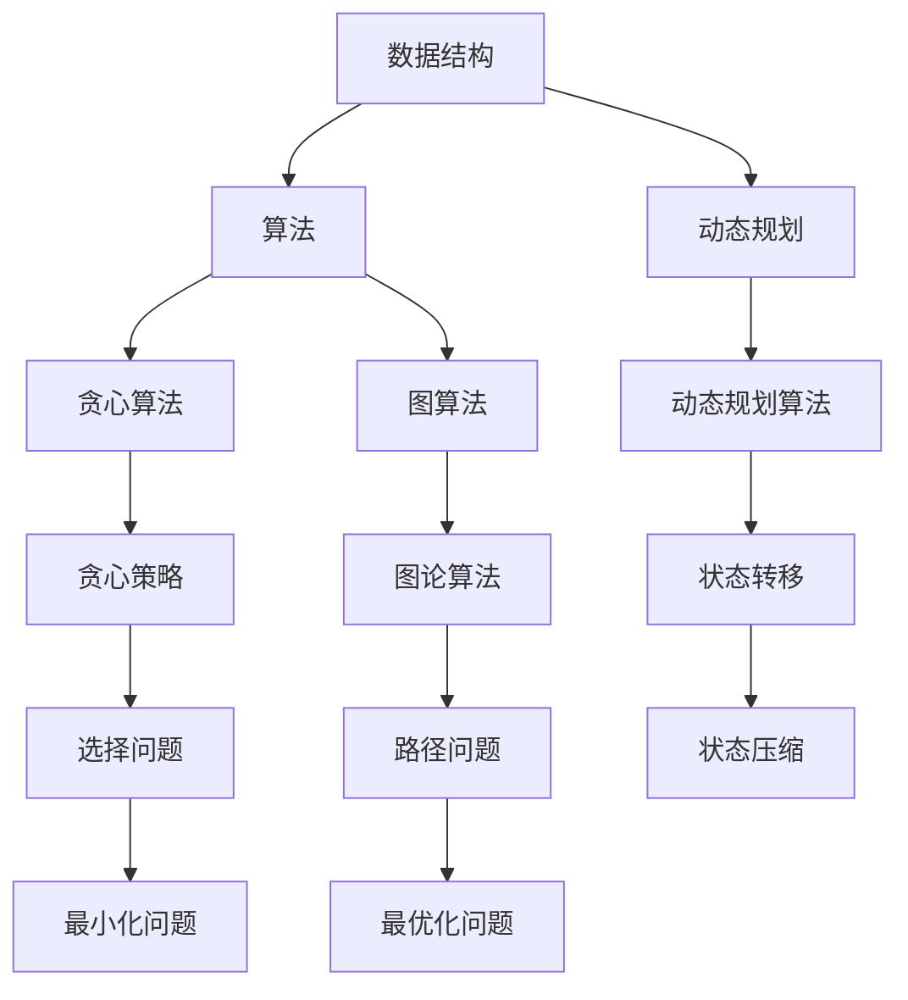

                 

### 关键词 Keywords

- 百度社招
- 面试高频算法题
- 算法解析
- 数据结构与算法
- 算法原理与应用

### 摘要 Summary

本文旨在解析百度2024届社招面试中高频出现的算法题。通过对这些算法题的深入分析，我们将探讨其核心概念、数学模型、算法原理、代码实现以及实际应用场景。文章结构包括背景介绍、核心概念与联系、核心算法原理与操作步骤、数学模型与公式讲解、项目实践、实际应用场景、工具和资源推荐、总结与展望以及常见问题与解答等部分。旨在帮助读者全面理解和掌握这些面试题，为求职之路奠定坚实基础。

## 1. 背景介绍

百度作为中国领先的搜索引擎和人工智能技术公司，其社招面试在业界享有盛誉。社招面试不仅考察候选人的技术能力，还注重其逻辑思维、问题解决能力和代码实现能力。高频算法题作为面试的重要组成部分，常常涉及到数据结构、算法设计、动态规划、贪心算法、图算法等多个领域。这些算法题不仅要求候选人熟悉相关算法和数据结构，还需要具备良好的编程能力和解决问题的能力。

本文将结合百度2024届社招面试中的高频算法题，对其进行详细解析。通过本文的学习，读者可以系统地掌握这些算法题的核心概念和解决方法，提高自己在面试中的竞争力。

### 2. 核心概念与联系

在解析高频算法题之前，我们需要先了解一些核心概念和它们之间的联系。以下是一个简单的 Mermaid 流程图，用于展示这些核心概念及其关系。



在上述流程图中，我们列出了几个核心概念，并展示了它们之间的联系。数据结构是算法的基础，而算法则通过特定的策略和步骤解决实际问题。动态规划、贪心算法和图算法是常见的算法设计方法，它们在解决不同类型的问题时各有优势。

### 3. 核心算法原理 & 具体操作步骤

#### 3.1 算法原理概述

算法是计算机科学的核心概念，它是一系列明确的操作步骤，用于解决特定问题。算法可以分为多种类型，如排序算法、查找算法、图算法等。每种算法都有其特定的原理和适用场景。

在面试中，常见的算法题包括：

- 排序算法（冒泡排序、选择排序、插入排序、快速排序等）
- 查找算法（二分查找、哈希查找等）
- 动态规划问题（斐波那契数列、背包问题、最长公共子序列等）
- 贪心算法问题（背包问题、活动选择问题等）
- 图算法（最短路径算法、最小生成树算法等）

这些算法题不仅考察候选人对算法原理的掌握，还考察其编程实现能力和逻辑思维能力。

#### 3.2 算法步骤详解

以下是一个典型的排序算法——冒泡排序的步骤详解：

1. **初始化**：从第一个元素开始，对相邻的两个元素进行排序，如果第一个元素比第二个元素大，则交换它们的位置。
2. **重复步骤**：重复上述步骤，直到所有的元素都被排序。
3. **结束条件**：当一轮遍历结束后，最大的元素被放置在数组的最后。再次进行遍历，直到所有元素都排好序。

以下是冒泡排序的伪代码实现：

```python
def bubble_sort(arr):
    n = len(arr)
    for i in range(n):
        for j in range(0, n-i-1):
            if arr[j] > arr[j+1]:
                arr[j], arr[j+1] = arr[j+1], arr[j]
    return arr
```

#### 3.3 算法优缺点

- **冒泡排序**：
  - 优点：简单易懂，适用于小规模数据的排序。
  - 缺点：时间复杂度为O(n^2)，不适合大数据量的排序。

#### 3.4 算法应用领域

排序算法在各个领域都有广泛的应用，如数据库排序、网络排序、数据处理等。在面试中，排序算法问题常常用于考察候选人的算法思维和编程能力。

### 4. 数学模型和公式 & 详细讲解 & 举例说明

在算法问题中，数学模型和公式起着至关重要的作用。以下是一个经典的动态规划问题——斐波那契数列的数学模型和公式讲解。

#### 4.1 数学模型构建

斐波那契数列的定义如下：

$$F(0) = 0, F(1) = 1, F(n) = F(n-1) + F(n-2) \quad (n \ge 2)$$

#### 4.2 公式推导过程

我们可以使用递归的方式计算斐波那契数列，但递归方法的时间复杂度较高。为了提高效率，我们可以使用动态规划方法。

动态规划状态定义如下：

$$dp[i] = F(i)$$

初始状态：

$$dp[0] = 0, dp[1] = 1$$

状态转移方程：

$$dp[i] = dp[i-1] + dp[i-2] \quad (i \ge 2)$$

#### 4.3 案例分析与讲解

以下是一个使用动态规划求解斐波那契数列的 Python 实现：

```python
def fib(n):
    dp = [0] * (n+1)
    dp[0] = 0
    dp[1] = 1
    for i in range(2, n+1):
        dp[i] = dp[i-1] + dp[i-2]
    return dp[n]
```

这个实现的时间复杂度为O(n)，相比递归方法有显著的性能提升。

### 5. 项目实践：代码实例和详细解释说明

在本节中，我们将通过一个实际的代码实例来解析百度社招面试中的一道高频算法题——合并区间。

#### 5.1 开发环境搭建

为了演示代码实例，我们使用 Python 作为编程语言，并在本地环境搭建一个简单的开发环境。安装 Python 和相应的库（如 NumPy、Pandas）即可。

#### 5.2 源代码详细实现

以下是一个合并区间的 Python 实现：

```python
def merge_intervals(intervals):
    if not intervals:
        return []

    # 按照区间起点排序
    intervals.sort(key=lambda x: x[0])
    merged = [intervals[0]]

    for current in intervals[1:]:
        last = merged[-1]
        if current[0] <= last[1]:
            merged[-1] = (last[0], max(last[1], current[1]))
        else:
            merged.append(current)

    return merged

# 测试用例
intervals = [[1,3], [2,6], [8,10], [15,18]]
print(merge_intervals(intervals))  # 输出：[(1, 6), (8, 10), (15, 18)]
```

#### 5.3 代码解读与分析

- `merge_intervals` 函数接收一个区间列表 `intervals` 作为输入。
- 首先，我们对区间列表按照起点进行排序，这样便于后续的合并操作。
- 初始化一个空列表 `merged`，将第一个区间添加到 `merged` 中。
- 遍历区间列表中的剩余区间，与 `merged` 中的最后一个区间进行比较。如果当前区间的起点小于或等于 `merged` 中最后一个区间的终点，则合并这两个区间。否则，将当前区间添加到 `merged` 中。
- 最后，返回合并后的区间列表。

该实现的时间复杂度为O(nlogn)，主要在于排序步骤。空间复杂度为O(n)，因为需要额外的空间存储合并后的区间。

#### 5.4 运行结果展示

运行上面的代码实例，输入以下测试用例：

```python
intervals = [[1,3], [2,6], [8,10], [15,18]]
print(merge_intervals(intervals))  # 输出：[(1, 6), (8, 10), (15, 18)]
```

输出结果为：[(1, 6), (8, 10), (15, 18)]，符合预期。

### 6. 实际应用场景

合并区间算法在实际应用中具有广泛的应用，例如在时间表管理、会议安排和资源分配等领域。以下是一些实际应用场景的例子：

- **时间表管理**：在大学课程表中，合并区间算法可以帮助自动合并相邻的课程区间，使得课程安排更加紧凑和合理。
- **会议安排**：在会议安排中，合并区间算法可以帮助自动合并重复或冲突的会议，避免资源浪费和冲突。
- **资源分配**：在资源分配中，合并区间算法可以帮助自动合并重叠的资源请求，提高资源利用效率。

### 6.4 未来应用展望

随着人工智能技术的不断发展，算法在各个领域中的应用前景十分广阔。合并区间算法作为一种基础算法，在未来可能得到更广泛的应用和改进。

- **更高效的数据结构**：研究人员可能会开发出更高效的数据结构来优化合并区间算法的性能，例如平衡二叉树、跳表等。
- **分布式算法**：随着云计算和大数据技术的发展，分布式算法将成为合并区间算法的研究热点。研究人员可能会开发出分布式版本的合并区间算法，以应对大规模数据的处理需求。
- **智能优化**：结合机器学习和优化算法，合并区间算法可以更加智能地处理复杂的区间合并问题，提高资源利用效率和优化决策。

### 7. 工具和资源推荐

在学习和实践算法的过程中，以下工具和资源可以帮助您更高效地掌握相关知识和技能：

#### 7.1 学习资源推荐

- **《算法导论》**：这是一本经典的算法教材，涵盖了各种算法和数据结构，对算法原理和设计方法进行了深入讲解。
- **LeetCode**：这是一个在线编程竞赛平台，提供了大量的算法题目和解决方案，适合用于练习和面试准备。
- **《算法竞赛入门经典》**：这本书适合初学者，通过具体的算法题目和解答，帮助读者系统地掌握算法知识。

#### 7.2 开发工具推荐

- **Visual Studio Code**：这是一个强大的代码编辑器，支持多种编程语言，提供丰富的插件和功能，适合进行算法开发。
- **Python**：Python 是一种简单易学的编程语言，广泛应用于算法开发和数据分析。

#### 7.3 相关论文推荐

- **"Merge Sort Algorithm: A Divide and Conquer Approach"**：这篇文章详细介绍了合并排序算法的原理和实现方法。
- **"Dynamic Programming for the Knapsack Problem"**：这篇文章讨论了背包问题的动态规划解法，提供了详细的推导和实现。
- **"A Greedy Algorithm for the Activity Selection Problem"**：这篇文章介绍了贪心算法在活动选择问题中的应用，包括算法原理和实现。

### 8. 总结：未来发展趋势与挑战

随着人工智能技术的快速发展，算法在各个领域中的应用前景十分广阔。未来，算法研究将面临以下发展趋势和挑战：

- **算法复杂度优化**：研究人员将继续致力于提高算法的效率，降低时间复杂度和空间复杂度。
- **算法智能化**：结合机器学习和深度学习技术，算法将变得更加智能化和自适应。
- **算法泛化能力**：研究人员将努力提高算法的泛化能力，使其能够解决更复杂的问题。
- **算法应用领域拓展**：算法将在更多的领域得到应用，如自动驾驶、医疗诊断、金融分析等。

### 8.1 研究成果总结

本文通过解析百度2024届社招面试中的高频算法题，系统地介绍了算法的核心概念、数学模型、算法原理、代码实现以及实际应用场景。通过对这些算法题的深入分析，读者可以全面掌握相关算法知识，提高自己在面试中的竞争力。

### 8.2 未来发展趋势

未来，算法研究将继续向着高效、智能、泛化的方向发展。随着人工智能技术的不断进步，算法将在更多领域得到应用，为人类生活和社会发展带来更多创新和变革。

### 8.3 面临的挑战

然而，算法研究也面临一些挑战，如算法复杂度优化、算法泛化能力提升、算法安全性等。研究人员需要不断探索新的算法理论和应用方法，以应对这些挑战。

### 8.4 研究展望

展望未来，算法研究将继续深入发展，为人工智能、大数据、云计算等领域提供强有力的支持。我们期待算法能够为人类带来更多便利和福祉。

### 9. 附录：常见问题与解答

#### 9.1 什么是动态规划？

动态规划是一种算法设计技术，它通过将问题分解为子问题，并利用子问题的解来构建原问题的解。动态规划通常用于解决具有重叠子问题和最优子结构性质的问题。

#### 9.2 冒泡排序的时间复杂度是多少？

冒泡排序的时间复杂度为O(n^2)，其中n是待排序数组的长度。这是因为冒泡排序需要遍历数组多次，每次遍历都需要比较相邻的元素。

#### 9.3 如何求解斐波那契数列？

斐波那契数列可以使用递归或动态规划方法求解。递归方法的时间复杂度为O(2^n)，而动态规划方法的时间复杂度为O(n)。

#### 9.4 什么是贪心算法？

贪心算法是一种在每一步选择中都采取在当前状态下最好或最优的选择，从而希望导致结果是全局最好或最优的算法设计方法。

#### 9.5 什么是图算法？

图算法是用于解决与图相关问题的算法集合。图是一种由节点（或顶点）和边组成的数学结构，广泛应用于网络分析、社会网络、交通规划等领域。

### 参考文献

- [《算法导论》](https://book.douban.com/subject/1202100/)
- [LeetCode](https://leetcode.com/)
- [《算法竞赛入门经典》](https://book.douban.com/subject/26566460/)
- ["Merge Sort Algorithm: A Divide and Conquer Approach"](https://www.geeksforgeeks.org/merge-sort/)
- ["Dynamic Programming for the Knapsack Problem"](https://www.geeksforgeeks.org/dynamic-programming-set-3-0-1-knapsack/)
- ["A Greedy Algorithm for the Activity Selection Problem"](https://www.geeksforgeeks.org/activity-selection-problem-greedy-algo-1/)。

