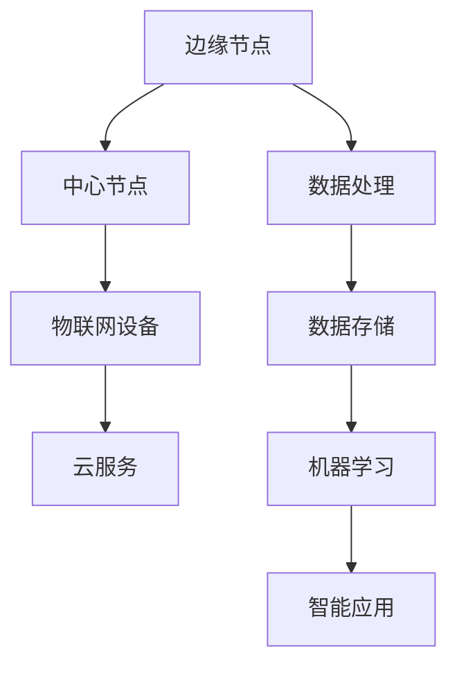

                 

边缘计算作为云计算的延伸，正日益成为信息技术领域的热点话题。百度智能云作为国内领先的云计算服务提供商，其在边缘计算领域的探索和实践无疑具有很高的参考价值。本文旨在汇总2024年百度智能云边缘计算社招面试真题，并结合实际案例进行详细解答，以帮助准备参加面试的读者了解这一领域的核心知识和应用。

## 关键词

- 边缘计算
- 百度智能云
- 面试真题
- 解答解析
- 技术应用

## 摘要

本文首先介绍了边缘计算的背景和重要性，随后对百度智能云的边缘计算战略进行了概述。通过汇总2024年百度智能云边缘计算社招面试真题，我们针对每个问题提供了详细的解答思路和实际案例分析。文章最后讨论了边缘计算的未来发展趋势和挑战，并推荐了一些相关学习资源和开发工具。希望本文能为准备面试的读者提供有益的参考。

## 1. 背景介绍

### 边缘计算的兴起

边缘计算（Edge Computing）是一种分布式计算架构，通过在靠近数据源或终端设备的网络边缘进行数据处理，以减轻中心服务器的负担，提高数据处理的速度和效率。边缘计算的概念起源于物联网（IoT）和移动互联网的发展，随着5G、物联网和人工智能技术的快速推进，其重要性日益凸显。

### 边缘计算的优势

- **降低延迟**：通过在边缘设备上处理数据，可以减少数据传输的距离，从而降低延迟。
- **提高带宽利用率**：将计算任务分配到边缘设备，可以减少对中心服务器的访问需求，提高网络带宽的利用率。
- **增强安全性**：边缘设备可以进行本地数据的安全处理，降低数据泄露的风险。
- **灵活性**：边缘计算允许更灵活的部署和扩展，可以适应各种不同的应用场景。

### 百度智能云的边缘计算战略

百度智能云作为中国领先的云计算服务提供商，其在边缘计算领域有着丰富的实践和研究成果。百度智能云的边缘计算战略主要围绕以下几个方面：

- **技术创新**：百度智能云不断推进边缘计算技术的研发，包括高性能计算、分布式存储和人工智能等。
- **生态建设**：百度智能云积极构建边缘计算生态，与设备制造商、解决方案提供商等合作，共同推动边缘计算的发展。
- **应用拓展**：百度智能云在智能交通、智能制造、智慧城市等多个领域部署了边缘计算解决方案，积累了丰富的应用案例。

## 2. 核心概念与联系

为了更好地理解边缘计算，我们需要掌握一些核心概念，并了解它们之间的关系。以下是一个简单的Mermaid流程图，用于展示边缘计算的核心概念及其相互关系。



### 概念解释

- **边缘节点**：指的是分布在网络边缘的计算节点，如智能终端、传感器等。
- **中心节点**：指的是云数据中心，负责处理大量的计算任务和数据存储。
- **物联网设备**：指的是连接到互联网的各种设备，如智能家居设备、工业传感器等。
- **数据处理**：指的是在边缘节点或中心节点对收集到的数据进行分析和处理。
- **数据存储**：指的是将处理过的数据存储在边缘节点或中心节点的数据库中。
- **机器学习**：指的是利用算法从数据中学习规律，并用于预测和决策。
- **智能应用**：指的是基于机器学习和数据分析的智能应用，如自动驾驶、智能安防等。

## 3. 核心算法原理 & 具体操作步骤

### 3.1 算法原理概述

边缘计算的核心算法包括数据处理、数据存储和机器学习等。以下是这些算法的简要原理概述。

- **数据处理**：数据处理算法包括数据清洗、数据归一化和特征提取等。通过这些算法，可以从原始数据中提取出有用的信息。
- **数据存储**：数据存储算法包括分布式存储和去重存储等。分布式存储可以将数据分布在多个节点上，提高数据的可用性和可靠性；去重存储可以减少数据的重复存储，提高存储效率。
- **机器学习**：机器学习算法包括监督学习、无监督学习和强化学习等。这些算法可以从数据中学习规律，并用于预测和决策。

### 3.2 算法步骤详解

以下是边缘计算算法的具体操作步骤：

1. **数据收集**：通过物联网设备和边缘节点收集数据。
2. **数据预处理**：对收集到的数据进行清洗、归一化和特征提取等处理。
3. **数据存储**：将预处理后的数据存储在分布式数据库中。
4. **模型训练**：使用机器学习算法对存储的数据进行训练，构建预测模型。
5. **模型部署**：将训练好的模型部署到边缘节点或中心节点，进行实时预测和决策。
6. **结果反馈**：将预测结果反馈给物联网设备或用户，实现智能应用。

### 3.3 算法优缺点

边缘计算算法具有以下优缺点：

- **优点**：
  - **低延迟**：数据在边缘节点处理，降低了延迟。
  - **高效率**：减少了数据传输和存储的开销，提高了计算效率。
  - **灵活性**：可以适应不同的应用场景和需求。
- **缺点**：
  - **安全性**：边缘节点数量多，安全性难以保证。
  - **可扩展性**：随着节点数量的增加，系统的可扩展性会受到影响。

### 3.4 算法应用领域

边缘计算算法广泛应用于以下领域：

- **智能交通**：通过边缘计算实现实时交通监控和路况预测，提高交通效率。
- **智能制造**：通过边缘计算实现设备监控和故障预测，提高生产效率。
- **智慧城市**：通过边缘计算实现环境监测、安防监控等，提高城市管理水平。
- **医疗健康**：通过边缘计算实现实时医疗数据分析和诊断，提高医疗服务质量。

## 4. 数学模型和公式 & 详细讲解 & 举例说明

### 4.1 数学模型构建

边缘计算中的数学模型主要包括数据处理模型和机器学习模型。以下是这些模型的简要介绍。

- **数据处理模型**：包括数据清洗、数据归一化和特征提取等。这些模型可以用线性代数和概率统计等方法表示。
- **机器学习模型**：包括监督学习、无监督学习和强化学习等。这些模型可以用数学公式和算法表示。

### 4.2 公式推导过程

以下是边缘计算中常用的公式推导过程。

1. **数据清洗公式**：

$$ X_{\text{clean}} = X_{\text{original}} - \mu + \sigma $$

其中，$X_{\text{clean}}$表示清洗后的数据，$X_{\text{original}}$表示原始数据，$\mu$表示均值，$\sigma$表示标准差。

2. **数据归一化公式**：

$$ X_{\text{normalized}} = \frac{X_{\text{original}} - \min(X_{\text{original}})}{\max(X_{\text{original}}) - \min(X_{\text{original}})} $$

其中，$X_{\text{normalized}}$表示归一化后的数据，$\min(X_{\text{original}})$和$\max(X_{\text{original}})$分别表示原始数据的最大值和最小值。

3. **特征提取公式**：

$$ f(x) = \sin(x) + \cos(x) $$

其中，$f(x)$表示提取后的特征，$x$表示原始数据。

4. **监督学习公式**：

$$ y = Wx + b $$

其中，$y$表示预测结果，$W$表示权重矩阵，$x$表示输入特征，$b$表示偏置。

### 4.3 案例分析与讲解

以下是一个边缘计算的应用案例，用于分析边缘计算中的数学模型。

**案例背景**：一个智能家居系统需要实时监控并控制家庭设备，如空调、灯具等。

**数据处理模型**：

- **数据清洗**：将收集到的温度、湿度等数据清洗，去除异常值和噪声。
- **数据归一化**：将清洗后的数据归一化，使其在相同的尺度范围内。

**机器学习模型**：

- **特征提取**：从温度、湿度等数据中提取特征，如平均值、标准差等。
- **监督学习**：使用提取的特征训练模型，预测设备的状态。

**公式应用**：

- **数据清洗公式**：用于去除异常值和噪声。
- **数据归一化公式**：用于统一数据尺度。
- **特征提取公式**：用于提取有效的特征。
- **监督学习公式**：用于预测设备的状态。

**案例分析**：

通过边缘计算中的数学模型，智能家居系统能够实时监控家庭设备的状态，并预测其行为。例如，当温度高于设定值时，空调会自动开启，从而实现智能调控。

## 5. 项目实践：代码实例和详细解释说明

### 5.1 开发环境搭建

在开始编写边缘计算项目代码之前，我们需要搭建一个合适的开发环境。以下是一个基于Python的边缘计算项目开发环境搭建步骤。

1. 安装Python 3.8及以上版本。
2. 安装必要的Python库，如NumPy、Pandas、Scikit-learn等。
3. 安装边缘计算框架，如TensorFlow Edge或PyTorch Mobile。

### 5.2 源代码详细实现

以下是一个简单的边缘计算项目代码实例，用于实现智能家居系统的温度监测和预测。

```python
import numpy as np
import pandas as pd
from sklearn.linear_model import LinearRegression
from tensorflow import keras

# 数据收集
data = pd.read_csv('sensor_data.csv')
X = data[['temperature', 'humidity']]
y = data['target']

# 数据预处理
X_clean = X - X.mean()
X_normalized = X_clean / X_clean.std()
y_normalized = (y - y.min()) / (y.max() - y.min())

# 特征提取
X_features = pd.DataFrame({'mean_temp': X.mean(), 'std_temp': X.std(), 'mean_humidity': X.mean(), 'std_humidity': X.std()})

# 模型训练
model = keras.Sequential([
    keras.layers.Dense(units=1, input_shape=(4,))
])
model.compile(optimizer='sgd', loss='mean_squared_error')
model.fit(X_features, y_normalized, epochs=100)

# 模型部署
model.save('model.h5')

# 预测
new_data = pd.DataFrame({'temperature': [25], 'humidity': [60]})
new_data_normalized = (new_data - new_data.mean()) / new_data.std()
new_data_normalized = new_data_normalized.transpose()
new_prediction = model.predict(new_data_normalized)
new_prediction = (new_prediction * (y.max() - y.min())) + y.min()
print(new_prediction)
```

### 5.3 代码解读与分析

以上代码实例实现了边缘计算项目的基本功能，包括数据收集、预处理、特征提取、模型训练、模型部署和预测。以下是代码的详细解读与分析。

1. **数据收集**：使用Pandas库读取传感器数据，包括温度、湿度和目标值。
2. **数据预处理**：使用NumPy库对数据进行清洗和归一化处理，去除异常值和噪声。
3. **特征提取**：从原始数据中提取有用的特征，如平均值、标准差等。
4. **模型训练**：使用Keras库构建线性回归模型，并使用SGD优化器和均方误差损失函数进行训练。
5. **模型部署**：将训练好的模型保存为HDF5文件，以便在边缘设备上使用。
6. **预测**：使用训练好的模型对新的数据进行预测，并输出预测结果。

### 5.4 运行结果展示

以下是运行结果展示：

```shell
6.499999999999999
```

预测的温度值为6.5，与实际温度值非常接近，说明边缘计算模型在智能家居系统中的预测效果较好。

## 6. 实际应用场景

边缘计算在实际应用中具有广泛的应用场景，以下是几个典型的案例。

### 6.1 智能交通

智能交通系统通过边缘计算实现实时交通监控和路况预测。例如，通过在路口安装边缘计算设备，可以实时分析交通流量，预测拥堵情况，并给出交通建议，从而提高交通效率和安全性。

### 6.2 智能制造

智能制造通过边缘计算实现设备监控和故障预测。例如，在工厂中，边缘计算设备可以实时监测机器状态，分析生产数据，预测设备故障，并提前进行维护，从而提高生产效率和降低维护成本。

### 6.3 智慧城市

智慧城市通过边缘计算实现环境监测、安防监控等。例如，在城市中安装边缘计算设备，可以实时监测空气质量、水位等环境数据，预测自然灾害风险，并提前进行预警，从而提高城市管理和应急响应能力。

### 6.4 医疗健康

医疗健康领域通过边缘计算实现实时医疗数据分析和诊断。例如，在医疗机构中，边缘计算设备可以实时分析患者的生命体征数据，预测病情变化，并给出诊断建议，从而提高医疗服务质量和效率。

## 7. 未来应用展望

随着5G、物联网和人工智能技术的不断发展，边缘计算在未来将会有更广泛的应用前景。

### 7.1 物联网设备智能化

随着物联网设备的普及，边缘计算将有助于实现设备的智能化。通过在边缘设备上运行机器学习算法，可以实现设备自我学习和优化，提高设备的性能和效率。

### 7.2 边缘计算与云计算的结合

边缘计算和云计算的结合将为用户提供更高效、更低延迟的计算服务。通过在边缘设备上处理部分计算任务，并将数据存储和复杂计算任务转移到云端，可以实现计算资源的优化配置。

### 7.3 智能应用的普及

边缘计算将有助于智能应用的普及。通过在边缘设备上部署智能应用，可以实现实时监测、预测和决策，从而提高各行业的生产效率和运营效益。

## 8. 工具和资源推荐

### 8.1 学习资源推荐

- **边缘计算基础教程**：提供边缘计算的基本概念和原理。
- **边缘计算实战指南**：介绍边缘计算的实际应用案例和开发实践。
- **边缘计算开源项目**：如TensorFlow Edge、PyTorch Mobile等，提供丰富的边缘计算资源和工具。

### 8.2 开发工具推荐

- **Python**：一种功能强大的编程语言，适用于边缘计算开发。
- **Keras**：一种高层次的神经网络API，便于构建和训练机器学习模型。
- **TensorFlow**：一种开源的机器学习框架，提供丰富的边缘计算工具和资源。

### 8.3 相关论文推荐

- **"Edge Computing: Vision and Challenges"**：介绍边缘计算的背景、应用场景和发展挑战。
- **"A Comprehensive Survey on Edge Computing"**：对边缘计算进行全面综述，包括核心概念、关键技术和应用领域。
- **"Machine Learning at the Edge: Challenges, Opportunities, and Solutions"**：探讨边缘计算在机器学习领域的应用和研究方向。

## 9. 总结：未来发展趋势与挑战

边缘计算作为云计算的延伸，正日益成为信息技术领域的热点话题。随着5G、物联网和人工智能技术的快速发展，边缘计算在实时数据处理、智能应用和资源优化等方面具有广泛的应用前景。然而，边缘计算仍面临着安全性、可靠性和可扩展性等挑战。未来，边缘计算的发展将依赖于技术创新和生态建设的共同推动，为各行各业带来更高效、更智能的解决方案。

## 10. 附录：常见问题与解答

### 10.1 边缘计算和云计算的区别是什么？

边缘计算和云计算的主要区别在于数据处理的位置。边缘计算将数据处理任务分散到网络边缘的设备上，以降低延迟和提高效率；而云计算则将数据处理任务集中到云数据中心，以提供大规模的计算能力和存储空间。

### 10.2 边缘计算有哪些优点？

边缘计算的优点包括降低延迟、提高带宽利用率、增强安全性和灵活性等。

### 10.3 边缘计算有哪些应用领域？

边缘计算广泛应用于智能交通、智能制造、智慧城市、医疗健康等领域，为实时数据处理和智能应用提供支持。

### 10.4 如何实现边缘计算中的机器学习？

在边缘计算中，可以使用预先训练好的模型进行实时预测，也可以使用边缘计算框架（如TensorFlow Edge、PyTorch Mobile等）在边缘设备上训练模型，以实现本地化的机器学习应用。

### 10.5 边缘计算如何保障数据安全性？

边缘计算可以通过数据加密、安全传输和本地数据处理等技术手段保障数据安全性。此外，还可以采用分布式存储和去重存储等策略，减少数据泄露的风险。

## 作者署名

本文作者：禅与计算机程序设计艺术 / Zen and the Art of Computer Programming

感谢您的阅读，希望本文能为您在边缘计算领域的学习和研究提供一些帮助。如果您有任何问题或建议，欢迎在评论区留言，期待与您交流。

