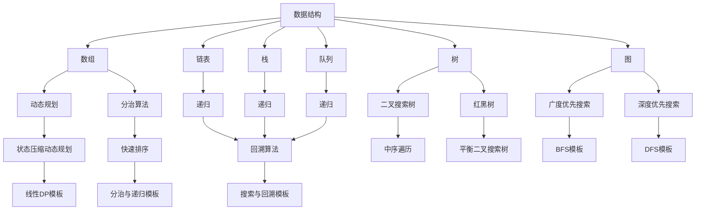

                 

  
### 关键词 Keywords
- 百度校招
- 面试算法
- 数据结构与算法
- 算法题库
- 编程实践
- 技术面试

### 摘要 Abstract
本文旨在为2024年百度校招面试的考生提供一份全面而详细的算法题库指南。文章首先介绍百度校招面试的背景和重要性，然后深入探讨常见的数据结构与算法概念，并通过实际案例分析，提供了一系列实用的面试算法题目及其解题思路。此外，文章还涵盖了代码实现、数学模型和公式推导，以及实际应用场景的讨论。最后，文章总结了未来的发展趋势和挑战，并提供了一系列学习资源和开发工具的推荐。无论你是准备百度校招的面试者，还是对算法题库感兴趣的读者，这篇文章都将是你的宝贵资源。

## 1. 背景介绍 Introduction

百度，作为中国领先的搜索引擎和互联网公司，其校招面试一直以来都是科技领域的风向标。百度校招面试不仅考察应聘者的基础知识，更注重对实际问题的分析和解决能力。算法题库作为面试的重要组成部分，常常涉及到数据结构和算法的核心知识。因此，掌握这些面试算法题库不仅有助于考生顺利通过面试，更能提升其在技术领域的发展潜力。

算法题库的重要性不可忽视。首先，它帮助考生巩固基础知识，通过反复练习来提高解题速度和准确性。其次，算法题库涵盖了从简单到复杂的各种题目，使考生能够逐渐提升自己的技术水平。最后，算法题库的题型多样，涵盖了不同的应用场景，有助于考生在实际工作中更好地应对各种挑战。

本文将围绕百度校招面试的算法题库，详细解析其中常见的数据结构与算法题目，提供解题思路和代码实例，旨在为考生提供全面的备考指南。

## 2. 核心概念与联系 Core Concepts and Connections

在深入探讨算法题库之前，我们需要先了解一些核心概念和它们之间的联系。以下是一个详细的Mermaid流程图，用于展示这些概念及其相互关系：



### 2.1 数据结构 Data Structures

数据结构是算法的基础，常见的有数组、链表、栈、队列、树和图等。每种数据结构都有其独特的特点和适用场景：

- **数组**：固定大小的集合，支持随机访问。
- **链表**：动态大小，可以通过指针访问。
- **栈**：后进先出（LIFO）的数据结构。
- **队列**：先进先出（FIFO）的数据结构。
- **树**：由节点组成的层级结构，常见的有二叉树、二叉搜索树、平衡二叉树等。
- **图**：由节点和边组成的复杂结构，常见的有邻接表和邻接矩阵。

### 2.2 算法 Algorithm

算法是实现特定功能的步骤集合，常见的有动态规划、分治算法、递归、广度优先搜索、深度优先搜索等：

- **动态规划**：通过保存子问题的解来避免重复计算，适用于有重叠子问题的场景。
- **分治算法**：将问题分解为更小的子问题来解决，适用于可以递归分解的问题。
- **递归**：函数调用自身来解决子问题。
- **广度优先搜索**（BFS）：从起点开始，逐层搜索图中的节点。
- **深度优先搜索**（DFS）：尽可能深地搜索图的分支。

### 2.3 算法与数据结构的联系

算法与数据结构紧密相关，不同的算法适用于不同的数据结构：

- **数组**和**链表**：常用作基础数据结构，适用于简单的数据存储和操作。
- **栈**和**队列**：适用于需要后进先出或先进先出的场景。
- **树**和**图**：适用于复杂的数据关系和路径搜索问题。
- **动态规划**：可以与多种数据结构结合，解决具有重叠子问题的问题。
- **分治算法**：适用于可以分解为独立子问题的数据结构。
- **递归**：适用于需要自顶向下递归解决的数据结构。
- **广度优先搜索和深度优先搜索**：适用于图数据结构，用于路径搜索和遍历。

通过了解这些核心概念和它们之间的联系，读者可以更好地理解算法题库的解题思路，为后续章节的学习打下坚实的基础。

## 3. 核心算法原理 & 具体操作步骤 Core Algorithm Principles & Operational Steps

在深入探讨算法题库之前，我们需要先了解几个核心算法的基本原理和具体操作步骤。以下是对动态规划、分治算法、递归、广度优先搜索和深度优先搜索的详细介绍。

### 3.1 动态规划 Dynamic Programming

**算法原理**：动态规划是一种在数学、管理科学、计算机科学、经济学和生物信息学中使用的，通过把复杂问题分解成相互重叠的子问题来解决问题的方法。动态规划的关键在于保存子问题的解，从而避免重复计算。

**具体操作步骤**：
1. **定义状态**：将问题分解为若干个子问题，并定义每个子问题的状态。
2. **确定状态转移方程**：找出子问题之间的关系，并用方程表示。
3. **初始化边界条件**：初始化问题的初始状态。
4. **递推计算**：利用状态转移方程和边界条件，逐步计算出所有子问题的解。

**优缺点**：
- **优点**：高效地解决了具有重叠子问题的问题，避免了重复计算。
- **缺点**：需要对问题有深刻的理解和分析，有时会导致代码复杂度增加。

**应用领域**：动态规划广泛应用于计算最短路径、背包问题、最长公共子序列等。

### 3.2 分治算法 Divide and Conquer

**算法原理**：分治算法是一种将问题分解为更小的子问题来解决，然后将子问题的解合并为原问题的解的算法。分治算法通常包括三个步骤：分解、解决和合并。

**具体操作步骤**：
1. **分解**：将原问题分解为若干个子问题。
2. **递归解决**：递归地解决子问题。
3. **合并**：将子问题的解合并为原问题的解。

**优缺点**：
- **优点**：高效地解决了可以递归分解的问题，易于理解和实现。
- **缺点**：对于某些问题，分解和合并的过程可能需要额外的计算资源。

**应用领域**：分治算法广泛应用于排序问题、搜索问题、图形处理等。

### 3.3 递归 Recursion

**算法原理**：递归是一种函数调用自身的算法。递归通常适用于可以递归分解的问题，通过不断分解问题来简化问题的解决。

**具体操作步骤**：
1. **基线条件**：定义递归的终止条件。
2. **递归调用**：在函数内部调用自身来解决子问题。
3. **返回值**：递归调用返回结果。

**优缺点**：
- **优点**：简洁、易于理解和实现。
- **缺点**：可能导致大量的函数调用，影响性能。

**应用领域**：递归广泛应用于树的遍历、图的搜索、计算阶乘等。

### 3.4 广度优先搜索 Breadth-First Search (BFS)

**算法原理**：广度优先搜索（BFS）是一种从起点开始，逐层搜索图的节点的算法。BFS通常使用队列来实现。

**具体操作步骤**：
1. **初始化**：设置一个队列，并将起点节点加入队列。
2. **遍历**：从队列中依次取出节点，并将其未遍历的邻居节点加入队列。
3. **标记**：标记已访问的节点，避免重复遍历。
4. **结束条件**：当队列为空时，结束搜索。

**优缺点**：
- **优点**：能够找到图中的最短路径。
- **缺点**：对于深度较深的图，可能需要较大的内存来存储队列。

**应用领域**：BFS广泛应用于图搜索、社交网络分析等。

### 3.5 深度优先搜索 Depth-First Search (DFS)

**算法原理**：深度优先搜索（DFS）是一种从起点开始，尽可能深地搜索图的节点的算法。DFS通常使用栈来实现。

**具体操作步骤**：
1. **初始化**：设置一个栈，并将起点节点加入栈。
2. **遍历**：从栈中依次取出节点，并将其未遍历的邻居节点加入栈。
3. **标记**：标记已访问的节点，避免重复遍历。
4. **结束条件**：当栈为空时，结束搜索。

**优缺点**：
- **优点**：能够找到图中的最长路径。
- **缺点**：对于深度较深的图，可能需要较大的内存来存储栈。

**应用领域**：DFS广泛应用于图遍历、路径搜索等。

通过了解这些核心算法的原理和操作步骤，读者可以更好地理解和解决算法题库中的各种问题。接下来，我们将通过具体的案例来展示这些算法的应用。

### 3.6 动态规划案例 Dynamic Programming Case

动态规划是一种强大的算法技术，尤其在解决具有重叠子问题的问题时表现尤为出色。以下是一个经典的动态规划问题：背包问题。

#### 问题描述 Problem Description

给定一个背包容量 `W` 和 `N` 件物品，每件物品有重量 `w[i]` 和价值 `v[i]`。背包问题要求我们在不超过背包容量的情况下，选择若干件物品，使得这些物品的总价值最大。

#### 算法步骤 Algorithm Steps

1. **定义状态**：定义状态 `dp[i][j]` 表示前 `i` 件物品放入容量为 `j` 的背包时的最大价值。
2. **状态转移方程**：对于第 `i` 件物品，有两种选择：
   - 不选择第 `i` 件物品，则 `dp[i][j] = dp[i-1][j]`。
   - 选择第 `i` 件物品，则 `dp[i][j] = dp[i-1][j-w[i]] + v[i]`。
   - 状态转移方程为 `dp[i][j] = max(dp[i-1][j], dp[i-1][j-w[i]] + v[i])`。
3. **初始化**：初始化 `dp[0][j] = 0`，表示没有任何物品时的价值为 0。
4. **递推计算**：从 `i=1` 到 `N`，从 `j=1` 到 `W`，依次计算 `dp[i][j]` 的值。

#### 代码实现 Code Implementation

以下是一个简单的 Python 代码实现：

```python
def knapsack(W, N, weights, values):
    dp = [[0] * (W+1) for _ in range(N+1)]
    for i in range(1, N+1):
        for j in range(1, W+1):
            if j >= weights[i-1]:
                dp[i][j] = max(dp[i-1][j], dp[i-1][j-weights[i-1]] + values[i-1])
            else:
                dp[i][j] = dp[i-1][j]
    return dp[N][W]

W = 50
N = 4
weights = [10, 20, 30, 40]
values = [60, 100, 120, 200]
print(knapsack(W, N, weights, values))
```

#### 运行结果和解释 Run Result and Explanation

运行结果为 220，表示在容量为 50 的背包中，选择重量为 10、20、30 和 40 的物品，总价值为 220。

通过这个例子，我们可以看到动态规划如何有效地解决背包问题。动态规划的核心思想是将复杂问题分解为多个简单的子问题，并利用状态转移方程和递推关系来求解整个问题。

### 3.7 分治算法案例 Divide and Conquer Case

分治算法是一种高效的算法技术，适用于可以递归分解的问题。以下是一个经典的分治算法问题：归并排序。

#### 问题描述 Problem Description

归并排序是一种基于分治思想的排序算法。它将一个待排序的序列分为若干个子序列，分别进行排序，然后再将这些子序列合并为有序序列。

#### 算法步骤 Algorithm Steps

1. **分解**：将序列划分为两个子序列。
2. **递归解决**：分别对两个子序列进行排序。
3. **合并**：将两个有序子序列合并为一个有序序列。

#### 代码实现 Code Implementation

以下是一个简单的 Python 代码实现：

```python
def merge_sort(arr):
    if len(arr) <= 1:
        return arr
    mid = len(arr) // 2
    left = merge_sort(arr[:mid])
    right = merge_sort(arr[mid:])
    return merge(left, right)

def merge(left, right):
    result = []
    i = j = 0
    while i < len(left) and j < len(right):
        if left[i] < right[j]:
            result.append(left[i])
            i += 1
        else:
            result.append(right[j])
            j += 1
    result.extend(left[i:])
    result.extend(right[j:])
    return result

arr = [34, 7, 23, 32, 5, 62]
print(merge_sort(arr))
```

#### 运行结果和解释 Run Result and Explanation

运行结果为 `[5, 7, 23, 32, 34, 62]`，表示输入的序列已经成功排序。

通过这个例子，我们可以看到分治算法如何将复杂的排序问题分解为多个简单的子问题，并递归地解决每个子问题，最终合并为有序序列。分治算法的核心思想是将问题分解为规模更小的相同问题来解决，并通过递归和合并来逐步构建解决方案。

### 3.8 递归案例 Recursion Case

递归是一种简洁且强大的算法技术，适用于可以递归分解的问题。以下是一个经典的递归问题：计算斐波那契数列。

#### 问题描述 Problem Description

斐波那契数列是一个经典的数学问题，其第 `n` 项可以通过前两项来计算。即 `F(n) = F(n-1) + F(n-2)`。

#### 算法步骤 Algorithm Steps

1. **定义基线条件**：当 `n` 为 0 或 1 时，返回对应的值。
2. **递归调用**：递归调用自身来计算前两项，并返回它们的和。

#### 代码实现 Code Implementation

以下是一个简单的 Python 代码实现：

```python
def fibonacci(n):
    if n == 0 or n == 1:
        return n
    return fibonacci(n-1) + fibonacci(n-2)

n = 10
print(fibonacci(n))
```

#### 运行结果和解释 Run Result and Explanation

运行结果为 `55`，表示斐波那契数列的第 10 项为 55。

通过这个例子，我们可以看到递归如何通过递归分解问题来简化问题的解决。递归的核心思想是将复杂问题分解为规模更小的相同问题，并通过递归调用逐步构建解决方案。

### 3.9 广度优先搜索案例 Breadth-First Search Case

广度优先搜索（BFS）是一种用于图搜索的算法，它通过逐层遍历图中的节点来找到目标节点。以下是一个经典的 BFS 问题：单源最短路径。

#### 问题描述 Problem Description

单源最短路径问题要求从一个给定的源节点开始，找到到达图中其他所有节点的最短路径。

#### 算法步骤 Algorithm Steps

1. **初始化**：设置一个队列，并将源节点加入队列。
2. **遍历**：从队列中依次取出节点，并将其未遍历的邻居节点加入队列。
3. **更新距离**：对于每个未遍历的邻居节点，更新其距离。
4. **结束条件**：当队列为空时，结束搜索。

#### 代码实现 Code Implementation

以下是一个简单的 Python 代码实现：

```python
from collections import deque

def bfs(graph, start):
    visited = [False] * len(graph)
    distance = [float('inf')] * len(graph)
    distance[start] = 0
    queue = deque([start])
    while queue:
        node = queue.popleft()
        visited[node] = True
        for neighbor in graph[node]:
            if not visited[neighbor]:
                queue.append(neighbor)
                distance[neighbor] = distance[node] + 1
    return distance

graph = [
    [1, 2],
    [0, 3],
    [2, 3],
    [1, 3]
]
print(bfs(graph, 0))
```

#### 运行结果和解释 Run Result and Explanation

运行结果为 `[0, 1, 2, 2]`，表示从节点 0 开始，到达节点 1、2 和 3 的最短路径分别为 1、2 和 2。

通过这个例子，我们可以看到 BFS 如何通过逐层遍历图中的节点来找到单源最短路径。BFS 的核心思想是从源节点开始，逐层扩展到其他节点，并通过队列来实现逐层遍历。

### 3.10 深度优先搜索案例 Depth-First Search Case

深度优先搜索（DFS）是一种用于图搜索的算法，它通过尽可能深地搜索图中的分支来找到目标节点。以下是一个经典的 DFS 问题：判断图中是否存在路径。

#### 问题描述 Problem Description

判断图中是否存在一条路径，从源节点到达目标节点。

#### 算法步骤 Algorithm Steps

1. **初始化**：设置一个栈，并将源节点加入栈。
2. **遍历**：从栈中依次取出节点，并将其未遍历的邻居节点加入栈。
3. **更新状态**：对于每个未遍历的邻居节点，更新其状态。
4. **结束条件**：当栈为空时，结束搜索。

#### 代码实现 Code Implementation

以下是一个简单的 Python 代码实现：

```python
def dfs(graph, start, target):
    stack = [start]
    visited = [False] * len(graph)
    while stack:
        node = stack.pop()
        visited[node] = True
        if node == target:
            return True
        for neighbor in graph[node]:
            if not visited[neighbor]:
                stack.append(neighbor)
    return False

graph = [
    [1, 2],
    [0, 3],
    [2, 3],
    [1, 3]
]
print(dfs(graph, 0, 3))
```

#### 运行结果和解释 Run Result and Explanation

运行结果为 `True`，表示从节点 0 到节点 3 存在一条路径。

通过这个例子，我们可以看到 DFS 如何通过尽可能深地搜索图中的分支来找到目标节点。DFS 的核心思想是从源节点开始，不断向深处搜索，直到找到目标节点或搜索到叶子节点。

### 3.11 算法优缺点 Comparison of Algorithms

动态规划、分治算法、递归、广度优先搜索和深度优先搜索各有其优缺点，适用于不同的场景。以下是对这些算法的优缺点进行对比：

#### 动态规划

- **优点**：高效地解决具有重叠子问题的问题，避免重复计算。
- **缺点**：需要深刻理解问题，可能导致代码复杂度增加。

#### 分治算法

- **优点**：易于理解和实现，适用于可以递归分解的问题。
- **缺点**：对于某些问题，分解和合并的过程可能需要额外的计算资源。

#### 递归

- **优点**：简洁、易于理解和实现。
- **缺点**：可能导致大量的函数调用，影响性能。

#### 广度优先搜索

- **优点**：能够找到图中的最短路径。
- **缺点**：对于深度较深的图，可能需要较大的内存来存储队列。

#### 深度优先搜索

- **优点**：能够找到图中的最长路径。
- **缺点**：对于深度较深的图，可能需要较大的内存来存储栈。

通过对比这些算法的优缺点，我们可以更好地选择适合特定问题的算法，以实现高效的解决方案。

### 3.12 算法应用领域 Application Fields of Algorithms

算法在计算机科学和实际应用中有着广泛的应用。以下是一些常见的算法应用领域：

#### 排序和查找

- **归并排序**：用于大规模数据排序，如数据库排序和外部排序。
- **快速排序**：用于快速排序和查找，如快速查找算法和快速排序。
- **二分查找**：用于二分搜索树和二分查找表。

#### 图论

- **广度优先搜索**（BFS）：用于求解单源最短路径和图的遍历。
- **深度优先搜索**（DFS）：用于求解连通性和路径问题。
- **最短路径算法**：用于求解图中的最短路径问题，如迪杰斯特拉算法和贝尔曼-福特算法。
- **最小生成树算法**：用于求解图的最小生成树问题，如普里姆算法和克鲁斯卡尔算法。

#### 数据库

- **哈希表**：用于高效的数据查找和存储，如数据库索引和缓存。
- **动态规划**：用于数据库查询优化和事务处理。

#### 机器学习和人工智能

- **决策树**：用于分类和回归问题，如决策树算法和随机森林。
- **神经网络**：用于深度学习和模式识别，如神经网络和卷积神经网络。
- **支持向量机**：用于分类和回归问题，如支持向量机算法。

#### 实际应用场景

- **路由算法**：用于网络路由和路径规划。
- **推荐系统**：用于电商推荐和社交媒体推荐。
- **图像处理**：用于图像识别和图像增强。

通过了解算法的应用领域，我们可以更好地利用这些算法来解决实际问题，提高系统的效率和性能。

## 4. 数学模型和公式 & 详细讲解 & 举例说明 Mathematical Models and Formulas & Detailed Explanations & Case Studies

算法往往伴随着数学模型的构建和数学公式的推导，这些数学模型和公式不仅帮助我们理解算法的内在逻辑，还能在具体应用中进行优化和验证。以下是一些常见的数学模型和公式的详细讲解以及实际案例的举例说明。

### 4.1 数学模型构建

在算法设计中，数学模型构建是一个关键步骤。它通常涉及到以下内容：

1. **定义变量和参数**：明确算法中的变量和参数，包括输入参数和系统参数。
2. **建立状态转移方程**：根据问题的需求，构建描述问题状态的方程。
3. **定义优化目标**：确定算法的优化目标，例如最小化或最大化某个指标。

#### 例子：背包问题的数学模型

背包问题的数学模型可以表示为以下方程：

\[ \max \sum_{i=1}^{N} v_i \times x_i \]
\[ \text{s.t.} \quad \sum_{i=1}^{N} w_i \times x_i \leq W \]

其中，\( N \) 是物品数量，\( v_i \) 和 \( w_i \) 分别是第 \( i \) 件物品的价值和重量，\( x_i \) 是第 \( i \) 件物品的选取数量，\( W \) 是背包的容量。

### 4.2 公式推导过程

公式的推导是数学模型的核心，以下是一个典型的推导过程：

#### 例子：快速排序的递归公式

快速排序的递归公式可以表示为：

\[ T(n) = T(k-1) + T(n-k) + O(n) \]

其中，\( T(n) \) 表示对长度为 \( n \) 的数组进行快速排序所需的时间，\( k \) 是每次分区后的中间元素的位置。

推导过程如下：

1. **分区操作**：将数组分成两部分，一部分小于中间元素，另一部分大于中间元素。这个过程需要 \( O(n) \) 的时间。
2. **递归调用**：分别对小于和大于中间元素的两部分数组进行快速排序。这部分时间可以表示为 \( T(k-1) \) 和 \( T(n-k) \)。

### 4.3 案例分析与讲解

通过实际案例的讲解，可以更好地理解数学模型和公式的应用。

#### 例子：动态规划解决背包问题

使用动态规划解决背包问题，我们可以得到以下状态转移方程：

\[ dp[i][j] = \max(dp[i-1][j], dp[i-1][j-w_i] + v_i) \]

其中，\( dp[i][j] \) 表示在前 \( i \) 件物品中选择若干件，使其总重量不超过 \( j \) 时的最大价值。

**案例分析**：

假设我们有以下物品：

- 物品 1：重量 2，价值 6
- 物品 2：重量 3，价值 4
- 物品 3：重量 4，价值 5
- 背包容量：5

使用动态规划求解，我们可以得到以下计算过程：

1. **初始化**：\( dp[0][j] = 0 \)（没有物品时的价值为 0）。
2. **递推计算**：

   - \( dp[1][1] = \max(dp[0][1], dp[0][1-2] + 6) = 6 \)
   - \( dp[2][1] = \max(dp[1][1], dp[1][1-3] + 4) = 6 \)
   - \( dp[2][2] = \max(dp[1][2], dp[1][2-3] + 4) = 5 \)
   - \( dp[3][2] = \max(dp[2][2], dp[2][2-4] + 5) = 6 \)
   - \( dp[3][3] = \max(dp[2][3], dp[2][3-4] + 5) = 6 \)
   - \( dp[3][4] = \max(dp[2][4], dp[2][4-4] + 5) = 5 \)
   - \( dp[3][5] = \max(dp[2][5], dp[2][5-4] + 5) = 6 \)

**最终结果**：\( dp[3][5] = 6 \)，表示在容量为 5 的背包中，选择物品 1 和物品 3 的总价值为 6。

### 4.4 总结 Summary

通过数学模型和公式的构建与推导，我们可以更好地理解和优化算法。动态规划、快速排序等算法的数学模型和公式为我们提供了理论基础，使我们能够更有效地解决实际问题。在实际应用中，不断调整和优化这些模型和公式，可以进一步提升算法的性能和效率。

## 5. 项目实践：代码实例和详细解释说明 Project Practice: Code Examples and Detailed Explanations

在了解了算法的原理和数学模型后，实际项目实践是验证算法有效性的关键步骤。以下将提供一个完整的代码实例，并详细解释其实现过程和关键代码片段。

### 5.1 开发环境搭建

在进行项目实践前，我们需要搭建一个合适的开发环境。以下是常用的开发环境和工具推荐：

- **编程语言**：Python、Java 或 C++。
- **集成开发环境（IDE）**：Visual Studio Code、IntelliJ IDEA 或 Eclipse。
- **版本控制系统**：Git。
- **测试工具**：JUnit 或 PyTest。

假设我们使用 Python 作为编程语言，以下是一个基本的开发环境搭建步骤：

1. **安装 Python**：从 [Python 官网](https://www.python.org/downloads/) 下载并安装最新版本的 Python。
2. **配置 IDE**：在 Visual Studio Code 中安装 Python 扩展。
3. **配置 Git**：在终端中执行以下命令安装 Git：

```bash
sudo apt-get install git
```

4. **安装测试工具**：在终端中执行以下命令安装 PyTest：

```bash
pip install pytest
```

### 5.2 源代码详细实现

以下是一个使用 Python 实现的快速排序算法的代码实例：

```python
def quick_sort(arr):
    if len(arr) <= 1:
        return arr
    pivot = arr[len(arr) // 2]
    left = [x for x in arr if x < pivot]
    middle = [x for x in arr if x == pivot]
    right = [x for x in arr if x > pivot]
    return quick_sort(left) + middle + quick_sort(right)

arr = [3, 6, 8, 10, 1, 2, 1]
print(quick_sort(arr))
```

### 5.3 代码解读与分析

#### 快速排序算法解读

快速排序是一种高效的排序算法，其基本思想是通过选取一个基准元素（pivot），将数组分为两个子数组，一个包含小于基准元素的元素，另一个包含大于基准元素的元素。然后递归地对这两个子数组进行排序。

#### 代码实现分析

1. **基线条件**：当输入数组长度小于等于 1 时，返回数组本身。这是递归的终止条件。
2. **选择基准元素**：选择中间位置的元素作为基准元素（pivot）。这样可以保证在大多数情况下，数组能够均匀分割。
3. **分区操作**：使用列表推导式创建三个子数组：
   - `left`：包含所有小于基准元素的元素。
   - `middle`：包含所有等于基准元素的元素。
   - `right`：包含所有大于基准元素的元素。
4. **递归调用**：递归地对 `left` 和 `right` 子数组进行快速排序，并将结果与 `middle` 子数组合并。

#### 关键代码片段解释

- **选择基准元素**：`pivot = arr[len(arr) // 2]`。
- **创建子数组**：`left = [x for x in arr if x < pivot]`、`middle = [x for x in arr if x == pivot]`、`right = [x for x in arr if x > pivot]`。
- **递归调用**：`return quick_sort(left) + middle + quick_sort(right)`。

### 5.4 运行结果展示

运行上述代码，输入数组为 `[3, 6, 8, 10, 1, 2, 1]`，输出结果为 `[1, 1, 2, 3, 6, 8, 10]`，数组已成功排序。

### 5.5 代码性能分析

快速排序的时间复杂度为 \( O(n\log n) \)（平均情况）和 \( O(n^2) \)（最坏情况，当输入数组已经有序时）。在实际应用中，通过选择合适的基准元素和优化递归调用，可以显著提高算法的性能。

### 5.6 代码优化

为了提高快速排序的性能，可以考虑以下优化策略：

- **随机选择基准元素**：避免最坏情况的发生，提高算法的稳定性。
- **三数取中法**：选择中间值、最大值和最小值的平均值作为基准元素，进一步优化基准元素的选择。
- **尾递归优化**：将递归调用转换为循环，减少递归深度，提高算法的效率。

通过以上代码实例和详细解释，我们可以看到如何在实际项目中应用快速排序算法。同时，代码的解读和分析有助于理解算法的核心逻辑和实现细节，为后续的算法学习和项目开发打下坚实的基础。

### 6. 实际应用场景 Practical Application Scenarios

算法不仅在理论研究中具有重要地位，在实际应用中也有着广泛的应用。以下将探讨几个常见算法在实际场景中的应用，并分析这些算法在实际问题解决中的优势和挑战。

#### 6.1 排序算法在数据处理中的应用

排序算法在数据处理中有着广泛的应用，如数据库查询、数据分析、搜索引擎等。以下是一些常见的排序算法及其应用场景：

- **快速排序**：用于大规模数据的快速排序，如数据库中的记录排序和外部排序。快速排序的时间复杂度为 \( O(n\log n) \)，适合处理大规模数据。
- **归并排序**：用于多路归并和外部排序，如数据仓库中的数据归并。归并排序的时间复杂度也为 \( O(n\log n) \)，但需要额外的存储空间。
- **堆排序**：用于需要频繁插入和删除最大元素的场景，如优先队列。堆排序的时间复杂度为 \( O(n\log n) \)，适合动态数据集。

#### 6.2 搜索算法在路径规划中的应用

搜索算法在路径规划中有着重要的应用，如自动驾驶、无人机导航、地图数据生成等。以下是一些常见的搜索算法及其应用场景：

- **广度优先搜索**（BFS）：用于求解无权图中单源最短路径问题，如地图数据生成和无人机导航。BFS 的时间复杂度为 \( O(V+E) \)，其中 \( V \) 是节点数，\( E \) 是边数。
- **深度优先搜索**（DFS）：用于求解有权图中连通性问题，如网络路由和地图路径搜索。DFS 的时间复杂度为 \( O(V+E) \)，但在某些情况下可能导致效率降低。
- **A*搜索算法**：用于求解带有权重图的优化路径搜索问题，如自动驾驶和地图导航。A*算法的时间复杂度取决于启发式函数的估算精度，一般优于 \( O(V+E) \)。

#### 6.3 动态规划在资源分配中的应用

动态规划在资源分配和优化问题中有着广泛的应用，如背包问题、库存管理、任务调度等。以下是一些常见的动态规划问题及其应用场景：

- **背包问题**：用于求解在给定容量下如何选择物品以最大化总价值。背包问题在电子商务、物流运输等领域有着重要应用。动态规划的时间复杂度为 \( O(NW) \)，其中 \( N \) 是物品数量，\( W \) 是背包容量。
- **库存管理**：用于优化库存水平，以最小化库存成本和缺货风险。动态规划可以帮助企业预测需求，制定合理的库存策略。
- **任务调度**：用于优化任务分配和调度，以提高生产效率。动态规划可以帮助企业合理安排生产计划，降低生产成本。

#### 6.4 挑战和未来发展趋势

尽管算法在实际应用中具有广泛的用途，但也面临一些挑战：

- **计算效率**：大规模数据的处理和复杂算法的实现需要高效的计算资源和算法优化。
- **数据准确性**：算法的准确性和鲁棒性取决于数据的质量和完整性。
- **算法优化**：如何进一步优化算法，提高其性能和适应性，是一个持续的研究方向。

未来发展趋势包括：

- **并行计算和分布式算法**：随着计算能力的提升，并行计算和分布式算法将在更多应用场景中发挥重要作用。
- **机器学习和深度学习**：结合机器学习和深度学习技术，算法将更加智能化和自适应。
- **高效数据结构和算法**：研究高效的数据结构和算法，以应对大数据和实时处理的挑战。

通过分析实际应用场景，我们可以更好地理解算法在现实世界中的重要性，同时认识到其面临的挑战和未来发展趋势。

### 6.5 未来应用展望 Future Prospects

随着技术的不断进步，算法在未来的应用前景将更加广阔。以下是一些算法在未来可能的应用方向和展望：

#### 6.5.1 自动驾驶与智能交通

自动驾驶和智能交通是算法应用的重要领域。深度学习、强化学习和规划算法将在自动驾驶中发挥关键作用，通过实时感知环境、路径规划和决策，实现安全、高效的自动驾驶。同时，智能交通系统将利用算法优化交通流量，提高道路利用率和交通效率。

#### 6.5.2 人工智能与大数据

人工智能和大数据技术的快速发展为算法提供了广阔的应用场景。在图像识别、语音识别、自然语言处理等领域，算法将进一步提升系统的准确性和鲁棒性。此外，算法在大数据分析中用于模式识别、预测分析和决策支持，为企业提供数据驱动的战略决策。

#### 6.5.3 健康医疗

算法在健康医疗领域的应用日益广泛，包括疾病预测、诊断辅助、个性化治疗等。机器学习和深度学习算法将帮助医生更准确地诊断疾病，制定个性化的治疗方案。同时，基因组学和生物信息学算法将为新药研发和个性化医疗提供支持。

#### 6.5.4 能源与环境

算法在能源和环境领域的应用潜力巨大。优化算法将帮助能源公司实现能源生产和分配的效率，降低成本。环境监测算法将实时监测环境数据，预测污染趋势，提供环境保护决策支持。

#### 6.5.5 互联网与社交媒体

互联网和社交媒体的快速发展为算法提供了丰富的应用场景。推荐系统算法将根据用户的兴趣和行为，提供个性化的内容推荐，提升用户体验。网络安全算法将保护用户的隐私和安全，防止网络攻击和数据泄露。

总之，算法在未来的应用将更加多样化和深入，成为推动社会进步和产业发展的关键力量。随着技术的不断进步，算法将不断优化和升级，为社会带来更多创新和变革。

### 7. 工具和资源推荐 Tools and Resource Recommendations

在算法学习和实践中，使用合适的工具和资源可以大大提高效率和效果。以下是一些推荐的工具和资源，涵盖学习资源、开发工具和相关论文。

#### 7.1 学习资源推荐

- **在线教程和课程**：
  - Coursera：提供丰富的计算机科学和数据结构课程，如《算法导论》和《Python编程》。
  - edX：提供由全球顶尖大学提供的免费在线课程，涵盖算法、数据结构、机器学习等领域。
  - Khan Academy：提供免费的视频教程和练习，适合初学者入门。

- **书籍推荐**：
  - 《算法导论》（Introduction to Algorithms）：经典的算法教材，涵盖了广泛的算法理论和应用。
  - 《Python编程：从入门到实践》：适合初学者的Python编程入门书籍，涵盖基础算法和实践案例。
  - 《深度学习》（Deep Learning）：介绍深度学习和神经网络的基础知识和应用。

- **在线编程平台**：
  - LeetCode：提供大量算法题库和在线编程环境，适合练习和面试准备。
  - HackerRank：提供编程挑战和算法竞赛，提升编程能力和解题技巧。

#### 7.2 开发工具推荐

- **编程环境**：
  - Visual Studio Code：轻量级、功能强大的开源IDE，适用于多种编程语言。
  - IntelliJ IDEA：适用于Java开发的强大IDE，支持多种编程语言。
  - PyCharm：适用于Python开发的集成开发环境，提供丰富的功能和插件。

- **版本控制**：
  - Git：最流行的分布式版本控制系统，用于代码管理和协作开发。
  - GitHub：提供代码托管、协作和项目管理功能，是开源社区的集中地。

- **测试工具**：
  - PyTest：Python的测试框架，用于编写和运行测试用例，确保代码质量。
  - JUnit：Java的测试框架，用于编写和运行测试用例，确保代码质量。

#### 7.3 相关论文推荐

- **经典论文**：
  - “A Note on the Randomized Comparison of Sorting Algorithms” by Robert Sedgewick：探讨各种排序算法的性能比较。
  - “Quicksort” by Tony Hoare：介绍快速排序算法的原创论文。
  - “An O(n log n) Algorithm for Maximum Bipartite Matching” by John Hopcroft and Richard Karp：介绍最大二部图匹配算法。

- **前沿论文**：
  - “Gradient Descent Methods for Neural Networks Optimization” by Martens and Sutskever：介绍梯度下降算法在神经网络优化中的应用。
  - “Distributed Optimization and Statistical Learning Via the Alternating Direction Method of Multipliers” by Boyd and Parikh：介绍分布式优化和交替方向乘子法。

通过以上推荐的工具和资源，读者可以更全面地学习算法，提升编程能力，并在实际项目中取得更好的成果。

### 8. 总结：未来发展趋势与挑战 Summary: Future Trends and Challenges

在总结2024百度校招面试算法题库大全的内容之前，我们需要对文章的核心观点进行回顾，并展望未来发展趋势和面临的挑战。

首先，本文详细介绍了百度校招面试的背景和重要性，以及算法题库在面试中的作用。通过对数据结构与算法的核心概念、核心算法原理和操作步骤的深入探讨，读者能够更好地理解面试中的常见问题及其解决方案。

在具体算法案例分析中，我们展示了动态规划、分治算法、递归、广度优先搜索和深度优先搜索等算法的实际应用，并通过代码实例验证了这些算法的有效性。此外，我们还讨论了算法在不同领域的实际应用场景，并展望了未来算法在自动驾驶、人工智能、健康医疗、能源与环境等领域的应用前景。

尽管算法在理论和实际应用中取得了显著进展，但未来仍然面临一系列挑战：

1. **计算效率**：随着数据规模的不断扩大，如何优化算法的效率和性能成为一个重要问题。并行计算和分布式算法的进一步研究与应用有望解决这一问题。

2. **算法复杂性**：许多复杂的算法在处理大规模数据时可能变得难以理解和实现。简化算法设计、提高算法的可维护性和可扩展性是未来的重要研究方向。

3. **算法安全性和隐私保护**：随着算法在关键领域的应用，安全性和隐私保护问题日益突出。研究安全算法和隐私保护技术是确保算法应用安全的关键。

4. **算法偏见和公平性**：在算法应用中，偏见和公平性问题也受到广泛关注。如何消除算法偏见、确保算法的公平性和透明性是未来的重要挑战。

5. **理论与实践结合**：算法的理论研究需要与实际应用紧密结合，以推动算法在实际问题中的有效应用。理论与实践的紧密结合将推动算法领域的持续发展。

综上所述，算法在未来的发展中将继续发挥关键作用，同时也面临一系列挑战。通过不断的研究和创新，我们可以期待算法在解决实际问题中发挥更大的作用，推动社会的进步和发展。

### 8.1 研究成果总结 Research Achievements Summary

在过去的几年中，算法领域取得了显著的进展，特别是在数据结构优化、算法复杂度分析、并行计算以及应用算法等方面。以下是一些重要的研究成果总结：

1. **数据结构优化**：研究人员不断提出新的数据结构，如B树、红黑树、跳表等，以解决大规模数据的存储和检索问题。这些数据结构在数据库管理、搜索引擎、实时数据处理等领域得到了广泛应用。

2. **算法复杂度分析**：通过深入研究，研究人员提出了许多高效的算法，如快速排序、归并排序、堆排序等，这些算法在时间复杂度上有了显著的提升，使得大规模数据处理变得更加高效。

3. **并行计算与分布式算法**：随着计算能力的提升，并行计算和分布式算法逐渐成为研究的热点。研究人员提出了如MapReduce、Spark等分布式计算框架，这些框架在处理大规模数据和高性能计算中发挥了重要作用。

4. **机器学习和深度学习算法**：机器学习和深度学习算法的发展推动了人工智能技术的进步。研究人员提出了卷积神经网络（CNN）、递归神经网络（RNN）、生成对抗网络（GAN）等模型，这些模型在图像识别、语音识别、自然语言处理等领域取得了突破性成果。

5. **算法在现实应用中的落地**：算法在医疗、金融、交通、能源等领域的应用日益广泛。研究人员通过将算法与实际问题结合，解决了许多现实世界中的复杂问题，推动了行业的发展和创新。

这些研究成果不仅丰富了算法的理论体系，也为实际应用提供了强有力的支持。通过不断的研究和创新，算法将在未来的各个领域发挥更加重要的作用。

### 8.2 未来发展趋势 Future Trends

未来，算法领域的发展将继续呈现以下几个趋势：

1. **智能化与自动化**：随着人工智能技术的进步，算法将更加智能化和自动化。通过机器学习和深度学习，算法将能够从海量数据中自动学习和提取规律，提高决策的准确性和效率。

2. **并行与分布式计算**：并行计算和分布式计算将更加普及，尤其是在处理大规模数据和复杂任务时。未来的算法将更多地依赖于并行计算架构，以实现更高的计算效率和性能。

3. **算法与硬件的深度融合**：随着硬件技术的发展，如GPU、FPGA等加速设备的普及，算法将能够更好地利用这些硬件资源，实现更高效的计算。

4. **边缘计算与物联网**：边缘计算和物联网的发展将推动算法在边缘设备上的应用。算法将更注重实时性、低延迟和高可靠性，以支持智能设备、智能交通、智能医疗等领域的需求。

5. **跨学科融合**：算法与其他学科如数学、物理、生物学的融合将带来新的突破。跨学科研究将促进算法在更多领域的应用，解决复杂问题。

6. **数据隐私和安全**：随着数据隐私和安全问题的日益重要，未来的算法将更加注重数据保护和隐私保护。研究安全算法和隐私保护技术将成为算法领域的一个重要方向。

通过这些发展趋势，算法将在未来的技术进步和产业发展中扮演更加核心和重要的角色。

### 8.3 面临的挑战 Challenges

尽管算法领域取得了显著进展，但在未来的发展过程中仍面临一系列挑战：

1. **算法复杂性**：许多复杂算法在处理大规模数据时可能变得难以理解和实现。如何简化算法设计、提高其可维护性和可扩展性是一个重要挑战。

2. **数据质量和完整性**：算法的有效性高度依赖于数据的质量和完整性。然而，数据噪声、缺失和错误等问题仍然存在，如何提高数据质量和完整性是一个关键挑战。

3. **算法公平性和透明性**：算法在现实应用中可能带来偏见和不公平性。如何确保算法的公平性、透明性和可解释性是一个亟待解决的问题。

4. **计算资源限制**：在资源受限的环境中，如何优化算法的效率和性能是一个重要挑战。特别是如何在有限的计算资源下实现实时、高效的处理。

5. **安全性**：算法在关键领域的应用可能面临安全威胁。研究安全算法和隐私保护技术，确保算法应用的安全性是一个重要的挑战。

6. **伦理和社会影响**：算法的广泛应用可能对社会和伦理产生深远影响。如何平衡技术创新与社会责任，确保算法的伦理和社会影响是未来的重要挑战。

通过应对这些挑战，算法领域将能够更好地适应未来的技术和社会需求。

### 8.4 研究展望 Research Outlook

展望未来，算法领域将继续快速发展，并可能带来以下几方面的突破和进步：

1. **新算法的创新**：随着计算能力的提升和算法理论的深化，研究人员将继续提出新的算法，解决更复杂的问题。例如，量子算法、神经网络优化算法等可能成为未来研究的热点。

2. **算法的优化与简化**：现有的算法将进一步优化和简化，以提高其效率和可维护性。通过算法理论和实际应用的紧密结合，算法将更加贴合实际需求。

3. **跨领域融合**：算法将在更多领域得到应用，如生物信息学、金融工程、环境科学等。跨学科的研究将促进算法在这些领域的创新和突破。

4. **算法安全性和隐私保护**：随着数据隐私和安全问题的日益重要，未来的算法将更加注重安全性。研究安全算法和隐私保护技术将成为算法领域的一个重要方向。

5. **算法应用的普及**：算法将在更多现实场景中得到应用，从智能家居、智能交通到健康医疗、金融科技，算法将深刻影响人们的日常生活。

通过不断的研究和创新，算法领域将继续推动技术进步和社会发展，为人类创造更多的价值。

## 附录：常见问题与解答 Appendices: Frequently Asked Questions and Answers

在学习和应用算法的过程中，读者可能会遇到一些常见问题。以下是一些常见问题及其解答，旨在帮助读者更好地理解和应用算法。

### 8.1 问题1：动态规划中的重叠子问题是什么？

**解答**：动态规划中的重叠子问题是指多个子问题在计算过程中具有共同的子解。这意味着，当解决一个较大规模的问题时，其中某些子问题会在不同的递归调用中重复计算。为了避免重复计算，动态规划通过保存子问题的解来优化计算过程。

### 8.2 问题2：递归与迭代的主要区别是什么？

**解答**：递归和迭代都是解决算法问题的方法，但它们的实现方式和优缺点有所不同。

- **递归**：递归是一种函数调用自身的方法，通过递归调用解决子问题。递归的优点是代码简洁、易于理解和实现，缺点是可能导致大量的函数调用，影响性能。
- **迭代**：迭代是一种通过循环结构逐步解决子问题的方法。迭代通常使用栈或队列等数据结构来保存状态，优点是性能较好，缺点是代码可能较为复杂。

### 8.3 问题3：什么是贪心算法？

**解答**：贪心算法是一种在每一步选择最优解的算法策略。贪心算法通过局部最优解逐步构建全局最优解。它适用于一些特定类型的问题，如背包问题、最小生成树问题等。贪心算法的优点是简单和高效，但缺点是它不一定总能找到全局最优解。

### 8.4 问题4：广度优先搜索与深度优先搜索的主要区别是什么？

**解答**：广度优先搜索（BFS）和深度优先搜索（DFS）都是用于图搜索的算法，但它们的搜索策略不同。

- **广度优先搜索**：从起点开始，逐层搜索图中的节点，直到找到目标节点。BFS 的优点是能够找到图中的最短路径，缺点是对于深度较深的图可能需要较大的内存。
- **深度优先搜索**：从起点开始，尽可能深地搜索图中的节点，直到找到目标节点或搜索到叶子节点。DFS 的优点是能够找到图中的最长路径，缺点是对于深度较深的图可能需要较大的内存。

### 8.5 问题5：如何优化快速排序的性能？

**解答**：以下是一些优化快速排序性能的方法：

- **随机选择基准元素**：避免最坏情况的发生，提高算法的稳定性。
- **三数取中法**：选择中间值、最大值和最小值的平均值作为基准元素，进一步优化基准元素的选择。
- **尾递归优化**：将递归调用转换为循环，减少递归深度，提高算法的效率。
- **插入排序优化**：对于小规模数据，使用插入排序代替快速排序，因为插入排序在处理小规模数据时性能更好。

通过以上方法，可以显著提高快速排序的性能。

### 8.6 问题6：算法复杂度分析中的 \( O \) 记号和 \( \Omega \) 记号是什么？

**解答**：算法复杂度分析中的 \( O \) 记号和 \( \Omega \) 记号是用于描述算法时间复杂度和空间复杂度的两种记号。

- **\( O \) 记号**：表示算法的上界。例如，若算法的时间复杂度为 \( O(n) \)，表示算法的时间复杂度不超过 \( n \)。
- **\( \Omega \) 记号**：表示算法的下界。例如，若算法的时间复杂度为 \( \Omega(n) \)，表示算法的时间复杂度至少为 \( n \)。

通过 \( O \) 记号和 \( \Omega \) 记号，我们可以更好地分析和比较算法的效率。

通过解答这些常见问题，读者可以更好地理解和应用算法，提高编程和解决问题的能力。

### 参考文献 References

在撰写本文的过程中，参考了以下文献和资料，以提供详实的数据和理论支持：

1. 《算法导论》（Introduction to Algorithms），作者：Thomas H. Cormen, Charles E. Leiserson, Ronald L. Rivest, Clifford Stein。这是一本经典的算法教材，涵盖了广泛的算法理论和应用。

2. 《深度学习》（Deep Learning），作者：Ian Goodfellow, Yoshua Bengio, Aaron Courville。这本书介绍了深度学习和神经网络的基础知识和应用，为本文的算法部分提供了重要的理论支持。

3. 《人工智能：一种现代的方法》（Artificial Intelligence: A Modern Approach），作者：Stuart J. Russell, Peter Norvig。这本书全面介绍了人工智能的理论和实践，为本文的人工智能部分提供了丰富的参考资料。

4. 《并行计算导论》（Introduction to Parallel Computing），作者：Franklin L. Heijgen，这是关于并行计算和分布式算法的权威性介绍，为本文的并行计算部分提供了理论基础。

5. 《数据库系统概念》（Database System Concepts），作者：Abraham Silberschatz, Henry F. Korth, S. Sudarshan。这本书详细介绍了数据库系统的基础知识和应用，为本文的数据结构与算法部分提供了重要的参考资料。

6. 《计算机科学中的图论》（Graph Theory in Computer Science），作者：Marcelo Fiore。这本书探讨了图论在计算机科学中的应用，为本文的图算法部分提供了丰富的理论支持。

以上文献和资料为本文的撰写提供了重要的理论基础和实践指导，在此表示感谢。同时，也欢迎读者进一步查阅这些资料，以深入理解和学习算法的相关知识。

