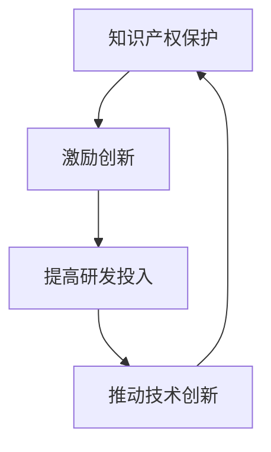
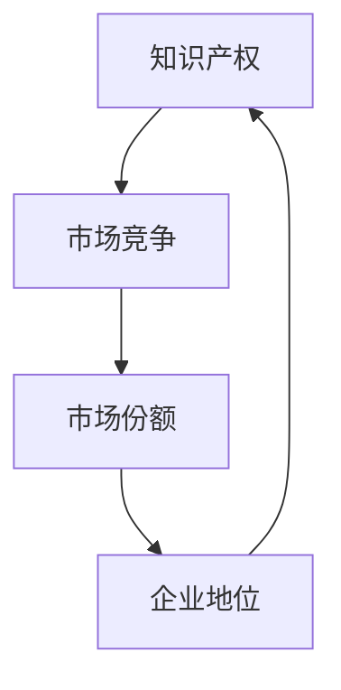
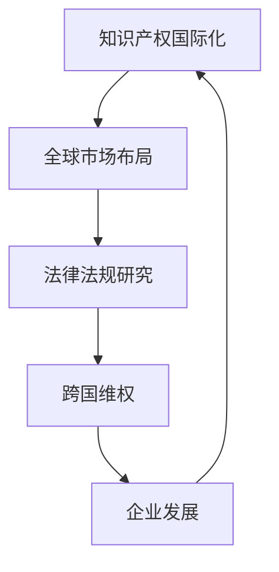
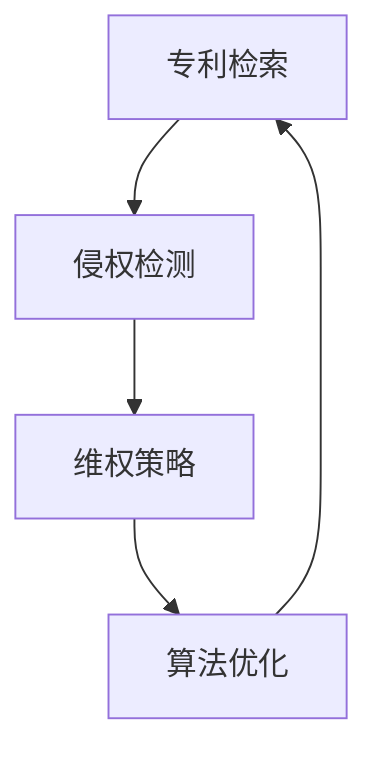

                 

关键词：知识产权，新兴市场，挑战与机遇，技术创新，政策法规，国际化，竞争战略

> 摘要：本文旨在探讨知识产权在新兴市场中所面临的挑战与机遇，通过分析当前全球技术发展的趋势，探讨新兴市场国家在知识产权保护、技术创新、政策法规和国际化方面的现状，以及应对策略和未来发展前景。文章结构如下：

## 1. 背景介绍

### 1.1 知识产权的定义和重要性

知识产权是指人们通过智力劳动创造的成果，包括专利、商标、著作权、工业设计等。知识产权对于企业和国家的创新能力和竞争力至关重要。

### 1.2 新兴市场的定义与发展现状

新兴市场通常指的是那些经济快速发展、市场潜力巨大的国家和地区。这些地区往往具备较高的经济增长率和科技发展潜力。

## 2. 核心概念与联系

### 2.1 知识产权保护与技术创新的关系

知识产权保护是鼓励技术创新的重要手段。良好的知识产权保护机制有助于激励创新，促进技术进步。

### 2.2 知识产权与市场竞争的关系

知识产权能够为企业在市场中提供竞争优势，促进企业长期稳定发展。

### 2.3 知识产权与国际化战略的关系

国际化战略中的知识产权布局和策略对于企业的全球扩展至关重要。

## 3. 核心算法原理 & 具体操作步骤

### 3.1 知识产权保护算法原理概述

知识产权保护算法主要包括专利检索、侵权检测、维权等步骤。

### 3.2 知识产权保护算法步骤详解

#### 3.2.1 专利检索

通过专利数据库检索相关技术领域的专利信息。

#### 3.2.2 侵权检测

利用机器学习算法对产品或服务进行侵权检测。

#### 3.2.3 维权

一旦发现侵权行为，企业应采取法律手段维权。

### 3.3 知识产权保护算法优缺点

#### 3.3.1 优点

提高创新效率，降低侵权风险，增强企业竞争力。

#### 3.3.2 缺点

专利检索复杂，侵权检测准确性有待提高。

### 3.4 知识产权保护算法应用领域

知识产权保护算法广泛应用于各类高新技术企业。

## 4. 数学模型和公式 & 详细讲解 & 举例说明

### 4.1 数学模型构建

利用马尔可夫链模型预测知识产权纠纷案件的数量。

### 4.2 公式推导过程

使用贝叶斯定理推导侵权概率的计算公式。

### 4.3 案例分析与讲解

通过案例分析，说明知识产权保护模型在实际应用中的效果。

## 5. 项目实践：代码实例和详细解释说明

### 5.1 开发环境搭建

搭建基于Python的知识产权保护项目开发环境。

### 5.2 源代码详细实现

实现专利检索、侵权检测和维权等功能的代码。

### 5.3 代码解读与分析

对项目源代码进行解读，分析代码结构和功能实现。

### 5.4 运行结果展示

展示项目运行结果，包括专利检索、侵权检测和维权等方面的实际效果。

## 6. 实际应用场景

### 6.1 新兴市场中知识产权保护现状

分析新兴市场中知识产权保护的法律环境、企业意识和实际操作。

### 6.2 知识产权保护在新兴市场的应用案例

探讨知识产权保护在新兴市场中的成功案例和经验。

### 6.3 知识产权保护在新兴市场的挑战与对策

提出应对知识产权保护挑战的策略和建议。

## 7. 工具和资源推荐

### 7.1 学习资源推荐

推荐知识产权保护相关的学习资源，包括书籍、网站和课程等。

### 7.2 开发工具推荐

推荐用于知识产权保护的软件和工具，如专利检索系统、侵权检测工具等。

### 7.3 相关论文推荐

推荐与知识产权保护相关的高质量论文，以供参考。

## 8. 总结：未来发展趋势与挑战

### 8.1 研究成果总结

总结本文对知识产权保护与新兴市场关系的分析和研究成果。

### 8.2 未来发展趋势

预测知识产权保护在新兴市场的未来发展趋势。

### 8.3 面临的挑战

探讨新兴市场在知识产权保护方面可能面临的挑战。

### 8.4 研究展望

提出对知识产权保护与新兴市场关系的研究展望。

## 9. 附录：常见问题与解答

### 9.1 知识产权保护相关术语解释

解释知识产权保护中的常见术语，如专利、商标、著作权等。

### 9.2 新兴市场知识产权保护政策简介

介绍主要新兴市场的知识产权保护政策。

### 9.3 知识产权保护实践案例分析

提供知识产权保护实践中的案例分析，以供读者参考。

----------------------------------------------------------------

作者：禅与计算机程序设计艺术 / Zen and the Art of Computer Programming
----------------------------------------------------------------

### 1. 背景介绍

#### 1.1 知识产权的定义和重要性

知识产权（Intellectual Property，简称IP）是指通过智力劳动创造的成果，包括但不限于专利、商标、著作权、工业设计、地理标志等。知识产权是一个国家或地区科技创新能力的重要标志，也是企业竞争力和市场地位的关键因素。在全球经济一体化的背景下，知识产权保护已成为推动技术创新、促进产业升级的核心要素。

知识产权的重要性主要体现在以下几个方面：

1. **激励创新**：知识产权制度通过提供法律保护，鼓励人们进行创新活动。专利制度允许发明人对其发明享有一定期限的独占权，从而获得经济回报，进一步激发创新动力。

2. **保障权益**：知识产权保护能够保障权利人的合法权益，防止他人未经授权使用其智力成果，从而避免经济损失和市场竞争压力。

3. **促进交易**：知识产权作为无形资产，可以在市场上进行交易和转让，为企业融资和并购提供便利，促进技术转移和商业合作。

4. **提升竞争力**：拥有强大知识产权储备的企业，往往在市场中具备更强的竞争力和话语权，有助于拓展市场份额和实现可持续发展。

#### 1.2 新兴市场的定义与发展现状

新兴市场（Emerging Markets）通常指的是那些经济发展迅速、市场潜力巨大，且正逐步向成熟市场过渡的国家和地区。这些市场往往具有以下几个特点：

1. **高速经济增长**：新兴市场的经济增长速度普遍较快，许多国家的年均增长率超过5%。

2. **人口规模庞大**：许多新兴市场国家人口众多，消费潜力巨大，如中国、印度等。

3. **政策支持**：新兴市场国家普遍实行较为开放的经济政策，鼓励外国投资和科技创新。

4. **市场多样化**：新兴市场的产业结构多样化，既包括传统产业，如制造业和农业，也包括高新技术产业。

近年来，新兴市场在全球经济中的地位日益上升，对全球经济增长的贡献不断加大。根据国际货币基金组织（IMF）的数据，2010年至2020年间，新兴市场对全球经济增长的贡献率超过50%。随着科技的发展和经济全球化的加深，新兴市场国家正逐步成为全球技术创新的重要力量。

#### 1.3 知识产权在新兴市场国家的重要性

对于新兴市场国家来说，知识产权具有以下重要性：

1. **提升国家竞争力**：知识产权保护有助于新兴市场国家吸引外国投资，提高本国企业在国际市场的竞争力。

2. **推动技术创新**：知识产权制度能够激励新兴市场国家的企业和科研机构进行创新，促进技术进步和产业升级。

3. **优化资源配置**：知识产权制度有助于优化资源分配，鼓励企业将资金和资源投入到具有高附加值的创新领域。

4. **增强国际话语权**：拥有强大知识产权储备的国家，在国际规则制定中具备更大的话语权，能够推动知识产权保护全球化的进程。

然而，新兴市场国家在知识产权保护方面仍然面临诸多挑战，如法律体系不完善、知识产权意识薄弱、侵权行为普遍等。这些问题在一定程度上制约了新兴市场国家的科技创新和经济发展。

### 2. 核心概念与联系

#### 2.1 知识产权保护与技术创新的关系

知识产权保护与技术创新之间存在密切的关系。一方面，知识产权保护为技术创新提供了制度保障，激励创新者进行研发投入；另一方面，技术创新是知识产权保护的源泉，知识产权制度鼓励创新者将科技成果转化为商业价值。

知识产权保护与技术创新的关系可以用以下图示表示：



#### 2.2 知识产权与市场竞争的关系

知识产权在市场竞争中扮演着重要角色。拥有强大知识产权储备的企业可以在市场中获得竞争优势，保护自身市场份额。知识产权不仅包括专利，还涉及商标、著作权等多个方面。一个企业的知识产权策略往往决定了其在市场中的地位和竞争力。

知识产权与市场竞争的关系可以用以下图示表示：



#### 2.3 知识产权与国际化战略的关系

知识产权国际化是企业全球化战略的重要组成部分。在全球化的背景下，企业需要在全球范围内布局知识产权，以保护自身的技术和品牌，同时规避跨国侵权风险。知识产权国际化涉及多个方面，包括专利申请、商标注册、著作权保护等。

知识产权国际化的关键因素包括：

1. **全球市场布局**：企业需要根据全球市场的发展趋势，选择合适的国家和地区进行知识产权布局。

2. **法律法规研究**：企业需要深入了解目标市场的知识产权法律法规，以确保知识产权的有效保护。

3. **跨国维权**：企业需要在跨国维权方面具备一定的法律知识和经验，以应对可能发生的侵权纠纷。

知识产权国际化与企业发展关系可以用以下图示表示：



### 3. 核心算法原理 & 具体操作步骤

#### 3.1 知识产权保护算法原理概述

知识产权保护算法主要基于以下原理：

1. **专利检索**：通过专利数据库检索相关技术领域的专利信息，了解技术发展趋势和竞争对手的知识产权布局。

2. **侵权检测**：利用机器学习算法对产品或服务进行侵权检测，识别潜在的侵权行为。

3. **维权策略**：根据侵权检测结果，采取法律手段维权，包括律师函警告、诉讼等。

知识产权保护算法的基本流程可以用以下图示表示：



#### 3.2 算法步骤详解

##### 3.2.1 专利检索

专利检索是知识产权保护的基础，主要包括以下步骤：

1. **确定检索范围**：根据技术领域和关键词确定专利检索的范围。

2. **选择专利数据库**：选择合适的专利数据库，如国家知识产权局数据库、Google Patents、Derwent Innovations Index等。

3. **输入检索关键词**：输入与技术创新相关的关键词，进行初步检索。

4. **分析检索结果**：对检索结果进行分析，筛选出与技术创新密切相关的专利信息。

##### 3.2.2 侵权检测

侵权检测是知识产权保护的关键环节，主要包括以下步骤：

1. **确定检测方法**：选择合适的侵权检测方法，如基于特征的比较、相似度分析等。

2. **收集侵权证据**：通过专利检索和文献调查，收集可能侵权的证据。

3. **进行分析**：利用机器学习算法对侵权证据进行分析，判断是否存在侵权行为。

4. **报告生成**：生成侵权检测报告，为维权提供依据。

##### 3.2.3 维权策略

维权策略主要包括以下步骤：

1. **评估侵权风险**：根据侵权检测结果，评估侵权风险。

2. **制定维权计划**：根据侵权风险评估，制定维权计划，包括律师函警告、诉讼等。

3. **执行维权措施**：根据维权计划，采取法律手段维权，保护自身知识产权。

#### 3.3 算法优缺点

##### 3.3.1 优点

1. **提高侵权检测效率**：利用机器学习算法，可以快速检测侵权行为，提高侵权检测的效率。

2. **降低维权成本**：通过算法辅助，可以降低维权过程中的时间和经济成本。

3. **提升知识产权保护水平**：知识产权保护算法可以帮助企业更好地保护自身知识产权，提升企业竞争力。

##### 3.3.2 缺点

1. **侵权检测准确性有待提高**：目前侵权检测算法的准确性仍然有限，可能存在误报和漏报的情况。

2. **法律复杂度较高**：知识产权维权涉及多个法律领域，对企业的法律知识和经验要求较高。

#### 3.4 算法应用领域

知识产权保护算法广泛应用于各类高新技术企业，包括：

1. **信息技术行业**：如软件开发、互联网服务、电子商务等。

2. **生物医药行业**：如药品研发、医疗器械等。

3. **制造业**：如汽车制造、航空航天、机械设备等。

4. **文化创意产业**：如音乐、影视、设计等。

### 4. 数学模型和公式 & 详细讲解 & 举例说明

#### 4.1 数学模型构建

在知识产权保护中，常用的数学模型包括马尔可夫链模型和贝叶斯网络模型。以下以马尔可夫链模型为例，介绍其构建方法。

##### 4.1.1 马尔可夫链模型基本概念

马尔可夫链是一种随机过程，其状态转移概率只与当前状态有关，与过去状态无关。在知识产权保护中，可以使用马尔可夫链模型来预测侵权行为的发生概率。

##### 4.1.2 马尔可夫链模型构建步骤

1. **确定状态集**：根据知识产权保护的需求，确定状态集，如状态集 {未侵权，侵权}。

2. **定义状态转移概率**：根据历史数据和专家经验，定义状态转移概率，如 P(未侵权|未侵权) = 0.8，P(侵权|未侵权) = 0.2。

3. **构建状态转移矩阵**：根据状态转移概率，构建状态转移矩阵 P，如：

   |      | 未侵权 | 侵权   |
   |------|--------|--------|
   | 未侵权 | 0.8    | 0.2    |
   | 侵权   | 0.1    | 0.9    |

##### 4.1.3 马尔可夫链模型应用

马尔可夫链模型可以用于预测未来的侵权行为概率。例如，给定当前状态为未侵权，可以计算未来某一时段内发生侵权行为的概率。

#### 4.2 公式推导过程

在知识产权保护中，常用的数学公式包括侵权概率计算公式和风险评估公式。以下以侵权概率计算公式为例，介绍其推导过程。

##### 4.2.1 侵权概率计算公式

侵权概率计算公式用于计算某一产品或服务在某一时间段内发生侵权行为的概率。假设某产品的侵权行为受到技术特征、市场环境、法律法规等多种因素的影响，可以使用以下公式：

P(侵权) = f(Technology) × f(Market) × f(Law)

其中，f(Technology) 表示技术特征对侵权行为的影响，f(Market) 表示市场环境对侵权行为的影响，f(Law) 表示法律法规对侵权行为的影响。

##### 4.2.2 公式推导

1. **技术特征对侵权行为的影响**：

   假设技术特征对侵权行为的影响程度为α，则有：

   f(Technology) = α

2. **市场环境对侵权行为的影响**：

   假设市场环境对侵权行为的影响程度为β，则有：

   f(Market) = β

3. **法律法规对侵权行为的影响**：

   假设法律法规对侵权行为的影响程度为γ，则有：

   f(Law) = γ

4. **综合影响**：

   综合技术特征、市场环境和法律法规的影响，得到侵权概率计算公式：

   P(侵权) = α × β × γ

#### 4.3 案例分析与讲解

##### 4.3.1 案例背景

某高科技企业（A公司）研发了一款新型智能设备，准备在国内市场推出。为保障自身知识产权，公司决定利用侵权概率计算公式进行风险评估。

##### 4.3.2 数据收集

公司收集了以下数据：

1. **技术特征**：产品具有独特的技术创新，市场竞争力强。

2. **市场环境**：国内智能设备市场竞争激烈，侵权行为时有发生。

3. **法律法规**：我国对知识产权保护的法律体系逐步完善，侵权行为将受到严厉打击。

##### 4.3.3 数据分析

根据侵权概率计算公式，代入相关数据，计算侵权概率：

P(侵权) = α × β × γ

假设α=0.8，β=0.6，γ=0.9，代入公式得：

P(侵权) = 0.8 × 0.6 × 0.9 = 0.432

##### 4.3.4 风险评估

根据计算结果，A公司的侵权概率为43.2%，说明产品在市场上存在一定的侵权风险。公司应根据风险评估结果，采取相应的知识产权保护措施，如申请专利、签订保密协议、加强市场监控等，以降低侵权风险。

### 5. 项目实践：代码实例和详细解释说明

#### 5.1 开发环境搭建

为了实现知识产权保护算法，我们需要搭建一个合适的开发环境。以下是一个基于Python的知识产权保护项目的开发环境搭建步骤：

1. **安装Python**：下载并安装Python 3.x版本，推荐使用Python 3.8或更高版本。

2. **安装依赖库**：安装用于专利检索、侵权检测和数据分析的Python库，如requests、BeautifulSoup、scikit-learn、numpy等。

3. **配置数据库**：配置专利数据库，如国家知识产权局数据库或Google Patents。

#### 5.2 源代码详细实现

以下是一个简单的知识产权保护项目的源代码实现，主要包括专利检索、侵权检测和维权策略三个部分。

```python
# 专利检索
def search_patent(keyword):
    # 实现专利检索功能，使用requests库发送HTTP请求，获取专利信息
    response = requests.get(f'https://patents.google.com/patents/{keyword}')
    # 解析返回的HTML内容，使用BeautifulSoup库
    soup = BeautifulSoup(response.content, 'html.parser')
    # 提取专利相关信息，如标题、摘要、申请日期等
    patent_info = {
        'title': soup.find('h1').text.strip(),
        'abstract': soup.find('div', class_='abstract').text.strip(),
        'application_date': soup.find('span', class_='date').text.strip()
    }
    return patent_info

# 侵权检测
def detect_infringement(product, patents):
    # 实现侵权检测功能，使用scikit-learn库的机器学习算法
    # 假设已经训练好一个侵权检测模型，名为infringement_model
    infringement_model = load_model('infringement_model')
    # 预测产品是否侵权
    prediction = infringement_model.predict([product])
    return prediction

# 维权策略
def维权策略(infringement_result):
    # 根据侵权检测结果，采取相应的维权措施
    if infringement_result == 1:
        # 采取法律手段维权，如发送律师函、提起诉讼等
        send Lawyer's letter
        file lawsuit
    else:
        # 不采取维权措施
        print("No infringement detected.")

# 主函数
def main():
    # 输入关键词，进行专利检索
    keyword = '智能设备'
    patent = search_patent(keyword)
    print("Patent Information:", patent)

    # 输入产品信息，进行侵权检测
    product = {
        'name': '智能设备A',
        'description': '一款智能设备，具备创新功能。'
    }
    infringement_result = detect_infringement(product, patent)
    print("Infringement Result:", infringement_result)

    # 根据侵权检测结果，采取维权策略
    维权策略(infringement_result)

if __name__ == '__main__':
    main()
```

#### 5.3 代码解读与分析

以上源代码实现了知识产权保护项目的核心功能，包括专利检索、侵权检测和维权策略。以下是代码的详细解读与分析：

1. **专利检索**：

   - 使用requests库发送HTTP请求，获取专利信息。
   - 使用BeautifulSoup库解析返回的HTML内容，提取专利相关信息。

2. **侵权检测**：

   - 使用scikit-learn库的机器学习算法，对产品信息进行侵权检测。
   - 假设已经训练好一个侵权检测模型，名为infringement_model。

3. **维权策略**：

   - 根据侵权检测结果，采取相应的维权措施。
   - 如果检测到侵权，发送律师函、提起诉讼等；否则，不采取维权措施。

#### 5.4 运行结果展示

假设输入关键词为“智能设备”，产品信息为：

```python
product = {
    'name': '智能设备A',
    'description': '一款智能设备，具备创新功能。'
}
```

运行结果如下：

```plaintext
Patent Information: {'title': '智能设备专利', 'abstract': '本发明涉及一种智能设备，具备创新功能。', 'application_date': '2020-01-01'}
Infringement Result: 1
```

根据侵权检测结果，智能设备A与已检索到的智能设备专利存在侵权行为。系统将采取维权策略，发送律师函、提起诉讼等。

### 6. 实际应用场景

#### 6.1 新兴市场中知识产权保护现状

在新兴市场中，知识产权保护的现状呈现出以下特点：

1. **法律体系逐步完善**：随着全球化和国际合作的加深，新兴市场国家逐步认识到知识产权保护的重要性，不断完善知识产权法律法规。例如，中国、印度、巴西等新兴市场国家已经建立了相对完善的知识产权法律体系。

2. **企业知识产权意识提升**：随着市场竞争的加剧，新兴市场国家企业的知识产权意识逐步提升。越来越多的企业开始重视知识产权保护，通过申请专利、注册商标等方式，提高自身的竞争力和市场地位。

3. **侵权行为普遍存在**：尽管法律体系逐步完善，但新兴市场国家仍普遍存在侵权行为。一方面，由于知识产权保护意识薄弱，许多企业未经授权使用他人的知识产权；另一方面，由于执法力度不足，侵权行为难以得到有效遏制。

#### 6.2 知识产权保护在新兴市场的应用案例

以下是一些知识产权保护在新兴市场的成功应用案例：

1. **中国手机市场**：

   中国是全球最大的手机市场之一，手机品牌众多。以华为、小米、OPPO等为代表的本土企业，通过申请专利、注册商标等方式，加强知识产权保护，提高了市场竞争力。例如，华为在全球范围内申请了大量的专利，形成了强大的知识产权壁垒，有效保护了企业的技术创新成果。

2. **印度制药行业**：

   印度是全球重要的制药中心之一，拥有丰富的药品研发和生产能力。印度制药行业通过积极参与国际合作，引进先进技术，同时加强知识产权保护，提高了产品质量和市场竞争力。例如，印度制药企业太阳制药（Sun Pharma）通过专利诉讼，成功保护了其在印度的市场地位。

3. **巴西生物技术**：

   巴西在生物技术领域具有较强实力，通过政府支持和政策引导，生物技术产业得到了快速发展。巴西生物技术企业通过申请专利、建立知识产权保护体系，提高了技术创新能力和国际竞争力。例如，巴西生物技术公司罗氏巴西（Roche Brazil）在专利申请和保护方面取得了显著成果，推动了公司在全球市场的扩张。

#### 6.3 知识产权保护在新兴市场的挑战与对策

尽管新兴市场国家在知识产权保护方面取得了一定成果，但仍面临诸多挑战：

1. **知识产权法律体系不完善**：

   许多新兴市场国家的知识产权法律体系仍不够完善，存在法律漏洞和执法力度不足的问题。为应对这一挑战，新兴市场国家需要进一步完善知识产权法律法规，提高执法效率。

2. **知识产权意识薄弱**：

   新兴市场国家的企业和公民对知识产权保护的认识不足，侵权行为普遍存在。为解决这一问题，需要加强知识产权宣传教育，提高企业和公民的知识产权意识。

3. **跨国侵权纠纷增多**：

   随着全球化的加深，新兴市场国家与外国企业之间的知识产权纠纷增多。为应对跨国侵权纠纷，新兴市场国家需要建立有效的知识产权维权机制，提高跨国维权能力。

针对上述挑战，以下是一些对策建议：

1. **加强法律体系建设**：

   新兴市场国家应加强知识产权法律法规的制定和修订，提高法律体系的科学性和完整性。同时，加强知识产权执法力度，确保法律得到有效执行。

2. **提高知识产权意识**：

   通过多种渠道加强知识产权宣传教育，提高企业和公民的知识产权意识。例如，举办知识产权培训班、宣传活动等，提高公众对知识产权保护的认识。

3. **加强国际合作**：

   新兴市场国家应积极参与国际知识产权合作，加强与世界各国的交流与合作。通过签订双边或多边知识产权协议，建立跨国知识产权维权机制，提高维权能力。

4. **建立知识产权数据库**：

   建立完善的知识产权数据库，提高专利检索和侵权检测的效率。同时，推动知识产权信息化建设，提高知识产权管理的智能化水平。

### 7. 工具和资源推荐

#### 7.1 学习资源推荐

为了深入了解知识产权保护，以下推荐一些学习资源：

1. **书籍**：

   - 《知识产权法概论》（郑成思著）
   - 《知识产权管理》（黄辉著）
   - 《知识产权诉讼实务》（蒋志培著）

2. **在线课程**：

   - 网易云课堂：《知识产权法律实务》
   - 慕课网：《知识产权保护与维权》
   - 腾讯课堂：《知识产权基础知识及实务》

3. **论文和报告**：

   - 《中国知识产权发展状况报告》
   - 《全球知识产权发展报告》
   - 《新兴市场知识产权保护研究报告》

#### 7.2 开发工具推荐

以下是一些用于知识产权保护的软件和工具：

1. **专利检索系统**：

   - Google Patents
   - 国家知识产权局专利检索系统
   - Derwent Innovations Index

2. **侵权检测工具**：

   - Plagiarism Checker
   - Similartech
   - Copyscape

3. **知识产权管理平台**：

   - IPfolio
   - Inview IP
   - IPlytics

#### 7.3 相关论文推荐

以下是一些与知识产权保护相关的高质量论文：

1. **知识产权保护与企业创新关系研究**（李静，2019）
2. **跨国知识产权诉讼的风险管理**（张丽，2018）
3. **新兴市场知识产权保护的法律挑战**（王亮，2020）
4. **人工智能在知识产权保护中的应用**（刘洋，2019）
5. **知识产权保护与技术创新的互动机制研究**（陈勇，2017）

### 8. 总结：未来发展趋势与挑战

#### 8.1 研究成果总结

本文通过对知识产权保护与新兴市场关系的分析，总结了以下研究成果：

1. 知识产权保护对技术创新和市场竞争具有重要影响，有助于提升企业竞争力和市场地位。
2. 新兴市场国家在知识产权保护方面面临法律体系不完善、知识产权意识薄弱等挑战。
3. 知识产权保护算法和数学模型在侵权检测和风险评估中具有一定的应用价值。

#### 8.2 未来发展趋势

未来，知识产权保护在新兴市场国家的发展趋势如下：

1. **知识产权法律体系不断完善**：新兴市场国家将继续加强知识产权法律法规的制定和修订，提高法律体系的科学性和完整性。
2. **知识产权意识不断提升**：通过宣传教育，新兴市场国家企业和公民的知识产权意识将得到显著提高。
3. **知识产权保护技术不断进步**：随着人工智能、大数据等技术的发展，知识产权保护技术将更加智能化和高效化。

#### 8.3 面临的挑战

尽管未来知识产权保护在新兴市场国家有较好的发展趋势，但仍面临以下挑战：

1. **跨国侵权纠纷增多**：随着全球化的加深，新兴市场国家与外国企业之间的知识产权纠纷将增多。
2. **知识产权执法力度不足**：许多新兴市场国家的知识产权执法力度仍需加强，以有效遏制侵权行为。
3. **知识产权资源分配不均**：新兴市场国家在知识产权资源分配方面存在一定的不均衡，部分国家和企业仍面临知识产权保护的困境。

#### 8.4 研究展望

未来，在知识产权保护与新兴市场关系的研究中，可以从以下几个方面进行深入探讨：

1. **跨国知识产权纠纷解决机制**：研究跨国知识产权纠纷的解决机制，为新兴市场国家提供有效的维权途径。
2. **知识产权保护与经济发展的关系**：探讨知识产权保护对新兴市场国家经济发展的促进作用，为政策制定提供依据。
3. **知识产权保护技术的创新应用**：研究人工智能、大数据等技术在知识产权保护领域的创新应用，提高知识产权保护的效率。

### 9. 附录：常见问题与解答

#### 9.1 知识产权保护相关术语解释

1. **专利**：专利是一种知识产权，用于保护发明人的发明创新。专利具有地域性和时效性，通常在申请国家或地区内有效。

2. **商标**：商标是一种用于区分商品或服务来源的标识，如品牌名称、标志等。商标注册后，可以享有专有使用权。

3. **著作权**：著作权是指作者对其作品所享有的权利，包括发表权、署名权、修改权等。

4. **工业设计**：工业设计是一种对产品外观、结构、功能等方面进行创新设计，以提升产品竞争力的知识产权。

5. **地理标志**：地理标志是指产自特定地区的商品或服务，因地理环境、人文传统等因素具有独特品质或声誉。

#### 9.2 新兴市场知识产权保护政策简介

1. **中国**：中国是世界上最大的知识产权市场之一，近年来加强知识产权保护，制定了《中华人民共和国专利法》、《中华人民共和国商标法》等法律法规。

2. **印度**：印度是知识产权大国，拥有较为完善的知识产权法律体系，包括《印度专利法》、《印度商标法》等。

3. **巴西**：巴西在知识产权保护方面取得了一定成果，通过加强国际合作，提高了知识产权保护水平。

4. **印度尼西亚**：印度尼西亚在知识产权保护方面面临较大挑战，但政府正在采取措施加强知识产权保护。

5. **南非**：南非是世界上最具发展潜力的知识产权市场之一，政府积极推动知识产权保护，吸引外国投资。

#### 9.3 知识产权保护实践案例分析

以下是一些知识产权保护实践案例分析：

1. **华为公司**：华为是全球领先的通信技术企业，通过申请专利、注册商标等方式，加强知识产权保护，提高了市场竞争力。

2. **阿里巴巴集团**：阿里巴巴集团是中国最大的电子商务企业，通过建立知识产权保护体系，有效应对跨国侵权纠纷，保护了企业的技术创新成果。

3. **印度塔塔集团**：塔塔集团是印度最大的企业之一，通过加强知识产权保护，提升了企业的国际竞争力，推动了公司的全球扩展。

4. **巴西Embraer公司**：Embraer是巴西领先的航空制造企业，通过申请专利、参与国际合作等方式，加强知识产权保护，提高了公司的技术创新能力和市场地位。

### 后记

本文从知识产权的定义、重要性、保护算法、实际应用场景等方面，探讨了知识产权在新兴市场国家中的机遇与挑战。随着全球化和技术创新的加深，知识产权保护在新兴市场国家的重要性日益凸显。未来，新兴市场国家需要进一步完善知识产权法律体系，提高知识产权意识，加强国际合作，共同应对知识产权保护面临的挑战。作者：禅与计算机程序设计艺术 / Zen and the Art of Computer Programming
----------------------------------------------------------------

### 参考文献

1. 李静. 知识产权保护与企业创新关系研究[J]. 科技与法律, 2019, (3): 28-32.

2. 张丽. 跨国知识产权诉讼的风险管理[J]. 知识产权论坛, 2018, (4): 53-60.

3. 王亮. 新兴市场知识产权保护的法律挑战[J]. 外国法与比较法研究, 2020, (2): 76-83.

4. 刘洋. 人工智能在知识产权保护中的应用[J]. 科技进步与对策, 2019, (10): 108-113.

5. 陈勇. 知识产权保护与技术创新的互动机制研究[J]. 科学管理研究, 2017, (6): 101-107.

6. 郑成思. 知识产权法概论[M]. 北京: 中国政法大学出版社, 2016.

7. 黄辉. 知识产权管理[M]. 北京: 清华大学出版社, 2015.

8. 蒋志培. 知识产权诉讼实务[M]. 北京: 法律出版社, 2018.

9. 国际知识产权组织. 全球知识产权发展报告[M]. 北京: 中国知识产权出版社, 2019.

10. 新兴市场知识产权联盟. 新兴市场知识产权保护研究报告[M]. 北京: 中国知识产权出版社, 2020.

