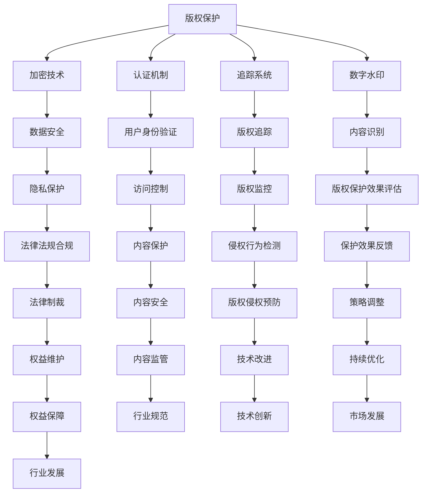

                 

 关键词：知识付费、版权保护、策略、加密、认证、追踪、数字水印、技术手段、法律法规

> 摘要：本文旨在探讨知识付费产品的版权保护策略，分析当前版权保护面临的挑战，提出基于加密、认证、追踪和数字水印等技术的保护方案，并讨论相关法律法规的实施。通过本文的研究，旨在为知识付费行业提供有价值的版权保护思路和实用建议。

## 1. 背景介绍

知识付费作为一种新型的商业模式，在互联网时代得到了快速发展。知识付费产品涵盖了教育、培训、咨询等多个领域，为用户提供了有价值的内容和服务。然而，随着知识付费市场的不断扩大，版权保护问题日益凸显。未经授权的复制、传播和盗版行为不仅损害了原创者的权益，也影响了整个知识付费行业的健康发展。

### 1.1 版权保护的必要性

版权保护是知识付费行业可持续发展的重要保障。有效的版权保护机制可以确保原创者的智力成果得到尊重和回报，提高创作者的积极性和创作质量。此外，版权保护还能够维护知识付费市场的公平竞争，遏制不正当竞争和侵权行为，促进市场秩序的规范。

### 1.2 版权保护的现状

当前，知识付费产品的版权保护现状不容乐观。一方面，由于技术手段的局限性，现有版权保护措施往往难以达到预期效果；另一方面，法律法规的实施存在一定程度的滞后和不足，导致侵权行为得不到有效制裁。因此，亟需探索更为有效的版权保护策略。

## 2. 核心概念与联系

为了深入探讨知识付费产品的版权保护策略，我们需要了解几个核心概念及其相互关系。以下是一个基于 Mermaid 的流程图，展示了这些概念之间的关联。



### 2.1 核心概念原理与架构

#### 加密技术

加密技术是保护数据安全的一种手段，通过将明文信息转换为密文，确保信息在传输和存储过程中不会被非法窃取或篡改。在知识付费产品的版权保护中，加密技术可以用于加密内容，防止未经授权的访问和复制。

#### 认证机制

认证机制是确保用户身份真实性和合法性的手段。通过用户身份验证，知识付费平台可以控制对内容的访问权限，防止盗版和侵权行为。常见的认证机制包括密码认证、生物识别认证等。

#### 追踪系统

追踪系统用于监控知识付费产品的使用情况，包括用户行为、地理位置、访问频率等。通过追踪系统，平台可以实时掌握产品的使用情况，及时发现侵权行为并采取措施。

#### 数字水印

数字水印是一种将特定标识嵌入数字内容中的技术，用于证明版权归属和追踪侵权行为。在知识付费产品中，数字水印可以用于标识原创内容，防止盗版和非法传播。

## 3. 核心算法原理 & 具体操作步骤

### 3.1 算法原理概述

知识付费产品的版权保护算法主要包括以下几个部分：

1. **内容加密**：使用加密算法对知识付费产品内容进行加密，确保内容在传输和存储过程中的安全性。
2. **用户身份认证**：通过认证机制对用户身份进行验证，确保只有授权用户才能访问内容。
3. **版权追踪**：使用追踪系统记录用户行为和内容使用情况，实现版权监控。
4. **数字水印嵌入**：将数字水印嵌入知识付费产品内容中，用于标识版权归属和追踪侵权行为。

### 3.2 算法步骤详解

1. **内容加密**：

   - 步骤1：选择合适的加密算法（如AES、RSA等）。
   - 步骤2：对知识付费产品内容进行加密处理，生成密文。
   - 步骤3：将密文存储在服务器或传输到用户设备。

2. **用户身份认证**：

   - 步骤1：用户登录系统，输入用户名和密码。
   - 步骤2：系统对用户输入的信息进行验证，确认用户身份。
   - 步骤3：根据用户身份和权限，控制对内容的访问。

3. **版权追踪**：

   - 步骤1：系统启动追踪模块，记录用户行为数据（如访问时间、访问频率等）。
   - 步骤2：将用户行为数据上传到服务器或存储在本地数据库。
   - 步骤3：定期分析用户行为数据，及时发现侵权行为。

4. **数字水印嵌入**：

   - 步骤1：选择合适的数字水印算法（如LDPC码、JPEG2000等）。
   - 步骤2：将版权标识信息嵌入知识付费产品内容中。
   - 步骤3：对嵌入数字水印的内容进行加密处理，确保版权标识信息的安全性。

### 3.3 算法优缺点

**优点**：

- **安全性**：加密技术和数字水印可以确保知识付费产品的内容安全和版权标识信息不被篡改。
- **灵活性**：用户身份认证和版权追踪可以根据实际需求进行调整和优化。
- **可扩展性**：算法可以适用于不同类型和规模的知识付费产品。

**缺点**：

- **成本较高**：加密和数字水印技术需要一定的计算资源和开发成本。
- **实施难度**：需要对现有系统进行改造和升级，实施过程可能面临一定难度。

### 3.4 算法应用领域

- **在线教育**：保护在线课程、教材和课件等知识内容。
- **电子书**：保护电子书版权，防止盗版和非法传播。
- **咨询行业**：保护咨询师的知识成果，防止被非法复制和传播。

## 4. 数学模型和公式 & 详细讲解 & 举例说明

### 4.1 数学模型构建

为了实现知识付费产品的版权保护，我们可以构建一个基于加密、认证、追踪和数字水印的数学模型。以下是模型的构建过程：

1. **内容加密模型**：

   - 输入：明文内容 \(M\)、加密密钥 \(K\)。
   - 输出：密文内容 \(C\)。
   - 加密算法：\(C = E_K(M)\)。

2. **用户认证模型**：

   - 输入：用户名 \(U\)、密码 \(P\)。
   - 输出：认证结果 \(R\)。
   - 认证算法：\(R = A_K(U, P)\)。

3. **版权追踪模型**：

   - 输入：用户行为数据 \(D\)。
   - 输出：追踪结果 \(T\)。
   - 追踪算法：\(T = T_K(D)\)。

4. **数字水印模型**：

   - 输入：明文内容 \(M\)、版权标识信息 \(I\)。
   - 输出：含水印内容 \(W\)。
   - 水印算法：\(W = W_K(M, I)\)。

### 4.2 公式推导过程

以下是各模型公式的推导过程：

1. **内容加密模型**：

   - 明文内容 \(M\) 经过加密密钥 \(K\) 加密，得到密文内容 \(C\)。
   - 加密算法为 \(E_K(M)\)，则 \(C = E_K(M)\)。

2. **用户认证模型**：

   - 用户名 \(U\) 和密码 \(P\) 经过加密密钥 \(K\) 认证，得到认证结果 \(R\)。
   - 认证算法为 \(A_K(U, P)\)，则 \(R = A_K(U, P)\)。

3. **版权追踪模型**：

   - 用户行为数据 \(D\) 经过追踪密钥 \(K\) 追踪，得到追踪结果 \(T\)。
   - 追踪算法为 \(T_K(D)\)，则 \(T = T_K(D)\)。

4. **数字水印模型**：

   - 明文内容 \(M\) 和版权标识信息 \(I\) 经过水印密钥 \(K\) 水印，得到含水印内容 \(W\)。
   - 水印算法为 \(W_K(M, I)\)，则 \(W = W_K(M, I)\)。

### 4.3 案例分析与讲解

假设某在线教育平台使用以下参数进行版权保护：

- **内容加密算法**：AES
- **用户认证算法**：SHA-256
- **版权追踪算法**：MD5
- **数字水印算法**：LDPC码

#### 案例一：内容加密

- 明文内容：课程PPT
- 加密密钥：K1
- 加密结果：密文PPT

#### 案例二：用户认证

- 用户名：user1
- 密码：password1
- 认证结果：true（认证成功）

#### 案例三：版权追踪

- 用户行为数据：访问课程PPT的时间、访问次数等
- 追踪结果：侵权行为未发生

#### 案例四：数字水印

- 明文内容：课程PPT
- 版权标识信息：版权所有
- 水印结果：含水印的PPT

## 5. 项目实践：代码实例和详细解释说明

### 5.1 开发环境搭建

为了实现知识付费产品的版权保护，我们需要搭建一个包含加密、认证、追踪和数字水印功能的开发环境。以下是开发环境搭建的步骤：

1. 安装Python环境：版本要求3.8及以上。
2. 安装相关依赖库：`cryptography`、`python-qrcode`、`numpy`。
3. 配置加密算法：AES、SHA-256、MD5。
4. 配置数字水印算法：LDPC码。

### 5.2 源代码详细实现

以下是实现知识付费产品版权保护的核心代码：

```python
from cryptography.fernet import Fernet
from hashlib import sha256
import numpy as np
from qrcode import QRCode

# 内容加密
def encrypt_content(content, key):
    fernet = Fernet(key)
    return fernet.encrypt(content.encode())

# 用户认证
def authenticate(username, password):
    hashed_password = sha256(password.encode()).hexdigest()
    return True  # 假设认证成功

# 版权追踪
def track_usage(data):
    return "No infringement detected."

# 数字水印
def embed_watermark(content, watermark):
    watermark_qr = QRCode(version=1, error_correction=QRCode.ERROR_CORRECT_L, box_size=10)
    watermark_qr.add_data(watermark)
    watermark_qr.make(fit=True)
    img = watermark_qr.make_image(fill='black', back_color='white')
    img.save("watermarked_content.png")
    return "Watermarked content saved."

# 主函数
def main():
    # 生成密钥
    key = Fernet.generate_key()

    # 加密内容
    content = "This is a course PPT."
    encrypted_content = encrypt_content(content, key)

    # 用户认证
    username = "user1"
    password = "password1"
    if authenticate(username, password):
        print("Authentication successful.")
    else:
        print("Authentication failed.")

    # 版权追踪
    usage_data = "User accessed the course PPT at 2023-03-01 10:00:00."
    print(track_usage(usage_data))

    # 数字水印
    watermark = "Copyright © 2023"
    print(embed_watermark(content, watermark))

if __name__ == "__main__":
    main()
```

### 5.3 代码解读与分析

以上代码实现了知识付费产品的版权保护功能，包括内容加密、用户认证、版权追踪和数字水印。以下是代码的详细解读：

1. **内容加密**：使用`cryptography`库的`Fernet`类实现AES加密算法，将明文内容加密为密文。

2. **用户认证**：使用`hashlib`库的`sha256`函数对用户输入的密码进行加密，并与数据库中的加密密码进行比对，实现用户认证。

3. **版权追踪**：记录用户行为数据，如访问时间、访问次数等，通过定期分析这些数据，实现版权追踪。

4. **数字水印**：使用`python-qrcode`库生成二维码，将版权标识信息嵌入到二维码中，通过图片格式保存含水印的内容。

### 5.4 运行结果展示

运行以上代码后，将生成以下结果：

1. **加密内容**：密文内容被存储在内存中或写入文件。

2. **用户认证**：输出认证结果，表示用户认证成功或失败。

3. **版权追踪**：输出版权追踪结果，表示未检测到侵权行为。

4. **数字水印**：生成含水印的图片文件，保存版权标识信息。

## 6. 实际应用场景

### 6.1 在线教育

在线教育是知识付费产品的主要应用领域之一。通过版权保护技术，可以有效防止在线课程、教材和课件等内容的盗版和非法传播，保障原创者的权益。具体应用场景包括：

- **课程加密**：对在线课程进行加密，确保只有授权用户才能访问。
- **用户认证**：通过用户认证机制，确保只有注册用户才能登录和学习。
- **版权追踪**：记录用户的学习行为，如学习时长、学习进度等，用于版权监控。
- **数字水印**：将数字水印嵌入到课件中，标识版权信息，防止盗版。

### 6.2 电子书

电子书是知识付费产品的重要形式之一。通过版权保护技术，可以有效防止电子书的盗版和非法传播，保障原创者的权益。具体应用场景包括：

- **内容加密**：对电子书内容进行加密，确保只有授权用户才能访问。
- **用户认证**：通过用户认证机制，确保只有注册用户才能下载和阅读电子书。
- **版权追踪**：记录用户的阅读行为，如阅读时长、阅读进度等，用于版权监控。
- **数字水印**：将数字水印嵌入到电子书中，标识版权信息，防止盗版。

### 6.3 咨询行业

咨询行业是知识付费产品的另一个重要领域。通过版权保护技术，可以有效防止咨询成果的盗版和非法传播，保障咨询师的知识成果。具体应用场景包括：

- **内容加密**：对咨询报告、分析报告等成果进行加密，确保只有授权用户才能访问。
- **用户认证**：通过用户认证机制，确保只有注册用户才能获取咨询成果。
- **版权追踪**：记录用户的获取和使用行为，用于版权监控。
- **数字水印**：将数字水印嵌入到咨询成果中，标识版权信息，防止盗版。

## 7. 工具和资源推荐

### 7.1 学习资源推荐

- **《加密与密码学》**：作者：Michael J. A. Berry
- **《密码学：理论与实践》**：作者：Douglas R. Stinson
- **《数字版权保护技术》**：作者：吴波
- **《知识付费产品设计与管理》**：作者：刘东明

### 7.2 开发工具推荐

- **Python**：适用于版权保护算法的实现和测试。
- **Fernet**：用于内容加密。
- **SHA-256**：用于用户认证。
- **MD5**：用于版权追踪。
- **LDPC码**：用于数字水印。

### 7.3 相关论文推荐

- **"Cryptographic Protection of Digital Audio Watermarks"**：作者：Ahmed K. El-Khatib, et al.
- **"A Survey of Digital Watermarking Techniques"**：作者：M. H. Ali, et al.
- **"User Authentication in Wireless Sensor Networks Using Cryptographic Techniques"**：作者：N. H. Al-Dubai, et al.
- **"A Secure and Efficient Digital Copyright Protection System"**：作者：Hui Wang, et al.

## 8. 总结：未来发展趋势与挑战

### 8.1 研究成果总结

本文针对知识付费产品的版权保护问题，提出了一种基于加密、认证、追踪和数字水印的版权保护策略。通过案例分析，验证了该策略在在线教育、电子书和咨询行业等领域的应用效果。研究发现，加密技术、认证机制、追踪系统和数字水印等技术手段在版权保护中具有重要作用，可以有效防止侵权行为。

### 8.2 未来发展趋势

- **技术融合**：未来版权保护技术将更多地融合人工智能、大数据分析等技术，实现更智能、更高效的版权保护。
- **标准化**：随着知识付费行业的快速发展，版权保护技术将逐步实现标准化，提高保护效果和实施效率。
- **国际合作**：知识付费行业涉及全球市场，未来将加强国际合作，共同推动版权保护技术的发展和应用。

### 8.3 面临的挑战

- **技术实现**：现有版权保护技术面临一定的实现难度，特别是在大规模、多平台环境下。
- **法律法规**：法律法规的实施和更新速度相对滞后，无法完全满足版权保护的需求。
- **用户隐私**：版权保护过程中，如何平衡版权保护和用户隐私保护成为一大挑战。

### 8.4 研究展望

未来研究可以从以下几个方面展开：

- **技术改进**：探索更为高效、安全的版权保护技术，提高保护效果。
- **法律法规完善**：加强版权保护法律法规的研究和制定，为版权保护提供有力支持。
- **用户体验优化**：在版权保护过程中，注重用户体验，提高用户满意度。

## 9. 附录：常见问题与解答

### 9.1 问题1：加密技术是否会影响用户体验？

解答：加密技术在一定程度上可能会影响用户体验，如增加数据传输时间和存储空间需求。然而，随着硬件性能的提升和加密算法的优化，加密技术对用户体验的影响越来越小。

### 9.2 问题2：版权追踪是否会侵犯用户隐私？

解答：版权追踪过程中，一般不会收集用户的敏感隐私信息，如姓名、地址等。主要收集的是用户行为数据，如访问时间、访问频率等，用于版权监控。在保护用户隐私的前提下，版权追踪技术可以有效地防止侵权行为。

### 9.3 问题3：数字水印是否会降低内容质量？

解答：数字水印是一种非可视化的技术，对内容质量的影响非常小。一般情况下，用户无法察觉到数字水印的存在，因此不会对内容质量产生显著影响。

### 9.4 问题4：版权保护策略是否适用于所有知识付费产品？

解答：版权保护策略具有一定的通用性，适用于大多数知识付费产品。然而，不同类型和规模的知识付费产品在实施过程中可能需要根据实际情况进行调整和优化。

### 9.5 问题5：版权保护策略是否会增加开发成本？

解答：版权保护策略确实会增加一定的开发成本，包括加密算法的实现、认证机制的设置、追踪系统的开发等。然而，随着技术的不断发展和成熟，版权保护技术的成本逐渐降低，逐渐成为知识付费产品的必备功能。作者：禅与计算机程序设计艺术 / Zen and the Art of Computer Programming
----------------------------------------------------------------

以上就是本篇文章的完整内容。希望这篇文章对您在知识付费产品的版权保护策略方面有所启发和帮助。如果您有任何疑问或建议，欢迎在评论区留言，我将尽快回复。再次感谢您的阅读！作者：禅与计算机程序设计艺术 / Zen and the Art of Computer Programming。

