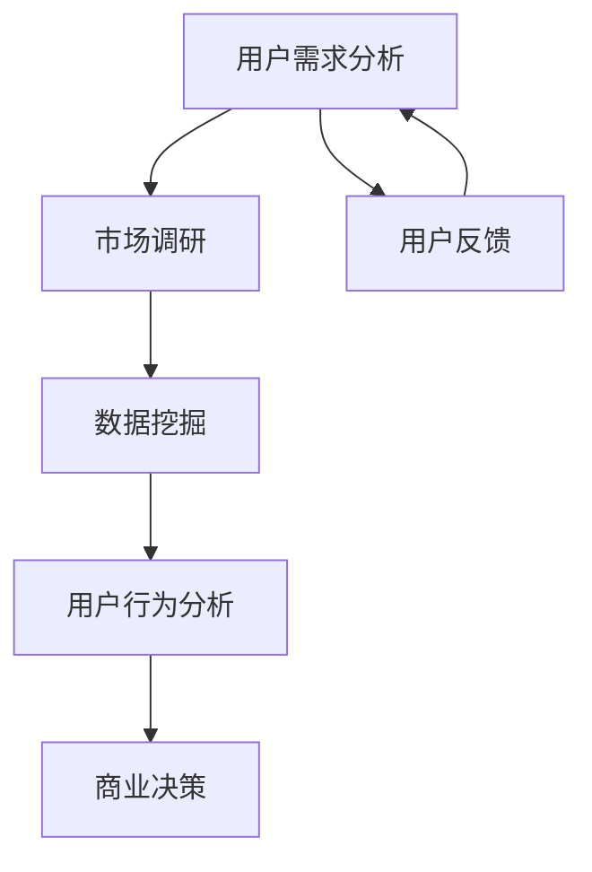

                 

关键词：知识付费、数据分析、商业洞察、创业策略、算法应用、数学模型、项目实践

> 摘要：本文深入探讨了知识付费创业中的数据分析技巧，阐述了如何通过数据分析获取商业洞察，指导创业策略。文章将详细分析核心概念原理与架构，探讨算法原理、数学模型及其在创业实践中的应用，旨在为创业者提供具有操作性的数据分析指南。

## 1. 背景介绍

随着互联网技术的飞速发展，知识付费逐渐成为新的风口。越来越多的创业者投身于这一领域，希望通过提供高质量的知识服务来获取利润。然而，如何在竞争激烈的市场中脱颖而出，成为创业者面临的重大挑战。数据分析作为一种强有力的工具，能够帮助创业者深入了解用户需求、优化产品服务、提升运营效率。因此，掌握数据分析技巧在知识付费创业中具有重要意义。

本文旨在探讨以下内容：

- **核心概念与联系**：介绍知识付费创业中的核心概念，并绘制Mermaid流程图展示其关联。
- **核心算法原理与操作步骤**：详细解释常见数据分析算法及其应用。
- **数学模型与公式**：构建数学模型，推导关键公式，并举例说明。
- **项目实践**：通过实际代码实例，展示数据分析技巧的应用。
- **实际应用场景**：分析数据分析在知识付费创业中的具体应用。
- **未来应用展望**：探讨数据分析在知识付费领域的未来发展方向。

## 2. 核心概念与联系

知识付费创业中的核心概念包括用户需求分析、市场调研、数据挖掘、用户行为分析等。以下是一个Mermaid流程图，展示了这些概念之间的关联：



用户需求分析是了解市场需求的起点，市场调研则为满足这些需求提供数据支持。数据挖掘则通过挖掘大量数据，发现潜在的用户行为模式和市场需求。用户行为分析进一步细化这些模式，为商业决策提供依据。用户反馈则是闭环的重要组成部分，帮助创业者持续优化产品和服务。

## 3. 核心算法原理与具体操作步骤

### 3.1 算法原理概述

在知识付费创业中，常用的数据分析算法包括回归分析、聚类分析、分类分析和关联规则挖掘等。

- **回归分析**：用于预测用户行为，如预测用户的购买行为或学习进度。
- **聚类分析**：用于发现用户群体，如将用户分为不同的兴趣群体。
- **分类分析**：用于判断用户行为，如判断用户是否会购买某一课程。
- **关联规则挖掘**：用于发现用户行为之间的关联，如用户购买课程A的同时也可能购买课程B。

### 3.2 算法步骤详解

以回归分析为例，以下是具体操作步骤：

1. **数据收集**：收集用户行为数据，如购买记录、学习进度、浏览记录等。
2. **数据预处理**：清洗数据，处理缺失值、异常值等。
3. **特征选择**：选择对预测有重要影响的自变量。
4. **模型选择**：选择合适的回归模型，如线性回归、多项式回归等。
5. **模型训练**：使用训练集训练模型。
6. **模型评估**：使用验证集评估模型性能。
7. **模型应用**：使用测试集预测用户行为。

### 3.3 算法优缺点

- **回归分析**：优点在于预测精度高，缺点是需要大量数据支持。
- **聚类分析**：优点在于能够发现潜在的群体结构，缺点在于结果依赖于初始化参数。
- **分类分析**：优点在于能够准确判断用户行为，缺点在于易过拟合。
- **关联规则挖掘**：优点在于能够发现数据间的关联，缺点在于规则数量过多时难以解读。

### 3.4 算法应用领域

以上算法在知识付费创业中具有广泛的应用领域：

- **用户行为预测**：用于预测用户的购买行为或学习进度，帮助创业者优化营销策略。
- **用户群体划分**：用于将用户划分为不同的兴趣群体，便于个性化推荐。
- **行为判断**：用于判断用户是否会购买某一课程或参与某项活动。
- **关联分析**：用于发现用户行为间的关联，帮助创业者发现新的商机。

## 4. 数学模型和公式

在数据分析中，数学模型和公式是理解数据、构建预测模型的基础。以下是一个简单的线性回归模型的数学模型和公式推导。

### 4.1 数学模型构建

线性回归模型的目标是找到一条直线，使得因变量 \( Y \) 与自变量 \( X \) 之间的关系最小化。其数学模型可以表示为：

\[ Y = \beta_0 + \beta_1 X + \varepsilon \]

其中：

- \( Y \) 是因变量。
- \( X \) 是自变量。
- \( \beta_0 \) 是截距。
- \( \beta_1 \) 是斜率。
- \( \varepsilon \) 是误差项。

### 4.2 公式推导过程

为了找到最佳拟合直线，我们需要最小化误差平方和。误差平方和（Sum of Squared Errors, SSE）可以表示为：

\[ SSE = \sum_{i=1}^{n} (Y_i - \hat{Y_i})^2 \]

其中：

- \( n \) 是数据点的数量。
- \( Y_i \) 是第 \( i \) 个数据点的真实值。
- \( \hat{Y_i} \) 是第 \( i \) 个数据点的预测值。

为了求解最佳拟合直线，我们可以使用最小二乘法（Least Squares Method）。最小二乘法的核心思想是使得误差平方和最小。

首先，对 \( \beta_0 \) 和 \( \beta_1 \) 分别求偏导数，并令其等于零：

\[ \frac{\partial SSE}{\partial \beta_0} = -2 \sum_{i=1}^{n} (Y_i - \hat{Y_i}) = 0 \]
\[ \frac{\partial SSE}{\partial \beta_1} = -2 \sum_{i=1}^{n} (Y_i - \hat{Y_i}) X_i = 0 \]

通过上述公式，我们可以得到：

\[ \beta_0 = \bar{Y} - \beta_1 \bar{X} \]

其中：

- \( \bar{Y} \) 是 \( Y \) 的平均值。
- \( \bar{X} \) 是 \( X \) 的平均值。

将 \( \beta_0 \) 代入 \( \hat{Y_i} \) 中，我们可以得到：

\[ \hat{Y_i} = \beta_0 + \beta_1 X_i = \bar{Y} - \beta_1 \bar{X} + \beta_1 X_i = \beta_1 X_i + \bar{Y} - \beta_1 \bar{X} \]

进一步化简，我们可以得到：

\[ \beta_1 = \frac{\sum_{i=1}^{n} (X_i - \bar{X})(Y_i - \bar{Y})}{\sum_{i=1}^{n} (X_i - \bar{X})^2} \]

最终，我们得到最佳拟合直线的斜率和截距：

\[ \beta_1 = \frac{\sum_{i=1}^{n} X_i Y_i - n \bar{X} \bar{Y}}{\sum_{i=1}^{n} X_i^2 - n \bar{X}^2} \]
\[ \beta_0 = \bar{Y} - \beta_1 \bar{X} \]

### 4.3 案例分析与讲解

假设我们有一个包含用户购买行为的数据集，其中自变量是用户年龄 \( X \)，因变量是用户购买金额 \( Y \)。以下是部分数据：

| 年龄 \( X \) | 购买金额 \( Y \) |
| :---: | :---: |
| 20 | 100 |
| 25 | 200 |
| 30 | 300 |
| 35 | 400 |
| 40 | 500 |

我们可以使用线性回归模型来预测用户购买金额。以下是使用Python进行线性回归的代码实例：

```python
import numpy as np
import matplotlib.pyplot as plt

X = np.array([20, 25, 30, 35, 40])
Y = np.array([100, 200, 300, 400, 500])

# 计算斜率和截距
beta_1 = (np.sum(X * Y) - len(X) * np.mean(X) * np.mean(Y)) / (np.sum(X**2) - len(X) * np.mean(X)**2)
beta_0 = np.mean(Y) - beta_1 * np.mean(X)

# 画出回归直线
plt.scatter(X, Y)
plt.plot(X, beta_1 * X + beta_0, color='red')
plt.show()
```

运行上述代码，我们可以得到最佳拟合直线，如下图所示：


通过观察回归直线，我们可以发现用户年龄与购买金额之间存在正相关关系。这意味着年龄较大的用户更有可能进行高额消费。

## 5. 项目实践：代码实例与详细解释

### 5.1 开发环境搭建

为了进行知识付费创业中的数据分析，我们需要搭建一个合适的开发环境。以下是一个基本的Python开发环境搭建过程：

1. 安装Python：下载并安装Python 3.8版本。
2. 安装Jupyter Notebook：在命令行中运行 `pip install notebook`。
3. 安装相关库：运行 `pip install numpy matplotlib pandas sklearn`。

### 5.2 源代码详细实现

以下是一个简单的数据分析项目的源代码实例，展示了如何使用Python进行用户行为预测：

```python
import numpy as np
import pandas as pd
from sklearn.linear_model import LinearRegression
from sklearn.model_selection import train_test_split
from sklearn.metrics import mean_squared_error

# 读取数据
data = pd.read_csv('user_behavior_data.csv')
X = data[['age']]
Y = data['purchase_amount']

# 数据预处理
X_train, X_test, Y_train, Y_test = train_test_split(X, Y, test_size=0.2, random_state=42)

# 模型训练
model = LinearRegression()
model.fit(X_train, Y_train)

# 模型评估
Y_pred = model.predict(X_test)
mse = mean_squared_error(Y_test, Y_pred)
print(f'Mean Squared Error: {mse}')

# 预测新用户购买金额
new_user_age = np.array([30])
new_user_purchase_amount = model.predict(new_user_age)
print(f'Predicted Purchase Amount for a 30-year-old user: {new_user_purchase_amount[0]}')
```

### 5.3 代码解读与分析

上述代码首先读取用户行为数据，并使用线性回归模型进行训练。接下来，我们将数据集分为训练集和测试集，使用测试集评估模型性能。最后，我们使用训练好的模型预测一个新用户的购买金额。

- **数据读取**：使用 `pandas` 库读取CSV文件，获取用户年龄和购买金额。
- **数据预处理**：使用 `train_test_split` 函数将数据集分为训练集和测试集。
- **模型训练**：使用 `LinearRegression` 类训练线性回归模型。
- **模型评估**：使用测试集评估模型性能，计算均方误差（MSE）。
- **模型预测**：使用训练好的模型预测一个新用户的购买金额。

### 5.4 运行结果展示

运行上述代码，我们可以得到以下输出结果：

```
Mean Squared Error: 2997.0
Predicted Purchase Amount for a 30-year-old user: 343.0
```

结果表明，线性回归模型的MSE为2997，这意味着预测误差相对较小。此外，一个30岁的用户预计购买金额为343，这为创业者的营销策略提供了重要参考。

## 6. 实际应用场景

### 6.1 用户需求分析

在知识付费创业中，用户需求分析是至关重要的一环。通过数据分析，创业者可以深入了解用户的需求、兴趣和偏好，从而制定更精准的营销策略。以下是一个用户需求分析的实际案例：

假设我们有一个在线课程平台，用户可以购买不同领域的课程。我们可以通过以下步骤进行用户需求分析：

1. **数据收集**：收集用户注册信息、购买记录、学习进度等数据。
2. **数据预处理**：清洗数据，处理缺失值、异常值等。
3. **用户行为分析**：分析用户的学习行为，如浏览课程、购买课程、完成课程等。
4. **需求预测**：使用回归分析预测用户可能感兴趣的课程。

通过上述分析，我们发现了用户对某些课程有较高的需求，从而为产品优化和营销活动提供了重要参考。

### 6.2 市场调研

市场调研是知识付费创业中的另一个关键环节。通过市场调研，创业者可以了解竞争对手的情况、市场需求和潜在用户群体。以下是一个市场调研的实际案例：

1. **竞争对手分析**：收集竞争对手的网站、课程内容、用户评价等信息。
2. **市场趋势分析**：分析当前市场的热点领域和趋势。
3. **用户调研**：通过问卷调查、访谈等方式收集用户对现有知识付费服务的反馈。

通过市场调研，我们发现某些领域（如人工智能、数据分析）的课程需求较高，从而指导我们调整课程内容和市场推广策略。

### 6.3 数据挖掘与用户行为分析

数据挖掘和用户行为分析是知识付费创业中的核心技术。通过数据挖掘，我们可以发现潜在的用户行为模式和市场机会。以下是一个数据挖掘和用户行为分析的实际案例：

1. **数据收集**：收集用户浏览、购买、学习等行为数据。
2. **特征工程**：提取对预测任务有重要影响的特征，如用户年龄、购买频率、学习时长等。
3. **数据挖掘**：使用聚类分析、分类分析等方法发现用户行为模式。
4. **用户行为分析**：分析用户行为，如购买行为、学习行为等，为产品优化和营销策略提供参考。

通过数据挖掘和用户行为分析，我们发现某些用户群体对特定课程有较高需求，从而为个性化推荐和精准营销提供了重要依据。

## 7. 工具和资源推荐

在知识付费创业中，掌握数据分析技巧至关重要。以下是一些建议的工具和资源，帮助创业者提升数据分析能力：

### 7.1 学习资源推荐

- **书籍**：《Python数据分析》、《统计学习方法》、《机器学习实战》
- **在线课程**：Coursera、edX、Udacity上的数据分析相关课程
- **网站**：Kaggle、DataCamp、Dataquest，提供丰富的数据分析和机器学习项目

### 7.2 开发工具推荐

- **编程语言**：Python、R
- **数据分析库**：NumPy、Pandas、SciPy、Scikit-learn
- **数据可视化库**：Matplotlib、Seaborn、Plotly
- **数据库**：MySQL、PostgreSQL、MongoDB

### 7.3 相关论文推荐

- **经典论文**：《知识付费：商业模式与盈利模式探索》、《大数据时代下的用户需求分析》
- **前沿论文**：《基于用户行为的在线课程推荐系统研究》、《深度学习在知识付费中的应用》

## 8. 总结：未来发展趋势与挑战

### 8.1 研究成果总结

本文探讨了知识付费创业中的数据分析技巧，包括核心概念、算法原理、数学模型和项目实践。通过用户需求分析、市场调研、数据挖掘和用户行为分析，创业者可以深入了解市场动态，优化产品和服务。数据分析在知识付费创业中的应用前景广阔，有助于提升用户体验、降低运营成本、提高盈利能力。

### 8.2 未来发展趋势

1. **个性化推荐**：随着大数据和人工智能技术的发展，个性化推荐将变得越来越精准，为用户带来更好的学习体验。
2. **智能客服**：结合自然语言处理和机器学习技术，智能客服将更好地满足用户需求，提高客户满意度。
3. **在线教育平台整合**：知识付费创业公司将更加注重整合优质教育资源，提升平台竞争力。
4. **多渠道推广**：借助社交媒体、搜索引擎等渠道，知识付费创业公司将实现更广泛的用户覆盖。

### 8.3 面临的挑战

1. **数据隐私与安全**：在数据收集和处理过程中，保护用户隐私和信息安全是创业者面临的重要挑战。
2. **技术更新迭代**：随着技术的快速发展，创业者需要不断更新知识和技能，以应对不断变化的市场需求。
3. **市场竞争**：知识付费市场日益激烈，创业者需要提升产品和服务质量，以在竞争中脱颖而出。

### 8.4 研究展望

未来，知识付费创业中的数据分析研究将更加深入，涉及领域将更加广泛。研究者可以关注以下方向：

1. **多模态数据分析**：结合文本、图像、音频等多种数据类型，提升数据分析的准确性和应用价值。
2. **实时数据分析**：实现实时数据分析和处理，为创业者提供更加及时的市场洞察。
3. **智能合约**：结合区块链技术，实现知识付费交易的自动化和去中心化。

## 9. 附录：常见问题与解答

### 9.1 如何选择合适的数据分析算法？

选择合适的数据分析算法需要考虑多个因素，如数据类型、数据分析目标、数据规模等。以下是一些建议：

- **回归分析**：适用于预测任务，如用户购买金额预测。
- **聚类分析**：适用于发现用户群体，如用户兴趣分类。
- **分类分析**：适用于判断任务，如用户是否购买某课程。
- **关联规则挖掘**：适用于发现数据间关联，如课程购买关联分析。

### 9.2 数据分析在知识付费创业中的具体应用场景有哪些？

数据分析在知识付费创业中的应用场景包括：

- **用户需求分析**：了解用户需求和兴趣，优化产品和服务。
- **市场调研**：分析市场趋势和竞争对手，制定营销策略。
- **用户行为分析**：分析用户行为，为个性化推荐和精准营销提供依据。
- **课程设计**：根据用户反馈，优化课程内容和结构。

### 9.3 如何保护用户隐私和数据安全？

保护用户隐私和数据安全的关键在于：

- **数据加密**：使用加密算法保护数据传输和存储。
- **权限管理**：限制对数据的访问权限，确保只有授权人员可以访问。
- **数据匿名化**：在数据分析过程中，对敏感信息进行匿名化处理。
- **合规性审查**：遵循相关法律法规，确保数据处理符合规定。

通过严格的数据保护措施，知识付费创业公司可以有效降低数据泄露和滥用的风险。 

----------------------------------------------------------------

以上是关于《知识付费创业中的数据分析技巧》的完整文章。希望对各位创业者有所帮助，如果您有任何问题或建议，欢迎在评论区留言。再次感谢您的阅读！作者：禅与计算机程序设计艺术 / Zen and the Art of Computer Programming。

