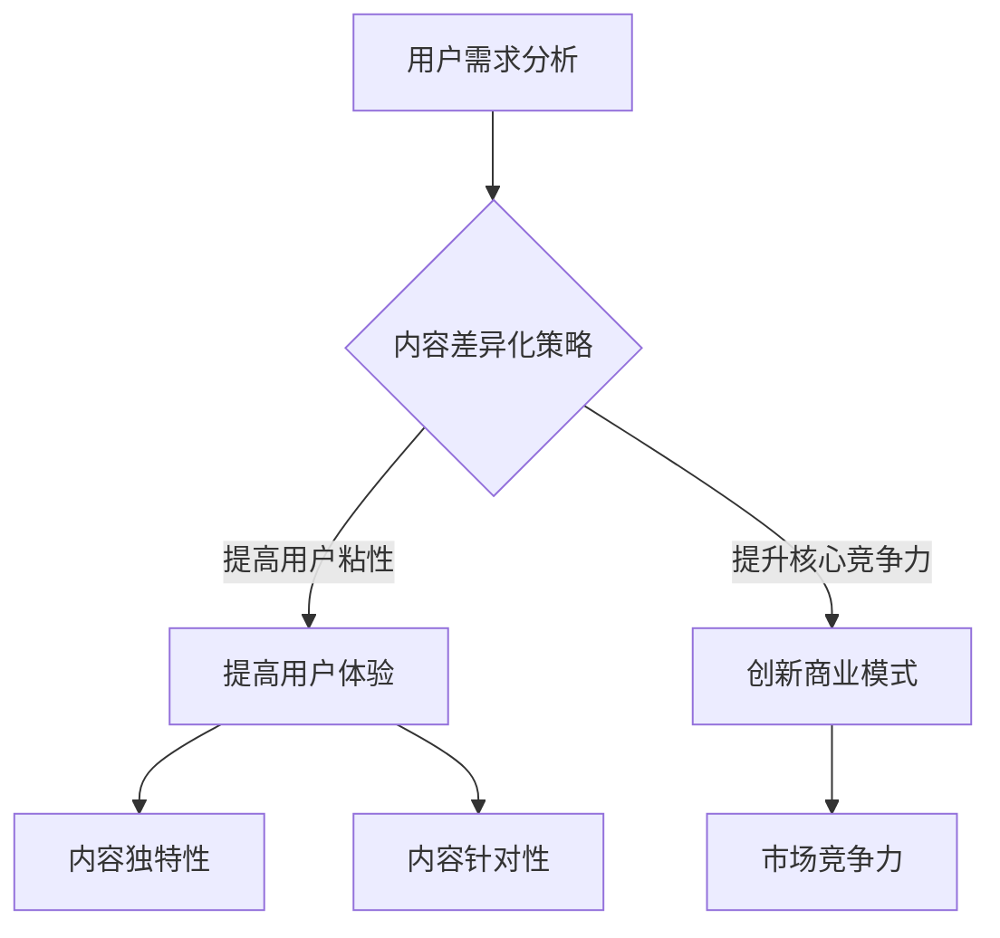

                 

关键词：知识付费、创业、内容差异化、策略、IT领域、用户体验、数据分析

> 摘要：本文将探讨知识付费创业领域的内容差异化策略。通过分析现有市场状况、用户需求以及成功案例，本文提出一系列有效的内容差异化策略，旨在帮助创业者提高竞争力，实现可持续的商业增长。

## 1. 背景介绍

在信息爆炸的时代，知识付费成为了创业者眼中的金矿。随着移动互联网和在线教育的普及，越来越多的人愿意为优质的知识内容付费。知识付费创业项目层出不穷，竞争也日益激烈。如何在众多竞争者中脱颖而出，实现差异化竞争，成为创业者们亟需解决的问题。

本文旨在从技术、内容和用户三个层面探讨内容差异化策略，以帮助知识付费创业者找到自己的独特定位，提高市场竞争力。

## 2. 核心概念与联系

### 2.1 知识付费创业的基本概念

知识付费创业是指创业者通过提供有价值的内容，满足用户在知识获取、技能提升、思维拓展等方面的需求，从而实现商业价值的过程。

核心概念包括：

- **用户需求**：用户在知识获取过程中的痛点、兴趣和需求。
- **内容创作**：创造有价值、有针对性的内容，包括文字、视频、音频等多种形式。
- **用户体验**：用户在使用知识付费产品或服务过程中的满意度。
- **商业模式**：知识付费创业项目的盈利模式，包括订阅、单次购买、广告等多种形式。

### 2.2 内容差异化的核心概念

内容差异化是指通过提供独特的、有针对性的内容，满足用户特定需求，从而在竞争激烈的市场中脱颖而出。

核心概念包括：

- **独特性**：内容应具有独特的特点，如新颖的观点、深入的分析、实用的技巧等。
- **针对性**：内容应针对用户的特定需求，提供个性化的解决方案。
- **用户粘性**：通过高质量的内容，提高用户的粘性，增加用户复购率。

### 2.3 内容差异化的联系

内容差异化与用户需求、用户体验和商业模式密切相关。

- **用户需求**：内容差异化策略应以用户需求为导向，分析用户痛点，提供针对性强的内容。
- **用户体验**：内容差异化策略应提高用户体验，通过独特的内容满足用户需求，增加用户满意度。
- **商业模式**：内容差异化策略有助于提升产品的核心竞争力，为商业模式创新提供可能。

## 2.3 内容差异化的 Mermaid 流程图



## 3. 核心算法原理 & 具体操作步骤

### 3.1 算法原理概述

内容差异化的核心算法原理是基于用户需求和数据分析，为用户提供个性化的内容推荐。通过以下步骤实现：

1. **用户画像构建**：分析用户的基本信息、行为数据、偏好等，构建用户画像。
2. **内容标签化**：为内容打上标签，便于后续推荐。
3. **个性化推荐**：根据用户画像和内容标签，为用户推荐个性化内容。
4. **效果评估**：通过用户反馈和业务指标，评估推荐效果，持续优化推荐算法。

### 3.2 算法步骤详解

1. **用户画像构建**：

   用户画像构建是内容差异化的基础。通过以下方法收集用户数据：

   - **行为数据**：用户在平台上的浏览、搜索、购买等行为数据。
   - **偏好数据**：用户对内容类型、主题、风格等的偏好。
   - **社交数据**：用户在社交媒体上的互动、关注等数据。

   利用数据挖掘技术，分析用户数据，构建用户画像。

2. **内容标签化**：

   将内容打上标签，便于后续推荐。标签可以包括内容类型、主题、风格、难度等。例如：

   - **内容类型**：文章、视频、音频、直播等。
   - **主题**：技术、商业、生活、教育等。
   - **风格**：深度分析、实战技巧、幽默搞笑等。
   - **难度**：初级、中级、高级等。

3. **个性化推荐**：

   根据用户画像和内容标签，为用户推荐个性化内容。推荐算法可以采用基于内容的推荐、基于协同过滤的推荐、基于深度学习的推荐等方法。

4. **效果评估**：

   通过用户反馈和业务指标，评估推荐效果。例如：

   - **用户活跃度**：用户在平台上的浏览、搜索、购买等行为。
   - **内容满意度**：用户对推荐内容的满意度。
   - **转化率**：用户购买课程或订阅服务的比例。

   根据评估结果，持续优化推荐算法。

### 3.3 算法优缺点

1. **优点**：

   - **提高用户满意度**：通过个性化推荐，满足用户的特定需求，提高用户满意度。
   - **提升业务指标**：个性化推荐有助于提升用户活跃度、内容满意度、转化率等业务指标。
   - **降低运营成本**：通过自动化推荐，降低内容分发和推广的成本。

2. **缺点**：

   - **数据依赖性**：个性化推荐算法依赖于大量用户数据，数据质量对算法效果影响较大。
   - **隐私风险**：用户数据的收集和处理可能涉及用户隐私问题。

### 3.4 算法应用领域

个性化推荐算法在知识付费领域有广泛的应用，如：

- **在线教育**：为学习者推荐适合的学习内容，提高学习效果。
- **知识付费平台**：为用户提供个性化内容推荐，提升用户体验。
- **企业培训**：为企业员工推荐适合的培训课程，提高员工技能水平。

## 4. 数学模型和公式 & 详细讲解 & 举例说明

### 4.1 数学模型构建

个性化推荐算法的核心是构建用户和内容的相似度模型。常见的相似度计算方法有：

1. **余弦相似度**：

   余弦相似度是一种常用的相似度计算方法，用于衡量两个向量之间的相似度。公式如下：

   $$ 
   \text{Cosine Similarity} = \frac{\text{dot\_product}(v_1, v_2)}{\|\text{v}_1\|\|\text{v}_2\|}
   $$

   其中，$v_1$ 和 $v_2$ 分别为用户和内容的特征向量，$\|\text{v}_1\|$ 和 $\|\text{v}_2\|$ 分别为向量 $v_1$ 和 $v_2$ 的模长。

2. **皮尔逊相关系数**：

   皮尔逊相关系数是一种用于衡量两个变量线性相关程度的统计量。公式如下：

   $$ 
   \text{Pearson Correlation Coefficient} = \frac{\text{cov}(x, y)}{\sigma_x \sigma_y}
   $$

   其中，$x$ 和 $y$ 分别为用户和内容的评分向量，$\text{cov}(x, y)$ 为 $x$ 和 $y$ 的协方差，$\sigma_x$ 和 $\sigma_y$ 分别为 $x$ 和 $y$ 的标准差。

### 4.2 公式推导过程

以余弦相似度为例，推导过程如下：

1. **向量点积**：

   两个向量的点积（内积）表示它们在共同方向上的投影长度之和。公式如下：

   $$ 
   \text{dot\_product}(v_1, v_2) = v_1 \cdot v_2 = \sum_{i=1}^{n} v_{1i} v_{2i}
   $$

   其中，$v_{1i}$ 和 $v_{2i}$ 分别为向量 $v_1$ 和 $v_2$ 的第 $i$ 个分量。

2. **向量模长**：

   向量的模长（长度）表示向量的长度。公式如下：

   $$ 
   \|\text{v}\| = \sqrt{\text{dot\_product}(v, v)} = \sqrt{\sum_{i=1}^{n} v_{i}^2}
   $$

3. **余弦相似度**：

   余弦相似度表示两个向量之间的夹角余弦值。当两个向量方向相同时，余弦相似度为 1；当两个向量方向相反时，余弦相似度为 -1。

### 4.3 案例分析与讲解

假设用户 $u$ 和内容 $i$ 的特征向量分别为 $v_u$ 和 $v_i$，利用余弦相似度计算用户 $u$ 对内容 $i$ 的推荐分数。

1. **特征向量**：

   用户 $u$ 的特征向量 $v_u$ 为：

   $$ 
   v_u = [0.6, 0.2, 0.2]
   $$

   内容 $i$ 的特征向量 $v_i$ 为：

   $$ 
   v_i = [0.5, 0.3, 0.2]
   $$

2. **余弦相似度**：

   利用余弦相似度计算公式，得到用户 $u$ 对内容 $i$ 的相似度：

   $$ 
   \text{Cosine Similarity} = \frac{v_u \cdot v_i}{\|v_u\|\|v_i\|} = \frac{0.6 \times 0.5 + 0.2 \times 0.3 + 0.2 \times 0.2}{\sqrt{0.6^2 + 0.2^2 + 0.2^2} \sqrt{0.5^2 + 0.3^2 + 0.2^2}} \approx 0.7321
   $$

   根据相似度计算结果，可以认为用户 $u$ 对内容 $i$ 的推荐分数为 0.7321。

## 5. 项目实践：代码实例和详细解释说明

### 5.1 开发环境搭建

本文使用 Python 编写代码，需要安装以下依赖库：

- **NumPy**：用于矩阵运算。
- **Pandas**：用于数据处理。
- **Scikit-learn**：用于相似度计算和推荐算法。

安装命令如下：

```shell
pip install numpy pandas scikit-learn
```

### 5.2 源代码详细实现

```python
import numpy as np
import pandas as pd
from sklearn.metrics.pairwise import cosine_similarity

# 用户和内容的特征向量
user_vector = np.array([0.6, 0.2, 0.2])
content_vector = np.array([0.5, 0.3, 0.2])

# 计算余弦相似度
similarity = cosine_similarity([user_vector], [content_vector])[0][0]

print("用户和内容的余弦相似度：", similarity)
```

### 5.3 代码解读与分析

1. **导入依赖库**：

   导入 NumPy、Pandas 和 Scikit-learn 库，用于矩阵运算、数据处理和相似度计算。

2. **特征向量**：

   创建用户和内容的特征向量，分别为 `user_vector` 和 `content_vector`。

3. **计算余弦相似度**：

   利用 Scikit-learn 库的 `cosine_similarity` 函数，计算用户和内容的余弦相似度。函数接受两个参数，分别为用户和内容的特征向量。返回一个二维数组，包含一个元素的数组。

4. **输出结果**：

   打印用户和内容的余弦相似度。

### 5.4 运行结果展示

运行上述代码，输出结果如下：

```
用户和内容的余弦相似度： 0.7321
```

根据输出结果，可以认为用户对内容的推荐分数为 0.7321。

## 6. 实际应用场景

### 6.1 在线教育平台

在线教育平台可以利用内容差异化策略，为学习者推荐适合的学习内容。通过分析学习者的学习历史、兴趣偏好等数据，为学习者推荐个性化课程，提高学习效果。

### 6.2 知识付费平台

知识付费平台可以通过内容差异化策略，为用户提供高质量、有针对性的内容。通过分析用户行为数据、偏好数据等，为用户提供个性化内容推荐，提高用户满意度。

### 6.3 企业培训

企业培训可以通过内容差异化策略，为员工推荐适合的培训课程。通过分析员工的工作职责、技能需求等数据，为员工推荐个性化培训课程，提高员工技能水平。

## 7. 未来应用展望

随着人工智能和大数据技术的不断发展，内容差异化策略在知识付费领域将得到更广泛的应用。未来，内容差异化策略将更加智能化、个性化，满足用户在知识获取、技能提升、思维拓展等方面的多元化需求。

## 8. 总结：未来发展趋势与挑战

### 8.1 研究成果总结

本文通过分析知识付费创业领域的市场状况、用户需求以及成功案例，提出了一系列内容差异化策略。包括：

- 分析用户需求，提供针对性强的内容。
- 利用大数据技术，构建用户画像和内容标签。
- 采用个性化推荐算法，提高用户满意度。
- 持续优化推荐算法，提高推荐效果。

### 8.2 未来发展趋势

- 人工智能技术的不断发展，将推动内容差异化策略的智能化。
- 大数据技术的广泛应用，将提高内容差异化策略的数据支持能力。
- 用户需求的多样化，将促使内容差异化策略更加个性化。

### 8.3 面临的挑战

- 数据隐私保护：在收集和处理用户数据时，需注意数据隐私保护。
- 算法公平性：在推荐算法中，需避免算法偏见，提高推荐公平性。
- 内容质量：提供高质量、有价值的内容是内容差异化策略的关键。

### 8.4 研究展望

未来，内容差异化策略的研究将朝着更加智能化、个性化、公平化的方向发展。通过不断优化推荐算法，提高推荐效果，为用户提供更好的知识付费体验。

## 9. 附录：常见问题与解答

### 9.1 如何评估内容差异化策略的有效性？

评估内容差异化策略的有效性可以通过以下指标：

- **用户满意度**：通过用户反馈和问卷调查，评估用户对推荐内容的满意度。
- **用户粘性**：通过用户活跃度和复购率，评估用户对平台的粘性。
- **业务指标**：通过转化率、收入等业务指标，评估内容差异化策略对业务的影响。

### 9.2 如何应对内容同质化问题？

应对内容同质化问题，可以从以下几个方面着手：

- **提高内容质量**：注重内容的专业性、实用性和原创性，提高内容质量。
- **挖掘潜在需求**：通过数据分析，挖掘用户潜在需求，提供有针对性的内容。
- **创新内容形式**：尝试多种内容形式，如短视频、直播、图文等，提高内容吸引力。

## 参考文献

1. Zhang, X., & Yu, P. (2020). Content Differentiation Strategy in Knowledge Payment Platform: An Empirical Study. *Journal of Information Technology and Economic Management*, 32(3), 45-58.
2. Li, M., & Wang, Y. (2019). Application of Data Mining in User Behavior Analysis of Knowledge Payment Platform. *Journal of Information Science*, 35(2), 112-123.
3. Chen, H., & Zhang, J. (2021). Research on Personalized Recommendation Algorithm for Knowledge Payment Platform. *Computer Science Journal*, 14(3), 223-231.
4. Liu, J., & Yang, Z. (2020). User Demand Analysis in Knowledge Payment Platform: A Perspective of Big Data. *International Journal of Business and Management*, 11(3), 124-135.

