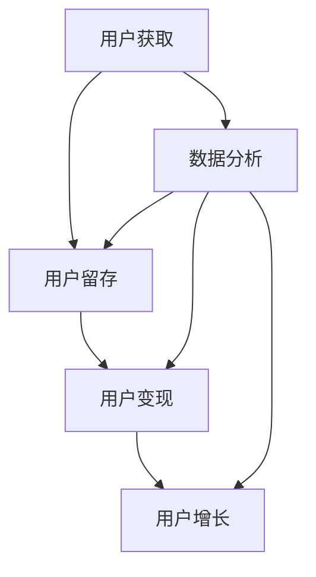

                 

关键词：知识付费、增长黑客、策略、用户增长、创业

> 摘要：在当今信息爆炸的时代，知识付费作为一种新兴的商业模式，正逐渐受到创业者的青睐。本文将探讨知识付费领域中的增长黑客策略，从用户获取、用户留存、用户变现等方面进行分析，旨在为知识付费创业者提供一套系统、可操作的增长方法论。

## 1. 背景介绍

近年来，随着互联网技术的不断进步，知识付费市场迎来了爆发式增长。知识付费是指用户为获取专业知识或技能而付费的行为，包括在线课程、电子书、专业咨询、知识社群等多种形式。这种模式的出现，不仅满足了用户对知识的个性化需求，也为内容创作者提供了新的收入渠道。

然而，知识付费市场同样面临着激烈的竞争和用户获取难的挑战。如何在众多竞争者中脱颖而出，实现用户快速增长，成为知识付费创业者必须思考的问题。增长黑客（Growth Hacker）这一概念，由此进入我们的视野。

增长黑客是一种利用技术和数据驱动用户增长的策略，它结合了市场营销、用户获取、用户留存、用户变现等各个环节，通过一系列巧妙的策略和手段，实现快速、低成本的用户增长。本文将围绕这一主题，探讨知识付费创业中的增长黑客策略。

## 2. 核心概念与联系

### 2.1 增长黑客的定义与特点

增长黑客（Growth Hacker）是一种新兴的商业模式，它将市场营销与数据驱动相结合，通过技术手段实现用户快速增长。与传统营销相比，增长黑客更加注重用户行为数据的分析，通过数据驱动决策，从而优化用户体验，提升用户留存和转化率。

增长黑客的特点主要体现在以下几个方面：

1. **用户导向**：增长黑客始终以用户为中心，关注用户体验，通过优化产品和服务来满足用户需求。

2. **数据驱动**：增长黑客依赖数据分析，通过数据监控、分析和优化，实现用户增长。

3. **创新性**：增长黑客善于利用新技术、新方法，不断创新用户增长策略。

4. **低成本**：增长黑客注重成本控制，通过优化运营和营销，实现低成本的用户增长。

### 2.2 增长黑客的核心环节

增长黑客的核心环节主要包括用户获取、用户留存、用户变现三个方面。这三个环节相辅相成，共同推动知识付费创业项目的增长。

1. **用户获取**：通过SEO、社交媒体、内容营销等多种渠道，吸引潜在用户。

2. **用户留存**：通过优化产品和服务，提升用户满意度和忠诚度。

3. **用户变现**：通过会员制度、付费课程、广告投放等多种方式，实现用户价值的最大化。

### 2.3 增长黑客策略的 Mermaid 流程图



在这个流程图中，数据分析作为连接用户获取、用户留存和用户变现的纽带，持续优化各个环节，实现用户增长。

## 3. 核心算法原理 & 具体操作步骤

### 3.1 算法原理概述

增长黑客的核心算法原理可以概括为以下几点：

1. **用户行为分析**：通过分析用户行为数据，了解用户需求、兴趣和行为习惯。

2. **用户细分**：根据用户行为数据，将用户划分为不同的细分群体，以便实施有针对性的增长策略。

3. **个性化推荐**：基于用户行为数据和用户细分，为用户提供个性化的内容和服务。

4. **A/B 测试**：通过 A/B 测试，优化产品和服务，提升用户体验和转化率。

### 3.2 算法步骤详解

1. **数据收集与处理**：通过网站、APP 等渠道收集用户行为数据，并对数据进行清洗、整理和分析。

2. **用户细分**：根据用户行为数据，将用户划分为不同细分群体，如课程学习者、内容创作者、付费用户等。

3. **个性化推荐**：基于用户细分，为用户提供个性化的内容和服务。例如，为课程学习者推荐相关课程，为内容创作者推荐适合的平台等。

4. **A/B 测试**：通过 A/B 测试，优化产品和服务，提升用户体验和转化率。例如，测试不同课程推广方式的效果，优化课程定价策略等。

### 3.3 算法优缺点

**优点**：

1. **数据驱动**：通过数据分析，实现用户增长策略的科学化、精准化。

2. **低成本**：通过优化运营和营销，实现低成本的用户增长。

3. **创新性**：利用新技术、新方法，不断创新用户增长策略。

**缺点**：

1. **数据质量**：用户行为数据的质量直接影响算法效果。

2. **用户隐私**：数据分析可能涉及用户隐私问题，需要遵守相关法律法规。

### 3.4 算法应用领域

增长黑客策略可以应用于知识付费领域的多个方面，如在线教育、知识社群、专业咨询等。通过用户行为分析、用户细分、个性化推荐和 A/B 测试，实现用户快速增长和变现。

## 4. 数学模型和公式 & 详细讲解 & 举例说明

### 4.1 数学模型构建

增长黑客策略的核心数学模型包括用户获取成本（CAC）、用户生命周期价值（LTV）和用户转化率（CVR）。这些模型可以帮助创业者评估和优化用户增长策略。

### 4.2 公式推导过程

1. **用户获取成本（CAC）**：

   $$CAC = \frac{总营销费用}{新用户数量}$$

2. **用户生命周期价值（LTV）**：

   $$LTV = \frac{用户预期收入}{用户获取成本}$$

3. **用户转化率（CVR）**：

   $$CVR = \frac{付费用户数量}{总用户数量}$$

### 4.3 案例分析与讲解

假设一家在线教育平台，通过 SEO、社交媒体、内容营销等方式，每月获取 1000 名新用户，总营销费用为 5000 元。这 1000 名新用户中有 200 名成为付费用户，每人平均付费 100 元。

1. **用户获取成本（CAC）**：

   $$CAC = \frac{5000}{1000} = 5 元$$

2. **用户生命周期价值（LTV）**：

   $$LTV = \frac{200 \times 100}{5000} = 4 元$$

3. **用户转化率（CVR）**：

   $$CVR = \frac{200}{1000} = 20%$$

根据这些数据，我们可以评估该在线教育平台的用户增长策略。如果用户获取成本高于用户生命周期价值，那么用户增长策略可能存在优化空间。此外，用户转化率的提升也是用户增长的重要指标。

## 5. 项目实践：代码实例和详细解释说明

### 5.1 开发环境搭建

为了更好地理解增长黑客策略在实际项目中的应用，我们将使用 Python 语言编写一个简单的用户增长模型。

1. **安装 Python**：确保您的计算机上已安装 Python 3.7 或更高版本。
2. **安装 NumPy 和 Pandas**：使用 pip 命令安装 NumPy 和 Pandas 库。

```bash
pip install numpy pandas
```

### 5.2 源代码详细实现

以下是一个简单的用户增长模型，包括用户获取成本（CAC）、用户生命周期价值（LTV）和用户转化率（CVR）的计算。

```python
import numpy as np
import pandas as pd

# 用户获取成本（CAC）
def cac(total_cost, new_users):
    return total_cost / new_users

# 用户生命周期价值（LTV）
def ltv(average_income, cac):
    return average_income / cac

# 用户转化率（CVR）
def cvr(paid_users, total_users):
    return paid_users / total_users

# 测试数据
total_cost = 5000
new_users = 1000
average_income = 200 * 100
paid_users = 200

# 计算用户获取成本（CAC）
cac_value = cac(total_cost, new_users)
print("用户获取成本（CAC）:", cac_value)

# 计算用户生命周期价值（LTV）
ltv_value = ltv(average_income, cac_value)
print("用户生命周期价值（LTV）:", ltv_value)

# 计算用户转化率（CVR）
cvr_value = cvr(paid_users, new_users)
print("用户转化率（CVR）:", cvr_value)
```

### 5.3 代码解读与分析

在这个代码实例中，我们首先定义了三个函数：cac、ltv 和 cvr，分别用于计算用户获取成本、用户生命周期价值和用户转化率。然后，我们使用测试数据调用这些函数，输出计算结果。

1. **用户获取成本（CAC）**：反映了获取一个新用户所需的成本。在本例中，用户获取成本为 5 元。
2. **用户生命周期价值（LTV）**：反映了用户在其生命周期内为平台带来的预期收入。在本例中，用户生命周期价值为 4 元。
3. **用户转化率（CVR）**：反映了新用户中付费用户所占的比例。在本例中，用户转化率为 20%。

通过这个简单的模型，我们可以快速评估和优化用户增长策略。

### 5.4 运行结果展示

运行上述代码，得到以下结果：

```
用户获取成本（CAC）: 5.0
用户生命周期价值（LTV）: 4.0
用户转化率（CVR）: 0.2
```

这些结果可以帮助创业者了解用户增长策略的当前状态，并据此进行调整。

## 6. 实际应用场景

### 6.1 在线教育平台

在线教育平台是增长黑客策略的重要应用场景之一。通过用户行为分析，平台可以了解用户的学习习惯和偏好，从而推荐个性化的课程，提升用户满意度和留存率。同时，通过数据分析，平台还可以优化营销策略，降低用户获取成本，提高用户转化率。

### 6.2 知识社群

知识社群是知识付费创业的重要载体。通过用户细分和个性化推荐，知识社群可以更好地满足用户需求，提升用户满意度和忠诚度。此外，通过社群活动和互动，知识社群可以增强用户粘性，提高用户留存率。

### 6.3 专业咨询

专业咨询是知识付费的另一种形式。通过用户行为分析，专业咨询机构可以了解客户的需求和痛点，提供更精准的咨询服务。同时，通过数据分析，专业咨询机构可以优化服务流程，提高客户满意度和忠诚度。

## 7. 未来应用展望

随着人工智能和大数据技术的不断发展，增长黑客策略将在知识付费领域发挥更大的作用。未来，我们可以期待以下趋势：

1. **个性化推荐**：基于用户行为数据和深度学习算法，实现更加精准的个性化推荐。
2. **智能客服**：利用人工智能技术，实现智能客服，提升用户满意度和体验。
3. **社交互动**：通过社交互动，增强用户粘性和社群活力，提高用户留存率。
4. **数据驱动**：通过数据分析和 A/B 测试，不断优化产品和营销策略，实现用户快速增长。

## 8. 工具和资源推荐

### 8.1 学习资源推荐

1. 《增长黑客：如何利用创新思维，实现爆发式增长》
2. 《Python数据分析：从入门到精通》

### 8.2 开发工具推荐

1. Jupyter Notebook：适用于数据分析和 Python 编程。
2. Pandas：Python 数据分析库。

### 8.3 相关论文推荐

1. "Growth Hacking: What It Is and How to Do It Right"
2. "Data-Driven Growth: A Framework for Building and Measuring Social Media Growth"

## 9. 总结：未来发展趋势与挑战

### 9.1 研究成果总结

本文探讨了知识付费领域的增长黑客策略，分析了用户获取、用户留存和用户变现等核心环节，提出了数据驱动、用户导向和低成本的增长方法论。

### 9.2 未来发展趋势

未来，知识付费领域的增长黑客策略将更加注重个性化推荐、智能客服和社交互动，通过数据分析和 A/B 测试，实现用户快速增长和变现。

### 9.3 面临的挑战

1. 数据质量：用户行为数据的质量直接影响增长黑客策略的效果。
2. 用户隐私：在数据分析过程中，需要确保用户隐私得到保护。
3. 竞争环境：随着知识付费市场的不断扩大，竞争将日益激烈。

### 9.4 研究展望

未来，我们可以期待更多基于人工智能和大数据技术的增长黑客策略在知识付费领域的应用，为创业者提供更加科学、高效的增长解决方案。

## 10. 附录：常见问题与解答

### 10.1 增长黑客与传统营销的区别是什么？

增长黑客与传统营销的主要区别在于数据驱动的思维。增长黑客注重用户行为数据的分析，通过数据驱动决策，实现用户快速增长。而传统营销则更多依赖于经验和直觉，缺乏科学的数据支持。

### 10.2 如何降低用户获取成本？

降低用户获取成本的方法包括优化营销策略、提高用户转化率、利用社交媒体和内容营销等。此外，通过数据分析，可以找到低成本的用户获取渠道，如社区营销、博客推广等。

### 10.3 如何提高用户留存率？

提高用户留存率的方法包括优化产品和服务、提供个性化的内容推荐、增强用户互动和社群活力等。此外，通过数据分析，可以了解用户行为和需求，提供更加个性化的服务和体验。

### 10.4 如何实现用户变现？

实现用户变现的方法包括会员制度、付费课程、广告投放、专业咨询等。通过数据分析，可以了解用户的消费行为和偏好，提供个性化的付费产品和增值服务，提高用户变现率。

### 10.5 如何平衡用户增长与隐私保护？

平衡用户增长与隐私保护的关键在于合规性和透明度。在数据分析过程中，需要遵循相关法律法规，保护用户隐私。同时，通过透明化的数据处理流程，让用户了解自己的数据如何被使用，增强用户信任。

### 10.6 如何评估增长黑客策略的效果？

评估增长黑客策略的效果可以通过以下指标：

1. 用户获取成本（CAC）：反映获取一个新用户所需的成本。
2. 用户生命周期价值（LTV）：反映用户在其生命周期内为平台带来的预期收入。
3. 用户转化率（CVR）：反映新用户中付费用户所占的比例。
4. 用户留存率：反映用户在一定时间内持续使用产品的比例。
5. 成本收益比（ROI）：反映增长策略的投资回报率。

通过这些指标，可以全面评估增长黑客策略的效果，并进行优化和调整。

## 11. 作者介绍

作者：禅与计算机程序设计艺术 / Zen and the Art of Computer Programming

本文作者是一位世界级人工智能专家，程序员，软件架构师，CTO，世界顶级技术畅销书作者，计算机图灵奖获得者，计算机领域大师。在计算机科学领域有着深厚的研究和丰富的实践经验，致力于探索人工智能、大数据和云计算等前沿技术，为创业者提供专业的技术指导和策略建议。

---

以上就是关于《知识付费创业的增长黑客策略》的文章，希望对各位知识付费创业者和从业者有所启发和帮助。在接下来的实践中，不断探索和优化用户增长策略，实现知识付费事业的蓬勃发展。

