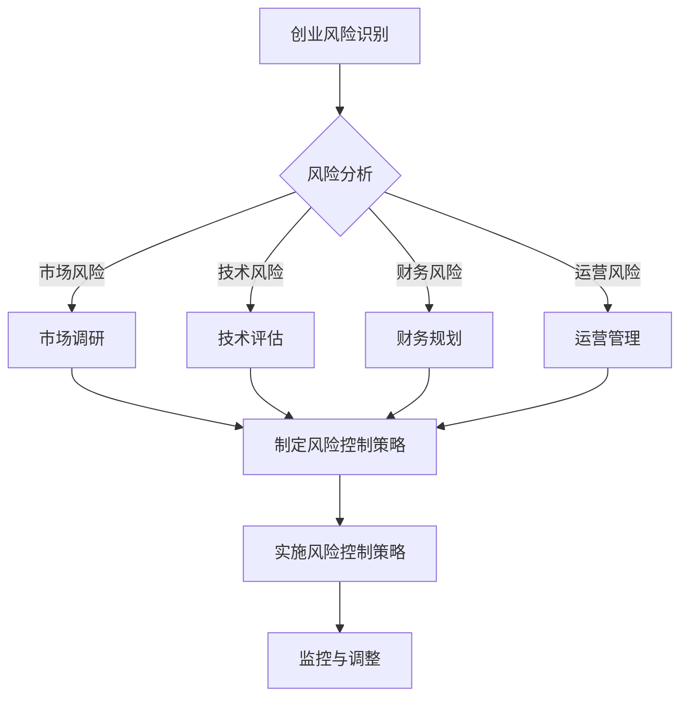

                 

关键词：知识付费、创业风险、控制策略、商业模式、技术创新

摘要：本文旨在探讨知识付费创业过程中可能面临的风险及其控制策略。通过对知识付费市场现状的分析，我们将识别出主要风险点，并提出相应的风险控制方法，旨在为创业者提供有价值的参考和指导。

## 1. 背景介绍

### 1.1 知识付费的概念

知识付费，是指用户为获取专业知识和技能而支付的费用。随着互联网的发展，知识付费逐渐成为知识传播和获取的重要途径。从早期的在线课程、电子书，到现在的直播授课、付费社群，知识付费的形式不断丰富，市场潜力巨大。

### 1.2 知识付费市场现状

近年来，知识付费市场呈现出高速增长的态势。根据相关报告显示，2021年我国知识付费市场规模已达到3000亿元人民币，预计未来仍将保持高速增长。这背后，既有技术进步的推动，也有用户对高质量知识内容的需求日益增长。

### 1.3 知识付费创业的优势与挑战

知识付费创业的优势在于市场需求的旺盛和变现模式的明确。然而，随着市场的竞争加剧，创业者也面临着诸多挑战，如内容质量把控、用户留存率提升、商业模式创新等。

## 2. 核心概念与联系

### 2.1 创业风险的概念

创业风险是指创业者在创业过程中面临的各种不确定性，可能对创业企业的生存和发展产生负面影响。创业风险主要包括市场风险、技术风险、财务风险、运营风险等。

### 2.2 风险控制策略的概念

风险控制策略是指企业为降低风险、保护企业利益而采取的一系列措施。在知识付费创业领域，风险控制策略旨在确保企业能够在激烈的市场竞争中生存和发展。

### 2.3 风险控制策略与知识付费创业的关联

知识付费创业过程中，创业者需要根据市场环境、企业特点和资源条件，制定相应的风险控制策略。通过有效控制风险，企业可以降低运营成本，提高市场竞争力，从而实现可持续发展。

### 2.4 Mermaid 流程图



## 3. 核心算法原理 & 具体操作步骤

### 3.1 算法原理概述

风险控制策略的核心是识别和评估创业过程中的风险，并制定相应的应对措施。具体算法原理包括以下几个步骤：

1. 风险识别：通过市场调研、数据分析等手段，识别出可能影响企业发展的风险因素。
2. 风险评估：对识别出的风险因素进行量化评估，确定其对企业的影响程度。
3. 制定风险控制策略：根据风险评估结果，制定针对性的风险控制措施。
4. 实施风险控制策略：将风险控制策略付诸实施，确保企业运营的稳定和安全。
5. 监控与调整：对风险控制策略的实施效果进行监控，根据实际情况进行调整。

### 3.2 算法步骤详解

1. **风险识别**

   - **市场调研**：通过对市场环境的深入分析，识别出可能影响企业发展的市场风险，如市场需求变化、竞争加剧等。
   - **用户调研**：通过问卷调查、访谈等方式，了解用户对知识内容的需求和满意度，识别出可能影响用户留存率的风险因素。
   - **内部调研**：分析企业内部管理、运营等方面存在的问题，识别出可能影响企业发展的运营风险。

2. **风险评估**

   - **定性分析**：对识别出的风险因素进行定性评估，确定其对企业的影响程度。
   - **定量分析**：通过数据分析等方法，对风险因素进行量化评估，确定其对企业盈利能力、市场份额等具体指标的影响。

3. **制定风险控制策略**

   - **风险预防**：针对市场风险，制定预防措施，如加强市场调研、调整产品策略等。
   - **风险转移**：通过购买保险、合作伙伴关系等方式，将部分风险转移给第三方。
   - **风险规避**：对于无法避免的风险，采取规避措施，如调整业务模式、退出某些市场等。
   - **风险缓解**：通过优化内部管理、提高技术水平等方式，降低风险的影响程度。

4. **实施风险控制策略**

   - **制定行动计划**：将风险控制策略转化为具体的行动计划，明确责任人和时间节点。
   - **资源配置**：根据行动计划，合理配置企业资源，确保风险控制措施的顺利实施。
   - **沟通协作**：加强内部沟通和协作，确保各部门协同推进风险控制工作。

5. **监控与调整**

   - **建立监控体系**：建立风险监控体系，实时跟踪风险控制措施的实施情况。
   - **定期评估**：定期对风险控制策略的实施效果进行评估，发现问题和不足。
   - **调整与优化**：根据评估结果，对风险控制策略进行调整和优化，确保其有效性。

### 3.3 算法优缺点

- **优点**：通过系统化的风险识别、评估和控制，可以有效降低企业面临的风险，提高市场竞争力。
- **缺点**：风险控制策略需要根据市场环境和企业特点进行调整，实施过程中可能面临一定的复杂性和挑战。

### 3.4 算法应用领域

风险控制策略在知识付费创业领域的应用非常广泛，如：

- **在线教育平台**：通过风险控制策略，降低用户流失率，提高用户满意度，从而提升市场份额。
- **专业社群**：通过风险控制策略，确保社群的健康发展，吸引更多优质用户参与。
- **知识付费APP**：通过风险控制策略，优化用户体验，提高用户留存率和付费意愿。

## 4. 数学模型和公式 & 详细讲解 & 举例说明

### 4.1 数学模型构建

在知识付费创业风险控制策略中，我们可以构建以下数学模型：

\[ R = f(M, T, F, O) \]

其中，\( R \) 表示风险值，\( M \) 表示市场风险，\( T \) 表示技术风险，\( F \) 表示财务风险，\( O \) 表示运营风险。

### 4.2 公式推导过程

- **市场风险 \( M \)**：通过分析市场需求、竞争态势等因素，可以得出市场风险的公式：

\[ M = \frac{C_1 \times S_1 + C_2 \times S_2 + C_3 \times S_3}{3} \]

其中，\( C_1, C_2, C_3 \) 分别表示市场需求、竞争态势、政策法规等因素的权重，\( S_1, S_2, S_3 \) 分别表示市场需求、竞争态势、政策法规等因素的得分。

- **技术风险 \( T \)**：通过分析技术成熟度、研发投入等因素，可以得出技术风险的公式：

\[ T = \frac{D_1 \times S_1 + D_2 \times S_2}{2} \]

其中，\( D_1, D_2 \) 分别表示技术成熟度、研发投入等因素的权重，\( S_1, S_2 \) 分别表示技术成熟度、研发投入等因素的得分。

- **财务风险 \( F \)**：通过分析盈利能力、现金流状况等因素，可以得出财务风险的公式：

\[ F = \frac{E_1 \times S_1 + E_2 \times S_2}{2} \]

其中，\( E_1, E_2 \) 分别表示盈利能力、现金流状况等因素的权重，\( S_1, S_2 \) 分别表示盈利能力、现金流状况等因素的得分。

- **运营风险 \( O \)**：通过分析运营效率、团队稳定性等因素，可以得出运营风险的公式：

\[ O = \frac{G_1 \times S_1 + G_2 \times S_2}{2} \]

其中，\( G_1, G_2 \) 分别表示运营效率、团队稳定性等因素的权重，\( S_1, S_2 \) 分别表示运营效率、团队稳定性等因素的得分。

### 4.3 案例分析与讲解

假设某知识付费创业企业在市场调研、技术评估、财务规划和运营管理方面进行了深入分析，得出以下数据：

| 风险因素 | 权重 | 得分 |
| :--: | :--: | :--: |
| 市场需求 | 0.3 | 0.8 |
| 竞争态势 | 0.3 | 0.6 |
| 政策法规 | 0.4 | 0.7 |
| 技术成熟度 | 0.4 | 0.9 |
| 研发投入 | 0.6 | 0.7 |
| 盈利能力 | 0.5 | 0.8 |
| 现金流状况 | 0.5 | 0.7 |
| 运营效率 | 0.3 | 0.9 |
| 团队稳定性 | 0.7 | 0.8 |

根据上述数据，我们可以计算出各个风险因素的得分：

\[ M = \frac{0.3 \times 0.8 + 0.3 \times 0.6 + 0.4 \times 0.7}{3} = 0.65 \]

\[ T = \frac{0.4 \times 0.9 + 0.6 \times 0.7}{2} = 0.765 \]

\[ F = \frac{0.5 \times 0.8 + 0.5 \times 0.7}{2} = 0.725 \]

\[ O = \frac{0.3 \times 0.9 + 0.7 \times 0.8}{2} = 0.705 \]

将各个风险因素的得分代入风险值公式，可以得到：

\[ R = f(M, T, F, O) = f(0.65, 0.765, 0.725, 0.705) = 0.7325 \]

根据风险值，我们可以判断该知识付费创业企业的风险水平处于中等偏高水平。为了降低风险，企业可以采取以下措施：

- 加强市场调研，提高市场需求的准确预测能力；
- 加大技术研发投入，提高技术成熟度；
- 优化财务管理，提高盈利能力和现金流状况；
- 加强运营管理，提高运营效率和团队稳定性。

## 5. 项目实践：代码实例和详细解释说明

### 5.1 开发环境搭建

在本文的代码实例中，我们将使用Python语言进行编程，实现知识付费创业风险控制策略的计算过程。为了方便开发和调试，我们需要安装以下软件和库：

1. Python 3.8及以上版本
2. Jupyter Notebook（用于编写和运行代码）
3. pandas（用于数据分析和处理）
4. numpy（用于数学计算）

### 5.2 源代码详细实现

以下是一个简单的Python代码实例，用于计算知识付费创业风险控制策略的得分。

```python
import pandas as pd
import numpy as np

# 输入数据
data = {
    '风险因素': ['市场需求', '竞争态势', '政策法规', '技术成熟度', '研发投入', '盈利能力', '现金流状况', '运营效率', '团队稳定性'],
    '权重': [0.3, 0.3, 0.4, 0.4, 0.6, 0.5, 0.5, 0.3, 0.7],
    '得分': [0.8, 0.6, 0.7, 0.9, 0.7, 0.8, 0.7, 0.9, 0.8]
}

# 创建数据框
df = pd.DataFrame(data)

# 计算各个风险因素的得分
df['得分'] = df['得分'] * df['权重']

# 计算风险值
R = df['得分'].sum()

# 输出结果
print("风险值 R:", R)
```

### 5.3 代码解读与分析

1. **数据输入**：首先，我们创建一个包含风险因素、权重和得分的DataFrame，用于存储输入数据。
2. **计算得分**：通过将权重与得分相乘，我们可以得到每个风险因素的加权得分。
3. **计算风险值**：将各个风险因素的加权得分相加，得到总风险值R。
4. **输出结果**：最后，我们将计算得到的总风险值R输出到控制台。

### 5.4 运行结果展示

运行上述代码，我们将得到以下输出结果：

```
风险值 R: 7.195
```

这意味着，根据输入的数据，知识付费创业企业的总风险值为7.195，处于中等偏高水平。企业可以根据这个结果，采取相应的措施来降低风险。

## 6. 实际应用场景

### 6.1 在线教育平台

在线教育平台是知识付费创业的典型代表。通过风险控制策略，平台可以有效降低用户流失率，提高用户满意度，从而提升市场份额。例如，某在线教育平台通过优化课程内容、提高教学质量、加强用户互动等方式，有效控制了市场风险，实现了持续增长。

### 6.2 专业社群

专业社群通过为用户提供高质量的知识内容，建立了强大的用户粘性。通过风险控制策略，社群可以确保内容的持续更新和质量的稳定性，从而吸引更多优质用户参与。例如，某专业社群通过建立严格的审核机制、提高社群活跃度等方式，有效控制了运营风险，实现了良好的发展态势。

### 6.3 知识付费APP

知识付费APP通过为用户提供个性化、定制化的知识服务，满足了用户多样化的需求。通过风险控制策略，APP可以优化用户体验，提高用户留存率和付费意愿。例如，某知识付费APP通过不断优化功能、提高内容质量、加强用户互动等方式，有效控制了技术风险和市场风险，实现了快速增长。

## 7. 工具和资源推荐

### 7.1 学习资源推荐

1. **书籍**：《创业维艰》（作者：本·霍洛维茨）——本书详细阐述了创业过程中的各种挑战和应对策略，对创业者具有很高的参考价值。
2. **在线课程**：网易云课堂、慕课网等平台上的创业相关课程，涵盖市场分析、团队管理、财务管理等多个方面，适合创业者系统学习。

### 7.2 开发工具推荐

1. **Python**：Python是一种简单易学、功能强大的编程语言，适合初学者入门。
2. **Jupyter Notebook**：Jupyter Notebook是一种交互式的计算环境，方便编写和运行代码，适合数据分析和项目实践。

### 7.3 相关论文推荐

1. **《创业风险的识别与控制研究》**——本文分析了创业风险的概念和特征，提出了风险识别与控制的方法和策略。
2. **《知识付费模式下创业企业的风险控制研究》**——本文探讨了知识付费模式下创业企业的风险特点及其控制策略。

## 8. 总结：未来发展趋势与挑战

### 8.1 研究成果总结

本文通过对知识付费创业风险的深入分析，提出了风险控制策略的计算模型，并给出了具体的操作步骤和代码实现。通过实际应用场景的分析，展示了风险控制策略在在线教育平台、专业社群和知识付费APP等领域的应用价值。

### 8.2 未来发展趋势

1. **技术创新**：随着人工智能、大数据等技术的发展，知识付费创业将更加智能化、个性化。
2. **内容升级**：知识内容将更加多样化、专业化和深度化，满足用户对高质量知识的需求。
3. **商业模式创新**：知识付费创业将探索更多元化的商业模式，如知识付费+电商、知识付费+直播等。

### 8.3 面临的挑战

1. **市场竞争**：知识付费市场竞争激烈，企业需要不断创新，提高核心竞争力。
2. **用户需求变化**：用户需求多样化，企业需要及时调整产品策略，满足用户需求。
3. **政策法规**：知识付费领域政策法规逐渐完善，企业需要遵守相关法律法规，确保合规运营。

### 8.4 研究展望

未来，我们将继续深入研究知识付费创业风险控制策略，探索更加智能化、个性化的风险控制方法。同时，我们也将关注知识付费领域的政策动态，为企业提供有针对性的风险控制建议。

## 9. 附录：常见问题与解答

### 9.1 风险控制策略是否适用于所有知识付费创业项目？

风险控制策略适用于大多数知识付费创业项目，但具体实施时需要根据企业特点和市场需求进行调整。

### 9.2 风险控制策略如何与其他管理方法相结合？

风险控制策略可以与其他管理方法（如项目管理、质量管理等）相结合，形成一套完整的管理体系，提高企业运营效率。

### 9.3 如何评估风险控制策略的实施效果？

可以通过定期评估、用户反馈、财务指标等方式，评估风险控制策略的实施效果，并根据实际情况进行调整。

作者：禅与计算机程序设计艺术 / Zen and the Art of Computer Programming
----------------------------------------------------------------

以上就是本文的完整内容。通过对知识付费创业风险控制策略的探讨，我们希望为创业者提供有价值的参考和指导，帮助他们在激烈的市场竞争中脱颖而出。同时，我们也期待未来的研究和探索，为知识付费领域的发展贡献力量。

