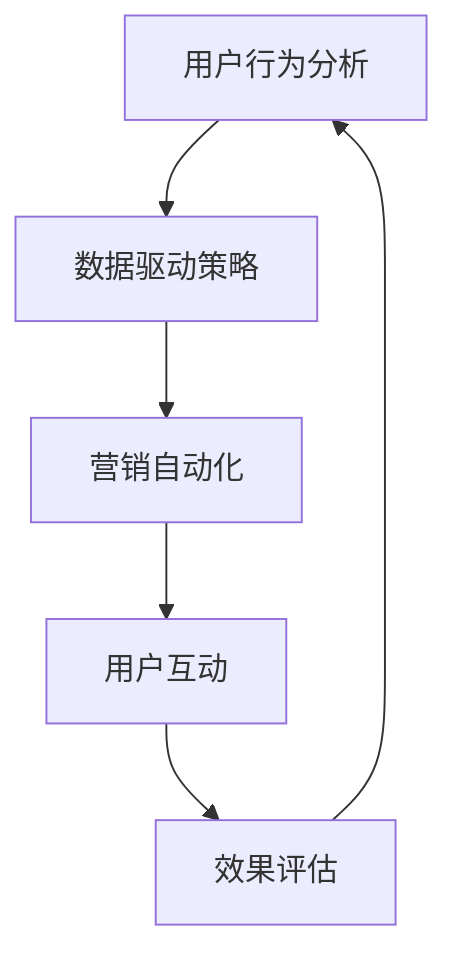

                 

关键词：知识付费、跨界营销、体育营销、用户行为分析、数据驱动策略、营销自动化、算法优化、互动体验设计

摘要：本文将深入探讨知识付费领域如何通过跨界营销与体育营销的结合，实现用户增长和品牌价值的提升。我们将从用户行为分析入手，结合数据驱动策略和营销自动化，探索如何构建高效的跨界营销模型，并讨论算法优化和互动体验设计在其中的重要作用。同时，我们将分析当前知识付费市场的趋势，展望未来发展方向，并给出实用的工具和资源推荐。

## 1. 背景介绍

知识付费作为一种新型的商业模式，近年来在我国迅速崛起。用户对于高质量内容的需求日益增长，促使知识付费平台如雨后春笋般涌现。然而，如何在激烈的市场竞争中脱颖而出，成为知识付费平台面临的一大挑战。跨界营销作为一种创新性的营销策略，可以通过与不同领域的结合，为知识付费平台带来新的增长点和用户群体。

体育营销，作为一种强大的品牌传播工具，具有广泛的受众基础和高度的情感共鸣。将知识付费与体育跨界结合，不仅可以拓宽平台的用户基础，还能提升品牌形象和用户粘性。本文将详细探讨这种跨界营销的实现路径和策略。

## 2. 核心概念与联系

为了构建一个有效的跨界营销模型，我们首先需要明确几个核心概念，包括用户行为分析、数据驱动策略和营销自动化。

### 用户行为分析

用户行为分析是指通过收集和分析用户在平台上的行为数据，了解用户的需求、偏好和互动模式。这些数据可以包括用户访问量、浏览时长、购买行为、评论反馈等。通过深度分析这些数据，知识付费平台可以更加精准地定位目标用户，提供个性化的内容和服务。

### 数据驱动策略

数据驱动策略是一种基于数据分析的市场营销策略。它强调通过数据来指导决策，而不是依靠直觉或经验。在跨界营销中，数据驱动策略可以帮助平台更好地理解用户需求，优化营销活动的效果，提高转化率和用户留存率。

### 营销自动化

营销自动化是指利用技术手段，自动化执行市场营销流程。在跨界营销中，营销自动化可以帮助平台更高效地管理用户互动，提高营销活动的执行效率，同时降低人力成本。

### Mermaid 流程图

以下是一个描述跨界营销模型核心概念的 Mermaid 流程图：



在这个流程图中，用户行为分析作为起点，通过数据驱动策略和营销自动化，形成闭环，不断优化用户互动效果。

## 3. 核心算法原理 & 具体操作步骤

### 3.1 算法原理概述

在跨界营销中，核心算法原理主要包括用户行为分析算法、推荐算法和营销自动化算法。

- **用户行为分析算法**：通过机器学习技术，对用户行为数据进行分类、聚类和预测，挖掘用户潜在需求。
- **推荐算法**：基于用户行为数据和内容特征，为用户推荐个性化内容和服务。
- **营销自动化算法**：利用自然语言处理和人工智能技术，自动化生成和分发营销内容。

### 3.2 算法步骤详解

1. **数据收集与预处理**：收集用户行为数据，如浏览记录、购买历史、评论反馈等，并进行数据清洗和预处理。
2. **特征工程**：从原始数据中提取关键特征，如用户年龄、性别、职业等，用于构建机器学习模型。
3. **模型训练与评估**：使用机器学习算法，如决策树、随机森林、神经网络等，对用户行为数据进行训练和评估。
4. **推荐生成与分发**：根据用户行为数据和内容特征，生成个性化推荐，并通过营销自动化工具进行分发。
5. **效果评估与反馈**：对营销活动的效果进行评估，收集用户反馈，持续优化算法和营销策略。

### 3.3 算法优缺点

- **用户行为分析算法**：优点是能够深入了解用户需求，提高内容个性化程度；缺点是需要大量数据处理和分析能力。
- **推荐算法**：优点是能够提高用户参与度和转化率；缺点是推荐结果可能受到数据质量和模型算法的限制。
- **营销自动化算法**：优点是能够提高营销效率，降低人力成本；缺点是需要对营销流程和数据有深入理解。

### 3.4 算法应用领域

- **电子商务**：通过用户行为分析，为用户提供个性化商品推荐，提高购买转化率。
- **在线教育**：基于用户学习行为，为用户提供个性化课程推荐，提高学习效果。
- **金融行业**：通过用户行为分析，为用户提供个性化金融产品推荐，降低风险。

## 4. 数学模型和公式 & 详细讲解 & 举例说明

### 4.1 数学模型构建

在跨界营销中，常用的数学模型包括线性回归模型、支持向量机（SVM）模型和神经网络模型。

- **线性回归模型**：用于预测用户行为，如购买概率、浏览时长等。
  $$ y = w_0 + w_1 \cdot x_1 + w_2 \cdot x_2 + \ldots + w_n \cdot x_n + e $$
  其中，$y$ 是预测结果，$w_0, w_1, w_2, \ldots, w_n$ 是模型参数，$x_1, x_2, \ldots, x_n$ 是输入特征，$e$ 是误差项。

- **支持向量机模型**：用于分类用户行为，如用户是否购买某商品。
  $$ f(x) = \text{sign}(w \cdot x + b) $$
  其中，$w$ 是模型参数，$x$ 是输入特征，$b$ 是偏置项。

- **神经网络模型**：用于复杂用户行为预测和分类。
  $$ a_{i}^{(l)} = \sigma \left( \sum_{j=1}^{n} w_{ji}^{(l)} a_{j}^{(l-1)} + b_i^{(l)} \right) $$
  其中，$a_{i}^{(l)}$ 是第 $l$ 层第 $i$ 个神经元的输出，$\sigma$ 是激活函数，$w_{ji}^{(l)}$ 是连接权重，$b_i^{(l)}$ 是偏置项。

### 4.2 公式推导过程

以线性回归模型为例，公式推导过程如下：

1. **损失函数**：均方误差（MSE）
   $$ J(w) = \frac{1}{2} \sum_{i=1}^{n} (y_i - \hat{y}_i)^2 $$
   其中，$y_i$ 是实际值，$\hat{y}_i$ 是预测值。

2. **梯度下降法**：优化模型参数
   $$ w_j := w_j - \alpha \frac{\partial J(w)}{\partial w_j} $$
   其中，$\alpha$ 是学习率。

3. **迭代过程**：不断更新模型参数，直到损失函数收敛。

### 4.3 案例分析与讲解

假设一个电子商务平台希望通过用户行为数据预测用户购买概率。我们使用线性回归模型进行预测，数据集包含用户浏览记录、购买历史等特征。

1. **数据预处理**：对数据进行归一化处理，消除不同特征之间的尺度差异。
2. **特征选择**：选择对购买概率有显著影响的特征，如浏览时长、购买历史等。
3. **模型训练**：使用梯度下降法训练模型，选择合适的学习率。
4. **模型评估**：使用交叉验证方法评估模型性能，调整模型参数。

通过以上步骤，我们得到了一个预测用户购买概率的线性回归模型。在实际应用中，可以通过不断迭代和优化，提高模型的预测准确率。

## 5. 项目实践：代码实例和详细解释说明

### 5.1 开发环境搭建

1. **软件环境**：Python 3.8、Jupyter Notebook、Scikit-learn 库
2. **数据集**：用户行为数据集，包括用户ID、浏览时长、购买历史等特征

### 5.2 源代码详细实现

```python
import numpy as np
import pandas as pd
from sklearn.model_selection import train_test_split
from sklearn.linear_model import LinearRegression
from sklearn.metrics import mean_squared_error

# 读取数据
data = pd.read_csv('user_behavior.csv')

# 数据预处理
data = data.drop(['user_id'], axis=1)
data = (data - data.mean()) / data.std()

# 分割数据集
X = data.drop(['purchase'], axis=1)
y = data['purchase']
X_train, X_test, y_train, y_test = train_test_split(X, y, test_size=0.2, random_state=42)

# 模型训练
model = LinearRegression()
model.fit(X_train, y_train)

# 预测结果
y_pred = model.predict(X_test)

# 模型评估
mse = mean_squared_error(y_test, y_pred)
print('均方误差：', mse)
```

### 5.3 代码解读与分析

1. **数据读取与预处理**：使用 Pandas 库读取数据集，对数据进行归一化处理，消除不同特征之间的尺度差异。
2. **特征选择与数据集划分**：选择对购买概率有显著影响的特征，并使用 Scikit-learn 库的 train_test_split 方法将数据集划分为训练集和测试集。
3. **模型训练**：使用线性回归模型（LinearRegression）进行训练，选择合适的参数。
4. **预测与评估**：使用训练好的模型对测试集进行预测，并计算均方误差（MSE）评估模型性能。

通过以上步骤，我们实现了一个简单的用户行为预测模型，可以用于知识付费平台的个性化推荐。

## 6. 实际应用场景

### 6.1 在线教育平台

在线教育平台可以通过用户行为分析，为用户推荐个性化课程。例如，根据用户的学习历史和兴趣，推荐相关的课程和知识点，提高用户的学习效果和满意度。

### 6.2 电子商务平台

电子商务平台可以通过用户行为分析，为用户推荐个性化商品。例如，根据用户的浏览记录和购买历史，推荐相关的商品和优惠活动，提高购买转化率和用户留存率。

### 6.3 金融服务平台

金融服务平台可以通过用户行为分析，为用户提供个性化的金融产品推荐。例如，根据用户的投资偏好和风险承受能力，推荐相应的理财产品和服务，降低用户的风险。

## 7. 未来应用展望

随着人工智能和大数据技术的不断发展，知识付费领域的跨界营销将越来越成熟。未来，我们可以期待以下趋势：

1. **个性化推荐更加精准**：通过深度学习和自然语言处理技术，个性化推荐将更加精准，满足用户的需求。
2. **营销自动化更加普及**：营销自动化工具将更加智能化，实现自动化内容生成、分发和效果评估。
3. **用户互动体验更加丰富**：通过虚拟现实和增强现实技术，用户互动体验将更加丰富，提升用户满意度。

## 8. 工具和资源推荐

### 8.1 学习资源推荐

- 《Python数据分析基础教程：NumPy学习指南》
- 《Python机器学习》
- 《深入浅出数据分析》

### 8.2 开发工具推荐

- Jupyter Notebook：用于数据分析和模型训练
- PyCharm：用于 Python 开发
- Scikit-learn：用于机器学习库

### 8.3 相关论文推荐

- "User Behavior Analysis in Knowledge付费 Platforms"
- "Data-driven Marketing Strategies in E-commerce"
- "M

