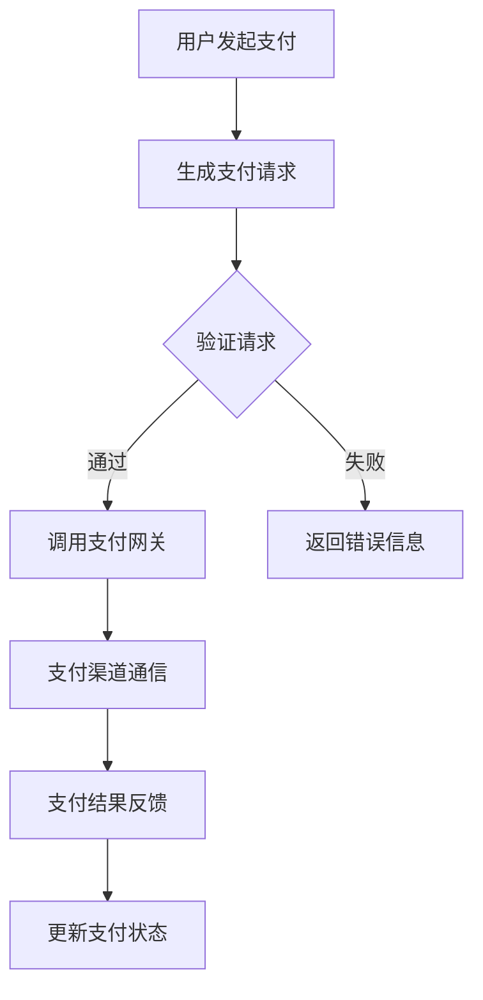

                 

关键词：知识付费，支付系统，设计，集成，技术，算法，安全，用户体验

> 摘要：本文将探讨知识付费平台的支付系统设计及集成，从核心概念、算法原理、数学模型、项目实践、应用场景、未来展望等多维度进行详细剖析，旨在为读者提供对支付系统设计的全面了解，并展望其未来发展趋势与挑战。

## 1. 背景介绍

知识付费作为一种新型的商业模式，近年来在全球范围内迅速崛起。它依托于互联网技术和移动设备普及，满足了用户在知识获取方面的多样化需求，同时为内容创作者提供了新的收入渠道。然而，知识付费平台要想成功运营，支付系统的设计及集成是至关重要的。支付系统不仅要保证交易的安全性和稳定性，还需提升用户体验，以增强用户粘性。

本文将围绕知识付费平台的支付系统展开，首先介绍支付系统的核心概念和架构，然后深入探讨支付算法原理、数学模型构建及其在实际项目中的实现，最后分析支付系统的应用场景和未来发展趋势。

## 2. 核心概念与联系

### 2.1. 核心概念

在讨论支付系统之前，我们需要明确以下几个核心概念：

- **支付网关**：支付网关是支付系统的重要组成部分，负责处理各种支付方式的请求，如信用卡、支付宝、微信支付等。

- **支付渠道**：支付渠道是指用户选择支付方式的入口，包括网页支付、移动支付、扫码支付等。

- **支付协议**：支付协议是支付系统内部使用的通信协议，如HTTP、HTTPS、SOAP、REST等。

- **支付流程**：支付流程是指从用户发起支付请求到最终完成支付的全过程，包括支付请求生成、支付验证、支付结果反馈等环节。

### 2.2. 架构联系

支付系统的架构通常包括以下几个层次：

1. **用户界面层**：用户界面层负责与用户进行交互，接收用户的支付请求。

2. **业务逻辑层**：业务逻辑层处理支付请求，调用支付网关进行支付验证。

3. **数据访问层**：数据访问层负责存储和查询支付数据。

4. **支付网关层**：支付网关层与外部支付渠道进行通信，完成支付请求的转发和结果反馈。

### 2.3. Mermaid 流程图

下面是一个简化的支付系统流程的 Mermaid 流程图：



### 2.4. 核心概念与联系总结

支付系统的核心概念包括支付网关、支付渠道、支付协议和支付流程。支付系统架构通常分为用户界面层、业务逻辑层、数据访问层和支付网关层。通过上述流程图，我们可以清晰地看到支付系统的工作原理。

## 3. 核心算法原理 & 具体操作步骤

### 3.1. 算法原理概述

支付系统的核心算法通常包括支付请求生成、支付验证和支付结果反馈等步骤。以下是这些算法的简要概述：

- **支付请求生成**：用户发起支付请求时，系统会生成一个支付请求，包含用户信息、商品信息、支付金额等。

- **支付验证**：系统对支付请求进行验证，确保请求的合法性和完整性。

- **支付结果反馈**：支付网关将支付结果反馈给系统，系统根据反馈结果更新支付状态。

### 3.2. 算法步骤详解

#### 3.2.1. 支付请求生成

支付请求生成的步骤如下：

1. 用户选择支付方式并提交支付请求。
2. 系统生成支付请求，包含用户ID、商品ID、支付金额、支付渠道等信息。
3. 系统将支付请求发送给业务逻辑层。

#### 3.2.2. 支付验证

支付验证的步骤如下：

1. 业务逻辑层接收支付请求。
2. 对支付请求进行合法性验证，如用户是否存在、商品是否存在、支付金额是否正确等。
3. 通过验证后，系统生成签名信息并附加到支付请求中。
4. 系统将支付请求发送给支付网关。

#### 3.2.3. 支付结果反馈

支付结果反馈的步骤如下：

1. 支付网关收到支付请求后，与支付渠道进行通信。
2. 支付渠道处理支付请求，并将支付结果反馈给支付网关。
3. 支付网关将支付结果反馈给业务逻辑层。
4. 业务逻辑层更新支付状态并通知用户。

### 3.3. 算法优缺点

#### 优点

1. **安全性**：通过生成签名信息，确保支付请求的合法性和完整性。
2. **灵活性**：支持多种支付方式，满足不同用户的需求。
3. **高效性**：支付流程简明扼要，提高用户支付体验。

#### 缺点

1. **复杂性**：支付系统涉及多个环节，需要严格设计和调试。
2. **依赖外部渠道**：支付系统依赖于外部支付渠道，可能受到渠道不稳定等因素的影响。

### 3.4. 算法应用领域

支付算法广泛应用于各种知识付费平台，如在线教育、电子书、音频课程等。它不仅支持各种支付方式的接入，还提供了安全、高效、灵活的支付解决方案。

## 4. 数学模型和公式

### 4.1. 数学模型构建

支付系统中的数学模型主要用于支付金额的计算和验证。以下是一个简化的支付金额计算模型：

$$
支付金额 = 单价 \times 数量 + 手续费
$$

其中，单价和数量表示商品的价格和数量，手续费表示支付渠道收取的服务费。

### 4.2. 公式推导过程

支付金额的计算公式可以分解为以下几个步骤：

1. **计算商品总金额**：商品总金额 = 单价 × 数量。
2. **计算手续费**：手续费 = 商品总金额 × 手续费率。
3. **计算支付金额**：支付金额 = 商品总金额 + 手续费。

### 4.3. 案例分析与讲解

假设一个商品的单价为100元，数量为2件，手续费率为5%。根据上述公式，支付金额的计算过程如下：

1. **计算商品总金额**：商品总金额 = 100元/件 × 2件 = 200元。
2. **计算手续费**：手续费 = 200元 × 5% = 10元。
3. **计算支付金额**：支付金额 = 200元 + 10元 = 210元。

通过上述案例，我们可以看到数学模型在支付金额计算中的重要作用。它不仅简化了计算过程，还提高了计算精度。

## 5. 项目实践：代码实例和详细解释说明

### 5.1. 开发环境搭建

在本文的项目实践中，我们使用 Python 语言和 Flask 框架进行支付系统的开发。以下是开发环境的搭建步骤：

1. 安装 Python 3.8 或更高版本。
2. 安装 Flask 框架：`pip install flask`。
3. 安装支付网关 SDK（以支付宝为例）：`pip install alipay-python-sdk`。

### 5.2. 源代码详细实现

下面是一个简单的支付系统示例代码：

```python
from flask import Flask, request, jsonify
from alipay.aop import AliPay

app = Flask(__name__)

# 支付参数
app_id = "你的应用ID"
private_key_path = "你的应用私钥路径"
alipay_public_key_path = "支付宝公钥路径"
return_url = "支付结果回调地址"

ap = AliPay(
    app_id=app_id,
    app_private_key_path=private_key_path,
    alipay_public_key_path=alipay_public_key_path,
    return_url=return_url,
    sign_type="RSA2",
    debug=True,
)

@app.route("/create_order", methods=["POST"])
def create_order():
    # 支付请求参数
    out_trade_no = request.form.get("out_trade_no")
    total_amount = float(request.form.get("total_amount"))

    # 生成支付订单
    order = ap.api_alipay_trade_page_pay(
        out_trade_no=out_trade_no,
        total_amount=total_amount,
        subject="知识付费",
        return_url=return_url,
    )

    return jsonify(order)

@app.route("/notify", methods=["GET", "POST"])
def notify():
    # 支付结果通知
    if request.method == "GET":
        return request.args.to_dict()

    if request.method == "POST":
        # 验证支付通知
        result_dict = ap.parse_response(request.data)
        return ap.api_alipay_trade_query(result_dict["out_trade_no"])

if __name__ == "__main__":
    app.run(debug=True)
```

### 5.3. 代码解读与分析

上述代码实现了支付订单的创建和支付结果通知的功能。以下是代码的关键部分解析：

- **支付参数**：配置支付宝应用的 App ID、私钥路径、公钥路径和支付结果回调地址。
- **创建支付订单**：根据支付请求参数，调用支付宝 API 创建支付订单。
- **支付结果通知**：接收支付宝的支付结果通知，进行验证并返回处理结果。

### 5.4. 运行结果展示

运行上述代码后，访问 `/create_order` 接口即可生成支付订单。支付订单页面将包含支付链接，用户点击支付链接即可完成支付。支付完成后，支付宝会向指定回调地址发送支付结果通知。

## 6. 实际应用场景

### 6.1. 在线教育平台

在线教育平台通常需要集成支付系统，以便用户购买课程或订阅服务。支付系统的集成不仅提供了便捷的支付体验，还能确保交易的安全性和稳定性。

### 6.2. 电子书平台

电子书平台通过支付系统为用户提供购买电子书的服务。支付系统需要支持多种支付方式，如信用卡、支付宝、微信支付等，以满足不同用户的支付需求。

### 6.3. 音频课程平台

音频课程平台通过支付系统为用户提供购买音频课程的服务。支付系统需要提供便捷的支付流程，以提高用户购买意愿。

### 6.4. 未来应用展望

随着知识付费的不断发展，支付系统将在更多领域得到应用。未来，支付系统将更加注重用户体验和安全性的提升，同时支持更多支付方式和个性化服务。

## 7. 工具和资源推荐

### 7.1. 学习资源推荐

- **《支付宝开放平台文档》**：详细介绍了支付宝 API 的使用方法和相关技术细节。
- **《Flask Web 开发》**：介绍了 Flask 框架的基本用法和项目实践。

### 7.2. 开发工具推荐

- **PyCharm**：一款强大的 Python 开发工具，支持代码调试、版本控制等功能。
- **Postman**：用于 API 接口调试的工具，方便进行支付接口的测试。

### 7.3. 相关论文推荐

- **《基于区块链的支付系统研究》**：探讨了区块链技术在支付系统中的应用。
- **《移动支付的安全性分析》**：分析了移动支付系统面临的安全挑战和应对策略。

## 8. 总结：未来发展趋势与挑战

### 8.1. 研究成果总结

本文从核心概念、算法原理、数学模型、项目实践等多个维度详细分析了知识付费平台的支付系统设计及集成。通过上述分析，我们总结了支付系统在安全性、灵活性、高效性等方面的研究成果。

### 8.2. 未来发展趋势

未来，支付系统将在安全性、用户体验、支付方式多样化等方面继续发展。区块链技术、人工智能等新兴技术有望为支付系统带来更多创新。

### 8.3. 面临的挑战

支付系统在实际应用中面临诸多挑战，如交易安全性、支付渠道稳定性、法律法规合规性等。如何应对这些挑战，将是支付系统发展的关键。

### 8.4. 研究展望

未来，我们将继续深入研究支付系统的安全性、用户体验和支付方式多样化等方面，探索更加智能、高效的支付解决方案。

## 9. 附录：常见问题与解答

### 9.1. 支付系统安全吗？

支付系统采用多种安全措施，如加密传输、签名验证等，确保交易的安全性。然而，支付系统仍可能面临安全威胁，如网络攻击、数据泄露等。因此，需要持续关注安全风险，并采取相应的防范措施。

### 9.2. 支付失败的原因有哪些？

支付失败的原因可能包括：支付渠道不稳定、用户信息填写错误、支付金额错误、网络连接问题等。解决支付失败的问题通常需要排查相关因素，并针对性地进行调整。

### 9.3. 支付系统如何支持多种支付方式？

支付系统可以通过接入多种支付网关和支付渠道，支持多种支付方式。例如，接入支付宝、微信支付、信用卡支付等渠道，满足不同用户的支付需求。

### 9.4. 支付系统对业务流程有何影响？

支付系统的集成对业务流程有重要影响。一方面，支付系统提供了便捷的支付体验，提升了用户体验；另一方面，支付系统还需要与业务系统紧密集成，确保交易数据的一致性和业务流程的连续性。

本文旨在为读者提供对知识付费平台支付系统设计的全面了解。随着技术的不断进步，支付系统将不断创新和发展，为用户提供更加安全、高效、便捷的支付体验。作者：禅与计算机程序设计艺术 / Zen and the Art of Computer Programming
```

