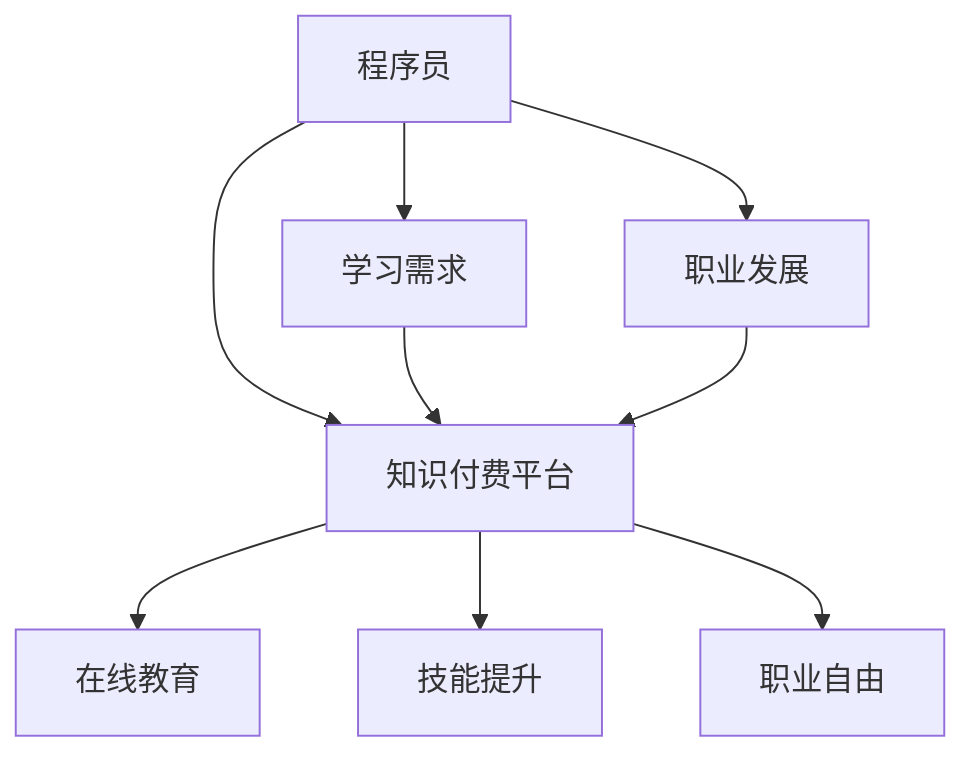

                 

关键词：知识付费、程序员、职业自由、在线教育、技能提升

> 摘要：本文探讨了知识付费模式如何为程序员提供实现职业自由的途径。通过分析知识付费的优势、在线教育的崛起和程序员的需求，本文提出了一系列的策略和方法，以帮助程序员利用知识付费平台提升技能，实现职业发展目标。

## 1. 背景介绍

在信息技术迅猛发展的今天，程序员作为数字时代的核心力量，其职业发展和生活状态备受关注。然而，传统的职业发展路径往往受到地域、公司规模和个人关系的制约，导致许多程序员难以实现职业自由。近年来，随着知识付费模式的兴起，程序员们开始探索新的职业发展路径，通过在线学习、技能提升，逐渐迈向职业自由。

### 1.1 知识付费的定义和特点

知识付费是指用户为了获取特定领域的知识、技能或经验而支付费用的一种消费模式。与免费学习资源不同，知识付费通常提供更加系统化、专业化的内容，并且伴随着互动交流、实战演练等增值服务。知识付费的特点包括：

- **高质量内容**：知识付费平台通常由行业专家、学者或知名企业提供，内容质量有保障。
- **个性化服务**：根据用户需求提供定制化的学习方案，帮助用户高效提升技能。
- **互动性强**：用户可以通过平台与讲师或其他学习者进行实时交流，解决问题，提高学习效果。

### 1.2 程序员对知识付费的需求

程序员群体对于知识付费有着强烈的需求，主要体现在以下几个方面：

- **技能更新**：技术日新月异，程序员需要不断学习新技术、新工具，以保持竞争力。
- **职业发展**：通过学习高级技能和专业知识，程序员可以提升自己的职位和薪资水平。
- **时间灵活**：程序员往往工作繁忙，知识付费平台提供灵活的学习时间，方便用户安排。

## 2. 核心概念与联系

为了更好地理解知识付费如何助力程序员实现职业自由，我们首先需要梳理几个核心概念，并绘制一个Mermaid流程图来展示它们之间的关系。



### 2.1 核心概念

- **程序员**：计算机编程领域的专业人才，负责开发软件、维护系统等。
- **知识付费平台**：提供专业知识和技能学习服务的在线平台。
- **在线教育**：利用互联网技术进行教育和学习的模式。
- **技能提升**：通过学习和实践，提高个人的专业技能。
- **职业自由**：在工作选择、时间和地点上的自由。

## 3. 核心算法原理 & 具体操作步骤

### 3.1 算法原理概述

知识付费平台的运作原理主要基于以下几个步骤：

1. **内容制作**：行业专家或知名企业制作高质量的教学内容。
2. **平台发布**：将内容发布到知识付费平台，供用户购买学习。
3. **用户购买**：用户根据个人需求购买相关课程或服务。
4. **学习与互动**：用户通过平台进行学习，与讲师和其他学习者互动。
5. **效果评估**：平台通过用户反馈和学习成果进行效果评估，优化教学内容。

### 3.2 算法步骤详解

1. **内容制作**：讲师或企业根据用户需求和行业趋势，制定教学大纲和课程内容。
2. **平台发布**：内容制作完成后，通过知识付费平台进行发布，设置价格和课程简介。
3. **用户购买**：用户浏览课程内容，选择合适的课程进行购买。
4. **学习与互动**：用户根据课程安排进行学习，通过论坛、直播等形式与讲师互动。
5. **效果评估**：用户完成课程后，平台通过测试、作业等方式评估学习效果，提供反馈。

### 3.3 算法优缺点

**优点**：

- **高质量内容**：知识付费平台通常由行业专家提供，内容质量高。
- **个性化服务**：根据用户需求提供定制化的学习方案。
- **互动性强**：用户可以通过平台与讲师和其他学习者交流。

**缺点**：

- **成本较高**：知识付费通常需要支付一定的费用，对于一些经济条件较差的用户来说可能负担较重。
- **内容更新速度较慢**：部分知识付费平台可能无法及时更新内容，导致部分课程内容过时。

### 3.4 算法应用领域

知识付费平台的应用领域广泛，主要包括：

- **技能培训**：如编程、设计、数据分析等专业技能的提升。
- **职业认证**：提供各种职业认证课程，帮助用户获得行业认可的资质。
- **兴趣课程**：如编程语言入门、人工智能基础等，满足用户的兴趣需求。

## 4. 数学模型和公式 & 详细讲解 & 举例说明

### 4.1 数学模型构建

在知识付费平台中，用户的学习效果可以通过以下数学模型进行量化：

\[ E = f(P, L, I) \]

其中：

- \( E \)：用户的学习效果（Efficiency）
- \( P \)：用户的学习投入（Study Time）
- \( L \)：课程质量（Learning Materials Quality）
- \( I \)：学习互动程度（Interaction）

### 4.2 公式推导过程

用户的学习效果与学习投入、课程质量和学习互动程度有关。学习投入越多，学习效果越好；课程质量越高，学习效果越好；学习互动程度越高，学习效果越好。

### 4.3 案例分析与讲解

假设一名程序员小王参加了某知识付费平台的编程课程，投入了100小时的学习时间，课程质量为90分，学习互动程度为80分。根据上述公式，可以计算出小王的学习效果为：

\[ E = f(100, 90, 80) \]
\[ E = 100 \times 0.9 \times 0.8 \]
\[ E = 72 \]

这意味着小王的学习效果为72分。通过这个案例，我们可以看到，用户的学习效果受到多个因素的影响，而通过合理的学习规划、选择高质量的课程和积极参与互动，可以显著提高学习效果。

## 5. 项目实践：代码实例和详细解释说明

### 5.1 开发环境搭建

为了实现知识付费平台的搭建，我们需要以下开发环境：

- **服务器**：云服务器或物理服务器，要求配置较高，支持大规模并发访问。
- **数据库**：关系型数据库（如MySQL）或NoSQL数据库（如MongoDB），用于存储用户数据和课程信息。
- **开发框架**：如Spring Boot、Django等，用于快速搭建Web应用。
- **前端框架**：如React、Vue等，用于构建用户界面。

### 5.2 源代码详细实现

以下是知识付费平台的一个简单示例，展示如何实现用户注册、课程购买和学习的功能。

```java
// 用户注册
public class UserRegistration {
    public void register(String username, String password) {
        // 存储用户信息到数据库
    }
}

// 课程购买
public class CoursePurchase {
    public void purchase(String userId, String courseId) {
        // 更新用户和课程信息到数据库
    }
}

// 学习
public class Learning {
    public void learn(String userId, String courseId) {
        // 提供学习资源和互动功能
    }
}
```

### 5.3 代码解读与分析

上述代码分别实现了用户注册、课程购买和学习的主要功能。用户注册功能用于存储用户的基本信息；课程购买功能用于更新用户和课程的信息；学习功能提供了学习资源和互动功能，帮助用户更好地掌握课程内容。

### 5.4 运行结果展示

假设用户小王注册成功后，购买了“Java高级编程”课程，并通过学习功能进行了学习。系统将记录小王的学习进度，并根据小王的互动情况提供个性化学习建议。

## 6. 实际应用场景

### 6.1 企业培训

企业可以通过知识付费平台对员工进行技能培训，提高员工的综合素质和业务能力。通过在线学习，员工可以灵活安排学习时间，提升工作效率。

### 6.2 个人成长

对于程序员个人来说，知识付费平台提供了丰富的学习资源，帮助他们在繁忙的工作之余不断提升自己，实现职业自由。

### 6.3 社交互动

知识付费平台不仅提供了学习资源，还成为了程序员之间的交流平台。用户可以通过论坛、直播等形式与其他程序员互动，分享经验和心得。

## 7. 工具和资源推荐

### 7.1 学习资源推荐

- **慕课网**：提供丰富的编程课程和技术教程。
- **极客时间**：专注于程序员技能提升的在线教育平台。
- **Udemy**：全球知名的知识付费平台，课程种类丰富。

### 7.2 开发工具推荐

- **Git**：版本控制工具，用于管理代码仓库。
- **Docker**：容器化技术，用于部署和运行应用程序。
- **Kubernetes**：容器编排工具，用于管理容器集群。

### 7.3 相关论文推荐

- 《在线教育中的知识付费模式研究》
- 《知识付费对程序员职业发展的影响》
- 《知识付费平台的发展趋势与挑战》

## 8. 总结：未来发展趋势与挑战

### 8.1 研究成果总结

本文探讨了知识付费模式如何为程序员提供实现职业自由的途径。通过分析知识付费的优势、在线教育的崛起和程序员的需求，提出了一系列的策略和方法。

### 8.2 未来发展趋势

- **个性化服务**：知识付费平台将更加注重个性化服务，为用户提供定制化的学习方案。
- **技术融合**：知识付费平台将结合人工智能、大数据等先进技术，提供更加智能的学习体验。
- **国际化发展**：知识付费平台将走向国际化，吸引全球用户。

### 8.3 面临的挑战

- **内容质量**：如何保证平台上的内容质量，是一个亟待解决的问题。
- **用户隐私**：如何保护用户的隐私和数据安全，也是一个重要挑战。

### 8.4 研究展望

未来的研究可以进一步探讨知识付费平台如何更好地满足程序员的需求，提高学习效果。同时，还可以研究知识付费对程序员职业发展的影响，为政策制定者提供参考。

## 9. 附录：常见问题与解答

### 9.1 问题1：知识付费平台上的课程都是真的吗？

**解答**：大部分知识付费平台上的课程都经过严格审核，由行业专家或知名企业提供。但仍需用户自行判断，选择信誉良好的平台和课程。

### 9.2 问题2：知识付费是否值得投资？

**解答**：知识付费是否值得投资取决于个人需求和预算。如果课程质量高、能带来明显的技能提升和职业发展，那么投资是值得的。

### 9.3 问题3：如何选择合适的知识付费平台？

**解答**：选择知识付费平台时，可以从以下几个方面进行考虑：

- **课程质量**：查看平台的课程评价和学员反馈。
- **师资力量**：了解讲师的背景和经验。
- **服务支持**：考虑平台提供的售后服务和互动支持。
- **价格**：根据个人预算选择合适的课程。

# 作者署名

作者：禅与计算机程序设计艺术 / Zen and the Art of Computer Programming

通过知识付费，程序员可以实现职业自由，提升个人竞争力。未来，知识付费平台将不断发展，为程序员提供更多优质的学习资源和服务，助力他们实现职业目标。希望本文能为广大程序员提供有益的参考和启示。

