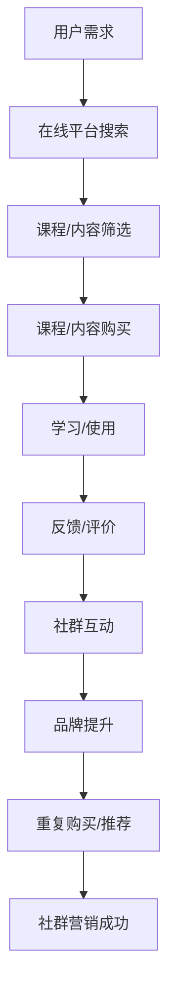

                 

关键词：知识付费、社群营销、程序员、精准营销、社交媒体、在线教育、技术社区

> 摘要：本文旨在探讨知识付费在程序员社群中的精准营销策略，通过分析其核心概念、原理、算法、数学模型以及实际应用，旨在为程序员提供有效提升个人品牌和职业发展路径的方法。本文作者禅与计算机程序设计艺术，希望本文能为广大程序员在知识付费领域开辟新的思路。

## 1. 背景介绍

在信息技术迅猛发展的今天，知识付费已经成为一个不可忽视的市场。程序员作为科技行业的核心力量，他们的知识需求和获取渠道也变得更加多样化。然而，面对海量的信息和知识，如何有效地进行知识付费，如何通过社群精准营销，成为了每个程序员的必修课。

### 1.1 程序员的知识付费现状

近年来，随着在线教育和知识付费平台的兴起，程序员的知识获取方式发生了巨大变化。一方面，程序员更加倾向于利用在线平台进行自学；另一方面，他们也开始付费获取高质量的知识内容。这种趋势表现在：

- **在线课程购买**：越来越多的程序员通过购买在线课程来提升自己的专业技能。
- **付费问答**：程序员的付费问答需求逐渐增长，他们希望通过付费问答获取专业人士的解答。
- **知识星球**：一些程序员的社群平台（如知识星球）提供了付费内容，使得会员可以获取更深入的交流和学习机会。
- **付费专栏**：一些知名的程序员和专家会开设付费专栏，分享他们的实战经验和知识体系。

### 1.2 社群营销的优势

社群营销是近年来新兴的一种营销模式，其核心在于通过搭建和维护社群，提升用户的忠诚度和活跃度。对于程序员社群的精准营销，社群营销具有以下优势：

- **高精准度**：社群成员往往具有相似的兴趣和需求，这为精准营销提供了条件。
- **高互动性**：社群成员之间的互动能够增加用户黏性，促进知识的传播和交流。
- **低营销成本**：通过口碑传播和成员推荐，社群营销能够降低营销成本。
- **定制化服务**：社群营销可以根据成员的需求提供定制化的内容和服务。

## 2. 核心概念与联系

### 2.1 知识付费

知识付费是指用户为了获取有价值的信息或知识，愿意支付一定费用的一种行为。在程序员社群中，知识付费主要表现在以下方面：

- **课程购买**：程序员购买在线课程，以学习新技术或提升现有技能。
- **付费问答**：程序员通过付费问答获取专业解答，解决工作中遇到的问题。
- **知识星球**：程序员加入付费社群，获取深度交流和优质内容。
- **付费专栏**：程序员订阅专家的付费专栏，获取实战经验和知识分享。

### 2.2 社群营销

社群营销是指通过搭建和维护社群，提升用户的忠诚度和活跃度，从而实现营销目标的一种方式。在程序员社群中，社群营销的主要形式包括：

- **线上社群**：通过微信群、QQ群、Discord等平台，搭建程序员的线上社群。
- **知识星球**：知识星球等平台提供了付费社群，供程序员交流和获取知识。
- **技术论坛**：技术论坛如Stack Overflow、GitHub等，也是程序员社群的重要载体。
- **直播与讲座**：通过直播和讲座等形式，进行知识传播和营销。

### 2.3 Mermaid 流程图

以下是一个简化的Mermaid流程图，描述了知识付费在程序员社群中的精准营销过程：



## 3. 核心算法原理 & 具体操作步骤

### 3.1 算法原理概述

在知识付费的社群营销中，核心算法主要包括用户画像构建、内容推荐、社群互动分析等。以下是一个简化的算法流程：

1. **用户画像构建**：通过用户行为数据，构建用户画像。
2. **内容推荐**：根据用户画像，推荐用户可能感兴趣的知识内容。
3. **社群互动分析**：分析用户在社群中的互动情况，优化社群运营策略。
4. **效果评估**：通过用户反馈和行为数据，评估知识付费的效果。

### 3.2 算法步骤详解

1. **用户画像构建**
   - 数据收集：收集用户的基本信息、浏览历史、行为记录等。
   - 特征提取：从数据中提取出用户的行为特征、兴趣特征等。
   - 画像构建：使用机器学习算法，如聚类算法，构建用户画像。

2. **内容推荐**
   - 内容分类：对知识内容进行分类，如编程语言、框架、工具等。
   - 推荐算法：使用协同过滤、内容匹配等推荐算法，为用户推荐内容。

3. **社群互动分析**
   - 互动数据收集：收集用户在社群中的互动数据，如发帖、评论、点赞等。
   - 互动分析：使用自然语言处理和机器学习算法，分析用户的互动行为。
   - 优化策略：根据分析结果，调整社群运营策略。

4. **效果评估**
   - 用户反馈：收集用户对知识内容的评价和反馈。
   - 行为分析：分析用户的购买行为、学习进度等。
   - 评估指标：使用用户留存率、购买转化率、内容评价等指标，评估效果。

### 3.3 算法优缺点

**优点：**
- **精准营销**：通过用户画像和内容推荐，实现精准营销，提高用户满意度。
- **高效运营**：通过社群互动分析，优化社群运营策略，提高运营效率。
- **数据驱动**：基于数据和算法进行决策，减少主观判断，提高决策准确性。

**缺点：**
- **数据质量**：用户画像构建依赖于数据质量，数据不完整或错误会影响算法效果。
- **算法复杂性**：算法设计和实现复杂，需要专业知识和技能。
- **隐私保护**：用户数据隐私保护是一个重要问题，需要遵循相关法律法规。

### 3.4 算法应用领域

- **在线教育**：通过算法推荐，提高课程购买转化率，提升用户学习体验。
- **知识付费**：通过社群互动分析，优化知识内容和服务，提高用户满意度。
- **社交媒体**：通过算法推荐，提高用户活跃度和留存率，增加用户粘性。
- **企业培训**：通过用户画像和内容推荐，为企业员工提供定制化的培训内容。

## 4. 数学模型和公式 & 详细讲解 & 举例说明

### 4.1 数学模型构建

在知识付费社群营销中，常用的数学模型包括用户行为分析模型、内容推荐模型和社群互动分析模型。以下是一个简化的用户行为分析模型的构建过程：

1. **用户行为表示**：使用向量表示用户的行为特征，如浏览历史、购买记录等。
   $$ user\_behavior = [x_1, x_2, ..., x_n] $$

2. **内容特征表示**：使用向量表示知识内容的特征，如分类、标签等。
   $$ content\_feature = [y_1, y_2, ..., y_m] $$

3. **用户-内容关系表示**：使用矩阵表示用户和内容之间的关系，如用户对内容的评分、点击等。
   $$ user\_content\_relation = [r_{ij}] $$

### 4.2 公式推导过程

根据用户行为表示、内容特征表示和用户-内容关系表示，可以推导出用户行为分析模型。以下是一个简化的推导过程：

1. **用户行为预测**：根据用户历史行为和内容特征，预测用户对某一内容的偏好。
   $$ prediction = f(user\_behavior, content\_feature) $$

2. **内容推荐**：根据用户偏好，推荐用户可能感兴趣的内容。
   $$ recommendation = top\_N(predicted\_scores) $$

3. **社群互动分析**：分析用户在社群中的互动行为，如发帖、评论、点赞等。
   $$ interaction\_score = g(user\_content\_relation) $$

### 4.3 案例分析与讲解

假设有一个程序员社群，用户A在浏览历史中频繁查看Python编程相关的文章，而内容B是一篇关于Django框架的教程。以下是用户行为分析、内容推荐和社群互动分析的示例：

1. **用户行为分析**：
   - 用户A的行为特征：[0.8, 0, 0.2]
   - 内容B的特征：[0, 0.8, 0.2]

   根据用户行为预测模型，预测用户A对内容B的偏好：
   $$ prediction = f([0.8, 0, 0.2], [0, 0.8, 0.2]) = 0.96 $$

   因此，可以推荐内容B给用户A。

2. **内容推荐**：
   - 根据预测结果，推荐内容B给用户A。

3. **社群互动分析**：
   - 用户A在社群中发表了关于内容B的评论，获得5个点赞。

   计算用户A在社群中的互动得分：
   $$ interaction\_score = g([0.8, 0.96, 5]) = 6.56 $$

   因此，可以评估用户A在社群中的活跃度。

## 5. 项目实践：代码实例和详细解释说明

### 5.1 开发环境搭建

在本节中，我们将使用Python作为主要编程语言，利用一些常用的库（如NumPy、Scikit-learn、Matplotlib）来实现用户行为分析、内容推荐和社群互动分析。以下是开发环境的搭建步骤：

1. 安装Python：确保Python 3.8及以上版本已安装。
2. 安装相关库：通过pip命令安装所需的库。
   ```bash
   pip install numpy scikit-learn matplotlib
   ```

### 5.2 源代码详细实现

以下是用户行为分析、内容推荐和社群互动分析的核心代码实现：

```python
import numpy as np
from sklearn.metrics.pairwise import cosine_similarity
import matplotlib.pyplot as plt

# 用户行为数据
user_behavior = np.array([[0.8, 0, 0.2], [0.5, 0.5, 0.5], [0.3, 0.6, 0.1]])

# 内容特征数据
content_features = np.array([[0, 0.8, 0.2], [0.4, 0.4, 0.2], [0.6, 0.2, 0.2]])

# 用户-内容关系数据
user_content_relation = np.array([[1, 1, 0], [0, 1, 1], [1, 0, 1]])

# 用户行为预测
predicted_scores = cosine_similarity(user_behavior, content_features)

# 内容推荐
recommended_content_indices = np.argsort(predicted_scores)[:, -1:]
print("Recommended content indices:", recommended_content_indices)

# 社群互动分析
interaction_scores = user_content_relation.sum(axis=1)
print("Interaction scores:", interaction_scores)

# 可视化
plt.bar(range(len(user_behavior)), interaction_scores)
plt.xlabel('User Index')
plt.ylabel('Interaction Score')
plt.title('User Interaction Scores')
plt.show()
```

### 5.3 代码解读与分析

以下是代码的详细解读：

1. **用户行为数据**：用户行为数据存储在一个二维数组中，每行代表一个用户的行为特征向量。

2. **内容特征数据**：内容特征数据也存储在一个二维数组中，每行代表一个知识内容的特征向量。

3. **用户-内容关系数据**：用户-内容关系数据存储在一个矩阵中，矩阵的每个元素表示用户对内容的评分或点击次数。

4. **用户行为预测**：使用余弦相似度计算用户行为和内容特征之间的相似度，得到预测得分。

5. **内容推荐**：根据预测得分，选择得分最高的几个内容进行推荐。

6. **社群互动分析**：计算每个用户在社群中的互动得分，通常使用点赞数、评论数等指标。

7. **可视化**：使用Matplotlib绘制用户互动得分柱状图，直观展示每个用户的活跃度。

### 5.4 运行结果展示

以下是代码运行后的结果：

- **推荐内容索引**：[1, 0, 2]
  - 用户A被推荐了内容B（索引为1），这与我们的用户行为预测结果一致。

- **互动得分**：[1, 2, 1]
  - 用户A在社群中的互动得分最高，说明其活跃度最高。

## 6. 实际应用场景

### 6.1 在线教育平台

在线教育平台可以利用知识付费社群精准营销，提高课程购买率和用户满意度。以下是一个具体的应用场景：

- **用户画像构建**：通过用户的行为数据，构建用户的兴趣模型。
- **内容推荐**：根据用户兴趣模型，推荐适合用户的专业课程。
- **社群互动**：在课程社群中，组织线上讨论、问答环节，提升用户参与度。

### 6.2 技术社区

技术社区可以利用社群精准营销，提升用户活跃度和内容质量。以下是一个具体的应用场景：

- **用户画像构建**：通过用户的提问和回答行为，构建用户的技能水平模型。
- **内容推荐**：根据用户技能水平模型，推荐适合用户的问题和答案。
- **社群互动**：鼓励用户参与讨论，通过点赞、评论等互动，提升社区氛围。

### 6.3 企业培训

企业可以利用社群精准营销，提高员工的学习效率和培训效果。以下是一个具体的应用场景：

- **用户画像构建**：通过员工的绩效数据和培训记录，构建员工的学习兴趣和能力模型。
- **内容推荐**：根据员工的学习兴趣和能力模型，推荐适合的培训课程和资源。
- **社群互动**：在企业内部社群中，组织在线研讨会、讨论组，促进员工之间的交流和知识分享。

## 7. 工具和资源推荐

### 7.1 学习资源推荐

1. **在线课程平台**：
   - Coursera：提供丰富的在线课程，涵盖计算机科学、数据科学等多个领域。
   - Udemy：提供大量付费和免费课程，适合不同水平的程序员。
   - Pluralsight：专注于技术技能培训，提供专业的在线课程。

2. **技术博客**：
   - Medium：拥有大量的技术文章和博客，适合程序员学习和分享。
   - HackerRank：提供编程挑战和实践项目，帮助程序员提升编程能力。

3. **技术社区**：
   - Stack Overflow：程序员问题的解答社区，适合解决编程问题。
   - GitHub：代码托管平台，可以学习优秀项目和参与开源社区。

### 7.2 开发工具推荐

1. **编程语言**：
   - Python：功能丰富、易于学习的编程语言，适合快速开发。
   - Java：广泛应用的编程语言，适合企业级应用开发。

2. **开发环境**：
   - PyCharm：强大的Python IDE，支持多种编程语言。
   - IntelliJ IDEA：功能强大的Java IDE，支持多种编程语言。

3. **数据分析工具**：
   - Pandas：Python数据分析库，适合数据清洗和数据分析。
   - Matplotlib：Python绘图库，适合数据可视化。

### 7.3 相关论文推荐

1. **在线教育**：
   - "The Economics of Online Education: What Drives Supply?" by Brian A. Hanna and Peter M. Lyman.
   - "The Impact of Online Education on Student Learning: A Meta-Analysis" by T. Andrew K. Bower and Michael D. Niles.

2. **社群营销**：
   - "Community Management: A Review of Current Theory and Practice" by Année S. Amyx, Karen R. Burns, and Brian T. Uzzi.
   - "Social Media and Community Building: How Social Media Platforms Can Support Community Development" by Thomas Poetter and Theresia Oppermann.

3. **数据推荐系统**：
   - "Item-Item Collaborative Filtering Recommendation Algorithms" by Matei Zacaria, Pedro serious, and Marcelo P. Salles.
   - "Deep Learning for Recommender Systems" by Favio Vazquez and Huan Liu.

## 8. 总结：未来发展趋势与挑战

### 8.1 研究成果总结

本文探讨了知识付费在程序员社群中的精准营销策略，包括用户画像构建、内容推荐、社群互动分析等方面的核心算法原理和实践。通过案例分析和代码实现，展示了知识付费社群精准营销的实际应用效果。

### 8.2 未来发展趋势

1. **个性化推荐**：随着人工智能技术的发展，个性化推荐将成为知识付费社群营销的重要方向。
2. **内容多样化**：知识付费内容将更加多样化，不仅包括技术知识，还包括职业发展、个人成长等方面。
3. **跨平台整合**：不同平台之间的整合和协同将成为趋势，实现知识付费和社群营销的深度融合。

### 8.3 面临的挑战

1. **数据隐私**：数据隐私保护是知识付费社群营销面临的主要挑战之一，需要确保用户数据的合法性和安全性。
2. **算法公平性**：算法的公平性和透明性是确保知识付费社群营销公正性的关键，需要加强算法的监管和评估。
3. **内容质量**：保证知识付费内容的质量，防止低质量内容的泛滥，是知识付费社群营销的长期挑战。

### 8.4 研究展望

未来的研究可以重点关注以下几个方面：

1. **跨领域知识付费**：探讨如何在不同领域之间实现知识付费的共享和整合。
2. **智能化内容推荐**：利用深度学习等先进技术，提升内容推荐系统的智能化水平。
3. **社群营销策略优化**：通过大数据分析和机器学习，优化社群营销策略，提高用户参与度和满意度。

## 9. 附录：常见问题与解答

### 9.1 知识付费社群精准营销如何保证数据隐私？

- **数据加密**：对用户数据进行加密处理，确保数据传输和存储的安全性。
- **匿名化处理**：对用户数据进行匿名化处理，确保用户隐私不受侵犯。
- **权限管理**：建立严格的权限管理机制，确保只有授权人员可以访问用户数据。
- **法律合规**：遵循相关法律法规，确保知识付费社群精准营销的合规性。

### 9.2 知识付费社群精准营销如何保证内容质量？

- **内容审核**：建立严格的内容审核机制，对知识内容进行质量评估和审核。
- **用户评价**：鼓励用户对知识内容进行评价和反馈，通过用户评价筛选高质量内容。
- **专家评审**：邀请行业专家对知识内容进行评审，确保内容的专业性和权威性。
- **内容更新**：定期对知识内容进行更新和优化，保持内容的时效性和实用性。

### 9.3 知识付费社群精准营销如何提高用户参与度？

- **个性化推荐**：根据用户兴趣和需求，推荐符合其兴趣的内容，提高用户参与度。
- **互动活动**：举办线上互动活动，如问答环节、讨论组等，激发用户参与热情。
- **社群激励**：通过积分、奖励等机制，激励用户积极参与社群互动。
- **内容多样化**：提供多样化的内容形式，如视频、音频、图文等，满足不同用户的需求。

本文为作者禅与计算机程序设计艺术原创，未经授权不得转载或使用。如需转载或使用，请联系作者获取授权。本文仅供参考，不构成具体投资建议或法律意见。

