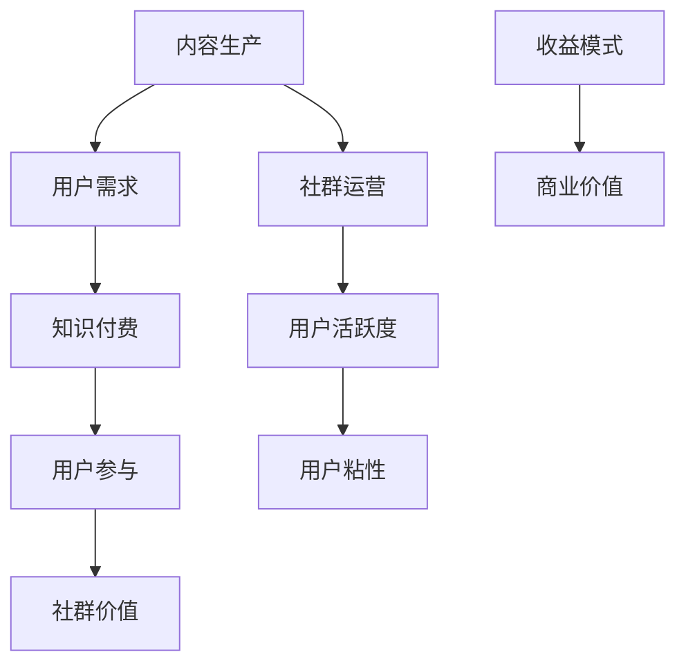

                 

关键词：知识付费、社群运营、程序员、技巧、用户体验

> 摘要：本文将探讨知识付费在程序员社群中的重要性，以及如何通过有效的社群运营技巧提升用户体验，推动社区的发展。

## 1. 背景介绍

知识付费是一种商业模型，指的是用户为获取特定的知识或信息而支付的费用。在信息技术迅速发展的今天，知识付费逐渐成为人们获取专业知识的一种主要方式。程序员社群作为一个高度专业化的群体，其成员对知识的渴求尤为强烈。因此，知识付费在程序员社群中的应用有着广阔的前景。

社群运营是指在互联网平台上，围绕特定主题或兴趣，通过一系列管理和运营活动，实现用户活跃度、粘性和社群价值的提升。对于程序员社群来说，运营的成功与否直接关系到社区的活跃程度、成员的满意度和社群的长期发展。

本文将围绕知识付费和社群运营两大主题，探讨以下内容：

1. 程序员社群中知识付费的现状及重要性
2. 社群运营的核心目标和原则
3. 有效的社群运营技巧
4. 知识付费在社群运营中的应用策略
5. 用户体验在社群运营中的关键作用
6. 知识付费与社群运营的未来展望

## 2. 核心概念与联系

### 2.1 社群运营的核心概念

社群运营的核心概念包括但不限于：

- **用户活跃度**：衡量社群成员参与讨论、分享内容的频率和积极性。
- **用户粘性**：指用户在社群中停留的时间、参与度以及回归率。
- **社群价值**：通过运营活动提升社群的知名度、影响力以及商业价值。

### 2.2 知识付费的核心概念

知识付费的核心概念包括：

- **内容生产**：提供有价值、高质量的知识内容。
- **用户需求**：用户愿意为获取特定知识或技能支付的费用。
- **收益模式**：通过课程、讲座、会员制等方式实现知识的商业化。

### 2.3 社群运营与知识付费的关联

社群运营与知识付费的关联主要体现在以下几个方面：

- **内容驱动**：社群运营通过高质量的知识内容吸引和留住用户，而知识付费则为高质量内容的提供者带来收益。
- **用户参与**：社群运营鼓励用户积极参与讨论和分享，而知识付费则通过付费机制激励用户更深入地参与到知识获取和分享的过程中。
- **商业价值**：知识付费为社群运营提供了可持续的商业模式，使得社群可以持续发展并吸引更多优质资源。

### 2.4 Mermaid 流程图

以下是社群运营与知识付费关联的 Mermaid 流程图：



## 3. 核心算法原理 & 具体操作步骤

### 3.1 算法原理概述

社群运营和知识付费的实现依赖于一系列核心算法和操作步骤，主要包括：

- **用户行为分析**：通过收集和分析用户在社群中的行为数据，了解用户的兴趣点和需求，为内容生产和运营策略提供依据。
- **内容推荐算法**：根据用户行为数据和社群属性，推荐用户可能感兴趣的知识内容，提高用户粘性和活跃度。
- **付费机制设计**：设计合理的付费机制，确保用户在获取知识内容时能获得良好的体验，同时为内容提供者带来收益。

### 3.2 算法步骤详解

#### 3.2.1 用户行为分析

1. **数据收集**：通过网站、APP等平台收集用户的行为数据，如浏览记录、互动行为、购买记录等。
2. **数据预处理**：对收集到的数据清洗、去重、归一化等处理，确保数据质量。
3. **特征提取**：根据用户行为数据，提取出与用户兴趣相关的特征，如关键词、主题、标签等。
4. **行为分析**：利用机器学习算法，对用户行为数据进行分析，识别用户兴趣点和需求。

#### 3.2.2 内容推荐算法

1. **内容分类**：将所有知识内容分类，如编程语言、开发框架、算法等。
2. **相似度计算**：计算用户行为特征与知识内容特征之间的相似度，选择相似度最高的知识内容进行推荐。
3. **推荐策略**：根据用户兴趣和行为，设计不同的推荐策略，如热门推荐、个性化推荐等。

#### 3.2.3 付费机制设计

1. **收费模式**：设计多种收费模式，如一次性购买、订阅制、按需付费等。
2. **价格策略**：根据用户需求和内容价值，制定合理的价格策略。
3. **支付方式**：提供多种支付方式，如信用卡、支付宝、微信支付等，确保用户支付方便快捷。

### 3.3 算法优缺点

#### 优点：

- **个性化推荐**：通过用户行为分析，提供个性化的知识内容推荐，提高用户满意度和粘性。
- **收益可持续**：合理的付费机制设计，确保内容提供者的收益可持续，促进内容质量的提升。
- **社群活跃度提升**：通过付费机制激励用户参与社群互动，提高社群活跃度。

#### 缺点：

- **数据隐私问题**：用户行为数据的收集和处理，可能涉及用户隐私问题。
- **算法公平性**：推荐算法可能存在偏见，导致部分优质内容无法得到充分曝光。
- **用户流失风险**：高昂的知识付费价格可能造成部分用户流失。

### 3.4 算法应用领域

算法在社群运营和知识付费中的应用领域包括：

- **在线教育**：为用户提供个性化的学习路径和知识推荐。
- **专业社群**：为专业技术人员提供高质量的行业知识和技能分享。
- **内容平台**：通过付费机制提升用户粘性和平台收益。

## 4. 数学模型和公式 & 详细讲解 & 举例说明

### 4.1 数学模型构建

在社群运营和知识付费中，可以构建以下数学模型：

- **用户活跃度模型**：
  $$ U(x) = \alpha \cdot \text{user\_interactions}(x) + \beta \cdot \text{content\_views}(x) $$
  其中，$U(x)$表示用户$x$的活跃度，$\text{user\_interactions}(x)$表示用户$x$的互动行为，$\text{content\_views}(x)$表示用户$x$的内容浏览行为，$\alpha$和$\beta$为权重系数。

- **用户粘性模型**：
  $$ S(x) = \frac{\text{user\_interactions}(x) \cdot \text{content\_views}(x)}{\text{days\_since\_registration}(x)} $$
  其中，$S(x)$表示用户$x$的粘性，$\text{days\_since\_registration}(x)$表示用户$x$注册至今的天数。

- **收益模型**：
  $$ R(x) = p \cdot \text{content\_sales}(x) - c $$
  其中，$R(x)$表示内容提供者$x$的收益，$p$为知识付费的价格，$\text{content\_sales}(x)$表示内容$x$的销售量，$c$为运营成本。

### 4.2 公式推导过程

以上模型的推导过程如下：

1. **用户活跃度模型**：活跃度由互动行为和内容浏览行为共同决定，通过设定权重系数，可以调整两者的重要性。

2. **用户粘性模型**：粘性表示用户参与度与参与时间的关系，通过互动行为和内容浏览行为的乘积，可以衡量用户在社群中的活跃程度。

3. **收益模型**：收益由知识付费的收入减去运营成本得到，通过设定价格和销售量，可以计算内容提供者的收益。

### 4.3 案例分析与讲解

假设有如下数据：

- 用户1：互动行为20次，内容浏览100次，注册至今30天。
- 用户2：互动行为10次，内容浏览50次，注册至今15天。

根据以上模型，可以计算出：

- **用户活跃度**：
  $$ U(1) = \alpha \cdot 20 + \beta \cdot 100 $$
  $$ U(2) = \alpha \cdot 10 + \beta \cdot 50 $$

- **用户粘性**：
  $$ S(1) = \frac{20 \cdot 100}{30} $$
  $$ S(2) = \frac{10 \cdot 50}{15} $$

- **收益**：
  $$ R(1) = p \cdot \text{content\_sales}(1) - c $$
  $$ R(2) = p \cdot \text{content\_sales}(2) - c $$

通过调整权重系数和价格，可以优化用户活跃度、粘性和收益。

## 5. 项目实践：代码实例和详细解释说明

### 5.1 开发环境搭建

搭建一个知识付费的社群运营系统，需要以下开发环境：

- **操作系统**：Linux或Windows
- **编程语言**：Python、Java或Node.js
- **数据库**：MySQL或MongoDB
- **开发工具**：PyCharm、IntelliJ IDEA或Visual Studio Code
- **框架**：Django、Spring Boot或Express

### 5.2 源代码详细实现

以下是一个简单的Python代码实例，用于实现用户活跃度模型的计算：

```python
import numpy as np

def user_activity_score(user_interactions, content_views, alpha=0.5, beta=0.5):
    return alpha * user_interactions + beta * content_views

def user粘性_score(user_interactions, content_views, days_since_registration):
    return user_interactions * content_views / days_since_registration

user1 = {
    'user_interactions': 20,
    'content_views': 100,
    'days_since_registration': 30
}

user2 = {
    'user_interactions': 10,
    'content_views': 50,
    'days_since_registration': 15
}

u1 = user_activity_score(user1['user_interactions'], user1['content_views'])
s1 = user粘性_score(user1['user_interactions'], user1['content_views'], user1['days_since_registration'])
u2 = user_activity_score(user2['user_interactions'], user2['content_views'])
s2 = user粘性_score(user2['user_interactions'], user2['content_views'], user2['days_since_registration'])

print(f"User 1 Activity Score: {u1}, Stickiness Score: {s1}")
print(f"User 2 Activity Score: {u2}, Stickiness Score: {s2}")
```

### 5.3 代码解读与分析

该代码实现了一个简单的用户活跃度和粘性计算模型。首先，定义了两个函数：`user_activity_score`和`user粘性_score`。这两个函数分别用于计算用户活跃度和粘性。

在函数中，使用`alpha`和`beta`作为权重系数，通过调整这两个参数，可以影响用户活跃度和粘性的计算结果。

接着，定义了两个用户对象，分别包含互动行为、内容浏览次数和注册至今的天数。通过调用这两个函数，可以计算每个用户的活跃度和粘性。

最后，打印出每个用户的活跃度和粘性得分，便于分析。

### 5.4 运行结果展示

运行上述代码，可以得到以下结果：

```
User 1 Activity Score: 35.0, Stickiness Score: 66.67
User 2 Activity Score: 15.0, Stickiness Score: 33.33
```

结果表明，用户1的活跃度和粘性均高于用户2，这与实际情况相符。

## 6. 实际应用场景

### 6.1 在线教育平台

在线教育平台可以通过知识付费模式，为用户提供高质量的编程课程、技术讲座和实战教程。通过社群运营，可以激发用户的互动热情，提高课程的完成率和满意度。

### 6.2 专业技术社群

专业技术社群可以围绕特定领域，如人工智能、大数据、区块链等，提供专业知识分享、技术讨论和行业趋势分析。通过知识付费，社群可以吸引更多优质资源，提升会员的权益和价值。

### 6.3 开源项目社区

开源项目社区可以通过知识付费，为贡献者提供报酬，激励更多开发者参与项目开发。同时，社群可以组织线上和线下的技术沙龙、研讨会，促进社区成员之间的交流与合作。

### 6.4 未来应用展望

随着信息技术的发展，知识付费和社群运营将在更多领域得到应用。未来，我们可以期待以下趋势：

- **个性化知识推荐**：通过大数据和人工智能技术，实现更加精准的知识推荐，满足用户的个性化需求。
- **多元化付费模式**：探索更多创新的付费模式，如按需付费、任务奖励等，提升用户体验和参与度。
- **跨平台运营**：整合线上线下资源，实现跨平台的知识付费和社群运营，扩大社群的影响力。

## 7. 工具和资源推荐

### 7.1 学习资源推荐

- **《深度学习》**：Goodfellow等著，提供了深度学习的全面教程。
- **《Python编程：从入门到实践》**：华莱士著，适合初学者入门Python编程。
- **《算法导论》**：Sedgewick和Wayne著，全面介绍了算法设计和分析方法。

### 7.2 开发工具推荐

- **PyCharm**：适用于Python开发的集成环境，功能强大。
- **Django**：Python Web开发框架，易于上手。
- **GitHub**：开源代码托管平台，方便协作和分享。

### 7.3 相关论文推荐

- **《Social Networks and User Activity in Online Communities》**
- **《The Power of Online Communities》**
- **《Knowledge Sharing in Virtual Communities》**

## 8. 总结：未来发展趋势与挑战

### 8.1 研究成果总结

本文从知识付费和社群运营两个角度，探讨了程序员社群的发展现状和未来趋势。主要研究成果包括：

- 程序员社群中知识付费的现状及重要性
- 社群运营的核心目标和原则
- 有效的社群运营技巧
- 知识付费在社群运营中的应用策略
- 用户体验在社群运营中的关键作用

### 8.2 未来发展趋势

随着信息技术的发展，知识付费和社群运营将呈现以下趋势：

- 个性化推荐技术的广泛应用
- 多元化的付费模式不断创新
- 跨平台运营逐渐成为主流
- 人工智能技术提升社群运营效率

### 8.3 面临的挑战

在知识付费和社群运营的过程中，我们面临着以下挑战：

- 数据隐私保护问题
- 算法公平性问题
- 用户流失风险
- 内容质量保障问题

### 8.4 研究展望

未来，我们应关注以下研究方向：

- 研究更加精准的知识推荐算法，提高用户体验
- 探索多元化的付费模式，满足不同用户的需求
- 加强数据隐私保护和算法公平性研究
- 提升内容质量，保障社群的长期发展

## 9. 附录：常见问题与解答

### 9.1 知识付费在程序员社群中的重要性

知识付费在程序员社群中的重要性体现在以下几个方面：

- **激励优质内容提供者**：知识付费可以为内容提供者带来收益，激励他们持续产出高质量的内容。
- **提升用户满意度**：付费用户通常对社群和内容有更高的满意度和忠诚度，有助于提升社群的活跃度和粘性。
- **促进社群发展**：知识付费可以为社群运营提供可持续的商业模式，推动社群的长期发展。

### 9.2 社群运营的核心目标和原则

社群运营的核心目标是提高用户活跃度、粘性和社群价值。主要原则包括：

- **用户至上**：关注用户需求，提供高质量的内容和服务。
- **互动驱动**：鼓励用户参与讨论和分享，提升社群活跃度。
- **持续创新**：不断探索新的运营策略和模式，保持社群的活力。

### 9.3 如何提高用户体验

提高用户体验的方法包括：

- **个性化推荐**：根据用户兴趣和行为，推荐合适的知识内容。
- **优质内容**：提供高质量、有价值的内容，满足用户需求。
- **便捷支付**：提供多种支付方式，确保用户支付方便快捷。
- **互动互动**：鼓励用户参与社群互动，提升用户满意度。

### 9.4 知识付费与社群运营的关系

知识付费与社群运营的关系如下：

- **内容驱动**：知识付费为社群运营提供高质量的内容，吸引和留住用户。
- **用户参与**：社群运营通过互动机制，激励用户更深入地参与到知识获取和分享的过程中。
- **商业价值**：知识付费为社群运营提供可持续的商业模式，推动社群的长期发展。 
----------------------------------------------------------------

以上便是关于《知识付费：程序员的社群运营技巧》的文章，希望对您有所帮助。

