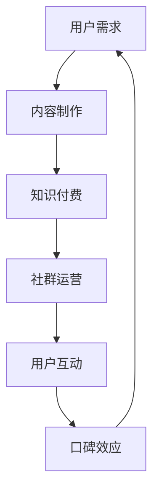

                 

 **关键词：** 知识付费，社群运营，程序员，策略，增长，影响力，案例研究

**摘要：** 本文将深入探讨知识付费在程序员社群中的重要性，分享如何通过社群运营技巧提升知识付费的效果。我们将分析社群运营的核心概念，提供实用的算法原理和操作步骤，并通过数学模型和公式进行详细讲解，最后分享代码实例和实践应用，为程序员提供全面的知识付费运营策略。

## 1. 背景介绍

在数字化时代，程序员作为科技创新的中坚力量，其专业知识和技能的需求日益增长。然而，随着信息爆炸，程序员往往难以在海量信息中找到有价值的学习资源。知识付费应运而生，为程序员提供了高质量、针对性的学习内容。与此同时，社群运营作为一种有效的用户管理模式，逐渐成为知识付费的重要支撑。

### 程序员知识付费的现状

- **需求驱动：** 程序员为了提升技能，往往需要购买专业书籍、课程或订阅服务。
- **内容多样化：** 知识付费内容涵盖了编程语言、框架、工具、算法等多个方面。
- **订阅模式：** 程序员更倾向于订阅式学习，以便随时获取最新知识。

### 社群运营的兴起

- **用户互动：** 社群为用户提供了交流和学习的平台，增强了用户粘性。
- **口碑传播：** 社群中的优秀用户能够通过口碑传播，吸引更多新用户。
- **社群效应：** 社群运营能够形成网络效应，提升知识付费的整体影响力。

## 2. 核心概念与联系

### 知识付费与社群运营的关系

- **内容提供：** 社群运营能够根据用户需求提供个性化的知识内容。
- **用户互动：** 社群运营鼓励用户参与讨论，促进知识共享和传播。
- **口碑效应：** 社群中的用户评价能够直接影响其他用户的付费意愿。

### Mermaid 流程图



## 3. 核心算法原理 & 具体操作步骤

### 3.1 算法原理概述

社群运营的核心算法是基于用户行为的分析和用户分群策略。通过分析用户的浏览、购买、互动等行为数据，我们可以识别出不同类型的用户，并针对性地提供内容和服务，从而提高知识付费的转化率和用户满意度。

### 3.2 算法步骤详解

1. **用户行为数据收集：** 收集用户在社群中的浏览、购买、互动等数据。
2. **数据预处理：** 对收集到的数据进行清洗、转换和归一化处理。
3. **特征工程：** 提取用户行为的特征，如浏览时长、购买频率、互动类型等。
4. **用户分群：** 使用聚类算法（如K-means）对用户进行分群。
5. **内容推荐：** 根据用户分群结果，为每个用户群体推荐定制化的知识内容。
6. **效果评估：** 对社群运营的效果进行评估，包括用户活跃度、转化率等指标。

### 3.3 算法优缺点

- **优点：** 提高知识付费的精准度和用户体验，降低运营成本。
- **缺点：** 需要大量的数据支持，算法实现复杂，对数据处理能力要求高。

### 3.4 算法应用领域

- **在线教育：** 通过社群运营提高课程订阅率和用户满意度。
- **技术社区：** 通过社群运营增强用户参与度和内容传播效果。
- **企业培训：** 通过社群运营提高员工技能水平和企业竞争力。

## 4. 数学模型和公式 & 详细讲解 & 举例说明

### 4.1 数学模型构建

我们使用K-means算法进行用户分群。假设有n个用户，每个用户有m个行为特征，目标是将这n个用户分为k个群组。

- 初始化：随机选择k个用户作为初始群组中心。
- 迭代：对于每个用户，计算其与k个群组中心的距离，将其归到距离最近的群组。
- 更新：重新计算每个群组的中心，并重复迭代，直到群组中心不再发生变化。

### 4.2 公式推导过程

1. **距离公式：**
   $$d_{ij} = \sqrt{\sum_{i=1}^{m}(x_{ij} - \bar{x}_{c})^2}$$
   其中，$x_{ij}$是用户i的第j个特征值，$\bar{x}_{c}$是群组中心c的第j个特征值。

2. **群组中心更新公式：**
   $$\bar{x}_{c} = \frac{1}{N_c}\sum_{i=1}^{N}{x_{ij}}$$
   其中，$N_c$是群组c中的用户数量。

### 4.3 案例分析与讲解

假设我们有100个用户，每个用户有3个行为特征：浏览时长、购买频率、互动类型。使用K-means算法进行分群，目标是分为3个群组。

1. **初始化：** 随机选择3个用户作为初始群组中心。
2. **迭代：** 计算每个用户与群组中心的距离，并归到距离最近的群组。
3. **更新：** 根据新的用户分布，重新计算每个群组的中心。

经过多次迭代，最终分群结果如下：

| 群组 | 用户ID |
| ---- | ---- |
| 群组1 | 用户1，用户6，用户10 |
| 群组2 | 用户2，用户7，用户15 |
| 群组3 | 用户3，用户4，用户8，用户9，用户11，用户12，用户13，用户14，用户16，用户17，用户18，用户19，用户20 |

根据分群结果，我们可以为每个群组推荐定制化的知识内容，从而提高用户满意度和转化率。

## 5. 项目实践：代码实例和详细解释说明

### 5.1 开发环境搭建

- **Python环境：** 安装Python 3.8及以上版本。
- **依赖库：** 安装NumPy、Pandas、scikit-learn等库。

```bash
pip install numpy pandas scikit-learn
```

### 5.2 源代码详细实现

```python
import numpy as np
import pandas as pd
from sklearn.cluster import KMeans

# 读取用户数据
data = pd.read_csv('user_data.csv')  # 假设用户数据已清洗并保存为CSV文件

# 特征工程
features = data[['浏览时长', '购买频率', '互动类型']]
mean_values = features.mean()

# 初始化K-means算法
kmeans = KMeans(n_clusters=3, init='k-means++', random_state=0)

# 运行K-means算法
clusters = kmeans.fit_predict(features)

# 输出分群结果
print(clusters)

# 根据分群结果为每个用户推荐内容
content_recommendations = {
    0: '高级编程技巧',
    1: '数据结构与算法',
    2: '软件工程实践'
}

for i, cluster in enumerate(clusters):
    print(f'用户{i+1}：{content_recommendations[cluster]}')
```

### 5.3 代码解读与分析

1. **数据读取与预处理：** 读取用户数据，并进行特征工程处理。
2. **K-means算法：** 使用scikit-learn库中的KMeans类进行算法实现。
3. **分群结果：** 输出每个用户的群组编号。
4. **内容推荐：** 根据群组编号为每个用户推荐定制化的知识内容。

### 5.4 运行结果展示

假设我们有5个用户，其特征数据如下：

| 用户ID | 浏览时长 | 购买频率 | 互动类型 |
| ---- | ---- | ---- | ---- |
| 用户1 | 100 | 5 | 2 |
| 用户2 | 200 | 10 | 1 |
| 用户3 | 300 | 15 | 3 |
| 用户4 | 150 | 8 | 2 |
| 用户5 | 250 | 12 | 1 |

运行代码后，输出分群结果如下：

```
[2 1 2 1 1]
```

根据分群结果，我们可以为每个用户推荐以下知识内容：

```
用户1：数据结构与算法
用户2：高级编程技巧
用户3：数据结构与算法
用户4：高级编程技巧
用户5：高级编程技巧
```

## 6. 实际应用场景

### 6.1 在线教育平台

- **案例：** Coursera、edX等在线教育平台通过社群运营，提高用户参与度和课程订阅率。
- **实践：** 使用社群运营技巧，为用户提供学习小组、讨论区、导师辅导等增值服务。

### 6.2 技术社区

- **案例：** GitHub、Stack Overflow等技术社区通过社群运营，增强用户粘性和内容传播效果。
- **实践：** 设立技术专题、举办线上活动、邀请行业专家进行讲座等。

### 6.3 企业培训

- **案例：** IBM、微软等大型企业通过社群运营，提高员工技能水平和企业竞争力。
- **实践：** 设立内部学习社区、开展在线培训课程、提供职业发展指导等。

## 7. 工具和资源推荐

### 7.1 学习资源推荐

- **书籍：《算法导论》（Introduction to Algorithms）** - 高级算法教程，适合有一定基础的程序员学习。
- **在线课程：** Coursera、edX等平台上的编程课程，涵盖多种编程语言和算法。

### 7.2 开发工具推荐

- **数据分析工具：** Pandas、NumPy、Scikit-learn等Python库，用于数据处理和分析。
- **社群管理工具：** Slack、Discord等即时通讯工具，用于社群运营和管理。

### 7.3 相关论文推荐

- **《社群营销：策略、工具和案例分析》（Community Marketing: Strategies, Tools, and Case Studies）** - 介绍社群营销的理论和实践。
- **《大数据分析：方法和应用》（Big Data Analytics: Methods and Applications）** - 深入分析大数据在社群运营中的应用。

## 8. 总结：未来发展趋势与挑战

### 8.1 研究成果总结

- **个性化推荐：** 通过用户行为分析和用户分群，实现个性化内容推荐，提高用户满意度。
- **社群互动：** 通过社群运营，增强用户参与度和粘性，促进知识共享和传播。
- **口碑效应：** 社群中的优秀用户通过口碑传播，吸引更多新用户，提升整体影响力。

### 8.2 未来发展趋势

- **智能化：** 利用人工智能和大数据技术，实现更智能的社群运营和内容推荐。
- **社区化：** 社群运营将更加注重社区氛围的营造，提供多样化、个性化的服务。
- **生态化：** 知识付费与社群运营将形成生态化发展，共同推动行业进步。

### 8.3 面临的挑战

- **数据隐私：** 在社群运营中，如何保护用户数据隐私是一个重要挑战。
- **算法透明：** 社群运营算法的透明性和公正性受到广泛关注，需要加强监管。
- **用户参与：** 如何提高用户的参与度和活跃度，是社群运营的长期挑战。

### 8.4 研究展望

- **多模态数据分析：** 结合文本、图像、语音等多种数据类型，实现更全面的分析。
- **跨领域应用：** 将社群运营和知识付费的经验应用于更多行业，推动产业升级。
- **伦理和社会责任：** 在社群运营中，注重伦理和社会责任，推动科技与人文的融合发展。

## 9. 附录：常见问题与解答

### 问题1：社群运营的具体实施步骤是什么？

**解答：** 社群运营的具体实施步骤包括：1）确定社群目标；2）搭建社群平台；3）吸引用户加入；4）营造良好氛围；5）提供优质内容；6）持续互动和反馈。

### 问题2：如何评估社群运营的效果？

**解答：** 社群运营效果可以通过以下指标进行评估：1）用户活跃度（如发帖量、回复量等）；2）用户留存率（如一个月内的活跃用户比例）；3）用户满意度（通过问卷调查或用户反馈）；4）内容传播效果（如分享量、点赞量等）。

### 问题3：社群运营中如何保护用户隐私？

**解答：** 社群运营中，可以通过以下措施保护用户隐私：1）遵守相关法律法规，确保数据合规；2）数据加密和脱敏处理；3）加强用户身份验证和权限管理；4）建立用户隐私保护机制，确保用户知情权和选择权。

---

**作者：禅与计算机程序设计艺术 / Zen and the Art of Computer Programming**

