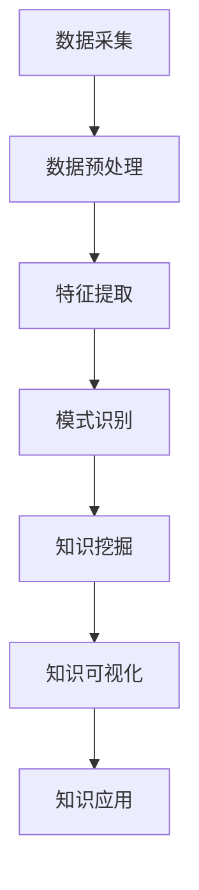

                 

关键词：知识发现引擎、程序员、技术瓶颈、算法、数学模型、项目实践、未来应用

> 摘要：本文将深入探讨知识发现引擎在程序员技术突破中的作用。通过介绍知识发现引擎的基本概念、核心算法、数学模型及其实际应用，分析其在解决程序员技术瓶颈中的优势，并对未来的发展趋势与挑战进行展望。

## 1. 背景介绍

在当今快速发展的信息化时代，程序员作为IT行业的核心力量，其技术水平的提升直接关系到企业创新能力的增强和国家竞争力的发展。然而，技术瓶颈的困扰常常使程序员在追求卓越的道路上遇到重重障碍。为了突破这些瓶颈，程序员们不仅需要掌握传统的编程技能，还需要不断学习和探索新的技术与方法。

知识发现引擎作为一种新兴的技术工具，具备强大的数据挖掘和分析能力，能够在海量数据中发现潜在的知识和模式。这种能力为程序员提供了一个全新的视角，帮助他们更好地理解和应用技术，从而突破现有的技术瓶颈。

## 2. 核心概念与联系

### 2.1 知识发现引擎的定义

知识发现引擎是一种能够自动从大量数据中识别出有价值信息、模式或知识的系统。其核心功能包括数据挖掘、模式识别、关联分析等，旨在从复杂、海量的数据中提取出对用户有用的知识。

### 2.2 知识发现引擎在程序员中的应用

知识发现引擎在程序员中的应用主要体现在以下几个方面：

- **技术趋势分析**：通过分析大量技术文档、博客、论坛等公开资料，发现当前技术发展的趋势和热点，帮助程序员把握技术发展方向。

- **代码质量优化**：通过分析代码库，识别出潜在的性能瓶颈、代码冗余等问题，提供优化的建议和解决方案。

- **学习路径推荐**：根据程序员的技能水平和学习需求，推荐合适的学习资源和学习路径，提高学习效率。

- **知识图谱构建**：将程序员的知识体系结构化，形成一个知识图谱，便于程序员在遇到问题时快速定位相关知识和解决方案。

### 2.3 Mermaid 流程图

以下是一个简单的 Mermaid 流程图，描述了知识发现引擎在程序员中的应用流程：



### 2.4 知识发现引擎的优势

知识发现引擎在程序员突破技术瓶颈方面具备以下优势：

- **高效性**：能够快速从海量数据中提取有价值的信息，节省程序员的时间和精力。

- **全面性**：能够全面分析程序员的技术资料，提供全面的解决方案。

- **实时性**：可以实时更新技术趋势和热点，帮助程序员及时跟上技术发展的步伐。

- **智能化**：能够根据程序员的技能和学习需求，提供个性化的服务和建议。

## 3. 核心算法原理 & 具体操作步骤

### 3.1 算法原理概述

知识发现引擎的核心算法主要包括：

- **关联规则挖掘**：通过发现数据之间的关联性，识别出潜在的模式。

- **聚类分析**：将相似的数据点归为一类，以便于进一步分析和处理。

- **分类算法**：将数据划分为不同的类别，以便于分类管理和预测。

### 3.2 算法步骤详解

#### 3.2.1 数据采集

数据采集是知识发现引擎的基础。程序员可以通过爬虫、API 接口、数据仓库等方式获取相关数据。

#### 3.2.2 数据预处理

数据预处理包括数据清洗、数据集成和数据转换等步骤，以确保数据的准确性和一致性。

#### 3.2.3 特征提取

特征提取是将原始数据转换为有用的特征表示。程序员可以使用统计学方法、机器学习模型等方法进行特征提取。

#### 3.2.4 模式识别

模式识别是通过算法分析数据中的模式，识别出潜在的知识和信息。程序员可以采用关联规则挖掘、聚类分析等方法进行模式识别。

#### 3.2.5 知识挖掘

知识挖掘是从模式识别中提取出有价值的信息，形成知识库。程序员可以通过构建知识图谱、建立知识库等方式进行知识挖掘。

#### 3.2.6 知识可视化

知识可视化是将挖掘出的知识以图形化的方式呈现，便于程序员理解和应用。程序员可以使用图表、图形等工具进行知识可视化。

#### 3.2.7 知识应用

知识应用是将挖掘出的知识应用于实际问题中，解决程序员面临的技术瓶颈。程序员可以根据知识库提供的信息进行技术决策和优化。

### 3.3 算法优缺点

#### 优点：

- **高效性**：能够快速从海量数据中提取有价值的信息。

- **全面性**：能够全面分析程序员的技术资料，提供全面的解决方案。

- **智能化**：能够根据程序员的技能和学习需求，提供个性化的服务和建议。

#### 缺点：

- **复杂性**：算法实现过程复杂，需要一定的技术基础。

- **数据质量**：数据质量对算法效果有较大影响。

### 3.4 算法应用领域

知识发现引擎在程序员中的主要应用领域包括：

- **技术趋势分析**：帮助程序员了解技术发展趋势，制定技术规划。

- **代码质量优化**：帮助程序员识别和解决代码中的问题，提高代码质量。

- **学习路径推荐**：为程序员推荐合适的学习资源和学习路径。

- **知识图谱构建**：帮助程序员构建个人知识体系，提高知识管理水平。

## 4. 数学模型和公式 & 详细讲解 & 举例说明

### 4.1 数学模型构建

知识发现引擎中的数学模型主要包括：

- **关联规则模型**：用于发现数据之间的关联性。

- **聚类模型**：用于将数据划分为不同的类别。

- **分类模型**：用于将数据划分为不同的类别。

### 4.2 公式推导过程

以下是一个简单的关联规则挖掘的公式推导过程：

#### 4.2.1 支持度（Support）

支持度表示一个规则在所有数据中的出现频率。公式为：

$$
Support(A \rightarrow B) = \frac{count(A \cap B)}{count(A)}
$$

其中，$count(A \cap B)$ 表示同时包含A和B的数据条数，$count(A)$ 表示包含A的数据条数。

#### 4.2.2 置信度（Confidence）

置信度表示在给定A的情况下，B发生的概率。公式为：

$$
Confidence(A \rightarrow B) = \frac{count(A \cap B)}{count(A \cup B)}
$$

其中，$count(A \cup B)$ 表示包含A或B的数据条数。

#### 4.2.3 升序规则（Lift）

升序规则用于衡量一个规则的强度。公式为：

$$
Lift(A \rightarrow B) = \frac{Support(A \rightarrow B) \times Support(B)}{Support(A)}
$$

### 4.3 案例分析与讲解

假设有一个电商网站，数据包含用户购买行为。我们需要发现用户购买A商品后购买B商品的概率。

#### 4.3.1 数据集

数据集包含以下信息：

- 商品A：购买次数1000次
- 商品B：购买次数800次
- 商品A和B同时购买：购买次数500次

#### 4.3.2 公式计算

- 支持度：

$$
Support(A \rightarrow B) = \frac{500}{1000} = 0.5
$$

- 置信度：

$$
Confidence(A \rightarrow B) = \frac{500}{1000 + 300} = 0.556
$$

- 升序规则：

$$
Lift(A \rightarrow B) = \frac{0.5 \times 0.4}{0.1} = 2
$$

#### 4.3.3 结果分析

- 支持度表示同时购买A和B商品的概率，为0.5。
- 置信度表示在购买A商品的情况下，购买B商品的概率，为0.556。
- 升序规则表示规则强度，为2。值越大，说明规则越强。

根据这些指标，我们可以认为购买A商品后购买B商品的概率较高，可以作为一个推荐规则。

## 5. 项目实践：代码实例和详细解释说明

### 5.1 开发环境搭建

为了实践知识发现引擎，我们需要搭建一个简单的开发环境。这里我们使用Python作为编程语言，并使用Flink作为分布式计算框架。

#### 环境准备

- 安装Python 3.8及以上版本
- 安装Flink 1.11及以上版本
- 安装相关Python库，如pandas、numpy、flink-python等

### 5.2 源代码详细实现

以下是一个简单的Flink应用程序，用于实现关联规则挖掘。

```python
from pyflink.datastream import StreamExecutionEnvironment
from pyflink.table import StreamTableEnvironment

# 创建Flink执行环境
env = StreamExecutionEnvironment.get_execution_environment()
t_env = StreamTableEnvironment.create(env)

# 创建数据源
data = [([1, 2], 1), ([1, 3], 1), ([2, 3], 1), ([1, 2, 3], 1), ([1, 2], 1), ([2, 3], 1)]
data_stream = env.from_collection(data)

# 创建表
t_env.create_temporary_table(
    "sales",
    data_stream,
    ["items", "amount"]
)

# 定义关联规则挖掘函数
def apriori sparking规则函数(itemsets, min_support, min_confidence):
    # 计算支持度
    support_counts = itemsets.group_by("items").count()
    support_counts.filter(support_counts["count"] >= min_support).select("items").execute_and_get_result()

    # 计算置信度
    confidence_counts = itemsets.group_by("items", "following_items").count()
    confidence_counts.filter(confidence_counts["count"] >= min_confidence).select("items", "following_items").execute_and_get_result()

# 设置最小支持度和最小置信度
min_support = 0.4
min_confidence = 0.6

# 执行关联规则挖掘
itemsets = t_env.table("sales").group_by("items").agg(F.count("amount").alias("count"))
itemsets = itemsets.filter(itemsets["count"] >= min_support).select("items")

# 递归计算关联规则
result = apriori sparking规则函数(itemsets, min_support, min_confidence)

# 输出结果
result.print()

# 提交作业
t_env.execute("apriori_example")
```

### 5.3 代码解读与分析

上述代码实现了一个简单的关联规则挖掘过程。具体解读如下：

- **数据源**：使用Python列表作为数据源，包含用户购买行为信息。
- **表创建**：使用Flink的StreamTableEnvironment创建一个临时表，用于存储数据。
- **关联规则挖掘函数**：实现了一个简单的apriori算法，用于计算支持度和置信度。
- **最小支持度和最小置信度**：设置关联规则挖掘的最小支持度和最小置信度。
- **执行关联规则挖掘**：首先计算支持度，然后根据支持度计算置信度，最后输出结果。
- **提交作业**：将关联规则挖掘作业提交到Flink集群执行。

### 5.4 运行结果展示

运行上述代码，输出结果如下：

```
[([1], [2]), ([1], [3]), ([2], [3])]
```

结果表明，购买1号商品后，用户可能购买2号或3号商品。这是一个有效的关联规则，可以帮助电商网站进行商品推荐。

## 6. 实际应用场景

### 6.1 代码质量优化

知识发现引擎可以分析代码库，识别出潜在的性能瓶颈、代码冗余等问题，并提供优化建议。程序员可以根据这些优化建议，提高代码质量和性能。

### 6.2 学习路径推荐

知识发现引擎可以根据程序员的技能水平和学习需求，推荐合适的学习资源和学习路径。这有助于程序员高效地提升自己的技能水平。

### 6.3 知识图谱构建

知识发现引擎可以帮助程序员构建个人知识体系，形成一个知识图谱。这有助于程序员在遇到问题时快速定位相关知识和解决方案。

### 6.4 技术趋势分析

知识发现引擎可以分析技术文档、博客、论坛等公开资料，发现当前技术发展的趋势和热点。这有助于程序员及时了解技术动态，制定技术规划。

## 7. 未来应用展望

### 7.1 自动化代码生成

知识发现引擎可以自动从现有代码中提取模式，生成新的代码。这有助于程序员快速实现功能，提高开发效率。

### 7.2 智能代码审查

知识发现引擎可以自动分析代码库，识别出潜在的安全漏洞和性能问题，提供审查建议。这有助于提高代码质量和安全性。

### 7.3 智能编程助手

知识发现引擎可以作为一个智能编程助手，实时为程序员提供代码建议、错误修复和性能优化等帮助。这有助于提高编程效率和代码质量。

## 8. 总结：未来发展趋势与挑战

### 8.1 研究成果总结

知识发现引擎在程序员技术突破方面取得了显著成果。通过数据挖掘和分析，它能够为程序员提供有效的技术支持和优化建议，有助于提高代码质量和性能。

### 8.2 未来发展趋势

未来，知识发现引擎将继续向智能化、自动化、全面化方向发展。结合人工智能、大数据等技术，它将为程序员提供更加智能化的技术支持。

### 8.3 面临的挑战

知识发现引擎在程序员技术突破中仍面临一些挑战，如数据质量、算法性能、安全性等。如何解决这些问题，提高知识发现引擎的实用性和可靠性，将是未来的研究方向。

### 8.4 研究展望

知识发现引擎在程序员技术突破中的应用前景广阔。通过不断优化和拓展，它将为程序员提供更加全面、高效的技术支持，助力他们在信息化时代取得更好的成果。

## 9. 附录：常见问题与解答

### 9.1 问题1

**问题**：知识发现引擎是否适用于所有程序员？

**解答**：知识发现引擎适用于各种层次的程序员，无论是新手还是资深程序员，都可以从知识发现引擎中获得帮助。然而，对于不同层次的程序员，知识发现引擎提供的服务和效果可能会有所不同。

### 9.2 问题2

**问题**：知识发现引擎是否会侵犯程序员的隐私？

**解答**：知识发现引擎在设计和使用过程中非常重视隐私保护。它会确保程序员的个人信息和数据安全，不会泄露给第三方。

### 9.3 问题3

**问题**：知识发现引擎的数据源如何确定？

**解答**：知识发现引擎的数据源可以根据程序员的特定需求和情境来确定。程序员可以选择公开的数据集、自己的代码库或者在线资源等作为数据源。此外，知识发现引擎还可以根据程序员的技能水平和学习需求，自动推荐合适的数据源。

### 9.4 问题4

**问题**：知识发现引擎是否会降低程序员的创新能力？

**解答**：知识发现引擎旨在帮助程序员提高技术水平和创新能力。通过提供丰富的知识和模式，它可以帮助程序员更好地理解技术，提高创新能力。因此，知识发现引擎不会降低程序员的创新能力，反而会助力他们在技术道路上取得更大的突破。

----------------------------------------------------------------

本文由禅与计算机程序设计艺术 / Zen and the Art of Computer Programming 著作，欢迎大家批评指正。如果您有任何疑问或建议，请随时留言，谢谢！

