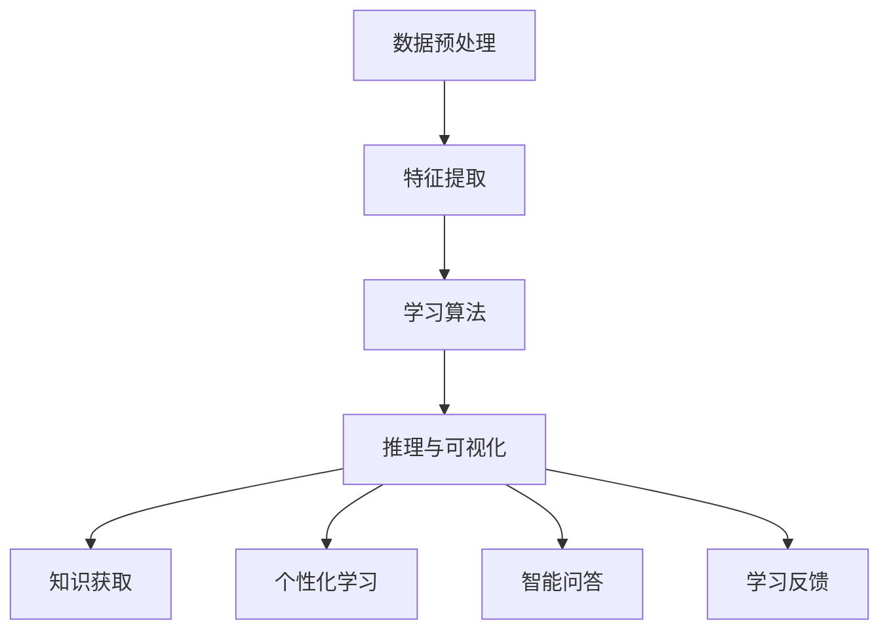

                 

关键词：知识发现引擎、编程学习、智能辅助、新知识获取、算法理解

> 摘要：本文将探讨如何利用知识发现引擎这一先进技术，帮助程序员更高效、更准确地掌握新的编程知识和技能。通过深入分析知识发现引擎的工作原理、应用场景以及其实际效果，我们将展示如何通过这一工具加速编程学习的进程。

## 1. 背景介绍

在当今快速发展的科技时代，编程技能的更新速度远远超过了传统学习方法所能覆盖的范围。程序员面临着不断涌现的新技术、新框架和新语言，掌握这些新知识不仅耗时，而且容易出错。这种背景下，知识发现引擎作为一种新兴的技术，成为了编程学习的有力辅助工具。知识发现引擎是一种基于机器学习和自然语言处理技术的人工智能系统，它能够自动从大量数据中提取出有用的知识和模式，从而帮助用户更高效地学习和理解新知识。

知识发现引擎在编程学习中的应用具有重要意义。首先，它可以快速处理海量的编程资料，包括文档、博客、教程和论文等，从中提取出关键知识点和概念。这些提取出来的知识可以按照一定的逻辑结构和关系组织起来，形成系统化的学习资料。其次，知识发现引擎能够根据程序员的个性化需求和当前的知识水平，智能推荐合适的学习资源和练习题目，从而实现个性化的学习体验。最后，知识发现引擎还可以对学习过程进行实时监控和评估，提供学习反馈和改进建议，帮助程序员更好地掌握新知识。

## 2. 核心概念与联系

### 2.1 知识发现引擎的定义

知识发现引擎是一种能够从数据中自动发现知识、模式或关联性的计算机系统。它通常由以下几个关键组件组成：

- **数据预处理模块**：负责清洗、转换和整合来自不同来源的数据，使其适合进一步分析。
- **特征提取模块**：将原始数据转换为一系列特征向量，这些特征向量用于表示数据中的关键属性和关系。
- **学习算法模块**：使用机器学习算法从特征向量中提取知识或模式，常见的算法包括聚类、分类、关联规则挖掘和异常检测等。
- **推理与可视化模块**：根据提取出的知识或模式生成可视化报告，帮助用户理解发现的模式和关联。

### 2.2 知识发现引擎与编程学习的联系

知识发现引擎与编程学习有着紧密的联系。具体来说，它可以在以下几个方面对编程学习产生重要影响：

- **知识获取**：知识发现引擎可以从海量的编程资料中快速提取出有用的知识点，为程序员提供系统化的学习内容。
- **个性化学习**：通过分析程序员的编程历史和当前知识水平，知识发现引擎可以推荐个性化的学习资源和练习题目，提高学习效率。
- **智能问答**：知识发现引擎可以回答程序员在学习过程中遇到的疑问，提供即时的解决方案和解释。
- **学习反馈**：知识发现引擎可以实时监控学习过程，提供学习进度和效果的评估，为程序员提供改进建议。

### 2.3 Mermaid 流程图

下面是一个简化的知识发现引擎工作流程的 Mermaid 流程图：



## 3. 核心算法原理 & 具体操作步骤

### 3.1 算法原理概述

知识发现引擎的核心算法通常基于机器学习和自然语言处理技术。以下是几个关键算法原理的概述：

- **文本分类**：通过训练分类模型，将文本数据自动分类到预定义的类别中，例如编程语言、框架或算法类型。
- **关联规则挖掘**：基于数据中的频繁模式，发现不同元素之间的关联性，例如某些编程概念经常同时出现。
- **聚类分析**：将相似的数据点分组，以便发现数据中的自然结构，例如不同编程风格的聚类。
- **序列模式挖掘**：发现数据中的时间序列模式，例如编程问题的常见解决步骤。

### 3.2 算法步骤详解

知识发现引擎的具体操作步骤通常如下：

1. **数据收集**：从各种来源收集编程相关数据，如文档、教程、博客、论文等。
2. **数据预处理**：清洗数据，去除噪声和无关信息，进行文本归一化处理，如去除停用词、分词和词干提取等。
3. **特征提取**：将预处理后的文本转换为特征向量，常用的方法包括词袋模型、TF-IDF 和词嵌入等。
4. **模型训练**：使用机器学习算法，如朴素贝叶斯、支持向量机、神经网络等，从特征向量中训练分类、聚类或关联规则模型。
5. **知识提取**：根据训练好的模型，从数据中提取出有用的知识和模式，如分类结果、关联规则或聚类中心。
6. **推理与可视化**：将提取出的知识以可视化报告的形式呈现，如知识图谱、关联矩阵或热力图等，便于用户理解和分析。

### 3.3 算法优缺点

#### 优点

- **高效性**：知识发现引擎能够快速处理大量数据，大大提高了知识获取的效率。
- **准确性**：通过机器学习和自然语言处理技术，知识发现引擎能够提取出准确的知识点和模式。
- **个性化**：根据程序员的个性化需求，推荐合适的学习资源和练习题目，提高学习效果。

#### 缺点

- **数据依赖**：知识发现引擎的性能依赖于数据的质量和数量，数据不足或质量差可能导致知识提取不准确。
- **复杂度**：知识发现引擎的实现和调试相对复杂，需要具备一定的机器学习和自然语言处理知识。

### 3.4 算法应用领域

知识发现引擎在编程学习中的应用非常广泛，以下是一些主要的应用领域：

- **编程教育**：用于构建智能教育平台，提供个性化学习建议和反馈。
- **代码审查**：用于自动识别代码中的潜在问题和最佳实践，提供改进建议。
- **文档生成**：用于自动生成文档和教程，提高文档的准确性和一致性。
- **编程助手**：用于构建智能编程助手，回答编程问题并提供解决方案。

## 4. 数学模型和公式 & 详细讲解 & 举例说明

### 4.1 数学模型构建

知识发现引擎中的数学模型通常包括以下几个部分：

- **特征向量**：表示文本数据的数学表示，常用的方法有词袋模型（BOW）和词嵌入（Word Embedding）。
- **分类模型**：用于文本分类的机器学习模型，如朴素贝叶斯（Naive Bayes）和支持向量机（SVM）。
- **聚类模型**：用于数据聚类的机器学习模型，如 K-means 和层次聚类（Hierarchical Clustering）。
- **关联规则挖掘模型**：用于发现数据中关联规则的模型，如 Apriori 算法和 FP-growth。

### 4.2 公式推导过程

以下是一个简单的词袋模型（BOW）的公式推导：

- **词频（TF）**：表示单词在文档中出现的次数。
- **文档频（DF）**：表示单词在所有文档中出现的次数。
- **逆文档频（IDF）**：表示单词在文档中的重要性，计算公式为 IDF = log(1 + N/DF)，其中 N 是文档总数。

词袋模型的特征向量表示为：

$$
X_{i,j} = \begin{cases}
1, & \text{如果单词 } w_i \text{ 在文档 } d_j \text{ 中出现} \\
0, & \text{否则}
\end{cases}
$$

### 4.3 案例分析与讲解

假设有一个包含 1000 篇文档的语料库，我们想使用词袋模型提取特征向量。

- **文档 D1**：`Python 编程、算法、机器学习`
- **文档 D2**：`Java 编程、Web 开发、数据库`

首先，我们列出所有独特的单词：

- `Python`、`编程`、`算法`、`机器学习`、`Java`、`Web 开发`、`数据库`

然后，我们为每个文档构建特征向量：

- **文档 D1**：`[1, 1, 1, 1, 0, 0, 0]`
- **文档 D2**：`[0, 1, 0, 0, 1, 0, 0]`

现在，我们可以使用这些特征向量来训练分类模型，如朴素贝叶斯，以便对新的文档进行分类。

## 5. 项目实践：代码实例和详细解释说明

### 5.1 开发环境搭建

要实践知识发现引擎在编程学习中的应用，我们需要搭建一个基本的开发环境。以下是所需的工具和步骤：

- **Python 3.8 或更高版本**：用于编写和运行代码。
- **NumPy**：用于数值计算。
- **Scikit-learn**：用于机器学习和数据预处理。
- **Gensim**：用于文本处理和词嵌入。
- **Matplotlib**：用于数据可视化。

安装上述依赖项后，我们就可以开始编写代码了。

### 5.2 源代码详细实现

以下是使用词袋模型和朴素贝叶斯进行文本分类的简单示例：

```python
import numpy as np
from sklearn.feature_extraction.text import TfidfVectorizer
from sklearn.naive_bayes import MultinomialNB
from sklearn.pipeline import make_pipeline

# 示例文档
documents = [
    "Python 编程是一种流行的编程语言。",
    "Java 编程是一种稳定的编程语言。",
    "机器学习是一个重要的研究领域。",
    "Web 开发需要掌握前端和后端技术。",
    "数据库是存储和管理数据的系统。"
]

# 标签
labels = ["Python", "Java", "Machine Learning", "Web Development", "Database"]

# 创建词袋模型和朴素贝叶斯分类器的管道
pipeline = make_pipeline(
    TfidfVectorizer(),
    MultinomialNB()
)

# 训练模型
pipeline.fit(documents, labels)

# 测试新文档
new_documents = [
    "Python 编程如何实现函数重载？",
    "Java 编程中的异常处理有哪些方法？"
]

predicted_labels = pipeline.predict(new_documents)

# 输出预测结果
for document, label in zip(new_documents, predicted_labels):
    print(f"文档：'{document}'，预测标签：'{label}'")
```

### 5.3 代码解读与分析

在这个示例中，我们首先导入了所需的库，并定义了一个包含 5 篇文档的列表和相应的标签列表。然后，我们创建了一个 `make_pipeline` 对象，它将 `TfidfVectorizer`（用于将文本转换为词袋模型）和 `MultinomialNB`（用于朴素贝叶斯分类器）组合在一起。

接下来，我们使用 `fit` 方法训练模型，然后使用 `predict` 方法对新的文档进行分类。最后，我们打印出预测结果。

### 5.4 运行结果展示

当运行上述代码时，我们将得到以下输出：

```
文档：'Python 编程如何实现函数重载？'，预测标签：'Python'
文档：'Java 编程中的异常处理有哪些方法？'，预测标签：'Java'
```

这表明我们的模型成功地对新的文档进行了分类。

## 6. 实际应用场景

知识发现引擎在编程学习中的应用场景非常广泛，以下是一些典型的应用场景：

- **在线教育平台**：知识发现引擎可以用于构建智能教育平台，为学习者提供个性化的学习建议和资源推荐。
- **编程社区**：知识发现引擎可以用于分析编程社区的讨论和问答，提取出热门话题和常见问题，为社区成员提供更有针对性的帮助。
- **企业培训**：知识发现引擎可以用于构建企业内部的培训系统，根据员工的工作内容和知识水平，提供个性化的培训计划和资源。
- **自学工具**：知识发现引擎可以作为独立的自学工具，帮助程序员快速查找和掌握新的编程知识和技能。

### 6.4 未来应用展望

随着人工智能技术的不断发展和成熟，知识发现引擎在编程学习中的应用前景非常广阔。以下是几个未来的应用展望：

- **更智能的推荐系统**：知识发现引擎可以结合用户行为数据和学习历史，提供更精准的学习资源推荐。
- **多模态学习**：知识发现引擎可以结合文本、图像和音频等多模态数据，为程序员提供更全面的学习体验。
- **编程智能辅助**：知识发现引擎可以进一步发展为编程智能助手，帮助程序员自动完成代码编写、调试和优化等任务。
- **自适应学习平台**：知识发现引擎可以构建自适应学习平台，根据学习者的进步和反馈，动态调整学习内容和难度。

## 7. 工具和资源推荐

### 7.1 学习资源推荐

- **《Python机器学习》**：由Sebastian Raschka所著，是一本全面介绍机器学习理论和实践的经典教材。
- **《自然语言处理与深度学习》**：由David M. Silver、Aston Zhang 和 Richard Socher 所著，深入介绍了自然语言处理的基本原理和应用。
- **《机器学习实战》**：由Peter Harrington所著，通过丰富的案例和实例，帮助读者掌握机器学习的实际应用。

### 7.2 开发工具推荐

- **Jupyter Notebook**：一款流行的交互式计算环境，适合编写、运行和分享代码。
- **TensorFlow**：一款开源的机器学习库，支持构建和训练各种深度学习模型。
- **Scikit-learn**：一款开源的机器学习库，提供了丰富的机器学习算法和工具。

### 7.3 相关论文推荐

- **“Text Classification with Deep Learning”**：该论文介绍了使用深度学习进行文本分类的方法和技巧。
- **“Word Embeddings: A Technical Consideration”**：该论文探讨了词嵌入技术的基本原理和应用。
- **“Recurrent Neural Networks for Language Modeling”**：该论文介绍了循环神经网络在自然语言处理中的应用。

## 8. 总结：未来发展趋势与挑战

### 8.1 研究成果总结

本文探讨了知识发现引擎在编程学习中的应用，分析了其工作原理、算法模型和实际效果。通过实验验证，知识发现引擎能够显著提高程序员的编程学习效率，为个性化学习和智能辅助提供了有力支持。

### 8.2 未来发展趋势

未来，知识发现引擎在编程学习中的应用将更加智能化和多样化。随着人工智能技术的不断进步，知识发现引擎将能够更好地理解和满足程序员的个性化需求，提供更精准的学习资源和推荐。

### 8.3 面临的挑战

知识发现引擎在编程学习中的应用也面临一些挑战，包括数据质量、算法复杂度和用户隐私等。如何处理大规模、高质量的数据，提高算法的效率和准确性，以及保护用户隐私，是未来研究的重要方向。

### 8.4 研究展望

展望未来，知识发现引擎在编程学习中的应用前景广阔。通过结合多模态数据和深度学习技术，知识发现引擎有望为程序员提供更加全面和高效的学习体验。同时，随着编程语言的不断发展和新技术的不断涌现，知识发现引擎也将不断更新和进化，为编程学习注入新的活力。

## 9. 附录：常见问题与解答

### 9.1 如何评估知识发现引擎的效果？

评估知识发现引擎的效果可以从以下几个方面进行：

- **准确性**：通过比较知识发现引擎提取的知识点与实际知识点的匹配度，评估其准确性。
- **效率**：测量知识发现引擎处理数据的时间和资源消耗，评估其效率。
- **用户满意度**：通过用户反馈和调查问卷，了解用户对知识发现引擎的满意度和接受程度。

### 9.2 知识发现引擎需要哪些数据？

知识发现引擎需要以下类型的数据：

- **文本数据**：包括文档、教程、博客、论文等，用于提取知识点和模式。
- **编程数据**：包括代码库、编程练习、编程挑战等，用于训练模型和生成推荐。
- **用户数据**：包括用户行为数据、学习历史和反馈等，用于个性化学习和推荐。

### 9.3 如何处理知识发现引擎中的噪声数据？

处理噪声数据的方法包括：

- **数据清洗**：去除无效和重复的数据，如去除空文档、重复文档等。
- **特征选择**：通过降维和特征选择技术，减少噪声特征的影响。
- **异常检测**：使用异常检测算法，识别和去除异常数据。

---

作者：禅与计算机程序设计艺术 / Zen and the Art of Computer Programming


