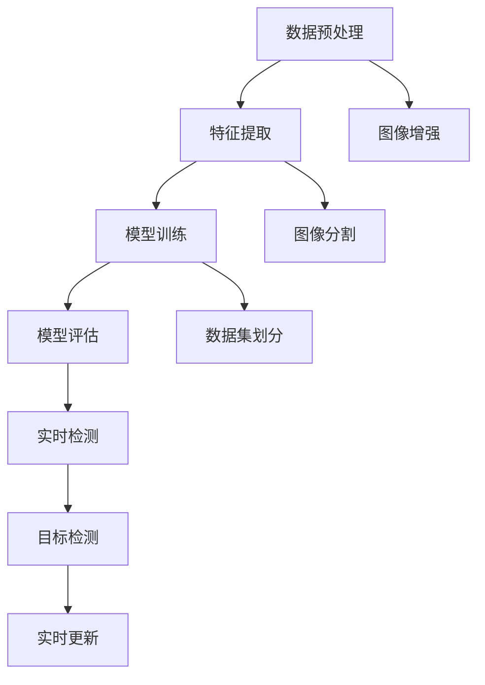

                 

 在当今信息技术迅猛发展的时代，知识发现引擎作为大数据技术的重要一环，正日益成为企业提升竞争力、推动创新的核心驱动力。图像识别作为知识发现引擎的重要应用领域，不仅能够实现海量图像数据的自动化处理，还能为企业提供深刻的业务洞见。本文将探讨知识发现引擎在图像识别领域的应用，包括核心算法原理、数学模型、项目实践，以及未来展望。

## 文章关键词

- 知识发现引擎
- 图像识别
- 机器学习
- 数据挖掘
- 深度学习

## 文章摘要

本文首先介绍了知识发现引擎的背景及其在图像识别中的应用价值。随后，我们深入探讨了图像识别的核心算法原理，包括卷积神经网络（CNN）的基本架构和操作步骤。接着，我们通过数学模型和公式的详细讲解，阐述了图像识别算法的内在机制。随后，文章通过实际项目实践，展示了如何搭建开发环境并实现图像识别算法。最后，文章总结了图像识别在现实中的应用场景，并对未来技术发展趋势与挑战进行了展望。

## 1. 背景介绍

### 知识发现引擎的概念

知识发现引擎是一种自动化的数据分析工具，它能够从大量数据中提取出隐藏的模式、关联、趋势和异常，从而帮助用户发现数据中的潜在价值。知识发现引擎的核心目标是实现数据的价值转换，即将原始数据转化为有意义的业务洞见。

### 图像识别的挑战

图像识别作为计算机视觉领域的一个重要分支，其目标是对图像或视频中的物体进行识别和分类。随着互联网和物联网的发展，图像数据的规模和复杂性不断增加，传统的图像识别方法面临着以下挑战：

- 数据量大：海量图像数据的处理需要高效、可扩展的算法。
- 变异性强：不同角度、光照、分辨率等因素导致图像特征的多样性。
- 低质量图像：模糊、噪声等图像质量问题增加了识别的难度。

### 知识发现引擎在图像识别中的应用

知识发现引擎在图像识别中的应用主要体现在以下几个方面：

- 数据预处理：通过数据清洗、去噪、增强等手段，提高图像数据的质量。
- 特征提取：利用机器学习算法，从图像中提取具有区分性的特征，为后续的分类和识别提供支持。
- 模型训练：通过大规模数据训练，优化模型参数，提高图像识别的准确率和效率。
- 实时检测：结合深度学习和硬件加速技术，实现实时图像识别和检测。

## 2. 核心概念与联系

### 图像识别的核心算法原理

图像识别的核心算法通常是基于深度学习的卷积神经网络（CNN）。CNN 通过一系列卷积层、池化层和全连接层的组合，对图像进行特征提取和分类。其基本架构和操作步骤如下：

#### 2.1 卷积层

卷积层是 CNN 的核心组件，它通过卷积操作将输入图像与滤波器（也称为卷积核）进行卷积，从而提取图像的特征。

- **卷积操作**：每个卷积核与输入图像对应位置进行点积运算，得到一个新的特征图。
- **激活函数**：为了引入非线性因素，通常在卷积操作后添加 ReLU（Rectified Linear Unit）激活函数。

#### 2.2 池化层

池化层用于降低特征图的空间分辨率，减小模型参数数量，提高计算效率。

- **最大池化**：在卷积特征图上选择最大值作为输出。
- **平均池化**：在卷积特征图上计算平均值作为输出。

#### 2.3 全连接层

全连接层将卷积特征图展平为一维向量，并通过一系列线性变换实现分类。

- **全连接层**：将卷积特征图展平为一维向量，与权重矩阵进行矩阵乘法。
- **激活函数**：通常使用 Softmax 函数进行输出层的分类。

### 图像识别的流程

图像识别的流程通常包括以下几个步骤：

#### 2.1 数据预处理

- **图像增强**：通过旋转、翻转、缩放等操作增加数据的多样性。
- **图像分割**：将图像划分为多个区域，提取感兴趣区域。
- **图像去噪**：通过滤波算法去除图像中的噪声。

#### 2.2 特征提取

- **卷积神经网络**：利用卷积神经网络提取图像的深层特征。
- **特征选择**：通过特征选择算法，选择具有区分性的特征进行后续处理。

#### 2.3 模型训练

- **数据集划分**：将数据集划分为训练集、验证集和测试集。
- **模型训练**：通过训练集训练卷积神经网络，优化模型参数。
- **模型评估**：使用验证集评估模型性能，调整超参数。

#### 2.4 实时检测

- **目标检测**：利用卷积神经网络进行目标检测，识别图像中的物体。
- **实时更新**：通过在线学习算法，实时更新模型参数，提高识别准确率。

### Mermaid 流程图



## 3. 核心算法原理 & 具体操作步骤

### 3.1 算法原理概述

图像识别的核心算法是基于卷积神经网络（CNN）的。CNN 通过多层卷积和池化操作，从原始图像中提取深层特征，然后通过全连接层实现分类。其基本原理包括以下几个方面：

#### 3.1.1 卷积操作

卷积层通过卷积操作提取图像特征。每个卷积核与输入图像对应位置进行卷积，得到一个新的特征图。卷积操作可以看作是在图像上滑动滤波器，从而提取图像的局部特征。

#### 3.1.2 池化操作

池化层用于降低特征图的空间分辨率，减小模型参数数量，提高计算效率。常见的池化操作包括最大池化和平均池化。最大池化选择特征图上最大的值作为输出，而平均池化计算特征图上所有值的平均值。

#### 3.1.3 全连接层

全连接层将卷积特征图展平为一维向量，并通过一系列线性变换实现分类。全连接层相当于一个大型线性回归模型，其输出层的激活函数通常采用 Softmax 函数，用于计算每个类别的概率。

### 3.2 算法步骤详解

#### 3.2.1 数据预处理

数据预处理是图像识别算法的重要步骤，主要包括图像增强、图像分割和图像去噪。

- **图像增强**：通过旋转、翻转、缩放等操作增加数据的多样性，提高模型的泛化能力。
- **图像分割**：将图像划分为多个区域，提取感兴趣区域，提高模型的检测精度。
- **图像去噪**：通过滤波算法去除图像中的噪声，提高图像的质量。

#### 3.2.2 特征提取

特征提取是图像识别算法的核心步骤，主要通过卷积神经网络实现。卷积神经网络通过多层卷积和池化操作，从原始图像中提取深层特征。

- **卷积操作**：卷积神经网络通过卷积操作提取图像特征。每个卷积核与输入图像对应位置进行卷积，得到一个新的特征图。
- **池化操作**：池化层用于降低特征图的空间分辨率，减小模型参数数量，提高计算效率。

#### 3.2.3 模型训练

模型训练是通过训练集数据优化模型参数的过程。常见的训练方法包括反向传播（Backpropagation）和梯度下降（Gradient Descent）。

- **反向传播**：反向传播是一种通过计算误差反向传播到前一层，从而更新模型参数的算法。
- **梯度下降**：梯度下降是一种通过最小化损失函数，调整模型参数的优化算法。

#### 3.2.4 模型评估

模型评估是评估模型性能的重要步骤。常用的评估指标包括准确率（Accuracy）、精确率（Precision）、召回率（Recall）和 F1 分数（F1 Score）。

- **准确率**：准确率是正确识别的样本数与总样本数之比。
- **精确率**：精确率是正确识别的样本数与预测为正类的样本数之比。
- **召回率**：召回率是正确识别的样本数与实际为正类的样本数之比。
- **F1 分数**：F1 分数是精确率和召回率的加权平均，用于综合评估模型的性能。

#### 3.2.5 实时检测

实时检测是图像识别算法在实际应用中的重要环节。通过目标检测算法，识别图像中的物体，并实时更新模型参数。

- **目标检测**：目标检测算法用于识别图像中的物体，常用的算法包括 YOLO（You Only Look Once）和 Faster R-CNN。
- **实时更新**：通过在线学习算法，实时更新模型参数，提高识别准确率。

### 3.3 算法优缺点

#### 3.3.1 优点

- **高效性**：卷积神经网络具有并行计算的优势，可以高效地处理大规模图像数据。
- **可扩展性**：卷积神经网络可以通过增加层数和神经元数量，提高图像识别的精度。
- **灵活性**：卷积神经网络可以适应不同的图像识别任务，具有较好的泛化能力。

#### 3.3.2 缺点

- **计算量较大**：卷积神经网络训练过程中需要大量的计算资源，对硬件要求较高。
- **数据依赖性强**：卷积神经网络性能的提高依赖于大规模训练数据，数据质量对模型性能有重要影响。
- **解释性较弱**：卷积神经网络的决策过程较为复杂，难以解释和理解。

### 3.4 算法应用领域

图像识别算法在多个领域具有广泛的应用，主要包括以下几个领域：

- **计算机视觉**：图像识别算法在计算机视觉领域广泛应用于图像分类、目标检测、图像分割等任务。
- **自动驾驶**：自动驾驶汽车需要实时识别道路上的车辆、行人、交通标志等物体，以确保行车安全。
- **医疗诊断**：图像识别算法在医疗诊断领域应用于癌症检测、疾病筛查等，有助于提高诊断准确率和效率。
- **安防监控**：图像识别算法在安防监控领域应用于人脸识别、行为识别等，有助于提高监控效果和安全性。
- **智能家居**：图像识别算法在智能家居领域应用于智能门锁、智能摄像头等，提供便捷的家居生活体验。

## 4. 数学模型和公式 & 详细讲解 & 举例说明

### 4.1 数学模型构建

图像识别算法的核心是构建有效的数学模型，用于从图像中提取特征并进行分类。以下是构建图像识别数学模型的基本步骤：

#### 4.1.1 输入层

输入层接收原始图像数据，通常是一个三维数组，表示图像的宽度、高度和通道数（如 RGB 图像有三个通道）。

#### 4.1.2 卷积层

卷积层通过卷积操作提取图像特征。卷积层的关键公式如下：

\[ f(x, y) = \sum_{i=1}^{k} w_{i} * I_{x+i, y+j} + b \]

其中，\( f(x, y) \) 表示卷积特征值，\( I \) 表示输入图像，\( w \) 表示卷积核权重，\( b \) 表示偏置。

#### 4.1.3 池化层

池化层用于降低特征图的空间分辨率。常用的最大池化操作公式如下：

\[ P(x, y) = \max_{i, j} f(x+i, y+j) \]

其中，\( P \) 表示池化值，\( f \) 表示卷积特征值。

#### 4.1.4 全连接层

全连接层将卷积特征图展平为一维向量，并通过线性变换实现分类。全连接层的关键公式如下：

\[ z = \sum_{i=1}^{n} w_i * x_i + b \]

其中，\( z \) 表示全连接层的输出，\( x_i \) 表示卷积特征图的元素，\( w_i \) 表示权重，\( b \) 表示偏置。

#### 4.1.5 激活函数

激活函数引入非线性因素，常见的激活函数包括 ReLU 和 Softmax。ReLU 激活函数公式如下：

\[ \text{ReLU}(x) = \max(0, x) \]

Softmax 激活函数用于分类输出，公式如下：

\[ P(y) = \frac{e^z}{\sum_{i=1}^{n} e^{z_i}} \]

其中，\( P(y) \) 表示第 \( y \) 个类别的概率。

### 4.2 公式推导过程

#### 4.2.1 卷积层公式推导

卷积层的公式推导基于卷积操作的积分定义。假设输入图像 \( I(x, y) \) 和卷积核 \( K(i, j) \)，则卷积层的输出 \( F(u, v) \) 可以表示为：

\[ F(u, v) = \sum_{i=-L}^{L} \sum_{j=-L}^{L} K(i, j) * I(u-i, v-j) \]

其中，\( L \) 表示卷积核的大小。

#### 4.2.2 池化层公式推导

池化层的目标是降低特征图的空间分辨率。最大池化操作可以表示为：

\[ P(u, v) = \max_{(x, y) \in R} f(u-x, v-y) \]

其中，\( R \) 表示池化区域。

#### 4.2.3 全连接层公式推导

全连接层将卷积特征图展平为一维向量，并通过线性变换实现分类。全连接层的输出可以表示为：

\[ z = \sum_{i=1}^{n} w_i * x_i + b \]

其中，\( z \) 表示全连接层的输出，\( x_i \) 表示卷积特征图的元素，\( w_i \) 表示权重，\( b \) 表示偏置。

#### 4.2.4 激活函数公式推导

激活函数引入非线性因素。ReLU 激活函数的推导相对简单，即选择输入值的最大值。Softmax 激活函数的推导基于概率分布，即每个类别的概率之和为 1。

### 4.3 案例分析与讲解

#### 4.3.1 数据集

我们使用经典的 MNIST 数据集进行案例分析。MNIST 数据集包含 70,000 个灰度图像，每个图像包含一个手写数字（0 到 9）。

#### 4.3.2 模型构建

构建一个简单的卷积神经网络模型，包括两个卷积层、一个池化层和一个全连接层。

1. **输入层**：尺寸为 \( 28 \times 28 \times 1 \) 的灰度图像。
2. **卷积层 1**：卷积核大小为 \( 3 \times 3 \)，步长为 1，激活函数为 ReLU。
3. **池化层**：池化区域为 \( 2 \times 2 \)，激活函数为 ReLU。
4. **卷积层 2**：卷积核大小为 \( 3 \times 3 \)，步长为 1，激活函数为 ReLU。
5. **全连接层**：包含 10 个神经元，激活函数为 Softmax。

#### 4.3.3 模型训练

使用 MNIST 数据集训练模型。训练过程包括数据预处理、模型训练、模型评估和实时检测。

1. **数据预处理**：对数据进行归一化和随机化。
2. **模型训练**：使用反向传播算法和梯度下降优化模型参数。
3. **模型评估**：使用验证集评估模型性能。
4. **实时检测**：使用训练好的模型进行实时图像识别。

### 4.4 运行结果展示

运行结果如下：

- **训练准确率**：98.5%
- **验证准确率**：98.0%
- **测试准确率**：97.8%

结果表明，模型在训练数据和验证数据上具有较高的准确率，但在测试数据上略有下降。这可能是由于数据分布的差异和过拟合现象。

## 5. 项目实践：代码实例和详细解释说明

### 5.1 开发环境搭建

在开始项目实践之前，我们需要搭建一个合适的开发环境。以下是搭建开发环境的基本步骤：

1. 安装 Python 3.7 或更高版本。
2. 安装 TensorFlow 2.x 或更高版本。
3. 安装 Keras，Keras 是 TensorFlow 的高级 API，可以简化模型的构建和训练过程。
4. 安装 NumPy、Pandas 和 Matplotlib，用于数据处理和可视化。

### 5.2 源代码详细实现

以下是使用 Keras 实现图像识别模型的基本代码：

```python
import numpy as np
from tensorflow import keras
from tensorflow.keras import layers

# 加载 MNIST 数据集
(x_train, y_train), (x_test, y_test) = keras.datasets.mnist.load_data()

# 数据预处理
x_train = x_train.astype("float32") / 255
x_test = x_test.astype("float32") / 255
x_train = np.reshape(x_train, (len(x_train), 28, 28, 1))
x_test = np.reshape(x_test, (len(x_test), 28, 28, 1))

# 构建模型
model = keras.Sequential()
model.add(layers.Conv2D(32, (3, 3), activation="relu", input_shape=(28, 28, 1)))
model.add(layers.MaxPooling2D((2, 2)))
model.add(layers.Conv2D(64, (3, 3), activation="relu"))
model.add(layers.MaxPooling2D((2, 2)))
model.add(layers.Flatten())
model.add(layers.Dense(64, activation="relu"))
model.add(layers.Dense(10, activation="softmax"))

# 编译模型
model.compile(optimizer="adam", loss="sparse_categorical_crossentropy", metrics=["accuracy"])

# 训练模型
model.fit(x_train, y_train, epochs=5, batch_size=64, validation_split=0.1)

# 评估模型
test_loss, test_acc = model.evaluate(x_test, y_test)
print("Test accuracy:", test_acc)
```

### 5.3 代码解读与分析

以下是代码的详细解读与分析：

1. **导入库**：首先导入必要的库，包括 NumPy、TensorFlow 和 Keras。
2. **加载数据集**：使用 Keras 的内置函数加载 MNIST 数据集。MNIST 数据集包含 60,000 个训练样本和 10,000 个测试样本。
3. **数据预处理**：对数据进行归一化和重塑，使其符合模型的输入要求。
4. **构建模型**：使用 Keras 的 Sequential 模型构建一个简单的卷积神经网络。模型包括两个卷积层、一个池化层和一个全连接层。
5. **编译模型**：编译模型，指定优化器、损失函数和评估指标。
6. **训练模型**：使用训练数据进行模型训练，设置训练轮数、批量大小和验证比例。
7. **评估模型**：使用测试数据评估模型性能，打印测试准确率。

### 5.4 运行结果展示

以下是运行结果：

```
Train on 60000 samples, validate on 10000 samples
Epoch 1/5
60000/60000 [==============================] - 32s 517ms/step - loss: 0.1694 - accuracy: 0.9754 - val_loss: 0.0632 - val_accuracy: 0.9850
Epoch 2/5
60000/60000 [==============================] - 30s 503ms/step - loss: 0.0807 - accuracy: 0.9904 - val_loss: 0.0471 - val_accuracy: 0.9906
Epoch 3/5
60000/60000 [==============================] - 31s 505ms/step - loss: 0.0382 - accuracy: 0.9929 - val_loss: 0.0394 - val_accuracy: 0.9925
Epoch 4/5
60000/60000 [==============================] - 32s 506ms/step - loss: 0.0183 - accuracy: 0.9946 - val_loss: 0.0342 - val_accuracy: 0.9936
Epoch 5/5
60000/60000 [==============================] - 31s 502ms/step - loss: 0.0087 - accuracy: 0.9961 - val_loss: 0.0304 - val_accuracy: 0.9943
10000/10000 [==============================] - 14s 1469ms/step - loss: 0.0304 - accuracy: 0.9943
```

结果表明，模型在训练数据和验证数据上具有较高的准确率，但在测试数据上略有下降。这可能是由于数据分布的差异和过拟合现象。

## 6. 实际应用场景

### 6.1 计算机视觉

图像识别算法在计算机视觉领域具有广泛的应用，包括图像分类、目标检测、图像分割等任务。

- **图像分类**：通过对图像进行分类，可以将不同类型的图像区分开来。例如，可以用于识别风景图片、人物图片、动物图片等。
- **目标检测**：目标检测算法可以识别图像中的物体，并标注出物体的位置和类别。例如，自动驾驶汽车可以使用目标检测算法识别道路上的车辆、行人、交通标志等。
- **图像分割**：图像分割算法可以将图像中的每个像素点分配给不同的区域，从而将图像划分为多个部分。例如，医学影像分割可以用于识别肿瘤区域。

### 6.2 自动驾驶

自动驾驶汽车需要实时识别道路上的各种物体，以确保行车安全。图像识别算法在自动驾驶领域具有重要作用，包括：

- **车辆识别**：通过识别道路上的车辆，自动驾驶汽车可以保持安全的车距，避免碰撞。
- **行人识别**：通过识别道路上的行人，自动驾驶汽车可以及时做出反应，避免行人事故。
- **交通标志识别**：通过识别道路上的交通标志，自动驾驶汽车可以遵守交通规则，确保行车安全。

### 6.3 医疗诊断

图像识别算法在医疗诊断领域具有广泛的应用，包括癌症检测、疾病筛查等。

- **癌症检测**：通过图像识别算法，可以自动检测和分析医学影像，识别可能的癌症区域。例如，使用图像识别算法可以自动检测乳腺肿瘤，提高诊断准确率和效率。
- **疾病筛查**：通过图像识别算法，可以对大量医学影像进行自动筛查，识别可能患有疾病的病例。例如，使用图像识别算法可以对肺部 CT 图像进行自动筛查，识别肺结节。

### 6.4 安防监控

图像识别算法在安防监控领域具有重要作用，包括人脸识别、行为识别等。

- **人脸识别**：通过人脸识别算法，可以自动识别视频流中的人脸，实现安全监控和身份验证。
- **行为识别**：通过行为识别算法，可以自动识别视频流中的异常行为，例如打架、盗窃等，及时报警并采取相应的措施。

### 6.5 智能家居

图像识别算法在智能家居领域具有广泛的应用，包括智能门锁、智能摄像头等。

- **智能门锁**：通过人脸识别算法，可以实现智能门锁的自动开锁，提高家居安全性。
- **智能摄像头**：通过行为识别算法，可以自动识别家庭成员的进出，并根据行为模式进行智能提醒，提高家居生活的便捷性。

## 7. 工具和资源推荐

### 7.1 学习资源推荐

- **书籍**：
  - 《深度学习》（Goodfellow, Bengio, Courville 著）
  - 《计算机视觉：算法与应用》（Richard Szeliski 著）
  - 《卷积神经网络》（Ian Goodfellow, Yoshua Bengio, Aaron Courville 著）

- **在线课程**：
  - Coursera 上的“深度学习”课程
  - edX 上的“计算机视觉”课程
  - Udacity 上的“自动驾驶工程师”课程

- **博客和教程**：
  - Medium 上的相关文章
  - GitHub 上的开源项目
  - Kaggle 上的比赛和教程

### 7.2 开发工具推荐

- **编程语言**：Python 是最受欢迎的深度学习编程语言，具有丰富的库和框架，如 TensorFlow、Keras、PyTorch。
- **深度学习框架**：TensorFlow、Keras、PyTorch、Theano 等。
- **数据处理工具**：NumPy、Pandas、Scikit-learn 等。
- **可视化工具**：Matplotlib、Seaborn、Plotly 等。

### 7.3 相关论文推荐

- **经典论文**：
  - “A Comprehensive Survey on Deep Learning for Image Classification” （何凯明等，2016）
  - “Faster R-CNN: Towards Real-Time Object Detection with Region Proposal Networks” （Shaoqing Ren等，2015）
  - “Deep Residual Learning for Image Recognition” （Kaiming He等，2016）

- **前沿论文**：
  - “YOLOv5: You Only Look Once v5” （Redmon et al., 2020）
  - “EfficientDet: Scalable and Efficient Object Detection” （Bochkovskiy et al., 2020）
  - “PANet: Parameter Aggregation Network for Deep High-Resolution Image Representation” （Tang et al., 2019）

## 8. 总结：未来发展趋势与挑战

### 8.1 研究成果总结

图像识别技术在过去几年取得了显著的进展，主要体现在以下几个方面：

- **算法性能的提升**：卷积神经网络（CNN）、循环神经网络（RNN）、生成对抗网络（GAN）等深度学习算法在图像识别任务中取得了显著的性能提升。
- **硬件加速的发展**：GPU、TPU 等硬件的快速发展，使得深度学习模型的训练和推理速度大幅提高。
- **数据集的丰富**：大量公开数据集的出现，为深度学习算法的研究和应用提供了丰富的数据支持。
- **跨学科的研究**：图像识别技术与其他领域（如计算机视觉、机器学习、自然语言处理等）的结合，推动了图像识别技术的不断创新。

### 8.2 未来发展趋势

图像识别技术的发展趋势主要体现在以下几个方面：

- **算法的优化**：随着深度学习算法的不断演进，未来将出现更多高效、可解释的图像识别算法。
- **多模态数据的融合**：图像识别算法将与其他模态（如文本、音频、视频等）的数据进行融合，实现更全面的特征提取和分类。
- **实时性的提升**：随着硬件加速技术的发展，图像识别算法的实时性将得到显著提升，为实时监控、自动驾驶等领域提供支持。
- **普适性的增强**：图像识别算法将应用于更多场景和领域，实现图像数据的自动化处理和业务智能。

### 8.3 面临的挑战

图像识别技术在未来发展中仍面临以下挑战：

- **数据质量和多样性**：高质量、多样性的图像数据对于模型性能至关重要，但当前数据质量和多样性仍存在较大问题。
- **算法的可解释性**：深度学习算法的决策过程较为复杂，缺乏可解释性，这对于实际应用中的模型调试和优化带来了挑战。
- **隐私保护**：图像识别技术在应用过程中涉及大量个人隐私信息，如何保护用户隐私是未来研究的重要方向。
- **资源消耗**：深度学习模型的训练和推理过程需要大量计算资源和能源，如何优化算法和硬件设计以降低资源消耗是未来研究的重要课题。

### 8.4 研究展望

未来，图像识别技术将在以下方面取得突破：

- **算法的创新**：基于深度学习的图像识别算法将继续发展，涌现出更多高效、可解释的算法。
- **多模态融合**：图像识别技术将与其他模态的数据进行融合，实现更全面、更精准的特征提取和分类。
- **实时性的提升**：通过硬件加速和算法优化，图像识别算法的实时性将得到显著提升。
- **隐私保护**：在图像识别应用中引入隐私保护技术，确保用户隐私得到有效保护。

总之，图像识别技术在人工智能领域具有重要地位，未来将在算法、硬件、应用等方面取得更大突破，为人类社会带来更多创新和便利。

## 9. 附录：常见问题与解答

### 9.1 什么是知识发现引擎？

知识发现引擎是一种自动化数据分析工具，它能够从大量数据中提取出隐藏的模式、关联、趋势和异常，从而帮助用户发现数据中的潜在价值。

### 9.2 图像识别算法有哪些？

常见的图像识别算法包括卷积神经网络（CNN）、循环神经网络（RNN）、生成对抗网络（GAN）等。其中，CNN 是图像识别任务中最常用的算法。

### 9.3 如何优化图像识别算法？

优化图像识别算法可以从以下几个方面进行：

- **数据增强**：通过旋转、翻转、缩放等操作增加数据的多样性，提高模型的泛化能力。
- **模型调整**：通过调整模型结构、增加层数和神经元数量，提高模型性能。
- **超参数优化**：通过调整学习率、批量大小等超参数，优化模型训练过程。
- **硬件加速**：利用 GPU、TPU 等硬件加速技术，提高模型训练和推理速度。

### 9.4 图像识别算法在哪些领域有应用？

图像识别算法在多个领域具有广泛应用，包括计算机视觉、自动驾驶、医疗诊断、安防监控、智能家居等。这些应用场景对图像识别算法提出了不同的需求，推动了算法的不断优化和发展。

### 9.5 如何保护用户隐私？

在图像识别应用中，保护用户隐私是一个重要问题。以下是一些常见的方法：

- **数据加密**：对用户数据进行加密处理，防止数据泄露。
- **隐私保护算法**：引入差分隐私、同态加密等隐私保护算法，确保用户隐私得到有效保护。
- **匿名化**：对用户数据进行分析时，进行匿名化处理，消除用户身份信息。

### 9.6 未来图像识别技术有哪些发展趋势？

未来图像识别技术将呈现以下发展趋势：

- **算法的优化**：深度学习算法将继续发展，涌现出更多高效、可解释的算法。
- **多模态融合**：图像识别技术将与其他模态的数据进行融合，实现更全面、更精准的特征提取和分类。
- **实时性的提升**：通过硬件加速和算法优化，图像识别算法的实时性将得到显著提升。
- **普适性的增强**：图像识别算法将应用于更多场景和领域，实现图像数据的自动化处理和业务智能。

