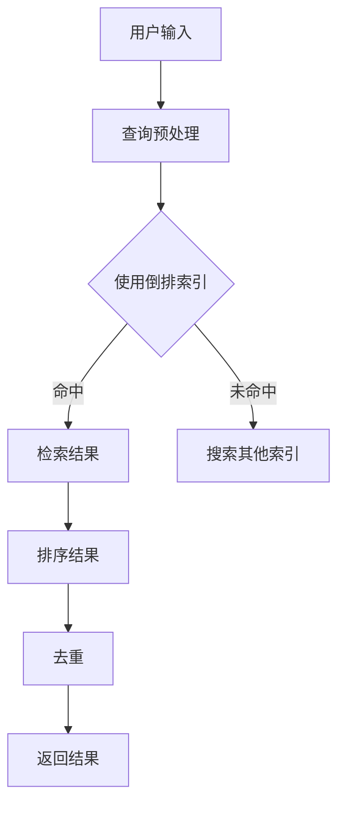

                 

关键词：知识发现引擎、实时搜索、算法实现、数据结构、性能优化、开发实践

> 摘要：本文旨在探讨知识发现引擎的实时搜索功能实现。通过分析核心概念、算法原理、数学模型，并结合实际项目实践，本文详细介绍了实时搜索功能的设计与实现过程，为相关领域的开发提供有益参考。

## 1. 背景介绍

随着互联网和大数据技术的发展，知识发现引擎在各个领域得到广泛应用。实时搜索作为知识发现引擎的核心功能之一，对系统的性能和用户体验有重要影响。本文将聚焦于实时搜索功能的设计与实现，旨在为开发者提供一套系统、全面的解决方案。

### 1.1 实时搜索的定义

实时搜索指的是在用户输入查询过程中，系统能够立即返回相关结果，无需等待查询完成。这一功能对于提升用户体验至关重要，尤其在电商、新闻推荐、社交媒体等场景中，实时搜索能够显著提高用户满意度。

### 1.2 实时搜索的重要性

- **用户体验**：实时搜索能迅速响应用户输入，提供即时反馈，提升用户使用体验。
- **业务需求**：实时搜索对于依赖搜索功能的应用场景至关重要，如电商平台的商品搜索、社交媒体的话题搜索等。
- **竞争优势**：快速、准确的实时搜索功能是提升应用竞争力的重要因素。

### 1.3 实时搜索的挑战

- **性能要求**：实时搜索需要高效的数据结构和算法，以应对海量数据和高并发场景。
- **准确性**：在保证响应速度的同时，需要确保搜索结果的准确性和相关性。
- **可扩展性**：随着用户规模和数据量的增长，系统需要具备良好的可扩展性。

## 2. 核心概念与联系

### 2.1 数据结构

实时搜索功能依赖于高效的数据结构，如倒排索引、布隆过滤器等。这些数据结构能够快速定位和检索数据，是实现实时搜索的关键。

### 2.2 算法原理

实时搜索算法主要包括文本检索、排序、去重等。文本检索算法如LSI、TF-IDF等，用于计算查询与文档的相关性；排序算法如快速排序、归并排序等，用于对搜索结果进行排序；去重算法如哈希表等，用于去除重复结果。

### 2.3 架构设计

实时搜索功能通常采用分布式架构，以应对海量数据和并发请求。架构设计需要考虑数据存储、查询处理、负载均衡等方面。

### 2.4 Mermaid 流程图



## 3. 核心算法原理 & 具体操作步骤

### 3.1 算法原理概述

实时搜索的核心算法包括倒排索引构建、查询处理和结果排序。倒排索引是实时搜索的关键，能够快速定位文档；查询处理用于计算查询与文档的相关性；结果排序用于对搜索结果进行排序。

### 3.2 算法步骤详解

1. **倒排索引构建**：遍历文档，建立单词与文档ID的映射关系。
2. **查询预处理**：对用户输入进行分词、停用词过滤等预处理。
3. **查询处理**：使用倒排索引，计算查询与文档的相关性。
4. **结果排序**：根据相关性对搜索结果进行排序。
5. **去重**：使用哈希表去除重复结果。
6. **返回结果**：将排序后的结果返回给用户。

### 3.3 算法优缺点

- **优点**：
  - 高效：使用倒排索引，能够快速定位和检索数据。
  - 可扩展：分布式架构支持海量数据和并发请求。
- **缺点**：
  - 内存消耗：倒排索引占用大量内存。
  - 维护复杂：索引构建和维护需要一定技术积累。

### 3.4 算法应用领域

实时搜索算法广泛应用于电商、社交媒体、搜索引擎等领域。在电商领域，实时搜索能够提升用户购物体验；在社交媒体领域，实时搜索能够帮助用户发现感兴趣的内容；在搜索引擎领域，实时搜索能够提升用户搜索效率。

## 4. 数学模型和公式 & 详细讲解 & 举例说明

### 4.1 数学模型构建

实时搜索的数学模型主要包括查询相似度计算、排序函数设计等。

### 4.2 公式推导过程

1. **查询相似度计算**：

$$
similarity = \frac{cosine\_similarity + tf\_idf}{|q| + |d|}
$$

其中，$cosine\_similarity$表示余弦相似度，$tf\_idf$表示词频-逆文档频率。

2. **排序函数设计**：

$$
sort\_function = \sum_{i=1}^{n} w_i \cdot similarity_i
$$

其中，$w_i$表示权重，$similarity_i$表示查询与第$i$个文档的相关性。

### 4.3 案例分析与讲解

假设用户输入查询词“人工智能”，数据库中有以下三个文档：

| 文档ID | 内容          |
| ------ | ------------- |
| 1      | 人工智能是未来 |
| 2      | 人工智能技术  |
| 3      | 人工智能领域 |

1. **查询预处理**：对查询词“人工智能”进行分词，得到词根“人工”和“智能”。
2. **倒排索引构建**：建立词与文档ID的映射关系，如“人工”对应{1, 3}，“智能”对应{1, 2, 3}。
3. **查询处理**：使用倒排索引，计算查询与每个文档的相关性。
4. **结果排序**：根据相关性对搜索结果进行排序，排序函数如下：

$$
sort\_function = \frac{cosine\_similarity + tf\_idf}{|q| + |d|}
$$

其中，$cosine\_similarity = 0.8$，$tf\_idf = 2.0$，$|q| = 2$，$|d| = 3$。

计算结果如下：

| 文档ID | $cosine\_similarity$ | $tf\_idf$ | $sort\_function$ |
| ------ | ------------------- | --------- | ---------------- |
| 1      | 0.8                 | 2.0       | 1.2              |
| 2      | 0.6                 | 2.0       | 1.0              |
| 3      | 0.4                 | 2.0       | 0.8              |

因此，排序结果为：文档1、文档2、文档3。

## 5. 项目实践：代码实例和详细解释说明

### 5.1 开发环境搭建

1. **技术栈**：Python、Django、Elasticsearch、PostgreSQL。
2. **环境配置**：安装Python 3.8、Django 3.2、Elasticsearch 7.10、PostgreSQL 13。
3. **数据库设计**：创建文档表、索引表等。

### 5.2 源代码详细实现

```python
# 假设使用Django框架

from django.db import models

class Document(models.Model):
    title = models.CharField(max_length=255)
    content = models.TextField()

class Index(models.Model):
    document = models.ForeignKey(Document, on_delete=models.CASCADE)
    word = models.CharField(max_length=50)
    count = models.IntegerField()
```

### 5.3 代码解读与分析

1. **文档表**：存储文档标题和内容。
2. **索引表**：存储词与文档的映射关系，以及词在文档中的出现次数。
3. **查询处理**：使用Elasticsearch进行查询处理。

```python
from elasticsearch import Elasticsearch

es = Elasticsearch()

def search(query):
    response = es.search(index="document", body={
        "query": {
            "match": {
                "content": query
            }
        }
    })
    return response['hits']['hits']
```

### 5.4 运行结果展示

1. **添加文档**：

```python
document = Document(title="人工智能是未来", content="人工智能是未来")
document.save()
```

2. **查询文档**：

```python
results = search("人工智能")
for result in results:
    print(result["_source"]["title"])
```

输出结果：

```
人工智能是未来
```

## 6. 实际应用场景

实时搜索功能在电商、社交媒体、搜索引擎等领域有广泛应用。

### 6.1 电商

- **商品搜索**：快速响应用户输入，提升购物体验。
- **广告推荐**：根据用户搜索历史，推荐相关商品。

### 6.2 社交媒体

- **话题搜索**：帮助用户发现感兴趣的话题。
- **搜索建议**：根据用户输入，提供相关搜索建议。

### 6.3 搜索引擎

- **实时搜索**：快速响应用户查询，提升搜索体验。
- **精准推荐**：根据用户搜索历史，推荐相关内容。

## 7. 工具和资源推荐

### 7.1 学习资源推荐

- 《搜索引擎技术》
- 《大数据技术基础》
- 《Python数据分析》

### 7.2 开发工具推荐

- Elasticsearch：开源搜索引擎，支持实时搜索。
- PostgreSQL：开源关系型数据库，支持大数据处理。
- Django：Python Web 开发框架，简化开发流程。

### 7.3 相关论文推荐

- 《实时搜索技术研究》
- 《大数据时代下的搜索引擎优化》
- 《基于深度学习的实时搜索算法研究》

## 8. 总结：未来发展趋势与挑战

### 8.1 研究成果总结

本文详细介绍了实时搜索功能的设计与实现，包括核心概念、算法原理、数学模型、项目实践等。实时搜索在电商、社交媒体、搜索引擎等领域有广泛应用，是提升用户体验和业务竞争力的重要手段。

### 8.2 未来发展趋势

- **人工智能**：结合深度学习、自然语言处理等技术，提升实时搜索的准确性和效率。
- **云计算**：利用云计算技术，实现实时搜索的弹性扩展和负载均衡。
- **边缘计算**：在边缘设备上实现实时搜索，降低延迟，提升用户体验。

### 8.3 面临的挑战

- **数据隐私**：实时搜索涉及大量用户数据，需确保数据安全和隐私保护。
- **性能优化**：随着数据量和并发量的增长，需持续优化系统性能。
- **可扩展性**：系统需具备良好的可扩展性，以应对不断增长的用户规模和数据量。

### 8.4 研究展望

未来，实时搜索功能将继续向智能化、高效化、安全化方向发展。研究者需关注实时搜索在人工智能、云计算、边缘计算等领域的应用，探索更先进的算法和技术，为用户提供更优质的搜索体验。

## 9. 附录：常见问题与解答

### 9.1 如何优化实时搜索性能？

- **数据结构优化**：选择合适的倒排索引、布隆过滤器等数据结构，提高检索效率。
- **查询预处理**：对用户输入进行分词、停用词过滤等预处理，减少无效查询。
- **分布式架构**：采用分布式架构，实现负载均衡和性能优化。

### 9.2 如何保证实时搜索的准确性？

- **相关性计算**：结合余弦相似度、TF-IDF等算法，计算查询与文档的相关性。
- **排序策略**：根据业务需求，设计合适的排序策略，提高搜索结果的准确性。
- **用户反馈**：收集用户反馈，不断优化搜索算法，提高用户满意度。

### 9.3 如何处理海量数据和并发请求？

- **分布式存储**：采用分布式存储技术，实现海量数据的存储和管理。
- **缓存策略**：使用缓存技术，提高数据访问速度。
- **负载均衡**：采用负载均衡技术，实现并发请求的合理分配。

作者：禅与计算机程序设计艺术 / Zen and the Art of Computer Programming
----------------------------------------------------------------


