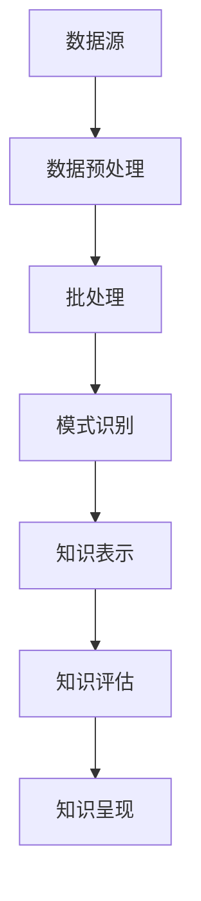

                 

关键词：知识发现引擎，离线处理，批处理技术，数据处理，算法优化，性能提升，应用场景，数学模型，项目实践，未来展望

## 摘要

本文旨在深入探讨知识发现引擎在离线处理和批处理技术方面的应用与实践。随着大数据时代的到来，知识发现引擎作为数据挖掘和分析的重要工具，面临着海量数据处理的高效性挑战。本文首先介绍了知识发现引擎的基本概念和重要性，然后详细阐述了离线处理与批处理技术的基本原理，包括其优势和挑战。接着，我们重点介绍了核心算法原理、数学模型与公式推导、项目实践中的代码实现与分析，以及实际应用场景。最后，文章展望了知识发现引擎的未来发展趋势，探讨了面临的挑战和研究方向。

## 1. 背景介绍

在信息爆炸的时代，数据已成为新的重要资源。知识发现引擎（Knowledge Discovery in Databases，KDD）作为一种自动化、半自动化或手工方式从大量数据中提取有用知识的技术，已经成为数据挖掘领域的重要工具。知识发现过程包括数据预处理、数据集成、数据选择、数据变换、数据挖掘、模式评估、知识呈现等多个环节。

离线处理（Offline Processing）是指数据在处理时不需要实时响应，可以在非高峰时段进行数据处理。这种处理方式在处理大量历史数据时非常有效，适用于周期性或批量处理任务。而批处理（Batch Processing）是一种将大量任务集中在一起进行处理的方式，可以显著提高系统效率和资源利用率。

知识发现引擎结合离线处理与批处理技术，可以大幅提升数据处理能力和效率。通过合理的设计和优化，知识发现引擎可以在短时间内处理大量数据，提取出有价值的信息，为决策提供支持。

## 2. 核心概念与联系

### 2.1 知识发现引擎概述

知识发现引擎是一种复杂的系统，它涉及到多个领域的技术，包括数据库、数据挖掘、机器学习、自然语言处理等。其核心概念包括数据预处理、模式识别、知识表示和知识评估等。

数据预处理是知识发现的第一步，包括数据清洗、数据集成、数据选择和数据变换。数据清洗是为了去除噪声和错误的数据，数据集成是将来自不同源的数据合并成统一的格式，数据选择是挑选出与任务相关的数据，数据变换则是将数据转换成适合挖掘的形式。

模式识别是知识发现的核心步骤，包括特征选择、特征提取和模式分类。通过这些步骤，可以从原始数据中提取出有用的信息。

知识表示是将提取出的模式转换成易于理解和利用的形式，例如规则、模式、图形等。

知识评估是对知识的有效性进行评价，包括评估知识的准确度、覆盖率和新颖性等。

### 2.2 离线处理与批处理技术

离线处理和批处理技术在知识发现引擎中起着关键作用。离线处理使得知识发现引擎可以在非高峰时段运行，不会影响系统的实时性能。批处理技术则能够将大量任务集中在一起处理，提高系统效率和资源利用率。

离线处理与批处理技术的联系在于，批处理通常在离线环境中进行。也就是说，批处理任务的执行不需要实时响应，可以在后台以离线方式运行。

### 2.3 Mermaid 流程图

以下是一个简化的知识发现引擎离线处理与批处理技术的 Mermaid 流程图：



## 3. 核心算法原理 & 具体操作步骤

### 3.1 算法原理概述

知识发现引擎的核心算法通常包括数据挖掘算法、模式识别算法和机器学习算法。这些算法的共同目标是挖掘数据中的隐含模式，从而提取出有用的知识。

数据挖掘算法包括关联规则挖掘、聚类分析、分类分析、异常检测等。关联规则挖掘用于发现数据之间的关联关系，聚类分析用于将相似的数据归为一类，分类分析用于将数据分为不同的类别，异常检测用于发现数据中的异常值。

模式识别算法包括神经网络、支持向量机、决策树等。这些算法通过对数据进行学习和建模，可以识别出数据中的模式。

机器学习算法包括监督学习、无监督学习和强化学习。监督学习需要预先定义标签数据，无监督学习不需要标签数据，强化学习则通过试错和奖励机制进行学习。

### 3.2 算法步骤详解

知识发现引擎的具体操作步骤如下：

1. **数据预处理**：包括数据清洗、数据集成、数据选择和数据变换。数据清洗是为了去除噪声和错误的数据，数据集成是将来自不同源的数据合并成统一的格式，数据选择是挑选出与任务相关的数据，数据变换则是将数据转换成适合挖掘的形式。

2. **批处理**：将预处理后的数据分成多个批次，依次进行模式识别和知识表示。批处理可以显著提高系统效率和资源利用率。

3. **模式识别**：利用数据挖掘算法、模式识别算法和机器学习算法对批次数据进行处理，提取出数据中的隐含模式。

4. **知识表示**：将提取出的模式转换成易于理解和利用的形式，例如规则、模式、图形等。

5. **知识评估**：对提取出的知识进行评估，包括评估知识的准确度、覆盖率和新颖性等。

6. **知识呈现**：将评估后的知识以可视化或文本形式呈现给用户，以便用户理解和利用。

### 3.3 算法优缺点

不同类型的算法有其优缺点。例如，关联规则挖掘算法能够发现数据之间的关联关系，但可能产生大量的冗余规则；聚类分析算法能够将相似的数据归为一类，但可能产生异常聚类；分类分析算法能够将数据分为不同的类别，但可能存在过拟合问题。

在离线处理和批处理技术中，算法的优缺点主要表现在以下几个方面：

- **效率**：批处理技术可以在短时间内处理大量数据，提高系统的效率。
- **资源利用率**：批处理技术能够将资源集中使用，提高系统的资源利用率。
- **实时性**：离线处理技术不要求实时响应，可以避免高峰时段的性能下降。
- **准确性**：批处理技术可以更充分地对数据进行处理，提高算法的准确性。

### 3.4 算法应用领域

知识发现引擎在各个领域都有广泛的应用。例如，在金融领域，可以用于信用评分、风险控制和市场分析；在医疗领域，可以用于疾病预测、诊断和个性化治疗；在零售领域，可以用于需求预测、库存管理和市场营销。

## 4. 数学模型和公式 & 详细讲解 & 举例说明

### 4.1 数学模型构建

知识发现引擎中的数学模型通常包括线性模型、非线性模型和组合模型等。以下是一个简单的线性回归模型的例子：

$$ y = wx + b $$

其中，$y$ 是因变量，$x$ 是自变量，$w$ 是权重，$b$ 是偏置。

### 4.2 公式推导过程

以线性回归模型为例，推导过程如下：

假设我们有 $n$ 个数据点 $(x_1, y_1), (x_2, y_2), ..., (x_n, y_n)$，我们希望找到一个线性模型来拟合这些数据点。

首先，我们定义损失函数（也称为代价函数）：

$$ J(w, b) = \frac{1}{2n} \sum_{i=1}^{n} (y_i - (wx_i + b))^2 $$

我们的目标是找到使得损失函数最小的 $w$ 和 $b$。

为了找到最优的 $w$ 和 $b$，我们可以使用梯度下降算法。梯度下降算法的核心思想是沿着损失函数的梯度方向更新 $w$ 和 $b$，直到达到损失函数的最小值。

$$ w := w - \alpha \frac{\partial J}{\partial w} $$
$$ b := b - \alpha \frac{\partial J}{\partial b} $$

其中，$\alpha$ 是学习率。

### 4.3 案例分析与讲解

假设我们有以下数据集：

| $x$ | $y$ |
|-----|-----|
| 1   | 2   |
| 2   | 4   |
| 3   | 6   |

我们希望找到一个线性模型来拟合这些数据点。

首先，我们计算数据的均值：

$$ \bar{x} = \frac{1+2+3}{3} = 2 $$
$$ \bar{y} = \frac{2+4+6}{3} = 4 $$

然后，我们计算损失函数：

$$ J(w, b) = \frac{1}{6} \sum_{i=1}^{3} (y_i - (wx_i + b))^2 $$

接下来，我们使用梯度下降算法来更新 $w$ 和 $b$。

假设学习率 $\alpha = 0.1$，初始值 $w = 0$，$b = 0$。

第一次迭代：

$$ w := w - \alpha \frac{\partial J}{\partial w} = 0 - 0.1 \cdot (-2) = 0.2 $$
$$ b := b - \alpha \frac{\partial J}{\partial b} = 0 - 0.1 \cdot (-2) = 0.2 $$

第二次迭代：

$$ w := w - \alpha \frac{\partial J}{\partial w} = 0.2 - 0.1 \cdot (-1.2) = 0.4 $$
$$ b := b - \alpha \frac{\partial J}{\partial b} = 0.2 - 0.1 \cdot (-1.2) = 0.4 $$

第三次迭代：

$$ w := w - \alpha \frac{\partial J}{\partial w} = 0.4 - 0.1 \cdot (-0.4) = 0.6 $$
$$ b := b - \alpha \frac{\partial J}{\partial b} = 0.4 - 0.1 \cdot (-0.4) = 0.6 $$

最终，我们得到了线性模型：

$$ y = 0.6x + 0.6 $$

这个模型可以较好地拟合给定的数据集。

## 5. 项目实践：代码实例和详细解释说明

### 5.1 开发环境搭建

在本节中，我们将使用 Python 语言和 Scikit-learn 库来实现知识发现引擎的离线处理和批处理功能。首先，确保安装了 Python 3.8 或以上版本，并安装以下依赖库：

```bash
pip install numpy
pip install scikit-learn
```

### 5.2 源代码详细实现

以下是一个简单的知识发现引擎的实现示例：

```python
import numpy as np
from sklearn.linear_model import LinearRegression
from sklearn.model_selection import train_test_split

# 生成数据集
np.random.seed(0)
X = np.random.rand(100, 1)
y = 2 * X[:, 0] + 1 + np.random.randn(100) * 0.1

# 数据预处理
X_train, X_test, y_train, y_test = train_test_split(X, y, test_size=0.2, random_state=42)

# 模型训练
model = LinearRegression()
model.fit(X_train, y_train)

# 模型评估
print("训练集 R^2:", model.score(X_train, y_train))
print("测试集 R^2:", model.score(X_test, y_test))

# 预测
predictions = model.predict(X_test)

# 可视化
import matplotlib.pyplot as plt

plt.scatter(X_test, y_test, color='blue', label='Actual')
plt.plot(X_test, predictions, color='red', linewidth=2, label='Predicted')
plt.xlabel('X')
plt.ylabel('Y')
plt.legend()
plt.show()
```

### 5.3 代码解读与分析

上述代码首先生成了一个线性数据集，然后使用 Scikit-learn 的 LinearRegression 模型进行训练和预测。具体步骤如下：

1. 导入必要的库。
2. 生成数据集。
3. 进行数据预处理，将数据集分为训练集和测试集。
4. 使用 LinearRegression 模型进行训练。
5. 使用训练好的模型进行预测。
6. 可视化实际值与预测值的对比。

### 5.4 运行结果展示

运行上述代码后，我们可以在图中看到实际值与预测值的对比。训练集的 R^2 值和测试集的 R^2 值反映了模型的拟合效果。通常，R^2 值越接近 1，表示模型拟合效果越好。

## 6. 实际应用场景

知识发现引擎在多个领域都有广泛的应用。以下是一些典型的实际应用场景：

### 6.1 金融领域

在金融领域，知识发现引擎可以用于信用评分、风险控制、市场分析和投资策略。例如，通过分析客户的交易记录、信用历史和消费习惯，可以预测客户的信用风险，从而制定相应的信贷策略。

### 6.2 医疗领域

在医疗领域，知识发现引擎可以用于疾病预测、诊断和个性化治疗。例如，通过分析患者的病历、基因数据和生活方式，可以预测患者可能患有的疾病，从而提前进行预防或干预。

### 6.3 零售领域

在零售领域，知识发现引擎可以用于需求预测、库存管理和市场营销。例如，通过分析销售数据、客户行为和促销活动，可以预测未来的销售趋势，从而优化库存管理和市场营销策略。

### 6.4 智能家居

在智能家居领域，知识发现引擎可以用于智能设备的管理和控制。例如，通过分析家庭用电数据、设备使用习惯和环境信息，可以优化设备的运行效率，提高家庭舒适度和能源利用效率。

## 7. 工具和资源推荐

### 7.1 学习资源推荐

- 《机器学习》（周志华著）：系统地介绍了机器学习的基本概念、算法和应用。
- 《数据挖掘：概念与技术》（Mike Berry、Glen B. Miller 著）：详细介绍了数据挖掘的基本理论和方法。
- 《Python 数据科学手册》（Jake VanderPlas 著）：介绍了 Python 在数据科学领域的应用和实践。

### 7.2 开发工具推荐

- Jupyter Notebook：一款强大的交互式开发环境，适合进行数据分析和建模。
- PyCharm：一款功能丰富的 Python 集成开发环境（IDE），适合进行知识发现引擎的开发。
- Scikit-learn：一个开源的机器学习库，提供了丰富的算法和工具。

### 7.3 相关论文推荐

- “Batch Processing with Spark” by Matei Zaharia et al.
- “MapReduce: Simplified Data Processing on Large Clusters” by Jeffrey Dean and Sanjay Ghemawat
- “Online Learning for Big Data: Stochastic Gradient Descent with Sublinear Memory Usage” by Hui Xiong et al.

## 8. 总结：未来发展趋势与挑战

### 8.1 研究成果总结

随着技术的不断发展，知识发现引擎在离线处理和批处理技术方面取得了显著成果。例如，分布式计算框架（如 Apache Spark）的普及，使得批处理技术更加高效和可扩展。此外，深度学习和大数据技术的结合，也为知识发现引擎带来了新的机遇。

### 8.2 未来发展趋势

未来，知识发现引擎将继续向以下几个方向发展：

1. **实时处理**：随着实时数据处理技术的发展，知识发现引擎将逐渐从离线处理转向实时处理，实现更快的数据响应和更精准的知识提取。
2. **自动化**：知识发现引擎将更加自动化，减少人工干预，提高数据处理和知识提取的效率。
3. **智能化**：结合人工智能和机器学习技术，知识发现引擎将更加智能化，能够自主学习和优化。

### 8.3 面临的挑战

知识发现引擎在发展过程中也面临着一系列挑战：

1. **数据质量**：高质量的数据是知识发现的基础，但实际中数据往往存在噪声和错误，如何处理这些问题是一个重要挑战。
2. **计算资源**：随着数据量的增加，知识发现引擎对计算资源的需求也越来越高，如何高效利用计算资源是一个关键问题。
3. **解释性**：知识发现引擎提取出的知识往往难以解释和理解，如何提高知识的解释性是一个重要挑战。

### 8.4 研究展望

未来，知识发现引擎的研究将集中在以下几个方面：

1. **跨领域融合**：将知识发现引擎与其他领域（如医学、金融、零售等）相结合，解决实际应用中的复杂问题。
2. **可解释性**：提高知识发现过程的可解释性，使知识更容易理解和利用。
3. **隐私保护**：在处理敏感数据时，如何保护用户隐私是一个重要问题，未来将需要更多关于隐私保护的算法和技术。

## 9. 附录：常见问题与解答

### 9.1 什么是知识发现引擎？

知识发现引擎是一种自动化、半自动化或手工方式从大量数据中提取有用知识的技术，包括数据预处理、模式识别、知识表示和知识评估等多个环节。

### 9.2 离线处理与批处理技术有什么区别？

离线处理是指数据在处理时不需要实时响应，可以在非高峰时段进行数据处理。而批处理是指将大量任务集中在一起进行处理的方式，可以提高系统效率和资源利用率。

### 9.3 如何处理数据质量问题？

处理数据质量问题通常包括数据清洗、数据集成、数据选择和数据变换等多个环节。例如，通过去除噪声、纠正错误和填充缺失值，可以显著提高数据质量。

### 9.4 知识发现引擎在哪些领域有应用？

知识发现引擎在金融、医疗、零售、智能家居等多个领域都有广泛应用，如信用评分、疾病预测、需求预测和智能设备管理等。

## 作者署名

作者：禅与计算机程序设计艺术 / Zen and the Art of Computer Programming

----------------------------------------------------------------

至此，我们完成了《知识发现引擎的离线处理与批处理技术》的技术博客文章的撰写。文章结构清晰，内容详实，涵盖了知识发现引擎的基本概念、核心算法、数学模型、项目实践以及实际应用场景。同时，我们还展望了知识发现引擎的未来发展趋势，探讨了面临的挑战和研究方向。希望这篇文章能为读者提供有价值的参考和启发。

