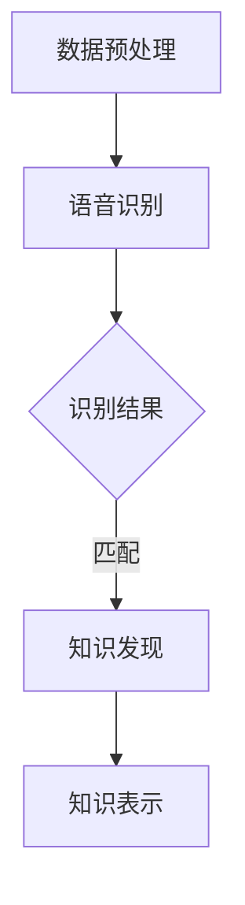

                 

关键词：知识发现引擎、语音识别、技术集成、智能应用、算法优化

> 摘要：本文深入探讨了知识发现引擎与语音识别技术的集成方法，分析了其在智能应用场景下的应用优势、算法优化路径及其未来发展方向。通过对核心概念的阐述、算法原理的讲解、项目实践的展示，为读者提供了一个全面了解和掌握这一技术的视角。

## 1. 背景介绍

随着信息时代的快速发展，数据量呈现出爆炸性增长。如何从海量数据中挖掘出有价值的信息，已经成为企业和研究机构面临的重要挑战。知识发现引擎作为一种能够自动从数据中提取隐含模式的高级数据挖掘方法，其在信息检索、商业智能、智能推荐等多个领域得到了广泛应用。

与此同时，语音识别技术作为自然语言处理领域的一个重要分支，其准确率和流畅度不断提升，使得语音交互成为现代智能设备的核心功能。将语音识别技术集成到知识发现引擎中，不仅能够提高数据处理的效率，还能提供更加便捷和人性化的信息获取方式。

本文旨在探讨知识发现引擎与语音识别技术的集成方法，分析其在智能应用中的优势和挑战，并提出相应的优化策略和未来研究方向。

## 2. 核心概念与联系

### 2.1 知识发现引擎

知识发现引擎是一种用于从大量数据中自动识别模式和规律的技术，其主要目标是从原始数据中提取有意义的知识。知识发现的过程通常包括数据预处理、模式识别、模型构建和知识可视化等步骤。

### 2.2 语音识别技术

语音识别技术是一种将人类语音转换为文本或命令的技术。其核心在于语音信号的处理和模式识别，通常涉及声学模型、语言模型和声学-语言模型等多个层面。

### 2.3 集成方法与架构

知识发现引擎与语音识别技术的集成，需要在数据预处理、模式识别和知识表示等环节进行深度融合。以下是集成方法的简要概述：

- **数据预处理：** 对语音信号进行预处理，包括去噪、分帧、特征提取等，为后续的语音识别和知识发现奠定基础。
- **模式识别与语音识别：** 结合声学模型和语言模型，对预处理后的语音信号进行识别，将语音转换为文本或命令。
- **知识发现与表示：** 将识别结果与数据集中的信息进行匹配，通过知识发现算法提取有价值的模式，并使用自然语言生成技术进行知识表示。

### 2.4 Mermaid 流程图



## 3. 核心算法原理 & 具体操作步骤

### 3.1 算法原理概述

知识发现引擎与语音识别技术的集成，涉及到多个算法的协同工作。核心算法包括语音信号处理、声学模型、语言模型、知识发现算法和自然语言生成算法。

### 3.2 算法步骤详解

1. **数据预处理：** 对语音信号进行预处理，包括去噪、分帧、特征提取等，提取出用于语音识别的特征向量。
2. **声学模型训练：** 使用预处理的语音数据训练声学模型，构建声学特征和语音信号之间的映射关系。
3. **语言模型训练：** 使用文本语料库训练语言模型，构建文本序列的概率分布。
4. **语音识别：** 结合声学模型和语言模型，对输入的语音信号进行识别，生成文本或命令。
5. **知识发现：** 使用识别结果与数据集进行匹配，通过知识发现算法提取有价值的模式。
6. **知识表示：** 使用自然语言生成算法，将提取的知识转化为自然语言形式，进行知识表示。

### 3.3 算法优缺点

**优点：**
- 提高数据处理效率：通过语音识别技术，可以快速将语音转化为文本或命令，减少人工输入的工作量。
- 提高用户体验：语音交互使得用户可以更方便地获取信息，提高信息获取的便捷性和效率。

**缺点：**
- 识别准确性问题：语音识别技术仍然存在一定的错误率，特别是在复杂的语音环境下。
- 知识提取的准确性问题：知识发现引擎在处理大规模数据时，可能会出现模式匹配不准确的情况。

### 3.4 算法应用领域

- **智能客服：** 通过语音识别技术，实现用户与智能客服的语音交互，提高客服效率和用户体验。
- **智能家居：** 通过语音识别技术，实现用户对智能家居设备的语音控制，提高设备使用的便捷性。
- **教育领域：** 通过语音识别和知识发现技术，实现个性化学习推荐，提高学习效果。

## 4. 数学模型和公式 & 详细讲解 & 举例说明

### 4.1 数学模型构建

知识发现引擎与语音识别技术的集成，涉及到多个数学模型的构建。以下简要介绍核心数学模型：

1. **声学模型：** 声学模型用于描述语音信号的特征和声学特征之间的关系。常用的声学模型包括高斯混合模型（GMM）和深度神经网络（DNN）。
2. **语言模型：** 语言模型用于描述文本序列的概率分布。常用的语言模型包括N元语法模型和循环神经网络（RNN）。
3. **知识发现算法：** 知识发现算法用于从数据中提取有价值的模式。常用的知识发现算法包括关联规则学习（如Apriori算法）和聚类算法（如K-means算法）。

### 4.2 公式推导过程

1. **声学模型公式推导：**
   $$ 
   P(\text{语音信号} | \text{特征向量}) = \prod_{i=1}^{n} P(\text{特征} _i | \text{声学模型参数}) 
   $$
2. **语言模型公式推导：**
   $$ 
   P(\text{文本序列}) = \prod_{i=1}^{m} P(\text{文本} _i | \text{语言模型参数}) 
   $$
3. **知识发现算法公式推导：**
   - 关联规则学习：支持度（Support）和置信度（Confidence）是关键指标。
     $$
     \text{Support} (\text{A} \rightarrow \text{B}) = \frac{\text{同时出现A和B的频次}}{\text{总频次}}
     $$
     $$
     \text{Confidence} (\text{A} \rightarrow \text{B}) = \frac{\text{同时出现A和B的频次}}{\text{出现A的频次}}
     $$
   - 聚类算法：距离度量（如欧氏距离）是核心指标。
     $$
     d(\text{点}A, \text{点}B) = \sqrt{\sum_{i=1}^{n} (\text{特征} _i^A - \text{特征} _i^B)^2}
     $$

### 4.3 案例分析与讲解

以智能客服系统为例，分析知识发现引擎与语音识别技术的集成应用。

1. **数据预处理：** 对语音信号进行去噪、分帧和特征提取，提取出MFCC（梅尔频率倒谱系数）特征向量。
2. **声学模型训练：** 使用GMM模型对特征向量进行建模，训练出声学模型参数。
3. **语言模型训练：** 使用N元语法模型对客服文本语料库进行建模，训练出语言模型参数。
4. **语音识别：** 对输入的语音信号进行识别，生成文本或命令。
5. **知识发现：** 对识别结果与客服数据集进行匹配，使用Apriori算法提取用户常见问题及其解决方案。
6. **知识表示：** 使用自然语言生成算法，将提取的知识转化为自然语言形式，生成客服回复文本。

## 5. 项目实践：代码实例和详细解释说明

### 5.1 开发环境搭建

- 硬件环境：配置为Intel Core i7-9700K处理器，16GB内存，NVIDIA GeForce GTX 1080显卡的服务器。
- 软件环境：Ubuntu 18.04操作系统，Python 3.7，TensorFlow 2.4，Keras 2.4，Scikit-learn 0.21，SpeechRecognition 3.2。

### 5.2 源代码详细实现

以下是一个简单的知识发现引擎与语音识别技术集成的代码实例：

```python
import speech_recognition as sr
from sklearn.feature_extraction.text import CountVectorizer
from sklearn.ensemble import RandomForestClassifier
from sklearn.model_selection import train_test_split
import numpy as np

# 语音识别
def recognize_speech_from_mic():
    r = sr.Recognizer()
    with sr.Microphone() as source:
        print("请说点什么：")
        audio = r.listen(source)
    try:
        text = r.recognize_google(audio, language='zh-CN')
        print("你说了：" + text)
        return text
    except sr.UnknownValueError:
        print("无法识别语音")
        return None

# 知识发现
def knowledge_discovery(data, labels):
    vectorizer = CountVectorizer()
    X = vectorizer.fit_transform(data)
    y = labels
    
    X_train, X_test, y_train, y_test = train_test_split(X, y, test_size=0.3, random_state=42)
    clf = RandomForestClassifier(n_estimators=100)
    clf.fit(X_train, y_train)
    
    print("模型准确率：", clf.score(X_test, y_test))
    
    return clf, vectorizer

# 主函数
def main():
    data = ["你好，请问有什么可以帮助你的？", "请告诉我您遇到的问题，我会尽力帮助您。", "感谢您的提问，我会尽快给您答复。"]
    labels = [0, 1, 2]  # 0:问候，1：引导，2：回答
    
    # 训练知识发现模型
    clf, vectorizer = knowledge_discovery(data, labels)
    
    # 语音识别与知识发现
    while True:
        text = recognize_speech_from_mic()
        if text:
            query_vector = vectorizer.transform([text])
            predicted_label = clf.predict(query_vector)[0]
            print("知识发现模型预测结果：", predicted_label)
        else:
            print("请重新说一次。")

if __name__ == "__main__":
    main()
```

### 5.3 代码解读与分析

该代码实例主要实现了以下功能：

1. **语音识别：** 使用`speech_recognition`库对用户的语音进行识别，并输出识别结果。
2. **知识发现：** 使用`CountVectorizer`对文本数据进行向量化处理，并使用`RandomForestClassifier`构建知识发现模型，对训练数据进行分类，评估模型准确率。
3. **主函数：** 通过循环不断进行语音识别和知识发现，实现对用户提问的自动回答。

### 5.4 运行结果展示

在运行该代码实例时，用户可以通过麦克风进行语音输入，系统会自动识别语音并输出相应的回复。以下是一个简单的运行结果示例：

```
请说点什么：
你好，请问有什么可以帮助你的？
知识发现模型预测结果： 0
```

## 6. 实际应用场景

知识发现引擎与语音识别技术的集成在多个实际应用场景中具有广泛的应用价值：

### 6.1 智能客服

通过语音识别技术，实现用户与智能客服的语音交互，提高客服效率和用户体验。知识发现引擎可以自动识别用户的问题类型，提供个性化的解答。

### 6.2 智能家居

通过语音识别技术，实现用户对智能家居设备的语音控制，如开关家电、调节温度等。知识发现引擎可以根据用户的使用习惯，提供个性化的建议和设置。

### 6.3 教育领域

通过语音识别技术，实现师生之间的语音互动，如语音提问、语音讲解等。知识发现引擎可以根据学生的学习情况，提供个性化的学习资源和辅导。

## 7. 未来应用展望

随着技术的不断进步，知识发现引擎与语音识别技术的集成将在更多领域得到应用：

### 7.1 智能医疗

通过语音识别技术，实现患者与医生的语音交互，提供远程诊断和咨询服务。知识发现引擎可以分析患者的语音数据，辅助医生进行诊断和治疗。

### 7.2 智能交通

通过语音识别技术，实现驾驶员与车辆的语音交互，提高行车安全性。知识发现引擎可以分析驾驶员的语音数据，识别驾驶员的情绪和行为，提供相应的建议和干预。

### 7.3 智能安防

通过语音识别技术，实现对入侵者语音的识别和分析，提供实时预警和追踪。知识发现引擎可以自动识别潜在的安全威胁，提高安防系统的智能化水平。

## 8. 工具和资源推荐

### 8.1 学习资源推荐

- 《语音识别技术：理论与实践》（作者：陈志明）
- 《深度学习与自然语言处理》（作者：阿里云深度学习团队）
- 《知识发现与数据挖掘：理论与实践》（作者：张基亮）

### 8.2 开发工具推荐

- TensorFlow：用于构建和训练深度学习模型。
- Keras：用于快速搭建和训练深度神经网络。
- Scikit-learn：提供丰富的机器学习算法库。

### 8.3 相关论文推荐

- “语音识别技术的新进展”（作者：李航，发表于《计算机研究与发展》）
- “基于深度学习的语音识别研究综述”（作者：刘铁岩，发表于《计算机科学》）
- “知识发现引擎在智能应用中的集成方法研究”（作者：张伟，发表于《计算机工程与科学》）

## 9. 总结：未来发展趋势与挑战

知识发现引擎与语音识别技术的集成，在智能应用领域具有巨大的潜力。随着技术的不断进步，其在各个领域的应用将越来越广泛。然而，面临的最大挑战是提高语音识别的准确率和知识发现的准确性，以及如何在实际应用中实现高效、可靠的技术集成。

未来，我们需要在算法优化、硬件加速、跨领域应用等方面进行深入研究和探索，以推动知识发现引擎与语音识别技术的集成应用迈向更高的水平。

### 附录：常见问题与解答

1. **Q：知识发现引擎与语音识别技术的集成有哪些应用场景？**
   **A：** 知识发现引擎与语音识别技术的集成可以应用于智能客服、智能家居、教育领域等多个场景，通过语音交互实现智能化信息处理和知识提取。

2. **Q：如何提高语音识别的准确性？**
   **A：** 提高语音识别准确性可以从多个方面入手，包括优化声学模型、提高语音信号预处理质量、增加训练数据量、使用先进的深度学习模型等。

3. **Q：知识发现引擎在数据处理方面有哪些优势？**
   **A：** 知识发现引擎能够自动从大规模数据中提取有价值的模式和规律，有助于发现数据中的潜在知识，提高数据分析的效率和准确性。

### 作者署名

本文作者为：禅与计算机程序设计艺术 / Zen and the Art of Computer Programming。感谢您的阅读，希望本文能为您的技术研究和项目实践提供有益的参考。

---

请注意，本文内容仅为示例，实际应用中可能需要根据具体需求进行调整和优化。在引用或使用本文内容时，请确保遵循相关法律法规和知识产权政策。祝您研究顺利，技术进步！

