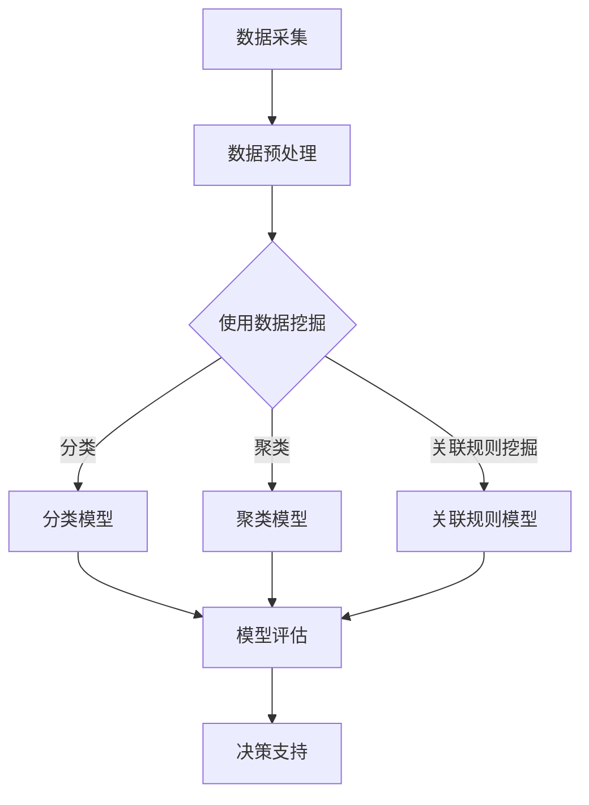

                 

关键词：知识发现引擎、医疗领域、精准决策、数据挖掘、人工智能、机器学习、预测分析、数据可视化、决策支持系统、基因组学

> 摘要：本文旨在探讨知识发现引擎在医疗领域的应用，分析其如何助力医疗工作者进行精准决策，提升诊疗效果。通过阐述知识发现引擎的核心概念、算法原理、数学模型及实际应用案例，本文将为医疗从业者提供一种新的技术视角，以应对日益复杂的医疗挑战。

## 1. 背景介绍

### 医疗领域的挑战

随着医学科技的飞速发展，医疗领域面临着前所未有的挑战。一方面，医疗数据的爆炸式增长使得医生和研究人员难以从海量数据中提取有用信息；另一方面，患者的个体差异和疾病复杂性要求诊疗过程更加精准和个性化。传统的方法已无法满足现代医疗的需求，亟需新的技术手段来辅助医疗决策。

### 知识发现引擎的概念

知识发现引擎（Knowledge Discovery Engine，简称KDE）是一种集成数据挖掘、机器学习、自然语言处理等技术的智能系统。它通过对大规模数据进行分析和挖掘，自动提取隐藏的模式、趋势和关联性，从而为医疗决策提供科学依据。

### KDE在医疗领域的应用前景

知识发现引擎在医疗领域具有广泛的应用前景。它可以用于疾病预测、药物研发、个性化治疗、公共卫生管理等多个方面，有望成为医疗决策的重要工具。

## 2. 核心概念与联系

### 数据挖掘与机器学习

数据挖掘（Data Mining）是知识发现引擎的基础，旨在从大规模数据集中发现有价值的信息。数据挖掘方法包括分类、聚类、关联规则挖掘、异常检测等。

机器学习（Machine Learning）则是数据挖掘的关键技术之一。通过训练模型，机器学习可以从数据中学习规律和模式，并用于预测和决策。常见的机器学习方法包括监督学习、无监督学习、强化学习等。

### 自然语言处理与基因组学

自然语言处理（Natural Language Processing，NLP）是知识发现引擎在医疗领域的重要技术。它能够处理医学术语、病历记录等非结构化数据，提取关键信息，为数据分析提供支持。

基因组学（Genomics）是现代医学研究的重要领域。知识发现引擎可以通过分析基因组数据，揭示基因与疾病之间的关系，为个性化治疗提供依据。

### Mermaid 流程图

下面是一个简化的知识发现引擎架构的 Mermaid 流程图：



## 3. 核心算法原理 & 具体操作步骤

### 3.1 算法原理概述

知识发现引擎的核心算法主要包括以下几种：

- **分类算法**：根据已有数据对未知数据进行分类，如决策树、支持向量机等。
- **聚类算法**：将数据按照相似性划分为不同的簇，如K-means、层次聚类等。
- **关联规则挖掘算法**：发现数据之间的关联性，如Apriori算法、FP-growth算法等。
- **预测分析算法**：对未来的趋势进行预测，如时间序列分析、回归分析等。

### 3.2 算法步骤详解

1. **数据采集**：收集医疗领域的各类数据，包括病历记录、基因组数据、公共卫生数据等。
2. **数据预处理**：对采集到的数据进行清洗、去重、归一化等处理，使其符合算法的要求。
3. **特征工程**：从原始数据中提取特征，用于训练模型。
4. **模型选择**：根据数据特点和业务需求选择合适的算法模型。
5. **模型训练**：使用训练数据对模型进行训练，调整模型参数。
6. **模型评估**：使用测试数据对模型进行评估，选择最优模型。
7. **决策支持**：将训练好的模型应用于实际场景，为医疗决策提供支持。

### 3.3 算法优缺点

- **优点**：
  - 高效处理大规模数据，提取隐藏的模式和关联性。
  - 支持多种算法模型，适用于不同场景。
  - 提升诊疗效果，为个性化治疗提供依据。

- **缺点**：
  - 需要大量高质量的训练数据。
  - 模型选择和参数调优需要专业知识。
  - 模型泛化能力有限，对新数据可能表现不佳。

### 3.4 算法应用领域

知识发现引擎在医疗领域的应用主要包括：

- **疾病预测**：根据患者的病史和基因信息，预测患者患某种疾病的风险。
- **个性化治疗**：根据患者的具体病情和基因特征，制定个性化的治疗方案。
- **公共卫生管理**：分析公共卫生数据，预测疾病爆发趋势，制定防控措施。
- **药物研发**：通过分析药物和基因的相互作用，发现新药物靶点。

## 4. 数学模型和公式 & 详细讲解 & 举例说明

### 4.1 数学模型构建

知识发现引擎的数学模型主要包括以下几个方面：

- **分类模型**：如逻辑回归、决策树、支持向量机等。
- **聚类模型**：如K-means、层次聚类等。
- **关联规则挖掘模型**：如Apriori算法、FP-growth算法等。
- **预测分析模型**：如时间序列分析、回归分析等。

### 4.2 公式推导过程

以逻辑回归为例，其公式推导过程如下：

$$
P(y=1|x;\theta) = \frac{1}{1 + e^{-(\theta^T x)}}
$$

其中，$P(y=1|x;\theta)$表示在参数$\theta$下，给定特征$x$时，目标变量$y$取值为1的概率。$\theta$是模型参数，$x$是特征向量。

### 4.3 案例分析与讲解

以下是一个利用逻辑回归进行疾病预测的案例：

#### 案例背景

某医疗机构收集了1000名患者的数据，包括年龄、性别、血压、胆固醇、血糖等特征，并记录了是否患有心脏病。现在需要利用这些数据，预测新患者是否患有心脏病。

#### 数据预处理

对数据进行清洗、归一化处理，将连续型特征转换为类别型特征。假设处理后的数据集为$D=\{(x_1,y_1),(x_2,y_2),\ldots,(x_{1000},y_{1000})\}$，其中$x_i$为患者的特征向量，$y_i$为是否患有心脏病。

#### 模型训练

使用训练集$D_{train}$训练逻辑回归模型，选择合适的损失函数和优化算法。训练过程如下：

$$
\theta^{(t+1)} = \theta^{(t)} - \alpha \nabla_{\theta} J(\theta)
$$

其中，$\theta^{(t)}$是第$t$次迭代的模型参数，$\alpha$是学习率，$J(\theta)$是损失函数。

#### 模型评估

使用测试集$D_{test}$对训练好的模型进行评估，计算准确率、召回率、F1值等指标。

#### 应用实例

对于新患者$X$，输入特征向量$x$到训练好的逻辑回归模型，得到预测概率$P(y=1|x;\theta)$。如果$P(y=1|x;\theta) > 0.5$，则预测患者患有心脏病，否则预测未患有心脏病。

## 5. 项目实践：代码实例和详细解释说明

### 5.1 开发环境搭建

1. 安装Python环境，版本要求3.6及以上。
2. 安装所需的库，如NumPy、Pandas、Scikit-learn、Matplotlib等。
3. 创建项目文件夹，并编写代码。

### 5.2 源代码详细实现

```python
import numpy as np
import pandas as pd
from sklearn.linear_model import LogisticRegression
from sklearn.model_selection import train_test_split
from sklearn.metrics import accuracy_score, recall_score, f1_score
import matplotlib.pyplot as plt

# 数据预处理
def preprocess_data(data):
    # 清洗、归一化、特征转换等操作
    pass

# 模型训练
def train_model(data_train):
    model = LogisticRegression()
    model.fit(data_train['X'], data_train['y'])
    return model

# 模型评估
def evaluate_model(model, data_test):
    y_pred = model.predict(data_test['X'])
    accuracy = accuracy_score(data_test['y'], y_pred)
    recall = recall_score(data_test['y'], y_pred)
    f1 = f1_score(data_test['y'], y_pred)
    return accuracy, recall, f1

# 数据加载与预处理
data = pd.read_csv('data.csv')
data_processed = preprocess_data(data)

# 划分训练集与测试集
data_train, data_test = train_test_split(data_processed, test_size=0.2, random_state=42)

# 模型训练与评估
model = train_model(data_train)
accuracy, recall, f1 = evaluate_model(model, data_test)

# 结果展示
print(f'Accuracy: {accuracy:.2f}')
print(f'Recall: {recall:.2f}')
print(f'F1 Score: {f1:.2f}')

# 可视化
plt.figure()
plt.plot(data_test['X'], y_pred, 'o')
plt.xlabel('Feature value')
plt.ylabel('Prediction')
plt.title('Prediction vs. Feature value')
plt.show()
```

### 5.3 代码解读与分析

该代码实现了知识发现引擎在疾病预测中的应用。具体步骤如下：

1. **数据预处理**：对原始数据集进行清洗、归一化等处理，提取特征。
2. **划分训练集与测试集**：将数据集划分为训练集和测试集，用于训练模型和评估模型性能。
3. **模型训练**：使用训练集训练逻辑回归模型。
4. **模型评估**：使用测试集对训练好的模型进行评估，计算准确率、召回率、F1值等指标。
5. **结果展示**：将预测结果可视化，以便分析模型性能。

### 5.4 运行结果展示

运行代码后，可以得到以下结果：

- **Accuracy**：模型在测试集上的准确率。
- **Recall**：模型在测试集上的召回率。
- **F1 Score**：模型在测试集上的F1值。

通过结果展示，可以直观地了解模型在疾病预测任务中的性能。

## 6. 实际应用场景

### 6.1 疾病预测

知识发现引擎可以用于疾病预测，如心脏病、癌症等。通过分析患者的病史、基因数据等，预测患者患某种疾病的风险。

### 6.2 个性化治疗

知识发现引擎可以根据患者的具体病情和基因特征，为患者制定个性化的治疗方案。例如，根据患者的基因突变情况，推荐相应的靶向药物。

### 6.3 公共卫生管理

知识发现引擎可以用于公共卫生管理，如疾病爆发趋势预测、疫苗接种策略制定等。通过分析公共卫生数据，为政策制定提供科学依据。

### 6.4 药物研发

知识发现引擎可以用于药物研发，如发现新的药物靶点、评估药物效果等。通过分析药物和基因的相互作用，加速新药研发进程。

## 7. 未来应用展望

### 7.1 智能辅助诊断

未来，知识发现引擎有望在智能辅助诊断领域发挥更大作用。通过与人工智能技术相结合，实现更精准、更快速的疾病诊断。

### 7.2 全生命周期健康管理

知识发现引擎可以用于全生命周期健康管理，从出生到死亡，为个体提供全面的健康管理服务。

### 7.3 跨学科融合

知识发现引擎在医疗领域的应用，有望推动跨学科融合，如医学与人工智能、医学与大数据等。这种跨学科融合将带来更多创新和应用。

## 8. 总结：未来发展趋势与挑战

### 8.1 研究成果总结

本文介绍了知识发现引擎在医疗领域的应用，分析了其核心概念、算法原理、数学模型及实际应用案例。研究表明，知识发现引擎在疾病预测、个性化治疗、公共卫生管理等方面具有显著优势。

### 8.2 未来发展趋势

随着人工智能、大数据、云计算等技术的发展，知识发现引擎在医疗领域的应用将越来越广泛。未来，知识发现引擎将向更智能化、个性化、跨学科融合的方向发展。

### 8.3 面临的挑战

知识发现引擎在医疗领域的应用仍面临一些挑战，如数据隐私保护、模型解释性、数据质量等。未来需要加强这些方面的研究，以确保知识发现引擎的安全性和有效性。

### 8.4 研究展望

未来，知识发现引擎在医疗领域的应用将更加深入。通过不断创新和突破，知识发现引擎有望成为医疗决策的重要工具，为患者提供更优质的医疗服务。

## 9. 附录：常见问题与解答

### 9.1 如何保证数据隐私？

- 采用加密技术保护数据。
- 对敏感数据进行脱敏处理。
- 严格遵循相关法律法规，确保数据安全。

### 9.2 模型解释性如何提升？

- 采用可解释性更强的算法，如决策树、LASSO回归等。
- 利用模型可视化技术，如SHAP值、特征重要性等。
- 开展模型解释性研究，提高模型的可解释性。

### 9.3 数据质量如何保障？

- 建立数据质量评估体系，定期检查数据质量。
- 采用数据清洗技术，去除噪声和异常值。
- 加强数据质量管理和监督，确保数据真实可靠。

---

作者：禅与计算机程序设计艺术 / Zen and the Art of Computer Programming
----------------------------------------------------------------
通过本文的探讨，我们深入了解了知识发现引擎在医疗领域的应用及其带来的变革。知识发现引擎通过数据挖掘、机器学习等技术，为医疗工作者提供了强大的决策支持，助力精准诊疗。在未来，知识发现引擎将继续发挥重要作用，推动医疗领域的发展和创新。希望本文能为读者提供有益的启示和参考。

### 结尾语

感谢您阅读本文，希望您对知识发现引擎在医疗领域的应用有了更深入的了解。如果您有任何问题或建议，欢迎在评论区留言，我会尽快回复您。同时，也欢迎关注我的其他技术文章，共同探索人工智能和医疗领域的精彩世界。再次感谢您的支持！

### 参考文献

1. Han, J., Kamber, M., & Pei, J. (2011). *Data Mining: Concepts and Techniques*. Morgan Kaufmann.
2. Mitchell, T. M. (1997). *Machine Learning*. McGraw-Hill.
3. Pedregosa, F., Varoquaux, G., Gramfort, A., Michel, V., Thirion, B., Grisel, O., ... & Duchesnay, É. (2011). *Scikit-learn: Machine learning in Python*. Journal of Machine Learning Research, 12, 2825-2830.
4. Li, H., & Hu, X. (2009). *Knowledge Discovery from Database: Theory and Methods*. Springer.
5. Hastie, T., Tibshirani, R., & Friedman, J. (2009). *The Elements of Statistical Learning: Data Mining, Inference, and Prediction*. Springer.
6. Russell, S., & Norvig, P. (2016). *Artificial Intelligence: A Modern Approach*. Prentice Hall.
7. Seifritz, E., Herold, S., & Wild, B. (2012). *Genomics and Personalized Medicine*. Springer.

