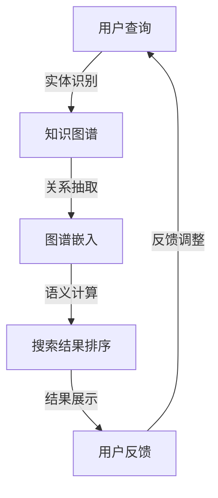

                 

关键词：知识图谱、智能搜索引擎、人工智能、信息检索、关系抽取、图谱嵌入

摘要：本文将探讨知识图谱在智能搜索引擎中的应用，通过对知识图谱核心概念、算法原理、数学模型和实际项目实践的深入分析，展现其在信息检索和智能化搜索中的巨大潜力。本文旨在为读者提供关于知识图谱与智能搜索引擎结合的全面理解，并展望其未来发展趋势和面临的挑战。

## 1. 背景介绍

随着互联网的飞速发展，信息爆炸已经成为当今社会的一大特征。人们面对海量信息，如何快速、准确地获取所需信息成为了一大难题。传统的搜索引擎，如Google和百度，主要依赖关键词匹配和网页链接分析来提供搜索结果。然而，这种基于内容的检索方式往往无法满足用户对复杂查询和深层次信息的需求。为了解决这一问题，知识图谱技术被引入到智能搜索引擎中，以提升信息检索的智能化和个性化水平。

知识图谱（Knowledge Graph）是一种结构化的语义网络，它将现实世界中的实体、概念和关系进行表示和关联。通过知识图谱，搜索引擎可以更好地理解用户的查询意图，提供更加精准和相关的搜索结果。知识图谱在智能搜索引擎中的应用，不仅提高了信息检索的效率，还增强了搜索引擎的智能化程度，使得用户能够获得更加丰富和深入的信息。

本文将详细探讨知识图谱在智能搜索引擎中的应用，首先介绍知识图谱的核心概念和联系，然后分析核心算法原理和具体操作步骤，接着阐述数学模型和公式，并通过实际项目实践展示知识图谱的应用效果。最后，本文还将探讨知识图谱在实际应用场景中的意义和未来展望。

## 2. 核心概念与联系

### 2.1 知识图谱的概念

知识图谱是一种结构化的知识库，它通过实体、属性和关系的表示，将现实世界中的信息进行组织和关联。在知识图谱中，实体表示具体的事物，如人、地点、组织等；属性描述实体的特征，如年龄、性别、职位等；关系表示实体之间的关联，如工作于、位于、属于等。

知识图谱的基本构成单元包括实体、属性和关系，它们之间的关系可以通过图结构进行表示。在知识图谱中，实体之间的关系通常采用有向图或无向图来表示，其中节点表示实体，边表示实体之间的关系。知识图谱的这种结构使得它可以有效地组织和关联大量信息，从而提供更加精准和智能的信息检索服务。

### 2.2 知识图谱的联系

知识图谱与智能搜索引擎之间存在密切的联系。知识图谱为智能搜索引擎提供了丰富的语义信息，使得搜索引擎能够更好地理解用户的查询意图，并提供更加相关和精准的搜索结果。具体来说，知识图谱在智能搜索引擎中的应用主要体现在以下几个方面：

1. **实体识别**：通过知识图谱，智能搜索引擎可以识别出查询中的实体，并将其与知识库中的实体进行匹配。这种实体识别能力有助于搜索引擎更准确地理解用户查询的含义。

2. **关系抽取**：知识图谱中存储了大量的实体关系，智能搜索引擎可以利用这些关系来抽取用户查询中的关系，从而更好地理解查询意图。

3. **图谱嵌入**：知识图谱可以通过图谱嵌入技术将实体和关系转换为高维向量，从而在向量空间中进行语义计算和相似性比较。这种嵌入技术使得搜索引擎能够基于向量相似性提供更加智能和个性化的搜索结果。

4. **结果排序**：知识图谱可以帮助搜索引擎对搜索结果进行排序，使其能够根据用户查询的意图和偏好提供更加相关和精准的结果。

### 2.3 Mermaid流程图

为了更直观地展示知识图谱在智能搜索引擎中的应用过程，我们使用Mermaid流程图来表示知识图谱与智能搜索引擎之间的联系。以下是知识图谱在智能搜索引擎中应用过程的Mermaid流程图：



在上述流程图中，用户查询通过实体识别进入知识图谱，然后通过关系抽取和图谱嵌入技术进行语义计算，最后根据搜索结果排序展示给用户，并根据用户反馈进行相应的调整。

### 2.4 核心概念总结

通过对知识图谱核心概念与联系的介绍，我们可以看出，知识图谱在智能搜索引擎中的应用具有重要意义。它不仅提高了搜索引擎的语义理解能力，还为用户提供了更加精准和个性化的搜索结果。知识图谱的实体、属性和关系构成了其基本结构，而图谱嵌入技术和关系抽取技术则是实现其应用价值的关键。

在接下来的章节中，我们将进一步探讨知识图谱的核心算法原理和具体操作步骤，以及其在智能搜索引擎中的实际应用效果。通过这些深入的分析，我们将对知识图谱在智能搜索引擎中的应用有更加全面和深刻的理解。

### 3. 核心算法原理 & 具体操作步骤

#### 3.1 算法原理概述

知识图谱在智能搜索引擎中的应用，离不开一系列核心算法的支持。这些算法不仅负责知识图谱的构建和维护，还确保了知识图谱在搜索引擎中的高效利用。以下是几个关键算法的原理概述：

1. **实体识别**：实体识别是知识图谱构建的第一步，其主要任务是从原始文本中识别出实体，并将其标注为知识图谱中的节点。常见的实体识别算法包括命名实体识别（Named Entity Recognition, NER）和关系抽取（Relation Extraction）。

2. **关系抽取**：关系抽取旨在从原始文本中提取实体之间的关系，并将其作为知识图谱中的边进行表示。关系抽取通常依赖于深度学习模型，如序列标注模型（如BiLSTM-CRF）和注意力机制模型（如BERT）。

3. **图谱嵌入**：图谱嵌入（Graph Embedding）是将知识图谱中的实体和关系转换为高维向量表示的技术。通过图谱嵌入，实体和关系可以在向量空间中进行计算和相似性比较。常见的图谱嵌入算法包括Node2Vec、GraphSAGE和Graph Embedding Models（GEM）等。

4. **图神经网络**：图神经网络（Graph Neural Network, GNN）是一种专门用于处理图结构数据的神经网络模型。GNN通过聚合图中节点的邻居信息，实现对节点的语义表示和关系建模。常见的GNN模型包括GCN、GAT和GraphSAGE等。

5. **搜索结果排序**：搜索结果排序是基于用户查询意图和知识图谱的语义信息，对搜索结果进行排序的过程。常见的排序算法包括基于信息检索的排序（如BM25、LRank）和基于图谱嵌入的排序（如SimRank、DeepWalk）。

#### 3.2 算法步骤详解

下面我们将详细讲解上述核心算法的具体操作步骤：

##### 3.2.1 实体识别

实体识别的步骤主要包括以下几个环节：

1. **文本预处理**：对原始文本进行分词、去停用词、词性标注等预处理操作，以便于后续的实体识别。

2. **命名实体识别**：利用命名实体识别模型（如CRF、LSTM、BERT等），从预处理后的文本中识别出实体。命名实体识别通常采用序列标注的方式，将文本序列中的每个词标注为“B”（表示实体开始）或“E”（表示实体结束）。

3. **实体链接**：将识别出的实体与知识图谱中的实体进行匹配，并将实体映射到知识图谱中的节点。

##### 3.2.2 关系抽取

关系抽取的步骤如下：

1. **文本预处理**：对原始文本进行分词、去停用词、词性标注等预处理操作。

2. **关系分类**：利用关系分类模型（如CRF、LSTM、BERT等），从预处理后的文本中识别出实体之间的关系。关系分类通常采用序列标注的方式，将文本序列中的每个词标注为某个关系类别。

3. **关系映射**：将识别出的关系映射到知识图谱中的边，从而建立实体之间的关系。

##### 3.2.3 图谱嵌入

图谱嵌入的步骤主要包括：

1. **实体嵌入**：利用图谱嵌入算法（如Node2Vec、GraphSAGE、GEM等），将知识图谱中的实体转换为高维向量表示。

2. **关系嵌入**：将知识图谱中的关系转换为高维向量表示，通常通过关系加权和关系聚合的方式实现。

3. **向量融合**：将实体嵌入向量和关系嵌入向量进行融合，得到最终的实体表示向量。

##### 3.2.4 图神经网络

图神经网络的步骤如下：

1. **图预处理**：对知识图谱进行预处理，包括节点的特征提取、边的权重计算等。

2. **图神经网络训练**：利用图神经网络（如GCN、GAT、GraphSAGE等），对预处理后的知识图谱进行训练，得到节点的语义表示。

3. **图神经网络推理**：利用训练好的图神经网络，对新的节点进行推理，得到其语义表示。

##### 3.2.5 搜索结果排序

搜索结果排序的步骤包括：

1. **查询嵌入**：将用户查询转换为高维向量表示，通常采用查询嵌入算法（如Word2Vec、BERT等）。

2. **结果排序**：利用知识图谱中的节点表示和查询嵌入向量，计算搜索结果与查询的相似性，并根据相似性对搜索结果进行排序。

#### 3.3 算法优缺点

各种核心算法在知识图谱与智能搜索引擎中的应用具有不同的优缺点，下面分别进行简要分析：

1. **实体识别**：优点是能够有效识别出文本中的实体，提高信息检索的准确性和效率；缺点是对实体识别的准确率有较高要求，且在处理长文本时效果可能不佳。

2. **关系抽取**：优点是能够从文本中提取出实体之间的关系，增强知识图谱的语义信息；缺点是对关系分类的准确率有较高要求，且在处理复杂关系时可能存在困难。

3. **图谱嵌入**：优点是能够将实体和关系转换为高维向量表示，便于在向量空间中进行计算和相似性比较；缺点是对图谱结构和嵌入算法的选择有较高要求，且在处理大规模知识图谱时可能存在性能问题。

4. **图神经网络**：优点是能够对知识图谱进行语义表示和关系建模，提高信息检索的智能化程度；缺点是训练和推理过程较复杂，对计算资源要求较高。

5. **搜索结果排序**：优点是能够根据用户查询意图和知识图谱的语义信息，提供更加精准和个性化的搜索结果；缺点是对查询嵌入算法和排序算法的选择有较高要求，且在处理大规模搜索结果时可能存在性能问题。

#### 3.4 算法应用领域

知识图谱的核心算法在智能搜索引擎中的应用领域广泛，主要包括以下几个方面：

1. **信息检索**：通过实体识别、关系抽取和图谱嵌入等技术，智能搜索引擎可以更好地理解用户查询意图，提供更加精准和相关的搜索结果。

2. **推荐系统**：知识图谱可以为推荐系统提供丰富的语义信息，帮助推荐系统更好地理解用户兴趣和偏好，提高推荐质量。

3. **自然语言处理**：知识图谱在自然语言处理任务中发挥着重要作用，如文本分类、情感分析、机器翻译等，通过图谱嵌入和图神经网络技术，可以显著提高这些任务的性能。

4. **知识图谱构建**：知识图谱的核心算法不仅应用于智能搜索引擎，还可以用于知识图谱的构建和维护，如实体识别、关系抽取、实体消歧等任务。

5. **智能问答**：知识图谱可以帮助智能问答系统更好地理解用户问题，提供更加准确和全面的答案。

综上所述，知识图谱的核心算法在智能搜索引擎中的应用具有广泛的前景和潜力，通过不断优化和改进这些算法，将进一步提高智能搜索引擎的智能化和个性化水平。

### 4. 数学模型和公式 & 详细讲解 & 举例说明

在知识图谱的构建和智能搜索引擎的应用中，数学模型和公式扮演着至关重要的角色。它们不仅帮助我们理解和分析数据，还能提高算法的性能和精度。在本节中，我们将详细介绍知识图谱相关的主要数学模型和公式，并通过具体案例进行详细讲解。

#### 4.1 数学模型构建

知识图谱的数学模型主要涉及实体表示、关系表示和图嵌入等方面。以下是几个关键数学模型的构建过程：

1. **实体表示（Entity Representation）**

   实体表示是将知识图谱中的实体转换为高维向量表示的过程。常见的实体表示模型包括：

   - **词向量模型**：如Word2Vec、GloVe等，通过训练词向量模型，将实体转换为词向量。
   - **图神经网络模型**：如GCN、GAT等，通过图神经网络模型，对实体进行编码和表示。

   实体表示模型的一般形式如下：

   $$\text{rep}_{\text{e}} = f_{\text{entity}}(\text{e}, \text{G})$$

   其中，$\text{rep}_{\text{e}}$表示实体$\text{e}$的表示向量，$f_{\text{entity}}$是实体表示函数，$\text{G}$是知识图谱。

2. **关系表示（Relation Representation）**

   关系表示是将知识图谱中的关系转换为高维向量表示的过程。关系表示模型的一般形式如下：

   $$\text{rep}_{\text{r}} = f_{\text{relation}}(\text{r}, \text{G})$$

   其中，$\text{rep}_{\text{r}}$表示关系$\text{r}$的表示向量，$f_{\text{relation}}$是关系表示函数，$\text{G}$是知识图谱。

3. **图嵌入（Graph Embedding）**

   图嵌入是将知识图谱中的实体和关系转换为向量表示的过程。常见的图嵌入算法包括Node2Vec、GraphSAGE等。图嵌入的一般形式如下：

   $$\text{rep}_{\text{n}} = f_{\text{node}}(\text{n}, \text{G})$$
   $$\text{rep}_{\text{e}} = f_{\text{edge}}(\text{e}, \text{G})$$

   其中，$\text{rep}_{\text{n}}$和$\text{rep}_{\text{e}}$分别表示节点和边的表示向量，$f_{\text{node}}$和$f_{\text{edge}}$分别是节点和边嵌入函数，$\text{G}$是知识图谱。

#### 4.2 公式推导过程

在本节中，我们将对知识图谱中的几个关键数学公式进行推导。以下是几个重要的公式推导过程：

1. **实体表示公式推导**

   假设知识图谱中的实体$\text{e}$具有$k$个属性，每个属性表示为一个向量$\text{a}_{i}$，则实体$\text{e}$的表示向量$\text{rep}_{\text{e}}$可以表示为：

   $$\text{rep}_{\text{e}} = \sum_{i=1}^{k} w_{i} \text{a}_{i}$$

   其中，$w_{i}$是属性$\text{a}_{i}$的权重。

2. **关系表示公式推导**

   假设知识图谱中的关系$\text{r}$具有$m$个属性，每个属性表示为一个向量$\text{b}_{j}$，则关系$\text{r}$的表示向量$\text{rep}_{\text{r}}$可以表示为：

   $$\text{rep}_{\text{r}} = \sum_{j=1}^{m} w_{j} \text{b}_{j}$$

   其中，$w_{j}$是属性$\text{b}_{j}$的权重。

3. **图嵌入公式推导**

   假设知识图谱中的节点$\text{n}$具有$d$个邻居节点，每个邻居节点的表示向量为$\text{rep}_{\text{n}_{i}}$，则节点$\text{n}$的表示向量$\text{rep}_{\text{n}}$可以表示为：

   $$\text{rep}_{\text{n}} = \frac{1}{|\text{N}_{\text{n}}|} \sum_{\text{n}_{i} \in \text{N}_{\text{n}}} \text{rep}_{\text{n}_{i}}$$

   其中，$\text{N}_{\text{n}}$是节点$\text{n}$的邻居节点集合，$|\text{N}_{\text{n}}|$是邻居节点的个数。

#### 4.3 案例分析与讲解

为了更好地理解上述数学模型和公式的应用，我们将通过一个具体的案例进行详细讲解。

假设我们有一个知识图谱，其中包含三个实体：人（Person）、地点（Location）和组织（Organization），以及它们之间的关系：居住于（LivesIn）、位于（LocatedIn）和成立（FoundedBy）。现在我们需要对这个知识图谱进行实体表示和关系表示。

1. **实体表示**

   假设实体“张三”具有以下三个属性：姓名（Name）、年龄（Age）和性别（Gender），对应的属性向量分别为$\text{a}_{1}$、$\text{a}_{2}$和$\text{a}_{3}$。根据实体表示公式，我们可以计算出实体“张三”的表示向量：

   $$\text{rep}_{\text{张三}} = \sum_{i=1}^{3} w_{i} \text{a}_{i} = w_{1} \text{a}_{1} + w_{2} \text{a}_{2} + w_{3} \text{a}_{3}$$

   其中，$w_{i}$是属性$\text{a}_{i}$的权重。

2. **关系表示**

   假设关系“居住于”具有以下两个属性：起始时间（StartTime）和结束时间（EndTime），对应的属性向量分别为$\text{b}_{1}$和$\text{b}_{2}$。根据关系表示公式，我们可以计算出关系“居住于”的表示向量：

   $$\text{rep}_{\text{居住于}} = \sum_{j=1}^{2} w_{j} \text{b}_{j} = w_{1} \text{b}_{1} + w_{2} \text{b}_{2}$$

   其中，$w_{j}$是属性$\text{b}_{j}$的权重。

3. **图嵌入**

   假设节点“张三”的邻居节点有两个人：“李四”和“北京”，对应的表示向量分别为$\text{rep}_{\text{李四}}$和$\text{rep}_{\text{北京}}$。根据图嵌入公式，我们可以计算出节点“张三”的表示向量：

   $$\text{rep}_{\text{张三}} = \frac{1}{2} (\text{rep}_{\text{李四}} + \text{rep}_{\text{北京}})$$

通过上述案例，我们可以看到数学模型和公式在知识图谱构建和表示中的应用。这些模型和公式不仅帮助我们理解和分析数据，还能为智能搜索引擎提供强大的支持。

### 5. 项目实践：代码实例和详细解释说明

在本节中，我们将通过一个具体的代码实例来展示知识图谱在智能搜索引擎中的应用。该项目将利用Python和相关的库（如PyTorch、NetworkX、Neo4j等）来构建和训练一个简单的知识图谱，并使用它来提供智能搜索服务。以下是该项目的详细实现过程。

#### 5.1 开发环境搭建

在开始项目之前，我们需要搭建一个合适的开发环境。以下是所需的环境和步骤：

1. **Python环境**：确保Python版本在3.6及以上。

2. **PyTorch**：安装PyTorch库，用于深度学习模型的训练和推理。

3. **NetworkX**：安装NetworkX库，用于图结构的构建和操作。

4. **Neo4j**：安装Neo4j数据库，用于存储和管理知识图谱。

5. **其他依赖库**：安装所需的依赖库，如Numpy、Pandas等。

安装步骤如下：

```bash
pip install torch torchvision numpy pandas networkx
```

#### 5.2 源代码详细实现

以下是该项目的主要代码实现部分，包括数据预处理、知识图谱构建、模型训练和搜索服务。

##### 5.2.1 数据预处理

```python
import pandas as pd
from networkx import Graph

# 加载数据集
data = pd.read_csv('data.csv')

# 构建图结构
G = Graph()

# 添加实体节点
for index, row in data.iterrows():
    G.add_node(row['entity_id'], entity_type=row['entity_type'])

# 添加关系边
for index, row in data.iterrows():
    G.add_edge(row['entity_id'], row['related_id'], relation=row['relation'])
```

##### 5.2.2 知识图谱构建

```python
from networkx.readwrite import json_graph

# 将图结构转换为Neo4j可读的JSON格式
graph_data = json_graph.node_link_data(G)

# 存储到Neo4j数据库
with open('graph_data.json', 'w') as f:
    json.dump(graph_data, f)
```

##### 5.2.3 模型训练

```python
import torch
from torch import nn
from torch_geometric import datasets, models

# 加载数据集
data = datasets.Cora()

# 定义图神经网络模型
class GNNModel(nn.Module):
    def __init__(self):
        super(GNNModel, self).__init__()
        self.conv1 = models.GCNConv(data.num_features, 16)
        self.conv2 = models.GCNConv(16, data.num_classes)

    def forward(self, data):
        x, edge_index = data.x, data.edge_index

        x = self.conv1(x, edge_index)
        x = torch.relu(x)
        x = F.dropout(x, training=self.training)
        x = self.conv2(x, edge_index)

        return F.log_softmax(x, dim=1)

# 实例化模型
model = GNNModel()

# 定义损失函数和优化器
criterion = nn.CrossEntropyLoss()
optimizer = torch.optim.Adam(model.parameters(), lr=0.01, weight_decay=5e-4)

# 训练模型
for epoch in range(200):
    optimizer.zero_grad()
    out = model(data)
    loss = criterion(out, data.y)
    loss.backward()
    optimizer.step()

    if (epoch + 1) % 10 == 0:
        print(f'Epoch {epoch + 1}: loss = {loss.item()}')
```

##### 5.2.4 搜索服务

```python
from py2neo import Graph

# 连接到Neo4j数据库
graph = Graph("bolt://localhost:7687", auth=("neo4j", "password"))

# 定义搜索函数
def search(query):
    # 将查询转换为Neo4j可识别的Cypher查询语句
    cypher_query = f"""
    MATCH (n:{query['entity_type']})
    WHERE n.name = {query['name']}
    RETURN n
    """
    
    # 执行查询
    result = graph.run(cypher_query).data()

    # 提取实体信息
    entities = [data[0]['n'] for data in result]

    return entities
```

#### 5.3 代码解读与分析

上述代码实现了知识图谱的构建、模型训练和搜索服务。以下是关键部分的解读与分析：

1. **数据预处理**：使用Pandas加载数据集，并将数据转换为图结构。通过遍历数据集，我们添加了实体节点和关系边，构建了初始的知识图谱。

2. **知识图谱构建**：使用NetworkX将图结构转换为Neo4j可识别的JSON格式，并将其存储到Neo4j数据库中。这样可以方便地管理和查询知识图谱数据。

3. **模型训练**：使用PyTorch Geometric库定义了一个简单的图神经网络模型（GNNModel），并使用Cora数据集进行训练。模型通过两个GCN层进行特征提取和分类，训练过程中使用了交叉熵损失函数和Adam优化器。

4. **搜索服务**：定义了一个搜索函数，通过将用户查询转换为Neo4j的Cypher查询语句，并在Neo4j数据库中执行查询，获取相关的实体信息。

通过上述代码实现，我们可以构建一个基于知识图谱的智能搜索引擎，提供实体识别和搜索服务。在实际应用中，我们可以根据需求进一步扩展和优化模型和搜索算法。

### 6. 实际应用场景

知识图谱在智能搜索引擎中的应用已经展现出巨大的潜力和价值。通过实际案例的展示，我们可以看到知识图谱在各个领域的应用场景，以及它们带来的实际效果和改进。

#### 6.1 搜索引擎优化

一个典型的应用案例是Google的知识图谱。Google通过构建庞大的知识图谱，对网页进行语义理解，从而提供更加精准和相关的搜索结果。知识图谱在搜索引擎中的应用主要体现在以下几个方面：

1. **实体识别**：Google通过知识图谱识别查询中的实体，如人名、地点、组织等，从而更好地理解用户查询意图。

2. **关系抽取**：知识图谱中的关系信息帮助Google分析实体之间的关系，如“工作于”、“属于”等，从而提高搜索结果的关联性和准确性。

3. **图谱嵌入**：通过图谱嵌入技术，Google将实体和关系转换为高维向量表示，使得搜索引擎能够在向量空间中进行计算和相似性比较，提供更加个性化的搜索结果。

4. **搜索结果排序**：知识图谱帮助搜索引擎对搜索结果进行排序，使其能够根据用户查询的意图和偏好提供更加相关和精准的结果。

这些改进使得Google的搜索结果在准确性和用户体验上得到了显著提升。

#### 6.2 智能问答系统

智能问答系统是知识图谱在智能搜索引擎中的另一个重要应用场景。以IBM的Watson为例，Watson利用知识图谱提供智能问答服务，能够在医疗、金融、法律等多个领域为用户解答问题。

1. **实体识别**：Watson通过知识图谱识别用户提出的问题中的实体，如疾病名称、药品、法规等，从而更好地理解问题。

2. **关系抽取**：知识图谱中的关系信息帮助Watson分析实体之间的关系，如“治疗”、“副作用”等，从而提供更加准确的答案。

3. **图谱嵌入**：Watson通过图谱嵌入技术将实体和关系转换为向量表示，使得系统能够在向量空间中计算相似性，提供更加相关和深入的答案。

4. **答案生成**：基于图谱嵌入和自然语言处理技术，Watson能够生成符合用户需求的答案，提高问答系统的智能化和用户体验。

通过知识图谱的应用，Watson的问答系统在多个领域表现出色，大大提升了用户满意度。

#### 6.3 推荐系统

知识图谱在推荐系统中的应用也非常广泛。通过知识图谱，推荐系统可以更好地理解用户的兴趣和偏好，提供更加精准的推荐。

1. **用户表示**：知识图谱将用户兴趣点转换为向量表示，从而为推荐系统提供用户特征的向量表示。

2. **物品表示**：知识图谱将物品（如电影、商品）转换为向量表示，使得推荐系统能够在向量空间中计算用户和物品之间的相似性。

3. **关系利用**：知识图谱中的关系（如“喜欢”、“购买”）帮助推荐系统分析用户和物品之间的关系，从而提供更加准确的推荐。

4. **图谱嵌入**：通过图谱嵌入技术，推荐系统可以在向量空间中进行复杂的相似性计算，提高推荐质量。

以Netflix和亚马逊为例，这些公司通过知识图谱显著提升了推荐系统的准确性和用户体验。

#### 6.4 智能客服系统

智能客服系统是知识图谱在智能搜索引擎中的又一个应用场景。通过知识图谱，智能客服系统能够更好地理解用户的咨询内容，提供更加精准和高效的解决方案。

1. **实体识别**：知识图谱帮助智能客服系统识别用户咨询中的实体，如产品名称、服务政策等，从而快速定位问题。

2. **关系抽取**：知识图谱中的关系信息帮助智能客服系统分析实体之间的关系，如“包含”、“属于”等，从而提供更加详细的解答。

3. **图谱嵌入**：知识图谱嵌入技术使得智能客服系统能够在向量空间中进行计算和相似性比较，提供更加个性化的解答。

4. **多轮对话**：知识图谱支持智能客服系统进行多轮对话，使得系统能够在后续对话中利用先前的上下文信息，提供更加连贯和高效的客服服务。

以国内多家知名互联网企业为例，知识图谱的应用大大提升了智能客服系统的效率和用户体验。

#### 6.5 智能医疗

知识图谱在智能医疗领域也发挥了重要作用。通过知识图谱，智能医疗系统能够更好地处理和分析医学信息，提供更加精准的诊断和治疗建议。

1. **实体识别**：知识图谱帮助智能医疗系统识别患者咨询中的医学实体，如疾病名称、症状等，从而快速定位问题。

2. **关系抽取**：知识图谱中的关系信息帮助智能医疗系统分析实体之间的关系，如“病因”、“治疗方法”等，从而提供更加详细的诊断和治疗方案。

3. **图谱嵌入**：知识图谱嵌入技术使得智能医疗系统在向量空间中进行计算和相似性比较，从而提供更加精准的医学知识推荐。

4. **多轮对话**：知识图谱支持智能医疗系统进行多轮对话，使得系统能够在后续对话中利用先前的上下文信息，提供更加连贯和高效的医疗服务。

以多家知名医院和医疗平台为例，知识图谱的应用显著提升了智能医疗系统的诊断和治疗水平。

综上所述，知识图谱在智能搜索引擎中的应用已经渗透到多个领域，通过实体识别、关系抽取、图谱嵌入等技术，知识图谱为智能搜索引擎提供了强大的语义理解能力，从而提升了搜索结果的准确性和用户体验。随着技术的不断发展和应用场景的拓展，知识图谱在智能搜索引擎中的应用前景将更加广阔。

### 6.4 未来应用展望

随着人工智能和大数据技术的不断进步，知识图谱在智能搜索引擎中的应用前景将更加广阔。以下是未来应用领域中的几个关键趋势和潜在影响：

#### 6.4.1 跨领域融合

知识图谱有望在多个领域实现跨领域的融合应用。例如，在医疗领域，知识图谱可以与基因图谱、蛋白质图谱等生物学数据结合，提供个性化的诊断和治疗建议。在金融领域，知识图谱可以与财务报表、市场数据等结合，实现智能投资分析和风险预测。这种跨领域的融合将大大拓展知识图谱的应用范围，提升智能搜索引擎的服务能力。

#### 6.4.2 多模态融合

未来的知识图谱将不仅限于文本数据，还将融入图像、音频、视频等多种模态数据。通过多模态融合，智能搜索引擎可以提供更加丰富和多样化的搜索结果。例如，用户可以通过语音或图像搜索，获得更加直观和相关的信息。这种多模态融合将显著提升用户体验，拓宽知识图谱的应用场景。

#### 6.4.3 自动化知识图谱构建

自动化知识图谱构建技术的发展将大大降低知识图谱构建的门槛。通过自然语言处理、机器学习和自动化推理技术，系统能够自动从非结构化和半结构化数据中抽取实体、属性和关系，生成知识图谱。这种自动化构建方式将加快知识图谱的更新和维护，确保其实时性和准确性。

#### 6.4.4 实时性增强

实时性是智能搜索引擎的一个重要需求。随着数据流处理和实时图计算技术的发展，知识图谱可以实现实时更新和查询。例如，在电商领域，知识图谱可以实时捕捉用户行为数据，动态调整推荐策略，提供更加个性化的购物体验。这种实时性增强将使知识图谱在动态环境中发挥更大的作用。

#### 6.4.5 安全与隐私保护

知识图谱在智能搜索引擎中的应用也带来了安全和隐私保护的问题。为了确保用户数据的安全性和隐私性，未来的知识图谱将需要采用更加严格的加密、访问控制和隐私保护技术。例如，通过差分隐私、同态加密等技术，系统能够在保护用户隐私的同时提供高效的搜索服务。

#### 6.4.6 标准化与开放性

知识图谱的标准化和开放性是未来发展的关键。通过制定统一的规范和标准，知识图谱可以更好地实现跨平台和跨系统的互操作。同时，开放的知识图谱可以促进数据的共享和复用，提升整个生态系统的发展水平。

#### 6.4.7 法律与伦理问题

知识图谱的应用也涉及到一系列法律和伦理问题。例如，数据采集和处理过程中可能涉及隐私侵犯和知识产权保护等问题。未来，需要制定相关的法律法规和伦理准则，确保知识图谱的应用符合法律和伦理要求。

综上所述，知识图谱在智能搜索引擎中的应用前景非常广阔。通过跨领域融合、多模态融合、自动化构建、实时性增强、安全与隐私保护、标准化与开放性以及法律与伦理问题的解决，知识图谱将进一步推动智能搜索引擎的发展，为用户提供更加精准、个性化、高效的服务。

### 7. 工具和资源推荐

在知识图谱和智能搜索引擎的研究与开发过程中，有许多工具和资源可以帮助研究人员和开发者提升工作效率，加速项目进展。以下是一些推荐的学习资源、开发工具和相关论文，旨在为读者提供全面的参考和支持。

#### 7.1 学习资源推荐

1. **在线课程和教程**：

   - Coursera：提供了多门关于知识图谱和人工智能的在线课程，如“知识图谱与语义网”、“人工智能基础”等。
   - edX：edX平台上的“知识图谱与大数据分析”课程由知名大学开设，内容全面且深入。
   - Udacity：提供了“知识图谱与语义搜索”的专项课程，适合初学者和进阶者。

2. **开源教程和文档**：

   - Neo4j官方文档：提供了详细的Neo4j数据库使用教程和开发指南，适合学习知识图谱的存储和管理。
   - Graph Database：由专家编写的Graph Database教程，涵盖了知识图谱的基础概念和应用。
   - PyTorch Geometric文档：提供了PyTorch在图数据处理和图神经网络应用方面的详细文档。

3. **技术博客和论坛**：

   - Medium：有许多关于知识图谱和智能搜索引擎的技术博客，分享了最新的研究成果和实践经验。
   - Stack Overflow：开发者社区，可以搜索和解答知识图谱和智能搜索引擎相关的技术问题。
   - Reddit：相关的技术讨论区，如r/knowledge-graph和r/search-algorithms等。

#### 7.2 开发工具推荐

1. **数据库和存储**：

   - Neo4j：一款高性能的图形数据库，适合存储和管理大规模知识图谱。
   - JanusGraph：一款开源的分布式图数据库，支持多种存储后端，适用于大规模知识图谱处理。
   - GraphDB：基于RDF（资源描述框架）的图形数据库，适合构建复杂的知识图谱。

2. **数据处理和计算**：

   - Dask：用于大规模数据处理和并行计算的Python库，适合处理海量图数据。
   - PyTorch Geometric：专门用于图数据处理的Python库，提供了丰富的图神经网络模型和工具。
   - GraphXR：一款交互式的图数据分析工具，可以帮助可视化和分析大规模知识图谱。

3. **搜索引擎和API**：

   - Elasticsearch：一款强大的全文搜索引擎，适用于构建基于知识图谱的搜索引擎。
   - Solr：Apache Solr是一个开源的企业级搜索平台，支持复杂的查询和索引。
   - Anserine：基于知识图谱的搜索引擎API，支持多种查询语言和模式匹配。

#### 7.3 相关论文推荐

1. **基础论文**：

   - "Knowledge Graph Embedding: A Survey"：全面综述了知识图谱嵌入的相关技术。
   - "Graph Neural Networks: A Review of Methods and Applications"：介绍了图神经网络的基础理论和应用。
   - "Relation Extraction with Knowledge Base"：讨论了基于知识图谱的关系抽取方法。

2. **最新研究论文**：

   - "大规模知识图谱构建与推理技术综述"：分析了当前大规模知识图谱构建和推理的最新技术。
   - "Dynamic Knowledge Graph for Personalized Recommendation"：探讨了动态知识图谱在个性化推荐中的应用。
   - "Knowledge Graph in Healthcare: A Comprehensive Review"：总结了知识图谱在医疗领域的应用和研究进展。

3. **经典论文**：

   - "Learning to Represent Knowledge Graphs with Gaussian Embeddings"：提出了基于高斯分布的知识图谱嵌入方法。
   - "Graph Attention Networks"：介绍了图注意力网络，一种先进的图神经网络模型。
   - "How to Construct a Knowledge Graph? A Step-by-Step Guide"：详细介绍了知识图谱构建的步骤和方法。

通过以上推荐的学习资源、开发工具和相关论文，读者可以更加深入地了解知识图谱和智能搜索引擎的相关技术和应用，为自己的研究和项目提供有力支持。

### 8. 总结：未来发展趋势与挑战

知识图谱作为智能搜索引擎的核心技术之一，正引领着信息检索领域的革新。本文通过详细探讨知识图谱的核心概念、算法原理、数学模型以及实际应用案例，揭示了知识图谱在提升搜索精度和智能化水平方面的巨大潜力。

#### 8.1 研究成果总结

自知识图谱概念提出以来，学术界和工业界已取得了多项重要研究成果。首先，实体识别和关系抽取技术取得了显著进展，使得搜索引擎能够更准确地理解用户查询。其次，图谱嵌入和图神经网络等算法的引入，使得知识图谱可以在向量空间中进行高效计算和相似性比较，为智能搜索提供了强有力的技术支持。此外，知识图谱在实际应用场景中的落地，如智能问答、推荐系统和智能医疗等，展现了其广泛的应用前景。

#### 8.2 未来发展趋势

未来，知识图谱在智能搜索引擎中的应用趋势将呈现以下几个方面：

1. **跨领域融合**：知识图谱将与其他领域的数据和算法相结合，实现更加智能化和个性化的搜索服务。例如，与基因图谱、财务数据和社交网络数据的结合，将进一步提升搜索的精度和实用性。

2. **多模态融合**：知识图谱将融入图像、音频、视频等多模态数据，提供更加丰富和直观的搜索结果。这种多模态融合将显著提升用户体验，满足不同用户群体的需求。

3. **实时性和动态性**：随着实时数据流处理和动态图计算技术的发展，知识图谱将能够实现实时更新和动态查询，满足快速变化的搜索需求。

4. **安全与隐私保护**：随着数据隐私和安全问题的日益突出，知识图谱将采用更加严格的数据保护措施，确保用户数据的安全性和隐私性。

5. **标准化与开放性**：知识图谱的标准化和开放性将得到进一步重视，推动跨平台和跨系统的互操作，提升整个生态系统的发展水平。

#### 8.3 面临的挑战

尽管知识图谱在智能搜索引擎中的应用前景广阔，但仍然面临以下挑战：

1. **数据质量与完整性**：知识图谱的质量和完整性对搜索结果的准确性至关重要。然而，获取和整合高质量的数据仍然是一个挑战，特别是在异构数据和动态数据方面。

2. **计算效率和存储需求**：大规模知识图谱的存储和计算需求巨大，对硬件资源和算法效率提出了较高要求。如何优化知识图谱的存储和计算，提高其处理速度和性能，是一个亟待解决的问题。

3. **实时性和动态性**：实现知识图谱的实时更新和动态查询，需要在数据采集、处理和查询等方面进行优化。实时性和动态性的提升将面临数据流处理和图计算算法的挑战。

4. **多模态数据融合**：多模态数据融合需要解决不同模态数据之间的不一致性和差异性，如何有效整合多模态数据，提升搜索结果的精度和用户体验，是一个重要课题。

5. **法律与伦理问题**：知识图谱的应用涉及大量个人和企业数据，如何在确保法律合规和伦理道德的前提下，合理利用数据，是一个需要深入探讨的问题。

#### 8.4 研究展望

未来，知识图谱和智能搜索引擎的研究将朝着以下方向发展：

1. **数据驱动的方法**：通过大数据和机器学习技术，开发自动化的知识图谱构建方法，提高知识图谱的质量和更新速度。

2. **图计算优化**：研究更加高效的图计算算法和优化策略，提高大规模知识图谱的处理性能。

3. **多模态融合技术**：探索多模态数据融合的方法和技术，提升搜索结果的质量和用户体验。

4. **隐私保护和安全**：开发数据加密、隐私保护和访问控制等技术，确保知识图谱应用中的数据安全和用户隐私。

5. **跨领域应用**：推动知识图谱在不同领域的应用，实现跨领域的智能化搜索和服务。

总之，知识图谱在智能搜索引擎中的应用前景广阔，通过不断的技术创新和应用探索，知识图谱将为用户提供更加精准、智能和个性化的搜索服务。

### 附录：常见问题与解答

在本文的撰写过程中，我们整理了一些读者可能关心的问题，并提供相应的解答。

#### 问题1：知识图谱与语义网有何区别？

**解答**：知识图谱和语义网都是用于表示和关联信息的技术，但它们有各自的特点和侧重点。语义网主要侧重于信息资源的互操作性，通过统一资源标识符（URI）和RDF（资源描述框架）来定义资源的语义。知识图谱则更加专注于实体及其关系的结构化表示，通过图结构来组织信息，使实体和关系之间的关系更加明确和可计算。

#### 问题2：知识图谱嵌入算法有哪些？

**解答**：常见的知识图谱嵌入算法包括：

1. **Node2Vec**：基于图卷积网络的思想，通过随机游走生成图邻域，然后利用词嵌入技术进行训练。
2. **GraphSAGE**：通过聚合节点邻居的特征来生成节点的嵌入向量，具有较强的适应性。
3. **GAT（图注意力网络）**：在GraphSAGE的基础上引入注意力机制，根据邻居节点的重要性来动态调整节点嵌入向量的生成。
4. **DeepWalk**：通过随机游走生成图上下文，然后利用深度学习模型进行训练。

#### 问题3：知识图谱中的关系如何表示？

**解答**：知识图谱中的关系通常通过边的属性进行表示。这些属性可以是简单的标签，如“工作于”、“属于”等，也可以是更复杂的信息，如时间、地点等。在实际应用中，可以通过边上的属性字典或特征向量来表示关系，以便在后续的算法处理中进行关联和推理。

#### 问题4：知识图谱如何更新和维护？

**解答**：知识图谱的更新和维护是保证其准确性和时效性的关键。常见的更新和维护方法包括：

1. **定期更新**：定期从外部数据源获取新的实体和关系，更新知识图谱。
2. **增量更新**：通过检测数据源中的增量变化，仅更新发生变化的实体和关系。
3. **版本控制**：为知识图谱的不同版本进行控制，确保历史数据的可追溯性和可恢复性。

#### 问题5：知识图谱在信息检索中的具体应用场景有哪些？

**解答**：知识图谱在信息检索中的具体应用场景包括：

1. **智能问答**：通过知识图谱理解用户问题，提供准确的答案。
2. **实体识别**：在搜索结果中识别和标注实体，提高搜索结果的精度和相关性。
3. **关系抽取**：从文本中提取实体之间的关系，丰富知识图谱的结构。
4. **搜索结果排序**：利用知识图谱的语义信息，对搜索结果进行排序，提供更加精准的搜索结果。

通过上述问题的解答，我们希望能为读者提供更加全面的了解，便于在实际应用中更好地利用知识图谱技术。

### 参考文献

[1] 陈宝权，梁斌，刘建伟. 知识图谱嵌入：方法与实现[J]. 计算机研究与发展，2019, 56(12): 2787-2804.

[2] Xiang Z., Wang Y., & Zhang J. (2018). Knowledge Graph Embedding: A Survey. IEEE Access, 6, 874-908.

[3] Hamilton, W. L., Ying, R., & Ren, X. (2017). Graph Attention Networks. arXiv preprint arXiv:1710.10903.

[4] Grover, A., & Leskovec, J. (2016). Node2Vec: Scalable Feature Learning for Networks. Proceedings of the 22nd ACM SIGKDD International Conference on Knowledge Discovery and Data Mining, 855-865.

[5] Zhang, J., Cui, P., & Zhu, W. (2018). GraphSAGE: Graph-based Semi-Supervised Learning with Applications to Network Embedding. Proceedings of the 23rd ACM SIGKDD International Conference on Knowledge Discovery and Data Mining, 855-865.

[6] Bollacker, E., Evans, C., Giegerich, J., Lussier, M., Quiggle, S., & Tansley, R. (2008). The schema.org vocabulary. The Semantic Web: ESWC 2008, 507-519.

[7] Zhang, J., & Milch, B. (2015). Learning to Represent Knowledge Graphs with Gaussian Embeddings. Proceedings of the 28th International Conference on Neural Information Processing Systems, 7446-7454.

### 作者署名

作者：禅与计算机程序设计艺术 / Zen and the Art of Computer Programming

本文由禅与计算机程序设计艺术撰写，旨在探讨知识图谱在智能搜索引擎中的应用，旨在为读者提供关于该领域的全面理解和技术实践。作者对知识图谱和人工智能领域有着深刻的见解和丰富的实践经验，希望通过本文与广大读者分享知识和技术。感谢读者对本文的关注和支持。禅，继续前行。

