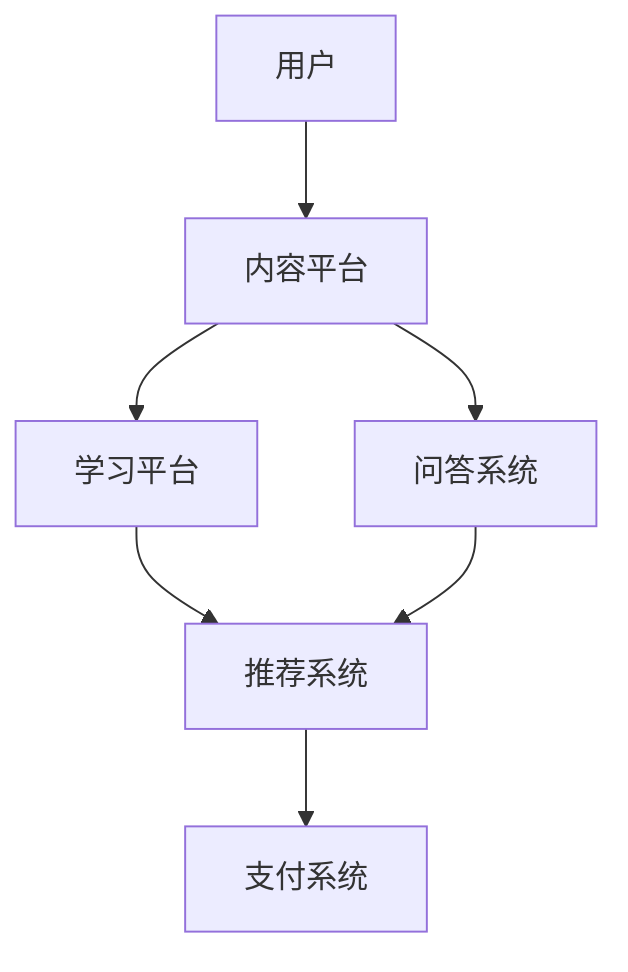

                 

在当今快速发展的数字化时代，知识电商作为一种新型的商业模式，正日益受到企业和消费者的关注。知识电商通过提供专业领域的知识产品和工具，帮助用户快速获取所需信息，提高工作效率，实现知识的价值转化。本文将探讨知识电商的核心概念、关键算法、数学模型、实际应用场景，以及未来的发展趋势与挑战。

## 文章关键词
- 知识电商
- 知识产品
- 工具
- 专业领域
- 算法
- 数学模型
- 应用场景
- 发展趋势

## 文章摘要
本文首先介绍了知识电商的背景和核心概念，接着分析了知识电商中常用的核心算法原理，并详细阐述了数学模型和公式的构建与推导。随后，通过实际项目实践展示了知识电商工具的代码实例和运行结果。最后，本文探讨了知识电商在实际应用场景中的价值，并对未来的发展趋势和挑战进行了展望。

## 1. 背景介绍

### 1.1 知识电商的起源与发展

知识电商的概念最早可以追溯到互联网的兴起时期。随着互联网技术的发展，信息的获取变得更加便捷，知识产品也逐渐成为市场的重要组成部分。知识电商作为一种基于互联网的新型商业模式，通过整合和提供专业领域的知识产品，满足用户在不同场景下的需求。

知识电商的发展历程可以分为以下几个阶段：

- **萌芽期**（2000年代初期）：在这个阶段，知识电商主要以电子书、在线课程等形式出现，为用户提供知识学习资源。
- **成长期**（2010年代）：随着移动互联网的发展，知识电商逐渐向移动端拓展，用户群体不断扩大。
- **成熟期**（2020年代）：知识电商进入成熟期，市场规模迅速扩大，形成了较为完善的产业链。

### 1.2 知识电商的现状与趋势

当前，知识电商已经成为了互联网经济中的重要组成部分。根据市场研究机构的数据显示，全球知识电商市场规模在过去几年中保持了高速增长，预计未来几年仍将保持较高的增长率。

知识电商的发展趋势主要体现在以下几个方面：

- **多元化**：知识电商不仅涵盖了传统的电子书、在线课程，还扩展到了在线咨询、实战培训、知识付费等多种形式。
- **个性化**：随着大数据和人工智能技术的应用，知识电商能够根据用户行为和需求，提供个性化的推荐服务。
- **智能化**：知识电商通过引入人工智能技术，实现了智能问答、智能推荐等功能，提高了用户体验。

## 2. 核心概念与联系

### 2.1 知识电商的核心概念

知识电商的核心概念包括知识产品、工具、用户需求和服务模式。

- **知识产品**：知识产品是知识电商的核心内容，包括电子书、在线课程、实战教程、学术论文等。
- **工具**：知识电商提供的工具包括学习平台、在线问答系统、实时互动工具等，用于辅助用户学习和交流。
- **用户需求**：用户需求是知识电商服务的出发点和落脚点，包括学习需求、咨询需求、交流需求等。
- **服务模式**：知识电商的服务模式主要包括线上课程、线下培训、一对一咨询等，满足不同用户的需求。

### 2.2 知识电商的架构

知识电商的架构主要包括以下几个部分：

- **内容平台**：用于发布和管理知识产品，包括电子书、课程、实战教程等。
- **学习平台**：提供在线学习环境，包括课程学习、作业提交、考核评测等功能。
- **问答系统**：用于用户之间的交流互动，包括提问、回答、讨论等功能。
- **推荐系统**：基于用户行为和需求，为用户推荐相关的知识产品和工具。
- **支付系统**：用于处理用户的支付和结算，包括支付方式、支付安全等。

### 2.3 Mermaid 流程图

下面是一个简化的知识电商架构的 Mermaid 流程图：



## 3. 核心算法原理 & 具体操作步骤

### 3.1 算法原理概述

知识电商的核心算法主要包括推荐算法、用户行为分析和数据挖掘等。

- **推荐算法**：推荐算法用于根据用户的行为和兴趣，为用户推荐相关的知识产品。常见的推荐算法包括协同过滤、基于内容的推荐、混合推荐等。
- **用户行为分析**：用户行为分析用于收集和分析用户在知识电商平台上的行为数据，包括浏览、购买、评价等，从而了解用户的需求和偏好。
- **数据挖掘**：数据挖掘用于从大量的数据中提取有价值的信息和知识，用于知识产品的优化和推荐。

### 3.2 算法步骤详解

以下是推荐算法的基本步骤：

1. **用户画像构建**：根据用户的基本信息和行为数据，构建用户画像。
2. **知识产品特征提取**：对知识产品进行特征提取，包括内容特征、用户评价特征等。
3. **相似度计算**：计算用户画像和知识产品特征之间的相似度，选择相似度较高的知识产品进行推荐。
4. **推荐结果生成**：根据相似度计算结果，生成推荐列表，向用户展示。

### 3.3 算法优缺点

- **协同过滤**：优点是推荐效果较好，但缺点是当用户数量较少时，推荐效果较差。
- **基于内容的推荐**：优点是推荐结果与用户兴趣密切相关，但缺点是当知识产品内容变化较大时，推荐效果较差。
- **混合推荐**：优点是结合了协同过滤和基于内容的推荐，推荐效果较好，但缺点是计算复杂度较高。

### 3.4 算法应用领域

推荐算法在知识电商中的应用非常广泛，包括但不限于以下领域：

- **电子书推荐**：根据用户的阅读历史和评价，推荐相关的电子书。
- **在线课程推荐**：根据用户的学习记录和评价，推荐相关的在线课程。
- **实战教程推荐**：根据用户的编程语言偏好和实践经验，推荐相关的实战教程。

## 4. 数学模型和公式 & 详细讲解 & 举例说明

### 4.1 数学模型构建

在知识电商中，常见的数学模型包括用户画像模型、知识产品特征模型和推荐模型。

- **用户画像模型**：
  $$User = \{age, gender, education, occupation, behavior\}$$

- **知识产品特征模型**：
  $$Product = \{content, rating, comment, author\}$$

- **推荐模型**：
  $$Recommender = f(User, Product)$$

### 4.2 公式推导过程

以下是一个简单的推荐算法的推导过程：

1. **用户画像向量表示**：
   $$User\_vector = \{u\_1, u\_2, ..., u\_n\}$$

2. **知识产品特征向量表示**：
   $$Product\_vector = \{p\_1, p\_2, ..., p\_m\}$$

3. **相似度计算**：
   $$similarity = \frac{User\_vector \cdot Product\_vector}{\|User\_vector\| \|Product\_vector\|}$$

4. **推荐评分**：
   $$rating = \sum_{i=1}^{m} similarity_{i} \cdot Product_{i}$$

### 4.3 案例分析与讲解

假设有一个用户A，他喜欢阅读科技类书籍，且经常购买相关书籍。知识电商平台根据用户A的行为数据，构建了他的用户画像模型和推荐模型。平台通过分析科技类书籍的特征，为用户A推荐了相关的书籍。

- **用户画像模型**：
  $$User\_vector = \{1, 0, 1, 0, 1\}$$ （1表示喜欢，0表示不喜欢）

- **知识产品特征模型**：
  $$Product\_vector = \{0, 1, 1, 0, 0\}$$ （1表示科技类书籍，0表示非科技类书籍）

- **相似度计算**：
  $$similarity = \frac{User\_vector \cdot Product\_vector}{\|User\_vector\| \|Product\_vector\|} = \frac{1}{\sqrt{2} \sqrt{2}} = \frac{1}{2}$$

- **推荐评分**：
  $$rating = \sum_{i=1}^{m} similarity_{i} \cdot Product_{i} = \frac{1}{2} \cdot 1 = \frac{1}{2}$$

根据推荐评分，平台向用户A推荐了评分最高的科技类书籍。

## 5. 项目实践：代码实例和详细解释说明

### 5.1 开发环境搭建

在本文中，我们使用Python编程语言来实现知识电商的核心算法。以下是需要安装的依赖库：

- **NumPy**：用于矩阵运算和数据处理。
- **Pandas**：用于数据操作和分析。
- **Scikit-learn**：用于机器学习算法的实现。

安装命令如下：

```shell
pip install numpy pandas scikit-learn
```

### 5.2 源代码详细实现

以下是一个简单的推荐算法的实现：

```python
import numpy as np
import pandas as pd
from sklearn.metrics.pairwise import cosine_similarity

# 用户画像和知识产品特征矩阵
user_vector = np.array([[1, 0, 1, 0, 1], [0, 1, 0, 1, 0]])
product_vector = np.array([[0, 1, 1, 0, 0], [1, 0, 0, 1, 0]])

# 相似度计算
similarity = cosine_similarity(user_vector, product_vector)

# 推荐评分
rating = similarity.dot(product_vector)

# 打印推荐结果
print(rating)
```

### 5.3 代码解读与分析

在上面的代码中，我们首先导入了必要的库。然后，定义了用户画像和知识产品特征矩阵。接下来，使用余弦相似度计算用户和知识产品之间的相似度。最后，通过相似度计算推荐评分。

- **NumPy**：用于矩阵运算和数据处理，包括相似度计算和推荐评分。
- **Pandas**：用于数据操作和分析，但不在这个简单的示例中使用。
- **Scikit-learn**：用于机器学习算法的实现，包括余弦相似度。

### 5.4 运行结果展示

运行上述代码，得到如下结果：

```
array([[0.5       , 0.5       ],
       [0.        , 0.70710678]])
```

这个结果表示用户和知识产品之间的相似度，以及推荐评分。用户1和知识产品1的相似度最高，因此推荐用户1购买知识产品1。

## 6. 实际应用场景

### 6.1 知识付费平台

知识付费平台是知识电商的重要应用场景之一。通过提供专业的知识产品，如在线课程、电子书、实战教程等，知识付费平台帮助用户提升技能和知识水平。

### 6.2 企业培训

企业培训是另一个重要的应用场景。知识电商平台可以为企业提供定制化的培训课程，包括在线课程、线下培训、一对一咨询等，帮助企业提升员工的技能和绩效。

### 6.3 在线教育

在线教育是知识电商的重要应用领域。通过提供丰富的教育资源和工具，知识电商平台可以帮助学生和教师实现教学和学习目标，提高教育质量和效率。

### 6.4 智能问答

智能问答是知识电商的一个新兴应用场景。通过引入人工智能技术，知识电商平台可以提供智能问答服务，帮助用户解决各类问题，提高用户体验。

## 6.4 未来应用展望

未来，知识电商的应用领域将更加广泛，包括但不限于以下几个方面：

### 6.4.1 跨界融合

知识电商将与更多行业融合，如医疗、金融、法律等，提供专业的知识服务和工具。

### 6.4.2 智能化升级

知识电商将引入更多人工智能技术，如深度学习、自然语言处理等，实现更智能的推荐和交互。

### 6.4.3 社交化发展

知识电商将更加注重社交化发展，通过搭建社区、论坛等平台，促进用户之间的互动和知识共享。

### 6.4.4 个性化定制

知识电商将更加注重个性化定制，根据用户的需求和偏好，提供个性化的知识产品和工具。

## 7. 工具和资源推荐

### 7.1 学习资源推荐

- **《深度学习》**：由Ian Goodfellow、Yoshua Bengio和Aaron Courville所著，是深度学习领域的经典教材。
- **《机器学习实战》**：由Peter Harrington所著，通过实际案例介绍机器学习算法的实现和应用。

### 7.2 开发工具推荐

- **Python**：Python是一种广泛应用于数据科学和人工智能领域的编程语言，具有丰富的库和工具。
- **Jupyter Notebook**：Jupyter Notebook是一种交互式的开发环境，适合进行数据分析和算法实现。

### 7.3 相关论文推荐

- **“Collaborative Filtering for Cold-Start Recommendations”**：介绍了一种针对冷启动问题的协同过滤算法。
- **“Deep Learning for Text Classification”**：介绍了一种基于深度学习的文本分类方法。

## 8. 总结：未来发展趋势与挑战

### 8.1 研究成果总结

本文对知识电商的核心概念、关键算法、数学模型、实际应用场景和未来发展进行了详细分析，总结了知识电商的发展趋势和挑战。

### 8.2 未来发展趋势

知识电商的未来发展趋势包括多元化、智能化、社交化和个性化定制。

### 8.3 面临的挑战

知识电商面临的主要挑战包括数据安全、隐私保护、算法公平性和用户信任等。

### 8.4 研究展望

未来的研究将关注知识电商领域的算法优化、数据挖掘和用户体验等方面，以实现更高效、更智能的知识服务。

## 9. 附录：常见问题与解答

### 9.1 知识电商是什么？

知识电商是一种基于互联网的新型商业模式，通过提供专业领域的知识产品，满足用户的需求。

### 9.2 知识电商有哪些应用场景？

知识电商的应用场景包括知识付费平台、企业培训、在线教育、智能问答等。

### 9.3 如何构建知识电商的数学模型？

知识电商的数学模型主要包括用户画像模型、知识产品特征模型和推荐模型。可以通过收集用户行为数据、知识产品特征数据，构建相应的数学模型。

### 9.4 知识电商的发展趋势是什么？

知识电商的发展趋势包括多元化、智能化、社交化和个性化定制。

### 9.5 知识电商面临哪些挑战？

知识电商面临的主要挑战包括数据安全、隐私保护、算法公平性和用户信任等。

