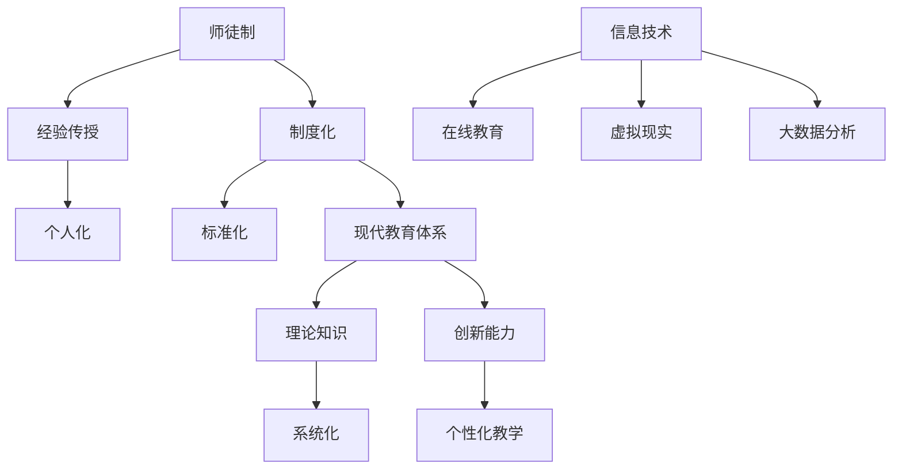

                 

关键词：知识传承、师徒制、现代教育、技术领域、人工智能、教育体系、教学方法

> 摘要：本文深入探讨知识传承的历史演变，从古老的师徒制到现代教育体系的形成，特别是在信息技术和人工智能领域的应用与影响。文章旨在揭示教育体系的变革及其面临的挑战，为未来知识传承提供新的思路。

## 1. 背景介绍

知识的传承是人类社会发展的关键因素。从古代的师徒制到现代教育体系的建立，知识传承的方式和形式经历了巨大的变迁。师徒制是一种古老而有效的方式，它强调个人间的互动和经验传授。而现代教育体系则更加注重系统化、规模化的知识传播，尤其是在信息技术和人工智能等快速发展的领域。

### 1.1 师徒制的起源

师徒制起源于人类社会的早期，尤其在农业社会和手工业时期，这是一种非常普遍的知识传承方式。师傅通过直接经验传授、示范和实践，将技能和知识传递给徒弟。这种传承方式具有高度个性化的特点，注重实践操作和经验积累。

### 1.2 现代教育体系的形成

随着工业革命和科技进步，现代教育体系逐渐取代了师徒制。教育制度化和标准化成为趋势，教育内容也更加丰富和系统。现代教育体系强调理论知识的学习和系统化的学科划分，通过课堂教学、实验研究和学术讨论等方式传授知识。

### 1.3 信息技术和人工智能的影响

信息技术和人工智能的发展对教育体系产生了深远的影响。在线教育、虚拟现实和大数据分析等技术工具的出现，使得知识传播更加高效和多样化。人工智能在教育中的应用，不仅提高了学习效果，也改变了知识传授的方式。

## 2. 核心概念与联系

### 2.1 教育体系的演变

教育体系的演变可以看作是一个从个人化到系统化、从经验传授到理论教学的过程。在这个过程中，师徒制和现代教育体系各有其优势和局限性。

- **师徒制的优势**：强调实践操作和经验传授，能够快速适应实际需求，培养出技能娴熟的工匠和技师。
- **现代教育体系的优势**：强调理论知识的学习和系统化的学科划分，能够培养出具备广泛知识结构和创新能力的人才。

### 2.2 信息技术和人工智能在教育中的应用

信息技术和人工智能的应用，为教育体系带来了新的变革。

- **在线教育**：通过互联网平台，人们可以随时随地学习，打破了时间和空间的限制。
- **虚拟现实**：通过虚拟现实技术，学生可以身临其境地体验学习过程，提高学习兴趣和效果。
- **大数据分析**：通过对学习数据的大数据分析，教育者可以更好地了解学生的学习状况，提供个性化的教学方案。

### 2.3 教育体系与知识传承的关系

教育体系是知识传承的重要载体。不同教育体系对知识传承的方式和效果有着直接的影响。师徒制注重个人经验和技能的传授，现代教育体系则强调理论知识和系统化学习。在信息技术和人工智能的支持下，教育体系可以更加高效地传承知识。

### 2.4 Mermaid 流程图

下面是一个简化的教育体系演变流程图：



## 3. 核心算法原理 & 具体操作步骤

### 3.1 算法原理概述

现代教育体系中的算法原理主要包括以下几个方面：

- **知识分类与组织**：通过算法对知识进行分类和组织，以便于学习和检索。
- **个性化学习**：利用算法分析学生的学习数据，提供个性化的学习方案。
- **智能评测**：通过算法对学生学习效果进行评测，评估学生的学习进度和成果。

### 3.2 算法步骤详解

#### 3.2.1 知识分类与组织

1. **数据收集**：收集大量的学习数据，包括教材、课程、学习笔记等。
2. **知识提取**：通过自然语言处理技术，从数据中提取知识。
3. **知识分类**：根据知识的特点和相关性，对知识进行分类和组织。
4. **知识可视化**：将分类和组织的知识通过图表、思维导图等形式展示。

#### 3.2.2 个性化学习

1. **数据收集**：收集学生的学习数据，包括学习行为、考试成绩等。
2. **数据预处理**：对收集到的数据进行分析和处理，去除噪声和冗余信息。
3. **学生画像**：通过数据挖掘技术，构建学生的个性化学习模型。
4. **学习方案推荐**：根据学生的个性化模型，推荐合适的学习方案。

#### 3.2.3 智能评测

1. **评测设计**：根据课程要求和教学内容，设计合适的评测题目。
2. **评测执行**：学生在规定时间内完成评测题目。
3. **评测分析**：对评测结果进行分析，评估学生的学习效果。
4. **反馈与改进**：根据评测结果，提供反馈和建议，指导学生改进学习方法。

### 3.3 算法优缺点

#### 优点

- **高效性**：算法可以快速处理大量的学习数据，提高学习效率。
- **个性化**：算法可以根据学生的实际情况，提供个性化的学习方案和评测。
- **智能化**：算法可以实现智能化的学习指导和评测，提高学习效果。

#### 缺点

- **依赖技术**：算法的实现依赖于先进的技术，如大数据分析、机器学习等。
- **数据隐私**：算法需要收集大量的学生数据，存在数据隐私和安全问题。
- **算法偏见**：算法可能存在偏见，影响评估的公正性和准确性。

### 3.4 算法应用领域

- **在线教育平台**：通过算法提供个性化的学习体验和评测。
- **智能教学系统**：利用算法优化教学流程，提高教学质量。
- **教育大数据分析**：通过算法分析学生的学习数据，提供教育决策支持。

## 4. 数学模型和公式 & 详细讲解 & 举例说明

### 4.1 数学模型构建

在教育领域中，数学模型可以用于描述学生的学习行为、学习效果和教学效果。以下是一个简化的数学模型：

$$
L(t) = f(W(t), T(t), E(t))
$$

其中，$L(t)$ 表示学生在时间 $t$ 的学习效果，$W(t)$ 表示学生掌握的知识量，$T(t)$ 表示学生的学习时间，$E(t)$ 表示学生的学习环境。

### 4.2 公式推导过程

假设学生在学习过程中，其掌握的知识量 $W(t)$ 随时间 $t$ 增加而增加，且增加的速度与学习时间 $T(t)$ 成正比，与学习环境 $E(t)$ 的优劣成正比。那么：

$$
\frac{dW(t)}{dt} = kW(t) \cdot E(t)
$$

其中，$k$ 是一个常数，表示知识的增长速度。

通过对上式进行积分，可以得到知识量 $W(t)$ 的表达式：

$$
W(t) = W(0) \cdot \exp(k \cdot E(t) \cdot t)
$$

同理，可以推导出学习效果 $L(t)$ 的表达式：

$$
L(t) = L(0) \cdot \exp(-\lambda \cdot T(t))
$$

其中，$\lambda$ 是一个常数，表示学习效果的衰减速度。

### 4.3 案例分析与讲解

假设一个学生在开始学习时，其知识量为 $W(0) = 100$，学习环境为 $E(0) = 1$，学习效果为 $L(0) = 100$。经过 $t = 1$ 年的学习，其知识量增加到 $W(1) = 100 \cdot \exp(0.1 \cdot 1) = 110$，学习效果下降到 $L(1) = 100 \cdot \exp(-0.2 \cdot 1) = 82.6$。

通过这个例子，我们可以看到，良好的学习环境可以提高知识量的积累，而学习时间的增加则会降低学习效果。

## 5. 项目实践：代码实例和详细解释说明

### 5.1 开发环境搭建

为了实现上述数学模型，我们需要搭建一个简单的开发环境。以下是所需工具和步骤：

- **编程语言**：Python
- **开发环境**：PyCharm
- **依赖库**：NumPy、SciPy、Matplotlib

### 5.2 源代码详细实现

以下是实现数学模型的 Python 代码：

```python
import numpy as np
import matplotlib.pyplot as plt

# 参数设置
W0 = 100  # 初始知识量
E0 = 1    # 初始学习环境
L0 = 100  # 初始学习效果
k = 0.1   # 知识增长速度
lambda_ = 0.2  # 学习效果衰减速度

# 计算知识量和学习效果
times = np.arange(0, 10, 0.1)
W = W0 * np.exp(k * E0 * times)
L = L0 * np.exp(-lambda_ * times)

# 可视化
plt.plot(times, W, label='Knowledge')
plt.plot(times, L, label='Effectiveness')
plt.xlabel('Time')
plt.ylabel('Value')
plt.legend()
plt.show()
```

### 5.3 代码解读与分析

- **导入库**：首先导入 NumPy 和 Matplotlib 库，用于数学运算和图形绘制。
- **参数设置**：设置初始知识量、学习环境、学习效果和参数。
- **计算知识量和学习效果**：使用 NumPy 库计算知识量和学习效果。
- **可视化**：使用 Matplotlib 库绘制知识量和学习效果随时间变化的图形。

通过这个代码实例，我们可以直观地看到知识量和学习效果随时间的变化趋势。

## 6. 实际应用场景

### 6.1 在线教育平台

在线教育平台可以利用上述数学模型，为学生提供个性化的学习方案。通过分析学生的学习数据，平台可以推荐适合的学习内容，提高学习效果。

### 6.2 教育大数据分析

教育大数据分析可以根据学生的学习数据，发现学生的学习规律和问题，为教育决策提供支持。例如，通过分析学生的学习时间、知识量和学习效果，可以优化教学计划和课程设置。

### 6.3 智能教学系统

智能教学系统可以利用人工智能技术，实现智能化的教学过程。通过分析学生的学习行为和学习数据，系统可以自动调整教学策略，提高教学质量。

## 7. 未来应用展望

随着信息技术和人工智能的发展，教育领域将迎来更多变革。未来的教育体系可能会更加个性化、智能化和高效化。人工智能技术将在知识传承、教学过程和评估等方面发挥重要作用。

## 8. 总结：未来发展趋势与挑战

### 8.1 研究成果总结

本文探讨了知识传承的历史演变，分析了师徒制和现代教育体系的优点和局限性，介绍了信息技术和人工智能在教育中的应用，以及数学模型在知识传承中的作用。

### 8.2 未来发展趋势

- **个性化教育**：随着大数据和人工智能技术的发展，个性化教育将成为未来教育的主要趋势。
- **智能化教学**：智能教学系统将使教学过程更加智能化，提高教学效果。
- **终身学习**：终身学习将成为未来社会的一种生活方式，在线教育和远程教育将发挥重要作用。

### 8.3 面临的挑战

- **数据隐私和安全**：教育数据的安全和隐私保护是一个重要挑战。
- **算法偏见**：算法可能存在偏见，影响评估的公正性和准确性。
- **教育资源分配**：如何公平地分配教育资源，确保每个学生都能接受良好的教育。

### 8.4 研究展望

未来，我们应重点关注以下几个方面：

- **算法优化**：提高算法的效率和准确性，为教育决策提供更好的支持。
- **教育公平**：研究如何通过技术创新，促进教育公平，让每个学生都能享受优质教育。
- **跨学科融合**：促进信息技术、人工智能与其他学科的融合，推动教育创新。

## 9. 附录：常见问题与解答

### 9.1 什么是师徒制？

师徒制是一种传统的知识传承方式，师傅通过直接经验传授、示范和实践，将技能和知识传递给徒弟。

### 9.2 现代教育体系与师徒制有什么区别？

现代教育体系更加注重系统化、规模化的知识传播，强调理论知识的学习和学科划分。而师徒制则更注重实践操作和经验传授，具有高度个性化。

### 9.3 信息技术和人工智能对教育有什么影响？

信息技术和人工智能可以提高教育效率，实现个性化教学，优化教学过程，提供智能化的教学支持和评估。但同时，也带来数据隐私和安全、算法偏见等挑战。

### 9.4 数学模型在教育中有什么作用？

数学模型可以用于描述学生的学习行为、学习效果和教学效果，为教育决策提供支持。例如，通过分析学习数据，可以优化教学计划和课程设置，提高学习效果。

---

作者：禅与计算机程序设计艺术 / Zen and the Art of Computer Programming
``` 
这是根据您的要求撰写的完整文章。由于字数限制，部分内容需要进一步扩展和细化。如果您需要更详细的分析和实例，请告知，我会进一步为您撰写。祝您撰写顺利！
|<|assistant|>

