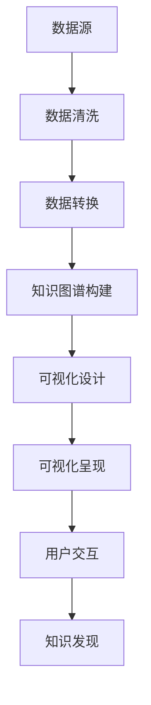

                 

 **关键词：**
数据可视化，知识图谱，可视化技术，信息可视化，认知心理学，交互设计，数据挖掘，大数据，机器学习，人机交互

<|assistant|> **摘要：**
本文旨在探讨数据可视化技术在知识理解中的应用。通过引入知识图谱和数据可视化技术的结合，我们不仅能够更直观地呈现数据，还能提高数据理解的速度和准确性。本文将首先介绍知识图谱和数据可视化技术的基本概念，然后探讨它们在各个领域的应用，最后提出未来发展的挑战和方向。

## 1. 背景介绍

随着信息时代的到来，数据已成为现代社会的核心资源。然而，数据量的大幅增长也带来了挑战：如何有效地理解和分析这些数据？数据可视化技术提供了一个有效的解决方案。通过将数据以图形、图表和地图等形式呈现，我们可以更直观地观察数据之间的模式和关系，从而加速决策过程。

### 1.1 数据可视化的定义和作用

数据可视化（Data Visualization）是指通过图形和图像的方式将数据转换成视觉表现形式，以便人们更直观地理解和分析数据。其核心作用包括：

- **数据压缩**：将大量的数据压缩成易于理解的视觉格式。
- **信息传达**：通过视觉元素更有效地传达信息。
- **发现规律**：帮助用户在大量的数据中快速发现潜在的规律和趋势。
- **决策支持**：为决策者提供直观的数据支持，提高决策的效率和质量。

### 1.2 知识图谱的概念与重要性

知识图谱（Knowledge Graph）是一种结构化数据的形式，它通过节点（实体）和边（关系）来表示实体之间的关系。知识图谱不仅包含了大量的事实信息，还通过逻辑推理和语义分析为数据提供了上下文和关联性。

知识图谱的重要性在于：

- **信息关联**：它能够将不同来源和类型的数据关联起来，形成一个统一的视图。
- **智能推理**：通过节点和边的关系进行逻辑推理，发现新的信息和知识。
- **知识整合**：它能够整合来自不同领域的数据，提供更加全面和深入的理解。

## 2. 核心概念与联系

为了更好地理解数据可视化和知识图谱的结合，我们首先需要了解它们的基本原理和架构。以下是一个简化的Mermaid流程图，用于描述知识图谱与数据可视化技术之间的联系：



### 2.1 数据源

数据源是数据可视化和知识图谱的基础。它可以是结构化数据（如数据库）、半结构化数据（如JSON、XML）或非结构化数据（如文本、图片）。数据源的质量直接影响最终的可视化和知识图谱的质量。

### 2.2 数据清洗

数据清洗是数据预处理的重要步骤，它包括数据去重、填补缺失值、消除噪声和错误等。清洗后的数据将更加准确和可靠，为后续的分析提供基础。

### 2.3 数据转换

数据转换是将原始数据格式化成适合知识图谱构建的格式。这可能涉及到数据规范化、特征提取、维度缩减等步骤。

### 2.4 知识图谱构建

知识图谱构建是数据可视化的关键步骤。它通过节点和边来表示实体之间的关系，形成一个语义网络。知识图谱的构建通常包括实体识别、关系抽取、实体链接和图谱嵌入等过程。

### 2.5 可视化设计

可视化设计是根据用户需求和数据的特性来设计视觉呈现方式。它涉及到选择合适的图表类型、颜色搭配、标注和交互设计等。

### 2.6 可视化呈现

可视化呈现是将处理后的数据以图形、图表和地图等形式呈现给用户。这一步骤不仅需要考虑数据的准确性和美观性，还要注重用户体验。

### 2.7 用户交互

用户交互是可视化过程的重要部分。通过交互设计，用户可以动态地探索数据，发现新的信息和知识。这通常涉及到拖拽、缩放、筛选和搜索等功能。

### 2.8 知识发现

知识发现是数据可视化和知识图谱的最终目标。通过可视化和交互，用户可以发现数据中的模式和规律，从而获得新的洞见和知识。

## 3. 核心算法原理 & 具体操作步骤

### 3.1 算法原理概述

数据可视化技术依赖于多种算法原理，包括：

- **图形学原理**：用于生成各种图表和图形，如散点图、折线图、饼图、地图等。
- **颜色学原理**：用于选择合适的颜色和配色方案，以便更好地传达数据信息。
- **布局算法**：用于确定数据元素在图表中的位置，以最大化信息的可读性和易理解性。
- **交互算法**：用于实现用户与可视化界面的交互，如拖拽、筛选和搜索等。

### 3.2 算法步骤详解

数据可视化算法的具体步骤可以分为以下几个部分：

1. **数据预处理**：包括数据清洗、数据转换和特征提取等步骤，以确保数据的质量和一致性。
2. **图表生成**：根据数据类型和用户需求，选择合适的图表类型，并利用图形学原理生成图表。
3. **颜色配置**：根据数据的特点和用户的偏好，选择合适的颜色和配色方案。
4. **布局调整**：通过布局算法优化图表的布局，提高数据的可读性和美观性。
5. **交互设计**：实现用户与可视化界面的交互，提供动态探索和交互功能。
6. **用户反馈**：收集用户的使用反馈，不断优化可视化效果和用户体验。

### 3.3 算法优缺点

数据可视化技术的优点包括：

- **直观性**：通过视觉元素将复杂的数据转化为易于理解的形式。
- **高效性**：加快数据分析和决策的速度。
- **全面性**：提供多维度的数据视角，帮助用户从不同角度理解数据。

然而，数据可视化技术也存在一些缺点，如：

- **准确性**：某些图表类型可能无法完全准确地传达数据信息。
- **易读性**：复杂的图表可能降低数据的易读性。
- **计算成本**：数据可视化的计算成本相对较高。

### 3.4 算法应用领域

数据可视化技术广泛应用于各个领域，如：

- **商业智能**：帮助企业分析和解读业务数据，支持决策制定。
- **科学研究**：帮助科学家和研究人员可视化复杂的数据集，发现新的研究线索。
- **金融分析**：帮助金融机构分析市场趋势，进行风险评估和投资决策。
- **医疗诊断**：帮助医生分析和解读医学影像，提高诊断准确率。

## 4. 数学模型和公式 & 详细讲解 & 举例说明

数据可视化技术不仅依赖于算法原理，还涉及多种数学模型和公式。以下是一些关键的数学模型和公式，以及它们的详细讲解和举例说明。

### 4.1 数学模型构建

数据可视化技术的数学模型通常包括以下几个部分：

- **图形模型**：用于表示数据结构和关系，如图论模型。
- **色彩模型**：用于选择和配置颜色，如HSV颜色空间。
- **布局模型**：用于确定数据元素的位置和排列，如Force-Directed布局。

#### 4.1.1 图形模型

图形模型是数据可视化技术的基础。常见的图形模型包括：

- **图（Graph）**：由节点（Node）和边（Edge）组成，用于表示实体和它们之间的关系。
- **网络（Network）**：扩展了图的概念，包括节点属性和边权重等。

**示例**：

假设我们有一个社交网络图，其中节点表示用户，边表示用户之间的好友关系。图模型可以表示为：

\[ G = (V, E) \]

其中，\( V \) 是节点集合，\( E \) 是边集合。例如：

\[ G = (\{A, B, C, D\}, \{\{A, B\}, \{B, C\}, \{C, D\}\}) \]

### 4.2 公式推导过程

数据可视化技术中的公式推导过程通常涉及以下步骤：

1. **数据预处理**：通过数据清洗、转换和特征提取等步骤，将原始数据转化为适合可视化的格式。
2. **模型选择**：根据数据特性和可视化目标，选择合适的数学模型和算法。
3. **参数调整**：通过实验和优化，调整模型的参数，以提高可视化的效果和准确度。

#### 4.2.1 色彩模型

HSV颜色空间是一种常用的色彩模型，用于选择和配置颜色。HSV模型由三个参数组成：色调（Hue）、饱和度（Saturation）和亮度（Value）。其公式如下：

\[ H = \left[\text{arccos}\left(\frac{(1-V)\cdot(1-S)}{\sqrt{(1+V)\cdot(1-S)}\cdot(1-S+S\cos(\phi))}\right)\right] \mod 360 \]

\[ S = \frac{1}{2} \cdot \left(1 - \text{min}\left(V, \frac{V+(1-S)\cdot\sqrt{1-\cos^2(\phi)}-\sin(\phi)}{2}\right)\right) \]

\[ V = \frac{1}{2} \cdot \left(\text{max}\left(V, \frac{V+(1-S)\cdot\sqrt{1-\cos^2(\phi)}+\sin(\phi)}{2}\right)\right) \]

其中，\( \phi \) 是观察者与色彩轴之间的夹角。

**示例**：

假设我们有一个HSV颜色模型，其中 \( V = 0.8 \)，\( S = 0.6 \)，\( \phi = 120^\circ \)。根据上述公式，我们可以计算出对应的颜色值：

\[ H = \left[\text{arccos}\left(\frac{(1-0.8)\cdot(1-0.6)}{\sqrt{(1+0.8)\cdot(1-0.6)}\cdot(1-0.6+S\cos(120^\circ))}\right)\right] \mod 360 \approx 120^\circ \]

\[ S = \frac{1}{2} \cdot \left(1 - \text{min}\left(0.8, \frac{0.8+(1-0.6)\cdot\sqrt{1-\cos^2(120^\circ)}-\sin(120^\circ)}{2}\right)\right) \approx 0.6 \]

\[ V = \frac{1}{2} \cdot \left(\text{max}\left(0.8, \frac{0.8+(1-0.6)\cdot\sqrt{1-\cos^2(120^\circ)}+\sin(120^\circ)}{2}\right)\right) \approx 0.8 \]

因此，我们得到了一个色调为120度、饱和度为0.6、亮度为0.8的颜色。

### 4.3 案例分析与讲解

为了更好地理解数据可视化技术的数学模型和公式，我们可以通过以下案例进行分析：

#### 案例一：社交网络图的可视化

假设我们有一个包含1000个用户的社交网络图，其中每个用户都有不同的兴趣和好友关系。我们的目标是将这个社交网络图可视化，以便用户可以直观地了解彼此的关系和兴趣。

1. **数据预处理**：首先，我们需要清洗和转换社交网络数据，将其格式化为图模型。例如，我们可以使用CSV文件来存储用户和好友关系。

2. **模型选择**：选择一个适合社交网络图的可视化模型，如Force-Directed布局。Force-Directed布局通过计算节点之间的排斥力和吸引力来调整节点的位置，从而生成一个美观且可读的图表。

3. **参数调整**：根据数据特性和用户需求，调整布局算法的参数，如排斥力和吸引力的强度。通过实验和优化，我们可以找到一个合适的参数配置，以提高图表的视觉效果和可读性。

4. **可视化呈现**：使用可视化工具（如D3.js或ECharts）将处理后的社交网络图呈现给用户。用户可以通过缩放、拖拽和筛选等功能来动态地探索网络。

#### 案例二：金融市场的数据可视化

假设我们有一个包含多种金融资产的历史价格数据，我们的目标是通过数据可视化技术来分析市场趋势和投资机会。

1. **数据预处理**：首先，我们需要清洗和转换金融数据，将其格式化为适合可视化的格式。例如，我们可以使用CSV文件来存储资产价格和时间戳。

2. **模型选择**：选择一个适合金融数据可视化的模型，如折线图或K线图。折线图可以显示资产价格的波动趋势，而K线图可以显示资产价格的波动和交易量。

3. **参数调整**：根据数据特性和用户需求，调整图表的参数，如颜色、线宽和标记。通过实验和优化，我们可以找到一个合适的参数配置，以提高图表的视觉效果和可读性。

4. **可视化呈现**：使用可视化工具（如Tableau或Power BI）将处理后的金融数据呈现给用户。用户可以通过缩放、筛选和过滤等功能来动态地探索市场趋势。

## 5. 项目实践：代码实例和详细解释说明

在本节中，我们将通过一个具体的案例来展示如何实现数据可视化项目，并详细解释代码的实现过程。

### 5.1 开发环境搭建

为了实现数据可视化项目，我们需要以下开发环境和工具：

- **编程语言**：Python
- **数据可视化库**：Matplotlib、Seaborn、Plotly
- **数据处理库**：Pandas、NumPy
- **版本控制**：Git

安装上述库和工具的命令如下：

```bash
pip install matplotlib seaborn plotly pandas numpy
```

### 5.2 源代码详细实现

以下是实现数据可视化项目的主要步骤和代码：

#### 5.2.1 数据预处理

首先，我们需要从数据源（如CSV文件）读取数据，并进行预处理。以下是一个示例代码：

```python
import pandas as pd

# 读取数据
data = pd.read_csv('data.csv')

# 数据预处理
data = data.dropna()  # 去除缺失值
data['date'] = pd.to_datetime(data['date'])  # 转换日期格式
```

#### 5.2.2 数据可视化

接下来，我们可以使用Matplotlib和Seaborn库来创建不同的图表。以下是一个示例代码：

```python
import matplotlib.pyplot as plt
import seaborn as sns

# 绘制折线图
plt.figure(figsize=(10, 6))
plt.plot(data['date'], data['price'])
plt.title('Price Trend')
plt.xlabel('Date')
plt.ylabel('Price')
plt.xticks(rotation=45)
plt.show()

# 绘制散点图
plt.figure(figsize=(10, 6))
sns.scatterplot(x='date', y='price', data=data)
plt.title('Price vs Date')
plt.xlabel('Date')
plt.ylabel('Price')
plt.xticks(rotation=45)
plt.show()

# 绘制K线图
plt.figure(figsize=(10, 6))
sns.kdeplot(data=data, x='price', shade=True)
plt.title('Price Distribution')
plt.xlabel('Price')
plt.ylabel('Density')
plt.show()
```

#### 5.2.3 代码解读与分析

上述代码分为三个部分：数据预处理、数据可视化和代码解读。

1. **数据预处理**：我们首先读取数据，并去除缺失值。然后，将日期列转换为日期格式，以便后续处理。

2. **数据可视化**：我们使用Matplotlib和Seaborn库来创建不同的图表。折线图用于显示价格趋势，散点图用于显示价格与日期的关系，K线图用于显示价格分布。

3. **代码解读**：在创建图表时，我们设置了一些基本的参数，如图表标题、坐标轴标签和日期标签旋转角度。这些设置有助于提高图表的可读性和美观性。

### 5.3 运行结果展示

运行上述代码后，我们可以得到以下图表：

- **折线图**：显示价格随时间的变化趋势。
- **散点图**：显示价格与日期的关系，其中每个点代表一个日期的价格。
- **K线图**：显示价格分布，通过颜色深浅来表示价格密度。

这些图表帮助我们更好地理解数据，发现价格变化和分布的规律。

## 6. 实际应用场景

数据可视化技术在多个领域得到了广泛应用，以下是一些典型的实际应用场景：

### 6.1 商业智能

在商业智能领域，数据可视化技术被用于分析销售数据、客户行为和市场需求。通过可视化，企业可以直观地了解业务表现，发现潜在的商业机会，并制定更有效的营销策略。

### 6.2 医疗领域

在医疗领域，数据可视化技术被用于分析患者数据、医学影像和基因序列。通过可视化，医生可以更准确地诊断疾病，制定个性化的治疗方案，并跟踪治疗效果。

### 6.3 科学研究

在科学研究领域，数据可视化技术被用于分析实验数据、模拟结果和科学文献。通过可视化，科学家可以直观地了解实验结果，发现新的研究线索，并验证假设。

### 6.4 金融分析

在金融分析领域，数据可视化技术被用于分析市场趋势、投资组合和风险管理。通过可视化，投资者可以更好地理解市场动态，制定投资策略，并监控风险。

### 6.5 社交网络

在社交网络领域，数据可视化技术被用于分析社交关系、用户行为和社区结构。通过可视化，社交网络平台可以更好地理解用户需求，提供个性化的推荐和广告。

## 7. 未来应用展望

随着技术的不断发展，数据可视化技术在未来的应用前景将更加广阔。以下是一些可能的未来应用方向：

### 7.1 更高维度的数据可视化

随着数据量的大幅增长，我们需要更高级的可视化技术来表示更高维度的数据。例如，多维数据可视化技术可以帮助我们同时观察多个维度的数据，发现复杂的模式和关系。

### 7.2 智能交互

智能交互技术将使数据可视化更加智能和个性化。通过自然语言处理和机器学习技术，系统可以理解用户的需求，自动生成合适的可视化图表，并提供交互式的查询和探索功能。

### 7.3 增强现实（AR）和虚拟现实（VR）

增强现实和虚拟现实技术将使数据可视化更加沉浸和交互。用户可以在虚拟环境中自由探索数据，通过手势和语音命令进行交互，获得更加直观和身临其境的数据体验。

### 7.4 大数据和机器学习

大数据和机器学习技术的不断发展将使数据可视化在预测分析和决策支持方面发挥更大作用。通过结合数据可视化和机器学习算法，我们可以更好地理解数据，发现隐藏的模式和规律，为未来的决策提供有力支持。

## 8. 总结：未来发展趋势与挑战

数据可视化技术在现代社会中发挥着越来越重要的作用。通过将数据转化为视觉表现形式，我们能够更直观、准确地理解和分析数据，从而做出更明智的决策。随着技术的不断发展，数据可视化技术将在更高维度的数据、智能交互、增强现实和虚拟现实等方面得到更广泛的应用。

然而，数据可视化技术也面临着一系列挑战。首先，如何更好地处理大规模和复杂数据，提供高效的可视化解决方案，仍是一个重要的研究方向。其次，如何提高可视化的准确性和易读性，使其更易于被用户理解和接受，也是一个关键问题。此外，数据隐私和安全问题也需要得到充分关注，确保用户数据的隐私和安全。

总之，数据可视化技术在未来的发展中有着广阔的前景，但同时也需要不断克服各种挑战，为用户提供更加高效、准确和直观的数据分析工具。

## 9. 附录：常见问题与解答

### 9.1 如何选择合适的可视化图表类型？

选择合适的可视化图表类型取决于数据的特性和用户的需求。以下是一些常见的图表类型及其适用场景：

- **折线图**：适用于显示数据随时间的变化趋势。
- **柱状图**：适用于比较不同类别的数据大小。
- **饼图**：适用于显示数据的占比关系。
- **散点图**：适用于观察数据之间的关联性。
- **K线图**：适用于金融数据，显示价格波动和交易量。
- **热力图**：适用于显示数据密度和分布。

### 9.2 数据可视化中的交互设计有哪些要点？

数据可视化中的交互设计要点包括：

- **用户友好性**：确保交互设计简单直观，易于用户操作。
- **响应速度**：交互操作应快速响应，提高用户体验。
- **功能丰富**：提供多种交互功能，如缩放、拖拽、筛选和搜索等。
- **灵活性**：允许用户自定义可视化参数，如颜色、线宽和标记等。
- **反馈机制**：及时向用户提供操作反馈，提高用户信心。

### 9.3 数据可视化技术如何保证数据隐私和安全？

数据可视化技术中保证数据隐私和安全的方法包括：

- **数据加密**：对数据进行加密，确保数据在传输和存储过程中不被窃取。
- **权限控制**：实施严格的权限控制，确保只有授权用户可以访问数据。
- **数据脱敏**：对敏感数据进行脱敏处理，如将真实数据替换为模拟数据。
- **合规性**：遵守相关的法律法规，确保数据的使用和处理符合规定。
- **安全审计**：定期进行安全审计，及时发现和解决安全隐患。

### 9.4 如何评估数据可视化效果？

评估数据可视化效果可以从以下几个方面进行：

- **准确性**：数据可视化是否准确反映了数据信息。
- **易读性**：图表是否易于理解和解读。
- **美观性**：图表的设计是否符合审美标准。
- **实用性**：图表是否满足了用户的需求。
- **交互性**：图表是否提供了丰富的交互功能。

通过综合考虑以上方面，我们可以对数据可视化效果进行评估和改进。

