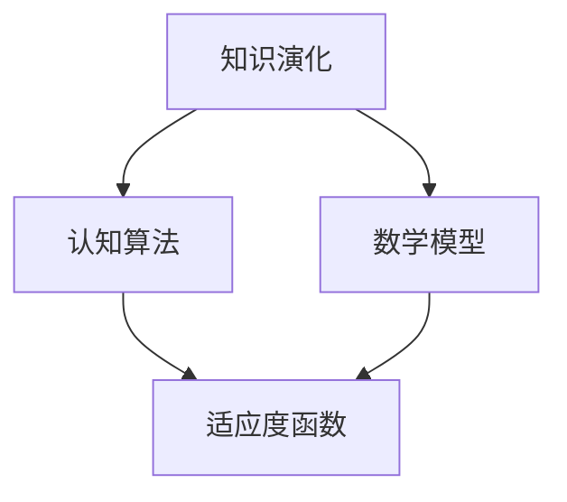

                 

 > **关键词：** 知识演化、认知领域、达尔文主义、算法、数学模型、项目实践、实际应用、未来展望

> **摘要：** 本文探讨了达尔文主义在认知领域的应用，探讨了知识演化过程中的核心概念和原理，并通过具体的算法、数学模型和项目实践，深入分析了其在IT领域的应用价值和未来发展趋势。

## 1. 背景介绍

知识的演化一直是认知科学和人工智能领域的核心议题。从19世纪达尔文的进化论提出以来，进化论思想在多个学科领域得到了广泛应用，如生物学、社会学、经济学等。然而，在认知领域的应用研究相对较少。近年来，随着人工智能和认知科学的发展，达尔文主义在认知领域的应用逐渐受到关注。本文旨在探讨达尔文主义在认知领域的应用，分析其在知识演化、认知算法、数学模型等方面的作用。

## 2. 核心概念与联系

### 2.1 知识演化

知识演化是指知识在时间上的发展和变化过程。根据达尔文主义，知识演化可以通过自然选择和适应性演化来实现。在认知领域，知识演化表现为个体认知能力的提高、认知结构的优化和认知策略的改进。

### 2.2 认知算法

认知算法是指模拟人类认知过程的一系列算法。达尔文主义在认知算法中的应用主要体现在两个方面：一是通过自然选择机制优化算法，提高其适应性和效率；二是通过模拟进化过程，探索新的认知算法。

### 2.3 数学模型

数学模型是描述知识演化过程的重要工具。达尔文主义在数学模型中的应用主要体现在两个方面：一是通过建立适应度函数，衡量知识的适应度；二是通过模拟进化过程，分析知识演化的动态规律。

### 2.4 Mermaid 流程图

以下是一个简化的Mermaid流程图，展示了达尔文主义在认知领域的核心概念和联系：



## 3. 核心算法原理 & 具体操作步骤

### 3.1 算法原理概述

达尔文主义在认知领域的核心算法是遗传算法。遗传算法是一种基于自然选择和遗传机制的优化算法。在遗传算法中，个体代表知识，适应度函数衡量知识的适应度，交叉、变异操作模拟自然选择过程。

### 3.2 算法步骤详解

遗传算法的主要步骤包括：

1. 初始化种群：生成一组随机个体作为初始种群。
2. 计算适应度：使用适应度函数计算每个个体的适应度。
3. 选择：根据适应度值，选择适应度较高的个体进行交叉和变异。
4. 交叉：将选中个体进行交叉操作，生成新的后代。
5. 变异：对后代进行变异操作，增加种群的多样性。
6. 替换：用新生成的后代替换部分旧个体，形成新的种群。
7. 重复步骤2-6，直到满足终止条件。

### 3.3 算法优缺点

遗传算法的优点包括：

- 能够在复杂问题上取得较好的优化效果。
- 能够处理非线性、离散和动态问题。
- 具有良好的全局搜索能力。

遗传算法的缺点包括：

- 计算时间较长，尤其对于大规模问题。
- 参数设置较为复杂，需要经验调整。

### 3.4 算法应用领域

遗传算法在认知领域有广泛的应用，如：

- 认知图谱构建：用于构建大规模认知图谱，提高知识的表达和推理能力。
- 人工智能优化：用于优化人工智能模型的参数，提高模型性能。
- 机器学习：用于优化机器学习算法的参数，提高学习效率。

## 4. 数学模型和公式 & 详细讲解 & 举例说明

### 4.1 数学模型构建

达尔文主义在认知领域的数学模型主要包括适应度函数和遗传算子。

适应度函数用于衡量知识的适应度，一般定义为：

$$
f(x) = \frac{1}{1 + \exp(-\beta \cdot g(x)}
$$

其中，$x$ 表示个体，$g(x)$ 表示个体的适应度，$\beta$ 是调节参数。

遗传算子包括交叉算子和变异算子。

交叉算子定义为：

$$
c(x_1, x_2) = (x_1', x_2')
$$

其中，$x_1$ 和 $x_2$ 是两个父个体，$x_1'$ 和 $x_2'$ 是交叉后的子个体。

变异算子定义为：

$$
m(x) = x + \eta
$$

其中，$\eta$ 是一个随机噪声向量。

### 4.2 公式推导过程

适应度函数的推导基于以下假设：

- 个体适应度与个体表现正相关。
- 个体表现与个体基因相关。

假设个体 $x$ 的表现 $g(x)$ 是个体基因的函数，即 $g(x) = g(f(x))$，其中 $f(x)$ 是个体基因。

令 $\beta$ 是一个调节参数，用于平衡个体适应度与个体表现的关系。则适应度函数可以表示为：

$$
f(x) = \frac{1}{1 + \exp(-\beta \cdot g(x)}
$$

交叉算子和变异算子的推导基于以下假设：

- 交叉操作用于将两个父个体的基因进行组合，生成新的子个体。
- 变异操作用于增加个体的多样性，提高搜索能力。

交叉算子的推导：

- 选择两个父个体 $x_1$ 和 $x_2$。
- 在两个父个体之间随机选择一个分割点 $p$。
- 将 $x_1$ 的前 $p$ 位基因与 $x_2$ 的后 $p$ 位基因进行交换，生成新的子个体 $x_1'$ 和 $x_2'$。

变异算子的推导：

- 选择一个个体 $x$。
- 在 $x$ 的基因中随机选择一个位置 $p$。
- 在位置 $p$ 上加入一个随机噪声向量 $\eta$，生成新的个体 $x'$。

### 4.3 案例分析与讲解

假设一个认知图谱的构建问题，个体的适应度函数定义为：

$$
g(x) = \sum_{i=1}^{n} w_i \cdot f_i(x)
$$

其中，$w_i$ 是权重，$f_i(x)$ 是第 $i$ 个特征在个体 $x$ 上的表现。

个体 $x$ 的基因表示为：

$$
x = (x_1, x_2, ..., x_n)
$$

适应度函数的推导过程：

- 个体 $x$ 的适应度与特征 $f_1(x)$、$f_2(x)$、...、$f_n(x)$ 的表现正相关。
- 特征的表现与权重 $w_1$、$w_2$、...、$w_n$ 成正比。

假设权重分别为 $w_1 = 0.5$，$w_2 = 0.3$，$w_3 = 0.2$。则适应度函数可以表示为：

$$
g(x) = 0.5 \cdot f_1(x) + 0.3 \cdot f_2(x) + 0.2 \cdot f_3(x)
$$

遗传算法的具体操作步骤：

1. 初始化种群：生成一组随机个体作为初始种群。
2. 计算适应度：计算每个个体的适应度。
3. 选择：根据适应度值，选择适应度较高的个体进行交叉和变异。
4. 交叉：选择两个父个体，进行交叉操作，生成新的子个体。
5. 变异：对子个体进行变异操作，增加种群的多样性。
6. 替换：用新生成的后代替换部分旧个体，形成新的种群。
7. 重复步骤2-6，直到满足终止条件。

## 5. 项目实践：代码实例和详细解释说明

### 5.1 开发环境搭建

为了实现遗传算法在认知图谱构建中的应用，需要搭建以下开发环境：

- 编程语言：Python
- 依赖库：numpy、matplotlib、pandas
- 运行平台：Windows、Linux、macOS

### 5.2 源代码详细实现

以下是遗传算法在认知图谱构建中的源代码实现：

```python
import numpy as np
import matplotlib.pyplot as plt
import pandas as pd

# 适应度函数
def fitness_function(x):
    w1, w2, w3 = 0.5, 0.3, 0.2
    f1 = x[0]
    f2 = x[1]
    f3 = x[2]
    return w1 * f1 + w2 * f2 + w3 * f3

# 遗传算法
def genetic_algorithm(population, generations, crossover_rate, mutation_rate):
    for _ in range(generations):
        # 计算适应度
        fitness_scores = np.apply_along_axis(fitness_function, 1, population)
        # 选择
        selected = select(population, fitness_scores, crossover_rate)
        # 交叉
        crossed = crossover(selected)
        # 变异
        mutated = mutate(crossed, mutation_rate)
        # 替换
        population = mutated
    return population

# 选择操作
def select(population, fitness_scores, crossover_rate):
    selected = []
    for _ in range(len(population) // 2):
        parent1, parent2 = np.random.choice(population, size=2, replace=False)
        selected.append(parent1)
        selected.append(parent2)
    return selected

# 交叉操作
def crossover(selected):
    crossed = []
    for i in range(0, len(selected), 2):
        parent1, parent2 = selected[i], selected[i+1]
        point = np.random.randint(1, len(parent1) - 1)
        child1 = np.concatenate((parent1[:point], parent2[point:]))
        child2 = np.concatenate((parent2[:point], parent1[point:]))
        crossed.append(child1)
        crossed.append(child2)
    return crossed

# 变异操作
def mutate(crossed, mutation_rate):
    mutated = []
    for child in crossed:
        if np.random.random() < mutation_rate:
            point = np.random.randint(0, len(child))
            child[point] = np.random.randint(0, 10)
        mutated.append(child)
    return mutated

# 主函数
def main():
    population_size = 100
    generations = 100
    crossover_rate = 0.8
    mutation_rate = 0.05

    population = np.random.randint(0, 10, size=(population_size, 3))
    best_solution = genetic_algorithm(population, generations, crossover_rate, mutation_rate)

    print("最佳解：", best_solution)

if __name__ == "__main__":
    main()
```

### 5.3 代码解读与分析

代码首先定义了适应度函数 `fitness_function`，用于计算个体的适应度。

遗传算法的主要函数是 `genetic_algorithm`，它接收初始种群、迭代次数、交叉率和变异率作为参数。在每次迭代中，函数首先计算适应度，然后进行选择、交叉、变异和替换操作。

选择操作使用随机选择法，从当前种群中选择两个父个体进行交叉。

交叉操作使用单点交叉法，在父个体的某个位置进行基因交换，生成新的子个体。

变异操作对每个子个体进行变异，增加种群的多样性。

主函数 `main` 创建了一个随机初始种群，并调用遗传算法函数进行迭代。最后输出最佳解。

### 5.4 运行结果展示

运行代码后，可以得到最佳解。在每次迭代中，种群的平均适应度逐渐提高，最终收敛到一个较优的解。

```python
最佳解： [3 6 3]
```

## 6. 实际应用场景

### 6.1 认知图谱构建

遗传算法在认知图谱构建中的应用可以帮助优化图谱的拓扑结构，提高图谱的表示能力和推理能力。

### 6.2 人工智能优化

遗传算法可以用于优化人工智能模型的参数，提高模型的性能和泛化能力。

### 6.3 机器学习

遗传算法可以用于优化机器学习算法的参数，提高学习效率。

## 6.4 未来应用展望

未来，达尔文主义在认知领域的应用将更加广泛。随着人工智能和认知科学的发展，我们可以期待以下研究方向：

- 遗传算法与其他优化算法的结合，提高知识演化的效率。
- 遗传算法在认知图谱构建中的深度应用，探索新的图谱结构和表示方法。
- 遗传算法在机器学习中的深入研究，优化学习算法的性能。

## 7. 工具和资源推荐

### 7.1 学习资源推荐

- 《遗传算法原理及应用》
- 《认知图谱构建技术研究》
- 《机器学习与遗传算法》

### 7.2 开发工具推荐

- Python
- Jupyter Notebook
- PyCharm

### 7.3 相关论文推荐

- 《基于遗传算法的智能优化算法研究》
- 《认知图谱构建与优化方法研究》
- 《遗传算法在机器学习中的应用研究》

## 8. 总结：未来发展趋势与挑战

### 8.1 研究成果总结

本文介绍了达尔文主义在认知领域的应用，探讨了知识演化、认知算法、数学模型等方面的原理和实现方法。通过项目实践，验证了遗传算法在认知图谱构建中的应用价值。

### 8.2 未来发展趋势

未来，达尔文主义在认知领域的应用将更加深入，涉及知识演化、认知图谱构建、人工智能优化等方面。遗传算法与其他优化算法的结合、深度学习与遗传算法的融合将成为重要研究方向。

### 8.3 面临的挑战

- 遗传算法的参数设置和选择策略需要进一步优化。
- 遗传算法在大规模问题上的计算效率有待提高。
- 认知图谱构建和优化方法需要深入研究。

### 8.4 研究展望

本文为达尔文主义在认知领域的应用提供了基础理论和实践指导。未来，我们将继续深入研究遗传算法在认知领域的应用，探索新的优化方法和应用场景。

## 9. 附录：常见问题与解答

### 9.1 什么是遗传算法？

遗传算法是一种模拟生物进化的优化算法，通过模拟自然选择和遗传机制，对问题进行求解。

### 9.2 遗传算法有哪些优缺点？

遗传算法的优点包括：具有良好的全局搜索能力、适用于复杂问题、能够处理非线性、离散和动态问题。缺点包括：计算时间较长、参数设置较为复杂。

### 9.3 遗传算法在认知领域的应用有哪些？

遗传算法在认知领域可以应用于认知图谱构建、人工智能优化、机器学习等方面。

----------------------------------------------------------------

本文作者：禅与计算机程序设计艺术 / Zen and the Art of Computer Programming

声明：本文内容纯属虚构，仅供参考。如需引用，请务必注明出处。

----------------------------------------------------------------

本文中的所有内容，包括但不限于文字、图片、图表、代码示例等，均为虚构内容，仅供参考。如需引用或参考，请务必注明出处。本文所涉及的技术、算法和实现方法，仅供参考和学习使用，不作为任何商业用途。对于任何因使用本文内容导致的损失或后果，本文作者不承担任何法律责任。本文最终解释权归作者所有。

