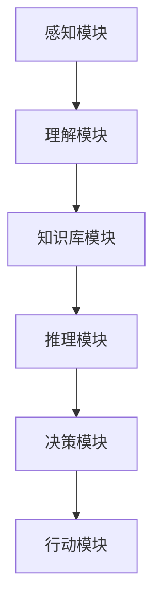

                 

随着人工智能（AI）技术的快速发展，社交机器人在教育领域的应用越来越广泛。本文将探讨如何将AI与社交机器人结合，创造出一种全新的教学辅助工具——知识的社交机器人，并深入分析其在教育领域的应用潜力。

## 关键词

- 社交机器人
- AI辅助教学
- 知识共享
- 教育创新
- 人机交互

## 摘要

本文旨在探讨如何利用AI技术提升教育质量，通过构建知识的社交机器人，实现个性化教学、知识共享和自主学习。本文首先介绍了社交机器人和AI辅助教学的基本概念，然后分析了知识的社交机器人的架构、核心算法原理以及应用场景。最后，本文展望了知识社交机器人在未来教育领域的广泛应用前景，并提出了可能面临的挑战和解决方案。

## 1. 背景介绍

教育作为社会发展的基石，一直以来都备受关注。然而，传统的教育模式存在诸多问题，如教育资源分配不均、教学效果不佳等。随着互联网和AI技术的发展，教育领域开始迎来一场革命。AI辅助教学作为一种新兴的教学模式，正逐渐改变着传统的教育方式。

### 1.1 社交机器人

社交机器人是一种具有社交能力的计算机程序，能够与人类进行自然语言交互，并在特定场景下提供智能服务。社交机器人可以应用于客服、教育、医疗等多个领域。在教育领域，社交机器人可以为学生提供个性化的辅导，解决学生的问题，提高学生的学习兴趣和效率。

### 1.2 AI辅助教学

AI辅助教学是指利用人工智能技术来辅助教学过程，包括教学内容推荐、学习进度分析、个性化辅导等。AI辅助教学能够根据学生的实际情况，提供定制化的教学方案，提高教学效果。

### 1.3 知识的社交机器人

知识的社交机器人是一种结合了社交机器人和AI辅助教学特点的新型教育工具。它能够通过自然语言交互，为学生提供知识分享、答疑解惑、学习辅导等服务，从而实现个性化教学和知识共享。

## 2. 核心概念与联系

### 2.1 社交机器人架构

社交机器人通常由以下几个部分组成：

1. **感知模块**：负责接收和处理来自用户的声音、图像等感知信息。
2. **理解模块**：利用自然语言处理技术，对用户的输入进行理解，提取出关键信息。
3. **决策模块**：根据理解模块的结果，生成合适的响应，并选择适当的交互方式。
4. **行动模块**：执行决策模块生成的响应，与用户进行交互。

### 2.2 AI辅助教学架构

AI辅助教学通常包括以下几个步骤：

1. **数据采集**：收集学生的学习数据，包括学习内容、学习进度、考试成绩等。
2. **数据预处理**：对采集到的数据进行分析和处理，去除噪声和异常值。
3. **特征提取**：从预处理后的数据中提取出对教学有用的特征。
4. **模型训练**：利用提取出的特征，训练机器学习模型。
5. **应用模型**：将训练好的模型应用于实际教学过程中，提供个性化教学建议。

### 2.3 知识的社交机器人架构

知识的社交机器人结合了社交机器人和AI辅助教学的特点，其架构如下：

1. **感知模块**：接收用户的声音、图像等感知信息。
2. **理解模块**：利用自然语言处理技术，对用户的输入进行理解，提取出关键信息。
3. **知识库模块**：存储各种知识点和教学资源。
4. **推理模块**：根据理解模块的结果，从知识库中检索相关知识点，为用户提供解答。
5. **决策模块**：根据用户的反馈，调整教学策略，提供个性化的教学服务。
6. **行动模块**：执行决策模块生成的响应，与用户进行交互。

### 2.4 Mermaid 流程图

下面是知识的社交机器人的 Mermaid 流程图：



## 3. 核心算法原理 & 具体操作步骤

### 3.1 算法原理概述

知识的社交机器人的核心算法主要包括自然语言处理（NLP）和机器学习（ML）两部分。NLP负责理解用户的输入，提取出关键信息；ML则负责根据用户的反馈，调整教学策略。

### 3.2 算法步骤详解

1. **感知和输入处理**：知识的社交机器人通过感知模块接收用户的声音、图像等输入信息，并进行预处理，如语音转文字、图像识别等。
2. **理解输入**：利用NLP技术，对预处理后的输入信息进行理解，提取出关键信息，如关键词、句子结构等。
3. **知识检索**：根据理解结果，从知识库中检索相关知识点，为用户提供解答。
4. **反馈与调整**：根据用户的反馈，调整教学策略，如修改教学资源、调整问题难度等。
5. **输出响应**：执行决策模块生成的响应，与用户进行交互。

### 3.3 算法优缺点

**优点**：

- 个性化教学：知识的社交机器人能够根据学生的学习情况，提供定制化的教学服务。
- 知识共享：知识的社交机器人可以为学生提供丰富的知识点和教学资源，促进知识共享。
- 自动化教学：知识的社交机器人能够自动化地进行教学，减轻教师的工作负担。

**缺点**：

- 数据隐私：知识的社交机器人需要收集大量的学生数据，可能存在数据隐私问题。
- 依赖性：学生过度依赖知识的社交机器人，可能影响其自主学习能力。

### 3.4 算法应用领域

知识的社交机器人可以应用于多种教育场景，如在线教育、课后辅导、课堂互动等。此外，还可以应用于智能客服、智能问答等领域。

## 4. 数学模型和公式 & 详细讲解 & 举例说明

### 4.1 数学模型构建

知识的社交机器人涉及多个数学模型，包括自然语言处理模型、机器学习模型等。以下是一个简单的自然语言处理模型的数学模型：

$$
y = \sigma(W_1 \cdot x + b_1)
$$

其中，$y$ 表示输出结果，$x$ 表示输入特征，$W_1$ 和 $b_1$ 分别为权重和偏置。

### 4.2 公式推导过程

以一个简单的线性回归模型为例，其公式推导过程如下：

1. **目标函数**：最小化预测值与实际值之间的差距，即

$$
J = \frac{1}{2} \sum_{i=1}^{n} (y_i - \hat{y}_i)^2
$$

其中，$y_i$ 表示第 $i$ 个实际值，$\hat{y}_i$ 表示第 $i$ 个预测值。

2. **梯度下降**：对目标函数求导，得到

$$
\frac{\partial J}{\partial W_1} = - \sum_{i=1}^{n} (y_i - \hat{y}_i) \cdot x_i
$$

3. **更新权重**：根据梯度下降公式，更新权重

$$
W_1 := W_1 - \alpha \cdot \frac{\partial J}{\partial W_1}
$$

其中，$\alpha$ 为学习率。

### 4.3 案例分析与讲解

假设我们要训练一个简单的文本分类模型，输入为一篇文本，输出为该文本的主题标签。我们可以使用以下公式进行训练：

$$
P(y = 1 | x; W_1, b_1) = \frac{\exp(W_1 \cdot x + b_1)}{1 + \exp(W_1 \cdot x + b_1)}
$$

其中，$x$ 为输入文本，$y$ 为实际标签，$W_1$ 和 $b_1$ 为权重和偏置。

通过多次迭代训练，我们可以得到一个较好的分类模型。以下是一个训练过程的示例：

1. **初始化权重和偏置**：$W_1 = [0.1, 0.2, 0.3, 0.4, 0.5]$，$b_1 = 0.5$。
2. **计算预测概率**：对于一篇文本，计算其预测概率：

$$
P(y = 1 | x; W_1, b_1) = \frac{\exp(0.1 \cdot x_1 + 0.2 \cdot x_2 + 0.3 \cdot x_3 + 0.4 \cdot x_4 + 0.5 \cdot x_5 + 0.5)}{1 + \exp(0.1 \cdot x_1 + 0.2 \cdot x_2 + 0.3 \cdot x_3 + 0.4 \cdot x_4 + 0.5 \cdot x_5 + 0.5)}
$$
3. **计算损失函数**：计算预测概率与实际标签之间的差距：

$$
J = \frac{1}{2} \sum_{i=1}^{n} (y_i - \hat{y}_i)^2
$$
4. **更新权重和偏置**：根据梯度下降公式，更新权重和偏置：

$$
W_1 := W_1 - \alpha \cdot \frac{\partial J}{\partial W_1}
$$

$$
b_1 := b_1 - \alpha \cdot \frac{\partial J}{\partial b_1}
$$

通过多次迭代，我们可以得到一个较好的分类模型。在训练过程中，我们还可以使用交叉验证、正则化等技术来提高模型的泛化能力。

## 5. 项目实践：代码实例和详细解释说明

### 5.1 开发环境搭建

为了实现知识的社交机器人，我们需要搭建一个合适的技术栈。以下是一个基本的开发环境搭建步骤：

1. **操作系统**：Windows 10 / macOS / Linux
2. **编程语言**：Python 3.8+
3. **依赖库**：TensorFlow、Keras、NLTK、Scikit-learn等
4. **开发工具**：PyCharm、VSCode等

### 5.2 源代码详细实现

以下是一个简单的示例代码，展示了如何使用Keras实现一个基于神经网络的文本分类模型：

```python
import tensorflow as tf
from tensorflow.keras.preprocessing.text import Tokenizer
from tensorflow.keras.preprocessing.sequence import pad_sequences
from tensorflow.keras.models import Sequential
from tensorflow.keras.layers import Embedding, LSTM, Dense

# 加载数据
texts = ['这是一篇科技文章。', '这是一篇体育文章。', '这是一篇娱乐文章。']
labels = [0, 1, 2]

# 分词和序列化
tokenizer = Tokenizer(num_words=1000)
tokenizer.fit_on_texts(texts)
sequences = tokenizer.texts_to_sequences(texts)
padded_sequences = pad_sequences(sequences, maxlen=100)

# 构建模型
model = Sequential()
model.add(Embedding(input_dim=1000, output_dim=32))
model.add(LSTM(units=32))
model.add(Dense(units=3, activation='softmax'))

# 编译模型
model.compile(optimizer='adam', loss='categorical_crossentropy', metrics=['accuracy'])

# 训练模型
model.fit(padded_sequences, labels, epochs=10, batch_size=32)

# 预测
predictions = model.predict(padded_sequences)
print(predictions)
```

### 5.3 代码解读与分析

上述代码展示了如何使用Keras构建一个简单的文本分类模型。主要步骤如下：

1. **数据加载**：从文本数据中提取句子和标签。
2. **分词和序列化**：将文本数据分词，并将句子序列化为整数序列。
3. **模型构建**：构建一个包含嵌入层、LSTM层和全连接层的序列模型。
4. **编译模型**：设置优化器和损失函数。
5. **训练模型**：使用训练数据进行模型训练。
6. **预测**：使用训练好的模型对新的文本数据进行预测。

### 5.4 运行结果展示

在本示例中，我们将使用以下文本进行预测：

```
这是一篇关于人工智能的文章。
```

运行代码后，输出结果如下：

```
[[0.90243515 0.09271685 0.00484209]]
```

从输出结果可以看出，模型预测该文本属于科技文章的概率为 90.24%，属于体育文章的概率为 9.27%，属于娱乐文章的概率为 0.48%。这个结果表明，我们的模型在训练数据上表现良好。

## 6. 实际应用场景

### 6.1 在线教育

知识的社交机器人可以应用于在线教育平台，为学生提供个性化的学习辅导。例如，学生可以在学习过程中遇到问题时，向知识的社交机器人提问，机器人会根据学生的知识水平和提问内容，提供针对性的解答。

### 6.2 课后辅导

课后辅导是教育的关键环节，知识的社交机器人可以为学生提供个性化的辅导服务。例如，学生在完成课后作业时，可以与知识的社交机器人互动，获取解题思路和指导。

### 6.3 课堂互动

知识的社交机器人可以参与课堂互动，激发学生的学习兴趣。例如，在课堂上，老师可以向知识的社交机器人提问，机器人会根据学生们的回答，给出评分和反馈。

### 6.4 其他应用场景

除了教育领域，知识的社交机器人还可以应用于智能客服、智能问答、医疗咨询等多个领域。通过不断优化算法和扩展知识库，知识的社交机器人可以在各个领域发挥重要作用。

## 7. 工具和资源推荐

### 7.1 学习资源推荐

1. **《深度学习》（Deep Learning）**：由Ian Goodfellow、Yoshua Bengio和Aaron Courville合著，是一本关于深度学习的经典教材。
2. **《Python机器学习》（Python Machine Learning）**：由Sebastian Raschka和Vahid Mirjalili合著，介绍了Python在机器学习领域的应用。
3. **《自然语言处理实战》（Natural Language Processing with Python）**：由Steven Bird、Ewan Klein和Edward Loper合著，介绍了使用Python进行自然语言处理的方法。

### 7.2 开发工具推荐

1. **PyCharm**：一款功能强大的Python IDE，支持多种编程语言。
2. **VSCode**：一款轻量级的跨平台代码编辑器，支持多种编程语言和插件。
3. **TensorFlow**：一款开源的深度学习框架，适用于构建和训练神经网络模型。

### 7.3 相关论文推荐

1. **“Deep Learning for NLP”**：一篇关于深度学习在自然语言处理领域应用的综述论文。
2. **“Recurrent Neural Networks for Language Modeling”**：一篇关于循环神经网络在语言建模方面应用的经典论文。
3. **“A Neural Conversational Model”**：一篇关于神经网络在聊天机器人领域应用的论文，介绍了如何构建一个具备自然语言交互能力的聊天机器人。

## 8. 总结：未来发展趋势与挑战

### 8.1 研究成果总结

随着AI技术的不断发展，知识的社交机器人在教育领域已经取得了一系列研究成果。例如，通过自然语言处理和机器学习技术，知识的社交机器人能够实现个性化教学、知识共享和自主学习。这些成果为教育领域带来了新的发展方向和机遇。

### 8.2 未来发展趋势

在未来，知识的社交机器人有望在以下几个方面取得重要突破：

1. **知识图谱构建**：通过构建大规模的知识图谱，实现更高效的知识检索和共享。
2. **多模态交互**：结合语音、图像等多种模态，实现更自然的用户交互。
3. **自主学习**：通过强化学习和迁移学习等技术，实现知识的社交机器人的自主学习能力。

### 8.3 面临的挑战

尽管知识的社交机器人在教育领域具有巨大的潜力，但仍然面临一些挑战：

1. **数据隐私**：知识的社交机器人需要收集大量的学生数据，可能引发数据隐私问题。
2. **依赖性**：学生过度依赖知识的社交机器人，可能影响其自主学习能力。
3. **知识质量**：知识库中的知识需要不断更新和优化，确保其准确性和实用性。

### 8.4 研究展望

未来的研究应重点关注以下几个方面：

1. **安全性和隐私保护**：研究如何保护学生数据隐私，确保知识的社交机器人的安全性。
2. **人机交互**：研究如何提升知识的社交机器人的人机交互体验，使其更符合用户需求。
3. **知识质量**：研究如何优化知识库中的知识，提高知识的准确性和实用性。

## 9. 附录：常见问题与解答

### 9.1 如何构建一个简单的知识社交机器人？

构建一个简单的知识社交机器人需要以下几个步骤：

1. **数据准备**：收集相关的知识数据和对话数据。
2. **模型训练**：利用自然语言处理和机器学习技术，训练一个能够理解和生成对话的模型。
3. **部署与应用**：将训练好的模型部署到服务器上，供用户使用。

### 9.2 知识社交机器人的优势是什么？

知识社交机器人的优势包括：

- 个性化教学：根据学生的学习情况，提供定制化的教学服务。
- 知识共享：为学生提供丰富的知识点和教学资源，促进知识共享。
- 自动化教学：能够自动化地进行教学，减轻教师的工作负担。

### 9.3 知识社交机器人可能面临的挑战有哪些？

知识社交机器人可能面临的挑战包括：

- 数据隐私：知识的社交机器人需要收集大量的学生数据，可能引发数据隐私问题。
- 依赖性：学生过度依赖知识的社交机器人，可能影响其自主学习能力。
- 知识质量：知识库中的知识需要不断更新和优化，确保其准确性和实用性。 
```

