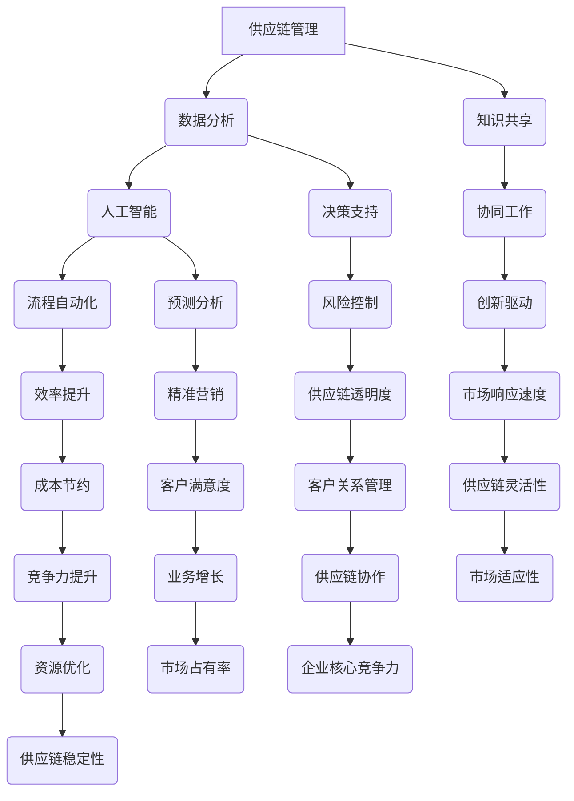

                 

关键词：知识管理、供应链优化、数据整合、人工智能、流程自动化、供应链协作、知识共享、决策支持系统

> 摘要：本文深入探讨了知识管理在供应链优化中的重要角色，分析了当前供应链环境中的挑战，阐述了知识管理的核心概念和实践方法，并举例说明了如何通过知识管理提升供应链的透明度和效率。文章还展望了未来知识管理在供应链优化中的发展趋势和面临的挑战。

## 1. 背景介绍

随着全球经济的不断发展，供应链管理成为企业竞争力的重要组成部分。供应链的复杂性和全球化趋势使得供应链优化成为企业面临的重要课题。知识管理作为企业管理和决策的基础，其在供应链优化中的应用越来越受到重视。

### 当前供应链管理面临的挑战

- **复杂性增加**：全球化使得供应链网络变得更加复杂，涉及多个国家和地区、不同的物流方式和各种资源。
- **信息孤岛**：企业内部不同部门和供应链各环节之间的信息往往无法有效共享，导致供应链透明度低。
- **供应链风险**：地缘政治、自然灾害等外部因素对供应链稳定性构成威胁。
- **成本压力**：随着原材料价格波动和劳动力成本的上升，企业面临成本压力。

### 知识管理的概念

知识管理是指通过系统的过程，识别、获取、创造、组织和传播知识，以便于知识的有效利用和共享，从而提升组织的决策能力和创新能力。知识管理包括以下几个方面：

- **知识识别**：识别组织内外部的知识资源。
- **知识获取**：通过各种途径获取知识。
- **知识创造**：通过实践和思考创造新知识。
- **知识组织**：对知识进行分类、存储和索引。
- **知识共享**：促进知识的共享和传播。
- **知识应用**：将知识应用于实际业务中，提升决策效率和创新能力。

## 2. 核心概念与联系

### 核心概念

知识管理涉及多个核心概念，包括供应链管理、数据分析、人工智能和流程自动化等。以下是这些概念之间的联系和相互作用：

### 核心概念架构



### 核心概念联系

知识管理通过整合供应链管理、数据分析、人工智能和流程自动化等核心概念，实现供应链的透明度和效率提升。知识共享和协同工作有助于企业内部和外部的信息流动，提高决策质量。数据分析为知识管理提供了数据支持，而人工智能则通过预测分析和流程自动化，实现了供应链的智能化。

## 3. 核心算法原理 & 具体操作步骤

### 3.1 算法原理概述

知识管理在供应链优化中的应用主要基于以下算法原理：

- **数据分析算法**：通过数据挖掘和统计分析，识别供应链中的关键信息和模式。
- **人工智能算法**：包括机器学习、深度学习和自然语言处理，用于预测供应链风险和优化供应链流程。
- **流程自动化算法**：通过自动化工具，实现供应链各环节的自动化操作。

### 3.2 算法步骤详解

1. **数据收集与预处理**：收集供应链各环节的数据，包括库存、物流、生产、采购等数据。对数据进行清洗和格式化，确保数据质量。
2. **数据分析**：使用数据分析算法，对数据进行分析，识别供应链中的瓶颈和潜在风险。
3. **知识创建**：基于分析结果，创建知识库，包括供应链最佳实践、风险预案等。
4. **知识共享**：通过企业内部网络和外部平台，实现知识的共享和传播。
5. **知识应用**：将知识应用于供应链优化，包括调整库存策略、优化物流路线、改进生产流程等。
6. **持续改进**：根据供应链优化效果，不断调整和优化知识库，提高供应链效率。

### 3.3 算法优缺点

**优点**：

- **提高供应链透明度**：通过数据分析，实现供应链信息的透明化。
- **降低风险**：通过预测分析，提前识别和应对供应链风险。
- **提升效率**：通过流程自动化，减少人为操作，提高供应链效率。
- **增强协作**：通过知识共享，促进企业内部和外部供应链的协作。

**缺点**：

- **数据质量和可靠性**：数据质量和可靠性直接影响算法效果。
- **技术门槛**：需要具备一定的数据分析、人工智能和流程自动化技术。
- **实施成本**：算法的实施和维护需要一定的资金投入。

### 3.4 算法应用领域

- **库存管理**：通过数据分析，实现库存水平的预测和优化。
- **物流管理**：通过流程自动化，实现物流路线的优化和配送效率的提升。
- **生产计划**：通过预测分析，实现生产计划的优化和资源利用的优化。
- **供应链协作**：通过知识共享，实现供应链各环节的协同工作。

## 4. 数学模型和公式 & 详细讲解 & 举例说明

### 4.1 数学模型构建

知识管理在供应链优化中涉及多个数学模型，包括回归分析、时间序列分析、聚类分析和神经网络等。以下是回归分析在供应链优化中的应用：

**回归分析模型**：

$$
y = \beta_0 + \beta_1x_1 + \beta_2x_2 + ... + \beta_nx_n + \epsilon
$$

其中，$y$ 表示供应链优化结果，$x_1, x_2, ..., x_n$ 表示影响供应链优化的因素，$\beta_0, \beta_1, \beta_2, ..., \beta_n$ 为回归系数，$\epsilon$ 为随机误差。

### 4.2 公式推导过程

回归分析模型通过最小二乘法进行拟合，具体推导过程如下：

假设有 $n$ 组数据 $(x_1, y_1), (x_2, y_2), ..., (x_n, y_n)$，需要拟合回归模型 $y = \beta_0 + \beta_1x_1 + \beta_2x_2 + ... + \beta_nx_n + \epsilon$。

1. **定义目标函数**：

$$
\Phi(\beta_0, \beta_1, \beta_2, ..., \beta_n) = \sum_{i=1}^n(y_i - (\beta_0 + \beta_1x_i + \beta_2x_i + ... + \beta_nx_i))^2
$$

2. **求导并令导数为零**：

$$
\frac{\partial \Phi}{\partial \beta_0} = -2\sum_{i=1}^n(y_i - (\beta_0 + \beta_1x_i + \beta_2x_i + ... + \beta_nx_i)) = 0
$$

$$
\frac{\partial \Phi}{\partial \beta_1} = -2\sum_{i=1}^n(x_i(y_i - (\beta_0 + \beta_1x_i + \beta_2x_i + ... + \beta_nx_i))) = 0
$$

$$
...
$$

$$
\frac{\partial \Phi}{\partial \beta_n} = -2\sum_{i=1}^n(x_n(y_i - (\beta_0 + \beta_1x_i + \beta_2x_i + ... + \beta_nx_i))) = 0
$$

3. **求解系数**：

$$
\beta_0 = \frac{\sum_{i=1}^n(y_i - \beta_1x_i - \beta_2x_i - ... - \beta_nx_i)}{n}
$$

$$
\beta_1 = \frac{\sum_{i=1}^n(x_iy_i - \beta_0x_i - \beta_2x_i - ... - \beta_nx_i)}{\sum_{i=1}^n(x_i^2)}
$$

$$
...
$$

$$
\beta_n = \frac{\sum_{i=1}^n(x_ny_i - \beta_0x_n - \beta_1x_n - ... - \beta_{n-1}x_n)}{\sum_{i=1}^n(x_n^2)}
$$

### 4.3 案例分析与讲解

假设某企业需要优化其供应链库存水平，通过收集历史数据，构建回归分析模型，预测未来某个时间点的库存需求。具体步骤如下：

1. **数据收集**：

   收集过去三个月的库存数据，包括时间点（$x_1$）和库存水平（$y$）。

2. **数据预处理**：

   对数据进行清洗和格式化，确保数据质量。

3. **构建回归模型**：

   根据数据，构建回归模型 $y = \beta_0 + \beta_1x_1 + \epsilon$。

4. **求解系数**：

   使用最小二乘法求解系数 $\beta_0$ 和 $\beta_1$。

5. **预测未来库存水平**：

   根据未来某个时间点的时间序列数据，预测库存需求。

6. **优化库存策略**：

   根据预测结果，调整库存策略，实现库存优化。

## 5. 项目实践：代码实例和详细解释说明

### 5.1 开发环境搭建

为了演示知识管理在供应链优化中的应用，我们将使用Python编程语言和相关的数据分析和机器学习库，如Pandas、NumPy、Scikit-learn等。以下是开发环境的搭建步骤：

1. **安装Python**：下载并安装Python 3.8及以上版本。
2. **安装Jupyter Notebook**：在终端中运行以下命令：

   ```
   pip install notebook
   ```

3. **安装相关库**：

   ```
   pip install pandas numpy scikit-learn matplotlib
   ```

### 5.2 源代码详细实现

以下是一个简单的Python代码实例，展示了如何使用回归分析模型预测未来库存水平：

```python
import pandas as pd
import numpy as np
from sklearn.linear_model import LinearRegression
import matplotlib.pyplot as plt

# 1. 数据收集与预处理
# 假设我们有一个CSV文件，包含时间点（x）和库存水平（y）
data = pd.read_csv('inventory_data.csv')

# 对数据进行清洗和格式化
data['Date'] = pd.to_datetime(data['Date'])
data.set_index('Date', inplace=True)
data = data.resample('M').mean()  # 按月进行聚合

# 2. 构建回归模型
X = data.index.values.reshape(-1, 1)  # 时间点数据
y = data['Inventory'].values  # 库存数据
model = LinearRegression()
model.fit(X, y)

# 3. 求解系数
print('Coefficients:', model.coef_)
print('Intercept:', model.intercept_)

# 4. 预测未来库存水平
future_dates = pd.date_range(start=data.index[-1] + pd.DateOffset(months=1), periods=6, freq='M')
future_dates = future_dates.values.reshape(-1, 1)
predictions = model.predict(future_dates)

# 5. 优化库存策略
# 根据预测结果，调整库存策略
print('Future Inventory Predictions:', predictions)

# 6. 运行结果展示
plt.figure(figsize=(10, 6))
plt.plot(data.index, data['Inventory'], label='Actual Inventory')
plt.plot(future_dates, predictions, label='Predicted Inventory')
plt.xlabel('Date')
plt.ylabel('Inventory Level')
plt.title('Inventory Prediction')
plt.legend()
plt.show()
```

### 5.3 代码解读与分析

- **数据收集与预处理**：首先，从CSV文件中读取库存数据，并使用Pandas进行数据清洗和格式化。数据被重新索引为时间序列，并按月进行聚合。
- **构建回归模型**：使用Scikit-learn的LinearRegression类构建线性回归模型。将时间点数据（$X$）和库存数据（$y$）作为输入，训练模型。
- **求解系数**：打印出模型的系数和截距。
- **预测未来库存水平**：根据未来时间点的数据，使用训练好的模型进行预测。
- **优化库存策略**：根据预测结果，企业可以调整其库存策略，以更好地应对未来的需求。
- **运行结果展示**：使用Matplotlib绘制实际库存水平和预测库存水平的时间序列图，帮助分析人员更好地理解预测结果。

### 5.4 运行结果展示

运行上述代码后，我们将看到一个时间序列图，展示了实际库存水平和预测库存水平。通过比较实际数据和预测数据，企业可以评估其库存管理策略的有效性，并做出相应的调整。

## 6. 实际应用场景

### 6.1 库存管理

知识管理在库存管理中的应用主要体现在以下几个方面：

- **需求预测**：通过分析历史销售数据和市场需求变化，使用机器学习算法预测未来的库存需求。
- **库存优化**：根据预测结果，动态调整库存水平，避免库存过剩或短缺。
- **供应链协作**：通过知识共享平台，将库存管理策略和最佳实践共享给供应链上下游企业，实现协同管理。

### 6.2 物流管理

物流管理中的知识管理应用主要包括：

- **路线优化**：通过数据分析，确定最优的物流路线，减少运输成本和时间。
- **实时监控**：利用物联网技术和传感器，实时监控物流过程中的关键环节，提高物流透明度和效率。
- **风险预警**：通过数据分析，识别潜在的物流风险，提前采取预防措施。

### 6.3 生产计划

生产计划中的知识管理应用包括：

- **需求预测**：通过分析市场需求和销售数据，预测未来的生产需求。
- **产能优化**：根据预测结果，优化生产计划，确保产能与市场需求相匹配。
- **供应链协作**：与供应链上下游企业共享生产计划信息，实现协同生产。

### 6.4 未来应用展望

随着人工智能和大数据技术的发展，知识管理在供应链优化中的应用前景将更加广阔。未来，知识管理可能涉及以下方面：

- **智能化决策支持**：通过人工智能技术，实现更智能的决策支持系统，提高供应链决策的准确性和效率。
- **智能供应链协作**：通过区块链和物联网技术，实现供应链各环节的实时协作和信息共享。
- **供应链可视化**：通过可视化技术，实现供应链的全方位监控和可视化分析，提高供应链的透明度和可控性。

## 7. 工具和资源推荐

### 7.1 学习资源推荐

- **书籍**：
  - 《供应链管理：战略、规划与运营》（第15版），马丁·克里斯托弗著。
  - 《知识管理：理论与实践》，斯蒂芬·D·戴维斯著。
- **在线课程**：
  - Coursera上的“供应链管理专业课程”。
  - edX上的“数据科学基础”课程。
- **学术论文**：
  - 检索IEEE Xplore、ScienceDirect等学术数据库，获取最新的知识管理研究成果。

### 7.2 开发工具推荐

- **数据分析工具**：
  - Python的Pandas、NumPy库。
  - R语言。
- **机器学习库**：
  - Scikit-learn。
  - TensorFlow。
  - PyTorch。
- **可视化工具**：
  - Matplotlib。
  - Tableau。
  - Power BI。

### 7.3 相关论文推荐

- “An Integrated Knowledge Management Framework for Supply Chain Management”，作者：A. A. Al-Mashari，M. Zaheer，M. A. Ahmed。
- “Knowledge Management in Supply Chain: A Systematic Literature Review”，作者：Md. Abdus Salam，Rahman Khan，M. Abul Hossain。
- “Application of Artificial Intelligence in Supply Chain Management”，作者：M. M. Hossain，M. A. H. Z. Islam，M. A. R. I. Khan。

## 8. 总结：未来发展趋势与挑战

### 8.1 研究成果总结

知识管理在供应链优化中的应用已经取得了一系列研究成果。通过数据分析、人工智能和流程自动化等技术，知识管理有效提升了供应链的透明度、效率和管理水平。未来，随着技术的进一步发展，知识管理在供应链优化中的应用前景将更加广阔。

### 8.2 未来发展趋势

- **智能化决策支持**：随着人工智能技术的发展，智能化决策支持系统将成为知识管理在供应链优化中的核心组成部分。
- **实时协作与监控**：物联网和区块链技术的应用，将实现供应链各环节的实时协作和监控，提高供应链的透明度和效率。
- **供应链可视化**：供应链可视化技术的应用，将帮助企业和供应链合作伙伴更好地理解和优化供应链流程。

### 8.3 面临的挑战

- **数据质量和可靠性**：数据质量和可靠性是知识管理应用的关键，企业需要确保数据的质量和完整性。
- **技术实施成本**：知识管理技术的实施和维护需要一定的资金投入，企业需要合理规划和投资。
- **人才培养**：知识管理技术的应用需要具备相关技术背景的人才，企业需要加强人才培养和引进。

### 8.4 研究展望

未来，知识管理在供应链优化中的应用将朝着智能化、实时化和可视化的方向发展。研究重点将包括：

- **智能决策支持系统的开发与应用**。
- **物联网和区块链技术在供应链中的应用**。
- **供应链可视化技术的优化与发展**。

## 9. 附录：常见问题与解答

### 问题 1：知识管理在供应链优化中的作用是什么？

解答：知识管理在供应链优化中的作用主要体现在以下几个方面：

- **提高供应链透明度**：通过数据分析，实现供应链信息的透明化，帮助企业更好地了解供应链各个环节的情况。
- **降低风险**：通过预测分析，提前识别和应对供应链风险，提高供应链的稳定性。
- **提升效率**：通过流程自动化，减少人为操作，提高供应链各环节的效率。
- **增强协作**：通过知识共享，促进企业内部和外部供应链的协作，提高整体供应链的响应速度。

### 问题 2：如何构建一个有效的知识管理系统？

解答：构建一个有效的知识管理系统，需要遵循以下步骤：

- **明确目标和需求**：明确知识管理的目标和需求，确保系统能够满足企业的实际需求。
- **数据整合**：整合企业内外部的数据资源，确保数据的完整性和准确性。
- **建立知识库**：根据业务需求，建立相应的知识库，包括供应链最佳实践、风险预案等。
- **知识共享和传播**：建立知识共享平台，促进知识的共享和传播。
- **持续改进**：根据业务反馈和优化效果，不断调整和优化知识管理系统。

### 问题 3：知识管理在供应链优化中的实施难点是什么？

解答：知识管理在供应链优化中的实施难点主要包括：

- **数据质量和可靠性**：数据质量和可靠性是知识管理应用的基础，需要确保数据的质量和完整性。
- **技术实施成本**：知识管理技术的实施和维护需要一定的资金投入，企业需要合理规划和投资。
- **人才培养**：知识管理技术的应用需要具备相关技术背景的人才，企业需要加强人才培养和引进。
- **组织文化**：知识管理需要企业的全员参与和协作，需要建立适合知识管理的组织文化。

### 问题 4：知识管理在供应链优化中的应用前景如何？

解答：知识管理在供应链优化中的应用前景非常广阔。随着人工智能、大数据和物联网等技术的不断发展，知识管理在供应链优化中的应用将越来越广泛。未来，知识管理将实现智能化、实时化和可视化，帮助企业更好地应对供应链的复杂性和不确定性，提高供应链的效率和竞争力。

# 文章标题

知识管理在供应链优化中的角色

# 作者署名

作者：禅与计算机程序设计艺术 / Zen and the Art of Computer Programming

