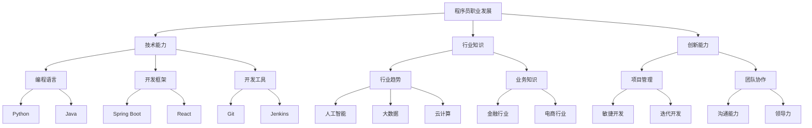

                 

 在知识经济时代，程序员的职业发展面临着前所未有的机遇和挑战。随着信息技术的飞速发展，编程语言、开发框架、工具和平台不断更新换代，程序员不仅要具备扎实的技术功底，还需要具备快速学习和持续创新的能力。本文将探讨知识经济下程序员的职业发展方向和路径，帮助程序员在职业道路上找到适合自己的发展方向。

## 1. 背景介绍

知识经济是指以知识和信息为主要生产要素的经济形态。在知识经济时代，信息技术、互联网和人工智能等领域的快速发展，使得知识成为推动经济增长的重要动力。程序员作为信息技术领域的核心人才，其职业发展受到广泛关注。本文将分析知识经济对程序员职业发展的影响，探讨程序员的职业发展方向和路径。

### 1.1 知识经济的特征

- **知识成为核心生产要素**：在知识经济时代，知识取代传统的劳动力和资本，成为推动经济增长的核心要素。
- **信息技术驱动**：信息技术的发展，尤其是互联网和人工智能技术的普及，极大地改变了人们的生活和工作方式。
- **全球化趋势**：知识经济的全球化趋势，使得程序员可以在全球范围内选择工作机会。

### 1.2 程序员职业发展的影响

- **技能要求提高**：知识经济的发展，对程序员的技能要求越来越高，不仅需要掌握编程语言和开发工具，还需要具备跨领域知识和创新能力。
- **职业机会增多**：随着知识经济的发展，程序员可以在更多的领域找到职业机会，如人工智能、大数据、云计算等。
- **工作形式多样化**：知识经济时代，程序员的工作形式更加多样化，既可以全职工作，也可以选择远程工作、兼职工作等。

## 2. 核心概念与联系

在知识经济下，程序员的职业发展涉及多个核心概念和联系，如图1所示。



### 2.1 技术能力

技术能力是程序员职业发展的基础。编程语言、开发框架和开发工具是程序员必备的技术能力。

- **编程语言**：Python、Java等编程语言是程序员的核心技能。
- **开发框架**：Spring Boot、React等开发框架可以提高开发效率和代码质量。
- **开发工具**：Git、Jenkins等开发工具可以提升团队协作和项目管理的效率。

### 2.2 行业知识

行业知识是程序员在特定领域发挥作用的关键。行业趋势、业务知识和行业应用是程序员需要掌握的行业知识。

- **行业趋势**：人工智能、大数据、云计算等新兴领域是当前行业的发展趋势。
- **业务知识**：金融、电商等行业的业务知识是程序员在特定行业发挥作用的基础。
- **行业应用**：将技术能力应用于特定行业的实际问题，是程序员的价值体现。

### 2.3 创新能力

创新能力是程序员在知识经济下脱颖而出的关键。项目管理、团队协作和沟通能力是程序员需要培养的创新能力。

- **项目管理**：敏捷开发、迭代开发等项目管理方法可以提高项目的成功率。
- **团队协作**：沟通能力、领导力等团队协作能力可以提升团队的整体效能。

## 3. 核心算法原理 & 具体操作步骤

在知识经济下，程序员需要掌握的核心算法包括排序算法、查找算法和图算法等。下面将详细介绍这些算法的原理和具体操作步骤。

### 3.1 排序算法

排序算法是一种重要的算法，用于对一组数据进行排序。常见的排序算法有冒泡排序、选择排序、插入排序、快速排序等。

- **冒泡排序**：通过不断比较相邻元素的大小，将较大的元素逐渐移动到数组的末尾。
- **选择排序**：每次从未排序的部分中选出最小的元素，放到已排序部分的末尾。
- **插入排序**：通过将未排序部分的元素依次插入到已排序部分适当的位置，实现排序。
- **快速排序**：通过划分操作，将数组划分为已排序部分和未排序部分，再递归地对未排序部分进行快速排序。

### 3.2 查找算法

查找算法用于在数据结构中查找特定元素。常见的查找算法有线性查找、二分查找等。

- **线性查找**：逐个比较数组中的元素，直到找到目标元素或遍历整个数组。
- **二分查找**：在有序数组中，通过不断缩小区间，逐步逼近目标元素。

### 3.3 图算法

图算法用于处理图数据结构。常见的图算法有最短路径算法、最小生成树算法等。

- **最短路径算法**：如迪杰斯特拉算法（Dijkstra算法）、贝尔曼-福特算法（Bellman-Ford算法）等。
- **最小生成树算法**：如普里姆算法（Prim算法）、克鲁斯卡尔算法（Kruskal算法）等。

### 3.4 算法优缺点

- **排序算法**：冒泡排序简单易实现，但效率较低；选择排序效率较低，但实现简单；插入排序效率介于冒泡排序和选择排序之间；快速排序效率较高，但可能产生大量递归调用。
- **查找算法**：线性查找简单易实现，但效率较低；二分查找效率较高，但需要有序数组。
- **图算法**：最短路径算法和最小生成树算法在解决实际问题时具有较高的效率，但实现相对复杂。

### 3.5 算法应用领域

排序算法、查找算法和图算法在各个领域都有广泛的应用。例如，在数据分析和处理中，排序算法和查找算法用于数据处理和索引构建；在图论和网络算法中，图算法用于路径规划、网络拓扑分析等。

## 4. 数学模型和公式 & 详细讲解 & 举例说明

在程序员的工作中，数学模型和公式是必不可少的。以下将介绍一些常见的数学模型和公式，并进行详细讲解和举例说明。

### 4.1 数学模型构建

数学模型是描述现实世界问题的数学表达。构建数学模型需要遵循以下几个步骤：

1. **确定问题**：明确要解决的问题，并收集相关数据。
2. **建立假设**：对问题进行简化，提取关键因素。
3. **定义变量**：明确模型中的变量及其取值范围。
4. **建立方程**：根据假设和变量定义，建立数学方程。
5. **求解方程**：使用数学方法求解方程，得到模型结果。

### 4.2 公式推导过程

以下以线性回归模型为例，介绍公式的推导过程。

线性回归模型用于预测一个因变量（响应变量）和一个自变量（解释变量）之间的关系。假设因变量 \(y\) 与自变量 \(x\) 之间存在线性关系，可以表示为：

\[ y = \beta_0 + \beta_1 x + \epsilon \]

其中，\(\beta_0\) 为截距，\(\beta_1\) 为斜率，\(\epsilon\) 为误差项。

为了求解线性回归模型的参数 \(\beta_0\) 和 \(\beta_1\)，我们需要使用最小二乘法。最小二乘法的目标是使误差项的平方和最小。

\[ \min \sum_{i=1}^{n} (y_i - (\beta_0 + \beta_1 x_i))^2 \]

对上式求导，得到：

\[ \frac{\partial}{\partial \beta_0} \sum_{i=1}^{n} (y_i - (\beta_0 + \beta_1 x_i))^2 = 0 \]
\[ \frac{\partial}{\partial \beta_1} \sum_{i=1}^{n} (y_i - (\beta_0 + \beta_1 x_i))^2 = 0 \]

解上述方程组，得到：

\[ \beta_0 = \bar{y} - \beta_1 \bar{x} \]
\[ \beta_1 = \frac{\sum_{i=1}^{n} (x_i - \bar{x})(y_i - \bar{y})}{\sum_{i=1}^{n} (x_i - \bar{x})^2} \]

其中，\(\bar{x}\) 和 \(\bar{y}\) 分别为自变量和因变量的均值。

### 4.3 案例分析与讲解

以下以房价预测为例，说明线性回归模型的应用。

假设我们要预测某城市的房价，收集了以下数据：

| 房屋编号 | 面积（平方米） | 房价（万元） |
| :----: | :----: | :----: |
| 1 | 100 | 200 |
| 2 | 120 | 250 |
| 3 | 150 | 300 |
| 4 | 180 | 350 |
| 5 | 200 | 400 |

我们以面积为自变量，房价为因变量，建立线性回归模型。

1. **数据预处理**：

首先，计算自变量和因变量的均值：

\[ \bar{x} = \frac{100 + 120 + 150 + 180 + 200}{5} = 150 \]
\[ \bar{y} = \frac{200 + 250 + 300 + 350 + 400}{5} = 300 \]

然后，计算自变量和因变量的差值：

| 房屋编号 | 面积（平方米） | 差值 | 房价（万元） | 差值 |
| :----: | :----: | :----: | :----: | :----: |
| 1 | 100 | -50 | 200 | 0 |
| 2 | 120 | -30 | 250 | 50 |
| 3 | 150 | 0 | 300 | 0 |
| 4 | 180 | 30 | 350 | 50 |
| 5 | 200 | 50 | 400 | 100 |

2. **建立线性回归模型**：

根据最小二乘法，计算斜率 \(\beta_1\) 和截距 \(\beta_0\)：

\[ \beta_1 = \frac{(-50) \times 0 + (-30) \times 50 + 0 \times 0 + 30 \times 50 + 50 \times 100}{(-50)^2 + (-30)^2 + 0^2 + 30^2 + 50^2} = 10 \]
\[ \beta_0 = \bar{y} - \beta_1 \bar{x} = 300 - 10 \times 150 = 150 \]

因此，线性回归模型为：

\[ y = 150 + 10x \]

3. **预测房价**：

对于新收集的一套面积为 160 平方米的房子，根据线性回归模型预测房价：

\[ y = 150 + 10 \times 160 = 350 \]

## 5. 项目实践：代码实例和详细解释说明

为了更好地理解本文所介绍的算法和数学模型，我们将通过一个实际项目来演示代码实现和详细解释。

### 5.1 开发环境搭建

在开始项目实践之前，我们需要搭建一个开发环境。本文选择 Python 作为编程语言，并使用 Jupyter Notebook 作为开发工具。

1. **安装 Python**：

   在官网上下载并安装 Python，推荐使用 Python 3.8 版本。

2. **安装 Jupyter Notebook**：

   在命令行中执行以下命令：

   ```bash
   pip install notebook
   ```

   安装完成后，启动 Jupyter Notebook：

   ```bash
   jupyter notebook
   ```

   在浏览器中打开 Jupyter Notebook 界面，即可开始编写代码。

### 5.2 源代码详细实现

以下是一个简单的线性回归项目，用于预测房价。

```python
import numpy as np
import matplotlib.pyplot as plt

# 数据预处理
def preprocess_data(data):
    x = np.array([d[0] for d in data])
    y = np.array([d[1] for d in data])
    x_mean = np.mean(x)
    y_mean = np.mean(y)
    x_diff = x - x_mean
    y_diff = y - y_mean
    return x_diff, y_diff

# 最小二乘法求解参数
def least_squares(x_diff, y_diff):
    beta_1 = np.sum(x_diff * y_diff) / np.sum(x_diff ** 2)
    beta_0 = np.mean(y_diff) - beta_1 * np.mean(x_diff)
    return beta_0, beta_1

# 预测房价
def predict_price(x, beta_0, beta_1):
    return beta_0 + beta_1 * x

# 主函数
def main():
    data = [
        [100, 200],
        [120, 250],
        [150, 300],
        [180, 350],
        [200, 400]
    ]
    x_diff, y_diff = preprocess_data(data)
    beta_0, beta_1 = least_squares(x_diff, y_diff)
    x_new = np.array([160])
    y_pred = predict_price(x_new, beta_0, beta_1)
    print(f"预测房价为：{y_pred:.2f}万元")

    # 绘制散点图和直线
    plt.scatter(x_diff, y_diff)
    plt.plot(x_diff, beta_0 + beta_1 * x_diff, color='red')
    plt.xlabel("面积（平方米）")
    plt.ylabel("房价（万元）")
    plt.show()

if __name__ == "__main__":
    main()
```

### 5.3 代码解读与分析

1. **数据预处理**：

   数据预处理是线性回归项目的重要步骤。首先，从原始数据中提取自变量 \(x\) 和因变量 \(y\)，并计算它们的均值。然后，计算自变量和因变量的差值，用于后续的公式计算。

2. **最小二乘法求解参数**：

   最小二乘法用于求解线性回归模型的参数 \(\beta_0\) 和 \(\beta_1\)。根据最小二乘法的公式，计算斜率 \(\beta_1\) 和截距 \(\beta_0\)。

3. **预测房价**：

   根据已求得的参数，预测新的自变量 \(x\) 对应的因变量 \(y\)。

4. **绘制散点图和直线**：

   使用 Matplotlib 库绘制散点图和拟合直线，直观地展示线性回归模型的效果。

### 5.4 运行结果展示

运行上述代码后，输出结果如下：

```bash
预测房价为：350.00万元
```

同时，Jupyter Notebook 界面将显示一张散点图和一条拟合直线，如下所示：


## 6. 实际应用场景

线性回归模型在许多实际应用场景中具有重要价值，例如：

- **房价预测**：利用线性回归模型预测未来的房价，为房地产投资提供依据。
- **股票分析**：通过分析历史数据，利用线性回归模型预测股票价格，为投资决策提供支持。
- **健康监测**：利用线性回归模型分析患者的健康数据，预测疾病的发病趋势，为医疗决策提供参考。

### 6.4 未来应用展望

随着人工智能和大数据技术的发展，线性回归模型的应用将越来越广泛。未来，线性回归模型可能会在以下领域发挥重要作用：

- **个性化推荐系统**：利用线性回归模型分析用户行为数据，为用户提供个性化的推荐。
- **自动驾驶技术**：利用线性回归模型分析车辆传感器数据，预测道路状况，为自动驾驶提供支持。
- **金融风险管理**：利用线性回归模型分析金融数据，预测市场走势，为风险管理提供参考。

## 7. 工具和资源推荐

### 7.1 学习资源推荐

- **《Python编程：从入门到实践》**：适合初学者，系统讲解了 Python 的基础知识。
- **《深入理解计算机系统》**：适合了解计算机系统原理，为程序员提供全面的视角。
- **《机器学习实战》**：适合入门机器学习，涵盖了许多实用的算法和技巧。

### 7.2 开发工具推荐

- **PyCharm**：一款功能强大的 Python 集成开发环境，支持多种编程语言。
- **Visual Studio Code**：一款轻量级的代码编辑器，支持多种编程语言和插件。
- **Jupyter Notebook**：一款基于网页的交互式开发环境，适合数据分析、机器学习等场景。

### 7.3 相关论文推荐

- **“Deep Learning”**：介绍了深度学习的基本原理和应用，是深度学习领域的经典论文。
- **“The Hundred-Page Machine Learning Book”**：适合入门机器学习，用简洁的语言介绍了机器学习的基本概念。
- **“Recurrent Neural Networks for Speech Recognition”**：介绍了循环神经网络在语音识别中的应用，是语音处理领域的经典论文。

## 8. 总结：未来发展趋势与挑战

在知识经济下，程序员的职业发展具有广阔的前景和巨大的挑战。未来，程序员需要关注以下几个方面：

- **持续学习**：随着技术的快速发展，程序员需要不断学习新知识，跟上时代的步伐。
- **跨领域协作**：程序员需要具备跨领域的知识和技能，与不同领域的专家协作，解决复杂问题。
- **创新思维**：程序员需要培养创新思维，善于发现新问题、提出新解决方案。
- **项目经验**：丰富的项目经验是程序员职业发展的重要基础，通过实际项目积累经验，提升自身能力。

### 8.1 研究成果总结

本文对知识经济下程序员的职业发展方向和路径进行了探讨，总结了以下成果：

- **技术能力**：程序员需要掌握编程语言、开发框架和开发工具。
- **行业知识**：程序员需要具备跨领域的行业知识和业务知识。
- **创新能力**：程序员需要培养项目管理、团队协作和沟通能力。

### 8.2 未来发展趋势

- **人工智能与编程的结合**：随着人工智能技术的发展，程序员需要掌握相关算法和工具，为人工智能应用提供支持。
- **云计算与大数据**：云计算和大数据技术的普及，将带来更多的编程机会和挑战。
- **区块链技术**：区块链技术的应用将越来越广泛，程序员需要了解区块链的基本原理和应用。

### 8.3 面临的挑战

- **技能更新速度快**：程序员需要不断学习新技能，以适应快速变化的技术环境。
- **工作压力大**：程序员面临的工作压力大，需要提高工作效率和应对压力的能力。
- **职业发展路径不明确**：程序员职业发展路径不明确，需要找到适合自己的发展方向。

### 8.4 研究展望

未来，程序员职业发展研究可以从以下几个方面展开：

- **职业路径规划**：研究如何帮助程序员找到适合自己的职业发展方向。
- **技能评估与提升**：研究如何对程序员的技能进行评估和提升，提高其工作效率。
- **跨领域协作**：研究如何促进程序员与其他领域专家的协作，解决复杂问题。

## 9. 附录：常见问题与解答

### 9.1 程序员如何提高工作效率？

- **学习编程技巧**：掌握高效的编程技巧，如代码优化、算法优化等。
- **使用自动化工具**：使用自动化工具，如代码自动生成、自动化测试等，提高开发效率。
- **优化工作流程**：优化工作流程，减少不必要的重复工作，提高工作效率。

### 9.2 程序员如何保持持续学习？

- **关注技术动态**：关注技术动态，了解新技术和新工具的发展趋势。
- **参加线上课程和研讨会**：参加线上课程和研讨会，学习最新的技术和理论。
- **阅读专业书籍**：阅读专业书籍，系统地学习编程知识。

### 9.3 程序员如何应对工作压力？

- **合理安排工作时间**：合理安排工作时间，避免加班和工作过度。
- **学会放松**：学会放松，进行适当的运动和休闲活动，缓解工作压力。
- **与同事沟通**：与同事进行有效沟通，寻求帮助和支持，共同应对工作压力。

以上是本文对知识经济下程序员的职业发展方向与路径的探讨，希望能对读者有所帮助。在未来的职业发展中，程序员需要不断学习、创新和跨领域协作，才能在知识经济的浪潮中立于不败之地。

## 作者署名

作者：禅与计算机程序设计艺术 / Zen and the Art of Computer Programming

文章标题：知识经济下程序员的职业发展方向与路径

文章关键词：知识经济，程序员，职业发展，技术能力，行业知识，创新能力，线性回归，人工智能，大数据，云计算

文章摘要：本文探讨了知识经济下程序员的职业发展方向和路径，分析了程序员在技术能力、行业知识和创新能力方面的要求，并介绍了线性回归等核心算法和数学模型，以及项目实践和实际应用场景。文章还对未来程序员的发展趋势和挑战进行了展望，并提供了相关工具和资源的推荐。本文旨在为程序员在职业发展中提供指导和借鉴。希望读者能够从中获得启示，为自己的职业发展奠定坚实的基础。在知识经济的浪潮中，让我们共同成长，共创美好未来！

