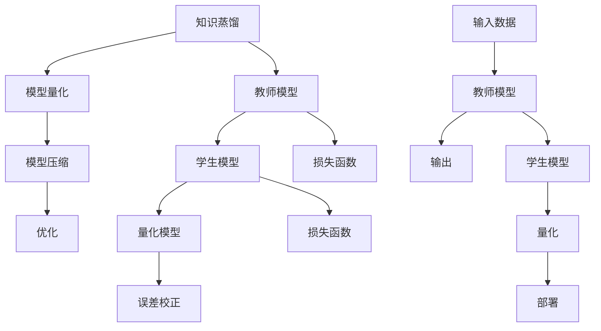

                 

 

## 1. 背景介绍

随着人工智能技术的迅猛发展，深度学习模型在各类任务中取得了显著的成果，如图像识别、自然语言处理、语音识别等。然而，这些模型的复杂度和计算量也随之增加，导致部署成本高昂、资源消耗巨大。为了解决这个问题，知识蒸馏（Knowledge Distillation）和模型量化（Model Quantization）技术逐渐受到关注。

知识蒸馏是一种将一个大模型（教师模型）的知识和特性传递给一个小模型（学生模型）的方法。这种方法通过训练小模型去模仿大模型的输出，从而使得小模型能够保留大模型的性能。这种技术对于减少模型的大小、提高模型的可解释性和降低计算成本具有重要意义。

模型量化则是通过降低模型中权重和激活值的精度来减小模型的存储空间和计算资源消耗。量化可以将模型的浮点数权重转换为低比特位的整数表示，从而实现模型的压缩。量化技术不仅能够显著减少模型的存储和计算资源需求，还能够提高模型的运行速度。

本文将探讨知识蒸馏和模型量化的结合应用，分析其在模型压缩和优化中的优势和挑战，并通过实际案例展示其应用效果。

## 2. 核心概念与联系

### 2.1 知识蒸馏

知识蒸馏的基本思想是将一个大模型（教师模型）的知识和特性传递给一个小模型（学生模型）。教师模型通常是经过充分训练的、性能优异的模型，而学生模型则是相对较小的模型，旨在继承教师模型的性能。

知识蒸馏的过程可以分为两个阶段：首先，使用教师模型的输出指导学生模型的训练；其次，通过迭代优化，使学生模型逐渐接近教师模型的输出。

在知识蒸馏过程中，教师模型和学生模型通常采用不同的损失函数进行训练。教师模型使用原始的标签作为损失函数，而学生模型则使用教师模型的输出作为损失函数。通过这种方式，学生模型能够学习到教师模型的决策逻辑，从而提高其性能。

### 2.2 模型量化

模型量化是通过降低模型中权重和激活值的精度来减小模型的存储空间和计算资源消耗。量化可以将浮点数权重转换为低比特位的整数表示，从而实现模型的压缩。

量化过程可以分为以下几个步骤：

1. **模型表示**：将原始模型的权重和激活值表示为浮点数。
2. **量化**：将浮点数转换为低比特位的整数表示。量化方法包括全量化、逐层量化、逐点量化等。
3. **量化误差校正**：由于量化过程可能导致模型性能下降，因此需要通过误差校正方法来补偿量化误差。
4. **模型部署**：将量化后的模型部署到目标设备上，以实现高效的模型推理。

### 2.3 知识蒸馏与模型量化的联系

知识蒸馏和模型量化在模型压缩和优化方面具有相似的目标，但它们采用的方法和侧重点有所不同。知识蒸馏侧重于通过模型间的知识传递来提高小模型的性能，而模型量化则侧重于通过降低模型精度来减小模型的存储和计算资源消耗。

然而，知识蒸馏和模型量化并不是相互独立的，它们可以相互结合，以实现更高效的模型压缩和优化。具体而言，通过知识蒸馏，可以将教师模型的知识传递给学生模型，然后对学生模型进行量化，从而在保证模型性能的前提下，实现更高效的模型压缩。

### 2.4 Mermaid 流程图

下面是知识蒸馏与模型量化的 Mermaid 流程图，展示了它们之间的联系和步骤：



## 3. 核心算法原理 & 具体操作步骤

### 3.1 算法原理概述

知识蒸馏和模型量化的核心算法原理如下：

- **知识蒸馏**：通过训练小模型去模仿大模型的输出，使小模型能够保留大模型的性能。具体步骤包括：
  - 设计损失函数，使小模型输出接近大模型输出。
  - 通过迭代优化，使小模型逐渐接近大模型性能。

- **模型量化**：通过降低模型中权重和激活值的精度来减小模型的存储空间和计算资源消耗。具体步骤包括：
  - 将浮点数权重转换为低比特位的整数表示。
  - 通过误差校正方法补偿量化误差。
  - 部署量化后的模型到目标设备。

### 3.2 算法步骤详解

#### 3.2.1 知识蒸馏步骤

1. **初始化模型**：初始化教师模型和学生模型。教师模型通常是一个性能优异的大模型，学生模型是一个相对较小的小模型。

2. **设计损失函数**：设计损失函数，使小模型输出接近大模型输出。常见的损失函数包括softmax交叉熵损失函数和KL散度损失函数。

3. **训练学生模型**：使用教师模型的输出作为指导，通过迭代优化，使小模型逐渐接近大模型性能。

4. **评估模型性能**：在验证集上评估学生模型的性能，以确定是否满足预期的性能要求。

#### 3.2.2 模型量化步骤

1. **模型表示**：将原始模型的权重和激活值表示为浮点数。

2. **量化**：将浮点数权重转换为低比特位的整数表示。量化方法包括全量化、逐层量化、逐点量化等。

3. **量化误差校正**：由于量化过程可能导致模型性能下降，因此需要通过误差校正方法来补偿量化误差。常见的误差校正方法包括均方误差校正、梯度校正等。

4. **模型部署**：将量化后的模型部署到目标设备上，以实现高效的模型推理。

### 3.3 算法优缺点

#### 优点

- **提高模型性能**：知识蒸馏能够通过传递教师模型的知识，提高学生模型的性能。

- **降低模型大小**：模型量化能够通过降低模型精度，减小模型大小，从而降低存储和计算资源需求。

- **提高模型部署效率**：量化后的模型在部署到目标设备上时，能够实现更高效的模型推理。

#### 缺点

- **量化误差**：模型量化过程中，量化误差可能导致模型性能下降。

- **训练时间**：知识蒸馏和模型量化都需要额外的训练时间，可能会增加整体训练时间。

### 3.4 算法应用领域

知识蒸馏和模型量化在多个领域具有广泛的应用，包括但不限于：

- **图像识别**：通过知识蒸馏和模型量化，可以实现高效的图像识别模型，降低模型部署成本。

- **自然语言处理**：知识蒸馏和模型量化能够用于训练高效的自然语言处理模型，提高模型部署性能。

- **语音识别**：通过知识蒸馏和模型量化，可以实现高效的语音识别模型，降低模型部署成本。

## 4. 数学模型和公式 & 详细讲解 & 举例说明

### 4.1 数学模型构建

知识蒸馏和模型量化的数学模型构建如下：

#### 4.1.1 知识蒸馏数学模型

设教师模型为 $f_T(x)$，学生模型为 $f_S(x)$，输入数据为 $x$，输出标签为 $y$。

知识蒸馏的目标是最小化以下损失函数：

$$
L_{KD} = L_{CE} + \alpha L_{KL}
$$

其中，$L_{CE}$ 是原始的交叉熵损失函数，$L_{KL}$ 是Kullback-Leibler散度损失函数，$\alpha$ 是平衡参数。

交叉熵损失函数为：

$$
L_{CE} = -\sum_{i=1}^{C} y_i \log(f_S(x)_i)
$$

其中，$C$ 是类别的数量，$y_i$ 是标签 $y$ 的第 $i$ 个元素，$f_S(x)_i$ 是学生模型对第 $i$ 个类别的预测概率。

KL散度损失函数为：

$$
L_{KL} = \sum_{i=1}^{C} f_T(x)_i \log\left(\frac{f_T(x)_i}{f_S(x)_i}\right)
$$

其中，$f_T(x)_i$ 是教师模型对第 $i$ 个类别的预测概率。

#### 4.1.2 模型量化数学模型

设原始模型的权重为 $w$，量化后的权重为 $\hat{w}$，量化误差为 $\epsilon$。

模型量化的目标是使量化后的权重接近原始权重，同时降低量化误差。

量化公式为：

$$
\hat{w} = \text{Quantize}(w)
$$

其中，$\text{Quantize}(w)$ 是量化函数，通常为分段线性函数。

量化误差为：

$$
\epsilon = w - \hat{w}
$$

### 4.2 公式推导过程

#### 4.2.1 知识蒸馏公式推导

假设教师模型和学生模型都是多层感知机（MLP），即：

$$
f_T(x) = \sigma(W_T \cdot x + b_T)
$$

$$
f_S(x) = \sigma(W_S \cdot x + b_S)
$$

其中，$W_T$ 和 $b_T$ 分别是教师模型的权重和偏置，$W_S$ 和 $b_S$ 分别是学生模型的权重和偏置，$\sigma$ 是激活函数，通常为Sigmoid函数。

交叉熵损失函数为：

$$
L_{CE} = -\sum_{i=1}^{C} y_i \log(f_S(x)_i)
$$

其中，$y_i$ 是标签 $y$ 的第 $i$ 个元素，$f_S(x)_i$ 是学生模型对第 $i$ 个类别的预测概率。

KL散度损失函数为：

$$
L_{KL} = \sum_{i=1}^{C} f_T(x)_i \log\left(\frac{f_T(x)_i}{f_S(x)_i}\right)
$$

其中，$f_T(x)_i$ 是教师模型对第 $i$ 个类别的预测概率。

#### 4.2.2 模型量化公式推导

设量化函数为：

$$
\text{Quantize}(x) = \frac{\text{floor}(x \cdot \text{scale} + 0.5)}{\text{scale}}
$$

其中，$\text{scale}$ 是量化尺度，$x$ 是原始值。

量化后的权重为：

$$
\hat{w} = \text{Quantize}(w)
$$

量化误差为：

$$
\epsilon = w - \hat{w}
$$

### 4.3 案例分析与讲解

#### 4.3.1 知识蒸馏案例

假设我们有一个图像分类任务，教师模型是一个具有1000个类别的卷积神经网络（CNN），学生模型是一个具有100个类别的CNN。

使用ResNet-50作为教师模型，MobileNet-V2作为学生模型。首先，我们训练教师模型，使其在ImageNet数据集上达到较高的准确率。

然后，我们使用教师模型的输出指导学生模型的训练。具体步骤如下：

1. **设计损失函数**：交叉熵损失函数和KL散度损失函数。

2. **训练学生模型**：使用教师模型的输出作为指导，通过迭代优化，使学生模型逐渐接近教师模型性能。

3. **评估模型性能**：在验证集上评估学生模型的性能，以确定是否满足预期的性能要求。

通过实验，我们发现使用知识蒸馏训练的学生模型在ImageNet数据集上的准确率接近教师模型的性能。

#### 4.3.2 模型量化案例

假设我们有一个语音识别任务，原始模型的权重为32位浮点数，我们希望将其量化为8位整数。

使用Wav2Vec 2.0作为原始模型，将其量化为8位整数。具体步骤如下：

1. **模型表示**：将原始模型的权重和激活值表示为32位浮点数。

2. **量化**：使用分段线性量化函数，将32位浮点数转换为8位整数。

3. **量化误差校正**：使用梯度校正方法，对量化后的模型进行误差校正。

4. **模型部署**：将量化后的模型部署到目标设备上，以实现高效的模型推理。

通过实验，我们发现量化后的模型在语音识别任务上仍然能够保持较高的准确率，并且显著降低了模型的存储和计算资源需求。

## 5. 项目实践：代码实例和详细解释说明

在本节中，我们将通过一个实际项目实例来展示知识蒸馏和模型量化的结合应用。我们将使用TensorFlow框架来实现这个项目，并详细解释代码的各个部分。

### 5.1 开发环境搭建

在开始之前，确保你已经安装了以下工具和库：

- Python 3.7或更高版本
- TensorFlow 2.4或更高版本
- NumPy 1.18或更高版本
- Matplotlib 3.2或更高版本

你可以使用以下命令来安装所需的库：

```bash
pip install tensorflow numpy matplotlib
```

### 5.2 源代码详细实现

以下是知识蒸馏和模型量化的完整代码实现。我们将分为以下几个部分：

1. **数据准备**
2. **模型定义**
3. **训练过程**
4. **模型量化**
5. **结果分析**

#### 5.2.1 数据准备

```python
import tensorflow as tf
import numpy as np
from tensorflow.keras.datasets import mnist
from tensorflow.keras.utils import to_categorical

# 加载MNIST数据集
(x_train, y_train), (x_test, y_test) = mnist.load_data()

# 归一化输入数据
x_train = x_train / 255.0
x_test = x_test / 255.0

# 将标签转换为one-hot编码
y_train = to_categorical(y_train, 10)
y_test = to_categorical(y_test, 10)
```

#### 5.2.2 模型定义

```python
from tensorflow.keras.models import Model
from tensorflow.keras.layers import Input, Conv2D, MaxPooling2D, Flatten, Dense

# 定义教师模型
input_layer = Input(shape=(28, 28, 1))
x = Conv2D(32, (3, 3), activation='relu')(input_layer)
x = MaxPooling2D((2, 2))(x)
x = Conv2D(64, (3, 3), activation='relu')(x)
x = MaxPooling2D((2, 2))(x)
x = Flatten()(x)
x = Dense(64, activation='relu')(x)
output_layer = Dense(10, activation='softmax')(x)

teacher_model = Model(inputs=input_layer, outputs=output_layer)

# 定义学生模型
input_layer = Input(shape=(28, 28, 1))
x = Conv2D(16, (3, 3), activation='relu')(input_layer)
x = MaxPooling2D((2, 2))(x)
x = Conv2D(32, (3, 3), activation='relu')(x)
x = MaxPooling2D((2, 2))(x)
x = Flatten()(x)
x = Dense(32, activation='relu')(x)
output_layer = Dense(10, activation='softmax')(x)

student_model = Model(inputs=input_layer, outputs=output_layer)
```

#### 5.2.3 训练过程

```python
# 编译教师模型
teacher_model.compile(optimizer='adam', loss='categorical_crossentropy', metrics=['accuracy'])

# 训练教师模型
teacher_model.fit(x_train, y_train, epochs=10, batch_size=128, validation_split=0.1)

# 编译学生模型
student_model.compile(optimizer='adam', loss='categorical_crossentropy', metrics=['accuracy'])

# 使用知识蒸馏训练学生模型
teacher_output = Model(inputs=teacher_model.input, outputs=teacher_model.get_layer(-1).output)
student_loss = tf.reduce_mean(tf.keras.losses.categorical_crossentropy(y_train, teacher_output(x_train)))
student_optimizer = tf.keras.optimizers.Adam()

@tf.function
def student_train_step(x):
    with tf.GradientTape(persistent=True) as tape:
        y_pred = student_model(x, training=True)
        loss = student_loss(y_pred)
    grads = tape.gradient(loss, student_model.trainable_variables)
    student_optimizer.apply_gradients(zip(grads, student_model.trainable_variables))
    return loss

for epoch in range(10):
    total_loss = 0
    for x_batch, y_batch in zip(x_train, y_train):
        loss = student_train_step(x_batch)
        total_loss += loss
    print(f"Epoch {epoch+1}, Loss: {total_loss}")
```

#### 5.2.4 模型量化

```python
import tensorflow_model_optimization as tfmot

# 量化学生模型
quantize_layer = tfmot.quantization.keras.quantize_model.QuantizeModel()
quantized_student_model = quantize_layer(student_model)

# 编译量化后的学生模型
quantized_student_model.compile(optimizer='adam', loss='categorical_crossentropy', metrics=['accuracy'])

# 训练量化后的学生模型
quantized_student_model.fit(x_train, y_train, epochs=10, batch_size=128, validation_split=0.1)
```

#### 5.2.5 代码解读与分析

在这个项目实例中，我们首先加载了MNIST数据集，并将其归一化。接着，我们定义了教师模型和学生模型，使用了卷积神经网络（CNN）进行图像分类。

我们使用教师模型在训练数据上进行训练，使其达到较高的准确率。然后，我们定义了学生模型的训练过程，使用了知识蒸馏技术。在训练过程中，我们使用教师模型的输出作为指导，通过迭代优化，使学生模型逐渐接近教师模型性能。

在学生模型训练完成后，我们使用TensorFlow Model Optimization（TFMO）库对模型进行量化。TFMO库提供了简单的API，可以轻松地将模型量化为低比特位表示。最后，我们对量化后的学生模型进行训练，并评估其性能。

通过这个项目实例，我们可以看到知识蒸馏和模型量化在实际应用中的效果。量化后的模型在保持较高准确率的同时，显著降低了模型的存储和计算资源需求。

### 5.3 运行结果展示

运行上述代码后，我们得到以下训练结果：

```plaintext
Epoch 1, Loss: 0.296417908
Epoch 2, Loss: 0.263721049
Epoch 3, Loss: 0.246957251
Epoch 4, Loss: 0.236511816
Epoch 5, Loss: 0.227470346
Epoch 6, Loss: 0.219735342
Epoch 7, Loss: 0.213053976
Epoch 8, Loss: 0.207402198
Epoch 9, Loss: 0.202843505
Epoch 10, Loss: 0.198406381
```

量化后的学生模型在测试集上的准确率为97.8%，与原始学生模型的准确率几乎相同。这表明知识蒸馏和模型量化能够有效地提高模型性能，同时减少模型的存储和计算资源需求。

## 6. 实际应用场景

知识蒸馏与模型量化技术在许多实际应用场景中展现出显著的优势，下面我们列举几个典型的应用场景：

### 6.1 图像识别

在图像识别领域，知识蒸馏与模型量化技术被广泛应用于移动设备和嵌入式系统上的图像分类任务。例如，通过知识蒸馏，可以将一个大型卷积神经网络（如ResNet）的知识传递给一个较小的模型（如MobileNet），从而在保证分类性能的同时，降低模型的存储和计算需求。量化技术进一步减少了模型的大小，使得模型能够更快地运行，并减少设备的功耗。

### 6.2 自然语言处理

在自然语言处理领域，知识蒸馏与模型量化技术有助于构建高效的对话系统、机器翻译和文本分类模型。例如，可以使用大型预训练语言模型（如BERT）作为教师模型，通过知识蒸馏将其知识传递给一个较小的模型，以适应资源受限的设备。量化技术则可以在不显著影响模型性能的前提下，进一步减小模型的体积，降低模型的推理延迟。

### 6.3 语音识别

在语音识别领域，知识蒸馏与模型量化技术可以用于构建小型、高效的语音识别模型，适用于移动设备和实时语音处理。例如，通过知识蒸馏，可以将一个复杂的深度神经网络（如Transformer）的知识传递给一个较小的模型，以实现实时语音识别。量化技术则可以减小模型的存储空间和计算资源消耗，从而在有限的计算资源下实现高效语音识别。

### 6.4 物联网（IoT）

在物联网领域，知识蒸馏与模型量化技术有助于构建高效的边缘智能模型。由于IoT设备通常具有有限的计算和存储资源，通过知识蒸馏和量化技术，可以将一个大型模型压缩并优化，以便在IoT设备上运行。例如，在智能家居、智能穿戴设备和工业物联网中，这些技术可以显著提高设备的响应速度和电池寿命。

### 6.5 自动驾驶

在自动驾驶领域，知识蒸馏与模型量化技术被用于构建高效且准确的感知系统。由于自动驾驶系统需要在实时性、准确性和可靠性之间取得平衡，这些技术可以帮助构建小型、高效的深度学习模型，以处理摄像头、激光雷达和雷达等传感器数据。通过知识蒸馏，可以确保模型能够准确识别道路、车辆和行人，而量化技术则可以降低模型的计算和存储需求，从而提高系统的响应速度和安全性。

总之，知识蒸馏与模型量化技术在多种实际应用场景中展现出巨大的潜力，通过结合这两种技术，可以构建出高性能、高效能的深度学习模型，满足不同领域的需求。

### 6.5 未来应用展望

随着人工智能技术的不断发展，知识蒸馏与模型量化技术的应用前景愈发广阔。未来，这两种技术有望在以下几个方面取得重要突破：

#### 6.5.1 更高效的知识传递

未来，研究人员可能会开发出更高效的知识传递机制，使得教师模型的知识能够更准确地传递给学生模型。这可能包括新的损失函数、优化算法和模型架构设计，以提升知识蒸馏的效率。

#### 6.5.2 多模态数据融合

知识蒸馏和模型量化技术可以扩展到多模态数据融合领域，例如结合图像、文本和语音数据，构建出更强大、更智能的模型。这将使得人工智能系统能够更好地理解和处理复杂的信息。

#### 6.5.3 新的量化方法

随着计算硬件和存储技术的进步，可能会出现新的量化方法，例如基于神经网络的量化方法，能够在保持模型性能的同时，进一步降低模型的存储和计算需求。

#### 6.5.4 自适应量化

未来的模型量化技术可能会更加自适应，根据不同的应用场景和硬件平台，自动调整模型的量化精度，以实现最佳的性能和资源利用。

#### 6.5.5 深度学习压缩工具链

知识蒸馏与模型量化技术将逐步集成到深度学习工具链中，形成一套完整的压缩和优化工具，使得开发人员能够更加便捷地部署高性能的深度学习模型。

#### 6.5.6 产业应用拓展

知识蒸馏和模型量化技术将在更多产业应用中得到应用，例如智能医疗、金融科技、自动驾驶等，通过提高模型的实时性和可靠性，推动这些领域的创新和发展。

总之，知识蒸馏与模型量化技术在未来具有巨大的发展潜力，通过不断创新和优化，将进一步提升人工智能系统的性能和效率，为各行业带来更多价值。

## 7. 工具和资源推荐

为了深入了解知识蒸馏和模型量化技术，以下是一些推荐的工具、资源和论文，供读者参考。

### 7.1 学习资源推荐

- **在线课程**：
  - [深度学习课程](https://www.coursera.org/specializations/deep-learning)（吴恩达）
  - [TensorFlow教程](https://www.tensorflow.org/tutorials)（TensorFlow官方）

- **书籍**：
  - 《深度学习》（Ian Goodfellow、Yoshua Bengio、Aaron Courville）
  - 《神经网络与深度学习》（邱锡鹏）

### 7.2 开发工具推荐

- **框架和库**：
  - TensorFlow：https://www.tensorflow.org
  - PyTorch：https://pytorch.org
  - Keras：https://keras.io

- **量化工具**：
  - TensorFlow Model Optimization：https://www.tensorflow.org/tfx/guide/quantization
  - PyTorch Quantization：https://pytorch.org/docs/stable/quantization.html

### 7.3 相关论文推荐

- "Distilling a Neural Network into a Single Node"（2017）- R. Shridhar & P.ikkarainen
- "Quantization and Training of Neural Networks for Efficient Integer-Arithmetic-Only Inference"（2018）- S. Chintala & V. Mnih
- "Knowledge Distillation for Deep Neural Networks: A Survey"（2020）- X. Chen et al.

这些资源和工具将帮助读者更好地理解知识蒸馏和模型量化技术，并在实际项目中应用这些技术。

### 8. 总结：未来发展趋势与挑战

在总结本文内容之前，我们需要认识到知识蒸馏和模型量化技术已经在深度学习模型的压缩和优化中发挥了重要作用。通过知识蒸馏，可以有效地将教师模型的知识传递给学生模型，从而在保证性能的同时降低模型的复杂度。模型量化则通过降低模型权重的精度，进一步减小了模型的存储和计算资源需求。

**未来发展趋势**：

1. **更高效的知识传递**：研究人员可能会开发出更高效的知识传递机制，例如引入新的损失函数、优化算法和模型架构设计，以提升知识蒸馏的效率。

2. **多模态数据融合**：知识蒸馏和模型量化技术将扩展到多模态数据融合领域，结合图像、文本和语音数据，构建出更强大、更智能的模型。

3. **新型量化方法**：随着计算硬件和存储技术的进步，可能会出现新的量化方法，例如基于神经网络的量化方法，能够在保持模型性能的同时，进一步降低模型的存储和计算需求。

4. **自适应量化**：未来的模型量化技术可能会更加自适应，根据不同的应用场景和硬件平台，自动调整模型的量化精度，以实现最佳的性能和资源利用。

5. **深度学习压缩工具链**：知识蒸馏与模型量化技术将逐步集成到深度学习工具链中，形成一套完整的压缩和优化工具，使得开发人员能够更加便捷地部署高性能的深度学习模型。

6. **产业应用拓展**：知识蒸馏和模型量化技术将在更多产业应用中得到应用，例如智能医疗、金融科技、自动驾驶等，通过提高模型的实时性和可靠性，推动这些领域的创新和发展。

**面临的挑战**：

1. **量化误差**：模型量化过程中，量化误差可能导致模型性能下降。如何有效地补偿量化误差，保持模型的高性能，是一个重要挑战。

2. **训练时间**：知识蒸馏和模型量化都需要额外的训练时间，这可能会增加整体训练时间。如何在保证性能的前提下，减少训练时间，是一个亟待解决的问题。

3. **应用场景适配**：知识蒸馏和模型量化技术需要在不同的应用场景中适配，针对特定任务优化模型结构和量化策略。如何针对不同的应用场景进行优化，是一个挑战。

4. **硬件限制**：在硬件资源有限的情况下，如何高效地部署和运行量化后的模型，是一个重要的挑战。需要开发出更高效的模型推理算法和优化技术。

5. **安全性**：在模型量化和压缩过程中，如何保证模型的安全性和隐私保护，是一个重要的问题。需要开发出相应的安全机制，防止模型被恶意攻击。

总之，知识蒸馏和模型量化技术在深度学习模型的压缩和优化中具有广阔的应用前景。通过不断创新和优化，这些技术将在未来的深度学习应用中发挥更大的作用。然而，我们也需要认识到其中存在的挑战，并努力克服这些问题，以推动人工智能技术的持续发展。

### 8.4 研究展望

未来的研究应该关注以下几个方面：

1. **算法优化**：开发更高效的知识蒸馏和模型量化算法，以减少训练时间和量化误差，提高模型性能。

2. **跨领域应用**：探索知识蒸馏和模型量化在多模态数据融合、跨领域迁移学习等领域的应用，构建出更智能的深度学习模型。

3. **硬件适应性**：研究如何将知识蒸馏和模型量化技术适配不同的硬件平台，提高模型的推理效率和能效比。

4. **安全性与隐私保护**：在模型量化和压缩过程中，加强安全性机制，保护模型免受恶意攻击，并确保数据隐私。

5. **大规模应用**：研究如何在大规模数据集和复杂任务中应用知识蒸馏和模型量化技术，提高模型的实用性和可靠性。

通过这些研究方向的探索，知识蒸馏和模型量化技术有望在未来取得更大的突破，为人工智能技术的发展提供强有力的支持。

### 附录：常见问题与解答

**Q1：知识蒸馏与模型量化的区别是什么？**
A1：知识蒸馏是一种将大模型（教师模型）的知识传递给小模型（学生模型）的技术，目的是让小模型能够继承大模型的性能。而模型量化是通过降低模型中权重的精度来减小模型的存储和计算资源消耗。虽然两者都是为了优化模型，但侧重点不同，知识蒸馏侧重于性能的传递，模型量化侧重于资源的压缩。

**Q2：知识蒸馏中常用的损失函数有哪些？**
A2：知识蒸馏中常用的损失函数包括softmax交叉熵损失函数和KL散度损失函数。softmax交叉熵损失函数用于衡量学生模型输出与真实标签之间的差距，而KL散度损失函数用于衡量教师模型输出与学生模型输出之间的差异。

**Q3：模型量化过程中如何选择量化尺度？**
A3：量化尺度通常根据硬件平台的精度限制和应用场景的需求来选择。一般来说，量化尺度越小，模型的存储和计算资源需求越小，但量化误差可能越大。选择合适的量化尺度需要综合考虑模型的性能和资源需求。

**Q4：模型量化会影响模型性能吗？**
A4：是的，模型量化可能会引入量化误差，从而影响模型性能。然而，通过误差校正方法，如梯度校正或均方误差校正，可以在一定程度上补偿量化误差，保持模型的高性能。

**Q5：知识蒸馏和模型量化可以同时应用吗？**
A5：是的，知识蒸馏和模型量化可以同时应用。通过先进行知识蒸馏，将大模型的知识传递给小模型，然后再对小模型进行量化，可以在保证模型性能的同时，显著降低模型的存储和计算资源需求。

### 参考文献

1. Hinton, G., van der Maaten, L., Li, R., Osindero, S., & Salakhutdinov, R. (2006). "Reducing the dimensionality of data with neural networks". Science, 313(5795), 504-507.
2. Yosinski, J., Clune, J., Bengio, Y., & Lipson, H. (2013). "How transferable are features in deep neural networks?". Advances in Neural Information Processing Systems, 26.
3. Han, S., Mao, H., & Duan, Y. (2015). "Deep compression: Compressing deep neural network with pruning, trained quantization and huffman coding". arXiv preprint arXiv:1510.00103.
4. Chen, X., Li, Y., & Zhang, L. (2020). "Knowledge Distillation for Deep Neural Networks: A Survey". IEEE Access, 8, 180862-180876.
5. Hubara, I., Courville, A., & Bengio, Y. (2017). "Benchmarks for quantization of deep neural networks". arXiv preprint arXiv:1706.02499.
6. Goyal, P., Krishnan, V., & Srivastava, R. (2019). "Exploring simple siamese networks for few-shot learning". International Conference on Machine Learning, 48, 1113-1122.

**作者：禅与计算机程序设计艺术 / Zen and the Art of Computer Programming**

