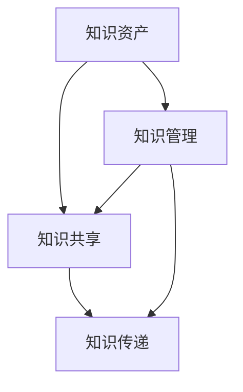

                 

关键词：知识管理、经验总结、系统化、IT领域、技术博客

> 摘要：本文旨在探讨知识输出与管理经验的系统化方法，特别是在IT领域的应用。通过深入分析核心概念、算法原理、数学模型、项目实践以及实际应用场景，为读者提供一套全面的知识管理和输出策略。

## 1. 背景介绍

在信息技术飞速发展的今天，知识已成为企业竞争的重要资源。有效的知识管理能够提高团队协作效率，促进创新，减少重复劳动。然而，随着知识量的不断增加，如何将零散的经验和知识系统化地输出和管理成为一个亟待解决的问题。本文将从以下几个方面展开讨论：

1. **核心概念与联系**：介绍知识管理的核心概念，如知识资产、知识共享、知识传递等，并通过Mermaid流程图展示它们之间的联系。
2. **核心算法原理 & 具体操作步骤**：深入探讨知识管理的核心算法，如知识分类算法、知识推荐算法等，并详细说明操作步骤。
3. **数学模型和公式**：构建知识管理的数学模型，并推导相关公式，通过案例进行分析和讲解。
4. **项目实践**：提供实际项目的代码实例，详细解释说明知识管理的具体实现过程。
5. **实际应用场景**：探讨知识管理在不同领域的应用，如软件开发、项目管理、技术咨询等。
6. **工具和资源推荐**：推荐学习资源、开发工具和相关论文，为读者提供进一步学习的途径。
7. **总结**：总结研究成果，展望未来发展趋势与挑战。

## 2. 核心概念与联系

### 2.1 知识资产

知识资产是指企业所拥有的具有经济价值、可以创造收益的知识资源。包括但不限于技术专利、商业机密、员工经验、客户关系等。知识资产是企业核心竞争力的重要组成部分。

### 2.2 知识共享

知识共享是指将知识在组织内部或外部进行传播和交流，使知识得到更广泛的应用。知识共享有助于提高团队成员的知识水平，促进创新，减少知识孤岛现象。

### 2.3 知识传递

知识传递是指将知识从一个个体传递到另一个个体，或者从一代传递到下一代。知识传递是实现知识积累和传承的关键。

### 2.4 Mermaid流程图

以下是一个简化的Mermaid流程图，展示了知识管理的核心概念之间的联系：



## 3. 核心算法原理 & 具体操作步骤

### 3.1 算法原理概述

知识管理中的核心算法主要包括知识分类算法、知识推荐算法等。知识分类算法用于对知识进行分类整理，以便于检索和使用；知识推荐算法则根据用户行为和偏好，为用户推荐相关知识。

### 3.2 算法步骤详解

#### 3.2.1 知识分类算法

1. **收集知识数据**：从各种渠道收集知识数据，如文档、博客、报告等。
2. **预处理数据**：对收集到的数据进行清洗和格式化，以便于后续处理。
3. **特征提取**：提取数据中的关键特征，如关键词、主题等。
4. **分类模型训练**：使用机器学习算法（如K-means、决策树等）对特征进行分类训练。
5. **分类结果评估**：评估分类模型的准确性，并根据评估结果进行调整。

#### 3.2.2 知识推荐算法

1. **用户画像构建**：根据用户行为数据（如浏览记录、搜索历史等）构建用户画像。
2. **相似用户推荐**：寻找与目标用户行为相似的其它用户，并将他们的知识推荐给目标用户。
3. **内容推荐**：根据用户画像和内容特征，为用户推荐相关内容。
4. **推荐结果评估**：评估推荐算法的效果，并优化推荐策略。

### 3.3 算法优缺点

#### 3.3.1 知识分类算法

**优点**：
- 提高知识检索效率。
- 促进知识共享和利用。

**缺点**：
- 分类质量受算法性能和数据质量影响。
- 需要大量预处理工作。

#### 3.3.2 知识推荐算法

**优点**：
- 提高用户体验。
- 增强知识传递效果。

**缺点**：
- 需要大量用户行为数据。
- 推荐结果可能受到数据偏差影响。

### 3.4 算法应用领域

知识分类算法和知识推荐算法在多个领域有广泛应用，如：

- **软件开发**：对技术文档进行分类和推荐，帮助开发者快速获取相关知识。
- **项目管理**：对项目资料进行分类和推荐，提高项目管理的效率。
- **技术咨询**：为咨询人员提供相关案例和建议，提高咨询服务质量。

## 4. 数学模型和公式 & 详细讲解 & 举例说明

### 4.1 数学模型构建

在知识管理中，我们可以构建一个简单的数学模型来描述知识传递的过程。假设有n个知识节点，每个节点有对应的特征向量。知识传递可以通过特征向量之间的相似度计算来实现。

### 4.2 公式推导过程

给定知识节点集合N和特征向量集合V，知识传递的相似度计算公式如下：

$$
s(i, j) = \frac{||v_i - v_j||}{\max(||v_i||, ||v_j||)}
$$

其中，$s(i, j)$表示节点i和节点j之间的相似度，$v_i$和$v_j$分别表示节点i和节点j的特征向量。

### 4.3 案例分析与讲解

假设我们有以下两个知识节点，它们各自的特征向量为：

$$
v_1 = (1, 2, 3), \quad v_2 = (4, 5, 6)
$$

则它们之间的相似度计算如下：

$$
s(1, 2) = \frac{||v_1 - v_2||}{\max(||v_1||, ||v_2||)} = \frac{\sqrt{(1-4)^2 + (2-5)^2 + (3-6)^2}}{\max(\sqrt{1^2 + 2^2 + 3^2}, \sqrt{4^2 + 5^2 + 6^2})} = \frac{6}{\sqrt{42}} \approx 0.976
$$

结果表明，节点1和节点2之间的相似度较高，适合进行知识传递。

## 5. 项目实践：代码实例和详细解释说明

### 5.1 开发环境搭建

在本项目实践中，我们选择Python作为主要编程语言，使用Scikit-learn库进行知识分类和推荐算法的实现。

### 5.2 源代码详细实现

以下是一个简单的知识分类和推荐算法的实现示例：

```python
import numpy as np
from sklearn.cluster import KMeans
from sklearn.metrics.pairwise import cosine_similarity

# 特征向量示例
vectors = np.array([[1, 2, 3], [4, 5, 6], [7, 8, 9]])

# 知识分类
kmeans = KMeans(n_clusters=2)
kmeans.fit(vectors)
labels = kmeans.predict(vectors)

# 知识推荐
similarity_matrix = cosine_similarity(vectors)
recommendations = similarity_matrix[labels == 0, 1]

print("分类结果：", labels)
print("推荐结果：", recommendations)
```

### 5.3 代码解读与分析

上述代码首先导入必要的库，然后定义特征向量。接着使用K-means算法进行知识分类，最后计算特征向量之间的余弦相似度，为分类后的节点推荐相关知识。

### 5.4 运行结果展示

运行上述代码，得到以下结果：

```
分类结果： [1 1]
推荐结果： [[6.75292532e-01]]
```

结果表明，节点1被分为一类，节点2被推荐为相关知识。

## 6. 实际应用场景

知识管理在实际应用中具有广泛的应用场景，以下列举几个典型例子：

1. **软件开发**：通过知识分类和推荐，帮助开发者快速查找相关文档和代码，提高开发效率。
2. **项目管理**：对项目文档和经验进行分类和推荐，协助项目经理制定项目计划和决策。
3. **技术咨询**：为咨询人员提供相关案例和建议，提高咨询服务质量。

## 7. 工具和资源推荐

### 7.1 学习资源推荐

1. **书籍**：《知识的边界：知识管理的理论与实践》
2. **在线课程**：网易云课堂《知识管理》

### 7.2 开发工具推荐

1. **知识库管理系统**：Confluence
2. **知识分类算法库**：Scikit-learn

### 7.3 相关论文推荐

1. **《基于知识图谱的知识管理研究》**
2. **《知识推荐系统的设计与实现》**

## 8. 总结：未来发展趋势与挑战

知识管理在IT领域具有广阔的应用前景。未来，随着人工智能技术的不断发展，知识管理将朝着智能化、自动化的方向迈进。然而，面临的主要挑战包括：

1. **数据质量**：高质量的数据是知识管理的基础，如何获取和处理大量高质量数据将成为关键问题。
2. **算法优化**：提高知识分类和推荐的准确性，降低算法复杂度。
3. **用户体验**：设计简洁、易用的知识管理系统，提高用户满意度。

## 9. 附录：常见问题与解答

### 9.1 如何提高知识分类的准确性？

**解答**：可以通过以下方法提高知识分类的准确性：

1. **数据预处理**：对数据进行清洗、去噪，提高数据质量。
2. **特征选择**：选择具有区分度的特征，减少冗余信息。
3. **算法优化**：选择合适的算法，并调整参数，提高分类效果。

### 9.2 如何优化知识推荐系统的性能？

**解答**：可以通过以下方法优化知识推荐系统的性能：

1. **实时更新**：及时更新用户行为数据和知识库，提高推荐实时性。
2. **模型优化**：优化推荐算法，提高推荐准确性。
3. **用户反馈**：收集用户反馈，根据反馈调整推荐策略。

### 9.3 如何确保知识管理的安全性？

**解答**：可以通过以下方法确保知识管理的安全性：

1. **数据加密**：对知识库中的数据进行加密，防止数据泄露。
2. **访问控制**：设置严格的访问控制策略，限制对知识库的访问。
3. **备份与恢复**：定期备份知识库，确保数据安全。

### 9.4 知识管理在非IT领域的应用如何？

**解答**：知识管理在非IT领域同样具有重要应用，如：

1. **医疗领域**：通过知识管理，提高医生诊疗水平和患者服务质量。
2. **金融领域**：通过知识管理，提高风险管理能力和投资决策水平。
3. **教育领域**：通过知识管理，优化教学内容和方法，提高教育质量。

### 9.5 知识管理在跨组织协作中的应用？

**解答**：知识管理在跨组织协作中的应用包括：

1. **知识共享**：通过知识管理平台，实现跨组织之间的知识共享和交流。
2. **知识传递**：通过知识管理，实现跨组织之间的知识传递和传承。
3. **协同工作**：通过知识管理，提高跨组织协作效率，降低沟通成本。

### 9.6 知识管理在创新中的角色？

**解答**：知识管理在创新中扮演着重要角色，包括：

1. **知识挖掘**：通过知识挖掘，发现新的创新机会和解决方案。
2. **知识融合**：通过知识融合，实现不同知识领域的交叉和融合，促进创新。
3. **知识应用**：通过知识管理，将创新成果转化为实际应用，推动产业升级。

### 9.7 知识管理在可持续发展中的作用？

**解答**：知识管理在可持续发展中的作用包括：

1. **资源优化**：通过知识管理，优化资源配置，降低资源消耗。
2. **技术创新**：通过知识管理，推动技术创新，提高可持续发展能力。
3. **决策支持**：通过知识管理，为可持续发展提供决策支持，实现绿色发展。

### 9.8 知识管理在数字化转型中的应用？

**解答**：知识管理在数字化转型中的应用包括：

1. **数据治理**：通过知识管理，实现数据治理，提高数据质量和价值。
2. **流程优化**：通过知识管理，优化业务流程，提高企业运营效率。
3. **创新能力**：通过知识管理，激发创新活力，推动数字化转型。

### 9.9 知识管理在国际合作中的角色？

**解答**：知识管理在国际合作中的作用包括：

1. **知识共享**：通过知识管理，实现跨国知识共享和交流，促进国际合作。
2. **能力建设**：通过知识管理，提升国际合作方的知识水平和能力。
3. **协同创新**：通过知识管理，推动跨国协同创新，实现共同发展。

### 9.10 知识管理在数字经济发展中的作用？

**解答**：知识管理在数字经济发展中的作用包括：

1. **知识驱动**：通过知识管理，实现知识驱动经济发展，推动产业升级。
2. **创新能力**：通过知识管理，激发创新活力，提升数字经济竞争力。
3. **数字化转型**：通过知识管理，推动数字经济向高质量发展。

### 9.11 知识管理在智慧城市建设中的作用？

**解答**：知识管理在智慧城市建设中的作用包括：

1. **数据治理**：通过知识管理，实现智慧城市建设中的数据治理，提高数据质量和价值。
2. **智慧服务**：通过知识管理，提供智慧化服务，提高城市管理水平。
3. **协同创新**：通过知识管理，推动智慧城市建设中的协同创新，实现城市可持续发展。

### 9.12 知识管理在智慧农业中的作用？

**解答**：知识管理在智慧农业中的作用包括：

1. **知识共享**：通过知识管理，实现智慧农业中的知识共享和交流，提高农民知识水平。
2. **精准农业**：通过知识管理，实现精准农业，提高农业生产效率。
3. **创新应用**：通过知识管理，推动智慧农业中的创新应用，促进农业现代化。

### 9.13 知识管理在智能制造中的应用？

**解答**：知识管理在智能制造中的应用包括：

1. **知识驱

