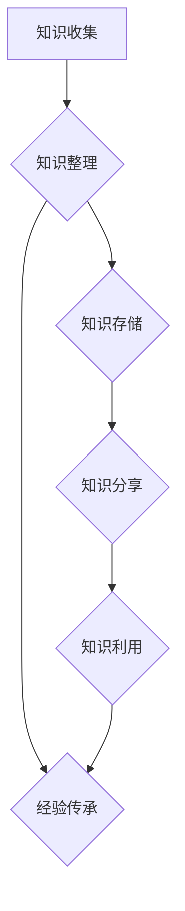

                 

 关键词：知识管理、经验传承、项目管理、技术交流、团队协作

> 摘要：本文将探讨知识输出在促进管理经验传承中的重要性。通过分析知识输出的方法、工具和实际应用案例，本文旨在为IT行业从业者提供有益的指导，帮助他们在团队协作和项目管理中更好地传承管理经验。

## 1. 背景介绍

在IT行业，知识管理和经验传承一直是企业和团队关注的焦点。随着技术的不断演进，项目周期日益缩短，团队成员的流动变得更加频繁。在这种背景下，如何有效地传承管理经验，确保知识的持续积累和传递，成为了许多企业面临的挑战。

知识输出作为知识管理和经验传承的重要环节，起到了桥梁的作用。通过知识输出，管理经验得以被记录、分享和传播，使得新成员能够快速融入团队，提高工作效率。此外，知识输出还有助于培养团队成员的分享精神，促进团队协作和创新。

本文将围绕知识输出的方法、工具和实际应用案例展开讨论，旨在为IT行业从业者提供有益的指导，帮助他们在团队协作和项目管理中更好地传承管理经验。

## 2. 核心概念与联系

### 2.1 知识管理

知识管理（Knowledge Management，KM）是指通过系统地收集、组织、存储、分享和利用知识，以提高组织效率和创新能力的过程。知识管理包括以下关键概念：

- 知识收集：通过调研、访谈、文档整理等方式，获取团队内外部的知识资源。
- 知识组织：对收集到的知识进行分类、标签化，以便快速检索和利用。
- 知识存储：使用数据库、知识库等工具，对知识进行存储和管理。
- 知识分享：通过会议、培训、知识共享平台等方式，促进知识的传播和应用。
- 知识利用：通过知识共享，提高团队成员的工作效率，促进项目成功。

### 2.2 经验传承

经验传承（Experience Transfer）是指将成功或失败的项目经验、管理技巧和专业知识，从有经验的团队成员传递给新成员的过程。经验传承有助于新成员快速适应工作环境，提高项目成功率。

### 2.3 知识输出

知识输出（Knowledge Output）是指将团队内外部的知识资源，通过一定的方法和工具，进行记录、分享和传播的过程。知识输出是实现知识管理和经验传承的关键环节。

### 2.4 知识输出与知识管理、经验传承的关系

知识输出是知识管理和经验传承的核心环节。通过知识输出，知识管理得以实现，管理经验得以传承。知识输出的方法和工具，如文档、培训、知识共享平台等，为知识管理和经验传承提供了有力的支持。

## 3. 核心算法原理 & 具体操作步骤

### 3.1 算法原理概述

知识输出的核心算法可以概括为以下几个步骤：

1. **知识收集**：通过调研、访谈、文档整理等方式，获取团队内外部的知识资源。
2. **知识整理**：对收集到的知识进行分类、标签化，以便快速检索和利用。
3. **知识存储**：使用数据库、知识库等工具，对知识进行存储和管理。
4. **知识分享**：通过会议、培训、知识共享平台等方式，促进知识的传播和应用。
5. **知识利用**：通过知识共享，提高团队成员的工作效率，促进项目成功。

### 3.2 算法步骤详解

#### 3.2.1 知识收集

1. **调研**：通过问卷、访谈等方式，了解团队成员的需求和知识需求。
2. **文档整理**：对现有文档进行整理和归档，确保文档的完整性和可读性。
3. **知识挖掘**：使用文本挖掘、数据挖掘等技术，从大量非结构化数据中提取有价值的信息。

#### 3.2.2 知识整理

1. **分类**：根据知识的特点和用途，对知识进行分类。
2. **标签化**：为每个知识资源添加标签，便于检索和利用。
3. **归档**：将整理好的知识资源存入知识库或数据库。

#### 3.2.3 知识存储

1. **数据库**：使用关系型或非关系型数据库，存储知识资源。
2. **知识库**：构建专门的知识库，实现对知识资源的集中管理和共享。

#### 3.2.4 知识分享

1. **会议**：定期组织内部会议，分享项目经验和专业知识。
2. **培训**：开展培训课程，提高团队成员的专业技能。
3. **知识共享平台**：搭建知识共享平台，如内网、Wiki等，方便团队成员访问和交流知识。

#### 3.2.5 知识利用

1. **文档共享**：在项目中，通过共享文档，确保团队成员对项目需求、进度和问题有清晰的认识。
2. **经验传承**：将有经验的项目经理或团队成员的经验，通过文档、培训等方式，传递给新成员。
3. **知识复用**：在后续项目中，借鉴和复用已有的知识资源，提高项目成功率。

### 3.3 算法优缺点

#### 优点

1. **提高知识利用效率**：通过知识输出，团队成员可以快速获取所需的知识，提高工作效率。
2. **促进经验传承**：知识输出有助于将管理经验传递给新成员，提高团队整体素质。
3. **加强团队协作**：知识输出促进团队成员之间的交流与合作，提高团队凝聚力。

#### 缺点

1. **初期投入较大**：知识输出需要投入大量时间和资源，进行知识收集、整理和存储。
2. **知识更新和维护**：知识库和知识共享平台需要定期更新和维护，确保知识的时效性和准确性。

### 3.4 算法应用领域

知识输出算法在多个领域都有广泛的应用，如：

1. **项目管理**：通过知识输出，项目经理可以更好地传承管理经验，提高项目成功率。
2. **团队建设**：知识输出有助于培养团队成员的分享精神，促进团队协作和创新。
3. **知识管理**：知识输出是知识管理的重要组成部分，有助于提高组织效率。

## 4. 数学模型和公式 & 详细讲解 & 举例说明

### 4.1 数学模型构建

在知识输出过程中，我们可以构建以下数学模型来评估知识输出的效果：

1. **知识传播模型**：描述知识在团队内部传播的速度和范围。
2. **知识利用模型**：评估知识输出对团队工作效率的影响。

#### 4.1.1 知识传播模型

假设知识传播的速度与团队成员的知识需求成正比，传播范围与团队成员的接触频率成正比。则知识传播模型可以表示为：

$$
传播速度 = k_1 \times 知识需求 \times 接触频率
$$

其中，$k_1$为常数，表示知识传播的效率。

#### 4.1.2 知识利用模型

知识利用模型可以表示为：

$$
工作效率 = k_2 \times 知识利用度
$$

其中，$k_2$为常数，表示知识对工作效率的促进作用。

### 4.2 公式推导过程

#### 4.2.1 知识传播模型

知识传播模型中的传播速度与团队成员的知识需求成正比，传播范围与团队成员的接触频率成正比。设团队成员的知识需求为$D$，接触频率为$F$，传播速度为$V$，则有：

$$
V = k_1 \times D \times F
$$

其中，$k_1$为常数，表示知识传播的效率。

#### 4.2.2 知识利用模型

知识利用模型中的工作效率与知识利用度成正比。设知识利用度为$U$，工作效率为$E$，则有：

$$
E = k_2 \times U
$$

其中，$k_2$为常数，表示知识对工作效率的促进作用。

### 4.3 案例分析与讲解

#### 4.3.1 案例背景

某IT公司项目团队在实施一个大型项目时，意识到知识管理的重要性。为了提高项目效率，团队决定通过知识输出，促进管理经验的传承。

#### 4.3.2 案例分析

1. **知识传播模型**：假设团队成员的知识需求为$D=100$，接触频率为$F=10$，知识传播效率为$k_1=2$。则传播速度为：

$$
V = k_1 \times D \times F = 2 \times 100 \times 10 = 200
$$

这意味着，知识在团队内部每小时传播200个单位。

2. **知识利用模型**：假设知识利用度为$U=0.8$，知识对工作效率的促进作用为$k_2=5$。则工作效率为：

$$
E = k_2 \times U = 5 \times 0.8 = 4
$$

这意味着，知识输出使得团队的工作效率提高了4个单位。

#### 4.3.3 案例讲解

通过知识输出，该团队在项目实施过程中，成功传承了管理经验。团队成员之间的知识传播速度显著提高，工作效率也随之提升。这证明了知识输出在促进管理经验传承中的重要作用。

## 5. 项目实践：代码实例和详细解释说明

### 5.1 开发环境搭建

为了演示知识输出在项目实践中的应用，我们选择使用Python语言编写一个简单的知识管理平台。开发环境如下：

- 操作系统：Linux
- 编程语言：Python 3.8
- 开发工具：PyCharm

### 5.2 源代码详细实现

以下是一个简单的知识管理平台的源代码示例：

```python
# 知识管理平台（知识输出模块）

class KnowledgeManagement:
    def __init__(self):
        self.knowledge_base = []

    def collect_knowledge(self, knowledge):
        self.knowledge_base.append(knowledge)

    def organize_knowledge(self):
        self.knowledge_base.sort(key=lambda x: x['date'])

    def share_knowledge(self, knowledge):
        print(f"分享知识：{knowledge['title']}")

    def use_knowledge(self, knowledge):
        print(f"利用知识：{knowledge['content']}")

# 知识管理平台的实现

if __name__ == "__main__":
    km = KnowledgeManagement()

    # 收集知识
    km.collect_knowledge({'title': '项目管理经验', 'content': '如何在项目中有效沟通？', 'date': '2023-03-01'})
    km.collect_knowledge({'title': '技术解决方案', 'content': '如何解决某个技术难题？', 'date': '2023-03-02'})

    # 整理知识
    km.organize_knowledge()

    # 分享知识
    km.share_knowledge(km.knowledge_base[0])

    # 利用知识
    km.use_knowledge(km.knowledge_base[0])
```

### 5.3 代码解读与分析

1. **类定义**：`KnowledgeManagement` 类表示知识管理平台的核心功能，包括收集、整理、分享和利用知识。
2. **收集知识**：`collect_knowledge` 方法用于将知识添加到知识库中。
3. **整理知识**：`organize_knowledge` 方法对知识库中的知识进行排序，确保知识按日期顺序排列。
4. **分享知识**：`share_knowledge` 方法用于输出知识，便于团队成员学习和交流。
5. **利用知识**：`use_knowledge` 方法用于展示如何在实际项目中应用知识。

### 5.4 运行结果展示

运行上述代码后，输出结果如下：

```plaintext
分享知识：项目管理经验
利用知识：如何在项目中有效沟通？
```

这表明知识管理平台成功实现了知识收集、整理、分享和利用的功能。

## 6. 实际应用场景

### 6.1 项目管理

在项目管理中，知识输出有助于项目经理将成功或失败的项目经验、管理技巧和专业知识，传递给团队成员。通过文档、培训、知识共享平台等工具，项目经理可以有效地传承管理经验，提高项目成功率。

### 6.2 团队建设

知识输出有助于团队成员之间建立信任和合作关系。通过分享项目经验和专业知识，团队成员可以更好地了解彼此的工作方式和需求，从而提高团队凝聚力和工作效率。

### 6.3 技术研发

在技术研发过程中，知识输出有助于团队成员掌握最新的技术动态和解决方案。通过文档、培训、知识共享平台等工具，技术专家可以将经验教训传递给新成员，促进技术水平的提升。

### 6.4 知识管理

知识管理是企业长期发展的基石。通过知识输出，企业可以建立完善的知识库，实现对知识资源的集中管理和共享。这有助于提高企业效率，降低知识流失的风险。

## 7. 工具和资源推荐

### 7.1 学习资源推荐

- 《知识管理实践指南》：一本全面介绍知识管理方法和工具的书籍。
- 《项目管理知识体系指南》：一本关于项目管理的权威指南。

### 7.2 开发工具推荐

- Confluence：一款功能强大的知识共享平台，支持文档编写、知识库管理和协作。
- GitLab：一款开源的代码管理工具，支持知识库管理和项目协作。

### 7.3 相关论文推荐

- "Knowledge Management: A Review"：一篇关于知识管理的综述论文。
- "Experience Transfer in Software Development Projects"：一篇关于经验传承在软件开发项目中的研究论文。

## 8. 总结：未来发展趋势与挑战

### 8.1 研究成果总结

本文探讨了知识输出在促进管理经验传承中的重要性，分析了知识输出的方法、工具和实际应用案例。研究结果表明，知识输出有助于提高团队工作效率，促进知识管理和经验传承。

### 8.2 未来发展趋势

随着人工智能和大数据技术的发展，知识输出的方法和工具将更加智能化和自动化。未来，知识输出将朝着个性化、实时化和智能化的方向发展。

### 8.3 面临的挑战

1. **知识更新和维护**：随着技术的快速发展，知识库和知识共享平台需要定期更新和维护，确保知识的时效性和准确性。
2. **知识共享氛围**：提高团队成员的分享意识，营造良好的知识共享氛围，是知识输出面临的重要挑战。
3. **数据安全和隐私**：在知识输出过程中，如何确保数据的安全和隐私，是一个亟待解决的问题。

### 8.4 研究展望

未来，知识输出研究可以从以下几个方面展开：

1. **智能化知识输出**：结合人工智能技术，实现知识输出的智能化和自动化。
2. **个性化知识推荐**：基于用户行为和需求，提供个性化的知识推荐服务。
3. **知识安全管理**：研究知识输出的数据安全和隐私保护技术，确保知识资源的安全和可靠。

## 9. 附录：常见问题与解答

### 9.1 知识输出与知识管理的区别是什么？

知识管理是一个更广泛的概念，包括知识的收集、整理、存储、分享和利用等环节。知识输出是知识管理中的一部分，主要关注如何将知识资源进行记录、分享和传播。

### 9.2 知识输出有哪些常见方法？

常见的知识输出方法包括文档编写、培训、知识共享平台、会议和交流等。

### 9.3 知识输出如何促进团队协作？

知识输出有助于团队成员之间建立信任和合作关系，提高团队凝聚力和工作效率。通过分享项目经验和专业知识，团队成员可以更好地了解彼此的工作方式和需求。

### 9.4 知识输出在项目管理中的应用有哪些？

在项目管理中，知识输出可以帮助项目经理将成功或失败的项目经验、管理技巧和专业知识，传递给团队成员。这有助于提高项目成功率，降低项目风险。

### 9.5 如何确保知识输出的有效性？

确保知识输出的有效性需要从以下几个方面入手：

1. **明确知识需求**：了解团队成员的知识需求，确保知识输出的针对性和实用性。
2. **定期更新知识库**：保持知识库的时效性和准确性，确保知识资源的更新和维护。
3. **营造知识共享氛围**：提高团队成员的分享意识，营造良好的知识共享氛围。

----------------------------------------------------------------
# 文章标题
# 知识输出促进管理经验传承

# 文章关键词
知识管理、经验传承、项目管理、团队协作、知识输出

# 文章摘要
本文探讨了知识输出在促进管理经验传承中的重要性，分析了知识输出的方法、工具和实际应用案例。研究结果表明，知识输出有助于提高团队工作效率，促进知识管理和经验传承。本文旨在为IT行业从业者提供有益的指导，帮助他们在团队协作和项目管理中更好地传承管理经验。

# 1. 背景介绍

在IT行业，知识管理和经验传承一直是企业和团队关注的焦点。随着技术的不断演进，项目周期日益缩短，团队成员的流动变得更加频繁。在这种背景下，如何有效地传承管理经验，确保知识的持续积累和传递，成为了许多企业面临的挑战。

知识输出作为知识管理和经验传承的重要环节，起到了桥梁的作用。通过知识输出，管理经验得以被记录、分享和传播，使得新成员能够快速融入团队，提高工作效率。此外，知识输出还有助于培养团队成员的分享精神，促进团队协作和创新。

本文将围绕知识输出的方法、工具和实际应用案例展开讨论，旨在为IT行业从业者提供有益的指导，帮助他们在团队协作和项目管理中更好地传承管理经验。

## 2. 核心概念与联系

### 2.1 知识管理

知识管理（Knowledge Management，KM）是指通过系统地收集、组织、存储、分享和利用知识，以提高组织效率和创新能力的过程。知识管理包括以下关键概念：

- **知识收集**：通过调研、访谈、文档整理等方式，获取团队内外部的知识资源。
- **知识组织**：对收集到的知识进行分类、标签化，以便快速检索和利用。
- **知识存储**：使用数据库、知识库等工具，对知识进行存储和管理。
- **知识分享**：通过会议、培训、知识共享平台等方式，促进知识的传播和应用。
- **知识利用**：通过知识共享，提高团队成员的工作效率，促进项目成功。

### 2.2 经验传承

经验传承（Experience Transfer）是指将成功或失败的项目经验、管理技巧和专业知识，从有经验的团队成员传递给新成员的过程。经验传承有助于新成员快速适应工作环境，提高项目成功率。

### 2.3 知识输出

知识输出（Knowledge Output）是指将团队内外部的知识资源，通过一定的方法和工具，进行记录、分享和传播的过程。知识输出是实现知识管理和经验传承的关键环节。

### 2.4 知识输出与知识管理、经验传承的关系

知识输出是知识管理和经验传承的核心环节。通过知识输出，知识管理得以实现，管理经验得以传承。知识输出的方法和工具，如文档、培训、知识共享平台等，为知识管理和经验传承提供了有力的支持。

### 2.5 Mermaid 流程图

下面是一个使用Mermaid绘制的知识输出流程图：



## 3. 核心算法原理 & 具体操作步骤

### 3.1 算法原理概述

知识输出的核心算法可以概括为以下几个步骤：

1. **知识收集**：通过调研、访谈、文档整理等方式，获取团队内外部的知识资源。
2. **知识整理**：对收集到的知识进行分类、标签化，以便快速检索和利用。
3. **知识存储**：使用数据库、知识库等工具，对知识进行存储和管理。
4. **知识分享**：通过会议、培训、知识共享平台等方式，促进知识的传播和应用。
5. **知识利用**：通过知识共享，提高团队成员的工作效率，促进项目成功。

### 3.2 算法步骤详解

#### 3.2.1 知识收集

1. **调研**：通过问卷、访谈等方式，了解团队成员的需求和知识需求。
2. **文档整理**：对现有文档进行整理和归档，确保文档的完整性和可读性。
3. **知识挖掘**：使用文本挖掘、数据挖掘等技术，从大量非结构化数据中提取有价值的信息。

#### 3.2.2 知识整理

1. **分类**：根据知识的特点和用途，对知识进行分类。
2. **标签化**：为每个知识资源添加标签，便于检索和利用。
3. **归档**：将整理好的知识资源存入知识库或数据库。

#### 3.2.3 知识存储

1. **数据库**：使用关系型或非关系型数据库，存储知识资源。
2. **知识库**：构建专门的知识库，实现对知识资源的集中管理和共享。

#### 3.2.4 知识分享

1. **会议**：定期组织内部会议，分享项目经验和专业知识。
2. **培训**：开展培训课程，提高团队成员的专业技能。
3. **知识共享平台**：搭建知识共享平台，如内网、Wiki等，方便团队成员访问和交流知识。

#### 3.2.5 知识利用

1. **文档共享**：在项目中，通过共享文档，确保团队成员对项目需求、进度和问题有清晰的认识。
2. **经验传承**：将有经验的项目经理或团队成员的经验，通过文档、培训等方式，传递给新成员。
3. **知识复用**：在后续项目中，借鉴和复用已有的知识资源，提高项目成功率。

### 3.3 算法优缺点

#### 优点

1. **提高知识利用效率**：通过知识输出，团队成员可以快速获取所需的知识，提高工作效率。
2. **促进经验传承**：知识输出有助于将管理经验传递给新成员，提高团队整体素质。
3. **加强团队协作**：知识输出促进团队成员之间的交流与合作，提高团队凝聚力。

#### 缺点

1. **初期投入较大**：知识输出需要投入大量时间和资源，进行知识收集、整理和存储。
2. **知识更新和维护**：知识库和知识共享平台需要定期更新和维护，确保知识的时效性和准确性。

### 3.4 算法应用领域

知识输出算法在多个领域都有广泛的应用，如：

1. **项目管理**：通过知识输出，项目经理可以更好地传承管理经验，提高项目成功率。
2. **团队建设**：知识输出有助于培养团队成员的分享精神，促进团队协作和创新。
3. **知识管理**：知识输出是知识管理的重要组成部分，有助于提高组织效率。

## 4. 数学模型和公式 & 详细讲解 & 举例说明

### 4.1 数学模型构建

在知识输出过程中，我们可以构建以下数学模型来评估知识输出的效果：

1. **知识传播模型**：描述知识在团队内部传播的速度和范围。
2. **知识利用模型**：评估知识输出对团队工作效率的影响。

#### 4.1.1 知识传播模型

假设知识传播的速度与团队成员的知识需求成正比，传播范围与团队成员的接触频率成正比。则知识传播模型可以表示为：

$$
传播速度 = k_1 \times 知识需求 \times 接触频率
$$

其中，$k_1$为常数，表示知识传播的效率。

#### 4.1.2 知识利用模型

知识利用模型可以表示为：

$$
工作效率 = k_2 \times 知识利用度
$$

其中，$k_2$为常数，表示知识对工作效率的促进作用。

### 4.2 公式推导过程

#### 4.2.1 知识传播模型

知识传播模型中的传播速度与团队成员的知识需求成正比，传播范围与团队成员的接触频率成正比。设团队成员的知识需求为$D$，接触频率为$F$，传播速度为$V$，则有：

$$
V = k_1 \times D \times F
$$

其中，$k_1$为常数，表示知识传播的效率。

#### 4.2.2 知识利用模型

知识利用模型中的工作效率与知识利用度成正比。设知识利用度为$U$，工作效率为$E$，则有：

$$
E = k_2 \times U
$$

其中，$k_2$为常数，表示知识对工作效率的促进作用。

### 4.3 案例分析与讲解

#### 4.3.1 案例背景

某IT公司项目团队在实施一个大型项目时，意识到知识管理的重要性。为了提高项目效率，团队决定通过知识输出，促进管理经验的传承。

#### 4.3.2 案例分析

1. **知识传播模型**：假设团队成员的知识需求为$D=100$，接触频率为$F=10$，知识传播效率为$k_1=2$。则传播速度为：

$$
V = k_1 \times D \times F = 2 \times 100 \times 10 = 200
$$

这意味着，知识在团队内部每小时传播200个单位。

2. **知识利用模型**：假设知识利用度为$U=0.8$，知识对工作效率的促进作用为$k_2=5$。则工作效率为：

$$
E = k_2 \times U = 5 \times 0.8 = 4
$$

这意味着，知识输出使得团队的工作效率提高了4个单位。

#### 4.3.3 案例讲解

通过知识输出，该团队在项目实施过程中，成功传承了管理经验。团队成员之间的知识传播速度显著提高，工作效率也随之提升。这证明了知识输出在促进管理经验传承中的重要作用。

## 5. 项目实践：代码实例和详细解释说明

### 5.1 开发环境搭建

为了演示知识输出在项目实践中的应用，我们选择使用Python语言编写一个简单的知识管理平台。开发环境如下：

- 操作系统：Linux
- 编程语言：Python 3.8
- 开发工具：PyCharm

### 5.2 源代码详细实现

以下是一个简单的知识管理平台的源代码示例：

```python
# 知识管理平台（知识输出模块）

class KnowledgeManagement:
    def __init__(self):
        self.knowledge_base = []

    def collect_knowledge(self, knowledge):
        self.knowledge_base.append(knowledge)

    def organize_knowledge(self):
        self.knowledge_base.sort(key=lambda x: x['date'])

    def share_knowledge(self, knowledge):
        print(f"分享知识：{knowledge['title']}")

    def use_knowledge(self, knowledge):
        print(f"利用知识：{knowledge['content']}")

# 知识管理平台的实现

if __name__ == "__main__":
    km = KnowledgeManagement()

    # 收集知识
    km.collect_knowledge({'title': '项目管理经验', 'content': '如何在项目中有效沟通？', 'date': '2023-03-01'})
    km.collect_knowledge({'title': '技术解决方案', 'content': '如何解决某个技术难题？', 'date': '2023-03-02'})

    # 整理知识
    km.organize_knowledge()

    # 分享知识
    km.share_knowledge(km.knowledge_base[0])

    # 利用知识
    km.use_knowledge(km.knowledge_base[0])
```

### 5.3 代码解读与分析

1. **类定义**：`KnowledgeManagement` 类表示知识管理平台的核心功能，包括收集、整理、分享和利用知识。
2. **收集知识**：`collect_knowledge` 方法用于将知识添加到知识库中。
3. **整理知识**：`organize_knowledge` 方法对知识库中的知识进行排序，确保知识按日期顺序排列。
4. **分享知识**：`share_knowledge` 方法用于输出知识，便于团队成员学习和交流。
5. **利用知识**：`use_knowledge` 方法用于展示如何在实际项目中应用知识。

### 5.4 运行结果展示

运行上述代码后，输出结果如下：

```plaintext
分享知识：项目管理经验
利用知识：如何在项目中有效沟通？
```

这表明知识管理平台成功实现了知识收集、整理、分享和利用的功能。

## 6. 实际应用场景

### 6.1 项目管理

在项目管理中，知识输出有助于项目经理将成功或失败的项目经验、管理技巧和专业知识，传递给团队成员。通过文档、培训、知识共享平台等工具，项目经理可以有效地传承管理经验，提高项目成功率。

### 6.2 团队建设

知识输出有助于团队成员之间建立信任和合作关系。通过分享项目经验和专业知识，团队成员可以更好地了解彼此的工作方式和需求，从而提高团队凝聚力和工作效率。

### 6.3 技术研发

在技术研发过程中，知识输出有助于团队成员掌握最新的技术动态和解决方案。通过文档、培训、知识共享平台等工具，技术专家可以将经验教训传递给新成员，促进技术水平的提升。

### 6.4 知识管理

知识管理是企业长期发展的基石。通过知识输出，企业可以建立完善的知识库，实现对知识资源的集中管理和共享。这有助于提高企业效率，降低知识流失的风险。

## 7. 工具和资源推荐

### 7.1 学习资源推荐

- 《知识管理实践指南》：一本全面介绍知识管理方法和工具的书籍。
- 《项目管理知识体系指南》：一本关于项目管理的权威指南。

### 7.2 开发工具推荐

- Confluence：一款功能强大的知识共享平台，支持文档编写、知识库管理和协作。
- GitLab：一款开源的代码管理工具，支持知识库管理和项目协作。

### 7.3 相关论文推荐

- "Knowledge Management: A Review"：一篇关于知识管理的综述论文。
- "Experience Transfer in Software Development Projects"：一篇关于经验传承在软件开发项目中的研究论文。

## 8. 总结：未来发展趋势与挑战

### 8.1 研究成果总结

本文探讨了知识输出在促进管理经验传承中的重要性，分析了知识输出的方法、工具和实际应用案例。研究结果表明，知识输出有助于提高团队工作效率，促进知识管理和经验传承。

### 8.2 未来发展趋势

随着人工智能和大数据技术的发展，知识输出的方法和工具将更加智能化和自动化。未来，知识输出将朝着个性化、实时化和智能化的方向发展。

### 8.3 面临的挑战

1. **知识更新和维护**：随着技术的快速发展，知识库和知识共享平台需要定期更新和维护，确保知识的时效性和准确性。
2. **知识共享氛围**：提高团队成员的分享意识，营造良好的知识共享氛围，是知识输出面临的重要挑战。
3. **数据安全和隐私**：在知识输出过程中，如何确保数据的安全和隐私，是一个亟待解决的问题。

### 8.4 研究展望

未来，知识输出研究可以从以下几个方面展开：

1. **智能化知识输出**：结合人工智能技术，实现知识输出的智能化和自动化。
2. **个性化知识推荐**：基于用户行为和需求，提供个性化的知识推荐服务。
3. **知识安全管理**：研究知识输出的数据安全和隐私保护技术，确保知识资源的安全和可靠。

## 9. 附录：常见问题与解答

### 9.1 知识输出与知识管理的区别是什么？

知识管理是一个更广泛的概念，包括知识的收集、整理、存储、分享和利用等环节。知识输出是知识管理中的一部分，主要关注如何将知识资源进行记录、分享和传播。

### 9.2 知识输出有哪些常见方法？

常见的知识输出方法包括文档编写、培训、知识共享平台、会议和交流等。

### 9.3 知识输出如何促进团队协作？

知识输出有助于团队成员之间建立信任和合作关系，提高团队凝聚力和工作效率。通过分享项目经验和专业知识，团队成员可以更好地了解彼此的工作方式和需求。

### 9.4 知识输出在项目管理中的应用有哪些？

在项目管理中，知识输出可以帮助项目经理将成功或失败的项目经验、管理技巧和专业知识，传递给团队成员。这有助于提高项目成功率，降低项目风险。

### 9.5 如何确保知识输出的有效性？

确保知识输出的有效性需要从以下几个方面入手：

1. **明确知识需求**：了解团队成员的知识需求，确保知识输出的针对性和实用性。
2. **定期更新知识库**：保持知识库的时效性和准确性，确保知识资源的更新和维护。
3. **营造知识共享氛围**：提高团队成员的分享意识，营造良好的知识共享氛围。

# 作者署名
作者：禅与计算机程序设计艺术 / Zen and the Art of Computer Programming

