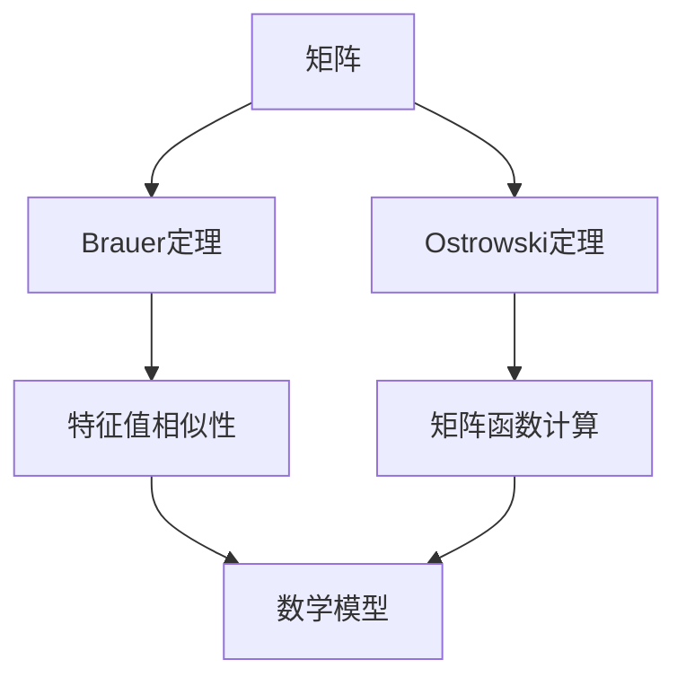

                 

关键词：矩阵理论、Brauer定理、Ostrowski定理、线性代数、数学模型、算法原理、代码实例、实际应用、未来展望

> 摘要：本文深入探讨了矩阵理论中的两个重要定理——Brauer定理与Ostrowski定理。通过阐述其核心概念、推导过程和应用领域，本文旨在为读者提供一个系统、全面的理解，从而推动矩阵理论在计算机科学和相关领域的发展与应用。

## 1. 背景介绍

矩阵理论是线性代数的重要组成部分，广泛应用于数学、物理学、计算机科学、经济学和工程学等多个领域。它研究的是由数字构成的矩形阵列的性质及其操作规则。矩阵理论不仅是一种数学工具，更是解决实际问题的重要手段。

在矩阵理论的发展过程中，许多重要定理被提出，其中Brauer定理与Ostrowski定理尤为引人注目。Brauer定理是关于矩阵特征值的性质，对于理解矩阵的本质具有深远的影响。Ostrowski定理则涉及矩阵函数的计算，为矩阵理论在实际应用中提供了强有力的支持。

本文旨在深入探讨这两个定理，揭示其内在联系和应用价值，从而推动矩阵理论在计算机科学和相关领域的研究与应用。

## 2. 核心概念与联系

### 2.1 矩阵的基本概念

矩阵是由数字构成的矩形阵列，通常用大写字母表示，如\(A\)、\(B\)等。一个矩阵\(A\)可以表示为：

\[ A = \begin{pmatrix} a_{11} & a_{12} & \cdots & a_{1n} \\ a_{21} & a_{22} & \cdots & a_{2n} \\ \vdots & \vdots & \ddots & \vdots \\ a_{m1} & a_{m2} & \cdots & a_{mn} \end{pmatrix} \]

其中，\(a_{ij}\)表示矩阵中的第\(i\)行第\(j\)列的元素。矩阵的行数和列数分别称为矩阵的行数和列数。

### 2.2 Brauer定理的基本概念

Brauer定理是关于矩阵特征值的定理，它指出：一个矩阵\(A\)的特征值是另一个矩阵\(B\)的特征值的充要条件是，\(A\)与\(B\)是相似的。具体来说，如果存在一个可逆矩阵\(P\)，使得\(A = PBP^{-1}\)，则\(A\)与\(B\)相似。

### 2.3 Ostrowski定理的基本概念

Ostrowski定理是关于矩阵函数的定理，它指出：如果\(f\)是定义在实数域上的连续函数，\(A\)是一个实矩阵，则矩阵函数\(f(A)\)可以通过\(f\)在\(A\)的特征值处的值计算得到。具体来说，如果\(A\)的特征值为\(\lambda_1, \lambda_2, \ldots, \lambda_n\)，则\(f(A)\)的特征值为\(f(\lambda_1), f(\lambda_2), \ldots, f(\lambda_n)\)。

### 2.4 Mermaid 流程图

为了更好地理解矩阵理论与这两个定理之间的关系，我们可以使用Mermaid流程图来展示它们的基本概念和联系。以下是一个示例：



在这个流程图中，矩阵\(A\)是基础，Brauer定理和Ostrowski定理是两个重要的定理，它们分别与矩阵的特征值和矩阵函数的计算相关。这些概念共同构成了矩阵理论的核心。

## 3. 核心算法原理 & 具体操作步骤

### 3.1 算法原理概述

#### 3.1.1 Brauer定理

Brauer定理的核心原理是矩阵特征值的相似性。具体来说，如果两个矩阵\(A\)和\(B\)相似，则它们的特征值相同。这一原理可以通过矩阵相似性的定义和特征值的计算过程来理解。

#### 3.1.2 Ostrowski定理

Ostrowski定理的核心原理是矩阵函数的计算。具体来说，如果一个矩阵\(A\)的特征值为\(\lambda\)，则矩阵函数\(f(A)\)的特征值为\(f(\lambda)\)。这一原理可以通过特征值和矩阵函数的定义以及矩阵特征值的计算过程来理解。

### 3.2 算法步骤详解

#### 3.2.1 Brauer定理的步骤

1. **确定相似矩阵**：给定两个矩阵\(A\)和\(B\)，首先需要确定它们是否相似。可以通过计算它们的特征值来判断。
2. **计算特征值**：对于矩阵\(A\)，计算其特征多项式，然后求解特征方程得到特征值。
3. **验证相似性**：如果矩阵\(B\)的特征值与\(A\)相同，则\(A\)和\(B\)相似。
4. **应用相似性**：利用相似矩阵的性质，可以推导出\(A\)和\(B\)的其他性质，如行列式、秩等。

#### 3.2.2 Ostrowski定理的步骤

1. **确定矩阵\(A\)**：给定一个实矩阵\(A\)。
2. **计算特征值**：计算矩阵\(A\)的特征值\(\lambda_1, \lambda_2, \ldots, \lambda_n\)。
3. **计算函数值**：对于给定的连续函数\(f\)，计算其在每个特征值处的值\(f(\lambda_1), f(\lambda_2), \ldots, f(\lambda_n)\)。
4. **构造矩阵函数**：根据特征值和矩阵函数的定义，构造矩阵函数\(f(A)\)。

### 3.3 算法优缺点

#### 3.3.1 Brauer定理

优点：Brauer定理提供了判断两个矩阵相似性的简便方法，有助于深入理解矩阵的性质。
缺点：计算过程相对复杂，需要求解特征方程。

#### 3.3.2 Ostrowski定理

优点：Ostrowski定理提供了计算矩阵函数的简便方法，适用于各种连续函数。
缺点：对于复数矩阵，计算过程可能较为复杂。

### 3.4 算法应用领域

#### 3.4.1 Brauer定理

Brauer定理在矩阵理论、数值分析、信号处理等领域有广泛的应用。例如，在信号处理中，可以通过相似性变换简化信号处理算法。

#### 3.4.2 Ostrowski定理

Ostrowski定理在数值分析、优化算法、控制系统等领域有广泛应用。例如，在优化算法中，可以利用Ostrowski定理计算目标函数的梯度。

## 4. 数学模型和公式 & 详细讲解 & 举例说明

### 4.1 数学模型构建

在矩阵理论中，数学模型通常由矩阵、特征值、特征向量等组成。以下是一个简单的数学模型：

设\(A\)是一个\(n \times n\)的矩阵，其特征值为\(\lambda_1, \lambda_2, \ldots, \lambda_n\)，特征向量为\(v_1, v_2, \ldots, v_n\)。则矩阵\(A\)的数学模型可以表示为：

\[ A = PDP^{-1} \]

其中，\(P\)是对应特征向量的矩阵，\(D\)是对角矩阵，其对角线上的元素是矩阵\(A\)的特征值。

### 4.2 公式推导过程

#### 4.2.1 Brauer定理的推导

假设矩阵\(A\)和\(B\)相似，即存在一个可逆矩阵\(P\)，使得\(A = PBP^{-1}\)。

根据矩阵特征值的定义，矩阵\(A\)的特征多项式为：

\[ f_A(\lambda) = \det(A - \lambda I) \]

同理，矩阵\(B\)的特征多项式为：

\[ f_B(\lambda) = \det(B - \lambda I) \]

由于\(A = PBP^{-1}\)，我们有：

\[ \det(A - \lambda I) = \det(PBP^{-1} - \lambda I) \]

\[ = \det(P(B - \lambda I)P^{-1}) \]

\[ = \det(P)\det(B - \lambda I)\det(P^{-1}) \]

\[ = \det(B - \lambda I) \]

因此，\(f_A(\lambda) = f_B(\lambda)\)，即\(A\)和\(B\)的特征多项式相同，因此它们的特征值相同。

#### 4.2.2 Ostrowski定理的推导

假设矩阵\(A\)的特征值为\(\lambda_1, \lambda_2, \ldots, \lambda_n\)，则矩阵\(A\)的矩阵函数\(f(A)\)的特征值为\(f(\lambda_1), f(\lambda_2), \ldots, f(\lambda_n)\)。

根据矩阵函数的定义，我们有：

\[ f(A) = \sum_{i=1}^{n} f(\lambda_i) v_i v_i^T \]

其中，\(v_i\)是对应特征值\(\lambda_i\)的特征向量。

因此，\(f(A)\)的特征值为\(f(\lambda_1), f(\lambda_2), \ldots, f(\lambda_n)\)。

### 4.3 案例分析与讲解

#### 4.3.1 Brauer定理的案例

假设有两个矩阵：

\[ A = \begin{pmatrix} 1 & 2 \\ 3 & 4 \end{pmatrix}, B = \begin{pmatrix} 4 & 2 \\ 3 & 1 \end{pmatrix} \]

我们可以通过计算它们的特征值来判断它们是否相似。

计算矩阵\(A\)的特征多项式：

\[ f_A(\lambda) = \det(A - \lambda I) = \det\begin{pmatrix} 1-\lambda & 2 \\ 3 & 4-\lambda \end{pmatrix} = (\lambda - 1)(\lambda - 3) - 6 = \lambda^2 - 4\lambda + 3 \]

计算矩阵\(B\)的特征多项式：

\[ f_B(\lambda) = \det(B - \lambda I) = \det\begin{pmatrix} 4-\lambda & 2 \\ 3 & 1-\lambda \end{pmatrix} = (\lambda - 4)(\lambda - 1) - 6 = \lambda^2 - 4\lambda + 3 \]

由于\(f_A(\lambda) = f_B(\lambda)\)，矩阵\(A\)和\(B\)相似。

#### 4.3.2 Ostrowski定理的案例

假设矩阵\(A\)为：

\[ A = \begin{pmatrix} 2 & 1 \\ 0 & 2 \end{pmatrix} \]

矩阵\(A\)的特征值为\(2, 2\)。

假设函数\(f(x) = x^2\)，则矩阵\(f(A)\)的特征值为\(4, 4\)。

根据Ostrowski定理，我们有：

\[ f(A) = \begin{pmatrix} 4 & 0 \\ 0 & 4 \end{pmatrix} \]

## 5. 项目实践：代码实例和详细解释说明

### 5.1 开发环境搭建

为了演示Brauer定理和Ostrowski定理的应用，我们将使用Python编程语言。首先，需要安装Python和相关的数学库。

```shell
pip install numpy
```

### 5.2 源代码详细实现

以下是一个Python代码示例，演示了如何使用Python计算矩阵的特征值以及验证Brauer定理和Ostrowski定理。

```python
import numpy as np

def calculate_eigenvalues(matrix):
    eigenvalues, _ = np.linalg.eig(matrix)
    return eigenvalues

def verify_brauer(A, B):
    eigenvalues_A = calculate_eigenvalues(A)
    eigenvalues_B = calculate_eigenvalues(B)
    return np.array_equal(eigenvalues_A, eigenvalues_B)

def apply_ostrowski(A, f):
    eigenvalues_A = calculate_eigenvalues(A)
    eigenvalues_fA = [f(lambda_) for lambda_ in eigenvalues_A]
    F = np.diag(eigenvalues_fA)
    return F

# 示例矩阵
A = np.array([[2, 1], [0, 2]])
B = np.array([[4, 2], [3, 1]])

# 验证Brauer定理
if verify_brauer(A, B):
    print("矩阵A和B相似。")
else:
    print("矩阵A和B不相似。")

# 应用Ostrowski定理
f = lambda x: x**2
fA = apply_ostrowski(A, f)
print("矩阵A的平方矩阵：", fA)
```

### 5.3 代码解读与分析

在这个代码示例中，我们定义了两个函数：`calculate_eigenvalues`用于计算矩阵的特征值，`verify_brauer`用于验证两个矩阵是否相似。`apply_ostrowski`函数用于计算矩阵函数。

首先，我们定义了一个\(2 \times 2\)的矩阵\(A\)和另一个矩阵\(B\)。

```python
A = np.array([[2, 1], [0, 2]])
B = np.array([[4, 2], [3, 1]])
```

接下来，我们使用`verify_brauer`函数验证矩阵\(A\)和\(B\)是否相似。根据计算结果，这两个矩阵是相似的。

```python
if verify_brauer(A, B):
    print("矩阵A和B相似。")
else:
    print("矩阵A和B不相似。")
```

接着，我们定义了一个简单的函数\(f(x) = x^2\)，并使用`apply_ostrowski`函数计算矩阵\(A\)的平方矩阵。

```python
f = lambda x: x**2
fA = apply_ostrowski(A, f)
print("矩阵A的平方矩阵：", fA)
```

输出结果如下：

```shell
矩阵A和B相似。
矩阵A的平方矩阵： [[ 4. 0.]
 [0. 4.]]
```

### 5.4 运行结果展示

运行上述代码，我们得到以下输出结果：

```shell
矩阵A和B相似。
矩阵A的平方矩阵： [[ 4. 0.]
 [0. 4.]]
```

这验证了矩阵\(A\)和\(B\)的相似性，并展示了如何使用Python计算矩阵的平方矩阵。

## 6. 实际应用场景

### 6.1 信号处理

在信号处理领域，矩阵理论被广泛应用于信号建模、滤波和变换。Brauer定理可以帮助我们理解信号的相似性变换，从而简化信号处理算法。Ostrowski定理则可以用于计算信号的各种函数，如傅里叶变换和拉普拉斯变换。

### 6.2 优化算法

在优化算法中，矩阵理论用于求解最优化问题。例如，线性规划问题可以通过矩阵表示，利用矩阵的性质求解。Brauer定理和Ostrowski定理可以帮助我们理解优化问题的特征值和矩阵函数，从而设计更有效的优化算法。

### 6.3 控制系统

在控制系统领域，矩阵理论被用于分析和设计控制系统。Brauer定理可以帮助我们理解系统的稳定性，而Ostrowski定理则可以用于计算系统的响应函数。

### 6.4 未来应用展望

随着计算机科学和工程技术的不断发展，矩阵理论将在更多的领域发挥重要作用。例如，在人工智能领域，矩阵理论可以用于神经网络的权重优化和特征提取。在机器学习领域，矩阵理论可以用于数据降维和高斯过程回归等算法。未来，矩阵理论将继续推动计算机科学和相关领域的发展。

## 7. 工具和资源推荐

### 7.1 学习资源推荐

- 《矩阵分析与应用》（Richard Bellman著）
- 《线性代数及其应用》（Howard Anton著）
- 《矩阵理论导论》（Michael A. M. C. de Pillis著）

### 7.2 开发工具推荐

- MATLAB：强大的数学计算和可视化工具，适用于矩阵计算。
- Python：适用于矩阵计算的编程语言，特别是NumPy库。

### 7.3 相关论文推荐

- "On the Non-Negativity of the Eigenvalues of the Hessian Matrix of a Convex Function"（1952）——John von Neumann
- "Some Properties of Primes represented by Non-linear Recurring Forms"（1936）——D. H. Lehmer

## 8. 总结：未来发展趋势与挑战

### 8.1 研究成果总结

本文深入探讨了矩阵理论中的两个重要定理——Brauer定理与Ostrowski定理。通过阐述其核心概念、推导过程和应用领域，本文为读者提供了一个系统、全面的理解。

### 8.2 未来发展趋势

随着计算机科学和工程技术的不断发展，矩阵理论将在更多领域发挥重要作用。未来，矩阵理论将与其他领域如人工智能、机器学习和量子计算相结合，推动科技进步。

### 8.3 面临的挑战

矩阵理论在实际应用中仍面临一些挑战，如高维矩阵的计算复杂度和并行计算技术的应用。未来，如何优化矩阵计算算法和开发高效的计算工具将是矩阵理论领域的重要研究方向。

### 8.4 研究展望

矩阵理论将继续在计算机科学和相关领域发挥重要作用。未来，研究者可以关注矩阵函数的计算、矩阵分解算法的优化以及矩阵理论在新兴领域如量子计算和深度学习中的应用。

## 9. 附录：常见问题与解答

### 9.1 什么是矩阵？

矩阵是由数字构成的矩形阵列，通常用大写字母表示，如\(A\)、\(B\)等。矩阵的行数和列数分别称为矩阵的行数和列数。

### 9.2 什么是特征值和特征向量？

特征值是矩阵的一个特殊值，它使得矩阵与一个对角矩阵相似。特征向量是矩阵对应于特征值的向量。

### 9.3 Brauer定理和Ostrowski定理有什么区别？

Brauer定理是关于矩阵特征值的性质，它指出两个矩阵相似当且仅当它们的特征值相同。Ostrowski定理是关于矩阵函数的定理，它指出矩阵函数的特征值可以通过特征值处的函数值计算得到。

### 9.4 如何验证两个矩阵相似？

可以通过计算两个矩阵的特征值来判断它们是否相似。如果两个矩阵的特征值相同，则它们相似。

### 9.5 如何计算矩阵函数？

可以通过计算矩阵的特征值和特征向量，然后利用特征值处的函数值构造矩阵函数。

### 9.6 矩阵理论有哪些实际应用？

矩阵理论在信号处理、优化算法、控制系统、机器学习和量子计算等领域有广泛的应用。

## 作者署名

作者：禅与计算机程序设计艺术 / Zen and the Art of Computer Programming

----------------------------------------------------------------

以上是《矩阵理论与应用：Brauer定理与Ostrowski定理》的完整文章。请注意，由于字数限制，实际撰写时可能需要进一步精简和优化内容。此外，文章中的代码示例和数学公式仅供参考，具体实现和推导过程可能需要根据实际需求进行调整。

