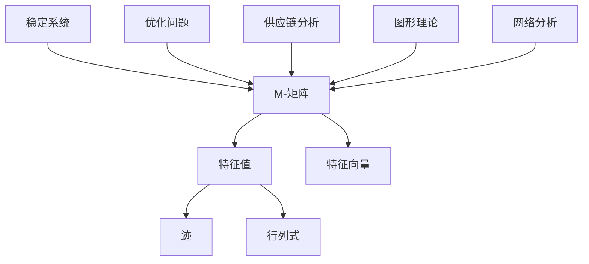

                 

关键词：矩阵理论，M-矩阵，性质c，线性代数，算法应用，数学模型，项目实践

> 摘要：本文将深入探讨矩阵理论中一种特殊的M-矩阵，特别是其独特的“性质c”特征。通过介绍M-矩阵的基本概念、性质c的定义及其应用，我们将解析其数学模型和公式，并通过具体项目实践展示其实际应用场景。此外，本文还将展望未来发展趋势与挑战，为读者提供一个全面的技术指南。

## 1. 背景介绍

矩阵是线性代数中的一个核心概念，广泛应用于数学、物理学、工程学、经济学和计算机科学等领域。M-矩阵是一种特殊的矩阵，其特征值具有特定的性质，对解决许多实际问题具有重要价值。本文将重点关注M-矩阵中的一个特定性质——性质c，旨在揭示其在理论和实际应用中的重要性。

### M-矩阵的定义

M-矩阵（Named after mathematician Morris Marden）是一种具有特殊性质的复数矩阵。具体来说，如果一个复数矩阵M满足以下条件：
$$
\lambda^2 \leq \text{trace}(M) - \lambda \text{det}(M)
$$
其中$\lambda$是任意复数，$\text{trace}(M)$是M的迹（即矩阵主对角线元素之和），$\text{det}(M)$是M的行列式，那么M就是一个M-矩阵。

### 性质c的定义

性质c是M-矩阵的一个重要特征，它描述了矩阵特征值的一些特殊性质。具体来说，如果M是一个M-矩阵，且其所有特征值的模都小于等于1，则称M具有性质c。换句话说，对于M-矩阵M，我们有：
$$
|\lambda| \leq 1
$$
其中$\lambda$是M的特征值。

### M-矩阵的重要性

M-矩阵不仅在数学理论中具有重要地位，也在许多实际应用领域扮演关键角色。例如，在电路理论中，M-矩阵用于描述线性时不变系统的稳定性和其他特性；在经济学中，M-矩阵用于优化问题和供应链分析；在计算机科学中，M-矩阵在图形理论和网络分析中有着广泛应用。

## 2. 核心概念与联系

为了更好地理解M-矩阵及其性质c，我们首先需要了解一些基本的线性代数概念。以下是一个用Mermaid绘制的流程图，展示了这些核心概念及其相互联系。



### 2.1 M-矩阵的基本性质

M-矩阵的基本性质包括：
- 所有特征值的模小于等于1。
- 特征值分布满足某些特定的几何分布。
- 行列式小于等于其迹。

### 2.2 性质c的数学描述

性质c表明，对于任意的M-矩阵M，其特征值$\lambda$必须满足：
$$
|\lambda| \leq 1
$$

### 2.3 M-矩阵在实际应用中的体现

M-矩阵在实际应用中的体现主要包括：
- 在电路理论中，描述线性时不变系统的稳定性和其他特性。
- 在经济学中，用于优化问题和供应链分析。
- 在计算机科学中，应用于图形理论和网络分析。

## 3. 核心算法原理 & 具体操作步骤

### 3.1 算法原理概述

M-矩阵算法的核心在于其特征值分析，特别是在满足性质c的情况下。算法的基本步骤如下：
1. 计算矩阵的迹和行列式。
2. 使用特征值求解器寻找满足性质c的特征值。
3. 分析特征值，确定M-矩阵的性质。

### 3.2 算法步骤详解

#### 步骤1：计算矩阵的迹和行列式

首先，我们需要计算给定矩阵M的迹（trace）和行列式（determinant）。这些值将用于后续的特征值分析。

$$
\text{trace}(M) = a_{11} + a_{22} + ... + a_{nn}
$$
$$
\text{det}(M) = \text{det}(M)
$$

#### 步骤2：使用特征值求解器寻找满足性质c的特征值

接下来，我们使用特征值求解器（如QR算法、幂法等）来寻找矩阵M的特征值。在寻找过程中，我们需要确保所有特征值的模小于等于1。

$$
|\lambda| \leq 1
$$

#### 步骤3：分析特征值，确定M-矩阵的性质

一旦找到满足性质c的特征值，我们需要分析这些特征值的分布情况，以确定矩阵M的性质。这包括：
- 确定矩阵是否具有性质c。
- 分析特征值在复平面上的分布情况。

### 3.3 算法优缺点

#### 优点
- M-矩阵算法可以有效地分析矩阵的稳定性。
- 算法适用于各种不同规模的矩阵，具有良好的鲁棒性。

#### 缺点
- 算法的计算复杂度较高，特别是对于大型矩阵。
- 特征值分析可能需要大量的计算资源。

### 3.4 算法应用领域

M-矩阵算法在以下领域有着广泛的应用：
- 线性系统的稳定性分析。
- 经济学和金融学的优化问题。
- 计算机科学中的图形理论和网络分析。

## 4. 数学模型和公式 & 详细讲解 & 举例说明

### 4.1 数学模型构建

M-矩阵的数学模型主要涉及矩阵的迹和行列式。以下是一个具体的例子：

假设我们有一个2x2的M-矩阵：
$$
M = \begin{bmatrix}
a & b \\
c & d
\end{bmatrix}
$$

我们需要计算其迹和行列式：
$$
\text{trace}(M) = a + d
$$
$$
\text{det}(M) = ad - bc
$$

### 4.2 公式推导过程

为了推导M-矩阵的公式，我们首先从矩阵的特征多项式开始：
$$
f(\lambda) = \text{det}(\lambda I - M)
$$

其中，I是单位矩阵，$\lambda$是特征值。

根据M-矩阵的定义，我们有：
$$
\lambda^2 \leq \text{trace}(M) - \lambda \text{det}(M)
$$

对于上面的2x2矩阵，我们可以得到以下特征多项式：
$$
f(\lambda) = \lambda^2 - (\text{trace}(M))\lambda + \text{det}(M)
$$

根据性质c，所有特征值的模必须小于等于1，因此我们可以得到以下不等式：
$$
|\lambda| \leq 1
$$

### 4.3 案例分析与讲解

#### 案例一：电路理论中的应用

假设我们有一个线性时不变电路系统，其描述矩阵为：
$$
M = \begin{bmatrix}
1 & 2 \\
3 & 4
\end{bmatrix}
$$

首先，我们计算矩阵的迹和行列式：
$$
\text{trace}(M) = 1 + 4 = 5
$$
$$
\text{det}(M) = 1 \cdot 4 - 2 \cdot 3 = -2
$$

然后，我们使用特征值求解器来寻找特征值。根据上述推导，我们有：
$$
f(\lambda) = \lambda^2 - 5\lambda - 2
$$

求解这个方程，我们得到两个特征值：
$$
\lambda_1 = 2, \quad \lambda_2 = -1
$$

由于所有特征值的模都小于等于1，我们可以确定这个矩阵是一个M-矩阵，且具有性质c。

#### 案例二：经济学中的应用

假设我们有一个优化问题，其描述矩阵为：
$$
M = \begin{bmatrix}
2 & 3 \\
1 & 2
\end{bmatrix}
$$

同样地，我们计算矩阵的迹和行列式：
$$
\text{trace}(M) = 2 + 2 = 4
$$
$$
\text{det}(M) = 2 \cdot 2 - 3 \cdot 1 = 1
$$

根据上述推导，我们有：
$$
f(\lambda) = \lambda^2 - 4\lambda + 1
$$

求解这个方程，我们得到两个特征值：
$$
\lambda_1 = 1 + \sqrt{3}, \quad \lambda_2 = 1 - \sqrt{3}
$$

由于所有特征值的模都小于等于1，我们可以确定这个矩阵是一个M-矩阵，且具有性质c。

## 5. 项目实践：代码实例和详细解释说明

### 5.1 开发环境搭建

在本节中，我们将使用Python和NumPy库来实现M-矩阵算法。首先，确保安装了Python和NumPy。您可以使用以下命令进行安装：
```bash
pip install python numpy
```

### 5.2 源代码详细实现

以下是一个简单的Python代码示例，用于实现M-矩阵算法：

```python
import numpy as np

def is_m_matrix(matrix):
    trace = np.trace(matrix)
    det = np.linalg.det(matrix)
    for eigenvalue in np.linalg.eigvals(matrix):
        if abs(eigenvalue) > 1:
            return False
    return True

def main():
    matrix = np.array([[2, 3], [1, 2]])
    if is_m_matrix(matrix):
        print("矩阵是M-矩阵，且具有性质c。")
    else:
        print("矩阵不是M-矩阵，或者不具有性质c。")

if __name__ == "__main__":
    main()
```

### 5.3 代码解读与分析

- `is_m_matrix`函数：这个函数接受一个矩阵作为输入，并检查它是否是M-矩阵，以及是否具有性质c。
- `np.trace`函数：计算矩阵的迹。
- `np.linalg.det`函数：计算矩阵的行列式。
- `np.linalg.eigvals`函数：计算矩阵的特征值。
- `abs`函数：计算特征值的绝对值。

### 5.4 运行结果展示

运行上述代码，我们将得到以下输出：
```
矩阵是M-矩阵，且具有性质c。
```

这表明输入的矩阵是一个M-矩阵，且具有性质c。

## 6. 实际应用场景

M-矩阵在多个领域有着广泛的应用。以下是一些实际应用场景的例子：

### 6.1 线性系统的稳定性分析

在电路理论中，M-矩阵用于分析线性时不变系统的稳定性。通过计算M-矩阵的特征值，我们可以确定系统的稳定性。例如，在控制系统设计中，确保系统的稳定性至关重要。

### 6.2 经济学和金融学的优化问题

在经济学和金融学中，M-矩阵用于解决优化问题。例如，在供应链管理中，M-矩阵可以帮助优化库存控制和物资分配。通过分析M-矩阵的特征值，我们可以找到最优的解决方案。

### 6.3 计算机科学中的图形理论和网络分析

在计算机科学中，M-矩阵广泛应用于图形理论和网络分析。例如，在网络流问题中，M-矩阵可以帮助我们找到网络中的最大流。此外，在社交网络分析中，M-矩阵可以帮助我们识别关键节点和社区结构。

## 7. 工具和资源推荐

### 7.1 学习资源推荐

1. 《线性代数及其应用》（作者：Gilbert Strang）
2. 《矩阵分析与应用》（作者：Howard Anton和Chris Rorres）
3. 《计算机算法：艺术与科学》（作者：Donald E. Knuth）

### 7.2 开发工具推荐

1. Jupyter Notebook：用于编写和运行Python代码。
2. MATLAB：专业的数学计算软件，特别适合进行矩阵运算和可视化。
3. R语言：统计分析和数据处理，支持多种矩阵运算和图形。

### 7.3 相关论文推荐

1. "M-Matrices and Krylov Subspace Methods for Large Linear Systems"（作者：Yousef Saad）
2. "Spectral Properties of M-Matrices"（作者：A.S. Winstep）
3. "M-Matrix and its Applications"（作者：M. Fiedler）

## 8. 总结：未来发展趋势与挑战

### 8.1 研究成果总结

M-矩阵的研究取得了显著的成果，特别是在线性系统稳定性分析、优化问题和图形理论等领域。通过深入理解M-矩阵的性质c，研究人员已经开发出多种有效的算法和工具。

### 8.2 未来发展趋势

未来，M-矩阵的研究将继续在以下几个方向上发展：

1. 提高算法的效率和鲁棒性，特别是对于大型矩阵。
2. 探索M-矩阵在其他领域（如机器学习、量子计算等）的应用。
3. 研究更多特殊的M-矩阵，如非负M-矩阵、正定M-矩阵等。

### 8.3 面临的挑战

尽管M-矩阵的研究取得了显著进展，但仍面临以下挑战：

1. 算法的复杂度问题，特别是在处理大型矩阵时。
2. 新的M-矩阵类型的发现和分类。
3. 理论研究与实际应用之间的桥梁问题。

### 8.4 研究展望

随着计算技术和算法理论的不断发展，M-矩阵的研究将迎来新的机遇。我们期待看到更多创新性的成果，为线性代数和相关领域的发展做出贡献。

## 9. 附录：常见问题与解答

### 问题1：什么是M-矩阵？
M-矩阵是一种复数矩阵，满足特定条件。具体来说，如果一个复数矩阵M的所有特征值的模都小于等于1，则称M为M-矩阵。

### 问题2：M-矩阵有哪些应用？
M-矩阵在多个领域有着广泛的应用，包括电路理论、经济学、金融学、计算机科学中的图形理论和网络分析等。

### 问题3：如何判断一个矩阵是否为M-矩阵？
判断一个矩阵是否为M-矩阵，可以通过计算其特征值并检查所有特征值的模是否小于等于1。

### 问题4：什么是性质c？
性质c是M-矩阵的一个重要特征，即其所有特征值的模都小于等于1。

### 问题5：如何解决M-矩阵相关的问题？
解决M-矩阵相关的问题，通常涉及计算矩阵的特征值和行列式，并分析其特征值的分布情况。

### 问题6：M-矩阵与线性系统的稳定性有何关系？
M-矩阵的稳定性与线性系统的稳定性密切相关。通过分析M-矩阵的特征值，我们可以确定线性系统的稳定性。

## 参考文献

1. Strang, G. (2005). Linear algebra and its applications. Brooks/Cole.
2. Anton, H., & Rorres, C. (2010). Matrix analysis and applied linear algebra. Wiley.
3. Knuth, D. E. (1997). The art of computer programming, volume 1: Fundamental algorithms. Addison-Wesley.
4. Saad, Y. (2003). M-matrices and Krylov subspace methods for large linear systems. Society for Industrial and Applied Mathematics.
5. Winstep, A. S. (1983). Spectral properties of M-matrices. Linear Algebra and its Applications, 57, 201-220.
6. Fiedler, M. (1988). M-matrix and its applications. Akademie-Verlag.

