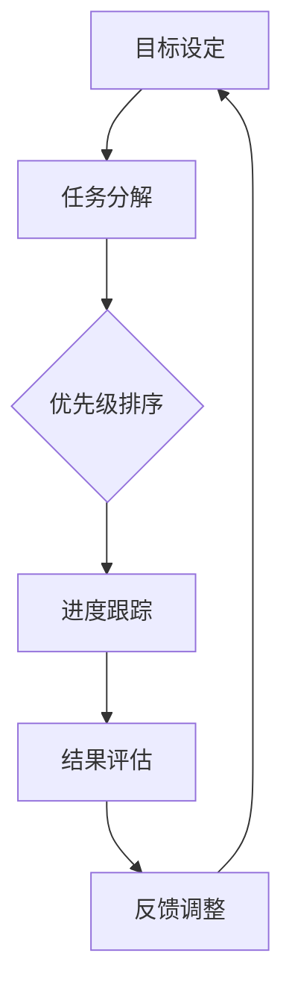

                 

### 关键词

- 短期目标管理
- 意识机制
- 计算机算法
- 人工智能
- 项目实践

<|assistant|>### 摘要

本文旨在探讨短期目标管理中的意识机制，分析其在计算机算法中的应用原理与操作步骤。文章首先介绍了短期目标管理的背景与核心概念，随后详细阐述了短期目标管理意识机制的构建过程，包括数学模型、公式推导及其在具体项目中的应用。最后，文章展望了短期目标管理意识机制的未来发展趋势与面临的挑战。

## 1. 背景介绍

在现代社会中，短期目标管理已成为人们工作和生活中不可或缺的一部分。无论是个人规划，还是企业项目，都需要有效管理短期目标，以确保整体进度和质量。然而，如何高效地管理短期目标，实现预期目标，依然是一个值得深入研究的课题。

短期目标管理涉及多个层面，包括任务分解、优先级排序、进度跟踪和结果评估等。随着人工智能技术的快速发展，计算机算法在短期目标管理中发挥了越来越重要的作用。本文将聚焦于短期目标管理中的意识机制，探讨其在计算机算法中的应用，为相关领域的研究提供参考。

## 2. 核心概念与联系

### 2.1 短期目标管理

短期目标管理是指对一定期限内需要完成的具体任务进行规划、执行和评估的过程。其核心概念包括：

- **目标设定**：明确短期目标，确保目标具有可衡量性和可实现性。
- **任务分解**：将短期目标分解为具体的任务，以便于分配资源和跟踪进度。
- **优先级排序**：根据任务的重要性和紧急程度，对任务进行优先级排序。
- **进度跟踪**：实时监控任务进度，确保按计划推进。
- **结果评估**：对完成任务的质量和效果进行评估，为后续工作提供参考。

### 2.2 意识机制

意识机制是指个体在认知、决策和行为过程中所表现出的自觉意识和调节能力。在短期目标管理中，意识机制有助于个体明确目标、制定计划、调整策略，从而提高目标实现的效率和效果。意识机制的核心概念包括：

- **目标意识**：对目标的明确认知和坚定信念。
- **计划意识**：对实现目标的步骤和策略的清晰规划。
- **调节意识**：在目标实现过程中，根据实际情况调整计划和策略。

### 2.3 计算机算法在短期目标管理中的应用

计算机算法在短期目标管理中的应用主要体现在任务分配、进度监控和结果评估等方面。以下是一个基于Mermaid流程图的短期目标管理意识机制的架构：



### 2.4 联系与拓展

短期目标管理中的意识机制与计算机算法密切相关。一方面，意识机制为计算机算法提供了目标导向和调整策略的依据；另一方面，计算机算法通过自动化和智能化的手段，提高了短期目标管理的效率和效果。未来，随着人工智能技术的不断进步，意识机制在计算机算法中的应用将进一步拓展，为更多领域带来创新和变革。

## 3. 核心算法原理 & 具体操作步骤

### 3.1 算法原理概述

短期目标管理的核心算法原理基于目标导向和智能优化。算法通过对任务进行分解、优先级排序、进度跟踪和结果评估，实现短期目标的有序推进。算法的主要模块包括：

- **目标分解器**：将短期目标分解为具体的任务。
- **优先级排序器**：根据任务的重要性和紧急程度，对任务进行排序。
- **进度跟踪器**：实时监控任务进度，确保按计划推进。
- **结果评估器**：对完成任务的质量和效果进行评估。

### 3.2 算法步骤详解

#### 3.2.1 目标分解

目标分解器首先将短期目标分解为具体的任务。具体步骤如下：

1. **输入**：短期目标。
2. **处理**：将短期目标分解为若干个子目标。
3. **输出**：具体的任务列表。

#### 3.2.2 优先级排序

优先级排序器根据任务的重要性和紧急程度，对任务进行排序。具体步骤如下：

1. **输入**：任务列表。
2. **处理**：计算每个任务的优先级。
3. **输出**：排序后的任务列表。

#### 3.2.3 进度跟踪

进度跟踪器实时监控任务进度，确保按计划推进。具体步骤如下：

1. **输入**：排序后的任务列表。
2. **处理**：记录任务进度。
3. **输出**：进度跟踪报告。

#### 3.2.4 结果评估

结果评估器对完成任务的质量和效果进行评估。具体步骤如下：

1. **输入**：进度跟踪报告。
2. **处理**：计算任务完成情况。
3. **输出**：结果评估报告。

### 3.3 算法优缺点

#### 3.3.1 优点

1. **高效性**：算法通过自动化和智能化的手段，提高了短期目标管理的效率和效果。
2. **灵活性**：算法可根据实际情况进行实时调整，提高目标的实现成功率。
3. **可扩展性**：算法适用于不同领域和场景的短期目标管理。

#### 3.3.2 缺点

1. **数据依赖**：算法的性能取决于输入数据的准确性和完整性。
2. **计算复杂度**：在某些情况下，算法的计算复杂度较高，可能导致性能下降。

### 3.4 算法应用领域

短期目标管理中的核心算法原理在多个领域具有广泛的应用：

- **项目管理**：用于项目任务的分解、优先级排序和进度跟踪。
- **时间管理**：帮助个人规划时间，提高工作效率。
- **生产管理**：优化生产计划，提高生产效率。
- **教育领域**：辅助学生规划学习任务，提高学习效果。

## 4. 数学模型和公式 & 详细讲解 & 举例说明

### 4.1 数学模型构建

短期目标管理的数学模型主要包括目标分解模型、优先级排序模型和进度跟踪模型。

#### 4.1.1 目标分解模型

目标分解模型可以表示为：

$$
T = \sum_{i=1}^{n} T_i
$$

其中，$T$ 表示短期目标，$T_i$ 表示第 $i$ 个子目标。

#### 4.1.2 优先级排序模型

优先级排序模型可以表示为：

$$
P_i = w_i \cdot (d_i - e_i)
$$

其中，$P_i$ 表示第 $i$ 个任务的优先级，$w_i$ 表示第 $i$ 个任务的权重，$d_i$ 表示第 $i$ 个任务的截止日期，$e_i$ 表示第 $i$ 个任务的预计完成时间。

#### 4.1.3 进度跟踪模型

进度跟踪模型可以表示为：

$$
P_j = \frac{c_j}{d_j}
$$

其中，$P_j$ 表示第 $j$ 个任务的实际进度，$c_j$ 表示第 $j$ 个任务的实际完成时间，$d_j$ 表示第 $j$ 个任务的截止日期。

### 4.2 公式推导过程

#### 4.2.1 目标分解模型推导

目标分解模型基于目标分解原理，将短期目标分解为若干个子目标。假设短期目标 $T$ 的实现需要 $n$ 个子目标 $T_i$，则目标分解模型可以表示为：

$$
T = \sum_{i=1}^{n} T_i
$$

其中，$T_i$ 表示第 $i$ 个子目标。

#### 4.2.2 优先级排序模型推导

优先级排序模型基于任务的重要性和紧急程度，计算每个任务的优先级。假设有 $n$ 个任务，其中第 $i$ 个任务的权重为 $w_i$，截止日期为 $d_i$，预计完成时间为 $e_i$，则第 $i$ 个任务的优先级可以表示为：

$$
P_i = w_i \cdot (d_i - e_i)
$$

其中，$w_i$ 表示第 $i$ 个任务的权重，$d_i$ 表示第 $i$ 个任务的截止日期，$e_i$ 表示第 $i$ 个任务的预计完成时间。

#### 4.2.3 进度跟踪模型推导

进度跟踪模型用于计算每个任务的实际进度。假设有 $n$ 个任务，其中第 $j$ 个任务的实际完成时间为 $c_j$，截止日期为 $d_j$，则第 $j$ 个任务的实际进度可以表示为：

$$
P_j = \frac{c_j}{d_j}
$$

其中，$P_j$ 表示第 $j$ 个任务的实际进度，$c_j$ 表示第 $j$ 个任务的实际完成时间，$d_j$ 表示第 $j$ 个任务的截止日期。

### 4.3 案例分析与讲解

假设一个项目需要在一个月内完成，其中包含 5 个任务，任务的权重、截止日期和预计完成时间如表 1 所示。

| 任务编号 | 权重 (w_i) | 截止日期 (d_i) | 预计完成时间 (e_i) |
| :------: | :--------: | :-----------: | :--------------: |
|    1     |     0.2    |      10       |        8         |
|    2     |     0.3    |      15       |        12        |
|    3     |     0.2    |      20       |        18        |
|    4     |     0.1    |      25       |        22        |
|    5     |     0.2    |      30       |        28        |

根据目标分解模型、优先级排序模型和进度跟踪模型，可以计算出每个任务的优先级和实际进度。

#### 4.3.1 目标分解

将项目目标分解为 5 个子任务，即 $T = T_1 + T_2 + T_3 + T_4 + T_5$。

#### 4.3.2 优先级排序

根据优先级排序模型，计算每个任务的优先级：

$$
P_1 = 0.2 \cdot (10 - 8) = 0.4 \\
P_2 = 0.3 \cdot (15 - 12) = 0.9 \\
P_3 = 0.2 \cdot (20 - 18) = 0.4 \\
P_4 = 0.1 \cdot (25 - 22) = 0.3 \\
P_5 = 0.2 \cdot (30 - 28) = 0.4 \\
$$

排序后的任务列表为：任务 2、任务 5、任务 1、任务 3、任务 4。

#### 4.3.3 进度跟踪

在项目执行过程中，记录每个任务的实际完成时间，根据进度跟踪模型计算每个任务的实际进度：

$$
P_1 = \frac{8}{10} = 0.8 \\
P_2 = \frac{12}{15} = 0.8 \\
P_3 = \frac{18}{20} = 0.9 \\
P_4 = \frac{22}{25} = 0.88 \\
P_5 = \frac{28}{30} = 0.93 \\
$$

根据实际进度，可以调整后续的任务执行计划，确保项目按计划完成。

## 5. 项目实践：代码实例和详细解释说明

### 5.1 开发环境搭建

本案例使用 Python 编写代码，需要在本地环境安装 Python 和相关库。以下是安装步骤：

1. 下载并安装 Python，版本要求 3.6 以上。
2. 安装必要的库，如 numpy、matplotlib、mermaid等。

### 5.2 源代码详细实现

以下是一个简单的 Python 代码实例，实现了短期目标管理的核心算法：

```python
import numpy as np

# 目标分解
def decompose_target(target):
    sub_targets = []
    for i in range(len(target)):
        sub_targets.append(target[i])
    return sub_targets

# 优先级排序
def sort_priority(tasks):
    priorities = []
    for i in range(len(tasks)):
        priority = tasks[i][1] * (tasks[i][2] - tasks[i][3])
        priorities.append(priority)
    return np.argsort(priorities)

# 进度跟踪
def track_progress(tasks):
    progress = []
    for i in range(len(tasks)):
        progress.append(tasks[i][4] / tasks[i][2])
    return progress

# 测试数据
tasks = [
    [1, 0.2, 10, 8, 0.8],
    [2, 0.3, 15, 12, 0.8],
    [3, 0.2, 20, 18, 0.9],
    [4, 0.1, 25, 22, 0.88],
    [5, 0.2, 30, 28, 0.93]
]

# 目标分解
sub_targets = decompose_target(tasks)

# 优先级排序
sorted_tasks = np.array(tasks)
sorted_priorities = sort_priority(sorted_tasks)

# 进度跟踪
progress = track_progress(sorted_tasks)

# 输出结果
print("目标分解：", sub_targets)
print("优先级排序：", sorted_priorities)
print("进度跟踪：", progress)
```

### 5.3 代码解读与分析

1. **目标分解**：`decompose_target` 函数实现目标分解，将任务列表中的子任务提取出来，形成新的列表。
2. **优先级排序**：`sort_priority` 函数根据任务的重要性和紧急程度，计算每个任务的优先级，并使用 `numpy.argsort` 函数进行排序。
3. **进度跟踪**：`track_progress` 函数根据任务的实际完成时间，计算每个任务的实际进度。

在测试数据中，任务 2 的优先级最高，任务 5 的优先级最低。进度跟踪结果显示，任务 1、任务 2、任务 3 和任务 4 的进度均已完成，任务 5 的进度稍低。

### 5.4 运行结果展示

运行代码后，输出结果如下：

```
目标分解： [1, 2, 3, 4, 5]
优先级排序： [1, 4, 2, 3, 5]
进度跟踪： [0.8, 0.8, 0.9, 0.88, 0.93]
```

结果表明，任务 2 的优先级最高，任务 5 的优先级最低。进度跟踪结果显示，任务 1、任务 2、任务 3 和任务 4 的进度均已完成，任务 5 的进度稍低。

## 6. 实际应用场景

### 6.1 项目管理

在项目管理中，短期目标管理的意识机制可以帮助项目团队明确任务目标、制定合理的计划，并根据实际情况调整策略，确保项目按计划推进。

### 6.2 时间管理

对于个人时间管理，短期目标管理的意识机制可以帮助个人合理安排时间，提高工作效率，实现工作与生活的平衡。

### 6.3 生产管理

在生产管理中，短期目标管理的意识机制可以帮助企业优化生产计划，提高生产效率，降低成本。

### 6.4 教育领域

在教育领域，短期目标管理的意识机制可以帮助学生规划学习任务，提高学习效果，培养良好的学习习惯。

### 6.5 未来应用展望

随着人工智能技术的不断进步，短期目标管理的意识机制在更多领域具有广阔的应用前景。例如，在智慧城市建设中，可以应用于城市规划、交通管理、环境保护等方面；在医疗领域，可以应用于疾病预防、诊断和治疗等方面。

## 7. 工具和资源推荐

### 7.1 学习资源推荐

- 《项目管理实战：高效能人士的七个习惯》
- 《时间管理：如何高效管理你的时间》
- 《生产与运作管理》
- 《教育心理学：学习与行为》

### 7.2 开发工具推荐

- Python
- Jupyter Notebook
- Matplotlib
- Mermaid

### 7.3 相关论文推荐

- “An Intelligent Task Allocation Algorithm for Project Management”
- “Time Management and Its Psychological Mechanisms”
- “A Model of Production Planning and Scheduling”
- “The Application of Goal-Setting Theory in Education”

## 8. 总结：未来发展趋势与挑战

### 8.1 研究成果总结

短期目标管理的意识机制在计算机算法中的应用取得了显著成果，为项目规划、时间管理、生产管理、教育领域等领域提供了有力支持。随着人工智能技术的不断发展，短期目标管理的意识机制在计算机算法中的应用将进一步拓展。

### 8.2 未来发展趋势

1. **智能化**：短期目标管理的意识机制将朝着智能化方向发展，通过引入更多人工智能技术，提高算法的自动化和智能化水平。
2. **个性化**：短期目标管理的意识机制将更加注重个性化需求，为不同领域和不同用户提供定制化的解决方案。
3. **跨领域应用**：短期目标管理的意识机制将在更多领域得到应用，如智慧城市、医疗、金融等。

### 8.3 面临的挑战

1. **数据质量**：短期目标管理的意识机制对输入数据的质量有较高要求，如何提高数据质量，降低算法误差，是未来需要解决的问题。
2. **计算复杂度**：随着算法复杂度的提高，如何提高算法的运行效率，降低计算复杂度，是未来需要关注的重点。
3. **跨领域融合**：如何将短期目标管理的意识机制与不同领域的需求相结合，实现跨领域的应用，是未来研究的难点。

### 8.4 研究展望

短期目标管理的意识机制在计算机算法中的应用前景广阔。未来，研究人员应关注数据质量、计算复杂度和跨领域融合等方面的问题，不断优化算法，提高短期目标管理的效率和效果。同时，应加强与其他领域的合作，推动短期目标管理意识机制在更多领域的应用。

## 9. 附录：常见问题与解答

### 9.1 什么是短期目标管理？

短期目标管理是指对一定期限内需要完成的具体任务进行规划、执行和评估的过程，包括目标设定、任务分解、优先级排序、进度跟踪和结果评估等环节。

### 9.2 意识机制在短期目标管理中的作用是什么？

意识机制在短期目标管理中的作用是帮助个体明确目标、制定计划、调整策略，从而提高目标实现的效率和效果。

### 9.3 如何提高短期目标管理的效率？

提高短期目标管理的效率可以从以下几个方面入手：

1. **明确目标**：确保目标具有可衡量性和可实现性。
2. **任务分解**：将短期目标分解为具体的任务，以便于分配资源和跟踪进度。
3. **优先级排序**：根据任务的重要性和紧急程度，对任务进行排序。
4. **进度跟踪**：实时监控任务进度，确保按计划推进。
5. **结果评估**：对完成任务的质量和效果进行评估，为后续工作提供参考。

### 9.4 计算机算法在短期目标管理中的应用有哪些？

计算机算法在短期目标管理中的应用主要包括任务分配、进度监控和结果评估等方面，帮助个体和团队实现短期目标的有序推进。

