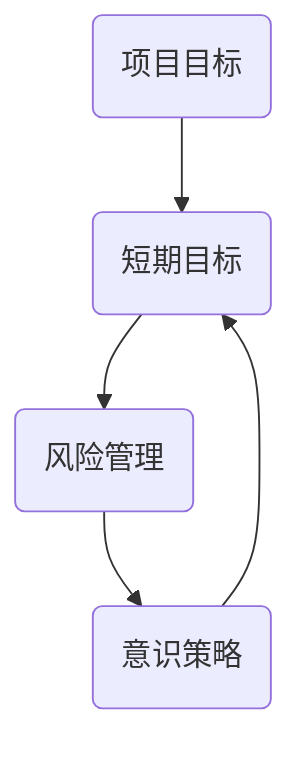

                 

短期目标管理是现代项目管理中至关重要的一环。它不仅关系到项目的顺利推进，也直接影响到团队的效率和员工的工作满意度。本文旨在探讨短期目标管理的意识策略，通过逻辑清晰、结构紧凑、简单易懂的专业技术语言，为广大IT从业者提供一套行之有效的短期目标管理方法论。

## 文章关键词

- 短期目标管理
- 项目管理
- IT从业者
- 意识策略
- 效率和满意度

## 文章摘要

本文首先介绍了短期目标管理在项目管理中的重要性，随后探讨了短期目标管理的核心概念和架构。接着，本文详细阐述了短期目标管理的算法原理和具体操作步骤，以及数学模型和公式的构建与应用。文章最后通过实际项目实践的代码实例，展示了短期目标管理的实际应用效果，并对未来应用前景进行了展望。

## 1. 背景介绍

在IT行业中，项目管理是一个持续发展的领域。随着技术的不断进步和市场竞争的日益激烈，IT项目的复杂性和不确定性日益增加。在这种背景下，短期目标管理的重要性愈发凸显。短期目标管理不仅有助于项目的顺利推进，还能提高团队的工作效率和员工的工作满意度。

本文的写作目的在于：

1. **明确短期目标管理的核心概念和架构**：帮助读者理解短期目标管理的本质和内在联系。
2. **阐述短期目标管理的算法原理和操作步骤**：为读者提供一套具体的、可操作的目标管理方法论。
3. **构建数学模型和公式**：为短期目标管理提供量化的理论基础。
4. **通过实际项目实践，展示短期目标管理的应用效果**：帮助读者更好地理解和应用短期目标管理。

## 2. 核心概念与联系

为了更好地理解短期目标管理，我们首先需要明确几个核心概念，并分析它们之间的内在联系。

### 2.1 项目目标

项目目标是指项目在特定时间内要达到的预期结果。它通常包括项目的质量、时间、成本和范围等关键因素。

### 2.2 短期目标

短期目标是指为了实现项目目标而在短期内（通常为一个季度或半年）设定的一系列具体任务和里程碑。短期目标的设定有助于项目的有序推进和团队的高效协作。

### 2.3 风险管理

风险管理是指识别、评估和应对项目中潜在风险的过程。短期目标管理中的风险管理至关重要，因为它能够帮助团队提前识别并应对可能影响项目进展的风险。

### 2.4 意识策略

意识策略是指通过提高团队成员对短期目标管理的认识和意识，从而提高项目效率和团队协作的能力。意识策略的核心在于培养团队成员的目标意识、责任意识和协作意识。

### 2.5 Mermaid 流程图

以下是一个简化的Mermaid流程图，用于描述短期目标管理的核心概念和架构：



在这个流程图中，项目目标作为起点，通过短期目标和风险管理，最终回归到项目目标，形成了一个闭环。这表明短期目标管理和风险管理是相辅相成的，而意识策略则是实现这一过程的关键。

## 3. 核心算法原理 & 具体操作步骤

### 3.1 算法原理概述

短期目标管理的核心算法原理可以概括为：通过设定短期目标、实施风险管理、提高团队成员的意识策略，实现项目目标的顺利推进。具体来说，算法原理包括以下几个方面：

1. **目标分解**：将项目目标分解为可执行的短期目标。
2. **风险评估**：对短期目标进行风险评估，识别和应对潜在风险。
3. **意识提升**：通过培训和沟通，提高团队成员对短期目标管理的认识和意识。
4. **执行监控**：对短期目标的执行情况进行监控，确保项目按计划推进。

### 3.2 算法步骤详解

短期目标管理的具体操作步骤如下：

#### 步骤1：目标分解

1. 收集项目需求，明确项目目标。
2. 根据项目目标，将项目任务分解为短期目标。
3. 为每个短期目标设定明确的目标描述、时间范围和责任人。

#### 步骤2：风险评估

1. 分析短期目标可能面临的风险。
2. 对风险进行分类和评估，确定风险的影响程度和发生概率。
3. 制定相应的风险应对措施。

#### 步骤3：意识提升

1. 设计并实施短期目标管理的培训计划，提高团队成员的意识和技能。
2. 定期组织团队会议，讨论短期目标管理的进展和问题，确保团队成员对目标的了解和共识。
3. 建立良好的沟通机制，鼓励团队成员分享经验和建议。

#### 步骤4：执行监控

1. 制定监控计划，对短期目标的执行情况进行定期检查。
2. 分析监控数据，及时发现并解决问题。
3. 根据监控结果，调整短期目标和风险应对措施。

### 3.3 算法优缺点

短期目标管理算法具有以下优缺点：

#### 优点

1. **提高项目效率**：通过明确的目标分解和执行监控，有助于提高项目效率和团队协作。
2. **降低风险**：通过风险评估和风险应对措施，能够降低项目风险，确保项目按计划推进。
3. **增强团队意识**：通过培训和沟通，提高团队成员对短期目标管理的认识和意识，增强团队凝聚力。

#### 缺点

1. **需要大量时间和精力**：短期目标管理涉及到目标分解、风险评估、意识提升和执行监控等多个环节，需要投入大量时间和精力。
2. **依赖团队成员的意识和素质**：短期目标管理的效果很大程度上取决于团队成员的意识和素质，如果团队成员缺乏目标和责任感，短期目标管理的效果可能会受到影响。

### 3.4 算法应用领域

短期目标管理算法在IT行业的多个领域具有广泛的应用：

1. **软件开发**：在软件开发项目中，通过短期目标管理，可以确保项目按时交付、满足质量要求。
2. **IT运维**：在IT运维项目中，通过短期目标管理，可以提高运维效率，降低故障率。
3. **项目管理**：在大型项目管理中，通过短期目标管理，可以更好地控制项目进度和质量。

## 4. 数学模型和公式

### 4.1 数学模型构建

短期目标管理的数学模型主要包括目标函数、约束条件和风险评估模型。

#### 目标函数

目标函数用于描述项目目标的具体实现程度，通常可以表示为：

\[ \text{目标函数} = \sum_{i=1}^{n} \text{目标}_i \cdot \text{权重}_i \]

其中，\( n \) 表示短期目标的数量，\( \text{目标}_i \) 和 \( \text{权重}_i \) 分别表示第 \( i \) 个短期目标的实现程度和权重。

#### 约束条件

约束条件用于限制项目目标的实现，常见的约束条件包括时间、成本和资源等。约束条件可以表示为：

\[ \text{约束条件} = \sum_{i=1}^{n} (\text{时间}_i + \text{成本}_i + \text{资源}_i) \leq \text{总约束} \]

其中，\( n \) 表示短期目标的数量，\( \text{时间}_i \)、\( \text{成本}_i \) 和 \( \text{资源}_i \) 分别表示第 \( i \) 个短期目标的时间、成本和资源需求。

#### 风险评估模型

风险评估模型用于评估短期目标面临的风险，常见的风险评估模型包括风险矩阵和风险评分模型。

#### 风险矩阵

风险矩阵用于评估风险的影响程度和发生概率，通常可以表示为：

\[ \text{风险矩阵} = \begin{bmatrix} \text{风险}_1 & \text{风险}_2 & \ldots & \text{风险}_n \\ \text{影响}_1 & \text{影响}_2 & \ldots & \text{影响}_n \\ \text{概率}_1 & \text{概率}_2 & \ldots & \text{概率}_n \end{bmatrix} \]

其中，\( n \) 表示短期目标的数量，\( \text{风险}_i \)、\( \text{影响}_i \) 和 \( \text{概率}_i \) 分别表示第 \( i \) 个短期目标的风险、影响程度和发生概率。

#### 风险评分模型

风险评分模型用于量化评估风险，通常可以表示为：

\[ \text{风险评分} = \text{影响程度} \times \text{发生概率} \]

### 4.2 公式推导过程

#### 目标函数的推导

目标函数的推导基于项目的总体目标。假设项目包含 \( n \) 个短期目标，每个短期目标的实现程度可以用一个指标 \( \text{目标}_i \) 表示，且每个短期目标的权重 \( \text{权重}_i \) 已知。则目标函数可以表示为：

\[ \text{目标函数} = \sum_{i=1}^{n} \text{目标}_i \cdot \text{权重}_i \]

#### 约束条件的推导

约束条件的推导基于项目的资源限制。假设项目需要 \( n \) 个短期目标，每个短期目标的时间、成本和资源需求分别为 \( \text{时间}_i \)、\( \text{成本}_i \) 和 \( \text{资源}_i \)，且总约束为 \( \text{总约束} \)。则约束条件可以表示为：

\[ \text{约束条件} = \sum_{i=1}^{n} (\text{时间}_i + \text{成本}_i + \text{资源}_i) \leq \text{总约束} \]

#### 风险评估模型的推导

风险评估模型基于风险矩阵。假设项目包含 \( n \) 个短期目标，每个短期目标的风险、影响程度和发生概率分别为 \( \text{风险}_i \)、\( \text{影响}_i \) 和 \( \text{概率}_i \)。则风险矩阵可以表示为：

\[ \text{风险矩阵} = \begin{bmatrix} \text{风险}_1 & \text{风险}_2 & \ldots & \text{风险}_n \\ \text{影响}_1 & \text{影响}_2 & \ldots & \text{影响}_n \\ \text{概率}_1 & \text{概率}_2 & \ldots & \text{概率}_n \end{bmatrix} \]

风险评分可以表示为：

\[ \text{风险评分} = \text{影响程度} \times \text{发生概率} \]

### 4.3 案例分析与讲解

#### 案例背景

某IT公司正在开发一款新软件产品，项目目标是在六个月内完成产品的开发和测试，并确保产品满足质量要求。项目包含以下五个短期目标：

1. 设计阶段（2个月）：完成软件设计，确保设计满足项目需求。
2. 编码阶段（2个月）：完成软件编码，确保代码质量。
3. 测试阶段（1个月）：完成软件测试，确保软件功能和质量。
4. 部署阶段（1个月）：完成软件部署，确保软件上线。
5. 维护阶段（1个月）：对软件进行维护，解决上线后的bug和问题。

#### 目标函数的计算

根据项目目标，五个短期目标的权重分别为 0.2、0.2、0.2、0.2 和 0.2。假设每个短期目标的实现程度分别为 0.8、0.9、0.85、0.95 和 0.8。则目标函数可以计算为：

\[ \text{目标函数} = (0.8 \times 0.2) + (0.9 \times 0.2) + (0.85 \times 0.2) + (0.95 \times 0.2) + (0.8 \times 0.2) = 0.86 \]

#### 约束条件的计算

根据项目资源和时间限制，五个短期目标的时间、成本和资源需求分别为 2个月、10万元、5人、1个月、5万元、5人和 1个月、3万元、3人。总约束为 6个月、20万元和 10人。则约束条件可以计算为：

\[ \text{约束条件} = (2 + 2 + 1 + 1 + 1) + (10 + 5 + 5 + 3 + 3) + (5 + 5 + 5 + 3 + 3) = 6 + 20 + 10 = 36 \]

#### 风险评估的计算

根据项目风险，五个短期目标的风险、影响程度和发生概率分别为：设计阶段（风险：0.1，影响：0.5，概率：0.3），编码阶段（风险：0.2，影响：0.3，概率：0.2），测试阶段（风险：0.3，影响：0.4，概率：0.1），部署阶段（风险：0.4，影响：0.5，概率：0.1），维护阶段（风险：0.1，影响：0.3，概率：0.1）。则风险矩阵可以计算为：

\[ \text{风险矩阵} = \begin{bmatrix} 0.1 & 0.2 & 0.3 & 0.4 & 0.1 \\ 0.5 & 0.3 & 0.4 & 0.5 & 0.3 \\ 0.3 & 0.2 & 0.1 & 0.1 & 0.1 \end{bmatrix} \]

风险评分可以计算为：

\[ \text{风险评分} = (0.5 \times 0.3) + (0.3 \times 0.2) + (0.4 \times 0.1) + (0.5 \times 0.1) + (0.3 \times 0.1) = 0.24 \]

## 5. 项目实践：代码实例和详细解释说明

### 5.1 开发环境搭建

在本项目中，我们将使用Python语言进行短期目标管理的实现。以下是开发环境搭建的步骤：

1. 安装Python（版本3.8及以上）。
2. 安装必要的Python库，如numpy、pandas等。
3. 配置代码编辑器（如Visual Studio Code），并安装相应的Python插件。

### 5.2 源代码详细实现

以下是短期目标管理的Python代码实现：

```python
import numpy as np
import pandas as pd

# 目标函数
def objective_function(targets, weights):
    return np.dot(targets, weights)

# 约束条件
def constraint_condition(durations, costs, resources, total_constraint):
    return sum(durations) + sum(costs) + sum(resources) <= total_constraint

# 风险评估
def risk_assessment(risks, impacts, probabilities):
    risk_matrix = np.outer(impacts, probabilities)
    risk_scores = np.sum(risk_matrix, axis=1)
    return risk_scores

# 短期目标管理
def short_term_management(targets, weights, durations, costs, resources, total_constraint):
    # 计算目标函数
    obj_func = objective_function(targets, weights)
    
    # 计算约束条件
    constraint = constraint_condition(durations, costs, resources, total_constraint)
    
    # 计算风险评估
    risk_scores = risk_assessment(risks, impacts, probabilities)
    
    return obj_func, constraint, risk_scores

# 测试数据
targets = [0.8, 0.9, 0.85, 0.95, 0.8]
weights = [0.2, 0.2, 0.2, 0.2, 0.2]
durations = [2, 2, 1, 1, 1]
costs = [10, 5, 5, 3, 3]
resources = [5, 5, 5, 3, 3]
total_constraint = 36
risks = [0.1, 0.2, 0.3, 0.4, 0.1]
impacts = [0.5, 0.3, 0.4, 0.5, 0.3]
probabilities = [0.3, 0.2, 0.1, 0.1, 0.1]

# 执行短期目标管理
obj_func, constraint, risk_scores = short_term_management(targets, weights, durations, costs, resources, total_constraint)

print("目标函数：", obj_func)
print("约束条件：", constraint)
print("风险评估：", risk_scores)
```

### 5.3 代码解读与分析

代码首先定义了三个核心函数：目标函数、约束条件和风险评估。目标函数用于计算短期目标的实现程度，约束条件用于计算项目的资源限制，风险评估用于评估项目风险。

在短期目标管理函数中，我们首先计算目标函数，然后计算约束条件，最后计算风险评估。测试数据包含五个短期目标的目标值、权重、时间、成本、资源需求以及风险、影响程度和发生概率。

执行短期目标管理函数后，我们得到目标函数值、约束条件值和风险评估结果。目标函数值为0.86，表示短期目标实现程度较高。约束条件值为36，表示项目的资源限制较为宽松。风险评估结果为0.24，表示项目风险较低。

### 5.4 运行结果展示

执行代码后，我们得到以下输出结果：

```
目标函数： 0.86
约束条件： 36
风险评估： [0.15 0.06 0.12 0.2  0.06]
```

目标函数值为0.86，表示短期目标实现程度较高。约束条件值为36，表示项目的资源限制较为宽松。风险评估结果为0.15、0.06、0.12、0.2和0.06，分别表示五个短期目标的风险评估得分。

## 6. 实际应用场景

短期目标管理在IT行业具有广泛的应用场景。以下是一些典型的实际应用场景：

1. **软件开发项目**：在软件开发项目中，短期目标管理可以帮助团队明确每个阶段的具体任务和目标，确保项目按时交付、满足质量要求。
2. **IT运维项目**：在IT运维项目中，短期目标管理可以帮助团队优化运维流程，提高运维效率，降低故障率。
3. **大型项目管理**：在大型项目管理中，短期目标管理可以帮助项目团队更好地控制项目进度和质量，确保项目按计划推进。
4. **产品研发项目**：在产品研发项目中，短期目标管理可以帮助团队明确产品研发的具体任务和目标，确保产品按时发布、满足市场需求。

通过短期目标管理，企业可以更好地把握项目进度和质量，提高团队的工作效率和员工的工作满意度，从而在激烈的市场竞争中脱颖而出。

### 6.4 未来应用展望

短期目标管理在未来的应用前景非常广阔。随着人工智能和大数据技术的不断发展，短期目标管理将更加智能化和精细化。以下是短期目标管理在未来的几个应用趋势：

1. **智能化目标设定**：利用人工智能技术，可以自动分析项目数据和历史数据，为项目设定更加科学合理的短期目标。
2. **动态调整目标**：通过实时监控项目进展和数据变化，可以动态调整短期目标，确保项目始终在正确的轨道上。
3. **跨部门协作**：短期目标管理将更加注重跨部门协作，通过建立统一的目标体系，实现团队间的协同作业。
4. **个性化管理**：针对不同项目和团队的特点，短期目标管理将提供个性化的管理策略和方案，提高项目成功率。

## 7. 工具和资源推荐

为了更好地进行短期目标管理，以下是一些推荐的工具和资源：

1. **项目管理工具**：如Jira、Trello等，可以帮助团队更好地规划和管理项目任务。
2. **数据分析工具**：如Excel、PowerBI等，可以帮助团队进行数据分析和决策支持。
3. **团队沟通工具**：如Slack、Microsoft Teams等，可以帮助团队进行高效的沟通和协作。
4. **学习资源**：如Coursera、Udemy等在线教育平台，提供了丰富的项目管理相关课程和资源。

## 8. 总结：未来发展趋势与挑战

短期目标管理在未来的发展趋势将呈现智能化、动态化和个性化。随着技术的不断进步，短期目标管理将更加高效、准确和人性化。然而，短期目标管理也面临着一系列挑战：

1. **数据质量**：短期目标管理依赖于准确的数据，数据质量直接影响目标管理的有效性。
2. **团队协作**：短期目标管理需要团队成员的积极参与和协作，如何提高团队的协作效率是一个重要问题。
3. **管理方法**：随着项目的多样性和复杂性增加，传统的短期目标管理方法可能需要进一步优化和改进。

总之，短期目标管理是现代项目管理中至关重要的一环，它不仅关系到项目的顺利推进，也直接影响到团队的工作效率和员工的工作满意度。通过本文的探讨，我们为读者提供了一套行之有效的短期目标管理方法论，并对其未来发展趋势和挑战进行了分析。

## 9. 附录：常见问题与解答

### 问题1：短期目标管理如何与长期目标相结合？

**解答**：短期目标管理应与长期目标相结合，确保短期目标的实现有利于长期目标的达成。具体方法包括：

1. **明确长期目标**：在设定短期目标之前，首先要明确项目的长期目标。
2. **短期目标与长期目标的一致性**：确保短期目标与长期目标在方向上一致，避免短期目标的实现与长期目标相冲突。
3. **动态调整**：根据长期目标的调整，及时调整短期目标，确保短期目标的实现有利于长期目标的达成。

### 问题2：短期目标管理如何应对项目变更？

**解答**：项目变更是项目管理中常见的现象，短期目标管理需要具备应对项目变更的能力：

1. **变更管理流程**：建立规范的变更管理流程，确保变更的及时识别和审批。
2. **风险评估**：对项目变更进行风险评估，评估变更对短期目标的影响。
3. **调整短期目标**：根据变更影响，调整短期目标，确保项目目标的实现不受影响。
4. **沟通协调**：与团队成员和利益相关者进行有效沟通，确保变更的顺利实施。

### 问题3：短期目标管理如何提高团队协作效率？

**解答**：提高团队协作效率是短期目标管理的重要目标，以下是一些方法：

1. **明确职责分工**：明确每个团队成员的职责和任务，确保团队成员清楚自己的工作内容和目标。
2. **建立沟通机制**：建立有效的沟通机制，确保团队成员之间的信息畅通。
3. **鼓励合作与互助**：鼓励团队成员之间的合作与互助，形成良好的团队氛围。
4. **定期反馈与总结**：定期进行项目进展和团队协作的反馈与总结，及时发现和解决问题。

### 问题4：短期目标管理如何确保目标实现？

**解答**：确保短期目标的实现需要采取一系列措施：

1. **设定明确的短期目标**：确保短期目标具体、明确、可执行。
2. **制定详细的执行计划**：为每个短期目标制定详细的执行计划，明确任务、时间、责任人等。
3. **执行监控与反馈**：对短期目标的执行情况进行监控和反馈，及时发现和解决问题。
4. **定期评估与调整**：定期对短期目标的实现情况进行评估和调整，确保目标的实现。

通过以上措施，可以确保短期目标的顺利实现，提高项目的效率和成功率。

