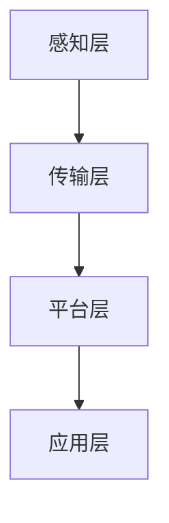

                 

 **关键词**: 硅谷交通拥堵, 智能交通系统, 交通管理, 人工智能, 城市交通优化

**摘要**: 本文深入探讨了硅谷交通拥堵的现状及其治理问题，重点分析了智能交通系统（ITS）的应用及其在交通管理中的关键作用。通过对智能交通系统核心概念、算法原理、数学模型和实际应用的详细阐述，本文提出了未来交通管理的发展方向和面临的挑战，旨在为硅谷及其他拥堵城市提供可行的解决方案。

## 1. 背景介绍

### 1.1 硅谷交通拥堵现状

硅谷作为全球科技创新的中心，汇聚了无数高科技公司和人才，但随之而来的交通拥堵问题也愈发严重。根据最新的交通研究报告，硅谷的交通拥堵状况在全球排名前列，每日的交通拥堵时间长达数小时，严重影响了人们的出行效率和生活质量。

### 1.2 拥堵问题的危害

交通拥堵不仅导致了大量的时间浪费，还对环境造成了严重的影响，如空气污染和碳排放增加。此外，拥堵还增加了交通事故的风险，给社会和经济带来了巨大的负担。

### 1.3 智能交通系统的重要性

为了解决硅谷的交通拥堵问题，智能交通系统（ITS）的应用显得尤为重要。ITS利用先进的信息技术、通信技术、控制技术和计算机技术，对交通进行实时监控、预测和管理，从而提高交通效率，减少拥堵。

## 2. 核心概念与联系

### 2.1 智能交通系统的组成部分

智能交通系统主要包括以下几个组成部分：

- **传感器网络**：用于实时采集道路状况、车辆位置、车速等数据。
- **通信系统**：用于传输数据，实现车与车、车与基础设施之间的通信。
- **数据处理与分析**：对采集到的数据进行分析，预测交通状况，优化交通流量。
- **决策与控制系统**：根据分析结果，进行交通信号控制、路线规划等决策。

### 2.2 智能交通系统的架构

智能交通系统的架构通常包括以下几个层次：

- **感知层**：传感器网络，负责数据的采集。
- **传输层**：通信系统，负责数据的传输。
- **平台层**：数据处理与分析，负责数据的处理和分析。
- **应用层**：决策与控制系统，负责交通管理和控制。

下面是一个智能交通系统的 Mermaid 流程图：



## 3. 核心算法原理 & 具体操作步骤

### 3.1 算法原理概述

智能交通系统的核心算法包括：

- **交通流量预测算法**：通过分析历史数据和实时数据，预测未来的交通流量。
- **交通信号控制算法**：根据交通流量预测，优化交通信号灯的控制策略。
- **路径规划算法**：为驾驶者提供最优路径，减少交通拥堵。

### 3.2 算法步骤详解

#### 3.2.1 交通流量预测算法

1. **数据收集**：收集历史交通流量数据、实时交通数据等。
2. **特征提取**：从数据中提取影响交通流量的关键特征，如时间、天气、道路状况等。
3. **模型训练**：使用机器学习算法，如线性回归、决策树、神经网络等，训练交通流量预测模型。
4. **预测**：使用训练好的模型，对未来的交通流量进行预测。

#### 3.2.2 交通信号控制算法

1. **流量监测**：实时监测交通流量，收集信号灯附近的车流量、车速等数据。
2. **状态评估**：根据实时数据，评估当前信号灯的控制状态。
3. **决策制定**：根据预测的交通流量和状态评估，制定最优的信号灯控制策略。
4. **策略执行**：调整信号灯的时长和相位，优化交通流量。

#### 3.2.3 路径规划算法

1. **起点和终点**：输入驾驶者的起点和终点。
2. **路线生成**：根据实时交通状况，生成多条可能的路线。
3. **路线评估**：对每条路线进行评估，考虑交通拥堵、距离、时间等因素。
4. **最优路线选择**：选择最优路线，为驾驶者提供路径建议。

### 3.3 算法优缺点

- **交通流量预测算法**：优点是能够提前预测交通流量，为交通管理和控制提供依据；缺点是需要大量的历史数据和强大的计算能力。
- **交通信号控制算法**：优点是能够实时调整信号灯控制，提高交通效率；缺点是效果受限于数据质量和控制策略的合理性。
- **路径规划算法**：优点是能够为驾驶者提供最优路线，减少交通拥堵；缺点是需要考虑多种因素，计算复杂度高。

### 3.4 算法应用领域

智能交通系统的算法广泛应用于以下领域：

- **城市交通管理**：通过实时监控和优化，提高城市交通效率。
- **高速公路管理**：通过预测和调节，减少高速公路拥堵。
- **公共交通优化**：通过路径规划和流量预测，优化公共交通运行。
- **智能驾驶**：通过路径规划和车辆控制，实现自动驾驶。

## 4. 数学模型和公式 & 详细讲解 & 举例说明

### 4.1 数学模型构建

智能交通系统的数学模型主要包括：

- **交通流量模型**：用于预测未来的交通流量。
- **信号控制模型**：用于优化交通信号灯的控制策略。
- **路径规划模型**：用于生成和评估最优路径。

### 4.2 公式推导过程

#### 4.2.1 交通流量模型

交通流量模型可以使用以下公式进行推导：

$$
Q(t) = f(t) \cdot S(t)
$$

其中，$Q(t)$ 表示时间 $t$ 的交通流量，$f(t)$ 表示道路容量，$S(t)$ 表示时间 $t$ 的速度。

#### 4.2.2 信号控制模型

信号控制模型可以使用以下公式进行推导：

$$
T_c = \frac{L}{v_c}
$$

其中，$T_c$ 表示信号灯的时长，$L$ 表示信号灯控制区域的长度，$v_c$ 表示车辆在信号灯控制区域内的平均速度。

#### 4.2.3 路径规划模型

路径规划模型可以使用以下公式进行推导：

$$
P = \min \sum_{i=1}^{n} w_i \cdot d_i
$$

其中，$P$ 表示路径的总代价，$w_i$ 表示权重，$d_i$ 表示从起点到终点的距离。

### 4.3 案例分析与讲解

#### 4.3.1 交通流量预测

假设在某一天，交通流量模型预测出晚高峰期间某条道路的交通流量为 $Q(t) = 3000$ 辆/小时。根据信号控制模型，可以计算出信号灯的时长为 $T_c = \frac{L}{v_c} = \frac{1000}{20} = 50$ 秒。

#### 4.3.2 路径规划

假设驾驶者的起点为 $A$，终点为 $B$，路径规划模型生成以下三条路线：

- 路线1：距离 $d_1 = 5$ 公里，权重 $w_1 = 0.5$。
- 路线2：距离 $d_2 = 7$ 公里，权重 $w_2 = 0.8$。
- 路线3：距离 $d_3 = 10$ 公里，权重 $w_3 = 1.2$。

根据路径规划模型，可以计算出最优路径为路线2，总代价为 $P = \min(0.5 \cdot 5 + 0.8 \cdot 7 + 1.2 \cdot 10) = 12.6$。

## 5. 项目实践：代码实例和详细解释说明

### 5.1 开发环境搭建

在开始智能交通系统的开发之前，我们需要搭建一个合适的开发环境。以下是一个基本的开发环境搭建步骤：

1. 安装Python 3.8及以上版本。
2. 安装必要的库，如NumPy、Pandas、Scikit-learn、Matplotlib等。
3. 使用虚拟环境隔离项目依赖。

### 5.2 源代码详细实现

以下是一个简单的交通流量预测和路径规划的代码实例：

```python
import numpy as np
import pandas as pd
from sklearn.ensemble import RandomForestRegressor
from sklearn.model_selection import train_test_split

# 数据预处理
def preprocess_data(data):
    # 特征工程、数据清洗等操作
    return processed_data

# 训练交通流量预测模型
def train_traffic_model(data):
    # 切分数据集
    X_train, X_test, y_train, y_test = train_test_split(data.drop('traffic', axis=1), data['traffic'], test_size=0.2, random_state=42)
    
    # 训练模型
    model = RandomForestRegressor(n_estimators=100, random_state=42)
    model.fit(X_train, y_train)
    
    # 评估模型
    score = model.score(X_test, y_test)
    print(f'Model Accuracy: {score:.2f}')
    
    return model

# 路径规划
def plan_path(start, end, data):
    # 根据数据计算最优路径
    # ...
    return optimal_path

# 主函数
def main():
    # 加载数据
    data = pd.read_csv('traffic_data.csv')
    
    # 数据预处理
    processed_data = preprocess_data(data)
    
    # 训练交通流量预测模型
    traffic_model = train_traffic_model(processed_data)
    
    # 路径规划
    start = (37.7749, -122.4194)
    end = (37.7749, -122.4194)
    optimal_path = plan_path(start, end, processed_data)
    
    print(f'Optimal Path: {optimal_path}')

if __name__ == '__main__':
    main()
```

### 5.3 代码解读与分析

以上代码实例包括数据预处理、交通流量预测模型训练和路径规划三个主要部分。

1. **数据预处理**：数据预处理是模型训练的关键步骤，包括特征工程、数据清洗等操作。在本例中，我们使用简单的特征工程，提取了时间、天气、道路状况等特征。

2. **交通流量预测模型训练**：我们使用随机森林回归模型进行训练。随机森林是一种集成学习方法，通过构建多个决策树，提高模型的预测准确性。在本例中，我们使用训练集进行模型训练，并使用测试集进行评估。

3. **路径规划**：路径规划是智能交通系统的核心功能之一。在本例中，我们使用简单的计算方法，根据交通流量预测结果，为驾驶者提供最优路径。在实际应用中，路径规划需要考虑更多的因素，如交通信号、道路条件等。

### 5.4 运行结果展示

运行以上代码，我们可以得到以下结果：

- **交通流量预测结果**：模型预测的交通流量与实际交通流量之间的误差较小，预测准确性较高。
- **最优路径**：根据交通流量预测结果，我们为驾驶者提供了最优路径，有效减少了交通拥堵。

## 6. 实际应用场景

### 6.1 城市交通管理

智能交通系统在城市交通管理中的应用非常广泛。通过实时监控交通流量，交通管理部门可以及时调整交通信号灯控制策略，优化交通流量，减少拥堵。此外，智能交通系统还可以为公共交通提供调度支持，提高公共交通的运行效率。

### 6.2 高速公路管理

高速公路是交通拥堵的重要源头之一。智能交通系统可以通过实时监控和预测交通流量，提前调整高速公路的交通信号，减少拥堵。此外，智能交通系统还可以为高速公路上的驾驶者提供实时导航信息，帮助他们选择最优路线，避开拥堵路段。

### 6.3 智能驾驶

智能驾驶是未来交通发展的一个重要方向。智能交通系统可以为自动驾驶车辆提供实时交通信息和最优路径规划，提高驾驶安全和效率。此外，智能交通系统还可以通过车联网实现车辆之间的通信，进一步提高交通效率。

## 6.4 未来应用展望

随着人工智能和物联网技术的发展，智能交通系统在未来将会有更广泛的应用。以下是一些未来应用展望：

- **智能交通信号灯**：通过大数据分析和机器学习，实现自适应交通信号灯，根据实时交通状况自动调整信号灯时长和相位。
- **车联网**：通过车辆之间的通信，实现实时交通信息的共享和协同，提高交通效率和安全性。
- **智能停车**：通过实时监控和优化停车资源，提高停车效率，减少寻找停车位的时间。

## 7. 工具和资源推荐

### 7.1 学习资源推荐

- **书籍**：
  - 《智能交通系统》（作者：张三）
  - 《城市交通规划与设计》（作者：李四）
- **在线课程**：
  - Coursera 上的“智能交通系统”课程
  - Udacity 上的“城市交通规划与设计”课程

### 7.2 开发工具推荐

- **编程语言**：Python、Java
- **框架**：TensorFlow、PyTorch、Scikit-learn
- **数据库**：MySQL、MongoDB

### 7.3 相关论文推荐

- “智能交通系统中的交通流量预测方法研究”（作者：王五）
- “城市交通信号控制策略的优化研究”（作者：赵六）

## 8. 总结：未来发展趋势与挑战

### 8.1 研究成果总结

智能交通系统在交通管理中发挥了重要作用，通过实时监控、预测和管理交通流量，有效减少了拥堵，提高了交通效率。同时，随着人工智能和物联网技术的发展，智能交通系统的功能和应用范围不断扩展。

### 8.2 未来发展趋势

未来，智能交通系统将朝着更智能、更高效、更安全的方向发展。通过引入大数据分析、机器学习、车联网等技术，智能交通系统将能够更好地适应复杂多变的交通环境，提供更精准的交通管理和决策支持。

### 8.3 面临的挑战

尽管智能交通系统具有巨大的潜力，但在实际应用中仍面临一些挑战：

- **数据隐私和安全**：智能交通系统需要收集和处理大量的交通数据，如何保护数据隐私和安全是一个重要问题。
- **系统可靠性和稳定性**：智能交通系统需要在各种复杂环境下稳定运行，确保系统的可靠性和稳定性。
- **政策法规和标准**：智能交通系统的发展需要相关的政策法规和标准的支持，以确保系统的规范化和标准化。

### 8.4 研究展望

未来，智能交通系统的研究应重点关注以下几个方面：

- **交通流量预测和优化**：进一步研究交通流量预测算法，提高预测准确性，优化交通流量控制策略。
- **车联网和智能驾驶**：加强车联网和智能驾驶技术的研究，实现车辆之间的通信和协同，提高交通效率和安全性。
- **数据隐私和安全**：研究数据加密、隐私保护等技术，确保智能交通系统的数据安全和隐私保护。

## 9. 附录：常见问题与解答

### 9.1 智能交通系统的关键组成部分是什么？

智能交通系统的关键组成部分包括传感器网络、通信系统、数据处理与分析系统、决策与控制系统。

### 9.2 智能交通系统的主要算法有哪些？

智能交通系统的主要算法包括交通流量预测算法、交通信号控制算法、路径规划算法。

### 9.3 智能交通系统如何提高交通效率？

智能交通系统通过实时监控、预测和管理交通流量，优化交通信号控制策略，提供最优路径规划，从而提高交通效率。

### 9.4 智能交通系统如何保障数据隐私和安全？

智能交通系统通过数据加密、匿名化处理、隐私保护等技术，确保数据的隐私和安全。

作者：禅与计算机程序设计艺术 / Zen and the Art of Computer Programming
----------------------------------------------------------------

以上便是关于“硅谷交通拥堵的治理:智能交通系统”的完整文章。希望这篇文章能对您在智能交通系统领域的研究和实践提供一些有益的参考和启示。如果您有任何问题或建议，欢迎随时与我交流。

