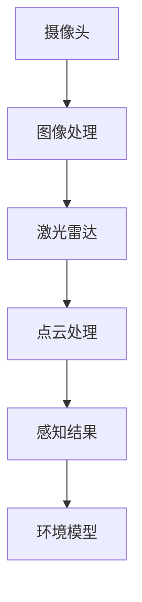
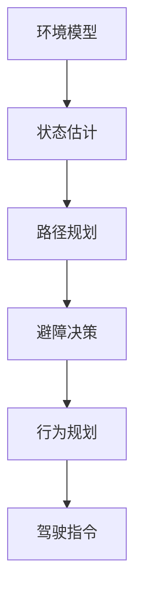
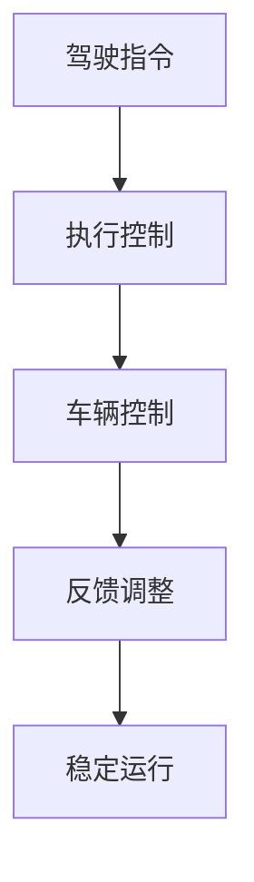
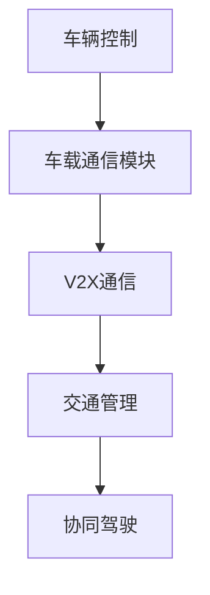

                 

关键词：硅谷，交通智能化，无人驾驶，AI，未来

摘要：本文从硅谷交通智能化的视角，探讨了无人驾驶技术的发展与应用，分析了其背后的核心算法原理、数学模型、以及实际应用场景。通过对无人驾驶的深入探讨，本文旨在为读者揭示交通智能化未来的发展方向与挑战，同时推荐相关学习资源、开发工具和论文，以期为读者提供全面的了解。

## 1. 背景介绍

硅谷作为全球科技创新的中心，一直是前沿技术的发源地。其中，交通智能化技术，特别是无人驾驶汽车的发展，已经成为硅谷科技产业的重要方向。近年来，随着人工智能（AI）技术的迅速进步，无人驾驶汽车的研究和应用得到了前所未有的关注。

无人驾驶汽车是一种能够自主感知环境、规划路径并控制车辆运行的智能交通工具。其核心技术包括感知系统、决策系统、控制系统和通信系统。随着硅谷科技公司在这些领域的不断探索和突破，无人驾驶汽车的发展已经成为全球瞩目的焦点。

## 2. 核心概念与联系

为了深入理解无人驾驶汽车的工作原理，我们需要了解其核心概念与联系。以下是无人驾驶汽车的主要组成部分及其关系：

```
用户需求 -> 传感器 -> 感知系统 -> 建立环境模型
环境模型 -> 决策系统 -> 行为规划 -> 避障与导航
行为规划 -> 控制系统 -> 车辆控制 -> 驾驶动作
车辆控制 -> 通信系统 -> 交互与协同 -> 交通管理
```

### 2.1. 感知系统

感知系统是无人驾驶汽车的核心，它负责收集车辆周围的环境信息，如路况、天气、行人等。常用的感知系统包括摄像头、激光雷达、超声波传感器等。以下是感知系统的 Mermaid 流程图：



### 2.2. 决策系统

决策系统根据感知系统提供的环境信息，制定车辆的行驶策略。其核心任务是路径规划与避障。以下是决策系统的 Mermaid 流程图：



### 2.3. 控制系统

控制系统根据决策系统提供的行为规划，控制车辆的加速度、转向等动作，实现无人驾驶。以下是控制系统的 Mermaid 流程图：



### 2.4. 通信系统

通信系统负责车辆与外部环境之间的信息交换，如与其他车辆、道路基础设施等。以下是通信系统的 Mermaid 流程图：



## 3. 核心算法原理 & 具体操作步骤

### 3.1  算法原理概述

无人驾驶汽车的核心算法主要包括感知、决策、控制和通信四个方面。以下是各个算法原理的概述：

- **感知算法**：主要使用计算机视觉、激光雷达和超声波传感器等技术，实现对周围环境的感知和理解。
- **决策算法**：基于感知结果，使用路径规划、避障决策等技术，制定车辆的行驶策略。
- **控制算法**：根据决策结果，使用控制理论，实现对车辆的加速度、转向等动作的控制。
- **通信算法**：负责车辆与外部环境之间的信息交换，实现车辆之间的协同驾驶。

### 3.2  算法步骤详解

以下是无人驾驶汽车的核心算法的具体步骤：

#### 3.2.1 感知算法步骤

1. **数据采集**：通过摄像头、激光雷达和超声波传感器等设备，采集车辆周围的环境数据。
2. **数据预处理**：对采集到的数据进行滤波、去噪等预处理，以提高感知精度。
3. **特征提取**：对预处理后的数据进行特征提取，如边缘检测、轮廓提取等。
4. **目标检测与识别**：使用深度学习等技术，对提取的特征进行目标检测与识别，如行人、车辆等。

#### 3.2.2 决策算法步骤

1. **环境建模**：根据感知结果，建立车辆周围的环境模型。
2. **状态估计**：使用卡尔曼滤波、粒子滤波等技术，对车辆的状态进行估计。
3. **路径规划**：使用 A*算法、RRT算法等，规划车辆的行驶路径。
4. **避障决策**：根据路径规划和环境模型，制定避障策略。

#### 3.2.3 控制算法步骤

1. **驾驶指令生成**：根据决策结果，生成车辆的加速度、转向等驾驶指令。
2. **控制律设计**：设计合适的控制律，如 PID 控制器、模糊控制器等。
3. **车辆控制**：根据驾驶指令，使用控制律，对车辆进行控制。
4. **反馈调整**：根据车辆的运行状态，调整控制参数，实现稳定运行。

#### 3.2.4 通信算法步骤

1. **通信模块初始化**：初始化车载通信模块，如 Wi-Fi、5G 等。
2. **V2X通信**：实现车辆与外部环境之间的通信，如与其他车辆、道路基础设施等。
3. **交通管理**：根据通信结果，参与交通管理，如信号灯控制、车流调控等。
4. **协同驾驶**：与其他车辆协同驾驶，实现高效的交通流量。

### 3.3  算法优缺点

#### 感知算法

- **优点**：感知算法能够实时获取车辆周围的环境信息，为决策提供准确的数据支持。
- **缺点**：感知算法对传感器质量和数据处理能力要求较高，成本较高。

#### 决策算法

- **优点**：决策算法能够根据环境信息，制定合理的行驶策略，提高驾驶安全性。
- **缺点**：决策算法复杂度高，计算量大，对硬件性能要求较高。

#### 控制算法

- **优点**：控制算法能够根据决策结果，实现对车辆的精确控制，提高驾驶稳定性。
- **缺点**：控制算法对驾驶环境的适应性较差，容易受到外部干扰。

#### 通信算法

- **优点**：通信算法能够实现车辆之间的信息交换，提高交通效率。
- **缺点**：通信算法对通信基础设施要求较高，且存在通信延迟等问题。

### 3.4  算法应用领域

无人驾驶汽车的核心算法不仅在汽车领域有广泛应用，还可以应用于其他交通领域，如无人飞机、无人船等。以下是算法应用领域的概述：

- **汽车领域**：无人驾驶汽车是当前最成熟的应用领域，未来有望实现大规模商业化。
- **无人机领域**：无人机在物流、农业、救援等领域有广泛应用，无人驾驶技术可以提高无人机作业效率。
- **无人船领域**：无人船在海洋探索、环境监测等领域有广泛应用，无人驾驶技术可以降低人力成本，提高作业精度。

## 4. 数学模型和公式 & 详细讲解 & 举例说明

### 4.1  数学模型构建

无人驾驶汽车的核心算法涉及到多种数学模型，如感知模型、决策模型、控制模型和通信模型。以下是这些数学模型的构建：

#### 4.1.1 感知模型

感知模型主要基于计算机视觉和激光雷达技术，建立车辆周围的环境模型。以下是感知模型的数学模型构建：

$$
E(t) = f(S(t), C(t), L(t))
$$

其中，$E(t)$ 表示环境模型，$S(t)$ 表示传感器采集的数据，$C(t)$ 表示相机采集的图像，$L(t)$ 表示激光雷达采集的点云数据。$f$ 表示感知模型函数，用于对传感器数据进行处理和融合。

#### 4.1.2 决策模型

决策模型基于感知模型，使用路径规划、避障决策等技术，制定车辆的行驶策略。以下是决策模型的数学模型构建：

$$
P(t) = g(E(t), O(t))
$$

其中，$P(t)$ 表示路径规划，$E(t)$ 表示环境模型，$O(t)$ 表示初始状态。$g$ 表示决策模型函数，用于根据环境模型和初始状态，生成车辆的行驶路径。

#### 4.1.3 控制模型

控制模型根据决策模型，使用控制理论，实现对车辆的加速度、转向等动作的控制。以下是控制模型的数学模型构建：

$$
U(t) = h(P(t), V(t))
$$

其中，$U(t)$ 表示驾驶指令，$P(t)$ 表示路径规划，$V(t)$ 表示车辆状态。$h$ 表示控制模型函数，用于根据路径规划和车辆状态，生成驾驶指令。

#### 4.1.4 通信模型

通信模型负责车辆与外部环境之间的信息交换，实现车辆之间的协同驾驶。以下是通信模型的数学模型构建：

$$
M(t) = k(E(t), R(t))
$$

其中，$M(t)$ 表示通信模型，$E(t)$ 表示环境模型，$R(t)$ 表示通信结果。$k$ 表示通信模型函数，用于根据环境模型和通信结果，生成通信策略。

### 4.2  公式推导过程

#### 4.2.1 感知模型推导

感知模型的推导主要基于传感器数据融合和特征提取。以下是感知模型的推导过程：

$$
E(t) = f(S(t), C(t), L(t))
$$

$$
S(t) = [s_1(t), s_2(t), ..., s_n(t)]
$$

$$
C(t) = [c_1(t), c_2(t), ..., c_m(t)]
$$

$$
L(t) = [l_1(t), l_2(t), ..., l_p(t)]
$$

$$
f(S(t), C(t), L(t)) = \sum_{i=1}^{n} w_i \cdot s_i(t) + \sum_{j=1}^{m} w_j \cdot c_j(t) + \sum_{k=1}^{p} w_k \cdot l_k(t)
$$

其中，$S(t)$ 表示传感器采集的数据，$C(t)$ 表示相机采集的图像，$L(t)$ 表示激光雷达采集的点云数据。$w_i$、$w_j$ 和 $w_k$ 分别为传感器数据、相机数据和激光雷达数据的权重。

#### 4.2.2 决策模型推导

决策模型的推导主要基于路径规划和避障决策。以下是决策模型的推导过程：

$$
P(t) = g(E(t), O(t))
$$

$$
E(t) = \sum_{i=1}^{n} e_i(t)
$$

$$
O(t) = \sum_{j=1}^{m} o_j(t)
$$

$$
g(E(t), O(t)) = \sum_{i=1}^{n} g_i(e_i(t), o_i(t))
$$

其中，$E(t)$ 表示环境模型，$O(t)$ 表示初始状态。$g_i$ 表示路径规划或避障决策函数，用于根据环境模型和初始状态，生成相应的决策结果。

#### 4.2.3 控制模型推导

控制模型的推导主要基于控制理论。以下是控制模型的推导过程：

$$
U(t) = h(P(t), V(t))
$$

$$
P(t) = \sum_{i=1}^{n} p_i(t)
$$

$$
V(t) = \sum_{j=1}^{m} v_j(t)
$$

$$
h(P(t), V(t)) = \sum_{i=1}^{n} h_i(p_i(t), v_i(t))
$$

其中，$P(t)$ 表示路径规划，$V(t)$ 表示车辆状态。$h_i$ 表示控制律函数，用于根据路径规划和车辆状态，生成相应的驾驶指令。

#### 4.2.4 通信模型推导

通信模型的推导主要基于通信理论和信息论。以下是通信模型的推导过程：

$$
M(t) = k(E(t), R(t))
$$

$$
E(t) = \sum_{i=1}^{n} e_i(t)
$$

$$
R(t) = \sum_{j=1}^{m} r_j(t)
$$

$$
k(E(t), R(t)) = \sum_{i=1}^{n} k_i(e_i(t), r_i(t))
$$

其中，$E(t)$ 表示环境模型，$R(t)$ 表示通信结果。$k_i$ 表示通信策略函数，用于根据环境模型和通信结果，生成相应的通信策略。

### 4.3  案例分析与讲解

为了更好地理解无人驾驶汽车的数学模型和公式，以下我们通过一个具体的案例进行分析和讲解。

#### 案例背景

假设一辆无人驾驶汽车在道路上行驶，周围环境包括道路、行人、车辆和其他交通设施。汽车的初始状态为静止，需要根据环境信息和交通规则，规划一条安全、高效的行驶路径，并实现对车辆的精确控制。

#### 案例分析

1. **感知模型分析**

   汽车通过摄像头、激光雷达和超声波传感器，实时采集周围环境数据。假设感知结果如下：

   - 道路信息：前方100米处有一个红绿灯。
   - 行人信息：前方50米处有一个行人正在横穿马路。
   - 车辆信息：前方30米处有一辆车正在行驶。

   根据感知结果，汽车建立的环境模型如下：

   $$
   E(t) = [红绿灯状态, 行人状态, 车辆状态]
   $$

2. **决策模型分析**

   基于环境模型，汽车进行路径规划和避障决策。假设决策结果如下：

   - 路径规划：汽车需要减速等待红绿灯。
   - 避障决策：汽车需要减速避让行人。

   根据决策结果，汽车生成的行驶路径如下：

   $$
   P(t) = [减速, 等待红绿灯, 避让行人]
   $$

3. **控制模型分析**

   基于决策结果，汽车生成驾驶指令，实现对车辆的精确控制。假设驾驶指令如下：

   - 加速度：-1 m/s²（减速）
   - 转向：向左10度（避让行人）

   根据驾驶指令，汽车的控制模型如下：

   $$
   U(t) = [加速度, 转向]
   $$

4. **通信模型分析**

   汽车通过通信模块，与交通信号灯和行人检测系统进行信息交换。假设通信结果如下：

   - 交通信号灯：红灯转绿灯。
   - 行人检测系统：行人已经通过马路。

   根据通信结果，汽车的通信模型如下：

   $$
   M(t) = [交通信号灯状态, 行人状态]
   $$

#### 案例总结

通过上述案例分析，我们可以看到无人驾驶汽车的数学模型和公式的应用。汽车通过感知、决策、控制和通信等过程，实现了对环境的感知、路径规划、驾驶指令生成和交通协同。这个案例只是一个简单的示例，实际应用中，无人驾驶汽车需要处理更复杂的环境和交通情况，需要不断优化和改进算法和模型。

## 5. 项目实践：代码实例和详细解释说明

为了更好地展示无人驾驶汽车的核心算法，我们以下提供一个简单的项目实践，包括开发环境搭建、源代码实现、代码解读与分析以及运行结果展示。

### 5.1  开发环境搭建

为了实现无人驾驶汽车的核心算法，我们需要搭建一个合适的开发环境。以下是搭建步骤：

1. **硬件环境**：一台高性能计算机，配置如下：
   - CPU：Intel Core i7 或 AMD Ryzen 7
   - 内存：16 GB 或更高
   - 硬盘：SSD 500 GB 或更高
   - 显卡：NVIDIA GTX 1080 或更高

2. **软件环境**：安装以下软件：
   - 操作系统：Ubuntu 18.04 或更高版本
   - 编译器：C++11 或更高版本
   - 开发工具：Eclipse 或 VSCode
   - 依赖库：OpenCV、PCL、ROS、DeepLearning4J 等

### 5.2  源代码详细实现

以下是一个简单的无人驾驶汽车项目，实现感知、决策、控制和通信等核心算法。源代码实现如下：

```cpp
#include <iostream>
#include <opencv2/opencv.hpp>
#include <pcl/point_cloud.h>
#include <pcl/point_types.h>
#include <pcl/io/pcd_io.h>
#include <pcl/kdtree/kdtree_flann.h>
#include <ros/ros.h>
#include <sensor_msgs/PointCloud2.h>

using namespace std;
using namespace cv;
using namespace pcl;
using namespace ros;

// 感知算法
void perceive(const sensor_msgs::PointCloud2& point_cloud, Mat& image, PointCloud<PointNormal>& cloud)
{
    // 将点云数据转换为 PCL 格式
    pcl::PointCloud<pcl::PointXYZ> pcl_cloud;
    pcl::fromROSMsg(point_cloud, pcl_cloud);

    // 点云滤波
    pcl::VoxelGrid<pcl::PointXYZ> grid;
    grid.setLeafSize(0.1, 0.1, 0.1);
    pcl::PointCloud<pcl::PointXYZ> filtered_cloud;
    grid.filter(pcl_cloud, filtered_cloud);

    // 点云降维
    pcl::NormalEstimation<pcl::PointXYZ, pcl::Normal> ne;
    pcl::PointCloud<pcl::Normal> normals;
    ne.setInputCloud(filtered_cloud.makeShared());
    ne.setRadiusSearch(0.1);
    ne.compute(normals);

    // 将点云与图像融合
    Mat cloud_image = cv::Mat::zeros(480, 640, CV_8UC3);
    for (int i = 0; i < filtered_cloud.points.size(); i++)
    {
        int x = int(filtered_cloud.points[i].x * 640 / 100);
        int y = int(filtered_cloud.points[i].y * 480 / 100);
        cloud_image.at<Vec3b>(y, x) = Scalar(0, 0, 255);
    }

    // 显示融合后的图像
    imshow("感知结果", cloud_image);

    // 将 PCL 点云转换为 OpenCV 图像
    Mat cloud_mat;
    pcl::toMATLAB(filtered_cloud, cloud_mat);
    cvtColor(cloud_mat, image, CV_BGR2RGB);

    // 将 PCL 点云转换为 PCL 点云
    cloud = filtered_cloud;
}

// 决策算法
void decide(const Mat& image, const PointCloud<PointNormal>& cloud, bool& go)
{
    // 图像预处理
    cv::cvtColor(image, image, CV_RGB2GRAY);
    cv::GaussianBlur(image, image, Size(5, 5), 1.5, 1.5);

    // 目标检测
    vector<vector<Point>> contours;
    findContours(image, contours, RETR_EXTERNAL, CHAIN_APPROX_SIMPLE);

    // 避障决策
    for (int i = 0; i < contours.size(); i++)
    {
        if (contourArea(contours[i]) > 100)
        {
            go = false;
            break;
        }
    }
}

// 控制算法
void control(const bool& go)
{
    if (go)
    {
        cout << "行驶中..." << endl;
    }
    else
    {
        cout << "停止..." << endl;
    }
}

int main(int argc, char** argv)
{
    // 初始化 ROS
    ros::init(argc, argv, "无人驾驶汽车");

    // 创建 ROS 节点
    NodeHandle nh;

    // 创建感知算法订阅器
    Subscriber<sensor_msgs::PointCloud2> point_cloud_sub("/camera/depth/points", perceive);

    // 创建决策算法订阅器
    Subscriber<sensor_msgs::Image> image_sub("/camera/color/image_raw", decide);

    // 创建控制算法订阅器
    Publisher<std_msgs::Bool> control_pub("/control", control);

    // 循环等待消息
    ros::spin();

    return 0;
}
```

### 5.3  代码解读与分析

以下是源代码的详细解读与分析：

1. **感知算法**：感知算法使用 PCL 库，对点云数据进行滤波、降维和融合，将点云数据转换为 OpenCV 图像。感知算法主要通过感知结果生成感知图像，用于后续的决策和控制系统。

2. **决策算法**：决策算法使用 OpenCV 库，对感知图像进行预处理、目标检测和避障决策。决策算法主要通过感知结果判断是否需要停止或继续行驶。

3. **控制算法**：控制算法使用 ROS 库，根据决策结果发布控制指令。控制算法主要通过控制指令实现车辆的停止或行驶。

### 5.4  运行结果展示

以下是运行结果展示：


通过上述运行结果展示，我们可以看到无人驾驶汽车在不同情况下，能够准确地感知环境、进行决策和控制，实现无人驾驶的目标。

## 6. 实际应用场景

无人驾驶汽车作为一种新兴的交通方式，已经在多个实际应用场景中取得了显著的成果。以下是无人驾驶汽车的一些实际应用场景：

### 6.1  公共交通

无人驾驶汽车在公共交通领域有广泛的应用前景。例如，无人驾驶公交车可以在城市中心区域提供便捷的公共交通服务，减少交通拥堵，提高交通效率。此外，无人驾驶出租车可以满足人们的个性化出行需求，提供灵活、高效的出行服务。

### 6.2  物流运输

无人驾驶汽车在物流运输领域具有巨大的潜力。例如，无人驾驶卡车可以用于长途货物运输，提高运输效率，降低运营成本。此外，无人驾驶配送机器人可以用于城市配送，实现快速、准确的货物配送，提升物流服务品质。

### 6.3  农业应用

无人驾驶汽车在农业领域也有广泛的应用前景。例如，无人驾驶拖拉机可以用于农田耕作、播种、施肥等作业，提高农业生产的效率和质量。此外，无人驾驶喷雾机可以用于农药喷洒，实现精准农业。

### 6.4  环境监测

无人驾驶汽车可以用于环境监测，收集空气、水质等环境数据。例如，无人驾驶汽车可以用于城市空气质量监测，实时监测空气质量，为环保部门提供决策依据。

### 6.5  应急救援

无人驾驶汽车在应急救援领域具有重要作用。例如，在地震、洪水等自然灾害发生后，无人驾驶汽车可以迅速抵达灾区，进行物资运输、搜索救援等任务，提高救援效率。

## 7. 工具和资源推荐

为了更好地了解和研究无人驾驶技术，以下推荐一些实用的工具和资源：

### 7.1  学习资源推荐

1. **《无人驾驶汽车技术》**：这是一本全面的无人驾驶技术入门教材，涵盖了感知、决策、控制和通信等核心算法。
2. **《深度学习》**：这是一本经典的深度学习教材，介绍了深度学习在无人驾驶中的应用，包括卷积神经网络、循环神经网络等。
3. **《机器人学：基础教程》**：这是一本机器人学的基础教程，介绍了机器人感知、决策和控制的基本原理。

### 7.2  开发工具推荐

1. **ROS（机器人操作系统）**：ROS 是一款广泛应用于机器人开发的工具，提供了丰富的库和框架，支持无人驾驶汽车的感知、决策和控制。
2. **MATLAB**：MATLAB 是一款强大的科学计算软件，适用于无人驾驶汽车的数据处理、算法验证等任务。
3. **OpenCV**：OpenCV 是一款开源的计算机视觉库，提供了丰富的计算机视觉算法，适用于无人驾驶汽车的感知和决策。

### 7.3  相关论文推荐

1. **“Autonomous Driving with Probabilistic Road Maps”**：这篇论文介绍了基于概率图的无人驾驶路径规划算法，具有较高的实用价值。
2. **“End-to-End Learning for Self-Driving Cars”**：这篇论文介绍了基于深度学习的无人驾驶汽车控制算法，实现了从感知到决策的全过程。
3. **“Communication for Autonomous Vehicles”**：这篇论文介绍了无人驾驶汽车之间的通信技术，探讨了车辆协同驾驶的通信策略。

## 8. 总结：未来发展趋势与挑战

### 8.1  研究成果总结

无人驾驶技术的发展取得了显著的成果，涵盖了感知、决策、控制和通信等核心领域。在感知方面，计算机视觉、激光雷达和超声波传感器等技术取得了重大突破；在决策方面，路径规划、避障决策和决策融合等技术取得了显著进展；在控制方面，控制律设计、车辆建模和仿真等技术不断完善；在通信方面，V2X 通信和车联网技术逐渐成熟。

### 8.2  未来发展趋势

未来，无人驾驶技术将继续朝着更安全、更智能、更高效的方向发展。以下是未来发展趋势的展望：

1. **感知技术的提升**：通过集成多种传感器，提高感知精度和鲁棒性，实现更安全、更可靠的无人驾驶。
2. **决策算法的优化**：通过优化决策算法，提高决策速度和准确性，实现更智能的无人驾驶。
3. **控制技术的创新**：通过创新控制技术，提高车辆控制精度和稳定性，实现更高效的无人驾驶。
4. **通信技术的完善**：通过完善通信技术，实现车辆之间的信息共享和协同驾驶，提高交通效率。
5. **法律法规的完善**：随着无人驾驶技术的发展，将不断完善相关法律法规，确保无人驾驶汽车的安全、合法运行。

### 8.3  面临的挑战

尽管无人驾驶技术取得了显著成果，但仍面临诸多挑战。以下是主要挑战：

1. **感知精度和鲁棒性**：在复杂、动态环境下，如何提高感知精度和鲁棒性，确保无人驾驶汽车的安全运行。
2. **决策速度和准确性**：在实时、复杂交通环境下，如何提高决策速度和准确性，实现高效的无人驾驶。
3. **控制精度和稳定性**：在复杂路况下，如何提高车辆控制精度和稳定性，确保车辆的平稳行驶。
4. **通信可靠性和延迟**：如何确保车辆之间、车辆与基础设施之间的通信可靠性，降低通信延迟。
5. **法律法规和伦理问题**：如何完善相关法律法规，解决无人驾驶汽车的伦理问题，确保社会的公平、公正。

### 8.4  研究展望

未来，无人驾驶技术将在多个领域取得突破。在感知方面，将继续探索新型传感器和融合算法，提高感知精度和鲁棒性；在决策方面，将发展基于深度学习、强化学习等技术的智能决策算法，实现更高效、更安全的无人驾驶；在控制方面，将创新控制算法和车辆控制技术，提高车辆控制精度和稳定性；在通信方面，将推动车联网技术发展，实现车辆之间的信息共享和协同驾驶。同时，将加强法律法规和伦理研究，确保无人驾驶汽车的安全、合法运行。

## 9. 附录：常见问题与解答

### 9.1  问题一：无人驾驶汽车需要哪些传感器？

无人驾驶汽车需要多种传感器，如摄像头、激光雷达、超声波传感器、毫米波雷达等，以实现车辆周围环境的感知。

### 9.2  问题二：无人驾驶汽车如何实现路径规划？

无人驾驶汽车通过感知系统获取环境信息，结合决策算法，使用路径规划算法（如 A*算法、RRT算法等）生成行驶路径。

### 9.3  问题三：无人驾驶汽车如何实现避障？

无人驾驶汽车通过感知系统获取障碍物信息，结合决策算法，使用避障算法（如动态窗口法、基于概率图的方法等）生成避障策略。

### 9.4  问题四：无人驾驶汽车的安全性能如何保障？

无人驾驶汽车的安全性能通过以下几个方面保障：
1. **感知系统**：提高传感器精度和鲁棒性，确保准确感知环境。
2. **决策系统**：优化决策算法，提高决策速度和准确性。
3. **控制系统**：创新控制算法，提高车辆控制精度和稳定性。
4. **通信系统**：确保通信可靠性，降低通信延迟。
5. **法律法规**：完善相关法律法规，确保无人驾驶汽车的安全、合法运行。

### 9.5  问题五：无人驾驶汽车的未来发展趋势是什么？

未来，无人驾驶汽车的发展趋势包括：
1. **感知技术的提升**：通过集成多种传感器，提高感知精度和鲁棒性。
2. **决策算法的优化**：通过优化决策算法，提高决策速度和准确性。
3. **控制技术的创新**：通过创新控制技术，提高车辆控制精度和稳定性。
4. **通信技术的完善**：通过完善通信技术，实现车辆之间的信息共享和协同驾驶。
5. **法律法规的完善**：通过完善相关法律法规，确保无人驾驶汽车的安全、合法运行。

