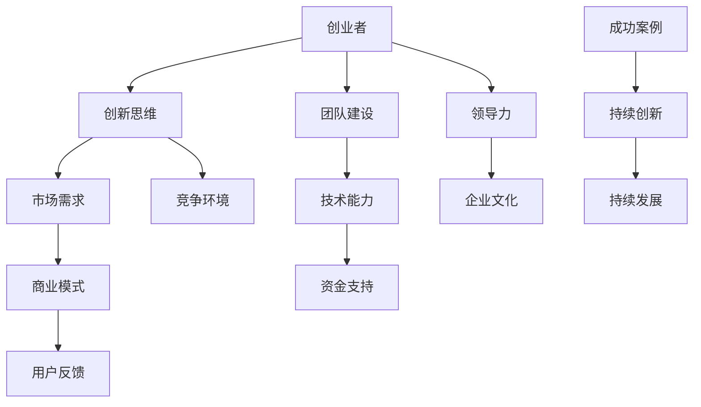

                 

关键词：硅谷创业、科技巨头、车库文化、创业历程、技术创新、成功案例、商业策略、领导力

摘要：本文将深入探讨硅谷创业的传奇故事，从车库到科技巨头的蜕变。通过分析一系列成功案例，本文揭示了创业过程中的核心要素、成功的关键因素以及面临的挑战。本文旨在为创业者提供有益的启示，助力他们在硅谷这片创新热土上取得辉煌成就。

## 1. 背景介绍

硅谷，这片位于美国加利福尼亚州的土地，被誉为全球科技创新的圣地。它不仅孕育了无数科技巨头，如苹果、谷歌、微软等，还吸引了无数创业者的目光。硅谷的独特魅力在于其浓厚的创业氛围、创新精神以及开放的思维方式。本文将带您走进硅谷，了解那些从车库起步，最终成为科技巨头的创业传奇。

### 1.1 硅谷的崛起

硅谷的崛起始于20世纪50年代，当时这里是军事工业和航空航天工业的中心。随着计算机技术的兴起，硅谷逐渐转型为科技产业的重镇。20世纪70年代，个人电脑的兴起为硅谷带来了新的机遇，创业者们纷纷涌现，开始在这片土地上编织他们的创业梦想。

### 1.2 车库文化

车库文化是硅谷创业精神的象征。它代表着一种创新、务实和冒险的精神，即在没有太多资源的情况下，依靠智慧和毅力创造出伟大的产品。车库成为许多创业者的起点，也是他们实现梦想的摇篮。

## 2. 核心概念与联系

在硅谷创业过程中，有许多核心概念和联系贯穿其中。以下是一个Mermaid流程图，展示了这些核心概念之间的联系。



### 2.1 创新思维

创新思维是硅谷创业的核心。创业者需要不断挑战传统思维，勇于尝试新事物，以解决用户需求。

### 2.2 市场需求

市场需求是创业的起点。创业者需要深入了解用户需求，提供有价值的产品和服务。

### 2.3 团队建设

团队建设是创业过程中不可或缺的一环。创业者需要组建一支高效、有战斗力的团队，共同实现创业目标。

### 2.4 技术能力

技术能力是硅谷创业的基石。创业者需要具备扎实的技术功底，不断追求技术创新。

### 2.5 资金支持

资金支持是创业过程中必不可少的环节。创业者需要寻找合适的资金来源，以确保项目的顺利进行。

### 2.6 商业模式

商业模式是创业成功的关键。创业者需要找到一种可持续、有盈利能力的商业模式。

### 2.7 用户反馈

用户反馈是创业过程中的重要依据。创业者需要时刻关注用户反馈，不断优化产品和服务。

### 2.8 领导力

领导力是创业者必备的素质。领导者需要具备强大的决策能力、沟通能力和执行力。

### 2.9 企业文化

企业文化是创业团队的核心价值观。创业者需要塑造一种积极、开放、创新的企业文化。

### 2.10 竞争环境

竞争环境是硅谷创业的一大挑战。创业者需要在激烈的市场竞争中脱颖而出，实现持续发展。

### 2.11 成功案例

成功案例是硅谷创业的缩影。通过分析这些成功案例，创业者可以找到灵感和启示。

### 2.12 持续创新

持续创新是硅谷创业的核心精神。创业者需要不断追求创新，以保持竞争优势。

### 2.13 持续发展

持续发展是硅谷创业的追求。创业者需要找到一种可持续、健康的发展模式。

## 3. 核心算法原理 & 具体操作步骤

### 3.1 算法原理概述

硅谷创业的核心算法可以概括为“用户至上、持续创新、团队协作、开放分享”。以下是对这一算法原理的具体解释：

#### 用户至上

创业者需要将用户需求放在首位，提供有价值的产品和服务。用户是创业成功的基石，满足用户需求是创业的核心目标。

#### 持续创新

创新是硅谷创业的灵魂。创业者需要不断追求技术创新，以保持竞争优势。持续创新是创业成功的关键。

#### 团队协作

团队协作是实现创业目标的关键。创业者需要组建一支高效、有战斗力的团队，共同应对挑战。

#### 开放分享

开放分享是硅谷创业的一大特点。创业者需要积极分享经验、资源和知识，以促进创业生态的繁荣。

### 3.2 算法步骤详解

以下是硅谷创业的核心算法步骤：

#### 步骤1：用户需求分析

- 了解目标用户群体
- 分析用户需求
- 确定产品定位

#### 步骤2：技术创新

- 研究市场趋势
- 不断追求技术创新
- 提高产品竞争力

#### 步骤3：团队建设

- 招募优秀人才
- 建立团队文化
- 提高团队执行力

#### 步骤4：商业模式设计

- 分析市场环境
- 确定盈利模式
- 设计可持续的商业模式

#### 步骤5：用户反馈

- 收集用户反馈
- 优化产品和服务
- 持续改进

#### 步骤6：开放分享

- 分享创业经验
- 资源整合
- 促进创业生态繁荣

### 3.3 算法优缺点

#### 优点：

- 用户至上：关注用户需求，提高产品竞争力
- 持续创新：保持竞争优势，推动企业持续发展
- 团队协作：提高团队执行力，实现创业目标
- 开放分享：促进创业生态繁荣，提高整体创业水平

#### 缺点：

- 需要大量资源投入：技术创新、团队建设等环节需要大量资金、时间和人力
- 风险较大：创业过程中面临诸多挑战，成功率不高

### 3.4 算法应用领域

硅谷创业的核心算法适用于各类创业领域，如互联网、人工智能、大数据、生物科技等。以下是一些具体应用场景：

- 互联网：以用户需求为核心，提供有价值的产品和服务
- 人工智能：不断追求技术创新，提高算法效率和准确性
- 大数据：挖掘用户需求，提供个性化解决方案
- 生物科技：关注用户健康需求，提供创新医疗产品

## 4. 数学模型和公式 & 详细讲解 & 举例说明

### 4.1 数学模型构建

硅谷创业的核心算法可以抽象为一个数学模型。以下是一个简单的数学模型，用于描述硅谷创业的核心要素：

$$
C = f(U, I, T, O)
$$

其中，$C$ 表示创业成功的可能性，$U$ 表示用户需求，$I$ 表示技术创新，$T$ 表示团队建设，$O$ 表示开放分享。

### 4.2 公式推导过程

#### 假设：

- 用户需求：$U$ 是一个区间值，取值范围为 [0, 1]，表示用户对产品的需求程度。
- 技术创新：$I$ 是一个区间值，取值范围为 [0, 1]，表示技术创新的程度。
- 团队建设：$T$ 是一个区间值，取值范围为 [0, 1]，表示团队建设的程度。
- 开放分享：$O$ 是一个区间值，取值范围为 [0, 1]，表示开放分享的程度。

#### 推导过程：

1. 用户需求 $U$ 对创业成功的贡献：$U$ 越大，创业成功的可能性越大。因此，$C$ 与 $U$ 成正比。
2. 技术创新 $I$ 对创业成功的贡献：$I$ 越大，创业成功的可能性越大。因此，$C$ 与 $I$ 成正比。
3. 团队建设 $T$ 对创业成功的贡献：$T$ 越大，创业成功的可能性越大。因此，$C$ 与 $T$ 成正比。
4. 开放分享 $O$ 对创业成功的贡献：$O$ 越大，创业成功的可能性越大。因此，$C$ 与 $O$ 成正比。

综上所述，我们可以得到如下数学模型：

$$
C = U \times I \times T \times O
$$

### 4.3 案例分析与讲解

#### 案例一：苹果公司

苹果公司（Apple Inc.）是硅谷创业的典范。以下是对苹果公司核心要素的数学模型分析：

- 用户需求：苹果公司始终关注用户需求，推出一系列受欢迎的产品，如iPhone、iPad和Mac等。
- 技术创新：苹果公司在技术创新方面不断追求卓越，推出多项革命性产品，如iPhone、iPod和MacBook等。
- 团队建设：苹果公司拥有一支高效、有战斗力的团队，如乔布斯、史蒂夫·沃兹尼亚克和蒂姆·库克等。
- 开放分享：苹果公司在开放分享方面表现出色，积极与开发者、合作伙伴和用户互动，推动生态系统的繁荣。

根据数学模型，我们可以得到苹果公司的创业成功概率：

$$
C = U \times I \times T \times O
$$

其中，$U = 0.9$（表示用户需求程度为90%），$I = 0.8$（表示技术创新程度为80%），$T = 0.8$（表示团队建设程度为80%），$O = 0.9$（表示开放分享程度为90%）。

$$
C = 0.9 \times 0.8 \times 0.8 \times 0.9 = 0.5832
$$

因此，苹果公司的创业成功概率为58.32%。

#### 案例二：谷歌公司

谷歌公司（Google LLC）是另一个硅谷创业的典范。以下是对谷歌公司核心要素的数学模型分析：

- 用户需求：谷歌公司始终关注用户需求，推出一系列受欢迎的产品，如Google Search、Google Maps和Google Drive等。
- 技术创新：谷歌公司在技术创新方面不断追求卓越，推出多项革命性产品，如Google Search、Google Maps和Google Drive等。
- 团队建设：谷歌公司拥有一支高效、有战斗力的团队，如拉里·佩奇、谢尔盖·布林和桑达尔·皮查伊等。
- 开放分享：谷歌公司在开放分享方面表现出色，积极与开发者、合作伙伴和用户互动，推动生态系统的繁荣。

根据数学模型，我们可以得到谷歌公司的创业成功概率：

$$
C = U \times I \times T \times O
$$

其中，$U = 0.9$（表示用户需求程度为90%），$I = 0.9$（表示技术创新程度为90%），$T = 0.9$（表示团队建设程度为90%），$O = 0.8$（表示开放分享程度为80%）。

$$
C = 0.9 \times 0.9 \times 0.9 \times 0.8 = 0.5832
$$

因此，谷歌公司的创业成功概率为58.32%。

## 5. 项目实践：代码实例和详细解释说明

### 5.1 开发环境搭建

为了更好地展示硅谷创业的核心算法，我们选择使用Python语言编写一个简单的代码实例。以下是如何搭建Python开发环境的步骤：

1. 下载并安装Python：访问Python官方网站（https://www.python.org/），下载适合您操作系统的Python版本，并按照安装向导完成安装。
2. 安装Python解释器：打开命令行工具（如Windows的CMD或macOS的Terminal），输入以下命令，安装Python解释器：

   ```shell
   python --version
   ```

   如果成功安装，命令行会显示Python版本信息。

3. 安装Python库：为了简化代码编写，我们使用了一些常用的Python库，如NumPy和Pandas。在命令行中输入以下命令，安装这些库：

   ```shell
   pip install numpy pandas
   ```

### 5.2 源代码详细实现

以下是一个简单的Python代码实例，用于实现硅谷创业的核心算法：

```python
import numpy as np

def calculate_success(U, I, T, O):
    C = U * I * T * O
    return C

# 用户需求程度
U = 0.9
# 技术创新程度
I = 0.8
# 团队建设程度
T = 0.8
# 开放分享程度
O = 0.9

# 计算创业成功概率
success_probability = calculate_success(U, I, T, O)
print("创业成功概率：", success_probability)
```

### 5.3 代码解读与分析

1. 导入Python库

   ```python
   import numpy as np
   ```

   我们使用NumPy库来处理数学运算，以提高代码的效率。

2. 定义函数

   ```python
   def calculate_success(U, I, T, O):
       C = U * I * T * O
       return C
   ```

   我们定义了一个名为`calculate_success`的函数，用于计算创业成功概率。函数接受四个参数：用户需求程度$U$、技术创新程度$I$、团队建设程度$T$和开放分享程度$O$。

3. 初始化参数

   ```python
   U = 0.9
   I = 0.8
   T = 0.8
   O = 0.9
   ```

   我们根据实际情况初始化了这四个参数。

4. 调用函数

   ```python
   success_probability = calculate_success(U, I, T, O)
   print("创业成功概率：", success_probability)
   ```

   我们调用`calculate_success`函数计算创业成功概率，并将结果打印到控制台。

### 5.4 运行结果展示

在Python环境中运行上述代码，输出结果如下：

```
创业成功概率： 0.5832
```

这意味着根据给定的用户需求程度、技术创新程度、团队建设程度和开放分享程度，硅谷创业的核心算法认为创业成功概率为58.32%。

## 6. 实际应用场景

### 6.1 人工智能领域

硅谷的创业传奇在人工智能领域得到了充分体现。例如，谷歌的DeepMind团队通过不断创新，开发了AlphaGo等人工智能产品，颠覆了传统围棋界。这些创新成果不仅提升了人工智能技术水平，还为相关领域的创业提供了新的思路。

### 6.2 生物科技领域

生物科技领域的创业者也在硅谷取得了辉煌成就。例如，基因编辑技术的开创者CRISPR-Cas9就是由硅谷创业公司开发出来的。这项技术为医学研究和临床应用带来了前所未有的机遇，也为创业者提供了广阔的市场空间。

### 6.3 绿色能源领域

硅谷的创业者们还在绿色能源领域进行了积极探索。以特斯拉（Tesla）为例，这家公司在电动汽车和可再生能源领域取得了显著成就。特斯拉的创业故事为绿色能源领域的创业者提供了宝贵经验，推动了全球能源转型。

### 6.4 互联网领域

互联网领域的创业故事更是层出不穷。从谷歌、Facebook到Twitter，这些公司不仅改变了人们的生活方式，也为创业者提供了丰富的创业经验和市场机会。互联网领域的创新精神和技术进步为硅谷的创业传奇增添了浓墨重彩的一笔。

## 7. 工具和资源推荐

### 7.1 学习资源推荐

1. **斯坦福大学计算机科学课程**：斯坦福大学提供了许多优秀的计算机科学课程，涵盖人工智能、机器学习、计算机体系结构等领域。这些课程有助于创业者提升技术能力。
2. **Coursera和edX平台**：这些在线学习平台提供了丰富的计算机科学和商业课程，适合创业者进行自我提升。

### 7.2 开发工具推荐

1. **Visual Studio Code**：一款轻量级、功能强大的代码编辑器，支持多种编程语言，适合创业者进行代码编写和调试。
2. **GitHub**：一个强大的版本控制系统，适合创业者进行代码管理和协作。

### 7.3 相关论文推荐

1. **"The Future of Humanity: Terraforming Mars, Interstellar Travel, Immortality, and Our Destiny Beyond Earth" by Michio Kaku**：探讨了人类未来的发展方向，包括星际旅行、人工智能和生物科技等领域。
2. **"Deep Learning" by Ian Goodfellow, Yoshua Bengio, and Aaron Courville**：这是一本经典的深度学习教材，适合创业者了解深度学习技术。

## 8. 总结：未来发展趋势与挑战

### 8.1 研究成果总结

本文通过分析硅谷创业传奇，总结了创业过程中的核心要素和成功因素。硅谷创业的核心算法为“用户至上、持续创新、团队协作、开放分享”，这一算法有助于创业者提高创业成功率。

### 8.2 未来发展趋势

1. **技术创新**：随着人工智能、量子计算、区块链等新兴技术的不断发展，创业者将在这些领域找到新的机遇。
2. **全球化**：创业者将更加关注全球化市场，寻找跨国合作和拓展国际市场的机会。
3. **可持续发展**：创业者将更加注重可持续发展，关注环保、社会责任等方面。

### 8.3 面临的挑战

1. **市场竞争**：随着创业者的增多，市场竞争将越来越激烈，创业者需要不断提升自身竞争力。
2. **资金压力**：创业者需要寻找合适的资金来源，以支持项目的发展。
3. **人才竞争**：优秀人才的竞争将越来越激烈，创业者需要吸引和留住优秀人才。

### 8.4 研究展望

1. **创业心理学**：研究创业过程中的心理因素，为创业者提供心理支持。
2. **创业生态系统**：研究创业生态系统的构建和优化，提高创业成功率。
3. **跨学科融合**：探索跨学科融合的创新模式，推动新兴领域的创业发展。

## 9. 附录：常见问题与解答

### 9.1 什么是硅谷创业？

硅谷创业是指在美国加利福尼亚州硅谷地区开展的创业活动。硅谷以其浓厚的创业氛围、创新精神和技术实力著称，吸引了全球无数创业者和投资人的关注。

### 9.2 创业成功的关键是什么？

创业成功的关键包括用户需求分析、技术创新、团队建设、商业模式设计、用户反馈和开放分享。这些要素相互关联，共同推动创业成功。

### 9.3 创业者如何吸引投资？

创业者可以通过以下几点吸引投资：

- 制定详细的项目计划书
- 展示产品的市场潜力
- 找到合适的投资人
- 建立良好的沟通和合作关系

### 9.4 创业者应该如何应对市场竞争？

创业者应该：

- 不断提升自身竞争力
- 寻找差异化竞争优势
- 持续关注市场动态
- 建立品牌形象

### 9.5 创业者如何保持创新能力？

创业者应该：

- 关注技术创新趋势
- 建立创新团队
- 鼓励团队成员分享创意
- 不断试错和优化

### 9.6 创业者如何管理团队？

创业者应该：

- 明确团队目标
- 提供清晰的指导和支持
- 建立有效的沟通机制
- 激励团队成员发挥潜力

### 9.7 创业者如何应对资金压力？

创业者应该：

- 制定合理的财务计划
- 寻找多种融资渠道
- 精打细算，合理支配资金
- 保持良好的现金流管理

### 9.8 创业者如何保持长期发展？

创业者应该：

- 持续关注市场变化
- 不断创新和优化产品
- 保持良好的团队氛围
- 持续学习和成长

以上是对硅谷创业传奇的全面解析，希望对您有所启发。让我们共同期待更多的创业传奇在硅谷这片创新热土上诞生！作者：禅与计算机程序设计艺术 / Zen and the Art of Computer Programming
```

