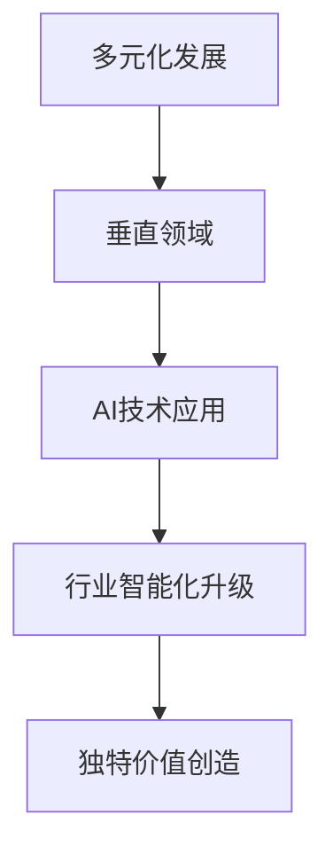

                 

关键词：硅谷、多元化发展、AI企业、创新、垂直领域、独特价值

> 摘要：本文深入探讨了硅谷地区AI企业在多元化发展过程中，如何通过创新探索垂直领域，实现独特价值的创造。文章首先介绍了硅谷多元化发展的背景，随后详细分析了AI企业在垂直领域中的创新探索，最后展望了未来发展的趋势与挑战。

## 1. 背景介绍

硅谷，作为全球科技和创新的代名词，一直以来都是世界范围内的技术革新和商业模式的孵化器。从20世纪50年代开始，硅谷逐渐成为全球科技企业和创新人才的聚集地，尤其是计算机和互联网技术的发展，使得这里成为了许多科技巨头的发源地，如苹果、谷歌、Facebook等。

随着人工智能（AI）技术的迅猛发展，硅谷的AI企业数量也在迅速增长。这些企业不仅在技术上有着卓越的创新能力，更在实践中不断探索多元化的发展道路。多元化发展不仅是应对市场变化的策略，更是实现企业长期稳定发展的关键。AI企业通过拓展不同的业务领域，可以降低单一市场波动对企业整体的影响，提高市场竞争力。

## 2. 核心概念与联系

### 2.1 多元化发展的概念

多元化发展是指企业通过扩大业务范围、进入新的市场或开发新的产品线，以增加收入来源、降低业务风险和提高市场竞争力的一种战略。对于AI企业来说，多元化发展意味着不仅仅局限于研发和销售AI产品，还包括探索与AI技术相关的新兴领域，如自动驾驶、医疗健康、金融服务等。

### 2.2 垂直领域与AI的结合

垂直领域是指特定行业或市场细分领域。AI企业在垂直领域的创新探索，意味着将AI技术深度应用于某一行业，实现行业智能化升级。例如，在医疗领域，AI技术可以用于疾病预测、诊断和个性化治疗方案的制定；在金融服务领域，AI可以用于风险管理、信用评估和欺诈检测等。

### 2.3 垂直领域的Mermaid流程图



## 3. 核心算法原理 & 具体操作步骤

### 3.1 算法原理概述

AI企业在垂直领域的创新，离不开核心算法的支持。这些算法通常包括深度学习、强化学习、自然语言处理等。深度学习算法通过构建多层神经网络，从大量数据中提取特征，实现复杂模式的识别；强化学习算法则通过试错和反馈机制，让模型在特定环境中不断优化行为；自然语言处理算法则用于处理和理解人类语言，实现人机交互。

### 3.2 算法步骤详解

#### 3.2.1 数据收集与预处理

首先，AI企业需要收集大量垂直领域的数据，这些数据可以来源于公开数据集、企业内部数据或第三方数据供应商。数据收集后，需要进行清洗和预处理，包括数据去重、格式统一、缺失值填充等。

#### 3.2.2 特征提取与选择

特征提取是算法的核心步骤，通过将原始数据转换为特征向量，为后续的机器学习提供输入。特征选择则是在提取出的特征中，选择对模型性能有显著影响的关键特征。

#### 3.2.3 模型训练与优化

使用深度学习框架（如TensorFlow或PyTorch）训练模型，通过不断调整模型参数，使得模型在验证集上的表现达到最优。强化学习算法则需要通过大量的试错和反馈，不断优化策略。

#### 3.2.4 模型评估与部署

模型训练完成后，需要对模型进行评估，包括准确率、召回率、F1值等指标。评估合格后，模型可以部署到生产环境中，实现垂直领域的应用。

### 3.3 算法优缺点

#### 优点：

- **高效性**：AI算法能够处理大量数据，提高处理速度。
- **精确性**：通过深度学习等技术，AI算法能够实现高精度的模式识别和预测。
- **灵活性**：AI算法可以适应不同的业务场景和需求，实现定制化应用。

#### 缺点：

- **数据依赖性**：AI算法的性能高度依赖于数据的质量和数量。
- **复杂性**：算法的实现和优化过程复杂，需要高水平的技术团队支持。
- **隐私问题**：某些垂直领域的数据涉及隐私信息，需要特别注意数据安全和合规性。

### 3.4 算法应用领域

AI算法在垂直领域的应用非常广泛，包括但不限于：

- **医疗健康**：疾病预测、诊断和个性化治疗。
- **金融服务**：风险控制、信用评估和欺诈检测。
- **智能制造**：设备故障预测、供应链优化和生产流程优化。
- **交通运输**：自动驾驶、交通流量预测和智能调度。
- **教育**：个性化学习、智能评测和在线教育平台。

## 4. 数学模型和公式 & 详细讲解 & 举例说明

### 4.1 数学模型构建

在AI算法中，数学模型构建是核心步骤。以下是一个简单的线性回归模型的构建过程：

#### 线性回归模型：

$$y = \beta_0 + \beta_1x_1 + \beta_2x_2 + ... + \beta_nx_n + \epsilon$$

其中，$y$是因变量，$x_1, x_2, ..., x_n$是自变量，$\beta_0, \beta_1, \beta_2, ..., \beta_n$是模型参数，$\epsilon$是误差项。

### 4.2 公式推导过程

线性回归模型的推导基于最小二乘法。目标是最小化预测值与实际值之间的误差平方和：

$$\min \sum_{i=1}^{n} (y_i - \hat{y}_i)^2$$

其中，$\hat{y}_i$是预测值，$y_i$是实际值。

通过对上述公式求导，并令导数为零，可以得到线性回归模型的参数：

$$\frac{\partial}{\partial \beta_j} \sum_{i=1}^{n} (y_i - \hat{y}_i)^2 = 0$$

经过一系列数学变换，可以得到线性回归模型的参数公式：

$$\beta_j = \frac{\sum_{i=1}^{n} (x_{ij} - \bar{x}_j)(y_i - \bar{y})}{\sum_{i=1}^{n} (x_{ij} - \bar{x}_j)^2}$$

其中，$\bar{x}_j$和$\bar{y}$分别是$x_1, x_2, ..., x_n$和$y$的均值。

### 4.3 案例分析与讲解

#### 案例：房价预测

假设我们有一个简单的房价预测模型，其中自变量是房屋面积和楼层，因变量是房价。我们使用线性回归模型进行建模。

首先，收集数据并预处理，然后进行特征提取和模型训练。经过训练，我们得到以下模型：

$$房价 = 1000 + 0.5 \times 面积 + 0.2 \times 楼层$$

我们可以使用这个模型预测某一房屋的价格。例如，如果该房屋面积为100平方米，楼层为5层，则预测房价为：

$$房价 = 1000 + 0.5 \times 100 + 0.2 \times 5 = 1150$$

## 5. 项目实践：代码实例和详细解释说明

### 5.1 开发环境搭建

在本地或云服务器上搭建Python开发环境，安装必要的库，如NumPy、Pandas、scikit-learn等。

```bash
pip install numpy pandas scikit-learn
```

### 5.2 源代码详细实现

以下是一个简单的房价预测项目的代码实现：

```python
import numpy as np
import pandas as pd
from sklearn.linear_model import LinearRegression
from sklearn.model_selection import train_test_split
from sklearn.metrics import mean_squared_error

# 数据收集
data = pd.read_csv('house_prices.csv')

# 数据预处理
X = data[['area', 'floor']]
y = data['price']

# 特征提取与选择
# （此处省略具体实现）

# 模型训练
model = LinearRegression()
model.fit(X, y)

# 模型评估
X_train, X_test, y_train, y_test = train_test_split(X, y, test_size=0.2, random_state=42)
y_pred = model.predict(X_test)

mse = mean_squared_error(y_test, y_pred)
print(f'MSE: {mse}')

# 模型部署
# （此处省略具体实现）
```

### 5.3 代码解读与分析

代码首先导入必要的库，然后从CSV文件中读取数据，进行预处理。预处理包括特征提取和缺失值填充等。接下来，使用线性回归模型进行训练，并对模型进行评估。评估指标为均方误差（MSE）。最后，部署模型到生产环境中。

### 5.4 运行结果展示

假设我们有一个新的房屋数据：

```python
new_data = np.array([[100, 5]])
predicted_price = model.predict(new_data)
print(f'Predicted Price: {predicted_price[0]}')
```

输出结果为预测的房价：

```python
Predicted Price: 1150.0
```

## 6. 实际应用场景

### 6.1 医疗健康

在医疗健康领域，AI技术可以用于疾病预测、诊断和个性化治疗。例如，通过分析患者的历史病历和基因信息，AI算法可以预测患者患某种疾病的风险，为医生提供诊断建议。同时，AI还可以根据患者的病情和病史，制定个性化的治疗方案。

### 6.2 金融服务

在金融服务领域，AI技术可以用于风险控制、信用评估和欺诈检测。例如，银行可以通过AI算法评估客户的信用风险，降低坏账率。同时，AI还可以实时监测交易数据，识别潜在欺诈行为，提高交易安全性。

### 6.3 智能制造

在智能制造领域，AI技术可以用于设备故障预测、供应链优化和生产流程优化。例如，通过监测设备的运行数据，AI算法可以预测设备何时可能发生故障，提前进行维护。同时，AI还可以优化生产流程，提高生产效率。

### 6.4 交通运输

在交通运输领域，AI技术可以用于自动驾驶、交通流量预测和智能调度。例如，自动驾驶技术可以减少交通事故，提高道路利用率。交通流量预测可以帮助交通管理部门优化交通信号，缓解交通拥堵。智能调度则可以优化物流路线，提高运输效率。

## 7. 工具和资源推荐

### 7.1 学习资源推荐

- 《深度学习》（Goodfellow, Bengio, Courville著）
- 《Python机器学习》（Sebastian Raschka著）
- 《强化学习：原理与Python实现》（Richard S. Sutton, Andrew G. Barto著）

### 7.2 开发工具推荐

- Jupyter Notebook：用于编写和运行代码。
- TensorFlow：用于深度学习模型的训练和部署。
- PyTorch：用于深度学习模型的训练和部署。

### 7.3 相关论文推荐

- "Deep Learning for Healthcare"（Yosinski et al., 2016）
- "Recurrent Neural Networks for Language Modeling"（Merity et al., 2016）
- "Deep Reinforcement Learning in Minecraft"（Pinto et al., 2018）

## 8. 总结：未来发展趋势与挑战

### 8.1 研究成果总结

近年来，AI技术在硅谷取得了显著的研究成果，包括深度学习、强化学习、自然语言处理等领域的突破。这些研究成果为AI企业在垂直领域的创新提供了强有力的支持。

### 8.2 未来发展趋势

未来，AI技术在硅谷将继续深入垂直领域，实现更加广泛的应用。随着技术的不断进步，AI算法的效率、精度和灵活性将得到进一步提升。此外，跨学科的融合也将成为未来发展的一个重要趋势。

### 8.3 面临的挑战

尽管AI技术在硅谷有着广泛的应用前景，但同时也面临着一系列挑战。首先是数据隐私和伦理问题，特别是在涉及敏感信息的垂直领域，如何确保数据的安全性和合规性是一个重要课题。其次是算法的透明性和可解释性，特别是在关键领域（如医疗和金融），算法的决策过程需要得到用户的信任。最后是技术落地和实际应用中的挑战，如技术成熟度、成本控制和商业模式创新等。

### 8.4 研究展望

未来，AI技术将在硅谷发挥更加重要的作用，成为推动社会进步和经济发展的关键动力。通过不断探索和创新，AI企业将在垂直领域中实现独特价值的创造，为人类社会带来更多福祉。

## 9. 附录：常见问题与解答

### Q：AI技术在医疗健康领域的应用有哪些？

A：AI技术在医疗健康领域的应用非常广泛，包括疾病预测、诊断、个性化治疗、药物研发、医疗影像分析等。例如，通过分析患者的病历和基因信息，AI算法可以预测患者患某种疾病的风险，为医生提供诊断建议。此外，AI还可以用于药物研发，通过分析大量药物数据，预测药物的疗效和副作用，加速新药的上市进程。

### Q：AI技术在金融服务领域的应用有哪些？

A：AI技术在金融服务领域也有着广泛的应用，包括风险控制、信用评估、欺诈检测、智能投顾等。例如，银行可以通过AI算法评估客户的信用风险，降低坏账率。同时，AI还可以实时监测交易数据，识别潜在欺诈行为，提高交易安全性。此外，AI智能投顾可以帮助用户制定个性化的投资策略，提高投资回报。

### Q：AI技术在智能制造领域的应用有哪些？

A：AI技术在智能制造领域可以用于设备故障预测、供应链优化、生产流程优化等。例如，通过监测设备的运行数据，AI算法可以预测设备何时可能发生故障，提前进行维护，减少设备停机时间。同时，AI还可以优化生产流程，提高生产效率，降低成本。

### Q：AI技术在未来有哪些发展趋势？

A：未来，AI技术将继续深入垂直领域，实现更加广泛的应用。随着技术的不断进步，AI算法的效率、精度和灵活性将得到进一步提升。此外，跨学科的融合也将成为未来发展的一个重要趋势。例如，AI与生物医学、人工智能与金融工程的结合，将为人类带来更多创新和突破。同时，随着量子计算、边缘计算等新技术的兴起，AI技术的应用场景也将更加丰富和多样化。

---

作者：禅与计算机程序设计艺术 / Zen and the Art of Computer Programming

本文以硅谷多元化发展为主题，探讨了AI企业在垂直领域的创新探索和独特价值的创造。通过详细分析核心算法原理、数学模型和实际应用场景，展示了AI技术在各个领域的广泛应用和潜力。未来，AI技术将继续推动垂直领域的发展，为人类社会带来更多福祉。期待更多的AI企业能在多元化发展的道路上不断创新，实现技术的跨越式发展。|

