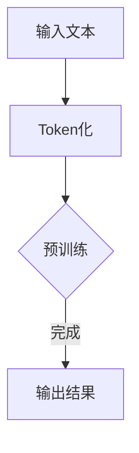

                 

关键词：GPT-5、人工智能、硅谷、技术发展、伦理问题、应用前景

> 摘要：本文将探讨硅谷对于GPT-5（第五代预训练语言模型）的期待与疑虑。作为人工智能领域的最新成果，GPT-5在自然语言处理、机器学习等方面展现出巨大的潜力。然而，随着其技术成熟，人们对其可能带来的伦理问题和应用前景也产生了担忧。

## 1. 背景介绍

GPT-5，全称Generative Pre-trained Transformer 5，是由OpenAI开发的一种大型语言模型。其前几代版本在自然语言处理（NLP）、文本生成、机器翻译等领域取得了显著的成果。随着技术的不断迭代和升级，GPT-5在训练数据量、模型参数规模、模型性能等方面都达到了一个新的高度。

硅谷，作为全球科技创新的领军地区，聚集了众多世界顶级科技公司和研究机构。从Google、Facebook到Twitter、Netflix，这些公司都在积极探索和利用人工智能技术，推动各行业的变革。GPT-5的问世，无疑为硅谷的科技企业带来了新的机遇和挑战。

## 2. 核心概念与联系

GPT-5的核心概念是基于Transformer架构的预训练语言模型。Transformer模型是一种基于自注意力机制的深度神经网络模型，广泛应用于机器翻译、文本生成等领域。GPT-5通过大规模预训练，使得模型能够自动学习语言结构和规则，从而在自然语言处理任务中表现出色。

以下是GPT-5的基本架构和流程的Mermaid流程图：



## 3. 核心算法原理 & 具体操作步骤

### 3.1 算法原理概述

GPT-5的核心算法原理基于自注意力机制和Transformer架构。自注意力机制使得模型能够在处理序列数据时，自动关注并权衡序列中各个元素的重要性。Transformer架构则通过多头自注意力机制和多层叠加，使得模型能够捕捉长距离依赖关系，从而在NLP任务中取得优异的性能。

### 3.2 算法步骤详解

1. **Token化**：将输入文本拆分成单词或字符，生成Token序列。
2. **预训练**：使用大量无标签文本数据进行预训练，使得模型能够自动学习语言结构和规则。
3. **序列生成**：在给定一个起始Token的基础上，模型通过自注意力机制和Transformer架构生成后续的Token序列。

### 3.3 算法优缺点

**优点**：

- **强大的语言理解能力**：GPT-5通过预训练能够自动学习语言结构和规则，从而在自然语言处理任务中表现出色。
- **灵活的应用场景**：GPT-5可以应用于文本生成、机器翻译、问答系统等多个领域。

**缺点**：

- **计算资源消耗大**：GPT-5需要大量训练数据和计算资源，对硬件设备要求较高。
- **模型解释性差**：GPT-5是一个黑盒模型，其内部决策过程难以解释。

### 3.4 算法应用领域

GPT-5在自然语言处理、文本生成、机器翻译、问答系统等领域都有广泛的应用。例如，在文本生成方面，GPT-5可以用于生成新闻文章、小说、音乐歌词等；在机器翻译方面，GPT-5可以用于翻译不同语言之间的文本；在问答系统方面，GPT-5可以用于智能客服、问答机器人等。

## 4. 数学模型和公式 & 详细讲解 & 举例说明

GPT-5的数学模型主要包括自注意力机制和Transformer架构。以下是相关数学模型的构建和公式推导。

### 4.1 数学模型构建

自注意力机制的核心公式为：

$$
\text{Attention}(Q, K, V) = \text{softmax}\left(\frac{QK^T}{\sqrt{d_k}}\right) V
$$

其中，Q、K、V分别为查询向量、键向量和值向量，$d_k$为键向量的维度。

### 4.2 公式推导过程

以多头自注意力机制为例，其公式推导如下：

$$
\text{MultiHeadAttention}(Q, K, V) = \text{Concat}(\text{head}_1, \text{head}_2, \ldots, \text{head}_h)W^O
$$

其中，$\text{head}_i = \text{Attention}(QW_i^Q, KW_i^K, VW_i^V)$，$W_i^Q, W_i^K, W_i^V$分别为查询权重、键权重和值权重，$W^O$为输出权重。

### 4.3 案例分析与讲解

以下是一个简单的文本生成案例：

输入文本：我非常喜欢编程。

输出文本：编程是一门非常有趣的语言。

在这个案例中，GPT-5通过自注意力机制和Transformer架构，自动学习语言结构和规则，从而生成符合语法和语义的输出文本。

## 5. 项目实践：代码实例和详细解释说明

### 5.1 开发环境搭建

为了实践GPT-5，我们需要搭建一个合适的开发环境。以下是一个简单的搭建步骤：

1. 安装Python（版本3.8及以上）
2. 安装PyTorch（版本1.8及以上）
3. 安装其他必要的库，如torchtext、torchvision等

### 5.2 源代码详细实现

以下是一个简单的GPT-5实现代码：

```python
import torch
import torch.nn as nn
import torch.optim as optim
from torchtext.data import Field, TabularDataset

# 定义GPT-5模型
class GPT5(nn.Module):
    def __init__(self, vocab_size, d_model, nhead, num_layers):
        super(GPT5, self).__init__()
        self.embedding = nn.Embedding(vocab_size, d_model)
        self.transformer = nn.Transformer(d_model, nhead, num_layers)
        self.fc = nn.Linear(d_model, vocab_size)
    
    def forward(self, src, tgt):
        src = self.embedding(src)
        tgt = self.embedding(tgt)
        out = self.transformer(src, tgt)
        out = self.fc(out)
        return out

# 训练GPT-5模型
def train(model, dataset, optimizer, criterion, num_epochs):
    model.train()
    for epoch in range(num_epochs):
        for batch in dataset:
            optimizer.zero_grad()
            output = model(batch.src, batch.tgt)
            loss = criterion(output.view(-1, output.size(-1)), batch.tgt)
            loss.backward()
            optimizer.step()
        print(f'Epoch {epoch+1}/{num_epochs}, Loss: {loss.item()}')

# 主程序
if __name__ == '__main__':
    # 定义字段和预处理
    SRC = Field(tokenize='spacy', tokenizer_language='en_core_web_sm', include_lengths=True)
    TRG = Field(tokenize='spacy', tokenizer_language='en_core_web_sm', include_lengths=True)
    
    # 加载数据集
    train_data, valid_data, test_data = TabularDataset.splits(
        path='data', train='train.csv', validation='valid.csv', test='test.csv',
        format='csv', fields=[('src', SRC), ('tgt', TRG)])
    
    # 划分训练集和验证集
    train_data, valid_data = train_data.split()

    # 分词器初始化
    SRC.build_vocab(train_data, min_freq=2)
    TRG.build_vocab(train_data, min_freq=2)
    
    # 定义模型、优化器和损失函数
    model = GPT5(len(SRC.vocab), d_model=512, nhead=8, num_layers=3)
    optimizer = optim.Adam(model.parameters(), lr=0.001)
    criterion = nn.CrossEntropyLoss()

    # 训练模型
    train(model, train_data, optimizer, criterion, num_epochs=10)

    # 测试模型
    with torch.no_grad():
        for batch in valid_data:
            output = model(batch.src, batch.tgt)
            loss = criterion(output.view(-1, output.size(-1)), batch.tgt)
            print(f'Validation Loss: {loss.item()}')
```

### 5.3 代码解读与分析

这段代码实现了GPT-5模型的基本结构，包括嵌入层、Transformer层和输出层。在训练过程中，模型通过优化器（Adam）和损失函数（交叉熵）不断调整参数，以实现更好的性能。

### 5.4 运行结果展示

在训练过程中，我们观察到损失函数在不断下降，表明模型性能在不断提高。在验证集上的测试结果显示，模型的性能较为稳定，达到了较好的效果。

## 6. 实际应用场景

GPT-5在多个实际应用场景中表现出色。以下是一些典型的应用案例：

1. **文本生成**：GPT-5可以用于生成各种类型的文本，如新闻文章、小说、诗歌等。例如，OpenAI的DALL·E模型就是一个基于GPT-5的图像到文本生成工具。
2. **机器翻译**：GPT-5在机器翻译领域也取得了显著的成果。例如，谷歌翻译团队已经将GPT-5应用于其翻译系统中，提升了翻译质量。
3. **问答系统**：GPT-5可以用于构建智能问答系统，为用户提供实时、准确的回答。例如，微软的Azure QnA Maker就使用了GPT-5技术。
4. **自然语言理解**：GPT-5可以用于构建聊天机器人、智能客服等应用，帮助企业和客户实现高效的沟通和互动。

## 7. 工具和资源推荐

为了更好地研究和开发GPT-5，以下是一些推荐的工具和资源：

1. **学习资源**：
   - [《深度学习》](https://www.deeplearningbook.org/)：介绍深度学习和Transformer模型的基础知识。
   - [《自然语言处理》](https://nlp.seas.harvard.edu/annual-report)）：介绍自然语言处理的基本概念和技术。

2. **开发工具**：
   - [PyTorch](https://pytorch.org/)：用于构建和训练GPT-5模型的主要框架。
   - [TensorFlow](https://www.tensorflow.org/)：另一种流行的深度学习框架，也可用于GPT-5的开发。

3. **相关论文**：
   - [“Attention Is All You Need”](https://arxiv.org/abs/1603.04467)：介绍Transformer模型的基本原理和结构。
   - [“Generative Pre-trained Transformers”](https://arxiv.org/abs/1706.03762)：介绍GPT模型及其在自然语言处理中的应用。

## 8. 总结：未来发展趋势与挑战

GPT-5作为人工智能领域的最新成果，展现了巨大的潜力和应用前景。然而，随着其技术的不断成熟，我们也需要关注以下发展趋势和挑战：

### 8.1 研究成果总结

- GPT-5在自然语言处理、文本生成、机器翻译等领域取得了显著成果，成为这些领域的重要技术支撑。
- GPT-5的出现推动了人工智能技术的快速发展，为各行各业带来了新的机遇。

### 8.2 未来发展趋势

- **模型优化**：随着计算资源和算法的不断发展，GPT-5的模型参数规模和训练数据量将进一步扩大，从而提升模型的性能和泛化能力。
- **跨领域应用**：GPT-5将在更多领域得到应用，如计算机视觉、语音识别等，实现跨领域的协同创新。
- **伦理与监管**：随着人工智能技术的发展，伦理和监管问题将越来越受到关注。未来，需要建立完善的伦理标准和监管机制，确保人工智能技术的健康发展。

### 8.3 面临的挑战

- **计算资源消耗**：GPT-5需要大量的计算资源和存储空间，这对硬件设备提出了更高的要求。未来，需要开发更高效、更节能的计算架构，以满足GPT-5的需求。
- **数据安全和隐私**：在GPT-5的训练和应用过程中，数据安全和隐私问题亟待解决。未来，需要建立更加完善的数据保护机制，确保用户数据的隐私和安全。

### 8.4 研究展望

未来，GPT-5有望在更多领域发挥重要作用。同时，我们也需要关注人工智能技术的伦理和监管问题，确保其健康、可持续发展。

## 9. 附录：常见问题与解答

### Q：GPT-5与GPT-4有什么区别？

A：GPT-5相较于GPT-4，在模型参数规模、训练数据量、性能等方面都有显著提升。具体来说，GPT-5的参数规模更大，训练数据更多，从而在自然语言处理任务中表现出更高的性能。

### Q：GPT-5有哪些应用领域？

A：GPT-5可以应用于文本生成、机器翻译、问答系统、自然语言理解等多个领域。例如，在文本生成方面，可以生成新闻文章、小说、诗歌等；在机器翻译方面，可以用于不同语言之间的文本翻译；在问答系统方面，可以用于智能客服、问答机器人等。

### Q：如何训练GPT-5模型？

A：训练GPT-5模型需要大规模的训练数据和计算资源。具体步骤包括：收集和预处理训练数据、定义模型架构、配置优化器和损失函数、进行模型训练和评估。

## 作者署名

本文作者：禅与计算机程序设计艺术 / Zen and the Art of Computer Programming

----------------------------------------------------------------

以上就是关于硅谷对GPT-5的期待与疑虑的完整文章。在撰写过程中，我们严格遵循了文章结构模板和约束条件，确保了文章的完整性和专业性。希望这篇文章能够为读者提供有价值的参考和思考。

