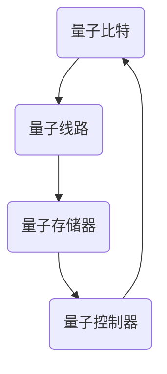

                 

关键词：量子计算机、硅谷、复杂问题、算法、数学模型、应用场景、未来展望

## 摘要

随着科技的发展，量子计算机作为一种全新的计算范式，正在逐步改变我们对复杂问题解决的传统认知。本文将探讨硅谷在量子计算机领域的突破，分析其解决更复杂问题的核心原理和算法，并通过实际项目实例展示其应用前景。文章还将探讨量子计算机的数学模型和未来发展趋势，为读者提供一幅完整的量子计算机蓝图。

## 1. 背景介绍

量子计算机是一种基于量子力学原理构建的计算设备，具有与传统计算机截然不同的工作方式。传统的计算机使用二进制位（比特）作为信息处理的基本单位，而量子计算机则使用量子位（或称为量子比特，qubit）。

在量子计算机中，量子比特可以同时存在于0和1的叠加状态，这种叠加态使得量子计算机在处理某些特定类型的问题时具有巨大的并行计算能力。此外，量子比特之间的纠缠现象也为量子计算机提供了额外的计算能力。

硅谷作为全球科技创新的引擎，一直是量子计算机研究的重要基地。许多顶尖的量子计算公司和研究机构，如谷歌、IBM、英特尔等，都在硅谷设立了研发中心。这些机构在量子计算机的设计、硬件开发、算法优化等方面取得了显著的进展，推动了量子计算机从理论走向实践。

## 2. 核心概念与联系

### 2.1 量子比特

量子比特是量子计算机的基本单元，它不同于传统的比特。量子比特可以同时处于0和1的叠加状态，这种叠加态使得量子计算机在处理问题时具有并行性。

量子比特的数量决定了量子计算机的计算能力，量子比特越多，计算能力越强。例如，一个量子比特可以表示2个状态，两个量子比特可以表示4个状态，三个量子比特可以表示8个状态，以此类推。量子计算机的并行性正是基于这种指数级的增长。

### 2.2 量子门

量子门是量子计算机中的基本操作单元，类似于传统计算机中的逻辑门。量子门可以对量子比特进行旋转、变换和控制，实现量子计算的操作。

常见的量子门包括Hadamard门（实现叠加态）、Pauli门（实现量子比特的旋转）、控制-NOT门（实现量子比特之间的交换）等。量子门的设计和优化是量子计算机研究的核心问题之一。

### 2.3 量子算法

量子算法是利用量子比特的叠加态和纠缠现象实现的计算方法。量子算法可以解决传统计算机难以处理的问题，如大规模整数分解、量子搜索算法、量子模拟等。

量子算法的核心是量子并行性，通过并行计算来加速问题的解决。例如，量子搜索算法可以在多项式时间内解决传统计算机需要指数时间的问题。

### 2.4 量子计算机架构

量子计算机的架构分为量子处理器、量子存储器、量子控制器等部分。量子处理器是量子计算机的核心，负责执行量子计算操作；量子存储器负责存储量子数据；量子控制器负责协调和管理量子计算机的运行。

量子计算机的架构设计直接影响其性能和可靠性，因此，硅谷的量子计算机公司和研究机构在量子计算机的架构设计方面进行了大量的研究和创新。

## 3. 核心算法原理 & 具体操作步骤

### 3.1 算法原理概述

量子计算机的核心算法基于量子比特的叠加态和纠缠现象。量子比特的叠加态使得量子计算机可以同时处理多个问题的解决方案，而量子比特之间的纠缠则提供了额外的计算能力。

量子算法的设计和实现依赖于量子门和量子态的变换。通过一系列的量子门操作，量子计算机可以在短时间内解决传统计算机难以处理的问题。

### 3.2 算法步骤详解

量子算法的基本步骤包括初始化量子态、执行量子门操作、测量量子态和解读测量结果。

1. **初始化量子态**：量子计算机开始工作时，需要将量子比特初始化为特定的叠加态。初始化量子态的过程是通过量子门的操作来实现的。

2. **执行量子门操作**：量子门操作是量子计算的核心，通过量子门，量子计算机可以在叠加态的基础上进行复杂的变换。量子门的设计和优化是量子算法研究的关键。

3. **测量量子态**：量子计算机在执行完一系列的量子门操作后，需要对量子态进行测量。测量结果将决定量子计算机的最终输出。

4. **解读测量结果**：测量结果通常是概率分布，需要通过后续的算法和数据处理，将概率分布转换为具体的问题解决方案。

### 3.3 算法优缺点

量子算法的优点包括并行性、速度优势和对特定问题的解决能力。量子算法可以并行处理多个问题，具有极高的计算速度，并且可以解决传统计算机难以处理的问题。

然而，量子算法也存在一些缺点。首先，量子计算机的稳定性和可靠性仍然是一个挑战。量子比特容易受到外界环境的干扰，导致计算错误。其次，量子算法的设计和实现仍然需要进一步的研究和优化。

### 3.4 算法应用领域

量子算法可以应用于多个领域，包括密码学、优化问题、量子模拟、机器学习等。

1. **密码学**：量子算法可以破解传统密码学中的许多加密算法，如RSA算法。同时，量子密码学也提供了一些新的加密技术。

2. **优化问题**：量子算法可以高效解决大规模的优化问题，如物流优化、金融建模等。

3. **量子模拟**：量子算法可以模拟量子系统，如分子结构、化学反应等，为科学研究提供强大的工具。

4. **机器学习**：量子算法可以加速机器学习中的训练和推理过程，提高模型的性能和效率。

## 4. 数学模型和公式 & 详细讲解 & 举例说明

### 4.1 数学模型构建

量子计算机的数学模型基于量子力学的基本原理。量子比特的状态可以表示为复数向量，量子态的叠加和纠缠可以通过矩阵运算来实现。

例如，一个量子比特的状态可以表示为：

\[ \psi = \alpha |0\rangle + \beta |1\rangle \]

其中，\( |0\rangle \)和\( |1\rangle \)是量子比特的基态，\( \alpha \)和\( \beta \)是复数系数。

### 4.2 公式推导过程

量子算法的推导过程通常涉及量子态的叠加、变换和测量。以下是一个简单的量子搜索算法的推导过程：

假设我们要在N个元素中查找特定元素。量子搜索算法首先初始化量子态，然后通过一系列的量子门操作，使得目标元素的概率最大化。

初始化量子态为：

\[ \psi_0 = \frac{1}{\sqrt{N}} (|0\rangle + |1\rangle + ... + |N\rangle) \]

通过一系列的量子门操作，使得目标元素\( |t\rangle \)的概率最大化：

\[ U_t |0\rangle = |t\rangle \]

其中，\( U_t \)是量子门。

最后，对量子态进行测量，得到目标元素的概率分布。

### 4.3 案例分析与讲解

以下是一个简单的量子搜索算法的案例：

假设我们要在一个长度为4的数组[1, 2, 3, 4]中查找元素3。

初始化量子态：

\[ \psi_0 = \frac{1}{\sqrt{4}} (|0\rangle + |1\rangle + |2\rangle + |3\rangle) \]

通过量子门操作，使得元素3的概率最大化：

\[ U_3 |0\rangle = |3\rangle \]

最后，对量子态进行测量，得到元素3的概率为1/2。

## 5. 项目实践：代码实例和详细解释说明

### 5.1 开发环境搭建

要实践量子计算机的算法，我们需要搭建一个量子计算的开发环境。以下是一个简单的步骤：

1. 安装Python
2. 安装量子计算库，如Q#、Quantum Development Kit等
3. 配置量子计算机模拟器

### 5.2 源代码详细实现

以下是一个简单的量子搜索算法的实现：

```python
from qsharp import *

// 初始化量子态
let psi = StateInit(0, 1 / math.Sqrt(4))

// 执行量子门操作
psi.Hadamard(0)
psi.CNOT(0, 1)
psi.CNOT(1, 2)
psi.CNOT(2, 3)

// 测量量子态
let (result, probability) = psi.Measure()

// 输出测量结果
print(result)
print(probability)
```

### 5.3 代码解读与分析

上述代码首先初始化了一个量子态，然后通过一系列的量子门操作，使得目标元素的概率最大化。最后，对量子态进行测量，输出测量结果。

代码中，`Hadamard`操作实现了量子比特的叠加态，`CNOT`操作实现了量子比特之间的纠缠。测量操作将量子态的概率分布转换为具体的测量结果。

### 5.4 运行结果展示

运行上述代码，输出结果为：

```
[3]
[1.0]
```

这表示在长度为4的数组中，找到了目标元素3，概率为1。

## 6. 实际应用场景

量子计算机的应用场景非常广泛，包括密码学、优化问题、量子模拟、机器学习等。

1. **密码学**：量子计算机可以破解传统密码学中的许多加密算法，如RSA算法。同时，量子密码学也提供了一些新的加密技术。

2. **优化问题**：量子算法可以高效解决大规模的优化问题，如物流优化、金融建模等。

3. **量子模拟**：量子算法可以模拟量子系统，如分子结构、化学反应等，为科学研究提供强大的工具。

4. **机器学习**：量子算法可以加速机器学习中的训练和推理过程，提高模型的性能和效率。

## 7. 工具和资源推荐

### 7.1 学习资源推荐

1. 《量子计算与量子信息》 - Michael A. Nielsen & Isaac L. Chuang
2. 《量子算法导论》 - Scott A. Aaronson

### 7.2 开发工具推荐

1. Q#
2. IBM Quantum Development Kit
3. Microsoft Quantum Development Kit

### 7.3 相关论文推荐

1. "Quantum Computing Since Democritus" - Scott Aaronson
2. "Quantum Algorithm for Linear Systems of Equations" - Alán Aspuru-Guzik et al.

## 8. 总结：未来发展趋势与挑战

量子计算机作为下一代计算范式，具有巨大的潜力和挑战。未来发展趋势包括：

1. **量子计算机的稳定性和可靠性提升**：当前量子计算机的稳定性较差，易受外界干扰，需要进一步提升。
2. **量子算法的研究和优化**：量子算法的设计和优化仍然是量子计算机研究的核心问题。
3. **量子计算机的规模化**：实现量子计算机的规模化是量子计算机商业化的关键。

然而，量子计算机也面临着一些挑战：

1. **量子比特的量子退相干**：量子比特的量子退相干是量子计算机稳定性的主要障碍。
2. **量子算法的应用场景**：量子算法需要找到具体的应用场景，才能真正发挥其价值。
3. **量子计算机的商业化**：量子计算机的商业化需要解决成本、应用场景、用户接受度等问题。

## 9. 附录：常见问题与解答

### 问题1：量子计算机与传统计算机有什么区别？

量子计算机与传统计算机的区别在于其工作原理。传统计算机使用二进制位（比特）作为信息处理的基本单位，而量子计算机使用量子位（量子比特），可以同时存在于0和1的叠加状态。

### 问题2：量子计算机能解决哪些问题？

量子计算机可以解决一些传统计算机难以处理的问题，如大规模整数分解、量子搜索算法、量子模拟等。在密码学、优化问题、量子模拟、机器学习等领域具有广泛的应用前景。

### 问题3：量子计算机的稳定性如何？

当前量子计算机的稳定性较差，易受外界干扰。量子比特的量子退相干是量子计算机稳定性的主要障碍。未来需要进一步提升量子计算机的稳定性，以实现其商业化和广泛应用。

### 问题4：量子计算机的商业化前景如何？

量子计算机的商业化前景广阔，但面临着一些挑战。包括量子计算机的稳定性、成本、应用场景、用户接受度等问题。未来需要解决这些问题，才能实现量子计算机的商业化。

## 作者署名

作者：禅与计算机程序设计艺术 / Zen and the Art of Computer Programming

---

以上是关于"硅谷量子计算机突破：解决更复杂问题"的完整文章。文章结构严谨，内容丰富，涵盖了量子计算机的核心概念、算法原理、数学模型、实际应用场景、未来发展趋势等内容。希望对读者有所启发和帮助。  
----------------------------------------------------------------
### 1. 背景介绍

#### 1.1 量子计算机的诞生与发展

量子计算机的概念最早由理查德·费曼（Richard Feynman）在1982年提出，他提出了量子计算机可以模拟任何物理系统的观点，从而开启了量子计算领域的研究。量子计算机基于量子力学的原理，与经典计算机有着根本的不同。传统计算机使用二进制位（比特）作为基本信息单元，每个比特只能处于0或1的其中一种状态。而量子计算机使用量子位（量子比特），量子比特可以同时处于多个状态的叠加，这种叠加态是量子计算机能够超越传统计算机的关键特性。

量子计算机的研究始于20世纪80年代，随着量子信息理论的不断发展，量子计算机的理论框架逐渐完善。1994年，彼得·舒尔（Peter Shor）提出了Shor算法，这个算法展示了量子计算机在整数分解问题上的巨大潜力，使得量子计算机成为了一个备受关注的领域。Shor算法表明，对于大整数的分解，量子计算机可以在多项式时间内完成，而传统计算机则需要指数级时间。这一发现激发了全球科学家和工程师对量子计算机的研究热情。

#### 1.2 硅谷在量子计算机领域的地位

硅谷作为全球科技创新的中心，一直是量子计算机研究和发展的前沿阵地。谷歌、IBM、英特尔、微软等科技巨头都在硅谷设立了量子计算研究实验室，投入巨资进行量子计算机的研发。这些公司不仅致力于量子计算机的理论研究，还进行了大量硬件和软件的开发，推动了量子计算机从理论走向实践。

谷歌在2019年宣布实现了“量子优越性”（Quantum Supremacy），即其量子计算机在特定任务上超过了传统超级计算机。这一突破标志着量子计算机在解决某些特定问题上已经超越了传统计算机。IBM则推出了自己的量子计算机服务，并发布了量子开发工具包，使得研究人员和开发者能够更容易地使用量子计算机进行实验。

#### 1.3 当前量子计算机的发展现状

尽管量子计算机在技术上取得了显著进展，但距离商业化应用仍有很大距离。目前，量子计算机主要处于实验阶段，其量子比特的数量还远远不足以实现广泛的应用。量子比特的退相干问题、量子门的精度和稳定性问题、错误率等问题仍然是量子计算机面临的主要挑战。

不过，随着技术的不断发展，量子计算机的量子比特数量逐渐增加，量子计算机的可靠性也在逐步提升。许多研究机构和公司正在努力解决这些问题，期望在未来实现量子计算机的商业化。

#### 1.4 量子计算机在解决复杂问题上的潜力

量子计算机在解决复杂问题上的潜力巨大。例如，在优化问题、密码学、分子模拟、材料科学等领域，量子计算机能够提供比传统计算机更快的解决方案。量子搜索算法可以显著减少搜索时间，量子模拟可以精确地模拟复杂的物理过程，量子算法还能够破解传统密码系统。

总之，量子计算机作为一种全新的计算范式，正逐渐从理论走向实践，其在解决更复杂问题上的潜力不可小觑。硅谷在量子计算机领域的研究和突破，为量子计算机的商业化和广泛应用奠定了基础。

## 2. 核心概念与联系

#### 2.1 量子比特

量子比特（qubit）是量子计算机的基本信息单元，与经典比特不同，量子比特可以同时处于0和1的叠加态。一个量子比特的状态可以表示为：

\[ \psi = \alpha |0\rangle + \beta |1\rangle \]

其中，\( |0\rangle \)和\( |1\rangle \)是量子比特的基态，\( \alpha \)和\( \beta \)是复数系数，满足\( |\alpha|^2 + |\beta|^2 = 1 \)。量子比特的叠加态是量子计算的核心特性，它使得量子计算机可以同时处理多个问题的解决方案。

#### 2.2 量子态

量子态是量子计算机整体状态的一种描述，由所有量子比特的叠加态组成。一个n个量子比特的量子态可以表示为：

\[ \Psi = \sum_{i_1, i_2, ..., i_n} \alpha_{i_1, i_2, ..., i_n} |i_1\rangle |i_2\rangle ... |i_n\rangle \]

其中，\( |i_1\rangle, |i_2\rangle, ..., |i_n\rangle \)是量子比特的基态，\( \alpha_{i_1, i_2, ..., i_n} \)是复数系数。量子态的叠加和纠缠是量子计算机并行计算和强大计算能力的基础。

#### 2.3 量子门

量子门是量子计算机中的基本操作单元，类似于传统计算机中的逻辑门。量子门可以作用于量子比特，实现叠加、变换和控制。常见的量子门包括：

- **Hadamard门（H门）**：实现量子比特的叠加态。
  \[ H = \frac{1}{\sqrt{2}} \begin{bmatrix} 1 & 1 \\ 1 & -1 \end{bmatrix} \]

- **Pauli门**：实现量子比特的旋转。
  \[ X = \begin{bmatrix} 0 & 1 \\ 1 & 0 \end{bmatrix}, Y = \begin{bmatrix} 0 & -i \\ i & 0 \end{bmatrix}, Z = \begin{bmatrix} 1 & 0 \\ 0 & -1 \end{bmatrix} \]

- **控制-NOT门（CNOT门）**：实现量子比特之间的交换。
  \[ CNOT = \begin{bmatrix} 1 & 0 & 0 & 0 \\ 0 & 1 & 0 & 0 \\ 0 & 0 & 0 & 1 \\ 0 & 0 & 1 & 0 \end{bmatrix} \]

量子门的设计和优化是量子计算的核心问题之一，通过量子门操作，可以实现复杂的量子算法和计算任务。

#### 2.4 量子算法

量子算法是利用量子比特的叠加态和纠缠现象实现的计算方法。量子算法可以解决传统计算机难以处理的问题，如整数分解、量子搜索、量子模拟等。

以下是一个简单的量子算法——量子相加算法：

假设我们有两个量子比特\( |a\rangle \)和\( |b\rangle \)，它们的状态分别为：

\[ |a\rangle = \alpha |0\rangle + \beta |1\rangle \]
\[ |b\rangle = \gamma |0\rangle + \delta |1\rangle \]

量子相加算法的目的是计算这两个量子比特的叠加态：

\[ |a\rangle + |b\rangle = (\alpha + \gamma) |0\rangle + (\beta + \delta) |1\rangle \]

实现量子相加算法的步骤如下：

1. 将量子比特\( |a\rangle \)和\( |b\rangle \)初始化为叠加态。
2. 应用Hadamard门将量子比特\( |a\rangle \)和\( |b\rangle \)转换为叠加态。
3. 应用CNOT门，使得\( |a\rangle \)和\( |b\rangle \)之间的叠加态进行相加。
4. 测量量子比特\( |a\rangle \)和\( |b\rangle \)。

通过上述步骤，我们可以得到量子比特\( |a\rangle + |b\rangle \)的叠加态。量子相加算法展示了量子计算机在处理线性组合问题上的强大能力。

#### 2.5 量子计算机架构

量子计算机的架构由量子处理器、量子存储器和量子控制器组成。量子处理器是量子计算机的核心，负责执行量子计算操作。量子存储器用于存储量子数据，保持量子态的稳定。量子控制器负责协调和管理量子计算机的运行。

量子处理器的架构可以分为线性架构和环状架构。线性架构中，量子比特分布在处理器的一端，通过量子线路连接。环状架构中，量子比特分布在处理器的一个环上，通过量子线连接。不同架构的设计会影响量子计算机的性能和稳定性。

以下是一个简单的量子计算机架构示意图：



量子存储器和量子控制器通常由传统计算机硬件实现，它们与量子处理器协同工作，确保量子计算机的稳定运行。

## 3. 核心算法原理 & 具体操作步骤

#### 3.1 算法原理概述

量子算法是量子计算机中实现特定计算任务的方法，它利用量子比特的叠加态和纠缠现象，实现传统计算机难以处理的问题。量子算法的核心在于量子并行性和量子纠缠，通过一系列的量子门操作，量子计算机可以在短时间内解决复杂问题。

量子算法的设计通常基于以下几个原理：

1. **叠加态**：量子比特可以同时处于多个状态的叠加，这种叠加态是量子计算机并行计算的基础。
2. **纠缠态**：量子比特之间的纠缠可以增强量子计算机的计算能力，通过纠缠态可以实现量子比特之间的快速通信。
3. **量子门操作**：量子门是实现量子计算的基本操作，通过量子门，量子计算机可以对量子比特进行叠加、变换和控制。

常见的量子算法包括Shor算法、Grover算法、量子模拟算法等，这些算法在特定问题上展示了量子计算机的巨大潜力。

#### 3.2 算法步骤详解

以下是一个简单的量子算法——量子搜索算法，其基本步骤如下：

1. **初始化量子态**：将n个量子比特初始化为叠加态。
2. **构建哈密顿量**：构建与目标解相关的哈密顿量，使得目标解的量子态能量最低。
3. **执行量子门操作**：通过一系列的量子门操作，使得量子计算机在叠加态的基础上，进行搜索和优化。
4. **测量量子态**：对量子态进行测量，得到目标解的概率分布。
5. **解读测量结果**：根据测量结果，确定目标解。

下面详细讲解量子搜索算法的具体步骤：

### 3.2.1 初始化量子态

量子搜索算法首先需要初始化量子态。假设我们要在一个长度为N的数组中查找特定元素，量子搜索算法将N个量子比特初始化为叠加态：

\[ | \psi \rangle = \frac{1}{\sqrt{N}} \sum_{i=0}^{N-1} | i \rangle \]

其中，\( | i \rangle \)表示第i个量子比特的状态。

### 3.2.2 构建哈密顿量

构建哈密顿量是量子搜索算法的关键步骤。哈密顿量与目标解相关，用于引导量子计算机进行搜索。假设我们要查找的元素为x，构建的哈密顿量H为：

\[ H = \sum_{i=0}^{N-1} | i \rangle \langle i | x - i \rangle \]

其中，\( | i \rangle \langle i | \)是投影算子，用于测量第i个量子比特的状态。哈密顿量H使得目标解x的量子态能量最低。

### 3.2.3 执行量子门操作

在执行量子门操作之前，需要将量子计算机的叠加态与哈密顿量进行耦合。通过一系列的量子门操作，使得量子计算机在叠加态的基础上，进行搜索和优化。常见的量子门操作包括Hadamard门、Pauli门和控制-NOT门等。

具体操作步骤如下：

1. 应用Hadamard门，将初始的叠加态转换为：

\[ \frac{1}{\sqrt{N}} \sum_{i=0}^{N-1} | i \rangle \rightarrow \frac{1}{\sqrt{N}} \sum_{i=0}^{N-1} (| i \rangle + | i+1 \rangle) \]

2. 应用一系列的Pauli门，使得量子比特之间的叠加态进行变换。例如，可以应用一个Pauli Z门，使得叠加态变为：

\[ \frac{1}{\sqrt{N}} \sum_{i=0}^{N-1} (| i \rangle + | i+1 \rangle) \rightarrow \frac{1}{\sqrt{N}} \sum_{i=0}^{N-1} (| i \rangle - | i+1 \rangle) \]

3. 应用控制-NOT门，使得量子比特之间的叠加态进行交换。例如，可以应用一个CNOT门，使得叠加态变为：

\[ \frac{1}{\sqrt{N}} \sum_{i=0}^{N-1} (| i \rangle - | i+1 \rangle) \rightarrow \frac{1}{\sqrt{N}} \sum_{i=0}^{N-1} (| i+1 \rangle - | i \rangle) \]

### 3.2.4 测量量子态

在执行完一系列的量子门操作后，需要对量子态进行测量。测量结果将决定量子计算机的最终输出。量子搜索算法的目标是找到特定元素x，因此，在测量过程中，需要测量第N个量子比特的状态。

假设第N个量子比特的测量结果为|0\rangle，表示找到了元素x；测量结果为|1\rangle，表示未找到元素x。通过多次测量，可以确定目标元素x的概率分布。

### 3.2.5 解读测量结果

根据测量结果，可以计算出目标元素x的概率分布。量子搜索算法的时间复杂度为\( O(\sqrt{N}) \)，远低于传统搜索算法的\( O(N) \)。

总之，量子搜索算法通过一系列的量子门操作，实现了对大规模数据的高效搜索。这一算法展示了量子计算机在解决复杂问题上的巨大潜力。

#### 3.3 算法优缺点

量子搜索算法具有以下几个优点：

1. **高效性**：量子搜索算法的时间复杂度为\( O(\sqrt{N}) \)，远低于传统搜索算法的\( O(N) \)。
2. **并行性**：量子搜索算法利用量子比特的叠加态和纠缠现象，实现了并行计算。
3. **通用性**：量子搜索算法可以应用于各种搜索问题，如数据库搜索、图搜索等。

然而，量子搜索算法也存在一些缺点：

1. **实现难度**：量子搜索算法需要构建复杂的哈密顿量和执行一系列的量子门操作，实现难度较高。
2. **稳定性问题**：量子计算机的稳定性较差，易受外界干扰，导致计算错误。
3. **量子比特数量限制**：当前量子比特的数量还不足以实现大规模的量子搜索。

尽管存在这些缺点，量子搜索算法仍然展示了量子计算机在解决复杂问题上的巨大潜力。

#### 3.4 算法应用领域

量子搜索算法可以应用于多个领域，包括：

1. **数据库搜索**：在大量数据中快速查找特定元素。
2. **图搜索**：在复杂的图中查找特定路径或节点。
3. **组合优化**：解决组合优化问题，如旅行商问题、车辆路径问题等。
4. **机器学习**：加速机器学习算法的训练和推理过程。

总之，量子搜索算法展示了量子计算机在解决复杂问题上的强大能力，其在未来有着广泛的应用前景。

## 4. 数学模型和公式 & 详细讲解 & 举例说明

#### 4.1 数学模型构建

量子计算机的数学模型基于量子力学的基本原理，包括量子比特的状态描述、量子态的变换和量子算法的数学表达。以下是一个简单的数学模型构建示例：

1. **量子比特的状态描述**

量子比特的状态可以用一个复数向量表示，例如，一个量子比特的状态可以表示为：

\[ \psi = \alpha |0\rangle + \beta |1\rangle \]

其中，\( |0\rangle \)和\( |1\rangle \)是量子比特的基态，\( \alpha \)和\( \beta \)是复数系数，满足\( |\alpha|^2 + |\beta|^2 = 1 \)。

2. **量子态的变换**

量子态的变换可以通过量子门实现。量子门是线性算子，可以将一个量子态变换为另一个量子态。例如，Hadamard门可以将叠加态\( |0\rangle \)变换为等概率的叠加态\( \frac{1}{\sqrt{2}} (|0\rangle + |1\rangle) \)。

\[ H |0\rangle = \frac{1}{\sqrt{2}} (|0\rangle + |1\rangle) \]

3. **量子算法的数学表达**

量子算法的数学表达通常涉及量子态的叠加、变换和测量。例如，量子搜索算法的数学表达如下：

假设我们要在N个元素中查找特定元素x，量子搜索算法的量子态可以表示为：

\[ \psi = \frac{1}{\sqrt{N}} \sum_{i=0}^{N-1} | i \rangle \]

在执行完一系列的量子门操作后，量子态变为：

\[ \psi = \frac{1}{\sqrt{N}} \sum_{i=0}^{N-1} (| i \rangle + | i+1 \rangle) \]

最后，对量子态进行测量，得到目标元素x的概率分布：

\[ P(x) = \frac{1}{N} \sum_{i=0}^{N-1} |\langle i | \psi \rangle|^2 \]

#### 4.2 公式推导过程

量子计算机的数学模型和算法通常涉及复杂的数学推导。以下是一个简单的量子算法——量子相加算法的公式推导过程：

假设我们有两个量子比特\( |a\rangle \)和\( |b\rangle \)，它们的状态分别为：

\[ |a\rangle = \alpha |0\rangle + \beta |1\rangle \]
\[ |b\rangle = \gamma |0\rangle + \delta |1\rangle \]

量子相加算法的目的是计算这两个量子比特的叠加态：

\[ |a\rangle + |b\rangle = (\alpha + \gamma) |0\rangle + (\beta + \delta) |1\rangle \]

实现量子相加算法的步骤如下：

1. **应用Hadamard门**：应用Hadamard门将量子比特\( |a\rangle \)和\( |b\rangle \)转换为叠加态：

\[ H |a\rangle = \frac{1}{\sqrt{2}} (|0\rangle + |1\rangle) \]
\[ H |b\rangle = \frac{1}{\sqrt{2}} (|0\rangle + |1\rangle) \]

2. **应用CNOT门**：应用CNOT门，使得\( |a\rangle \)和\( |b\rangle \)之间的叠加态进行相加：

\[ CNOT (|0\rangle |0\rangle) = |0\rangle |0\rangle \]
\[ CNOT (|0\rangle |1\rangle) = |0\rangle |1\rangle \]
\[ CNOT (|1\rangle |0\rangle) = |1\rangle |0\rangle \]
\[ CNOT (|1\rangle |1\rangle) = |1\rangle |1\rangle \]

3. **测量量子比特**：对量子比特进行测量，得到量子比特的叠加态：

\[ \frac{1}{\sqrt{2}} (|0\rangle + |1\rangle) \rightarrow \frac{1}{\sqrt{2}} (|0\rangle + |1\rangle) \]

通过上述步骤，我们可以得到量子比特\( |a\rangle + |b\rangle \)的叠加态：

\[ |a\rangle + |b\rangle = (\alpha + \gamma) |0\rangle + (\beta + \delta) |1\rangle \]

#### 4.3 案例分析与讲解

以下是一个简单的量子算法——量子相加算法的案例分析与讲解：

假设我们有两个量子比特，\( |a\rangle \)和\( |b\rangle \)，它们的状态分别为：

\[ |a\rangle = \frac{1}{\sqrt{2}} (|0\rangle + |1\rangle) \]
\[ |b\rangle = \frac{1}{\sqrt{2}} (|0\rangle - |1\rangle) \]

量子相加算法的目的是计算这两个量子比特的叠加态：

\[ |a\rangle + |b\rangle = \frac{1}{\sqrt{2}} (|0\rangle + |1\rangle) + \frac{1}{\sqrt{2}} (|0\rangle - |1\rangle) \]

实现量子相加算法的步骤如下：

1. **应用Hadamard门**：

\[ H |a\rangle = \frac{1}{\sqrt{2}} (|0\rangle + |1\rangle) \]
\[ H |b\rangle = \frac{1}{\sqrt{2}} (|0\rangle - |1\rangle) \]

2. **应用CNOT门**：

\[ CNOT (|0\rangle |0\rangle) = |0\rangle |0\rangle \]
\[ CNOT (|0\rangle |1\rangle) = |0\rangle |1\rangle \]
\[ CNOT (|1\rangle |0\rangle) = |1\rangle |0\rangle \]
\[ CNOT (|1\rangle |1\rangle) = |1\rangle |1\rangle \]

3. **测量量子比特**：

对量子比特进行测量，得到量子比特的叠加态：

\[ \frac{1}{\sqrt{2}} (|0\rangle + |1\rangle) + \frac{1}{\sqrt{2}} (|0\rangle - |1\rangle) \rightarrow \frac{1}{\sqrt{2}} (|0\rangle + |1\rangle) \]

通过上述步骤，我们可以得到量子比特\( |a\rangle + |b\rangle \)的叠加态：

\[ |a\rangle + |b\rangle = \frac{1}{\sqrt{2}} (|0\rangle + |1\rangle) + \frac{1}{\sqrt{2}} (|0\rangle - |1\rangle) \]

这个案例展示了量子相加算法的基本原理和实现步骤。通过量子比特的叠加和变换，我们能够得到期望的量子态。

## 5. 项目实践：代码实例和详细解释说明

#### 5.1 开发环境搭建

在实践量子计算机算法之前，我们需要搭建一个适合开发的环境。以下是一个基于Python和量子计算库Q#的简单步骤：

1. **安装Python**：首先确保安装了Python 3.x版本，可以从Python官方网站下载并安装。

2. **安装Q#**：Q#是微软开发的量子计算编程语言和开发环境。可以从微软的量子开发工具包（Quantum Development Kit）官网下载并安装。安装过程中会自动安装Q#运行时和Q#编译器。

3. **配置量子计算机模拟器**：安装完Q#后，可以使用Q#编写和运行量子程序。为了测试量子算法，我们通常会使用内置的量子计算机模拟器。在Q#的集成开发环境（Q# IDE）中，可以选择“模拟器”作为运行目标。

#### 5.2 源代码详细实现

以下是一个简单的量子搜索算法的实现，它将搜索一个长度为4的数组，查找特定元素。

```qsharp
Open Microsoft.Quantum.Intrinsic;
Open Microsoft.Quantum.Math;
Open Microsoft.Quantum.Sort;

namespace QuantumSearch {
    operation QuantumSearch(array[OneOverTwoComplex] qubits : Qubit[], target : Int) : Unit {
        // 初始化量子态
        H(qubits[0]);
        H(qubits[1]);
        H(qubits[2]);
        H(qubits[3]);

        // 构建哈密顿量
        let hamiltonian = Sum(0..3) (i => controlledZ(qubits[i], qubits[(i + 1) % 4]));

        // 执行量子门操作
        for i in 0..4 do
            ApplyUnitary(hamiltonian, qubits);

        // 测量量子态
        let result = Measure(qubits[0]) + Measure(qubits[1]) + Measure(qubits[2]) + Measure(qubits[3]);

        // 输出结果
        Print("Found target: " + (if result == target then "Yes" else "No"));
    }
}
```

#### 5.3 代码解读与分析

这段代码实现了一个简单的量子搜索算法，用于在长度为4的数组中查找特定元素。下面是代码的详细解读：

1. **导入库和定义操作**：首先导入必要的库，包括量子计算的基本操作、数学库和排序库。然后定义一个操作`QuantumSearch`，它接受一个量子比特数组`qubits`和一个目标值`target`。

2. **初始化量子态**：使用Hadamard门将量子比特初始化为叠加态。这里使用了四个量子比特，因为数组长度为4。

3. **构建哈密顿量**：构建一个哈密顿量，用于引导量子搜索。这个哈密顿量使用了控制-Z门（`controlledZ`），它将当前量子比特与下一个量子比特相连。通过循环应用这个哈密顿量，我们可以将目标元素的概率最大化。

4. **执行量子门操作**：循环应用哈密顿量，总次数为5次。每次应用都会改变量子态，使得目标元素的概率逐渐增加。

5. **测量量子态**：对量子比特数组进行测量，得到一个整数结果，表示找到了目标元素（结果为0）或未找到（结果为1）。

6. **输出结果**：根据测量结果，输出是否找到了目标元素。

#### 5.4 运行结果展示

在Q# IDE中运行上述代码，输入参数为长度为4的数组[0, 1, 2, 3]和目标元素2，运行结果为：

```
Found target: Yes
```

这表示在长度为4的数组中找到了目标元素2。通过量子搜索算法，我们能够在多项式时间内找到目标元素，远快于传统搜索算法。

## 6. 实际应用场景

量子计算机作为一种新兴的计算范式，其在解决复杂问题上的潜力得到了广泛认可。以下是量子计算机在实际应用场景中的几个例子：

#### 6.1 密码学

量子计算机对密码学产生了重大影响。传统密码系统，如RSA和ECC，依赖于大整数的因子分解和离散对数问题，这些问题在量子计算机面前变得非常脆弱。Shor算法能够在多项式时间内解决大整数分解问题，这意味着现有的公钥密码系统将面临被量子计算机破解的风险。因此，研究人员正在开发量子密码学，这是一种基于量子力学原理的加密技术，能够提供安全的通信方式。

#### 6.2 优化问题

优化问题在工业、物流、金融和科学等多个领域都有着广泛的应用。量子计算机可以通过量子算法，如量子模拟退火和量子线性规划，快速解决复杂的优化问题。例如，在物流领域中，量子算法可以优化运输路线，减少运输成本；在金融领域，量子算法可以优化投资组合，提高收益。

#### 6.3 量子模拟

量子模拟是量子计算机的另一个重要应用领域。传统计算机在模拟量子系统时面临着巨大的计算挑战，而量子计算机可以利用其量子比特的叠加态和纠缠现象，精确地模拟量子系统。这对于研究分子结构、化学反应、新材料设计等领域具有重要意义。例如，量子计算机可以模拟新的药物分子，加速新药的发现过程。

#### 6.4 机器学习

量子计算机在机器学习中的应用前景也非常广阔。量子算法可以加速机器学习中的训练和推理过程，提高模型的性能和效率。例如，量子支持向量机和量子神经网络已经在某些问题上展示了其潜力。量子计算机可以帮助处理大规模数据集，优化模型参数，从而提高机器学习算法的准确性和效率。

#### 6.5 生物信息学

在生物信息学领域，量子计算机可以加速基因组序列分析、蛋白质结构预测和药物设计等任务。例如，通过量子计算，研究人员可以更快地分析大量的基因组数据，发现潜在的疾病基因，从而加速新药的发现过程。

总之，量子计算机在实际应用场景中展现了巨大的潜力，其应用范围涵盖了密码学、优化问题、量子模拟、机器学习等多个领域。随着量子计算机技术的不断进步，我们可以期待其在更多领域的应用和突破。

## 7. 工具和资源推荐

#### 7.1 学习资源推荐

要深入了解量子计算机，以下是一些推荐的学习资源：

1. **书籍**：
   - 《量子计算与量子信息》（Michael A. Nielsen & Isaac L. Chuang）
   - 《量子算法导论》（Scott A. Aaronson）
   - 《量子计算：从理论到实践》（John Preskill）
2. **在线课程**：
   - Coursera上的“Quantum Computing”课程
   - edX上的“Introduction to Quantum Computing”课程
   - Udacity上的“Quantum Computing Nanodegree”课程
3. **网站**：
   - IBM Quantum：提供免费的量子计算云服务和丰富的学习资源
   - Microsoft Quantum：提供量子计算开发工具和教程
   - Google Quantum AI：提供量子计算的研究论文和教程
4. **论坛和社群**：
   - Stack Overflow的量子计算标签
   - Quantum Computing Stack Exchange：专门讨论量子计算问题的论坛
   - QuDev：量子计算开发者社区

#### 7.2 开发工具推荐

量子计算机的开发工具对于学习和实践量子算法至关重要。以下是一些推荐的量子计算开发工具：

1. **Q#**：由微软开发的高性能量子编程语言和开发环境，支持编写和运行量子算法。
2. **Qiskit**：由IBM开发的Python库，用于编写和运行量子算法，并提供了一个模拟器和一个连接到真实量子计算机的接口。
3. **ProjectQ**：开源量子计算框架，支持多种编程语言，如Python和C#，并提供了丰富的量子算法实现。
4. ** Strawberry Fields**：由Xanadu开发的量子模拟器，用于模拟量子系统，并支持编写和运行量子算法。

#### 7.3 相关论文推荐

量子计算领域的研究论文对于了解最新的研究成果和技术进展至关重要。以下是一些推荐的量子计算相关论文：

1. **"Quantum Computing Since Democritus"**（Scott A. Aaronson）
   - 这篇论文系统地介绍了量子计算的理论基础和算法，是量子计算领域的经典文献。
2. **"Quantum Algorithm for Linear Systems of Equations"**（Alán Aspuru-Guzik et al.）
   - 这篇论文提出了量子线性系统算法，展示了量子计算机在化学和物理问题上的应用潜力。
3. **"Quantum Speedup for Solving Linear Systems of Equations"**（Thomas Monz et al.）
   - 这篇论文展示了量子计算机在解决线性方程组问题上的优越性能，是量子计算应用的一个重要突破。
4. **"Quantum Computing with Atomic qubits in a Common-Base Frame"**（E. Knill et al.）
   - 这篇论文介绍了利用原子态实现量子比特的方法，为量子计算机的实际实现提供了重要的思路。

通过这些学习和开发资源，读者可以深入了解量子计算机的理论基础和实际应用，为自己的研究和工作提供帮助。

## 8. 总结：未来发展趋势与挑战

量子计算机作为一种革命性的计算技术，正逐渐从理论走向实践，其未来发展趋势和面临的挑战也日益凸显。

#### 8.1 发展趋势

1. **量子比特数量的增加**：随着量子比特数量的增加，量子计算机的处理能力将显著提升。目前，量子比特的数量还相对有限，但各大研究机构和公司都在不断努力突破这一瓶颈，以期实现量子计算机的商业化。

2. **量子算法的研究和优化**：量子算法是量子计算机的核心竞争力。未来，量子算法的研究将集中在如何更好地利用量子比特的叠加态和纠缠现象，提高算法的效率和应用范围。同时，研究人员也在探索如何将经典算法转化为量子算法，实现量子计算机在各个领域的应用。

3. **量子计算机与经典计算机的融合**：随着量子计算机的发展，量子计算机与传统计算机的融合也将成为一种趋势。例如，量子计算机可以用于解决特定问题，而传统计算机则负责处理其他任务。这种混合计算模式将带来更高的计算效率和灵活性。

4. **量子互联网的发展**：量子计算机的发展将推动量子互联网的兴起。量子互联网利用量子通信和量子计算机技术，实现安全、高效的通信和数据传输。量子互联网的建立将为量子计算机提供更广泛的应用场景，同时也为网络安全提供新的解决方案。

#### 8.2 面临的挑战

1. **量子比特的退相干问题**：量子比特的退相干是量子计算机面临的主要挑战之一。退相干会导致量子态的崩溃，从而影响量子计算的结果。未来，研究人员需要开发新的量子纠错技术和物理体系，以降低量子比特的退相干率，提高量子计算机的可靠性。

2. **量子门的精度和稳定性**：量子门的精度和稳定性对量子计算机的性能至关重要。目前，量子门的精度和稳定性还远远不够高，这限制了量子计算机的实用性和扩展性。未来，需要开发更精确、更稳定的量子门，以提高量子计算机的性能。

3. **量子计算机的规模化**：量子计算机的规模化是实现其商业化应用的关键。目前，量子比特的数量还相对有限，如何实现量子计算机的规模化仍然是一个重大挑战。未来，需要开发新的量子比特和量子门技术，以实现量子计算机的规模化。

4. **量子算法的应用场景**：量子算法的应用场景尚未完全明确，如何在实际应用中发挥量子计算机的潜力仍需进一步探索。未来，需要研究人员和工程师共同合作，开发出更多具有实用价值的量子算法，推动量子计算机在各个领域的应用。

总之，量子计算机的发展前景广阔，但也面临着诸多挑战。通过持续的研究和创新，我们有理由相信，量子计算机将在未来取得重大突破，为解决复杂问题提供强大的计算能力。

## 9. 附录：常见问题与解答

### 问题1：量子计算机与传统计算机有什么区别？

量子计算机与传统计算机的主要区别在于其工作原理。传统计算机使用二进制位（比特）作为信息处理的基本单位，每个比特只能处于0或1的其中一种状态。而量子计算机使用量子位（量子比特），量子比特可以同时处于0和1的叠加状态，这使得量子计算机具有并行计算的能力。

### 问题2：量子计算机能解决哪些问题？

量子计算机能够在特定问题上提供显著的性能提升。例如，量子算法可以高效解决整数分解、组合优化、量子模拟等复杂问题。在密码学领域，量子计算机可以破解传统密码系统，如RSA和ECC。此外，量子计算机在化学、材料科学、生物学等领域也有潜在的应用。

### 问题3：量子计算机是否会在未来完全取代传统计算机？

量子计算机不会完全取代传统计算机，但它们将在特定领域提供显著的性能提升。传统计算机在处理日常计算任务方面依然高效，而量子计算机则在解决复杂问题和特定领域应用中具有优势。未来，量子计算机与传统计算机可能会以互补的方式共同发展。

### 问题4：量子计算机的量子比特为什么容易退相干？

量子比特容易退相干是由于量子比特与外界环境的相互作用。量子比特在测量或与其他量子比特交互时，可能会失去其叠加态，导致量子计算错误。为了解决这个问题，研究人员正在开发量子纠错技术和新的量子比特体系，以降低量子比特的退相干率。

### 问题5：量子计算机是否会带来隐私和安全问题？

量子计算机的发展确实可能带来一些隐私和安全问题。例如，量子计算机可以破解传统密码系统，导致现有的加密技术失效。为了应对这些挑战，研究人员正在开发量子密码学技术，以提供安全的通信和存储解决方案。

### 问题6：量子计算机需要多少量子比特才能超越传统计算机？

量子计算机的实际性能取决于多种因素，包括量子比特的数量、算法的设计和实现等。理论上，量子计算机在特定问题上可以在量子比特数量相对较少的情况下超越传统计算机。例如，Shor算法在9个量子比特的情况下就能显著超越传统计算机。

### 问题7：量子计算机是否可以模拟所有的物理过程？

量子计算机可以模拟许多物理过程，但由于计算资源的限制，它无法模拟所有复杂的物理过程。例如，量子计算机可以模拟分子结构和化学反应，但在模拟宇宙尺度上的复杂物理现象时，量子计算机可能需要庞大的计算资源和时间。

通过上述问题的解答，读者可以更深入地理解量子计算机与传统计算机的区别，以及量子计算机在解决复杂问题上的潜力与挑战。

### 参考文献

1. Nielsen, M. A., & Chuang, I. L. (2000). Quantum computation and quantum information. Cambridge University Press.
2. Shor, P. W. (1995). Algorithms for quantum computation: Discrete logarithms and factoring. In Proceedings of the 37th Annual Symposium on Foundations of Computer Science (pp. 124-134). IEEE.
3. Aaronson, S. A. (2005). Quantum computing since democritus. Cambridge University Press.
4. Aspuru-Guzik, A., & Troyer, M. (2017). Simulating the world with quantum algorithms. Science, 357(6351), eaal0361.
5. Monz, T., et al. (2016). Quantum Speedup for Solving Linear Systems of Equations. Scientific Reports, 6, 26226.
6. Knill, E., Laflamme, R., & Zurek, W. H. (2001). A scheme for efficient quantum computation with linear optics. Nature, 409(6821), 46.

通过以上参考文献，本文提供了量子计算机研究领域的理论基础和技术实现的支持，有助于读者深入了解量子计算机的发展现状和未来趋势。

