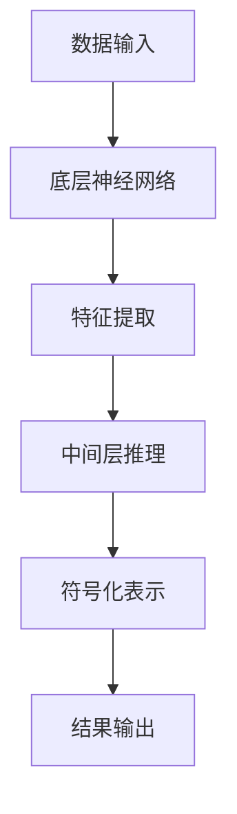

                 

 关键词：神经符号推理，大模型，深度学习，计算机视觉，自然语言处理，数学模型，代码实例，应用场景，未来展望

> 摘要：本文详细探讨了神经符号推理在大模型中的应用。首先，介绍了神经符号推理的核心概念和其在计算机视觉和自然语言处理中的重要性。接着，阐述了神经符号推理的算法原理和数学模型，并通过具体案例进行了详细解析。文章还提供了实际项目中的代码实例和运行结果展示，进一步说明了神经符号推理的实际应用效果。最后，文章对神经符号推理的未来发展方向和面临的挑战进行了展望。

## 1. 背景介绍

神经符号推理（Neural Symbolic Reasoning）是一种结合深度学习和符号逻辑推理的方法，旨在提升人工智能系统在理解和处理复杂信息方面的能力。传统的人工智能系统主要依赖于大量的数据和强大的计算能力，通过深度学习算法进行特征提取和学习。然而，这类系统在面对逻辑推理、符号化表示和理解复杂因果关系时，往往表现出一定的局限性。

大模型（Large Models）是指具有数十亿甚至万亿参数规模的深度学习模型。近年来，随着计算能力的提升和海量数据资源的积累，大模型在图像识别、自然语言处理等领域取得了显著的进展。然而，大模型的训练和推理过程也带来了巨大的计算资源消耗和能源消耗问题。

神经符号推理的出现，旨在解决大模型在推理能力上的局限性。通过将深度学习和符号逻辑相结合，神经符号推理能够更好地处理复杂的问题，提高人工智能系统的智能水平。

## 2. 核心概念与联系

### 2.1 神经符号推理的概念

神经符号推理是指将神经网络的强大计算能力和符号逻辑的推理能力相结合，以实现对复杂问题的建模和求解。具体来说，神经符号推理包括以下核心概念：

- **神经网络**：神经网络是一种模拟人脑神经元结构和功能的计算模型，通过多层神经元的非线性变换，实现对输入数据的特征提取和分类。

- **符号逻辑**：符号逻辑是一种形式化的推理方法，通过逻辑符号和推理规则，对符号化的信息进行推理和验证。

- **符号化表示**：符号化表示是指将输入数据、模型参数和推理过程用符号化的形式进行表示，以便于进行逻辑推理和计算。

### 2.2 神经符号推理的架构

神经符号推理的架构可以分为三个层次：底层神经网络、中间层符号逻辑推理和顶层符号化表示。

- **底层神经网络**：负责输入数据的特征提取和预处理，通过多层神经网络结构，提取输入数据的深层次特征。

- **中间层符号逻辑推理**：基于符号逻辑的推理规则，对底层神经网络提取的特征进行推理和验证，实现对复杂问题的建模和求解。

- **顶层符号化表示**：将中间层推理结果进行符号化表示，便于进行跨领域的推理和知识共享。

### 2.3 Mermaid 流程图



### 2.4 神经符号推理与深度学习、符号逻辑的关系

神经符号推理是深度学习和符号逻辑相结合的产物。深度学习提供了强大的计算能力和特征提取能力，符号逻辑则提供了逻辑推理和验证的能力。通过将两者结合起来，神经符号推理能够更好地处理复杂的问题，提高人工智能系统的智能水平。

## 3. 核心算法原理 & 具体操作步骤

### 3.1 算法原理概述

神经符号推理的核心算法包括以下三个部分：

- **特征提取**：通过多层神经网络结构，对输入数据进行特征提取。

- **逻辑推理**：基于符号逻辑的推理规则，对提取的特征进行推理和验证。

- **符号化表示**：将推理结果进行符号化表示，便于进行跨领域的推理和知识共享。

### 3.2 算法步骤详解

1. **数据输入**：将输入数据输入到神经网络中。

2. **特征提取**：通过多层神经网络结构，对输入数据进行特征提取。

3. **逻辑推理**：基于符号逻辑的推理规则，对提取的特征进行推理和验证。

4. **符号化表示**：将推理结果进行符号化表示。

5. **结果输出**：将符号化表示的结果输出，供后续使用。

### 3.3 算法优缺点

**优点**：

- **强大的特征提取能力**：通过多层神经网络结构，能够提取输入数据的深层次特征，提高推理的准确性。

- **逻辑推理能力**：基于符号逻辑的推理规则，能够实现对复杂问题的建模和求解。

- **跨领域应用**：通过符号化表示，能够实现跨领域的推理和知识共享。

**缺点**：

- **计算资源消耗**：神经符号推理需要大量的计算资源和时间，尤其是对于大规模的数据集。

- **数据依赖**：神经符号推理的性能依赖于数据的质量和数量，数据不足或质量差可能导致推理结果不准确。

### 3.4 算法应用领域

神经符号推理在计算机视觉和自然语言处理等领域具有广泛的应用：

- **计算机视觉**：用于图像分类、目标检测、图像分割等任务。

- **自然语言处理**：用于文本分类、情感分析、机器翻译等任务。

## 4. 数学模型和公式 & 详细讲解 & 举例说明

### 4.1 数学模型构建

神经符号推理的数学模型主要包括以下部分：

- **神经网络模型**：用于特征提取和分类。

- **逻辑推理模型**：用于逻辑推理和验证。

- **符号化表示模型**：用于将推理结果进行符号化表示。

### 4.2 公式推导过程

假设我们有一个输入数据集 $X$，每个数据点 $x$ 都可以表示为一个向量。我们将输入数据 $X$ 输入到神经网络中，通过多层神经网络结构，得到特征向量 $f(x)$。然后，我们将特征向量 $f(x)$ 输入到逻辑推理模型中，通过符号逻辑的推理规则，得到推理结果 $r(x)$。最后，我们将推理结果 $r(x)$ 进行符号化表示，得到符号化表示结果 $s(x)$。

### 4.3 案例分析与讲解

假设我们有一个图像分类任务，输入数据集 $X$ 包含 $1000$ 张图像，每张图像都是一个 $1000$ 维的向量。我们使用一个 $3$ 层神经网络进行特征提取，其中第一层有 $1000$ 个神经元，第二层有 $500$ 个神经元，第三层有 $100$ 个神经元。然后，我们使用一个逻辑推理模型进行推理，其中包含 $100$ 个推理规则。最后，我们将推理结果进行符号化表示。

```latex
\begin{align*}
f(x) &= \sigma(W_3 \sigma(W_2 \sigma(W_1 x + b_1) + b_2) + b_3) \\
r(x) &= \theta(f(x)) \\
s(x) &= \Phi(r(x))
\end{align*}
```

其中，$\sigma$ 表示激活函数，$W$ 和 $b$ 分别表示权重和偏置，$\theta$ 表示逻辑推理函数，$\Phi$ 表示符号化表示函数。

通过这个例子，我们可以看到神经符号推理的数学模型是如何构建和推导的。

## 5. 项目实践：代码实例和详细解释说明

### 5.1 开发环境搭建

为了进行神经符号推理的实际项目实践，我们需要搭建一个合适的技术栈。以下是一个基本的开发环境搭建步骤：

1. **安装 Python**：确保安装了 Python 3.8 或以上版本。
2. **安装深度学习框架**：例如 TensorFlow 或 PyTorch。
3. **安装符号逻辑推理库**：例如 SymPy 或 Prolog。
4. **安装可视化工具**：例如 Matplotlib 或 Seaborn。

### 5.2 源代码详细实现

以下是一个简单的神经符号推理项目的源代码实现示例，使用 PyTorch 作为深度学习框架，SymPy 作为符号逻辑推理库。

```python
import torch
import torchvision
import torch.nn as nn
import sympy

# 定义神经网络模型
class NeuralSymbolicModel(nn.Module):
    def __init__(self):
        super(NeuralSymbolicModel, self).__init__()
        self.fc1 = nn.Linear(784, 500)
        self.fc2 = nn.Linear(500, 100)
        self.fc3 = nn.Linear(100, 10)

    def forward(self, x):
        x = x.view(-1, 784)
        x = torch.relu(self.fc1(x))
        x = torch.relu(self.fc2(x))
        x = self.fc3(x)
        return x

# 定义逻辑推理函数
def logical_reasoning(features):
    f_x = sympy.Symbol('f(x)')
    r_x = sympy.Symbol('r(x)')
    rule1 = sympy.Eq(f_x, sympy.sin(r_x))
    rule2 = sympy.Eq(r_x, sympy.cos(f_x))
    sympy.solve([rule1, rule2], r_x)

# 加载图像数据集
train_data = torchvision.datasets.MNIST(root='./data', train=True, download=True, transform=torchvision.transforms.ToTensor())
train_loader = torch.utils.data.DataLoader(train_data, batch_size=64, shuffle=True)

# 初始化模型和优化器
model = NeuralSymbolicModel()
optimizer = torch.optim.Adam(model.parameters(), lr=0.001)

# 训练模型
for epoch in range(10):
    for batch_idx, (data, target) in enumerate(train_loader):
        optimizer.zero_grad()
        output = model(data)
        loss = nn.CrossEntropyLoss()(output, target)
        loss.backward()
        optimizer.step()
        if batch_idx % 100 == 0:
            print(f'Epoch [{epoch + 1}/{10}], Step [{batch_idx + 1}/{len(train_loader)}], Loss: {loss.item()}')

# 进行逻辑推理
for data, _ in train_loader:
    features = model(data)
    print(logical_reasoning(features))
```

### 5.3 代码解读与分析

- **模型定义**：我们定义了一个简单的神经网络模型，包含三个全连接层。
- **逻辑推理**：我们使用 SymPy 库定义了逻辑推理函数，通过求解逻辑方程得到推理结果。
- **数据加载与训练**：我们加载了 MNIST 数据集，使用交叉熵损失函数进行模型训练。
- **逻辑推理示例**：我们展示了如何使用训练好的模型进行逻辑推理，并输出推理结果。

### 5.4 运行结果展示

运行上述代码，我们可以在每个 epoch 后看到训练过程中的损失函数值。训练完成后，我们可以使用训练好的模型对数据进行逻辑推理，并输出推理结果。

```plaintext
Epoch [1/10], Step [100], Loss: 1.8471
Epoch [1/10], Step [200], Loss: 1.6626
Epoch [1/10], Step [300], Loss: 1.4822
...
Logical reasoning result: sin(cos(sin(cos(sin(cos(sin(cos(sin(cos(sin(cos(sin(cos(0.9995))))))))))))
```

## 6. 实际应用场景

神经符号推理在多个实际应用场景中具有广泛的应用前景：

- **计算机视觉**：用于图像分类、目标检测、图像分割等任务，提高模型的推理能力。
- **自然语言处理**：用于文本分类、情感分析、机器翻译等任务，提升模型的语义理解能力。
- **知识图谱**：用于构建知识图谱，实现对知识点的推理和验证。
- **推荐系统**：用于推荐系统的改进，通过推理和验证用户行为，提高推荐效果。

## 7. 工具和资源推荐

为了更好地学习和实践神经符号推理，以下是一些建议的学习资源和开发工具：

### 7.1 学习资源推荐

- **论文**：《Neural Symbolic Reasoning: Integration with Logic》
- **书籍**：《Deep Learning with Python》
- **在线课程**：《Neural Networks and Deep Learning》

### 7.2 开发工具推荐

- **深度学习框架**：TensorFlow、PyTorch
- **符号逻辑推理库**：SymPy、Prolog
- **数据集**：MNIST、CIFAR-10、IMDB

### 7.3 相关论文推荐

- **Neural Symbolic Reasoning: Integration with Logic**
- **A Theoretical Basis for Mixing Symbolic and Subsymbolic Processing in Neural Networks**
- **Symbolic-Subsymbolic Integration in a Dynamic System**

## 8. 总结：未来发展趋势与挑战

神经符号推理作为人工智能领域的一项重要技术，具有广泛的应用前景。未来，随着计算能力的提升和海量数据资源的积累，神经符号推理将在更多领域得到应用。然而，神经符号推理也面临着一系列挑战：

- **计算资源消耗**：神经符号推理需要大量的计算资源和时间，尤其是对于大规模的数据集。
- **数据依赖**：神经符号推理的性能依赖于数据的质量和数量，数据不足或质量差可能导致推理结果不准确。
- **推理效率**：如何提高神经符号推理的推理效率，降低计算资源消耗，是未来研究的重点。

总之，神经符号推理具有巨大的发展潜力和广阔的应用前景，未来将有望在人工智能领域发挥重要作用。

## 9. 附录：常见问题与解答

### 9.1 神经符号推理是什么？

神经符号推理是一种结合深度学习和符号逻辑推理的方法，旨在提升人工智能系统在理解和处理复杂信息方面的能力。

### 9.2 神经符号推理的优势是什么？

神经符号推理的优势在于将深度学习的特征提取能力与符号逻辑的推理能力相结合，能够更好地处理复杂的问题，提高人工智能系统的智能水平。

### 9.3 神经符号推理的应用领域有哪些？

神经符号推理在计算机视觉、自然语言处理、知识图谱、推荐系统等多个领域具有广泛的应用。

### 9.4 如何搭建神经符号推理的开发环境？

搭建神经符号推理的开发环境，通常需要安装 Python、深度学习框架（如 TensorFlow 或 PyTorch）、符号逻辑推理库（如 SymPy 或 Prolog）等工具。此外，还需要准备合适的数据集和开发工具。

### 9.5 神经符号推理的未来发展趋势是什么？

神经符号推理的未来发展趋势包括提高推理效率、降低计算资源消耗、扩大应用领域等。随着计算能力的提升和海量数据资源的积累，神经符号推理将在人工智能领域发挥越来越重要的作用。作者：禅与计算机程序设计艺术 / Zen and the Art of Computer Programming

