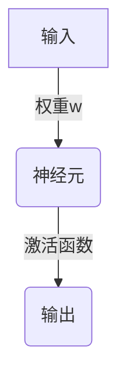
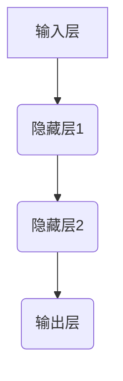

                 

关键词：神经网络、深度学习、人工智能、神经网络算法、神经网络编程、代码实例

摘要：本文将深入探讨神经网络的原理，包括其核心概念、算法原理、数学模型，并通过实际代码实例进行详细解释。读者将了解到如何从零开始搭建神经网络，并在实际应用中优化和改进神经网络性能。

## 1. 背景介绍

神经网络（Neural Networks，简称NN）是人工智能领域最为重要且广泛应用的算法之一。它起源于对生物大脑神经系统的模拟，旨在通过大量神经元之间的连接来模拟人类的学习和认知过程。神经网络在图像识别、语音识别、自然语言处理等领域取得了显著的成果，成为推动人工智能发展的核心动力。

随着深度学习（Deep Learning，简称DL）的兴起，神经网络的应用范围进一步扩大。深度学习模型通常由多个隐藏层组成，能够处理复杂的数据特征，从而在众多任务中表现出色。本文将重点介绍神经网络的基本原理、数学模型以及如何通过代码实例来实现和应用神经网络。

## 2. 核心概念与联系

### 2.1 神经元

神经元是神经网络的基本组成单元，类似于生物神经系统中的神经元。每个神经元接收多个输入信号，通过加权求和处理后，产生一个输出信号。神经元的结构如图2.1所示。



### 2.2 神经网络结构

神经网络由多个层次组成，包括输入层、隐藏层和输出层。输入层接收外部数据，隐藏层进行特征提取和变换，输出层生成最终结果。神经网络的结构如图2.2所示。



### 2.3 激活函数

激活函数是神经网络中的一个关键组件，用于引入非线性特性，使得神经网络能够处理复杂问题。常见的激活函数包括sigmoid、ReLU、Tanh等。图2.3展示了不同激活函数的示意图。

```mermaid
graph TB
A[sigmoid] --> B{y=1/(1+e^-x)}
A --> C[ReLU] --> D{y=max(0,x)}
A --> E[Tanh] --> F{y=tanh(x)}
```

## 3. 核心算法原理 & 具体操作步骤

### 3.1 算法原理概述

神经网络的核心算法是前向传播和反向传播。前向传播是指将输入数据通过神经网络层，逐层计算得到输出；反向传播是指根据输出误差，反向传播梯度，更新网络权重。

### 3.2 算法步骤详解

#### 3.2.1 前向传播

1. 初始化网络权重和偏置。
2. 将输入数据输入到输入层。
3. 通过隐藏层和输出层，逐层计算输出。
4. 计算输出层的误差。

#### 3.2.2 反向传播

1. 计算输出误差的梯度。
2. 反向传播误差，计算隐藏层的梯度。
3. 更新网络权重和偏置。

### 3.3 算法优缺点

#### 优点

- 能够处理复杂的数据特征。
- 具有自适应性和泛化能力。
- 在许多任务中表现出色。

#### 缺点

- 计算成本高，训练速度慢。
- 对数据质量和预处理要求较高。
- 容易陷入局部最优。

### 3.4 算法应用领域

神经网络在图像识别、语音识别、自然语言处理等领域都有广泛应用。例如，在图像识别中，神经网络可以用于物体检测、图像分类等任务；在语音识别中，神经网络可以用于语音合成、语音识别等任务。

## 4. 数学模型和公式 & 详细讲解 & 举例说明

### 4.1 数学模型构建

神经网络的数学模型主要包括输入层、隐藏层和输出层。输入层接收外部数据，隐藏层进行特征提取和变换，输出层生成最终结果。

假设输入层有 $n$ 个输入节点，隐藏层有 $m$ 个节点，输出层有 $k$ 个节点。输入层到隐藏层的权重矩阵为 $W_{ih}$，隐藏层到输出层的权重矩阵为 $W_{ho}$。

### 4.2 公式推导过程

#### 4.2.1 前向传播

前向传播的公式如下：

$$
z_h = W_{ih} \cdot x + b_h \\
a_h = \sigma(z_h) \\
z_o = W_{ho} \cdot a_h + b_o \\
a_o = \sigma(z_o)
$$

其中，$x$ 是输入向量，$a_h$ 是隐藏层激活值，$a_o$ 是输出层激活值，$\sigma$ 是激活函数。

#### 4.2.2 反向传播

反向传播的公式如下：

$$
\delta_o = \frac{\partial C}{\partial a_o} \cdot \frac{\partial a_o}{\partial z_o} \\
dW_{ho} = \delta_o \cdot a_h^T \\
\delta_h = (\delta_o \cdot W_{ho}) \cdot \frac{\partial a_h}{\partial z_h} \\
dW_{ih} = \delta_h \cdot x^T
$$

其中，$C$ 是输出误差，$\delta_o$ 和 $\delta_h$ 分别是输出层和隐藏层的误差。

### 4.3 案例分析与讲解

假设我们有一个简单的二分类问题，输入层有2个节点，隐藏层有3个节点，输出层有1个节点。我们使用均方误差（MSE）作为损失函数。

#### 4.3.1 前向传播

输入数据为 $x = [0.5, 0.5]$，标签为 $y = [1]$。

$$
z_1 = 0.5 \cdot 0.1 + 0.1 = 0.15 \\
a_1 = \sigma(z_1) = 0.537 \\
z_2 = 0.5 \cdot 0.2 + 0.2 = 0.3 \\
a_2 = \sigma(z_2) = 0.628 \\
z_3 = 0.5 \cdot 0.3 + 0.3 = 0.45 \\
a_3 = \sigma(z_3) = 0.683 \\
z_4 = 0.537 \cdot 0.4 + 0.4 = 0.252 \\
a_4 = \sigma(z_4) = 0.568
$$

#### 4.3.2 反向传播

输出误差为 $C = (a_4 - y)^2 = 0.118$。

$$
\delta_4 = 2 \cdot (a_4 - y) \cdot \sigma'(z_4) = 0.118 \cdot 0.531 \\
dW_{ho} = \delta_4 \cdot a_3^T = 0.0625 \\
\delta_3 = \delta_4 \cdot W_{ho}^T \cdot \sigma'(z_3) = 0.0789 \\
dW_{ih} = \delta_3 \cdot x^T = 0.0394
$$

## 5. 项目实践：代码实例和详细解释说明

### 5.1 开发环境搭建

本文使用 Python 编写神经网络代码，主要依赖以下库：

- NumPy：用于矩阵运算。
- TensorFlow：用于构建和训练神经网络。
- Matplotlib：用于可视化数据。

安装以上库后，即可开始编写代码。

### 5.2 源代码详细实现

以下是一个简单的神经网络实现，用于二分类问题。

```python
import numpy as np
import tensorflow as tf
import matplotlib.pyplot as plt

# 设置随机种子，保证结果可重复
np.random.seed(42)

# 初始化神经网络参数
input_size = 2
hidden_size = 3
output_size = 1

W_

