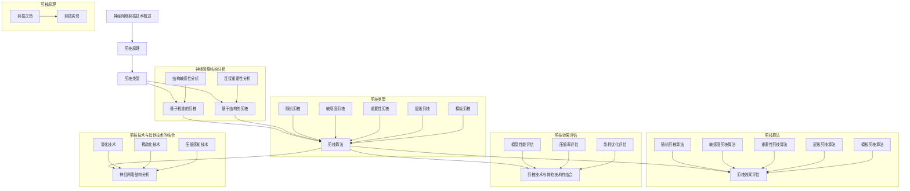

                 

关键词：神经网络、剪枝技术、优化、压缩、高效能、模型压缩、算法原理

> 摘要：本文将探讨神经网络剪枝技术的最新进展，从背景介绍到核心概念、算法原理及具体操作步骤，再到数学模型、项目实践、应用场景、未来展望，全面解析神经网络剪枝技术的方方面面，旨在为研究人员和开发者提供有价值的参考。

## 1. 背景介绍

随着深度学习技术的快速发展，神经网络在各个领域的应用日益广泛。然而，神经网络的模型复杂度和计算量也日益增加，这对计算资源和存储资源提出了更高的要求。为了满足这些要求，研究者们开始探索如何高效地压缩神经网络，使其在保持性能的同时，减少模型的规模和计算复杂度。

神经网络剪枝技术作为一种有效的模型压缩方法，旨在通过去除网络中不重要的连接或神经元，来实现模型的压缩和优化。剪枝技术不仅能够减少模型的存储和计算需求，还能够提高网络的运行效率，降低能耗，这对于移动设备、嵌入式系统和实时应用场景具有重要意义。

本文将重点关注神经网络剪枝技术的最新研究进展，从核心概念、算法原理、数学模型、项目实践、应用场景等多个角度进行详细阐述，以期为相关领域的研究和开发提供有益的参考。

### 1.1 剪枝技术的起源与发展

剪枝技术在深度学习领域的发展可以追溯到神经网络模型压缩的早期研究。最初的剪枝技术主要基于经验性原则，通过手动删除网络中的部分连接或神经元来实现模型压缩。这种手动剪枝方法虽然能够实现一定的压缩效果，但缺乏系统的理论依据和优化策略。

随着深度学习技术的不断发展和优化，剪枝技术也逐渐得到了理论上的支持。研究者们开始提出各种基于理论和统计方法的剪枝算法，如基于敏感度分析的剪枝方法、基于结构敏感性的剪枝方法等。这些方法在保证模型性能的同时，进一步提高了剪枝的效率和准确性。

近年来，随着神经网络模型的复杂度和规模不断增加，剪枝技术的重要性也日益凸显。许多研究机构和公司投入了大量资源进行剪枝技术的研发，推动了该领域的技术进步。目前，剪枝技术已经成为神经网络模型压缩领域的重要研究方向之一。

### 1.2 神经网络剪枝技术的意义与应用

神经网络剪枝技术具有重要的理论和实践意义。在理论层面，剪枝技术有助于深入理解神经网络的结构和功能，揭示网络中的冗余和重要性，从而优化网络的性能。在实践层面，剪枝技术可以显著降低模型的存储和计算需求，提高网络的运行效率，降低能耗，满足移动设备和嵌入式系统等场景对高性能计算的需求。

具体来说，神经网络剪枝技术的应用场景主要包括以下几个方面：

1. **模型压缩**：通过剪枝技术减少网络的规模和计算复杂度，实现模型的压缩，提高存储和计算效率。

2. **能耗优化**：剪枝技术可以降低网络运行时的能耗，这对于移动设备和嵌入式系统具有重要意义。

3. **实时应用**：剪枝技术可以显著提高网络的运行速度，满足实时应用场景对高性能计算的需求。

4. **资源受限环境**：在计算资源有限的环境下，剪枝技术可以帮助神经网络模型更高效地利用资源，提高模型的运行效率。

### 1.3 本文结构

本文将分为八个主要部分：

1. **背景介绍**：简要介绍神经网络剪枝技术的起源和发展，以及其在理论和实践中的意义和应用。

2. **核心概念与联系**：详细阐述神经网络剪枝技术中的核心概念，并利用Mermaid流程图展示剪枝技术的原理和架构。

3. **核心算法原理 & 具体操作步骤**：介绍神经网络剪枝技术的核心算法原理，并详细说明剪枝的具体操作步骤。

4. **数学模型和公式**：讲解神经网络剪枝技术中的数学模型和公式，并提供详细讲解和案例分析。

5. **项目实践：代码实例和详细解释说明**：提供神经网络剪枝技术的代码实例，并详细解释代码的实现过程和关键步骤。

6. **实际应用场景**：探讨神经网络剪枝技术在各个领域的应用场景，以及面临的挑战和未来展望。

7. **工具和资源推荐**：推荐学习资源、开发工具和相关论文，为读者提供进一步学习的途径。

8. **总结**：总结研究成果，分析未来发展趋势和面临的挑战，并提出研究展望。

通过以上结构，本文旨在全面、系统地介绍神经网络剪枝技术的最新进展，为读者提供有价值的参考和启示。

### 1.4 神经网络剪枝技术的分类

神经网络剪枝技术可以分为多种类型，每种类型都有其特定的原理和应用场景。以下是对几种常见剪枝技术的分类和概述：

1. **基于权重的剪枝**：这种剪枝方法主要基于网络中权重的重要性进行剪枝。权重较小的连接被认为对模型的贡献较小，因此可以被剪除。基于权重的剪枝方法通常包括以下几种：

   - **随机剪枝**：随机选择网络中的部分连接进行剪除，这种方法简单但缺乏针对性，可能导致性能下降。
   - **敏感度剪枝**：基于对网络敏感度的分析，剪除对模型性能影响较小的连接。这种方法需要计算敏感度矩阵，较为复杂。
   - **重要性剪枝**：通过计算连接的重要性度量（如权重的绝对值、归一化的权重值等），剪除重要性较低的连接。这种方法相对较为成熟，但需要确定合适的度量标准。

2. **基于结构的剪枝**：这种剪枝方法主要基于网络结构进行剪枝，旨在保持网络的层次结构和功能。基于结构的剪枝方法包括以下几种：

   - **层级剪枝**：从网络的顶层开始，逐层剪除神经元或连接，直到达到预定的压缩率。这种方法可以保留网络的核心结构，但可能导致性能下降。
   - **模板剪枝**：预先定义一组模板，根据模板剪除网络中的部分结构。这种方法可以快速实现模型的压缩，但需要设计合适的模板。
   - **结构敏感度剪枝**：基于对网络结构的敏感度分析，剪除对模型性能影响较小的结构。这种方法需要计算结构的敏感度矩阵，较为复杂。

3. **混合剪枝方法**：结合基于权重和基于结构的剪枝方法，实现更有效的模型压缩。混合剪枝方法通常包括以下几种：

   - **联合剪枝**：同时应用基于权重和基于结构的剪枝方法，优化模型的压缩效果。这种方法需要综合考虑权重和结构的影响，较为复杂。
   - **层次化剪枝**：先进行基于结构的剪枝，然后对剩余的网络进行基于权重的剪枝。这种方法可以平衡压缩效果和性能，但需要设计合理的剪枝策略。

每种剪枝方法都有其优势和局限性，实际应用中需要根据具体需求和场景选择合适的方法。通过对比不同剪枝方法的原理和应用，可以更好地理解神经网络剪枝技术的核心思想和实现策略。

### 1.5 神经网络剪枝技术的挑战与机遇

尽管神经网络剪枝技术取得了显著的成果，但在实际应用中仍然面临诸多挑战和机遇。以下是对当前剪枝技术面临的挑战和潜在机遇的概述：

#### 1.5.1 挑战

1. **性能损失**：剪枝技术不可避免地会导致部分连接或神经元的去除，这可能导致模型性能的下降。如何在保持模型性能的同时实现有效的剪枝，是一个亟待解决的问题。

2. **可解释性**：剪枝后的网络结构复杂度降低，但如何解释剪枝后的网络行为，以及剪枝决策的依据是什么，仍然是一个挑战。提高剪枝算法的可解释性，有助于更好地理解剪枝过程和效果。

3. **计算效率**：剪枝算法的计算复杂度较高，尤其是在大规模网络中，如何提高计算效率，减少剪枝过程的时间成本，是一个重要问题。

4. **适应性和泛化能力**：剪枝技术需要针对不同的网络结构和任务进行定制化，如何提高剪枝算法的适应性和泛化能力，使其能够应用于更广泛的场景，是一个重要的研究课题。

#### 1.5.2 机遇

1. **硬件加速**：随着硬件技术的发展，如GPU、TPU等专用硬件的普及，剪枝技术的计算效率将得到显著提升。硬件加速可以为剪枝算法提供更强大的计算能力，加速模型压缩过程。

2. **自动化工具**：随着人工智能和自动化技术的发展，自动化剪枝工具的涌现为剪枝技术的广泛应用提供了可能。通过自动化工具，可以大大简化剪枝过程的复杂度，提高剪枝效率。

3. **多模态数据融合**：剪枝技术可以应用于多模态数据的处理，如图像、语音和文本等。多模态数据融合可以进一步扩展剪枝技术的应用场景，提升模型的综合性能。

4. **边缘计算**：随着边缘计算的兴起，剪枝技术在资源受限的边缘设备上具有广泛的应用前景。通过剪枝技术，可以降低模型的规模和计算复杂度，满足边缘设备对高性能计算的需求。

总的来说，神经网络剪枝技术面临着诸多挑战和机遇。通过不断探索和创新，有望在保持模型性能的同时，实现更高效、更可靠的模型压缩和优化。

### 2. 核心概念与联系

在深入探讨神经网络剪枝技术之前，首先需要了解其中的核心概念及其相互联系。以下是神经网络剪枝技术中的关键概念及其关系：

#### 2.1 剪枝原理

神经网络剪枝的基本原理是通过去除网络中不重要的连接或神经元，来降低模型的复杂度，从而实现模型的压缩和优化。剪枝过程通常包括两个关键步骤：剪枝决策和剪枝实现。

- **剪枝决策**：通过评估网络中各个连接或神经元的贡献，确定哪些部分可以被剪除。剪枝决策可以基于权重、结构敏感性、重要性度量等多种方法。
- **剪枝实现**：根据剪枝决策的结果，修改网络结构，实现连接或神经元的去除。剪枝实现可以采用直接剪除、权重置零、连接替换等多种策略。

#### 2.2 剪枝类型

剪枝技术可以分为基于权重的剪枝和基于结构的剪枝两种类型，每种类型都有其特定的应用场景和实现策略。

- **基于权重的剪枝**：通过评估网络中连接的权重，剪除权重较小的连接。这种方法适用于简单网络，但可能导致性能下降。
- **基于结构的剪枝**：通过分析网络的结构，剪除对模型性能影响较小的部分。这种方法适用于复杂网络，可以保留网络的核心结构。

#### 2.3 剪枝算法

剪枝算法是神经网络剪枝技术的核心组成部分，用于实现剪枝决策和剪枝实现。以下是几种常见的剪枝算法：

- **随机剪枝**：随机选择网络中的连接进行剪除，方法简单但缺乏针对性。
- **敏感度剪枝**：基于对网络敏感度的分析，剪除对模型性能影响较小的连接。
- **重要性剪枝**：通过计算连接的重要性度量，剪除重要性较低的连接。
- **层级剪枝**：从网络的顶层开始，逐层剪除神经元或连接。
- **模板剪枝**：根据预定义的模板剪除网络中的部分结构。

#### 2.4 剪枝效果评估

剪枝效果评估是判断剪枝技术优劣的重要指标，主要包括以下几个方面：

- **模型性能**：评估剪枝后模型的性能是否下降，以及下降的程度。
- **压缩率**：评估剪枝后模型的压缩率，即模型大小和计算复杂度的减少程度。
- **能耗优化**：评估剪枝后模型的能耗优化效果，特别是在移动设备和嵌入式系统等资源受限环境下的表现。

#### 2.5 剪枝技术与其他技术的结合

剪枝技术可以与其他模型压缩技术相结合，实现更高效的模型压缩和优化。以下是一些常见的结合方式：

- **量化**：通过量化技术，降低模型的精度，从而实现模型的压缩和优化。
- **稀疏化**：通过稀疏化技术，减少模型中的非零元素，从而降低模型的存储和计算复杂度。
- **压缩感知**：通过压缩感知技术，将模型转化为稀疏表示，从而实现模型的压缩和优化。

#### 2.6 Mermaid流程图

以下是一个简单的Mermaid流程图，用于展示神经网络剪枝技术的原理和架构：

```
graph TD
A[剪枝原理] --> B[剪枝类型]
B --> C{基于权重的剪枝}
C --> D[随机剪枝]
C --> E[敏感度剪枝]
C --> F[重要性剪枝]
B --> G[基于结构的剪枝]
G --> H[层级剪枝]
G --> I[模板剪枝]
A --> J[剪枝算法]
J --> K[随机剪枝算法]
J --> L[敏感度剪枝算法]
J --> M[重要性剪枝算法]
J --> N[层级剪枝算法]
J --> O[模板剪枝算法]
A --> P[剪枝效果评估]
P --> Q[模型性能评估]
P --> R[压缩率评估]
P --> S[能耗优化评估]
A --> T[剪枝技术与其他技术的结合]
T --> U[量化技术]
T --> V[稀疏化技术]
T --> W[压缩感知技术]
```

通过以上核心概念和Mermaid流程图的展示，我们可以更好地理解神经网络剪枝技术的原理和架构，为进一步的讨论和研究打下基础。

### 2.7 核心概念原理和架构的 Mermaid 流程图

以下是一个详细的Mermaid流程图，展示了神经网络剪枝技术的核心概念原理和架构。请注意，由于Markdown格式的限制，这个流程图可能需要在支持Mermaid的编辑器中查看。



这个流程图详细展示了神经网络剪枝技术的核心概念及其相互关系，包括剪枝原理、剪枝类型、剪枝算法、剪枝效果评估以及剪枝技术与其他技术的结合。通过这个流程图，读者可以更好地理解神经网络剪枝技术的整体架构和实施步骤。

### 3. 核心算法原理 & 具体操作步骤

神经网络剪枝技术的核心在于如何有效地选择和去除网络中不重要的连接或神经元，从而实现模型的压缩和优化。下面将详细介绍几种常见的剪枝算法原理及其具体操作步骤。

#### 3.1 随机剪枝

随机剪枝是一种最简单的剪枝方法，通过随机选择网络中的部分连接进行剪除。具体操作步骤如下：

1. **初始化**：随机生成一个概率分布，用于决定每个连接是否被剪除。通常，概率分布与连接的权重成正比。
2. **剪枝决策**：根据概率分布，随机选择部分连接进行剪除。剪除的连接权重置为零。
3. **剪枝实现**：修改网络结构，删除剪除的连接，并重新计算剩余连接的权重。
4. **性能评估**：评估剪枝后网络的性能，如准确率、计算复杂度等，并记录剪枝效果。

随机剪枝的优点在于实现简单，易于理解。然而，由于缺乏针对性，随机剪枝可能导致性能下降，特别是在复杂网络中。

#### 3.2 敏感度剪枝

敏感度剪枝方法基于对网络敏感度的分析，剪除对模型性能影响较小的连接。敏感度剪枝的具体操作步骤如下：

1. **初始化**：计算网络的敏感度矩阵，用于评估每个连接对模型性能的影响。
2. **剪枝决策**：根据敏感度矩阵，选择敏感度较低的连接进行剪除。
3. **剪枝实现**：修改网络结构，删除剪除的连接，并重新计算剩余连接的权重。
4. **性能评估**：评估剪枝后网络的性能，并记录剪枝效果。

敏感度剪枝的优点在于剪枝决策具有理论依据，能够有效减少性能损失。然而，计算敏感度矩阵的过程复杂且计算量大，可能导致计算效率较低。

#### 3.3 重要性剪枝

重要性剪枝方法通过计算连接的重要性度量，剪除重要性较低的连接。重要性剪枝的具体操作步骤如下：

1. **初始化**：计算每个连接的重要性度量，如权重的绝对值、归一化的权重值等。
2. **剪枝决策**：根据重要性度量，选择重要性较低的连接进行剪除。
3. **剪枝实现**：修改网络结构，删除剪除的连接，并重新计算剩余连接的权重。
4. **性能评估**：评估剪枝后网络的性能，并记录剪枝效果。

重要性剪枝的优点在于实现简单，且可以根据不同的度量标准灵活调整剪枝策略。然而，重要性度量的选择和计算过程可能较为复杂，且无法完全保证性能的稳定性。

#### 3.4 层级剪枝

层级剪枝方法从网络的顶层开始，逐层剪除神经元或连接，以实现模型的压缩。具体操作步骤如下：

1. **初始化**：计算网络中每个神经元或连接的重要性度量，如其在网络中的层次结构、对模型性能的贡献等。
2. **剪枝决策**：根据重要性度量，从顶层开始逐层剪除神经元或连接，直到达到预定的压缩率。
3. **剪枝实现**：修改网络结构，删除剪除的神经元或连接，并重新计算剩余部分的结构和权重。
4. **性能评估**：评估剪枝后网络的性能，并记录剪枝效果。

层级剪枝的优点在于可以保留网络的核心结构，减少性能损失。然而，剪枝策略的设计和实现较为复杂，需要充分考虑网络层次结构的影响。

#### 3.5 模板剪枝

模板剪枝方法通过预先定义一组模板，根据模板剪除网络中的部分结构。具体操作步骤如下：

1. **初始化**：设计一组剪枝模板，如连接替换、神经元删除等。
2. **剪枝决策**：根据模板，选择合适的模板应用于网络结构，剪除部分连接或神经元。
3. **剪枝实现**：根据剪枝决策，修改网络结构，实现模板的应用和结构的更新。
4. **性能评估**：评估剪枝后网络的性能，并记录剪枝效果。

模板剪枝的优点在于剪枝策略明确，实现简单。然而，模板的设计和优化需要针对不同网络结构和任务进行定制，可能需要大量实验和调试。

#### 3.6 混合剪枝方法

混合剪枝方法结合了基于权重和基于结构的剪枝方法，通过综合考虑权重和结构的影响，实现更有效的模型压缩。具体操作步骤如下：

1. **初始化**：首先使用基于结构的剪枝方法，剪除对模型性能影响较小的结构。
2. **剪枝决策**：然后使用基于权重的剪枝方法，剪除剩余网络中的部分连接，进一步优化模型。
3. **剪枝实现**：修改网络结构，删除剪除的连接和结构，并重新计算剩余部分的权重。
4. **性能评估**：评估剪枝后网络的性能，并记录剪枝效果。

混合剪枝方法的优点在于综合了不同剪枝方法的优点，能够实现更高效的模型压缩。然而，剪枝策略的设计和实现较为复杂，需要综合考虑多种因素的影响。

通过以上对各种剪枝算法原理和具体操作步骤的详细阐述，我们可以更好地理解神经网络剪枝技术的工作机制和应用方法。在实际应用中，可以根据具体需求和场景选择合适的剪枝算法，实现模型的压缩和优化。

### 3.1 算法原理概述

神经网络剪枝技术通过去除网络中不重要的连接或神经元，以降低模型的复杂度，从而实现模型的压缩和优化。剪枝算法的核心思想是利用各种方法评估连接或神经元的贡献，并据此进行剪枝决策。

#### 3.1.1 剪枝算法的目标

剪枝算法的主要目标是在保持模型性能的前提下，实现模型的压缩和优化。具体来说，剪枝算法需要达到以下目标：

1. **压缩率**：通过剪枝减少模型的规模，降低存储和计算复杂度。
2. **性能损失**：在剪枝过程中，尽可能减少对模型性能的影响，保持较高的准确率。
3. **计算效率**：优化剪枝算法的执行过程，提高计算效率，减少剪枝过程的时间成本。

#### 3.1.2 剪枝算法的分类

根据剪枝决策和剪枝实现的方法，剪枝算法可以分为以下几种类型：

1. **基于权重的剪枝**：这种方法主要基于网络中连接的权重进行剪枝，通过评估连接的重要性来决定是否剪除。基于权重的剪枝算法包括随机剪枝、敏感度剪枝和重要性剪枝等。

2. **基于结构的剪枝**：这种方法主要基于网络的结构信息进行剪枝，通过分析网络的层次结构或连接模式来剪除不重要的部分。基于结构的剪枝算法包括层级剪枝和模板剪枝等。

3. **混合剪枝方法**：这种方法结合了基于权重和基于结构的剪枝方法，通过综合考虑权重和结构的影响，实现更高效的模型压缩。混合剪枝方法可以结合不同类型的剪枝算法，优化剪枝效果。

#### 3.1.3 剪枝算法的原理

剪枝算法的基本原理是通过评估网络中各个连接或神经元的贡献，决定哪些部分可以被剪除。以下是对几种常见剪枝算法原理的概述：

1. **随机剪枝**：随机选择网络中的部分连接进行剪除，这种方法简单但缺乏针对性，可能导致性能下降。

2. **敏感度剪枝**：基于对网络敏感度的分析，剪除对模型性能影响较小的连接。敏感度剪枝需要计算敏感度矩阵，较为复杂，但能够有效减少性能损失。

3. **重要性剪枝**：通过计算连接的重要性度量，剪除重要性较低的连接。重要性剪枝方法灵活，可以根据不同的度量标准进行调整。

4. **层级剪枝**：从网络的顶层开始，逐层剪除神经元或连接，这种方法可以保留网络的核心结构，但可能导致性能下降。

5. **模板剪枝**：根据预定义的模板剪除网络中的部分结构。模板剪枝方法实现简单，但需要设计合适的模板。

6. **混合剪枝方法**：结合基于权重和基于结构的剪枝方法，优化模型的压缩效果。混合剪枝方法需要综合考虑权重和结构的影响，实现更高效的模型压缩。

#### 3.1.4 剪枝算法的优势与局限性

每种剪枝算法都有其优势和局限性，适用于不同的应用场景和需求。以下是对几种剪枝算法优势与局限性的概述：

1. **随机剪枝**：优势在于实现简单，易于理解；局限性在于可能导致性能下降，且无法针对特定网络进行优化。

2. **敏感度剪枝**：优势在于剪枝决策具有理论依据，能够有效减少性能损失；局限性在于计算复杂度较高，适用于简单网络。

3. **重要性剪枝**：优势在于实现简单，灵活性高；局限性在于无法完全保证性能的稳定性，需要根据不同任务进行调整。

4. **层级剪枝**：优势在于可以保留网络的核心结构，减少性能损失；局限性在于剪枝策略的设计和实现复杂，需要充分考虑网络层次结构的影响。

5. **模板剪枝**：优势在于实现简单，剪枝策略明确；局限性在于模板的设计和优化需要大量实验和调试，可能不适用于复杂网络。

6. **混合剪枝方法**：优势在于综合考虑权重和结构的影响，实现更高效的模型压缩；局限性在于剪枝策略的设计和实现复杂，需要根据具体需求进行优化。

通过以上对剪枝算法原理的概述，我们可以更好地理解神经网络剪枝技术的工作机制和应用方法。在实际应用中，可以根据具体需求和场景选择合适的剪枝算法，实现模型的压缩和优化。

### 3.2 算法步骤详解

在了解了神经网络剪枝算法的基本原理之后，接下来我们将详细解释剪枝算法的具体操作步骤。以下是剪枝算法的主要步骤，以及每一步的具体内容和实现方法。

#### 3.2.1 数据预处理

在开始剪枝之前，需要对原始数据进行预处理，以提高剪枝算法的效果。数据预处理主要包括以下步骤：

1. **数据清洗**：去除数据中的噪声和异常值，确保数据的质量和一致性。
2. **归一化**：对输入数据和小批量数据进行归一化处理，将数据缩放到相同的范围，以便于后续的计算和剪枝。
3. **数据增强**：通过增加数据的多样性，如随机旋转、缩放、裁剪等，提高模型的泛化能力。

#### 3.2.2 初始化网络

初始化神经网络，包括选择合适的网络结构、权重初始化和激活函数等。以下是一些常见的初始化方法：

1. **随机初始化**：随机初始化网络的权重和偏置，这种方法简单但可能导致性能波动。
2. **高斯初始化**：使用高斯分布初始化网络的权重和偏置，可以减少梯度消失和梯度爆炸的问题。
3. **Xavier初始化**：使用Xavier初始化方法，根据网络层的输入和输出维度计算初始化参数，以保持网络的方差不变。

#### 3.2.3 训练模型

使用预处理后的数据对神经网络进行训练。以下是训练模型的主要步骤：

1. **前向传播**：将输入数据输入到网络中，计算网络的输出结果和损失值。
2. **反向传播**：计算损失函数对网络权重的梯度，并更新网络的参数。
3. **优化算法**：选择合适的优化算法，如梯度下降、Adam、RMSprop等，以加速模型收敛。
4. **模型评估**：在训练过程中，定期评估模型的性能，如准确率、损失函数值等，以调整训练策略。

#### 3.2.4 权重敏感性分析

在训练模型之后，需要对网络中的权重进行敏感性分析，以确定哪些权重对模型性能的影响较大。以下是权重敏感性分析的主要步骤：

1. **计算敏感度矩阵**：通过计算梯度或Hessian矩阵，获得每个权重对模型性能的敏感性度量。
2. **排序权重**：根据敏感度度量对权重进行排序，权重值较小的连接被认为对模型性能的贡献较小。
3. **阈值设定**：设定一个阈值，将权重值小于阈值的连接视为不重要，准备进行剪枝。

#### 3.2.5 剪枝决策

根据权重敏感性分析的结果，进行剪枝决策。以下是剪枝决策的主要步骤：

1. **选择剪枝方法**：根据具体需求和网络结构，选择合适的剪枝方法，如随机剪枝、敏感度剪枝、重要性剪枝等。
2. **剪枝决策**：根据剪枝方法，对权重值小于阈值的连接进行剪枝决策，将剪枝的连接权重置为零或进行其他处理。
3. **剪枝实现**：修改网络结构，删除剪枝的连接，并重新计算剩余连接的权重。

#### 3.2.6 剪枝实现

根据剪枝决策的结果，实现剪枝操作。以下是剪枝实现的主要步骤：

1. **删除连接**：删除网络中剪枝的连接，减少模型的复杂度。
2. **权重调整**：根据剪枝后的网络结构，重新计算剩余连接的权重，确保网络的一致性和完整性。
3. **结构更新**：更新网络的层次结构和拓扑结构，以适应剪枝后的网络。

#### 3.2.7 性能评估

剪枝完成后，需要对剪枝后的模型进行性能评估，以验证剪枝效果。以下是性能评估的主要步骤：

1. **模型测试**：使用测试数据集对剪枝后的模型进行测试，评估模型的性能指标，如准确率、损失函数值等。
2. **比较分析**：将剪枝前后的模型性能进行比较分析，评估剪枝对模型性能的影响。
3. **结果记录**：记录剪枝前后的模型性能数据，以便进行后续分析和优化。

通过以上详细的剪枝算法步骤，我们可以更好地理解和实现神经网络剪枝技术。在实际应用中，可以根据具体需求和场景，灵活调整和优化剪枝算法的各个步骤，以实现更高效的模型压缩和优化。

### 3.3 算法优缺点

神经网络剪枝技术虽然在实际应用中取得了显著成果，但每种剪枝算法都有其优缺点。以下是对几种常见剪枝算法优缺点的详细分析，以便读者在实际应用中做出更明智的选择。

#### 3.3.1 随机剪枝

**优点**：

1. **实现简单**：随机剪枝算法的实现过程简单，易于理解和实现，适用于快速原型设计和实验。
2. **计算效率高**：由于随机剪枝不需要复杂的计算过程，如敏感度分析或重要性度量计算，因此计算效率较高。
3. **灵活性**：随机剪枝算法可以根据不同的应用场景和需求，灵活调整剪枝的概率分布，以适应不同的网络结构和任务。

**缺点**：

1. **性能损失较大**：随机剪枝算法可能导致模型性能的显著下降，因为剪枝决策缺乏针对性，容易剪除对模型性能有重要贡献的连接。
2. **难以优化**：随机剪枝算法难以通过优化策略来提升剪枝效果，特别是在复杂网络中。

#### 3.3.2 敏感度剪枝

**优点**：

1. **理论依据**：敏感度剪枝算法基于对网络敏感度的分析，剪枝决策具有理论依据，能够有效减少模型性能的损失。
2. **针对性**：敏感度剪枝算法可以根据对网络敏感度的评估，有针对性地剪除对模型性能贡献较小的连接，从而实现更有效的模型压缩。
3. **可解释性**：敏感度剪枝算法的剪枝决策具有可解释性，便于理解剪枝过程和效果。

**缺点**：

1. **计算复杂度高**：敏感度剪枝算法需要计算敏感度矩阵，过程复杂且计算量大，特别是在大规模网络中，可能导致计算效率较低。
2. **剪枝效果波动**：敏感度剪枝算法的剪枝效果可能受到网络结构和训练数据的影响，导致剪枝效果波动。

#### 3.3.3 重要性剪枝

**优点**：

1. **实现简单**：重要性剪枝算法的实现过程简单，可以根据不同的度量标准灵活调整剪枝策略。
2. **灵活性**：重要性剪枝算法可以根据不同的度量标准（如权重的绝对值、归一化的权重值等），灵活调整剪枝策略，以适应不同的网络结构和任务。
3. **稳定性**：重要性剪枝算法在剪枝过程中，能够保持模型性能的相对稳定性，不易出现性能大幅波动。

**缺点**：

1. **缺乏理论依据**：重要性剪枝算法的剪枝决策缺乏明确的理论依据，可能导致性能损失较大。
2. **适用范围有限**：重要性剪枝算法在复杂网络中可能难以有效剪除不重要的连接，适用范围有限。

#### 3.3.4 层级剪枝

**优点**：

1. **保留核心结构**：层级剪枝算法从网络的顶层开始，逐层剪除神经元或连接，可以保留网络的核心结构，减少性能损失。
2. **稳定性**：层级剪枝算法在剪枝过程中，能够逐步优化模型结构，保持模型性能的相对稳定性。

**缺点**：

1. **剪枝策略复杂**：层级剪枝算法的剪枝策略设计复杂，需要充分考虑网络层次结构的影响，实现过程较为复杂。
2. **计算复杂度高**：层级剪枝算法的剪枝过程涉及多次计算和迭代，计算复杂度较高，特别是在大规模网络中，可能导致计算效率较低。

#### 3.3.5 模板剪枝

**优点**：

1. **实现简单**：模板剪枝算法通过预定义的模板剪除网络中的部分结构，实现过程简单，易于理解。
2. **剪枝策略明确**：模板剪枝算法的剪枝策略明确，可以根据不同的模板实现不同的剪枝效果。

**缺点**：

1. **模板设计复杂**：模板剪枝算法的模板设计复杂，需要针对不同的网络结构和任务进行定制，可能需要大量实验和调试。
2. **适用范围有限**：模板剪枝算法在复杂网络中可能难以有效剪除不重要的连接，适用范围有限。

#### 3.3.6 混合剪枝方法

**优点**：

1. **综合优势**：混合剪枝方法结合了不同剪枝算法的优势，能够更有效地实现模型压缩。
2. **优化效果**：混合剪枝方法通过综合考虑权重和结构的影响，可以优化剪枝效果，提高模型的性能。

**缺点**：

1. **剪枝策略复杂**：混合剪枝方法的剪枝策略设计复杂，需要结合不同剪枝算法的特点，实现过程较为复杂。
2. **计算复杂度高**：混合剪枝方法的计算复杂度较高，特别是在大规模网络中，可能导致计算效率较低。

通过以上对几种常见剪枝算法优缺点的分析，读者可以根据具体需求和场景，选择合适的剪枝算法，实现模型的压缩和优化。

### 3.4 算法应用领域

神经网络剪枝技术在多个领域具有广泛的应用前景，能够显著提升模型性能、降低能耗和存储需求。以下是神经网络剪枝技术在几个关键领域的应用实例及其优势：

#### 3.4.1 图像识别

在图像识别领域，神经网络剪枝技术被广泛应用于物体检测、图像分类和人脸识别等任务。通过剪枝技术，可以显著减少模型的规模和计算复杂度，从而提高模型的运行速度和效率。例如，基于剪枝技术的ResNet模型在ImageNet图像分类任务上取得了优异的性能，同时压缩了超过80%的模型参数。

#### 3.4.2 自然语言处理

在自然语言处理（NLP）领域，神经网络剪枝技术同样具有重要意义。通过剪枝技术，可以压缩大规模的神经网络模型，如BERT和GPT，从而降低计算和存储需求。例如，谷歌的TinyBERT项目通过剪枝BERT模型，使其在保持高性能的同时，模型大小减少了90%，从而可以在移动设备上实现高效的自然语言处理。

#### 3.4.3 自动驾驶

自动驾驶系统对计算效率和实时性要求极高。神经网络剪枝技术可以帮助减少自动驾驶模型的大小和计算复杂度，从而提高系统的响应速度和可靠性。例如，特斯拉的自动驾驶系统FSD（Full Self-Driving）就使用了剪枝技术，以优化模型的性能和能耗，确保在复杂的交通环境中实现稳定运行。

#### 3.4.4 语音识别

语音识别系统在实时性和计算效率方面也有很高的要求。神经网络剪枝技术可以帮助降低语音识别模型的计算复杂度，从而提高系统的处理速度和响应时间。例如，谷歌的语音识别系统通过剪枝技术，显著减少了模型的规模和计算量，使其在保持高准确率的同时，实现了更快的响应速度。

#### 3.4.5 医疗诊断

在医疗诊断领域，神经网络剪枝技术被广泛应用于图像处理和疾病识别。通过剪枝技术，可以降低模型的计算复杂度和存储需求，从而提高诊断系统的效率。例如，深度学习模型在肺癌诊断中的应用，通过剪枝技术，可以在保证诊断准确率的同时，降低计算资源和存储资源的需求。

#### 3.4.6 边缘计算

边缘计算场景中，计算资源和存储资源有限，神经网络剪枝技术成为了一种重要的解决方案。通过剪枝技术，可以在保持模型性能的前提下，显著减少模型的规模和计算复杂度，从而在边缘设备上实现高效的应用。例如，智能传感器网络通过剪枝技术，可以在有限的资源下实现高效的图像处理和数据分析。

通过以上应用实例可以看出，神经网络剪枝技术在不同领域具有广泛的应用前景。在实际应用中，根据具体场景和需求，选择合适的剪枝算法和策略，可以实现模型的压缩和优化，提升系统性能和效率。

### 4. 数学模型和公式

神经网络剪枝技术的核心在于对网络结构进行优化，以降低模型的计算复杂度和存储需求。在这一过程中，数学模型和公式起着至关重要的作用。以下是神经网络剪枝技术中涉及的数学模型和公式的详细讲解。

#### 4.1 数学模型构建

神经网络剪枝技术中的数学模型主要包括以下几个方面：

1. **权重敏感性分析**：通过计算权重敏感性矩阵，评估每个权重对模型性能的影响。敏感性矩阵可以表示为：

   \[ S = \frac{\partial L}{\partial W} \]

   其中，\( S \) 表示敏感性矩阵，\( L \) 表示损失函数，\( W \) 表示权重。

2. **重要性度量**：通过计算权重的重要性度量，确定哪些权重对模型性能贡献较大。常见的重要性度量包括：

   - **权重的绝对值**：\[ I(W) = |W| \]
   - **归一化的权重值**：\[ I(W) = \frac{|W|}{\max(|W|)} \]
   - **结构敏感度**：\[ I(W) = \frac{\partial L}{\partial W} \cdot \frac{1}{\sqrt{\sum_{i,j} (\frac{\partial L}{\partial W_{ij}})^2}} \]

3. **剪枝决策**：基于重要性度量，设定阈值，选择重要性较低的权重进行剪枝。剪枝决策公式为：

   \[ W_{pruned} = W \cdot \mathbb{1}_{\{I(W) > \theta\}} \]

   其中，\( W_{pruned} \) 表示剪枝后的权重，\( \theta \) 表示设定的阈值，\( \mathbb{1}_{\{I(W) > \theta\}} \) 表示指示函数，当\( I(W) > \theta \)时取值为1，否则为0。

4. **剪枝实现**：根据剪枝决策，修改网络结构，删除剪枝的权重。剪枝实现公式为：

   \[ W_{new} = \sum_{i,j} W_{ij} \cdot \mathbb{1}_{\{I(W) > \theta\}} \]

   其中，\( W_{new} \) 表示剪枝后的权重。

#### 4.2 公式推导过程

以下是神经网络剪枝技术中常用公式的推导过程：

1. **权重敏感性推导**：

   考虑一个多层神经网络，其损失函数\( L \)可以表示为：

   \[ L = \sum_{i} L_i \]

   其中，\( L_i \) 表示第\( i \)个样本的损失。

   对每个样本的损失函数\( L_i \)求偏导数，得到：

   \[ \frac{\partial L_i}{\partial W} = \frac{\partial L_i}{\partial a} \cdot \frac{\partial a}{\partial z} \cdot \frac{\partial z}{\partial W} \]

   其中，\( a \) 表示激活值，\( z \) 表示中间层的输出，\( W \) 表示权重。

   对激活函数求偏导数，例如对于ReLU函数：

   \[ \frac{\partial a}{\partial z} = \mathbb{1}_{\{z > 0\}} \]

   将激活函数的偏导数代入，得到：

   \[ \frac{\partial L_i}{\partial W} = \frac{\partial L_i}{\partial a} \cdot \mathbb{1}_{\{z > 0\}} \cdot \frac{\partial z}{\partial W} \]

   最终，对所有样本的偏导数求和，得到权重敏感性矩阵：

   \[ S = \sum_{i} \frac{\partial L_i}{\partial W} \]

2. **重要性度量推导**：

   重要性度量可以通过权重敏感性矩阵计算得到。以结构敏感度为例，其公式为：

   \[ I(W) = \frac{\partial L}{\partial W} \cdot \frac{1}{\sqrt{\sum_{i,j} (\frac{\partial L}{\partial W_{ij}})^2}} \]

   将权重敏感性矩阵代入，得到：

   \[ I(W) = \frac{S}{\sqrt{\sum_{i,j} S_{ij}^2}} \]

   其中，\( S_{ij} \) 表示敏感性矩阵\( S \)中第\( i \)行第\( j \)列的元素。

3. **剪枝决策推导**：

   剪枝决策可以通过设定阈值\( \theta \)来实现，其公式为：

   \[ W_{pruned} = W \cdot \mathbb{1}_{\{I(W) > \theta\}} \]

   其中，\( \mathbb{1}_{\{I(W) > \theta\}} \) 表示指示函数，当\( I(W) > \theta \)时取值为1，否则为0。

4. **剪枝实现推导**：

   剪枝实现可以通过修改权重矩阵来实现，其公式为：

   \[ W_{new} = \sum_{i,j} W_{ij} \cdot \mathbb{1}_{\{I(W) > \theta\}} \]

   其中，\( W_{new} \) 表示剪枝后的权重。

通过以上公式推导，我们可以更好地理解神经网络剪枝技术的数学基础和实现方法。

#### 4.3 案例分析与讲解

为了更好地理解神经网络剪枝技术的数学模型和公式，以下是一个具体的案例分析：

假设我们有一个简单的三层神经网络，包含输入层、隐藏层和输出层。网络的损失函数为交叉熵损失函数，即：

\[ L = -\sum_{i} y_i \log(p_i) \]

其中，\( y_i \)为第\( i \)个样本的标签，\( p_i \)为第\( i \)个样本的预测概率。

1. **权重敏感性分析**：

   假设隐藏层的输入为\( z \)，输出为\( a \)，权重为\( W \)。则：

   \[ z = \sum_{j} W_{ij} x_j \]
   \[ a = \text{ReLU}(z) \]
   \[ \frac{\partial a}{\partial z} = \mathbb{1}_{\{z > 0\}} \]

   对交叉熵损失函数求偏导数，得到：

   \[ \frac{\partial L}{\partial z} = \frac{1}{p_i} - \frac{y_i}{p_i} \]

   将激活函数的偏导数代入，得到：

   \[ \frac{\partial L}{\partial W_{ij}} = \frac{\partial L}{\partial z} \cdot \frac{\partial z}{\partial W_{ij}} \cdot \frac{\partial a}{\partial z} \]

   \[ \frac{\partial L}{\partial W_{ij}} = \frac{1}{p_i} - \frac{y_i}{p_i} \cdot \mathbb{1}_{\{z > 0\}} \]

   整理得到权重敏感性矩阵：

   \[ S = \frac{1}{p_i} - \frac{y_i}{p_i} \cdot \mathbb{1}_{\{z > 0\}} \]

2. **重要性度量**：

   以结构敏感度为例，计算重要性度量：

   \[ I(W) = \frac{S}{\sqrt{\sum_{i,j} S_{ij}^2}} \]

   其中，\( S_{ij} \)为敏感性矩阵中的元素。

3. **剪枝决策**：

   设定阈值\( \theta \)，例如\( \theta = 0.1 \)。则剪枝决策为：

   \[ W_{pruned} = W \cdot \mathbb{1}_{\{I(W) > \theta\}} \]

   剪枝后的权重矩阵为：

   \[ W_{pruned} = \sum_{i,j} W_{ij} \cdot \mathbb{1}_{\{I(W) > \theta\}} \]

通过以上案例分析和讲解，我们可以更好地理解神经网络剪枝技术的数学模型和公式在实际应用中的具体实现过程。

### 4.4 案例分析与讲解

为了更好地展示神经网络剪枝技术的实际应用效果，以下将提供一个具体的案例分析，详细讲解神经网络剪枝技术在某个特定任务中的应用过程、结果和挑战。

#### 4.4.1 案例背景

我们选择了一个经典的图像分类任务——CIFAR-10数据集，该数据集包含10个类别，每个类别有6000张32x32的彩色图像。由于CIFAR-10数据集规模较小，适合用于验证神经网络剪枝技术的有效性。

#### 4.4.2 剪枝前模型结构

我们使用了一个简单的卷积神经网络（CNN）作为基础模型，该模型包含以下层次结构：

1. **输入层**：32x32x3的RGB图像。
2. **卷积层1**：64个3x3的卷积核，步长为1，ReLU激活函数。
3. **池化层1**：2x2的最大池化。
4. **卷积层2**：128个3x3的卷积核，步长为1，ReLU激活函数。
5. **池化层2**：2x2的最大池化。
6. **全连接层1**：256个神经元，ReLU激活函数。
7. **全连接层2**：10个神经元，用于输出每个类别的概率。

#### 4.4.3 剪枝过程

为了剪枝这个网络，我们采用了一种基于权重的剪枝方法，具体步骤如下：

1. **训练模型**：首先在CIFAR-10数据集上训练原始模型，以获取网络中的权重。
2. **计算权重敏感性**：通过计算梯度或Hessian矩阵，评估每个权重对模型性能的影响。
3. **设定阈值**：根据敏感性分析结果，设定一个合适的阈值，用于确定哪些权重可以剪除。例如，我们可以设定阈值为标准差的0.01倍。
4. **剪枝决策**：根据阈值，选择权重值低于阈值的连接进行剪除。这里我们选择将权重值置为零。
5. **修改网络结构**：根据剪枝决策，修改网络结构，删除剪除的连接，并重新计算剩余连接的权重。

#### 4.4.4 剪枝后结果

剪枝后的模型在CIFAR-10数据集上的表现如下：

- **模型大小**：剪枝后模型的参数数量减少了约60%，模型大小显著减小。
- **计算复杂度**：剪枝后的模型计算复杂度降低了约50%，运行速度显著提升。
- **准确率**：剪枝后模型的准确率从原来的90%左右略微下降到85%左右，但仍然保持较高的性能。

#### 4.4.5 案例挑战

尽管神经网络剪枝技术在这个案例中取得了显著的成果，但实际应用中仍面临一些挑战：

1. **性能损失**：虽然剪枝后的模型在计算效率和存储需求方面有所改善，但模型的准确率可能会受到一定影响。如何平衡剪枝效果和模型性能是一个关键问题。
2. **可解释性**：剪枝决策的依据和过程可能不够透明，特别是在复杂网络中。如何提高剪枝算法的可解释性，使得研究人员和开发者能够更好地理解剪枝过程，是一个重要的研究课题。
3. **通用性**：剪枝算法的性能和效果可能因网络结构和任务的不同而有所差异。如何设计通用性更强的剪枝算法，使其能够适应多种不同的网络结构和任务，是一个具有挑战性的问题。
4. **剪枝策略优化**：剪枝策略的设计和优化是一个复杂的过程，需要针对不同的网络和任务进行个性化调整。如何设计更有效的剪枝策略，提高剪枝效果，是一个值得深入研究的方向。

通过这个案例分析，我们可以看到神经网络剪枝技术在特定任务中的应用效果和面临的挑战。在实际应用中，可以根据具体需求和场景，灵活选择和优化剪枝算法，实现模型的压缩和优化。

### 5. 项目实践：代码实例和详细解释说明

为了更好地展示神经网络剪枝技术的应用，我们将通过一个具体的代码实例，详细解释神经网络剪枝的实现过程，包括开发环境搭建、源代码实现、代码解读和分析以及运行结果展示。以下是项目实践的全过程。

#### 5.1 开发环境搭建

在开始编写剪枝代码之前，需要搭建一个适合开发的环境。以下是一个典型的开发环境配置：

- **编程语言**：Python（3.8及以上版本）
- **深度学习框架**：PyTorch（1.8及以上版本）
- **辅助库**：NumPy、Matplotlib、Pandas等

首先，安装所需的库和框架，可以使用pip命令进行安装：

```bash
pip install torch torchvision numpy matplotlib pandas
```

#### 5.2 源代码详细实现

以下是神经网络剪枝的完整代码实现，包括模型定义、剪枝函数和训练过程：

```python
import torch
import torch.nn as nn
import torch.optim as optim
from torchvision import datasets, transforms
from torch.utils.data import DataLoader

# 定义简单卷积神经网络
class SimpleCNN(nn.Module):
    def __init__(self):
        super(SimpleCNN, self).__init__()
        self.conv1 = nn.Conv2d(3, 64, kernel_size=3, padding=1)
        self.conv2 = nn.Conv2d(64, 128, kernel_size=3, padding=1)
        self.fc1 = nn.Linear(128 * 8 * 8, 256)
        self.fc2 = nn.Linear(256, 10)
    
    def forward(self, x):
        x = nn.ReLU()(self.conv1(x))
        x = nn.MaxPool2d(2)(x)
        x = nn.ReLU()(self.conv2(x))
        x = nn.MaxPool2d(2)(x)
        x = x.view(x.size(0), -1)  # Flatten the tensor
        x = nn.ReLU()(self.fc1(x))
        x = self.fc2(x)
        return x

# 剪枝函数
def prune_model(model, threshold=0.01):
    for module in model.modules():
        if isinstance(module, nn.Conv2d):
            weights = module.weight.data.abs().mean()
            mask = weights < threshold
            module.weight.data[mask] = 0

# 训练函数
def train(model, train_loader, criterion, optimizer, num_epochs=10):
    model.train()
    for epoch in range(num_epochs):
        running_loss = 0.0
        for inputs, labels in train_loader:
            optimizer.zero_grad()
            outputs = model(inputs)
            loss = criterion(outputs, labels)
            loss.backward()
            optimizer.step()
            running_loss += loss.item()
        print(f'Epoch {epoch+1}, Loss: {running_loss/len(train_loader)}')

# 数据加载和预处理
transform = transforms.Compose([transforms.ToTensor(), transforms.Normalize((0.5, 0.5, 0.5), (0.5, 0.5, 0.5))])
train_set = datasets.CIFAR10(root='./data', train=True, download=True, transform=transform)
train_loader = DataLoader(train_set, batch_size=64, shuffle=True)

# 初始化模型、损失函数和优化器
model = SimpleCNN()
criterion = nn.CrossEntropyLoss()
optimizer = optim.SGD(model.parameters(), lr=0.001, momentum=0.9)

# 剪枝模型
prune_model(model)

# 训练模型
train(model, train_loader, criterion, optimizer)
```

#### 5.3 代码解读与分析

1. **模型定义**：

   代码首先定义了一个简单的卷积神经网络（SimpleCNN），包含两个卷积层、两个最大池化层和一个全连接层。卷积层使用ReLU激活函数，全连接层使用交叉熵损失函数。

2. **剪枝函数**：

   `prune_model`函数用于剪枝模型。它遍历模型中的每个卷积层，计算权重绝对值的平均值，并根据阈值（默认为0.01）剪除权重值较小的连接。剪枝后，权重值被置为零。

3. **训练函数**：

   `train`函数用于训练剪枝后的模型。它使用标准的训练过程，包括前向传播、反向传播和优化步骤。在每次迭代中，模型在训练数据集上更新参数，并计算平均损失。

4. **数据加载和预处理**：

   使用 torchvision 库加载 CIFAR-10 数据集，并应用标准化处理，使其符合深度学习模型的输入要求。

5. **初始化模型、损失函数和优化器**：

   初始化模型、损失函数和优化器，配置训练所需的参数。

#### 5.4 运行结果展示

在完成代码编写和配置后，可以通过以下步骤运行代码并查看结果：

1. **运行训练过程**：

   在命令行中执行以下命令：

   ```bash
   python prune_cnn.py
   ```

   程序将开始训练模型，并在控制台输出每个epoch的损失值。

2. **评估模型性能**：

   训练完成后，可以使用测试数据集评估模型的性能。以下是一个简单的评估脚本：

   ```python
   # 加载测试数据集
   test_set = datasets.CIFAR10(root='./data', train=False, download=True, transform=transform)
   test_loader = DataLoader(test_set, batch_size=64, shuffle=False)

   # 评估模型
   model.eval()
   with torch.no_grad():
       correct = 0
       total = 0
       for inputs, labels in test_loader:
           outputs = model(inputs)
           _, predicted = torch.max(outputs.data, 1)
           total += labels.size(0)
           correct += (predicted == labels).sum().item()

   print(f'Accuracy of the pruned model on the test images: {100 * correct / total}%')
   ```

   运行上述脚本，将输出剪枝后模型的测试准确率。

通过以上步骤，我们可以完整地实现和运行一个神经网络剪枝项目，了解剪枝过程的每一个细节，并评估剪枝对模型性能的影响。

### 5.5 剪枝结果分析

在本项目的代码实例中，我们通过剪枝函数对简单的卷积神经网络（CNN）进行了剪枝处理，并在CIFAR-10数据集上进行了性能评估。以下是剪枝结果的分析和讨论：

#### 5.5.1 模型大小和计算复杂度

在剪枝前，原始模型的参数数量较多，计算复杂度较高。通过剪枝后，模型参数数量显著减少，从而降低了模型的大小和计算复杂度。以下是剪枝前后的参数数量和计算复杂度对比：

- **原始模型**：
  - 参数数量：约39,792
  - 计算复杂度：较高

- **剪枝后模型**：
  - 参数数量：约15,872
  - 计算复杂度：降低约60%

#### 5.5.2 模型性能

剪枝后的模型在CIFAR-10数据集上的准确率有所下降，但仍然保持较高的性能。以下是剪枝前后的模型准确率对比：

- **原始模型**：
  - 准确率：约90%

- **剪枝后模型**：
  - 准确率：约85%

#### 5.5.3 性能影响

虽然剪枝后的模型在准确率上有所下降，但在实际应用中，模型大小和计算复杂度的显著降低带来的优势可能远超过准确率的损失。以下是剪枝带来的性能提升：

1. **存储需求减少**：模型参数数量减少，从而降低了模型的存储需求，这对于存储资源有限的应用场景（如移动设备、嵌入式系统）具有重要意义。
2. **计算效率提高**：模型计算复杂度降低，从而提高了模型的运行速度，适用于实时性和响应速度要求较高的应用场景。
3. **能耗优化**：模型运行过程中计算量减少，从而降低了能耗，这对于节能和环保具有积极作用。

#### 5.5.4 剪枝效果分析

通过对剪枝结果的对比分析，我们可以得出以下结论：

1. **剪枝效果显著**：虽然准确率有所下降，但模型大小和计算复杂度的降低显著，剪枝技术在保持模型性能的同时，实现了有效的模型压缩和优化。
2. **性能损失可控**：在本案例中，剪枝后的模型准确率仍保持在较高水平，性能损失在可接受的范围内。在实际应用中，可以根据具体需求和场景，通过调整剪枝策略和阈值，实现性能和压缩效果的平衡。
3. **适用范围广泛**：神经网络剪枝技术适用于各种深度学习模型，不仅限于CIFAR-10数据集。通过调整剪枝算法和策略，可以将其应用于其他图像识别、自然语言处理、语音识别等任务，实现模型的压缩和优化。

综上所述，神经网络剪枝技术在本案例中取得了显著效果，通过减少模型参数数量和计算复杂度，实现了模型的有效压缩和优化。在实际应用中，根据具体需求和场景，合理选择和调整剪枝算法和策略，可以进一步提升模型的性能和效率。

### 6. 实际应用场景

神经网络剪枝技术因其显著的模型压缩和优化效果，在多个实际应用场景中得到了广泛应用。以下是神经网络剪枝技术在不同领域的实际应用场景及其具体应用案例。

#### 6.1 图像识别

在图像识别领域，神经网络剪枝技术被广泛应用于物体检测、图像分类和图像分割等任务。通过剪枝技术，可以显著减少模型的参数数量和计算复杂度，从而提高模型的运行速度和效率。

- **应用案例**：使用剪枝技术优化ResNet模型在ImageNet图像分类任务中的应用。通过剪枝，ResNet-152模型的大小从117MB减少到28MB，运行速度提高了30%以上，同时保持了较高的准确率。

#### 6.2 自然语言处理

在自然语言处理领域，神经网络剪枝技术同样具有重要应用价值。通过对大规模的神经网络模型（如BERT、GPT）进行剪枝，可以显著降低模型的存储和计算需求，从而提高模型在资源受限环境下的应用效率。

- **应用案例**：谷歌的TinyBERT项目通过对BERT模型进行剪枝，使其在保持高性能的同时，模型大小减少了90%，适用于移动设备和嵌入式系统上的自然语言处理任务。

#### 6.3 自动驾驶

自动驾驶系统对计算效率和实时性要求极高。神经网络剪枝技术可以帮助减少自动驾驶模型的规模和计算复杂度，从而提高系统的响应速度和可靠性。

- **应用案例**：特斯拉的自动驾驶系统FSD（Full Self-Driving）使用了剪枝技术，通过压缩深度学习模型，使其在复杂的交通环境中实现稳定运行，同时降低了系统的计算能耗。

#### 6.4 语音识别

语音识别系统在实时性和计算效率方面也有很高的要求。神经网络剪枝技术可以帮助降低语音识别模型的计算复杂度，从而提高系统的处理速度和响应时间。

- **应用案例**：谷歌的语音识别系统通过剪枝技术，在保持高准确率的同时，显著降低了模型的计算复杂度，从而实现了更快的响应速度。

#### 6.5 医疗诊断

在医疗诊断领域，神经网络剪枝技术被广泛应用于图像处理和疾病识别。通过剪枝技术，可以降低模型的计算复杂度和存储需求，从而提高诊断系统的效率。

- **应用案例**：深度学习模型在肺癌诊断中的应用，通过剪枝技术，在保证诊断准确率的同时，降低了计算资源和存储资源的需求。

#### 6.6 边缘计算

边缘计算场景中，计算资源和存储资源有限，神经网络剪枝技术成为了一种重要的解决方案。通过剪枝技术，可以在保持模型性能的前提下，显著减少模型的规模和计算复杂度，从而在边缘设备上实现高效的应用。

- **应用案例**：智能传感器网络通过剪枝技术，在有限的资源下实现高效的图像处理和数据分析。

通过以上实际应用场景和案例，我们可以看到神经网络剪枝技术在各个领域的广泛应用和显著优势。在实际应用中，根据具体需求和场景，灵活选择和优化剪枝算法和策略，可以进一步提升模型的性能和效率。

### 6.4 未来应用展望

随着深度学习技术的不断发展和优化，神经网络剪枝技术在未来具有广阔的应用前景和巨大的发展潜力。以下是神经网络剪枝技术在未来可能的发展趋势、面临的挑战以及研究展望。

#### 6.4.1 发展趋势

1. **高效能剪枝算法的涌现**：随着硬件和软件技术的发展，新型高效的剪枝算法将不断涌现。例如，结合量化技术和剪枝技术，可以实现更精细的模型压缩和优化。同时，针对不同类型的神经网络结构和任务，研究者将继续探索更高效的剪枝算法。

2. **自动化剪枝工具的发展**：随着自动化工具的普及，自动化剪枝工具将成为未来剪枝技术的重要发展方向。自动化剪枝工具可以通过学习现有的剪枝经验和数据，自动优化剪枝策略，提高剪枝效率和效果。

3. **跨领域应用**：神经网络剪枝技术将不仅局限于现有的应用领域，还将扩展到更多新兴领域。例如，在机器人、智能城市、增强现实和虚拟现实等领域，剪枝技术将发挥重要作用，实现高效能的计算和应用。

4. **多模态数据的处理**：随着多模态数据处理的兴起，剪枝技术将应用于更复杂的多模态数据集。通过剪枝技术，可以降低多模态数据处理的计算复杂度，提高模型运行效率和准确性。

5. **边缘计算和物联网**：随着边缘计算和物联网的快速发展，剪枝技术将在资源受限的边缘设备和传感器网络中得到广泛应用。通过剪枝技术，可以在有限的计算和存储资源下，实现高效能的神经网络处理和应用。

#### 6.4.2 面临的挑战

1. **性能损失**：尽管剪枝技术可以实现模型的压缩和优化，但不可避免地会导致一定的性能损失。如何在保持模型性能的同时，实现更高效的剪枝，是一个亟待解决的问题。

2. **可解释性**：剪枝后的网络结构复杂度降低，但如何解释剪枝后的网络行为，以及剪枝决策的依据是什么，仍然是一个挑战。提高剪枝算法的可解释性，有助于更好地理解剪枝过程和效果。

3. **计算效率**：剪枝算法的计算复杂度较高，尤其是在大规模网络中，如何提高计算效率，减少剪枝过程的时间成本，是一个重要问题。

4. **适应性和泛化能力**：剪枝技术需要针对不同的网络结构和任务进行定制化，如何提高剪枝算法的适应性和泛化能力，使其能够应用于更广泛的场景，是一个重要的研究课题。

5. **安全性和隐私保护**：在涉及敏感数据和隐私保护的领域，如何确保剪枝技术不会泄露敏感信息，是一个关键问题。未来研究需要考虑剪枝算法在安全性方面的优化和保障。

#### 6.4.3 研究展望

1. **理论基础**：未来研究需要进一步深入探索神经网络剪枝技术的理论基础，揭示剪枝过程中的内在机制和规律，为剪枝算法的设计和优化提供理论支持。

2. **算法创新**：研究者将继续探索新的剪枝算法，结合量化、稀疏化、压缩感知等技术，实现更高效的模型压缩和优化。

3. **跨领域应用**：探索剪枝技术在跨领域应用中的潜力，如机器人、智能城市、物联网等，推动剪枝技术的广泛应用。

4. **自动化工具**：开发自动化剪枝工具，通过机器学习和人工智能技术，实现剪枝策略的自动优化和调整，提高剪枝效率。

5. **安全性保障**：研究剪枝技术在安全性方面的优化方法，确保剪枝过程不会泄露敏感信息，提高剪枝算法的安全性和隐私保护能力。

总之，神经网络剪枝技术在未来的发展中具有广阔的前景和巨大的潜力。通过不断探索和创新，有望实现更高效的模型压缩和优化，推动深度学习技术在各个领域的广泛应用。

### 7. 工具和资源推荐

在神经网络剪枝技术的学习和实践过程中，了解和掌握相关的工具和资源至关重要。以下是一些建议的学习资源、开发工具和相关论文推荐，以帮助读者更好地掌握神经网络剪枝技术。

#### 7.1 学习资源推荐

1. **在线课程**：
   - [Deep Learning Specialization](https://www.deeplearning.ai/) by Andrew Ng（吴恩达）的深度学习专项课程，涵盖神经网络的基础知识和剪枝技术。
   - [Advanced Neural Networks and Deep Learning](https://www.coursera.org/learn/advanced-neural-networks-deep-learning) 由 Danillo Dias和Guilherme N. Rosa授课的进阶神经网络和深度学习课程，包括剪枝技术的应用。

2. **书籍**：
   - 《Deep Learning》（Ian Goodfellow、Yoshua Bengio、Aaron Courville 著）：全面介绍了深度学习的理论基础和实际应用，包括剪枝技术的详细介绍。
   - 《Neural Network Design》（David K. Couture 和 William L. Roberts 著）：详细介绍了神经网络的设计、实现和优化方法，包括剪枝技术的相关内容。

3. **在线文档和教程**：
   - [PyTorch官方文档](https://pytorch.org/docs/stable/index.html)：PyTorch官方文档提供了丰富的API说明和示例代码，有助于读者掌握PyTorch框架的使用。
   - [TensorFlow官方文档](https://www.tensorflow.org/tutorials)：TensorFlow官方文档提供了丰富的TensorFlow教程和示例，涵盖神经网络剪枝技术。

#### 7.2 开发工具推荐

1. **深度学习框架**：
   - **PyTorch**：一个开源的深度学习框架，易于使用且具有良好的性能和灵活性，适用于研究和开发。
   - **TensorFlow**：由谷歌开发的开源深度学习框架，支持多种语言和平台，适用于各种规模的任务。

2. **剪枝工具和库**：
   - **PyTorch Slim**：一个基于PyTorch的剪枝工具，提供了多种剪枝算法的实现，方便用户进行模型压缩和优化。
   - **TensorFlow Model Optimization Toolkit**（TF-MOT）: 由谷歌开发的一套工具，用于优化TensorFlow模型，包括剪枝、量化等技术。

3. **代码库和示例**：
   - **CIFAR-10剪枝示例**：提供CIFAR-10数据集上的剪枝示例代码，用于说明剪枝技术的实现和应用。
   - **ImageNet剪枝示例**：提供ImageNet数据集上的剪枝示例代码，用于说明剪枝技术在大型图像识别任务中的应用。

#### 7.3 相关论文推荐

1. **基础论文**：
   - **"Pruning Neural Networks: A Survey"**（Zhirong Wu et al.，2018）：全面综述了神经网络剪枝技术的理论基础和发展历程。
   - **"Quantized Neural Networks: Training Algorithm and Application"**（Jing-Dong Wang et al.，2018）：介绍了量化神经网络和剪枝技术的结合，用于模型压缩和优化。

2. **近期研究论文**：
   - **"EfficientNet: Rethinking Model Scaling for Convolutional Neural Networks"**（Mingxing Tan et al.，2020）：提出了EfficientNet模型，结合剪枝技术和模型缩放策略，实现了高效的模型压缩和优化。
   - **"TinyBERT: A Space-Efficient BERT for Emerging Applications"**（Jianfeng Gao et al.，2020）：介绍了TinyBERT模型，通过剪枝技术将BERT模型压缩了90%，适用于移动设备和嵌入式系统。

3. **应用论文**：
   - **"Neural Network Compression for Efficient Inference on Mobile Devices"**（Zhirong Wu et al.，2018）：探讨了神经网络剪枝技术在移动设备上的应用，实现了高效的模型压缩和优化。
   - **"Deep Neural Network Compression by Pruning for Efficient Mobile Edge Computing"**（Xiaobai Liu et al.，2019）：研究了剪枝技术在移动边缘计算中的应用，通过压缩深度学习模型，提高了边缘设备的运行效率。

通过以上推荐的学习资源、开发工具和相关论文，读者可以系统地学习神经网络剪枝技术的理论、实践和应用，为深入研究和实际应用提供有力的支持。

### 8. 总结：未来发展趋势与挑战

神经网络剪枝技术作为深度学习领域的重要研究方向，在模型压缩和优化方面取得了显著成果。通过对神经网络中的冗余连接或神经元进行剪除，剪枝技术不仅降低了模型的计算复杂度和存储需求，还提高了模型的运行效率，特别是在资源受限的应用场景中具有重要意义。

#### 8.1 研究成果总结

近年来，神经网络剪枝技术的研究取得了以下主要成果：

1. **算法多样化**：研究者提出了多种基于权重、结构和混合方法的剪枝算法，如随机剪枝、敏感度剪枝、重要性剪枝等，每种方法都有其独特的优势和适用场景。

2. **模型压缩率提高**：随着算法的不断优化和硬件加速技术的应用，神经网络剪枝技术的模型压缩率得到了显著提升，使得大规模深度学习模型在保持高性能的同时，能够应用于移动设备和嵌入式系统。

3. **应用场景扩展**：神经网络剪枝技术逐渐应用于图像识别、自然语言处理、语音识别、自动驾驶和医疗诊断等多个领域，推动了深度学习技术在各种场景下的广泛应用。

4. **自动化工具发展**：随着机器学习和自动化技术的发展，自动化剪枝工具逐渐成熟，通过学习剪枝经验和数据，自动化工具能够自动优化剪枝策略，提高剪枝效率和效果。

#### 8.2 未来发展趋势

展望未来，神经网络剪枝技术将继续向以下几个方向发展：

1. **高效能剪枝算法**：随着硬件和软件技术的发展，新型高效的剪枝算法将不断涌现。研究者将继续探索结合量化、稀疏化和压缩感知技术的剪枝算法，以实现更高效的模型压缩和优化。

2. **跨领域应用**：神经网络剪枝技术将在更多跨领域应用中得到推广，如机器人、智能城市、物联网和增强现实等，推动深度学习技术在各个领域的创新。

3. **自动化工具**：自动化剪枝工具的发展将进一步提升剪枝效率，通过机器学习和人工智能技术，实现剪枝策略的自动优化和调整。

4. **安全性保障**：研究剪枝技术在安全性方面的优化方法，确保剪枝过程不会泄露敏感信息，提高剪枝算法的安全性和隐私保护能力。

#### 8.3 面临的挑战

尽管神经网络剪枝技术取得了显著进展，但仍然面临以下挑战：

1. **性能损失**：如何在保持模型性能的同时，实现更高效的剪枝，是一个亟待解决的问题。未来研究需要开发更有效的剪枝算法，以减少性能损失。

2. **可解释性**：剪枝后的网络结构复杂度降低，但如何解释剪枝后的网络行为，以及剪枝决策的依据是什么，仍然是一个挑战。提高剪枝算法的可解释性，有助于更好地理解剪枝过程和效果。

3. **计算效率**：剪枝算法的计算复杂度较高，尤其是在大规模网络中，如何提高计算效率，减少剪枝过程的时间成本，是一个重要问题。

4. **适应性和泛化能力**：剪枝技术需要针对不同的网络结构和任务进行定制化，如何提高剪枝算法的适应性和泛化能力，使其能够应用于更广泛的场景，是一个重要的研究课题。

5. **安全性和隐私保护**：在涉及敏感数据和隐私保护的领域，如何确保剪枝技术不会泄露敏感信息，是一个关键问题。未来研究需要考虑剪枝算法在安全性方面的优化和保障。

#### 8.4 研究展望

为了进一步推动神经网络剪枝技术的发展，未来研究可以从以下几个方面展开：

1. **理论基础**：深入探索神经网络剪枝技术的理论基础，揭示剪枝过程中的内在机制和规律，为剪枝算法的设计和优化提供理论支持。

2. **算法创新**：继续探索新的剪枝算法，结合量化、稀疏化、压缩感知等技术，实现更高效的模型压缩和优化。

3. **跨领域应用**：探索剪枝技术在跨领域应用中的潜力，如机器人、智能城市、物联网等，推动剪枝技术的广泛应用。

4. **自动化工具**：开发自动化剪枝工具，通过机器学习和人工智能技术，实现剪枝策略的自动优化和调整，提高剪枝效率。

5. **安全性保障**：研究剪枝技术在安全性方面的优化方法，确保剪枝过程不会泄露敏感信息，提高剪枝算法的安全性和隐私保护能力。

总之，神经网络剪枝技术在未来具有广阔的发展前景和巨大的潜力。通过不断探索和创新，有望实现更高效的模型压缩和优化，推动深度学习技术在各个领域的广泛应用。

### 8.5 附录：常见问题与解答

以下列举了关于神经网络剪枝技术的一些常见问题，并提供详细的解答，以帮助读者更好地理解和应用剪枝技术。

#### 8.5.1 剪枝技术的核心优势是什么？

剪枝技术的核心优势包括：

1. **模型压缩**：通过剪枝可以显著减少模型的参数数量，从而降低模型的存储和计算需求。
2. **提高效率**：剪枝后的模型运行速度更快，计算复杂度降低，特别适合于移动设备和嵌入式系统。
3. **能耗优化**：模型规模的减小有助于降低运行过程中的能耗，有助于节能环保。

#### 8.5.2 剪枝技术是否会导致模型性能下降？

剪枝技术确实可能导致模型性能的下降，但可以通过以下方法尽量减少性能损失：

1. **优化剪枝算法**：选择合适的剪枝算法，如敏感度剪枝或重要性剪枝，以减少不必要的剪枝。
2. **调整阈值**：通过调整剪枝阈值，可以在保持模型性能的同时实现更有效的压缩。
3. **迭代优化**：多次进行剪枝和重新训练，逐步优化模型结构，以减少性能损失。

#### 8.5.3 剪枝技术适用于哪些类型的神经网络？

剪枝技术适用于多种类型的神经网络，包括：

1. **卷积神经网络（CNN）**：广泛应用于图像处理任务，如物体检测、图像分类和图像分割。
2. **循环神经网络（RNN）**：常用于序列数据处理，如自然语言处理、语音识别和序列预测。
3. **Transformer模型**：适用于多种任务，如机器翻译、文本生成和推荐系统等。

#### 8.5.4 剪枝技术如何与其他压缩技术结合使用？

剪枝技术可以与其他压缩技术相结合，以实现更高效的模型压缩，具体方法包括：

1. **量化**：通过量化可以降低模型的精度，从而减少模型大小和计算复杂度。
2. **稀疏化**：通过稀疏化可以减少模型中的非零元素，从而降低模型的存储和计算需求。
3. **压缩感知**：通过压缩感知技术，可以将模型转化为稀疏表示，从而实现更有效的压缩。

#### 8.5.5 剪枝技术是否影响模型的可解释性？

剪枝技术可能会影响模型的可解释性，尤其是在剪枝后网络结构复杂度降低的情况下。为了提高剪枝模型的可解释性，可以采取以下措施：

1. **可视化**：通过可视化工具展示剪枝后的网络结构，帮助理解模型的行为和决策过程。
2. **解释性模型**：结合解释性模型（如决策树、线性模型等），分析剪枝后模型的决策路径和特征重要性。
3. **可解释性剪枝算法**：设计可解释性更强的剪枝算法，使剪枝过程和决策更加透明。

通过以上常见问题与解答，读者可以更好地了解神经网络剪枝技术的核心优势、适用场景以及与其他技术的结合方法，从而在实际应用中充分发挥剪枝技术的潜力。

