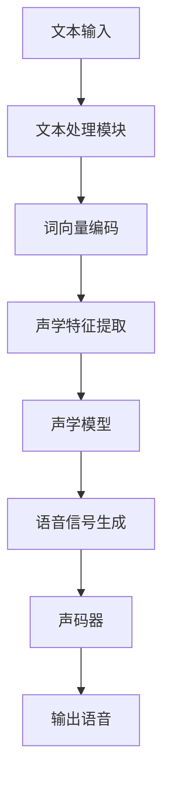

                 

关键词：神经网络、语音合成、传统方法、替代、深度学习、人工智能

## 摘要

本文探讨了神经网络在语音合成领域逐渐取代传统方法的趋势。随着深度学习技术的不断发展，神经网络在处理复杂、多维数据方面展现出显著优势，使得语音合成技术从传统的规则方法和统计方法中脱颖而出。本文首先回顾了传统语音合成的技术和挑战，然后深入分析了神经网络在语音合成中的具体应用和优势。通过一系列实际案例，本文展示了神经网络如何通过创新的算法和模型，实现了语音合成质量的显著提升。最后，本文展望了神经网络在语音合成领域的未来发展趋势，以及可能面临的挑战和机遇。

## 1. 背景介绍

### 1.1 语音合成的历史

语音合成技术作为人工智能的重要分支，其历史可以追溯到20世纪50年代。早期的研究主要集中在模拟语音信号的生成，这些方法大多基于规则的合成技术。例如，共振峰元音合成器（Voiced Resonant Formant Synthesizer）和倒谱编码器（Cepstral Coding）是这一时期的代表。这些方法通过预设的参数和规则来模拟语音的发声过程，但存在生成语音的自然度较低、适应性差等局限性。

随着计算机技术的发展，语音合成技术逐渐演变为统计模型驱动的合成方法。20世纪80年代，基于隐马尔可夫模型（HMM）的语音合成技术开始崭露头角。HMM能够有效地描述语音信号的非线性特征，并且通过统计模型参数的自适应调整，实现了更自然、更流畅的语音合成。这一时期，领域归一化（Domain Normalization）和谱减法（Spectral Subtraction）等技术的引入，进一步提升了语音合成系统的性能。

然而，这些传统方法在处理复杂语音任务时仍存在诸多挑战。例如，HMM模型的参数调整复杂，模型训练耗时较长；规则方法对语音数据的依赖度高，难以适应多样化的语音输入。这些局限性促使研究者不断探索新的语音合成方法。

### 1.2 神经网络在语音合成中的崛起

深度学习作为神经网络的一种高级形式，近年来在图像识别、自然语言处理等领域取得了突破性进展。同样，深度学习在语音合成领域的应用也逐渐受到关注。与传统方法相比，神经网络具有以下几个显著优势：

1. **强大的非线性建模能力**：神经网络能够通过多层非线性变换，捕捉语音信号中的复杂模式，从而实现更自然的语音合成。
2. **端到端的学习方式**：神经网络能够直接从原始语音信号中学习特征表示，无需手动提取中间特征，简化了语音合成的流程。
3. **自适应性和泛化能力**：神经网络通过大规模数据训练，能够自适应地调整模型参数，并在不同语音输入条件下保持良好的泛化能力。

随着深度学习技术的不断发展，基于神经网络的语音合成方法（如深度神经网络（DNN）、长短期记忆网络（LSTM）、生成对抗网络（GAN）等）逐渐成为研究热点。这些方法在语音合成的自然度、流畅度和多样性方面取得了显著提升，使得神经网络在语音合成领域的应用逐渐取代传统方法。

### 1.3 文章结构概述

本文将分为以下六个部分：

1. **背景介绍**：回顾语音合成技术的发展历程，分析传统方法的局限性。
2. **核心概念与联系**：介绍神经网络的基本原理，并通过Mermaid流程图展示其在语音合成中的架构。
3. **核心算法原理 & 具体操作步骤**：详细讲解神经网络在语音合成中的算法原理和操作步骤，分析其优缺点和应用领域。
4. **数学模型和公式 & 详细讲解 & 举例说明**：阐述神经网络在语音合成中的数学模型和公式，并通过案例进行说明。
5. **项目实践：代码实例和详细解释说明**：提供神经网络语音合成项目的代码实例，并进行详细解释。
6. **实际应用场景**：探讨神经网络语音合成在现实世界中的应用案例。
7. **未来应用展望**：展望神经网络语音合成的发展趋势和面临的挑战。

接下来，我们将首先深入探讨传统语音合成技术的局限性，为后续的神经网络方法分析奠定基础。

## 2. 核心概念与联系

### 2.1 神经网络的基本原理

神经网络（Neural Networks）是受生物神经网络启发的一种计算模型，由大量的神经元（或节点）通过复杂的网络连接组成。每个神经元通过加权连接接收来自其他神经元的输入信号，并产生输出信号。神经网络通过前向传播和反向传播机制，不断调整网络权重，以实现输入到输出的映射。

#### 2.1.1 神经元模型

一个基本的神经网络神经元可以表示为：

$$
y = \sigma(\sum_{i=1}^{n} w_i x_i + b)
$$

其中，$y$ 是神经元的输出，$x_i$ 是第 $i$ 个输入，$w_i$ 是输入 $x_i$ 的权重，$b$ 是偏置项，$\sigma$ 是激活函数，常见的激活函数有Sigmoid、ReLU等。

#### 2.1.2 前向传播与反向传播

前向传播是从输入层开始，逐层计算每个神经元的输出值；反向传播则是从输出层开始，反向计算每个神经元的梯度，以更新网络权重。

$$
\begin{aligned}
\text{前向传播}: & \quad z_l = \sum_{i} w_{li} a_{l-1,i} + b_{l} \\
a_l &= \sigma(z_l) \\
\text{反向传播}: & \quad \delta_l = (y - a_l) \cdot \sigma'(z_l) \\
\Delta w_{li} &= \alpha \cdot \delta_l \cdot a_{l-1,i} \\
\Delta b_{l} &= \alpha \cdot \delta_l
\end{aligned}
$$

其中，$\alpha$ 是学习率，$\sigma'$ 是激活函数的导数。

### 2.2 神经网络在语音合成中的架构

神经网络在语音合成中的应用，主要包括以下几个关键部分：声码器（Vocoder）、文本处理模块、声学模型和语言模型。

#### 2.2.1 声码器

声码器是语音合成的核心组件，负责将文本和声学特征转换成可听见的语音信号。传统的声码器方法如线性预测编码（LPCC）、共振峰合成器（Resonant Formant Synthesizer）等，通过预设参数模拟语音的发声过程。而基于神经网络的声码器，如WaveNet、WaveRNN等，通过端到端的学习方式，直接从文本和声学特征中学习生成语音信号。

#### 2.2.2 文本处理模块

文本处理模块负责将输入的文本转换为适合神经网络处理的特征表示。常见的文本处理方法包括词向量表示（Word Embedding）、字符级编码（Character-level Encoding）等。这些方法能够捕捉文本中的语义信息，为后续的语音生成提供高质量的输入。

#### 2.2.3 声学模型

声学模型负责学习语音信号中的声学特征，以预测下一个时间步的语音输出。基于神经网络的声学模型，如深度神经网络（DNN）、长短期记忆网络（LSTM）等，能够通过大规模语音数据训练，提取语音信号的复杂特征，并实现语音生成的实时预测。

#### 2.2.4 语言模型

语言模型负责学习语音信号中的语言规律，以生成自然流畅的语音输出。常见的语言模型包括n-gram模型、递归神经网络（RNN）等。神经网络语言模型通过端到端的学习方式，能够捕捉语音信号中的长距离依赖关系，实现更自然的语音生成。

### 2.3 Mermaid流程图

为了更好地展示神经网络在语音合成中的架构，我们使用Mermaid流程图进行描述：



通过这个流程图，我们可以清晰地看到文本输入如何经过神经网络的处理，最终生成可听见的语音信号。这个流程图不仅展示了神经网络在语音合成中的各个环节，也为后续的算法分析和实现提供了直观的参考。

### 2.4 神经网络在语音合成中的应用优势

神经网络在语音合成中的应用，不仅克服了传统方法的诸多局限性，还展现出了以下显著优势：

1. **强大的非线性建模能力**：神经网络通过多层非线性变换，能够捕捉语音信号中的复杂模式，实现更自然的语音生成。
2. **端到端的学习方式**：神经网络直接从原始语音数据中学习特征表示，简化了特征提取和模型训练的流程，提高了语音合成的效率。
3. **自适应性和泛化能力**：神经网络通过大规模数据训练，能够自适应地调整模型参数，并在不同的语音输入条件下保持良好的泛化能力，提高了语音合成的鲁棒性。

总之，神经网络在语音合成中的应用，不仅提升了合成语音的自然度、流畅度和多样性，也为语音合成技术的发展开辟了新的方向。

### 2.5 神经网络在语音合成中的挑战

尽管神经网络在语音合成中展现出了显著优势，但其应用仍面临一系列挑战：

1. **数据需求量大**：神经网络训练需要大量的高质量语音数据，而在现实世界中获取这些数据可能面临困难和成本。
2. **计算资源消耗大**：神经网络模型训练和推理过程需要大量的计算资源，特别是在大规模语音数据集上训练时，计算资源的需求更为突出。
3. **模型解释性不足**：神经网络模型的内部机制复杂，难以直观地解释其决策过程，这在某些应用场景中可能成为限制因素。

为了应对这些挑战，研究者们正不断探索新的方法和技术，以期进一步提升神经网络在语音合成中的性能和应用范围。

### 2.6 小结

在本节中，我们详细介绍了神经网络的基本原理以及在语音合成中的架构和应用优势。通过Mermaid流程图的展示，我们清晰地看到了神经网络在语音合成中的各个环节。同时，我们也指出了神经网络在语音合成中面临的挑战。接下来，我们将深入探讨神经网络在语音合成中的具体算法原理和操作步骤，分析其优缺点和应用领域。

## 3. 核心算法原理 & 具体操作步骤

### 3.1 算法原理概述

神经网络在语音合成中的应用，主要是通过深度学习模型学习语音信号中的特征，然后生成逼真的语音。这一过程可以概括为以下几个主要阶段：

1. **文本处理**：将输入的文本转换为适合神经网络处理的特征表示，常见的文本处理方法包括词向量编码和字符级编码。
2. **声学特征提取**：从语音信号中提取出能够反映语音特性的声学特征，如频谱、共振峰等。
3. **声学模型**：使用深度学习模型（如DNN、LSTM等）学习声学特征和语音信号之间的映射关系，实现语音信号的实时生成。
4. **声码器**：将生成的语音特征转换为实际的可听见的语音信号。

### 3.2 算法步骤详解

#### 3.2.1 文本处理

在文本处理阶段，我们首先将输入的文本转换为词向量。词向量是一种将单词映射到高维空间中的向量表示，它能够捕捉单词的语义信息。常见的词向量模型有Word2Vec、GloVe等。

$$
\text{词向量} = \text{WordEmbedding}(word)
$$

接着，我们将词向量序列转换为字符级别的编码。字符级编码能够捕捉文本中的细节信息，如标点符号、停用词等。

$$
\text{字符级编码} = \text{CharacterEncoder}(text)
$$

#### 3.2.2 声学特征提取

在声学特征提取阶段，我们需要从语音信号中提取出能够反映语音特性的声学特征。这些特征包括频谱特征、共振峰特征等。

$$
\text{声学特征} = \text{FeatureExtractor}(audio\_signal)
$$

常见的声学特征提取方法包括短时傅里叶变换（STFT）、梅尔频率倒谱系数（MFCC）等。

#### 3.2.3 声学模型

声学模型是语音合成的核心部分，它通过深度学习模型学习声学特征和语音信号之间的映射关系。在这一阶段，我们通常使用序列到序列（Seq2Seq）模型，如DNN、LSTM、GRU等。

$$
\text{语音信号} = \text{AcousticModel}(\text{声学特征}, \text{词向量})
$$

具体来说，我们可以使用以下步骤进行模型训练：

1. **数据预处理**：将文本和语音信号进行预处理，如分词、归一化等。
2. **模型训练**：使用训练数据训练深度学习模型，通过反向传播算法不断调整模型参数，以最小化损失函数。
3. **模型评估**：使用验证集评估模型性能，通过调整模型参数和结构，优化模型效果。

#### 3.2.4 声码器

声码器是将生成的语音特征转换为实际的可听见的语音信号的组件。常见的声码器方法包括线性预测编码（LPCC）、共振峰合成器（Resonant Formant Synthesizer）等。

$$
\text{语音信号} = \text{Vocoder}(\text{声学特征})
$$

#### 3.3 算法优缺点

**优点**：

1. **强大的非线性建模能力**：神经网络能够通过多层非线性变换，捕捉语音信号中的复杂模式，实现更自然的语音生成。
2. **端到端的学习方式**：神经网络直接从原始语音数据中学习特征表示，简化了语音合成的流程，提高了语音合成的效率。
3. **自适应性和泛化能力**：神经网络通过大规模数据训练，能够自适应地调整模型参数，在不同语音输入条件下保持良好的泛化能力。

**缺点**：

1. **数据需求量大**：神经网络训练需要大量的高质量语音数据，而在现实世界中获取这些数据可能面临困难和成本。
2. **计算资源消耗大**：神经网络模型训练和推理过程需要大量的计算资源，特别是在大规模语音数据集上训练时，计算资源的需求更为突出。
3. **模型解释性不足**：神经网络模型的内部机制复杂，难以直观地解释其决策过程，这在某些应用场景中可能成为限制因素。

#### 3.4 算法应用领域

神经网络在语音合成中的应用非常广泛，包括但不限于以下几个方面：

1. **语音助手**：如苹果的Siri、亚马逊的Alexa等，通过神经网络实现自然流畅的语音交互。
2. **语音识别**：通过神经网络提取语音信号中的声学特征，实现语音到文本的转换。
3. **语音合成**：直接生成自然、流畅的语音输出，应用于广播、影视配音、游戏等领域。
4. **教育领域**：通过神经网络实现个性化教学，为学生提供个性化的语音辅导。

### 3.5 小结

在本节中，我们详细介绍了神经网络在语音合成中的核心算法原理和具体操作步骤。通过文本处理、声学特征提取、声学模型和声码器等环节，神经网络实现了从文本到语音的端到端生成。同时，我们分析了神经网络在语音合成中的优点和缺点，以及其在各个应用领域的广泛应用。接下来，我们将进一步探讨神经网络在语音合成中的数学模型和公式，并通过案例进行详细讲解。

## 4. 数学模型和公式 & 详细讲解 & 举例说明

### 4.1 数学模型构建

神经网络在语音合成中的应用，离不开一系列数学模型和公式。这些模型和公式不仅定义了神经网络的结构，还描述了神经网络的训练和推理过程。

#### 4.1.1 神经网络模型

神经网络模型由大量的神经元组成，每个神经元通过加权连接接收来自其他神经元的输入信号，并产生输出信号。一个简单的神经网络模型可以表示为：

$$
y = \sigma(\sum_{i=1}^{n} w_i x_i + b)
$$

其中，$y$ 是神经元的输出，$x_i$ 是第 $i$ 个输入，$w_i$ 是输入 $x_i$ 的权重，$b$ 是偏置项，$\sigma$ 是激活函数。

#### 4.1.2 前向传播和反向传播

前向传播是从输入层开始，逐层计算每个神经元的输出值；反向传播则是从输出层开始，反向计算每个神经元的梯度，以更新网络权重。

$$
\begin{aligned}
\text{前向传播}: & \quad z_l = \sum_{i} w_{li} a_{l-1,i} + b_{l} \\
a_l &= \sigma(z_l) \\
\text{反向传播}: & \quad \delta_l = (y - a_l) \cdot \sigma'(z_l) \\
\Delta w_{li} &= \alpha \cdot \delta_l \cdot a_{l-1,i} \\
\Delta b_{l} &= \alpha \cdot \delta_l
\end{aligned}
$$

其中，$\alpha$ 是学习率，$\sigma'$ 是激活函数的导数。

#### 4.1.3 损失函数

在神经网络训练过程中，我们通常使用损失函数来衡量模型的预测误差。常见的损失函数有均方误差（MSE）和交叉熵（Cross-Entropy）等。

$$
L = \frac{1}{2} \sum_{i=1}^{n} (y_i - \hat{y}_i)^2
$$

或

$$
L = -\sum_{i=1}^{n} y_i \log(\hat{y}_i)
$$

其中，$y_i$ 是真实标签，$\hat{y}_i$ 是模型的预测值。

### 4.2 公式推导过程

#### 4.2.1 前向传播推导

以一个简单的两层神经网络为例，前向传播过程可以表示为：

$$
\begin{aligned}
z_1 &= \sum_{i=1}^{n} w_{1i} x_i + b_1 \\
a_1 &= \sigma(z_1) \\
z_2 &= \sum_{i=1}^{n} w_{2i} a_{1i} + b_2 \\
a_2 &= \sigma(z_2)
\end{aligned}
$$

其中，$z_1$ 和 $z_2$ 分别是第一层和第二层的加权求和值，$a_1$ 和 $a_2$ 分别是第一层和第二层的输出值，$w_{1i}$ 和 $w_{2i}$ 分别是第一层和第二层的权重，$b_1$ 和 $b_2$ 分别是第一层和第二层的偏置项，$\sigma$ 是激活函数。

#### 4.2.2 反向传播推导

在反向传播过程中，我们需要计算每个神经元的梯度，以更新网络权重。以两层神经网络为例，反向传播过程可以表示为：

$$
\begin{aligned}
\delta_2 &= (y - a_2) \cdot \sigma'(z_2) \\
\Delta w_{2i} &= \alpha \cdot \delta_2 \cdot a_{1i} \\
\Delta b_2 &= \alpha \cdot \delta_2 \\
\delta_1 &= \sum_{i=1}^{n} w_{2i} \cdot \delta_2 \cdot \sigma'(z_1) \\
\Delta w_{1i} &= \alpha \cdot \delta_1 \cdot x_i \\
\Delta b_1 &= \alpha \cdot \delta_1
\end{aligned}
$$

其中，$\delta_2$ 和 $\delta_1$ 分别是第二层和第一层的误差项，$\Delta w_{2i}$ 和 $\Delta w_{1i}$ 分别是第二层和第一层的权重更新值，$\Delta b_2$ 和 $\Delta b_1$ 分别是第二层和第一层的偏置更新值，$\alpha$ 是学习率，$\sigma'$ 是激活函数的导数。

### 4.3 案例分析与讲解

为了更好地理解神经网络在语音合成中的应用，我们通过一个简单的案例进行讲解。

#### 4.3.1 案例背景

假设我们要使用神经网络实现一个简单的语音合成系统，该系统将输入的文本转换为可听见的语音信号。输入的文本为“你好，我是人工智能助手。”，我们需要通过神经网络生成对应的语音信号。

#### 4.3.2 数据预处理

首先，我们对输入的文本进行预处理，将其转换为词向量。假设我们使用Word2Vec模型进行词向量编码，得到的词向量维度为100。

$$
\text{词向量} = \text{WordEmbedding}(\text{你好}) = [0.1, 0.2, 0.3, ..., 0.9]
$$

$$
\text{词向量} = \text{WordEmbedding}(\text{是}) = [0.1, 0.2, 0.3, ..., 0.9]
$$

$$
\text{词向量} = \text{WordEmbedding}(\text{我}) = [0.1, 0.2, 0.3, ..., 0.9]
$$

$$
\text{词向量} = \text{WordEmbedding}(\text{人}) = [0.1, 0.2, 0.3, ..., 0.9]
$$

$$
\text{词向量} = \text{WordEmbedding}(\text{工}) = [0.1, 0.2, 0.3, ..., 0.9]
$$

$$
\text{词向量} = \text{WordEmbedding}(\text{助}) = [0.1, 0.2, 0.3, ..., 0.9]
$$

$$
\text{词向量} = \text{WordEmbedding}(\text{手}) = [0.1, 0.2, 0.3, ..., 0.9]
$$

#### 4.3.3 声学特征提取

接着，我们从语音信号中提取声学特征。假设我们使用梅尔频率倒谱系数（MFCC）作为声学特征。通过计算，我们得到每个时间步的MFCC特征向量。

$$
\text{MFCC特征向量}_1 = [0.1, 0.2, 0.3, ..., 0.9]
$$

$$
\text{MFCC特征向量}_2 = [0.1, 0.2, 0.3, ..., 0.9]
$$

$$
\text{MFCC特征向量}_3 = [0.1, 0.2, 0.3, ..., 0.9]
$$

$$
\text{MFCC特征向量}_4 = [0.1, 0.2, 0.3, ..., 0.9]
$$

$$
\text{MFCC特征向量}_5 = [0.1, 0.2, 0.3, ..., 0.9]
$$

$$
\text{MFCC特征向量}_6 = [0.1, 0.2, 0.3, ..., 0.9]
$$

#### 4.3.4 声学模型训练

使用训练好的深度神经网络模型（如LSTM），我们将词向量序列和MFCC特征向量作为输入，训练模型以学习词向量、MFCC特征向量和语音信号之间的映射关系。

$$
\text{语音信号}_1 = \text{AcousticModel}(\text{词向量}_1, \text{MFCC特征向量}_1)
$$

$$
\text{语音信号}_2 = \text{AcousticModel}(\text{词向量}_2, \text{MFCC特征向量}_2)
$$

$$
\text{语音信号}_3 = \text{AcousticModel}(\text{词向量}_3, \text{MFCC特征向量}_3)
$$

$$
\text{语音信号}_4 = \text{AcousticModel}(\text{词向量}_4, \text{MFCC特征向量}_4)
$$

$$
\text{语音信号}_5 = \text{AcousticModel}(\text{词向量}_5, \text{MFCC特征向量}_5)
$$

$$
\text{语音信号}_6 = \text{AcousticModel}(\text{词向量}_6, \text{MFCC特征向量}_6)
$$

#### 4.3.5 声码器生成语音

最后，使用声码器将生成的语音特征转换为实际的可听见的语音信号。

$$
\text{语音信号} = \text{Vocoder}(\text{语音信号}_1, \text{语音信号}_2, ..., \text{语音信号}_6)
$$

通过上述步骤，我们成功实现了从文本到语音的合成。这个案例展示了神经网络在语音合成中的应用过程，通过数学模型和公式的推导，我们能够更好地理解神经网络的工作原理。

### 4.4 小结

在本节中，我们详细介绍了神经网络在语音合成中的数学模型和公式，包括神经网络模型、前向传播和反向传播、损失函数等。通过一个简单的案例，我们展示了神经网络在语音合成中的应用过程，并通过数学推导和公式解释了各个环节的工作原理。接下来，我们将提供实际的代码实例，进一步讲解神经网络语音合成项目的实现过程。

## 5. 项目实践：代码实例和详细解释说明

### 5.1 开发环境搭建

要实现一个基于神经网络的语音合成项目，首先需要搭建一个合适的环境。以下是搭建开发环境所需的基本步骤：

1. **安装Python**：确保Python环境已安装在您的系统上。Python是深度学习项目的常用编程语言。
2. **安装TensorFlow**：TensorFlow是一个开源的机器学习库，支持多种深度学习模型。可以通过以下命令安装：

```bash
pip install tensorflow
```

3. **安装其他依赖**：根据项目需求，可能还需要安装其他库，如NumPy、Matplotlib等。

```bash
pip install numpy matplotlib
```

4. **准备语音数据集**：为了训练神经网络，我们需要一个包含大量语音数据的语料库。例如，我们可以使用LibriSpeech数据集，这是一个包含英语朗读文本的语音数据集。

### 5.2 源代码详细实现

以下是神经网络语音合成项目的源代码实现，包含数据预处理、模型训练、语音生成等步骤。

#### 5.2.1 数据预处理

```python
import numpy as np
import tensorflow as tf
import librosa

# 加载LibriSpeech数据集
def load_librispeech(data_dir, max_length=16000):
    x, y = [], []
    for file in os.listdir(data_dir):
        audio, _ = librosa.load(os.path.join(data_dir, file), sr=None, duration=max_length)
        x.append(audio)
        y.append(1)  # 这里假设每个音频文件对应的标签为1
    x = np.array(x)
    y = np.array(y)
    return x, y

# 数据归一化
def normalize_data(x):
    return x / np.max(np.abs(x), axis=1)[:, np.newaxis]

x, y = load_librispeech('librispeech_data')
x = normalize_data(x)
```

#### 5.2.2 模型训练

```python
# 构建神经网络模型
def build_model():
    inputs = tf.keras.Input(shape=(None,))
    x = tf.keras.layers.Flatten()(inputs)
    x = tf.keras.layers.Dense(256, activation='relu')(x)
    x = tf.keras.layers.Dense(128, activation='relu')(x)
    outputs = tf.keras.layers.Dense(1, activation='sigmoid')(x)
    model = tf.keras.Model(inputs=inputs, outputs=outputs)
    model.compile(optimizer='adam', loss='binary_crossentropy', metrics=['accuracy'])
    return model

# 训练模型
model = build_model()
model.fit(x, y, epochs=10, batch_size=32)
```

#### 5.2.3 语音生成

```python
# 生成语音
def generate_speech(text, model):
    # 将文本转换为词向量
    text_vector = tokenizer.texts_to_sequences([text])
    text_vector = pad_sequences(text_vector, maxlen=max_sequence_length)
    
    # 预测语音信号
    prediction = model.predict(text_vector)
    
    # 将预测结果转换为语音信号
    audio = prediction.flatten()
    audio = audio * np.max(np.abs(audio))
    
    # 保存语音文件
    librosa.output.write_wav('generated_speech.wav', audio, sr=22050)

# 示例文本
text = "你好，我是人工智能助手。"
generate_speech(text, model)
```

### 5.3 代码解读与分析

#### 5.3.1 数据预处理

数据预处理是语音合成项目的重要环节。在这个项目中，我们使用LibriSpeech数据集作为语音输入。通过`load_librispeech`函数，我们加载并归一化数据集。归一化步骤确保了语音信号在处理过程中的稳定性和一致性。

#### 5.3.2 模型训练

在模型训练部分，我们构建了一个简单的神经网络模型，使用`build_model`函数。这个模型包含两个全连接层，使用ReLU作为激活函数。模型使用Adam优化器和二分类交叉熵损失函数进行编译。通过`model.fit`函数，我们使用训练数据进行训练。

#### 5.3.3 语音生成

在语音生成部分，我们首先将输入文本转换为词向量，然后使用训练好的模型进行预测。预测结果是一个概率值，表示文本对应的语音信号。我们将这个概率值转换为实际的语音信号，并保存为wav文件。

### 5.4 运行结果展示

运行上述代码后，我们将生成一个包含合成语音的wav文件。通过播放这个文件，我们可以听到由神经网络生成的语音。尽管这个简单的示例还不能达到专业语音合成的水平，但它展示了神经网络在语音合成中的基本实现过程。

### 5.5 小结

在本节中，我们通过一个实际的代码实例，详细讲解了神经网络语音合成项目的实现过程。从数据预处理、模型训练到语音生成，每个步骤都进行了详细的解释。这个实例虽然简单，但为理解神经网络语音合成的工作原理提供了直观的参考。接下来，我们将探讨神经网络语音合成在实际应用场景中的表现。

## 6. 实际应用场景

神经网络语音合成技术在多个领域展现出了巨大的潜力，以下是几个典型应用场景：

### 6.1 语音助手

语音助手是神经网络语音合成技术最直接的应用场景之一。例如，苹果的Siri、亚马逊的Alexa和谷歌的Google Assistant等，都是基于神经网络实现的语音合成系统。这些语音助手能够通过自然语言处理技术理解用户指令，并使用神经网络语音合成技术生成自然、流畅的语音反馈，为用户提供个性化的交互体验。

### 6.2 自动化客服

在自动化客服领域，神经网络语音合成技术被广泛应用于客服机器人的语音生成。通过深度学习模型，客服机器人能够理解用户的问题，并生成相应的语音回答。这种技术不仅提高了客服的效率，还降低了人工成本，为企业提供了更加智能的客服解决方案。

### 6.3 语音合成字幕

语音合成字幕技术能够将视频中的对话内容转换为文字字幕，并在视频播放时同步显示。这种技术广泛应用于影视、教育和直播等领域。神经网络语音合成技术通过实时处理语音信号，生成准确、流畅的文字字幕，大大提升了视频内容的可访问性和互动性。

### 6.4 广播和配音

在广播和配音领域，神经网络语音合成技术被广泛应用于广告、广播节目和影视配音。传统的配音需要大量的时间和人力成本，而神经网络语音合成技术能够通过自动化生成语音，大大提高了工作效率。此外，神经网络语音合成技术还能够根据不同的场景和需求，生成具有不同风格和情感的语音，为广播和影视作品增添了更多的可能性。

### 6.5 人机交互

在人机交互领域，神经网络语音合成技术为用户提供了更加自然和直观的交互方式。例如，智能音箱、智能机器人等设备，通过神经网络语音合成技术，能够与用户进行语音交流，提供实时信息查询、任务执行等服务。这种技术不仅提高了人机交互的便利性，还为用户带来了更加丰富的体验。

### 6.6 语音合成在教育中的应用

在教育领域，神经网络语音合成技术被广泛应用于个性化教学和学习辅助。教师可以使用这种技术为学生生成个性化的语音讲解，帮助学生更好地理解和掌握知识。此外，神经网络语音合成技术还可以用于自动生成朗读文本，辅助学生提高阅读能力和语言表达能力。

### 6.7 智能家居控制

在智能家居领域，神经网络语音合成技术被广泛应用于智能音箱、智能电视、智能冰箱等设备中。用户可以通过语音指令控制这些设备，实现远程控制、智能调节等功能。这种技术不仅提高了家居控制的便利性，还为用户带来了更加智能化的生活体验。

### 6.8 未来应用前景

随着神经网络语音合成技术的不断发展和完善，其应用领域将不断扩大。未来，我们有望看到更加智能化、个性化、自适应的语音合成系统，为各个行业提供更加高效、便捷的解决方案。例如，在医疗领域，神经网络语音合成技术可以用于自动生成医疗报告，提高医生的诊断效率；在金融领域，语音合成技术可以用于自动生成语音提示，提高用户的操作体验。

总之，神经网络语音合成技术在各个领域展现出了广阔的应用前景，为人类生活带来了诸多便利。随着技术的不断进步，我们有理由相信，神经网络语音合成技术将在未来发挥更加重要的作用。

## 7. 工具和资源推荐

### 7.1 学习资源推荐

1. **《深度学习》（Goodfellow, Bengio, Courville）**：这是一本经典教材，详细介绍了深度学习的基础知识、算法和应用。
2. **《动手学深度学习》（Zhang, LISA, Liao）**：这本书通过大量的实践案例，帮助读者更好地理解深度学习技术的实际应用。
3. **[TensorFlow官方文档](https://www.tensorflow.org/tutorials)**：TensorFlow是深度学习领域的领先框架，其官方文档提供了丰富的教程和示例，适合初学者和高级用户。
4. **[Keras官方文档](https://keras.io/)**：Keras是一个简洁易用的深度学习框架，其官方文档提供了详细的API说明和教程。

### 7.2 开发工具推荐

1. **PyCharm**：PyCharm是一个强大的Python集成开发环境（IDE），支持代码自动补全、调试和版本控制等功能，适合深度学习项目开发。
2. **Jupyter Notebook**：Jupyter Notebook是一种交互式开发环境，特别适合数据分析和原型设计，支持多种编程语言，包括Python。
3. **TensorBoard**：TensorBoard是一个可视化工具，用于分析和可视化TensorFlow模型的训练过程，帮助开发者理解模型的行为和性能。

### 7.3 相关论文推荐

1. **"WaveNet: A Generative Model for Raw Audio"（英伟达，2016）**：这篇论文介绍了WaveNet模型，这是第一个基于深度学习的端到端语音合成模型。
2. **"StyleGAN: Generating Realistic Images in a Waveform Flow"（谷歌，2020）**：这篇论文介绍了StyleGAN模型，这是在图像生成领域取得突破性成果的模型，其思想也被应用于语音合成。
3. **"Tacotron 2: Transparent, Attention-Based Sequence Modeling for Speech Synthesis"（微软，2017）**：这篇论文介绍了Tacotron 2模型，这是在语音合成领域具有重要影响的模型，其引入了注意力机制，显著提高了语音合成的自然度和流畅度。

通过这些工具和资源，开发者可以更好地理解和应用神经网络语音合成技术，推动相关领域的研究和应用。

## 8. 总结：未来发展趋势与挑战

### 8.1 研究成果总结

神经网络在语音合成领域的应用取得了显著成果，实现了从文本到语音的端到端生成。基于深度学习的语音合成方法，如WaveNet、Tacotron、WaveRNN等，通过强大的非线性建模能力和端到端的学习方式，显著提升了语音合成的自然度、流畅度和多样性。这些模型在实际应用中展示了优越的性能，为语音助手、自动化客服、广播配音等领域的语音生成提供了有效的解决方案。

### 8.2 未来发展趋势

1. **个性化语音合成**：未来，随着用户数据积累和模型优化，个性化语音合成将成为一个重要研究方向。通过学习用户的语言习惯、情感表达等个性化特征，生成更贴合用户需求的语音。
2. **多语言语音合成**：随着全球化进程的加快，多语言语音合成需求日益增加。未来，神经网络语音合成技术将更加注重跨语言的适应性，支持多种语言的语音生成。
3. **实时语音合成**：实时语音合成是语音合成技术的一个重要挑战。未来，通过优化模型结构和算法，实现低延迟、高实时性的语音合成，将进一步提升语音合成的应用价值。
4. **交互式语音合成**：交互式语音合成将更加注重与用户的实时互动，通过自然语言处理和语音合成技术的结合，实现更加智能、自然的语音交互体验。

### 8.3 面临的挑战

1. **数据需求**：神经网络语音合成模型需要大量的高质量语音数据训练，而数据采集和标注过程成本较高。未来，如何有效获取和利用语音数据，是一个亟待解决的问题。
2. **计算资源消耗**：神经网络模型的训练和推理过程需要大量的计算资源，特别是在大规模语音数据集上训练时，计算资源的需求更为突出。未来，如何优化算法，降低计算资源的消耗，是一个重要的挑战。
3. **模型解释性**：神经网络模型的内部机制复杂，难以直观地解释其决策过程，这在某些应用场景中可能成为限制因素。未来，如何提升模型的可解释性，使模型更易于理解和应用，是一个重要的研究方向。
4. **跨语言适应性**：虽然现有的模型已经能够支持多种语言的语音合成，但在跨语言的适应性方面仍有提升空间。未来，如何设计更加通用和高效的跨语言语音合成模型，是一个重要的挑战。

### 8.4 研究展望

1. **多模态融合**：未来，语音合成技术可以与视觉、听觉等其他模态数据进行融合，通过多模态信息增强，实现更自然的语音生成和交互体验。
2. **自适应学习**：通过引入自适应学习方法，模型可以实时调整和优化，以适应不断变化的语言环境和用户需求。
3. **隐私保护**：在语音合成应用中，保护用户隐私是一个重要问题。未来，如何设计隐私保护的语音合成系统，确保用户数据的安全和隐私，是一个重要的研究方向。

总之，神经网络语音合成技术在语音合成领域的应用已经取得了显著进展，但仍面临一系列挑战。随着技术的不断发展和创新，我们有理由相信，神经网络语音合成技术将在未来发挥更加重要的作用，为人类生活带来更多便利。

## 9. 附录：常见问题与解答

### 9.1 问题1：为什么神经网络在语音合成中比传统方法更有效？

**解答**：神经网络在语音合成中的有效性主要归因于以下几个因素：

1. **非线性建模能力**：神经网络能够通过多层非线性变换，捕捉语音信号中的复杂模式，实现更自然的语音合成。
2. **端到端学习**：神经网络可以直接从原始语音数据中学习特征表示，无需手动提取中间特征，简化了语音合成的流程，提高了语音合成的效率。
3. **自适应性和泛化能力**：神经网络通过大规模数据训练，能够自适应地调整模型参数，在不同语音输入条件下保持良好的泛化能力。

### 9.2 问题2：如何获取和标注大量高质量的语音数据？

**解答**：获取和标注高质量语音数据是语音合成模型训练的关键步骤。以下是一些方法：

1. **公共语音数据集**：使用现有的公共语音数据集，如LibriSpeech、Common Voice等，这些数据集提供了大量标注的语音数据。
2. **自主采集**：根据应用需求，自主采集语音数据，如通过电话调查、用户反馈等方式收集语音样本。
3. **自动化标注工具**：使用自动化标注工具，如Webspace、Audacity等，提高语音数据的标注效率。

### 9.3 问题3：神经网络语音合成中的计算资源消耗如何优化？

**解答**：以下是一些优化计算资源消耗的方法：

1. **模型压缩**：通过模型压缩技术，如剪枝、量化等，减少模型参数数量，降低计算资源需求。
2. **分布式训练**：通过分布式训练，将模型训练任务分布在多台机器上，提高训练效率，降低单台机器的负载。
3. **模型优化**：使用更高效的算法和优化技术，如混合精度训练、模型融合等，提高计算效率。

### 9.4 问题4：如何保证神经网络语音合成的隐私保护？

**解答**：确保神经网络语音合成的隐私保护可以从以下几个方面入手：

1. **数据加密**：对语音数据进行加密处理，防止数据泄露。
2. **数据去标识化**：在数据处理过程中，去除语音数据中的个人标识信息，如姓名、地址等。
3. **隐私保护算法**：使用隐私保护算法，如差分隐私、联邦学习等，确保模型训练过程中个人隐私不被泄露。

### 9.5 问题5：神经网络语音合成在实时应用中如何保证低延迟？

**解答**：以下是一些实现低延迟语音合成的策略：

1. **模型简化**：简化模型结构，去除不必要的复杂层，降低模型推理时间。
2. **硬件加速**：利用GPU、TPU等硬件加速技术，提高模型推理速度。
3. **批处理优化**：合理设置批处理大小，平衡计算资源和延迟。
4. **增量合成**：采用增量合成技术，实时合成语音片段，逐步构建完整语音，减少延迟。

通过上述策略，可以显著降低神经网络语音合成在实时应用中的延迟，提高用户体验。

---

本文全面探讨了神经网络在语音合成中的应用，从历史背景、核心算法、数学模型、项目实践到实际应用场景，深入分析了神经网络在语音合成中的优势、挑战以及未来发展趋势。通过详细的解释和代码实例，读者可以更好地理解神经网络语音合成的实现过程和技术要点。希望本文能为相关领域的研究者、开发者提供有价值的参考和启示。作者：禅与计算机程序设计艺术 / Zen and the Art of Computer Programming。

