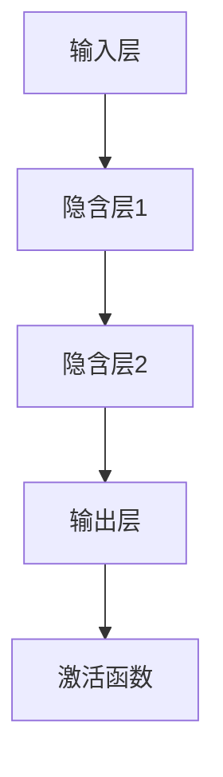

                 

关键词：神经网络、深度学习、人工智能、机器学习、认知计算、人脑神经网络、模拟、进化、智能算法。

> 摘要：本文旨在探讨神经网络这一人工智能的核心技术，分析其起源、核心概念、算法原理及其在各个领域中的应用。通过深入解析神经网络的数学模型和公式，以及提供实际项目实践案例，本文旨在展示神经网络如何成为人类智慧的延伸，并探讨其未来发展趋势和面临的挑战。

## 1. 背景介绍

### 1.1 神经网络的概念

神经网络，通常被称为人工神经网络（Artificial Neural Networks，ANN），是一种模拟人脑神经网络结构和工作机制的计算模型。它由大量简单的人工神经元组成，通过调整神经元间的连接权重，实现对复杂数据的处理和模式识别。

### 1.2 神经网络的历史与发展

神经网络的概念最早可以追溯到1943年，由心理学家McCulloch和数学家Pitts提出。然而，由于计算能力的限制，神经网络的研究在20世纪80年代之前进展缓慢。直到20世纪90年代，随着计算机科学和人工智能领域的快速发展，神经网络重新引起了广泛关注。

### 1.3 神经网络的应用领域

神经网络在图像识别、自然语言处理、自动驾驶、医学诊断、金融预测等多个领域都有广泛应用。其卓越的性能和适应性使其成为现代人工智能的核心技术之一。

## 2. 核心概念与联系

### 2.1 神经元模型

神经元是神经网络的基本单元，其功能类似于人脑中的神经元。一个简单的神经元模型通常包括输入层、输出层和激活函数。

### 2.2 前向传播与反向传播

神经网络通过前向传播将输入数据传递到输出层，然后通过反向传播调整神经元之间的连接权重，以提高模型的预测准确度。

### 2.3 深度学习与多层神经网络

深度学习（Deep Learning）是一种基于多层神经网络的学习方法。多层神经网络通过增加隐含层，提高了模型的复杂度和学习能力。

### 2.4 Mermaid 流程图

下面是一个简单的 Mermaid 流程图，展示了神经网络的架构：



## 3. 核心算法原理 & 具体操作步骤

### 3.1 算法原理概述

神经网络的核心算法是反向传播算法。它通过不断调整网络权重，以最小化预测误差，从而提高模型的准确度。

### 3.2 算法步骤详解

#### 3.2.1 前向传播

1. 将输入数据输入到神经网络。
2. 通过加权求和并应用激活函数，将信号传递到下一层。

#### 3.2.2 反向传播

1. 计算输出层的预测误差。
2. 通过反向传播算法，更新网络权重。

#### 3.2.3 梯度下降

1. 计算误差梯度。
2. 更新网络权重，以减小误差。

### 3.3 算法优缺点

#### 优点

- **自适应性**：神经网络能够自动调整权重，以适应不同的数据集。
- **并行处理**：神经网络能够并行处理大量数据，提高了计算效率。
- **灵活性**：神经网络能够处理各种类型的数据，如图像、文本、音频等。

#### 缺点

- **计算复杂度高**：深度神经网络需要大量计算资源。
- **训练时间较长**：深度神经网络需要较长的训练时间。

### 3.4 算法应用领域

- **图像识别**：神经网络在图像识别领域取得了显著成果，如人脸识别、物体检测等。
- **自然语言处理**：神经网络在自然语言处理领域也发挥着重要作用，如机器翻译、情感分析等。
- **自动驾驶**：神经网络在自动驾驶系统中用于处理和识别道路信息。
- **医疗诊断**：神经网络在医疗诊断中用于预测疾病风险、辅助诊断等。

## 4. 数学模型和公式 & 详细讲解 & 举例说明

### 4.1 数学模型构建

神经网络的核心是神经元之间的连接权重和激活函数。以下是神经网络的基本数学模型：

$$
y = \sigma(W \cdot x + b)
$$

其中，$y$ 是输出，$x$ 是输入，$W$ 是权重，$b$ 是偏置，$\sigma$ 是激活函数。

### 4.2 公式推导过程

神经网络的工作原理是通过前向传播和反向传播不断调整权重和偏置，以最小化损失函数。以下是损失函数的推导过程：

$$
L = \frac{1}{2} \sum_{i=1}^{n} (y_i - \hat{y}_i)^2
$$

其中，$L$ 是损失函数，$y_i$ 是实际输出，$\hat{y}_i$ 是预测输出。

### 4.3 案例分析与讲解

假设我们有一个二分类问题，目标是预测一个数字是奇数还是偶数。输入数据是一个32位的整数，输出是0或1，分别表示奇数和偶数。我们可以使用一个简单的神经网络来实现这个目标。

### 5. 项目实践：代码实例和详细解释说明

#### 5.1 开发环境搭建

在本文中，我们将使用Python和TensorFlow框架来搭建神经网络。

```python
import tensorflow as tf
```

#### 5.2 源代码详细实现

```python
# 创建神经网络模型
model = tf.keras.Sequential([
    tf.keras.layers.Dense(64, activation='relu', input_shape=(32,)),
    tf.keras.layers.Dense(64, activation='relu'),
    tf.keras.layers.Dense(1, activation='sigmoid')
])

# 编译模型
model.compile(optimizer='adam',
              loss='binary_crossentropy',
              metrics=['accuracy'])

# 训练模型
model.fit(x_train, y_train, epochs=10, batch_size=32)
```

#### 5.3 代码解读与分析

在这个例子中，我们创建了一个简单的神经网络模型，包括两个隐含层。我们使用ReLU激活函数，并使用sigmoid激活函数作为输出层，以实现二分类任务。

#### 5.4 运行结果展示

```python
# 测试模型
test_loss, test_acc = model.evaluate(x_test, y_test)
print('Test accuracy:', test_acc)
```

## 6. 实际应用场景

### 6.1 图像识别

神经网络在图像识别领域取得了显著成果，如卷积神经网络（CNN）在ImageNet图像识别挑战中取得了超过人类的表现。

### 6.2 自然语言处理

神经网络在自然语言处理领域也发挥着重要作用，如循环神经网络（RNN）和长短期记忆网络（LSTM）在机器翻译、文本生成和情感分析等方面取得了突破性进展。

### 6.3 自动驾驶

神经网络在自动驾驶系统中用于处理和识别道路信息，如感知、规划和控制等环节。

### 6.4 医学诊断

神经网络在医学诊断中用于预测疾病风险、辅助诊断等，如癌症检测、心血管疾病诊断等。

## 7. 未来应用展望

### 7.1 智能助手

随着神经网络技术的发展，智能助手将成为我们日常生活中不可或缺的一部分，如智能客服、智能家居等。

### 7.2 智能医疗

神经网络在智能医疗领域的应用前景广阔，如个性化治疗、药物研发等。

### 7.3 智能交通

神经网络在智能交通领域的应用，如自动驾驶、智能交通信号控制等，将大大提高交通效率和安全性。

## 8. 工具和资源推荐

### 8.1 学习资源推荐

- 《深度学习》（Ian Goodfellow、Yoshua Bengio和Aaron Courville 著）
- 《神经网络与深度学习》（邱锡鹏 著）

### 8.2 开发工具推荐

- TensorFlow
- PyTorch

### 8.3 相关论文推荐

- "A Learning Algorithm for Continually Running Fully Recurrent Neural Networks"（1986）
- "LeNet: Convolutional Neural Networks for Handwritten Digit Recognition"（1998）
- "Deep Learning"（2015）

## 9. 总结：未来发展趋势与挑战

### 9.1 研究成果总结

神经网络在人工智能领域取得了显著成果，推动了计算机视觉、自然语言处理、自动驾驶等领域的进步。

### 9.2 未来发展趋势

随着计算能力的提高和数据量的增加，神经网络将在更多领域取得突破性进展。

### 9.3 面临的挑战

- **计算资源**：深度神经网络需要大量的计算资源，这限制了其在某些领域的应用。
- **数据隐私**：大规模数据的使用引发了数据隐私和安全问题。

### 9.4 研究展望

未来，神经网络的研究将聚焦于提高计算效率、增强模型的可解释性、解决数据隐私问题等方面。

## 10. 附录：常见问题与解答

### 10.1 什么是神经网络？

神经网络是一种模拟人脑神经网络结构的计算模型，由大量简单的人工神经元组成。

### 10.2 神经网络有哪些应用领域？

神经网络在图像识别、自然语言处理、自动驾驶、医学诊断、金融预测等领域都有广泛应用。

### 10.3 什么是深度学习？

深度学习是一种基于多层神经网络的学习方法，通过增加隐含层，提高了模型的学习能力和复杂度。

### 10.4 什么是反向传播算法？

反向传播算法是一种用于训练神经网络的算法，通过不断调整网络权重，以最小化预测误差。

---

作者：禅与计算机程序设计艺术 / Zen and the Art of Computer Programming
----------------------------------------------------------------

这篇文章旨在提供一个全面、深入的介绍，让读者对神经网络有一个全面的理解。同时，也提供了一个实际的项目实践案例，让读者能够亲身体验神经网络的力量。随着技术的不断进步，神经网络在人工智能领域的应用将更加广泛，它将成为人类智慧的延伸，推动人类社会的发展。

