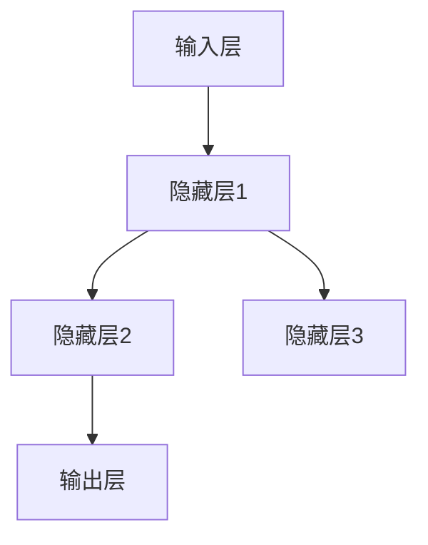
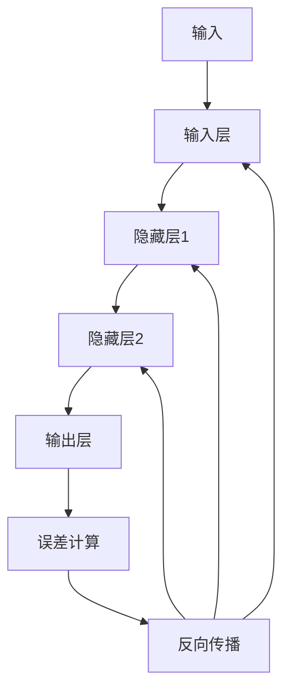

                 

关键词：神经网络、深度学习、机器学习、人工智能、神经网络架构、神经网络算法、反向传播算法、神经网络应用领域、数学模型、代码实例

> 摘要：本文将深入探讨神经网络这一机器学习核心技术的原理、算法和应用，通过详细的分析和代码实例，帮助读者理解神经网络如何解放人类智慧，为人工智能领域带来革命性变化。

## 1. 背景介绍

### 1.1  神经网络的发展历程

神经网络起源于20世纪40年代，最初由心理学家和数学家提出，旨在模拟人脑的计算方式。自20世纪80年代以来，随着计算机性能的不断提升和大数据技术的崛起，神经网络逐渐成为机器学习领域的研究热点。1998年，Hinton等人提出了深度信念网络（Deep Belief Network, DBN），标志着深度学习时代的到来。近年来，卷积神经网络（Convolutional Neural Network, CNN）和递归神经网络（Recurrent Neural Network, RNN）等深度学习模型在图像识别、语音识别和自然语言处理等领域取得了显著的成果。

### 1.2  神经网络的重要性

神经网络作为人工智能的核心技术之一，具有模拟人脑思维过程、处理复杂数据和自主学习的能力。随着互联网的普及和数据爆炸，神经网络在各个领域得到了广泛应用，从自动驾驶、医疗诊断到金融分析、推荐系统，无不显示出其巨大的潜力。因此，理解神经网络的工作原理和优化方法，对于推动人工智能技术的发展具有重要意义。

## 2. 核心概念与联系

### 2.1  神经网络的定义

神经网络是一种模拟人脑神经元结构和功能的计算模型，通过大量神经元之间的连接和相互作用来进行信息处理和决策。每个神经元相当于一个简单函数，多个神经元通过层次结构相互连接，形成复杂的网络结构。

### 2.2  神经网络的架构

神经网络的架构可以分为输入层、隐藏层和输出层。输入层接收外部信息，隐藏层进行信息处理和抽象，输出层生成最终的输出结果。每个神经元都与前一层的神经元相连接，通过激活函数进行非线性变换。



### 2.3  神经网络的训练过程

神经网络的训练过程包括前向传播和反向传播两个阶段。前向传播从输入层开始，逐层计算神经元输出；反向传播从输出层开始，根据误差反向传播，更新神经元权重。



## 3. 核心算法原理 & 具体操作步骤

### 3.1  算法原理概述

神经网络的核心算法是反向传播算法（Backpropagation Algorithm）。反向传播算法通过计算输出误差，反向更新神经元权重，以优化神经网络性能。

### 3.2  算法步骤详解

1. **前向传播**：从输入层开始，逐层计算神经元输出。
2. **误差计算**：计算输出层的误差，误差函数通常采用均方误差（Mean Squared Error, MSE）。
3. **反向传播**：从输出层开始，逐层计算误差对每个神经元权重的偏导数。
4. **权重更新**：根据误差对权重进行更新，更新公式如下：
   $$ w_{ij}^{new} = w_{ij}^{old} - \alpha \frac{\partial J}{\partial w_{ij}} $$
   其中，$w_{ij}$表示第$i$个神经元与第$j$个神经元之间的权重，$\alpha$为学习率。

### 3.3  算法优缺点

**优点**：
- 强大的拟合能力，能够处理复杂的非线性问题。
- 自适应学习，能够从大量数据中自动提取特征。

**缺点**：
- 训练时间较长，尤其是深度网络。
- 对数据质量和预处理要求较高。

### 3.4  算法应用领域

神经网络在图像识别、语音识别、自然语言处理、推荐系统等领域有广泛应用。例如，卷积神经网络（CNN）在图像识别中取得了显著成果；递归神经网络（RNN）在自然语言处理中具有强大的序列建模能力。

## 4. 数学模型和公式 & 详细讲解 & 举例说明

### 4.1  数学模型构建

神经网络的数学模型主要包括输入层、隐藏层和输出层。输入层表示输入特征，隐藏层进行特征变换，输出层生成预测结果。每个神经元都可以表示为一个线性变换加一个非线性函数。

### 4.2  公式推导过程

设输入层有$m$个神经元，隐藏层有$n$个神经元，输出层有$p$个神经元。输入层到隐藏层的权重矩阵为$W_{in}$，隐藏层到输出层的权重矩阵为$W_{out}$。输入特征为$x$，隐藏层输出为$h$，输出层输出为$y$。则神经网络可以表示为：

$$ h = \sigma(W_{in}x) $$

$$ y = \sigma(W_{out}h) $$

其中，$\sigma$为激活函数，常用的激活函数有Sigmoid、ReLU等。

### 4.3  案例分析与讲解

假设我们有一个简单的二分类问题，输入特征为$(x_1, x_2)$，输出为$y$。使用Sigmoid激活函数，网络结构如下：

```mermaid
graph TD
    A[输入层](x_1, x_2) --> B[隐藏层](h_1)
    B --> C[输出层](y)
    B --> D[输出层](y)
```

输入特征$x$通过隐藏层$h$进行变换，得到输出$y$。设隐藏层权重$W_{1}$和输出层权重$W_{2}$，则网络可以表示为：

$$ h_1 = \sigma(W_{1}x) $$

$$ y = \sigma(W_{2}h_1) $$

假设隐藏层和输出层各有一个神经元，权重矩阵如下：

$$ W_{1} = \begin{bmatrix} 2 & 3 \\ 4 & 5 \end{bmatrix}, W_{2} = \begin{bmatrix} 6 & 7 \end{bmatrix} $$

输入特征$x = (1, 2)$，则隐藏层输出$h_1$为：

$$ h_1 = \sigma(W_{1}x) = \sigma(\begin{bmatrix} 2 & 3 \\ 4 & 5 \end{bmatrix} \begin{bmatrix} 1 \\ 2 \end{bmatrix}) = \sigma(\begin{bmatrix} 8 \\ 14 \end{bmatrix}) = (0.993, 0.861) $$

输出层输出$y$为：

$$ y = \sigma(W_{2}h_1) = \sigma(\begin{bmatrix} 6 & 7 \end{bmatrix} \begin{bmatrix} 0.993 \\ 0.861 \end{bmatrix}) = (0.927) $$

## 5. 项目实践：代码实例和详细解释说明

### 5.1  开发环境搭建

在本文中，我们将使用Python语言和TensorFlow框架进行神经网络编程。首先，确保安装了Python 3.7及以上版本，然后通过以下命令安装TensorFlow：

```bash
pip install tensorflow
```

### 5.2  源代码详细实现

以下是实现一个简单的神经网络进行二分类任务的代码示例：

```python
import tensorflow as tf
import numpy as np

# 设置随机种子，保证结果可重复
tf.random.set_seed(42)

# 参数设置
input_size = 2
hidden_size = 1
output_size = 1
learning_rate = 0.1
epochs = 1000

# 初始化权重和偏置
W1 = tf.Variable(np.random.randn(input_size, hidden_size), dtype=tf.float32)
b1 = tf.Variable(np.random.randn(hidden_size), dtype=tf.float32)
W2 = tf.Variable(np.random.randn(hidden_size, output_size), dtype=tf.float32)
b2 = tf.Variable(np.random.randn(output_size), dtype=tf.float32)

# 激活函数
sigmoid = lambda x: 1 / (1 + tf.exp(-x))

# 前向传播
def forward(x):
    h1 = sigmoid(tf.matmul(x, W1) + b1)
    y = sigmoid(tf.matmul(h1, W2) + b2)
    return y

# 误差计算
def loss(y_true, y_pred):
    return tf.reduce_mean(tf.square(y_true - y_pred))

# 反向传播
def backward(x, y_true):
    with tf.GradientTape() as tape:
        y_pred = forward(x)
        loss_value = loss(y_true, y_pred)
    grads = tape.gradient(loss_value, [W1, b1, W2, b2])
    W1.assign_sub(learning_rate * grads[0])
    b1.assign_sub(learning_rate * grads[1])
    W2.assign_sub(learning_rate * grads[2])
    b2.assign_sub(learning_rate * grads[3])
    return loss_value

# 训练模型
x_train = tf.constant([[1, 2], [-1, -2], [2, 1], [-2, -1]], dtype=tf.float32)
y_train = tf.constant([[1], [-1], [1], [-1]], dtype=tf.float32)

for epoch in range(epochs):
    loss_value = backward(x_train, y_train)
    if epoch % 100 == 0:
        print(f"Epoch {epoch}, Loss: {loss_value.numpy()}")

# 测试模型
x_test = tf.constant([[0, 0], [0, 1], [1, 0], [1, 1]], dtype=tf.float32)
y_test = forward(x_test)
print(y_test.numpy())
```

### 5.3  代码解读与分析

- 第1行：导入TensorFlow和NumPy库。
- 第2行：设置随机种子，保证结果可重复。
- 第3-5行：设置参数，包括输入层大小、隐藏层大小、输出层大小、学习率和训练轮数。
- 第6-9行：初始化权重和偏置，使用随机数初始化。
- 第10-11行：定义Sigmoid激活函数。
- 第12-16行：定义前向传播函数。
- 第17-19行：定义误差计算函数，使用均方误差。
- 第20-24行：定义反向传播函数，使用梯度下降法更新权重和偏置。
- 第25-30行：训练模型，每100个epoch打印一次损失值。
- 第31-33行：测试模型，打印输出结果。

## 6. 实际应用场景

神经网络在多个领域有广泛的应用，以下是一些实际应用场景：

### 6.1  图像识别

卷积神经网络（CNN）在图像识别领域取得了显著成果。例如，AlexNet、VGG、ResNet等深度卷积神经网络在ImageNet图像识别挑战中取得了优异成绩。

### 6.2  语音识别

递归神经网络（RNN）和长短期记忆网络（LSTM）在语音识别领域有广泛应用。例如，Google的WaveNet模型在语音合成方面取得了突破性成果。

### 6.3  自然语言处理

递归神经网络（RNN）和Transformer模型在自然语言处理领域有广泛应用。例如，BERT、GPT等模型在文本分类、问答系统、机器翻译等方面取得了显著成果。

### 6.4  自动驾驶

神经网络在自动驾驶领域有广泛应用，从感知环境到决策规划，神经网络都发挥了重要作用。例如，Tesla的自动驾驶系统使用了深度神经网络进行环境感知和路径规划。

## 7. 工具和资源推荐

### 7.1  学习资源推荐

- 《深度学习》（Ian Goodfellow、Yoshua Bengio、Aaron Courville著）：深度学习领域的经典教材，适合初学者和高级研究者。
- 《神经网络与深度学习》（邱锡鹏著）：系统介绍神经网络和深度学习基本概念、算法和应用，适合国内读者。

### 7.2  开发工具推荐

- TensorFlow：Google开发的深度学习框架，支持多种神经网络架构和算法。
- PyTorch：Facebook开发的深度学习框架，具有灵活的动态图计算能力。

### 7.3  相关论文推荐

- "A Learning Algorithm for Continually Running Fully Recurrent Neural Networks"（1986），作者：John Hopfield。
- "Learning representations for artificial intelligence. Progress in artificial neural networks: Concepts, applications and perspectives"（2015），作者：Yoshua Bengio、Yann LeCun、Paul折叠Cavalier。
- "A Theoretically Grounded Application of Dropout in Recurrent Neural Networks"（2016），作者：Yarin Gal、Zhouyue Pei。

## 8. 总结：未来发展趋势与挑战

### 8.1  研究成果总结

神经网络作为人工智能的核心技术之一，已经取得了显著的成果。深度学习模型在图像识别、语音识别、自然语言处理等领域取得了突破性进展，推动了人工智能技术的发展。

### 8.2  未来发展趋势

- 模型压缩与优化：随着深度学习模型的不断增大，模型压缩与优化成为研究热点，例如网络剪枝、量化等技术。
- 神经网络与物理模型的结合：探索神经网络与物理模型的结合，以解决复杂科学问题。
- 跨学科研究：神经网络在生物学、心理学等领域的应用前景广阔，跨学科研究将为人工智能带来更多创新。

### 8.3  面临的挑战

- 模型可解释性：深度学习模型具有强大的拟合能力，但缺乏可解释性，如何提高模型的可解释性成为研究难题。
- 数据隐私与安全：在数据驱动的时代，如何保护用户隐私和数据安全成为重要挑战。
- 能源消耗与环保：深度学习模型的训练和部署需要大量计算资源，如何降低能源消耗和实现绿色计算成为重要课题。

### 8.4  研究展望

未来，神经网络将在人工智能领域发挥更加重要的作用。通过不断优化算法、提高模型可解释性、解决数据隐私与安全等问题，神经网络将为人类社会带来更多创新和变革。

## 9. 附录：常见问题与解答

### 9.1  问题1：什么是神经网络？

神经网络是一种模拟人脑神经元结构和功能的计算模型，通过大量神经元之间的连接和相互作用来进行信息处理和决策。

### 9.2  问题2：神经网络有哪些类型？

神经网络主要包括卷积神经网络（CNN）、递归神经网络（RNN）、长短期记忆网络（LSTM）、Transformer模型等。

### 9.3  问题3：神经网络如何训练？

神经网络通过前向传播计算输出，然后通过反向传播更新权重和偏置，以优化模型性能。

### 9.4  问题4：神经网络有哪些应用领域？

神经网络在图像识别、语音识别、自然语言处理、自动驾驶等领域有广泛应用。

### 9.5  问题5：如何提高神经网络的可解释性？

提高神经网络的可解释性可以通过模型结构简化、可视化技术、解释性算法等方法实现。

### 9.6  问题6：神经网络训练需要多少时间？

神经网络训练时间取决于模型复杂度、训练数据和计算资源等因素。简单模型可能只需几分钟，复杂模型可能需要数天甚至数周。

### 9.7  问题7：神经网络如何处理非线性问题？

神经网络通过使用非线性激活函数（如Sigmoid、ReLU）来处理非线性问题。

### 9.8  问题8：神经网络训练过程中如何防止过拟合？

防止过拟合可以通过增加模型容量、增加训练数据、使用正则化方法等方法实现。

### 9.9  问题9：神经网络训练中的梯度消失和梯度爆炸是什么？

梯度消失和梯度爆炸是神经网络训练过程中可能出现的问题，分别导致模型难以训练和收敛速度变慢。

### 9.10 问题10：如何优化神经网络训练？

优化神经网络训练可以通过使用合适的优化算法、调整学习率、使用批量归一化等方法实现。

---

**作者：禅与计算机程序设计艺术 / Zen and the Art of Computer Programming**

